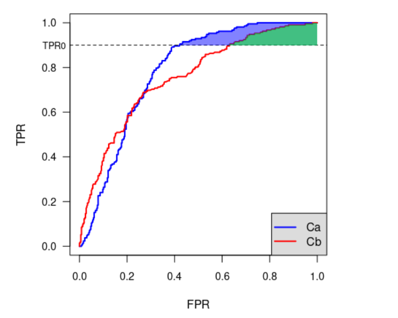

# <B>ISIC 2024 - Skin Cancer Detection with 3D-TBP</B>
---
> Identify cancers among skin lesions cropped from 3D total body photographs
<script src="https://polyfill.io/v3/polyfill.min.js?features=es6"></script>
<script src="https://cdn.jsdelivr.net/npm/mathjax@3/es5/tex-chtml.js"></script>

!!! info "概述"
    
    <font size = 3>
    在本次比赛中，您将开发基于图像的算法，通过从3D全身照片 (TBP) 中裁剪出的单个皮肤病变来识别经组织学确诊的皮肤癌病例。图像质量类似于特写智能手机照片，这些照片经常用于远程医疗。您的二元分类算法可用于无法获得专门护理的环境，并改善早期皮肤癌检测的分类。
    
    </font>

### 主要评分指标
---

Submissions根据```ROC```曲线下部分面积(```pAUC```) 进行评估，该部分面积高于 80% 真实阳性率 (TPR)，用于恶性样本的二元分类。（请参阅笔记本 ISIC pAUC-aboveTPR 中的实现。）

在```ROC```空间中，有些区域的```TPR```值在临床实践中是不可接受的。辅助诊断癌症的系统需要高度敏感，因此该指标侧重于```ROC```曲线下面积和 ```80% TRP```以上。因此，分数范围为 ```[0.0, 0.2]```。

以下示例中的阴影区域表示任意最小 TPR 下两种任意算法（Ca 和 Cb）的 ```pAUC```：




### 提交文件
---

对于测试集中的每个图像(```isic_id```)，您必须预测病变为恶性的概率 (```target```)。该文件应包含标题并具有以下格式：

```python
isic_id,target
ISIC_0015657,0.7
ISIC_0015729,0.9
ISIC_0015740,0.8
etc.
```

### 竞赛时间线
---

- 2024/6/26：开始日期。

- 2024/8/30：参赛截止日期。您必须在此日期之前接受比赛规则才能参赛。

- 2024/8/30：团队合并截止日期。这是参与者可以加入或合并团队的最后一天。

- 2024/9/6：最终提交截止日期。

- 2024/9/20：潜在获奖者发布解决方案代码和写作的截止日期。

除非另有说明，所有截止日期均为相应日期的 UTC 时间晚上 11:59。比赛组织者保留在必要时更新比赛时间表的权利。

### 代码要求
---

本次竞赛的提交必须通过 kaggle Notebooks 进行。为了在提交后激活“提交”按钮，必须满足以下条件：

- CPU Notebook <= 12 小时运行时间

- GPU Notebook <= 12 小时运行时间

- 禁用互联网访问

- 允许免费和公开的外部数据，包括预先训练的模型

- 提交文件必须命名为 ```submission.csv```

有关如何提交的更多信息，请参阅代码竞赛常见问题解答。如果您遇到提交错误，请查看代码调试文档。

### 数据集信息
---

数据集由带有附加元数据（```metadata```）的诊断标记图像组成。图像是 ```JPEG```。关联的```.csv```文件包含二进制诊断标签（目标）、潜在输入变量（例如 ```age_approx```、```sex```、```anatom_site_general``` 等）和其他属性（例如图像来源和精确诊断）

在这个挑战中，您要区分良性和恶性病例。对于每个图像 (```isic_id```)，您要分配病例为恶性的概率（```target```），范围为 ```[0, 1]```。

<B>SLICE-3D 数据集:从3D-TBP中提取的皮肤病变图像裁剪，用于皮肤癌检测</B>

为了模拟非皮肤镜图像，本次比赛使用来自3D全身摄影(TBP)的标准化裁剪病变图像。 Vectra WB360 是 Canfield Scientific 的一款 3D TBP 产品，可在一张宏观分辨率断层扫描图像中捕获完整的可见皮肤表面积。然后，基于 AI 的软件会在给定的 3D 捕获中识别单个病变。这允许捕获和识别患者的所有病变图像，并将其导出为单独的 15x15 毫米视野裁剪照片。该数据集包含 2015 年至 2024 年期间在九家机构和三大洲就诊的数千名患者子集中的每个病变。

以下是来自训练集的示例。“强标记图块”(```Strongly-labelled tiles```)是通过组织病理学评估得出的标签。“弱标记图块”(```Weak-labelled tiles```)是未经活检并被医生认为是“良性”的图块。

### 文件
---

- train-image/ - image files for the training set (provided for train only)

- train-image.hdf5 - training image data contained in a single hdf5 file, with the isic_id as key

- train-metadata.csv - metadata for the training set
- test-image.hdf5 - test image data contained in a single hdf5 file, with the isic_id as key. This contains 3 test examples to ensure your inference pipeline works correctly. When the submitted notebook is rerun, this file is swapped with the full hidden test set, which contains approximately 500k images.

- test-metadata.csv - metadata for the test subset

- sample_submission.csv - a sample submission file in the correct format

###  train-metadata.csv 中的特有的列
---
