# 🍥工程热力学(甲)

???+ summary "🌇Information"
    
    
    - 课程:工程热力学(甲) Engineering Thermodynamics(A)
    
    - 学分:4.0             课程代码: 59120030
    
    - 教师:俞自涛老师（主讲）       教材:《工程热力学(第三版)》(曾丹苓、敖越等) 

	- 推荐阅读：★★★《工程热力学精要分析及经典题精解》（何雅玲）

	- 成绩：5.0, 期末卷面94
    

>	无意中选到了慧能班的课,自己和俞老师还算比较熟悉,班上一共只有20多人所以听课体验还不错.期末考试占总评60%，有8个简答题+3个计算大题，总体难度一般，计算题侧重于最后11-14章的几个经典循环和6、7章的水蒸气与湿空气热力过程（看98上的回忆也有可能会考比较基础的第九章喷管），如果在考前能将前面几章的概念过一遍并且熟悉常考计算题型，应付考试就完全没问题了。

## 第一章 基本概念及定义
---
!!! note "知识梳理"  
    
    
    🌟概念:热力系统与外界,开口系与闭口系,绝热系,孤立系,平衡状态,状态参数(T、p),表压力与真空度,可逆过程与准静态过程,温标
    
    🔧计算:压力计(表压$p_e$)与真空计(真空度$p_v$),不同温标之间的相关计算

    

### 热力系统

热力系统是人为分割出来的作为热力学分析对象的<B>有限物质系统</B>,而与系统进行<B>质能交换</B>的物体为外界:

- 闭口系:与外界只有能量交换而没有物质交换(<B>物质不透过边界</B>),即控制质量$\frac{dm}{dt}=0$($C.M.$)

- 开口系:不仅有能量交换也有物质交换,即控制体积/控制体($C.V.$).
> 开口系与闭口系的区分在于<B>有没有质量越过边界</B>

- 绝热系:系统与外界没有热量交换

- 孤立系:既没有能量交换也没有物质交换(显然,孤立系必然为绝热系)
>孤立系不代表不发生作用,而是一切相互作用都发生在系统内部,如:将某一系统以及与之发生质能交换的外界看作一个大的系统,该联合系统即为孤立系统

- 可压缩系统:由可压缩流体构成的热力系统

- 简单可压缩系统:仅有<B>准静态体积变化功</B>(膨胀功、压缩功)的可压缩系统

状态参数→描述工质所处<B>平衡状态</B>的宏观物理量,反映的是大量分子运动的宏观平均效果(由此可知,状态方程是在平衡状态下,状态参数的关系式)

!!! note "平衡状态"
	
	在不受外界影响的条件下(系统与外界的不平衡势消失)系统的内部状态能始终保持不变(宏观变化全部停止,宏观性质不变)即为<B>平衡状态</B>

	><B>只有平衡状态的系统才能用状态参数来描述,只要有两个独立状态参数即可确定一个状态,所有其他状态参数均可表示为这两个状态参数的函数</B>

	

>当热力系经历一封闭状态变化过程而又恢复到原始状态时,其状态参数的变化为0,即:$\oint d \xi= 0$

- 基本状态参数:p, V, T

- 强度量(p, T):与物质的数量无关,不具有可加性,对<B>处于平衡状态的系统</B>才具有确定的数值

- 广延量/尺度量(V, U, H, S):与工质质量成正比,具有可加性

???+ advice "温度"
    
    温度是描述和判断系统与其他系统/外界处于<B>热平衡状态</B>的参数
    
    !!! note  "热力学温标(绝对温标)"
        热力系温标(K)将水的三相点温度定为基准点,规定为273.16K,而绝对零度为0K,而其他温标与热力系温标仅是零点取值的不同.
    
    <B>温标转换</B>:通过将新温标(线性)与已知温标(如热力学绝对温标)的尺度作对应,求得两种温标的线性关系,设某一温标($^oN$)在1个标准大气压下的冰点与汽点为$T_1^oN与T_2^oN$,已知热力学绝对温标(K),则
	
	\[	
		\frac{T_2 - T_1}{373.15 - 273.15} = \frac{ \{T_{N}\}_{^oN} - T_1 }{ \{T_{N}\}_{K} - 273.15 }          
	\]
	
	由此,即可求得两个温标之间的线性关系: $\{T_{N}\}_{^oN} = \frac{T_2 - T_1}{373.15 - 273.15} (\{T_{N}\}_{K} - 273.15)$
    
	

!!! note "压力"
    
	
	<B>单位面积</B>上所受的垂直作用力为压力(压强)[$Pa$],测量工质压力的仪器为压力计

	!!! note "压力计的工作原理"
		
		
		压力计测量的是工质绝对压力$p$与外界环境压力$p_b$之差,即相对压力/表压($p_e, p_v$),而绝对压力与大气压力无关,因此大气压力变化并不会影响绝对压力:

		\[
			\begin{equation}
			p=
			\begin{cases}
			p_b + p_e &, \text{ $ p > p_b $ } (p_e为表压力)   \\
			p_b - p_v &, \text{ $ p < p_b $ } (p_v为真空度)   \\
			\end{cases}
			\end{equation}
		\]

		

		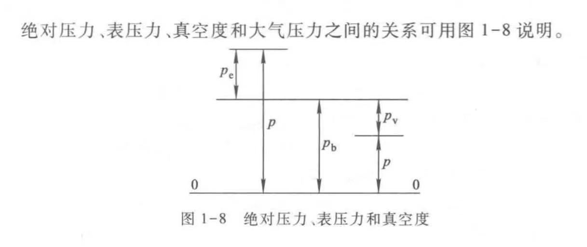

        

### 准静态过程
---
状态变化无限缓慢,弛豫时间很短而<B>无限接近平衡状态</B>的过程
><B>准静态条件</B>:气体工质与外界之间的温差/压力差为无限小,若还存在其他不平衡势则必须加上相应的无限小条件,<B>只有准静态过程在坐标图中可用连续曲线来表示</B>
	
\[
	即: p \rightarrow p_{out} + \frac{F}{A}, T \rightarrow T_{out}
\]

### 可逆过程: 准静态 + 无耗散:
---
准静态过程中可能会发生能量的耗散(比如外部机械器件之间摩擦力的作用),而可逆过程着眼于工质与外界作用产生的总效果,<B>不仅要求工质内部是平衡的,而且工质与外界可以无条件的逆复,该理想过程中不存在任何耗散(即返回原来状态并且在外界不留下任何变化)</B>

!!! note "过程热量的概念"
	"热量"[$J$]一词为热力系与外界之间仅仅由于温度不同而通过边界传递的能量,是用来度量传递能量多少的<B>过程量</B>,与状态参数(只取决于初、终态)不同,过程量与进行的路径有关,不能表示为状态参数的函数

	在<B>可逆过程</B>中,热量可表示为:
	
	\[
		\Delta q = Tds, q_{1-2} = \int _{1}^{2} Tds
	\]

	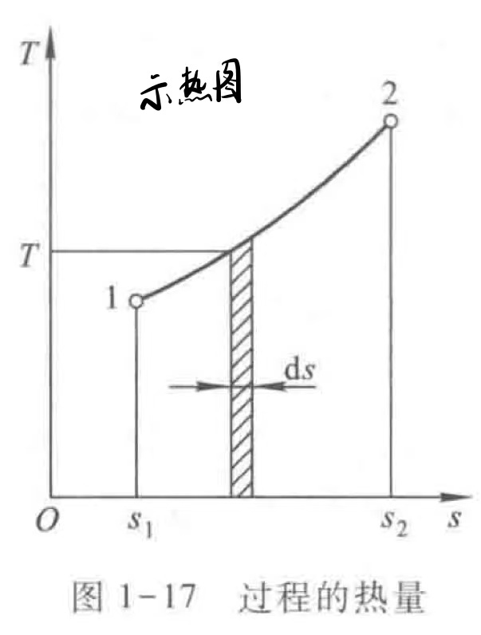{width=300px height=200px}

!!! info "可逆状态下的功"
	
	
	>功[$J$]与热量一样是能量传递的度量,是过程量,,不能表示为状态参数的函数($w \neq f(p,v)$),热力学规定对外做功为"+",外界对系统做功为"-"

	对于可逆过程中的体积变化功:

	\[
		\Delta W = Fdx = pAdx = pdV, W_{1-2} = \int _{1}^{2} pdV
	\]

	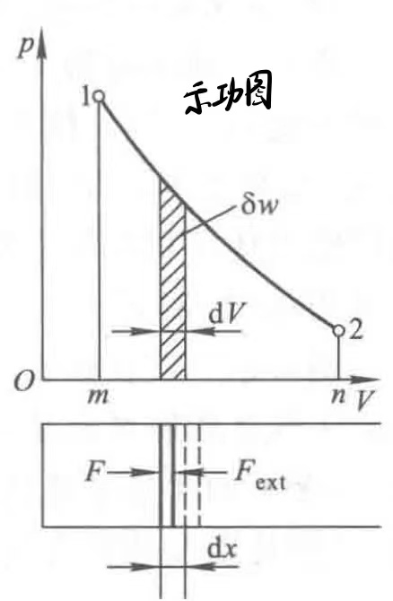{width=300px height=200px}
	

	!!! note "有用功"
		
		
		闭口系工质膨胀所做的功并不全部有用于膨胀,有一部分用来排斥大气和摩擦耗散,余下的才是有用功$W_{u}$,即

		\[
			W_u = W - p_{0} \Delta V - W_f
		\]

		若为可逆过程,则$W_f=0$,可得:

		\[
			W_u = \int _{1}^{2} pdV - p_{0} \Delta V 
		\]

		

1.为什么自由膨胀是不可逆过程？

## 第二章 能量与热力学第一定律
---
!!! note "知识梳理"  
    
    
    🌟概念:热力系第一定律,热力学能$U$,焓$H$的定义,推进功和流动功,开口系能量方程,稳定流动能量方程
    
    🔧计算:开口系能量方程,稳定流动能量方程 （不涉及一般开口系公式）

    

!!! note "推进功和流动功"

	
	推进功差$p_2 v_2 - p_1 v_1 = \Delta (pv)$是维系工质流动所需的功,称为流动功

	<B>流动功</B>可视为流动过程中系统与外界由于物质进出而传递的机械功
	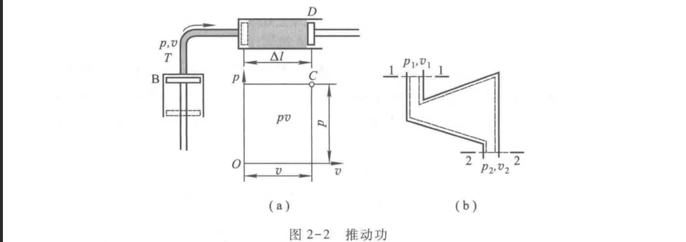
	
	

!!! note "焓的定义"

	
	焓[$J$]是系统中因引入/排除工质还改变的总能量(热力学能+推进功),即$H=U+pV$

	显然,焓是一个状态参数,有$\Delta h_{1-2} = \int_{1}^{2} dh = h_2 - h_1$, $\oint dh = 0$
	

### 热力学第一定律的表达式
---

根据热力学第一定律的原则,<B>系统中储存能量的增加 = 进入系统的能量 - 离开系统的能量</B>,对一个微元过程,有:

\[
	\delta Q = dU + \delta W
\]

对于可逆过程,有:

\[
	\delta Q = dU + pdV, Q = \Delta U + \int_{1}^{2}pdV
\]

对于循环,$\oint dU = 0$,有:

\[
	\oint \delta Q = \oint dU + \oint \delta W = \oint \delta W , 即Q_{net} = W_{net}
\]

可知在循环中,交换的净热量$Q_{net}$等于净功量$W_{net}$

### 开口系能量方程
---
如下图的开口系场景,在$d \tau$时间内的微元过程,$\delta m_1,dV_1 \rightarrow \delta m_2,dV_2$,系统从外界接收热量$\delta Q$,工质对机器设备做功$\delta W_i$(内部功),系统总能量增加$dE_{cv}$
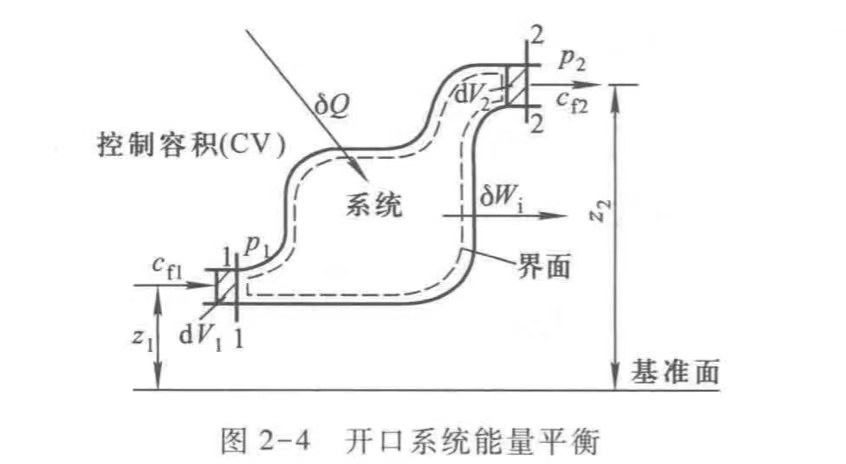

\[
	\begin{aligned}
	\delta Q &= dE_{cv} + (dE_2 + p_2 d V_2) - (dE_1 + p_1 d V_1) + \delta W_i   \\
	&\Rightarrow  dE_{cv} + (\frac{1}{2}c_{2}^{2} + gz_2) \delta m_2 - (\frac{1}{2}c_{1}^{2} + gz_1)\delta m_1 + \delta W_i    \;   (*)  \\
	\end{aligned}
\]

### 稳定流动能量方程
---
对于稳定流动,热力系任何截面上工质的所有参数都不随时间改变,因此必要条件为$\frac{dE_{cv}}{d \tau} = 0$, 因此上述(*)式变为:

\[
	\begin{aligned}
	\delta Q &= dH + \frac{1}{2} m dc^2 + mgdz + \delta W_i  \\
	\delta q &= dh + \frac{1}{2} dc^2 + gdz + \delta w_i  \\
	\end{aligned}
\]

其中$\delta w_i$代表1kg工质进入系统后在机器内部做的功

实际上将等式后三项的机械功称为技术功$W_t = \frac{1}{2} m dc^2 + mgdz + \delta W_i$,因此:

\[
	\begin{aligned}
	Q &= \Delta H + W_t  \\
	\delta Q &= dH + \delta W_t  \\
	\delta q &= dh + \delta w_t  \\
	\end{aligned}
\]

对于上述公式还可以继续变形,引入容积变化功:

\[
	\begin{aligned}
	W_{\text{容积变化功}} &= q - \Delta u =  \frac{1}{2} \Delta c^2 + g \Delta z + \Delta (pv)  \\
	&\Rightarrow W_t + \Delta (pv)         \\ 
	W_t &= W_{\text{容积变化功}} - \Delta (pv)  \\
	\text{对于可逆过程:} W_t &= \int_{1}^{2}pdV - \Delta (pv)  \\
	&= \int_{1}^{2}pdV - \int_{1}^{2}d(pv) = -\int_{1}^{2}vdp  \\
	 即为 \delta w_t &= -vdp  \\
	 \delta q &= dh + \delta w_t = dh -vdp  \\
	 \delta Q &= dH -Vdp  \\
	\end{aligned}
\]

1.体积变化功、技术功、轴功的关系？

## 第三章 熵与热力学第二定律
---
!!! note "知识梳理"  
    
    
    🌟概念:热力学第二定律的两种表述,卡诺循环,状态参数熵
    
    🔧计算:卡诺定理,熵方程

    

!!! info "热力学第二定律"

	
	
	- 克劳修斯表述(热量传递角度):不可能将热从低温物体传至高温物体而不引起其它变化。
	
	>强调"自发地,不付代价地"
	
	- 开尔文表述(热功转换角度):不可能从<B>单一热源</B>取热，并使之完全转变为有用功(全部对外做功)而不产生其它影响。(不可能制造一台机器,在循环动作中把一重物升高的同时使热源冷却),$Q_{热源放热} > \Delta W$

	>不可能将从热源取得的热全部转换为功,不可避免地将一部分传递给温度更低的低温热源

	<B>非自发过程(热转为功/低温向高温传热)的实现必须有一个自发反应(高温向低温传热/机械能转变为热能)作为补充条件</B>
	
	

### 卡诺定理
---
卡诺发现热机循环中的不可逆因素(耗散)都会引起功损失,因此假设一个理想的<B>可逆热机</B>,工质在热源相同温度下定温吸热,冷源相同温度下定温放热.

!!! note "卡诺循环(Carnot Cycle)"

	
	卡诺循环在$T_1与T_2$两个热源之间的正向循环,由两个可逆定温过程与两个可逆绝热过程组成.

	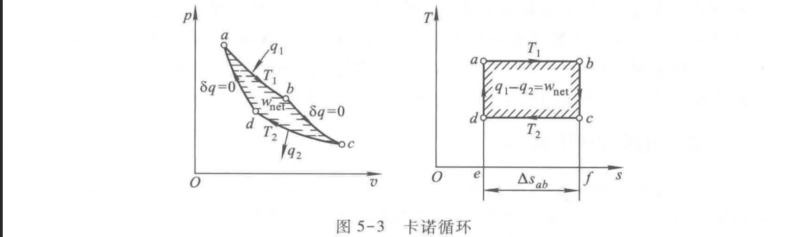

	根据循环特性,卡诺循环效率为:

	\[
		\eta_t = \frac{w_{net}}{q_1} = \frac{q_1 - q_2}{q_1} = 1 - \frac{q_2}{q_1} = 1 - \frac{T_2 \left| \Delta s_{c-d} \right| }{T_1 \left| \Delta s_{a-b} \right|} = 1 - \frac{T_2}{T_1}
	\]
	
	!!! info "卡诺循环的特点"
		
		
		- 卡诺循环的热效率仅仅取决于两个热源的温度,若提高高温热源$T_1$,降低低温热源$T_2$(提高工作热源温差),则能够提高循环热效率

		- 不能制造出在两个温度不同的热源间工作的热机，而使其效率超过同样热源见工作的可逆热机.(可逆热机效率最高)
		
		- 在两个固定热源之间工作的一切可逆热机具有相同的效率$\eta_t =1 - \frac{T_2}{T_1}$。

		- 若$T_1 = T_2$,则$\eta_t = 0$,说明热能产生动力一定要温差作为热力学条件,所以单一热源连续做功的机器(第二类永动机)不存在
		

	

### 制冷热泵循环
---

!!! note "逆卡诺循环"
	
	对于制冷机/热泵:从冷源吸热$Q_2$,向热源放热$Q_1$,性能系数$[COP]$(制冷系数/供暖系数)
	
	\[
		\begin{aligned}
		\text{耗功量:} W = Q_1 - Q_2 \\
		\end{aligned}
	\]

	

### 熵
---
!!! note "克劳修斯不等式"
	
	假设一个情景,某闭口系统在某过程中有热$\delta Q$与功$\delta W$穿过边界,可逆机从温度为$T_0$的恒温热源得到$\delta Q_R$,同时完成功量$\delta W_R$,最终将热$\delta Q$传递给任意温度为$T$的某一系统.完成的总功量为$\delta W_T = \delta W_R + \delta W$可知:

	\[
		\begin{aligned}	
		\delta W_R &= \delta Q_R - \delta Q   \\
		\delta W &= \delta Q - dU       \\
		\text{由于可逆机,}\frac{T_0}{T} &=\frac{\delta Q_R}{\delta Q}  \\
		\Rightarrow  \delta W_T &= \frac{T_0}{T} \delta Q - dU  \\
		\text{对封闭循环,}  \oint \delta W_T &= T_0 \oint \frac{\delta Q}{T} - \oint dU  \\
		\text{在循环中,单一热源不可能输出有用功:} \oint \delta W_T &= T_0 \oint \frac{\delta Q}{T} \le 0  \\
		\text{可得}\oint \frac{\delta Q}{T} &\le 0
		\end{aligned}	
	\]
		
	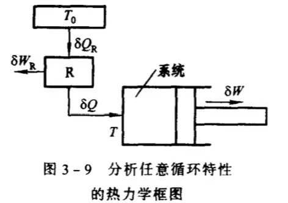{width=400px height=200px}

	>此不等式表明：所有可逆循环的克劳修斯积分值$\oint \frac{\delta Q}{T} = 0$，所有不可逆循环的克劳修斯积分值$\oint \frac{\delta Q}{T} < 0$。故本不等式可作为判断一切任意循环是否可逆的依据。应用克劳修斯不等式还可推出如下的重要结论:任何系统或工质经历一个不可逆的绝热过程之后，其熵值必将有所增大。

	
	

根据克劳修斯不等式,设$dS = \frac{\delta Q}{T}$,称S为熵(Entropy)[$kJ/K$],是一种尺度量,具有可加性

对于熵的计算,只能按照可逆路径来进行,有:

\[
	\begin{aligned}
	\oint dS = \oint \frac{\delta Q}{T} &= 0,        \\
	\Delta S = S_2 - S_1 &= \int_{1}^{2} \frac{\delta Q}{T} \\
	\end{aligned}	
\]

对于不可逆过程中的熵,则

\[
	\begin{aligned}
	dS &> \frac{\delta Q}{T},                           \\
	\int_{1}^{2}dS &= S_2 - S_1 > \int_{1}^{2} \frac{\delta Q}{T}        \\
	\end{aligned}	
\]

>不可逆过程熵的变化可以选择相同的初终态间的任意的可逆过程来计算

### 孤立体系(isolated system)熵增原理
---

由于在不可逆过程中$dS > \frac{\delta Q}{T}$,引入$\delta S_g = dS - \frac{\delta Q}{T}$来表示两者的差值,则:

\[
	\begin{aligned}
	dS = \delta S_g + \frac{\delta Q}{T},                           
	\begin{equation}
			\delta S_g =
			\begin{cases}
			= 0 (可逆过程)  \\
			> 0 (不可逆过程)   \\
			\end{cases}
	\end{equation}
	\end{aligned}	
\]

定义$\delta S_g$为熵产来度量<B>不可逆因素的存在而引起的熵的增加</B>,$d S_f = \frac{\delta Q}{T}$为由于与外界发生热交换，由热流引起的熵流

对于孤立系,$\delta Q = 0, \delta m = 0, \Rightarrow dS_f = 0$,因此:

\[
	\begin{aligned}
	\begin{equation}
			dS_{iso} = \delta S_g =
			\begin{cases}
			= 0 (可逆过程)  \\
			> 0 (不可逆过程)   \\
			\end{cases}
	\end{equation}
	\end{aligned}
\]

>上述推导说明,在孤立系内，一切实际过程(不可逆过程)都朝着使系统熵增加的方向进行，或在极限情况下(可逆过程)维持系统的熵不变，而任何使系统熵减少的过程是不可能发生的.

!!! note "孤立体系熵增原理"
	

	- 如果某过程进行的全部结果是使孤立系的总熵增加，它就可以单独进行而不需要补充条件，也就是说可以<B>自发地进行</B>.
	- 如果某过程进行的结果将使孤立系总熵减少，它必不可能单独进行。要使这种过程成为可能，必须<B>伴随进行一种熵增加的过程，使得两过程相伴进行的结果，孤立系的总熵增大</B>，或至少维持不变.
	- 不可逆过程进行的结果使系统的熵增加，同时使其作功能力下降，而使能量转变为较为无用的形式。
	- 能量在数量上并未变化，而作功能力减少的现象称为能量贬值。孤立体系的熵增意味着能量的  贬值，所以孤立体系熵增原理又称为<B>能量贬值原理</B>
	

### 熵方程
---

#### 闭口系统熵方程
---
在闭口系中,$dS_f$为熵流, 是换热量与热源温度的比值,表明外界换热引起的系统熵变(吸热为"+",放热为"-",绝热为0).

$\delta S_g$为熵产,是不可逆因素造成的系统熵增加,仅可能大于等于0

\[
	\begin{aligned}
	dS = \delta S_g + \frac{\delta Q}{T} = \delta S_g + dS_f ,                           
	\end{aligned}	
\]

在闭口绝热系中,则有$dS_f = 0$:

\[
	\begin{aligned}
	dS = \delta S_g \geq 0                     
	\end{aligned}	
\]

可知,在闭口不可逆绝热系中,由于过程中仍然存在不可逆因素而产生不可避免的耗散,使机械功转化为热能被工质吸收,对熵变做出贡献.

#### 开口系统熵方程
---

在开口系中,系统与外界交换质量将引起系统熵的改变,因为物质迁移而引起熵变的熵流为<B>质熵流</B>,定义为$\delta S_m = d(ms)$

\[
	\begin{aligned}
	\begin{equation}
	dS_{C.V.} = \delta S_{g.C.V} + \delta S_f + \delta S_m = \delta S_{g} + \frac{\delta Q}{T} + d(ms) = 
		\begin{cases}
			= \delta S_{g} + \frac{\delta Q}{T} + mds =0 (稳定流动过程)\\
			= \frac{\delta Q}{T} + mds =0 (可逆稳定流动过程)\\
			\Rightarrow S_1 = S_2 (可逆绝热稳定流动过程) \\
		\end{cases}  
	\end{equation}
	\end{aligned}	
\]

1.克劳修斯积分式的运用？
2.孤立体系熵增的运用？
3.卡诺循环→有用功

## 第四章 热力学一般关系
---

!!! note "知识梳理"
    

    🌟概念:简单可压缩系统的五个基本状态参数(p,v,T,u,s), 三个可测参数的状态方程$F(p, v, T)=0$, <B>热力学一般关系</B>,组合状态参数(h, f, g)

    🔧计算:

    

>简单可压缩系统的特点:存在两个独立的状态参数,其状态函数为二元函数

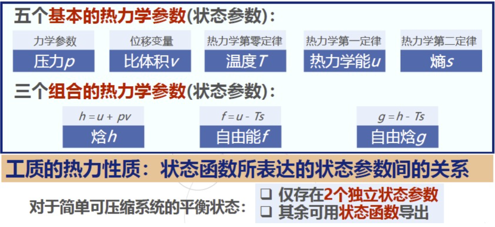

根据热力学第一定律与第二定律, <B>简单可压缩工质在可逆变化中的能量平衡($F(u, v, s)=0$的全微分形式)</B>有:
     
\[
        \begin{aligned}
        &du = Tds - pdv                   \\
        \small 即:& \small热力学能 = 吸热量 - 做功量         \\                             
        &dh = Tds + vdp (焓h = u + pv) \\
		&df = -Tds - vdp (引入自由能f = u - Ts)                                    \\
        &dg = -sdT +vdp  (引入自由焓g = h - Ts)                                    \\
        \end{aligned}
\]

即通过Legendre变换,可得$F(h,s,p)=0$, $F(f,T,v)=0$, $F(g,T,p)=0$的全微分表达式.
再对上述的等式做一阶偏微商,有:

\[
        \begin{aligned}
        &( \frac{\partial u}{\partial s} )_v = (\frac{\partial h}{\partial s})_p = T                 \\
        -&(\frac{\partial u}{\partial v} )_s = -(\frac{\partial f}{\partial v})_T = p                                   \\
        &( \frac{\partial h}{\partial p} )_s = (\frac{\partial g}{\partial p})_T = v                 \\
        -&(\frac{\partial f}{\partial T} )_v = -(\frac{\partial g}{\partial T})_p = s                                   \\
        \end{aligned}
\]

由此可知, 对于$F(h,s,p)=0$, $F(f,T,v)=0$, $F(g,T,p)=0$,只需要知道任意一个关系式就能得到所有的状态函数

>例如:已知$F(g,T,p) = 0$,以(T,p)为独立变量,将$g(p,T)$对p求偏导得到$v(T,p)$,对T求偏导得到$s(T,p)$,而$h(p,T) = g(p,T) + Ts(p,T), u(T,p) = h(p,T) - pv(p,T)$即可得出工质热力平衡性质的所有信息,这些热力状态函数称为<B>特性函数</B>.

因为二元函数的二阶混合偏微商与求导顺序无关,即\( \frac{\partial}{\partial y} (\frac{\partial z}{\partial x})_{y} = \frac{\partial}{\partial x} (\frac{\partial z}{\partial y})_{x}  \),则可得上述特性函数的二阶混合偏微商关系式(maxwell关系式),如:

\[
	\begin{aligned}
	\frac{\partial}{\partial T} (\frac{\partial g}{\partial p})_T &= \frac{\partial}{\partial p} (\frac{\partial g}{\partial T})_p \\
	(\frac{\partial v}{\partial T})_{p} &= - (\frac{\partial s}{\partial p})_{T}   \\
	\frac{\partial}{\partial T} (\frac{\partial f}{\partial v})_T &= \frac{\partial}{\partial v} (\frac{\partial f}{\partial T})_v \\
	(\frac{\partial p}{\partial T})_{v} &= (\frac{\partial s}{\partial v})_{T}   \\
	\end{aligned}
\]

>特性函数的二阶混合偏微商关系将不可测的熵与可测参数联系在一起

如上述的某些偏微商,具有明确的物理意义,将这些特殊的偏微商定义为<B>热系数</B>:

- 工质在定压条件下(因为p同样会影响体积,通过定压条件排除)的<B>热膨胀/体膨胀系数系数$[K^{-1}]$</B>: 

\[
        \alpha_{v} = \frac{1}{v} (\frac{\partial v}{\partial T})_{p}
\]

- 工质在等温条件下的<B>等温压缩率</B>$[Pa^{-1}]$:

\[
        \kappa_T  = - \frac{1}{v} (\frac{\partial v}{\partial p})_T
\]

- 压力的温度系数$\beta$

\[
	\beta = \frac{1}{p} (\frac{\partial p}{\partial T})_{v}		
\]

可得:

\[
	(\frac{\partial p}{\partial T})_{v} (\frac{\partial T}{\partial v})_p (\frac{\partial v}{\partial p})_T = -1	
\]

即得三个热系数之间的关系式:

\[
	\frac{\alpha_{v}}{\kappa_T \beta} = p
\]

- 工质在可逆绝热过程中的压缩性质---绝热压缩系数$\kappa_s$[$Pa^{-1}$]:

\[
	\kappa_s = - \frac{1}{v} (\frac{\partial v}{\partial p})_{s}	
\]

<B>比热容</B>
---

以$(T,v)$为独立变量的热力学能函数对温度的偏微商$(\frac{\partial u}{\partial T})_{v}$具有重要意义,定义为工质的比定容热容$c_V$[$J/(kg·K)$],即在体积不变的情况下,热力学能对温度的偏微商:

\[
	c_V = (\frac{\partial u}{\partial T})_{v}
\]

对于准静态平衡定容过程中,有$\delta q = d u$,因此$c_V$表示<B>单位质量的工质温度升高1K所吸收的热量</B>则有:

\[
	c_V = (\frac{\delta q}{d T})_{v}
\]

定义在定压条件下,焓对温度的偏微商微比定压热容$c_p$:

\[
	c_p = (\frac{\partial h}{\partial T})_{p}
\]

同样,在准静态平衡定压过程中,$c_p$指<B>单位质量的工质温度升高1K所吸收的热量</B>,可表示为:

\[
	c_p = (\frac{\delta q}{d T})_{p}
\]

<B>绝热节流系数$\mu_{J}$</B>:在焓值不变的情况下工质温度随压力的变化率[$K/Pa$]

\[
	\mu_{J} = (\frac{\partial T}{\partial p})_{h}
\]

<B>热力学能、焓熵的微分式</B>
---

- 热力学能$u(T,v)$的全微分表达式:

\[
	\begin{aligned}
	du &= (\frac{\partial u}{\partial T})_{v} dT + (\frac{\partial u}{\partial v})_{T} dv \\
	&= c_V dT + (T(\frac{\partial s}{\partial v})_{T} - p(\frac{\partial v}{\partial v})_{T})dv \\
	&= c_V dT + [T(\frac{\partial p}{\partial T})_{v} - p] dv \\
	\end{aligned}
\]

- 焓$h(T,p)$的全微分表达式:

\[
	\begin{aligned}
	dh &= (\frac{\partial h}{\partial T})_{p} dT + (\frac{\partial h}{\partial p})_{T} dp \\
	&= c_p dT + (T(\frac{\partial s}{\partial p})_{T} + v(\frac{\partial p}{\partial p})_{T})dp \\
	&= c_p dT - [T(\frac{\partial v}{\partial T})_{p} - v] dp \\
	\end{aligned}
\]

- 对于熵$s(T,v)$和$s(T,p)$的全微分形式:

\[
	\begin{aligned}
	ds &= (\frac{\partial s}{\partial T})_{v} dT + (\frac{\partial s}{\partial v})_{T} dv  \\
	&= \frac{c_V}{T} dT + (\frac{\partial p}{\partial T})_{v} dv \\
	ds &= (\frac{\partial s}{\partial T})_{p} dT + (\frac{\partial s}{\partial p})_{T} dp  \\
	&= \frac{c_p}{T} dT - (\frac{\partial v}{\partial T})_{p} dp \\
	\end{aligned}	
\]

<B>热系数之间的一般关系</B>
---

- (一) $(\frac{\partial c_V}{\partial v})_{T} 、(\frac{\partial c_p}{\partial p})_{T}$与状态方程间的关系

由上述热力学能与焓的微分式可得:

\[
	\begin{aligned}
	(\frac{\partial c_V}{\partial v})_{T} &= T (\frac{\partial^2 p}{\partial T^2})_{v} \\
	(\frac{\partial c_p}{\partial p})_{T} &= - T (\frac{\partial^2 v}{\partial T^2})_{p} \\
	\end{aligned}	
\]

当给出较准确的状态方程以及某一压力$p_0$下测得的比定压热容数据$c_{p0}(T)$,可以通过积分算得函数关系$c_p(T,p)$:

\[
	c_p(T,p) = c_{p0}(T) - T \int_{p_0}^{p} (\frac{\partial^2 v}{\partial T^2})_{p} dp  		
\]

- (二)比热容差($c_p - c_v$)与状态方程关系

\[
	c_v = T(\frac{\partial s}{\partial T})_{v}           
\]

\[
	c_p - c_v = T (\frac{\partial v}{\partial T })_{p} (\frac{\partial p}{\partial T})_{v} 	= T v \frac{\alpha_V ^2}{\kappa_T}	> 0
\]

>由上式可知,$c_p > c_v$ 恒成立.

- 绝热节流系数的一般关系式

$\mu_j$是在焓值不变时($dh = 0$)温度对压力的偏微商:

\[
	\mu_j = (\frac{\partial T}{\partial p})_{h}= \frac{1}{c_p} [T (\frac{\partial v}{\partial T })_{p} - v] =\frac{v}{c_p} (T \alpha_V - 1)
\]

1.maxwell关系式的记忆
2.焦耳-汤姆孙系数的故事、真实气体

## 第五章 气体的热力性质
---

!!! note "知识梳理"
    

    🌟概念:理想气体,理想气体状态方程,

    🔧计算:理想气体状态方程 （不涉及实际气体的性质）

    

!!! info "理想气体"
	
	理想气体性质指的是<B>忽略分子自身占有的体积和分子间相互作用力</B>对其他宏观热力性质的影响,在工程上(通常的工作参数范围中),将实际气体工质当作理想气体处理有足够的计算精度.
	
	理想气体状态方程(3个可测状态参数$p,v,T$的函数关系$F(p,v,T)=0$):<B>Clapeyron方程</B>

	\[
		pV = nRT = m R_g T
	\]
	
	> $R_g = \frac{R}{M}$:气体常数[$J/(kg·K)$],$R$为摩尔气体常数$8.314 J/(mol·K)$
	
	变式:
	
	\[
		\begin{aligned}
		pv = R_g T,&(\text{单位质量(1kg)形式})                   \\
		pV_m = RT,&(\text{单位mol形式,} V_m=V/n)                    \\
		p M = \rho R T,&(\text{密度式 })
		\end{aligned}
	\]
	
	

!!! note "比热容换算"
	
	1kg物质的热容量为比热容$c$,1mol的热容量为摩尔热容$C_m$,1$m^3$标准状态下气体的热容量为体积热容.
	
	\[ 
		\begin{aligned}
		C_m = Mc &= MvC`  \\
		C_{p,m} - C_{v,m} &= R \\
		\end{aligned}   
	\]
	
	

根据理想气体方程,可得对于理想气体:

\[
	\begin{aligned}
	\alpha_V = \beta = \frac{1}{T} \\
	\kappa_T = \frac{1}{p}	\\	
	(\frac{\partial c_v}{\partial v})_T = T (\frac{\partial^2 p}{\partial T^2})_v = 0 \\
	(\frac{\partial c_p}{\partial v})_T = -T (\frac{\partial^2 v}{\partial T^2})_p = 0 \\
	c_p - c_v = \frac{Tv \alpha_v^2}{\kappa_T} = \frac{pv}{T} = R_g \\
	\mu_j = \frac{v}{c_p}(T \alpha_T - 1) = 0 \\
	\end{aligned}
\]

>理想气体比热容为温度的单值函数,其差值为恒定值

对于热力学能u与焓h的特性,均为温度T的单值函数:

\[
	\begin{aligned}
	(\frac{\partial u}{\partial v})_T = T (\frac{\partial p}{\partial T})_v - p = \frac{R_g T}{v} - p = 0 \Rightarrow du = c_v dT\\
	(\frac{\partial h}{\partial p})_T = -T (\frac{\partial v} {\partial T})_p + v = 0  \Rightarrow  dh = c_p dT\\
	\end{aligned}
\]

对于理想气体熵方程,以分别以(T,v),(T,p)为独立变量:

\[
	ds =c_v \frac{dT}{T} + R_g \frac{dv}{v}=c_p \frac{dT}{T} - R_g \frac{dp}{p}
\]

放入过程中:

\[
	\begin{aligned}
	\Delta u_{1-2} =& c_v \Delta T_{1-2}      \\
	\Delta h_{1-2} =& c_p \Delta T_{1-2}       \\
	\Delta s_{1-2} = s_2 - s_1 = c_v \ln{\frac{T_2}{T_1}} +& R_g \ln{\frac{v_2}{v_1}} = c_p \ln{\frac{T_2}{T_1}} - R_g \ln{\frac{p_2}{p_1}}
	\end{aligned}
\]

<B>平均比热容</B>
---

根据定义:'

\[
	\begin{aligned}
	c_v \lvert_{t_1}^{t_2} = \frac{\int_{t_2}^{t_1} c_v dt}{t_2 -t_1} = \frac{\Delta u_{1-2}}{t_2 -t_1} = \frac{c_v \lvert_0^{t_2} t_2 - c_v \lvert_0^{t_1} t_1 }{t_2 -t_1}	\\
	c_p \lvert_{t_1}^{t_2} = \frac{\int_{t_2}^{t_1} c_p dt}{t_2 -t_1} = \frac{\Delta h_{1-2}}{t_2 -t_1} = \frac{c_p \lvert_0^{t_2} t_2 - c_p \lvert_0^{t_1} t_1 }{t_2 -t_1}	\\
	\end{aligned}
\]

>根据定义式,平均比热容与初态温度$t_1$与终态温度$t_2$有关

## 第六章 蒸汽的热力性质
---

!!! note "知识梳理"
    

    🌟概念:热力学的平衡判据、吉布斯相率、克劳修斯-克拉贝龙方程、解释水的反常饱和固-液线、蒸汽热力性质，蒸汽的常见热力过程（重点:蒸汽定压发生过程的T-s图）

    🔧计算:蒸汽干度x,常用的蒸汽热力过程（定压、绝热...）（一般来说不考察化学势的相关内容）

    

<B>热力学判据</B>
---

在一定的约束条件下，系统因为各种不平衡势差而朝着一定方向变化，当各种势差减小为零时系统状态不再变化（即达到平衡）：

!!! note "孤立体系熵增原理"
	
	
	即平衡的熵判据，表述为“孤立系处于平衡状态时，熵具有最大值”：
	
	\[ 
		dS_{iso} \geq 0
	\]
	
	当上述式子取到等号时，表明系统的熵增到达最大值，即可判断系统不再变化（处于平衡态）

	

!!! note "任意封闭体系的平衡判据"
	
	对于处于$T_0,p_0$的环境下的任意封闭体系，设功势函数为$\Psi = U + p_0 V - T_0 S$，有:

	\[ 
		\begin{aligned}
		-(du + p_0 v - T_0 ds) &\geq \delta w_u \\
		- \psi &\geq \delta w_u \\
		\end{aligned}
	\]
	
	即系统完成的有用功总小于等于其功势函数的减小值，假设外界不对系统完成有用功（$\delta w_u \geq 0$）,则：
	
	\[ 
		\begin{aligned}
		-(du + p_0 v - T_0 ds) &\geq \delta 0 \\
		\psi &\leq \delta w_u \\
		\end{aligned}
	\]

	当上述式子表明:系统状态总是朝着功势函数$\Psi$减小的方向进行变化，当取到等号时，系统不平衡势消失，即为处于平衡态

	!!! info "定温定容下的自由能判据（F）"
		
		在$dT = 0,dv = 0$条件下，有：

		\[ 
			\begin{aligned}
			(du - d(Ts))_{T,v} &\leq 0 \\
			(df)_{T,v} &\leq \\
			\end{aligned}
		\]
		
		即：在定温定容条件下，封闭系统朝自由能$F$减小的方向自发进行，平衡时自由能最小（自由能判据）
		

	!!! info "定温定压下的自由能焓判据（G）"
		
		在$dT = 0,dp = 0$条件下，有：

		\[ 
			\begin{aligned}
			(du + d(pv)- d(Ts))_{T,p} &\leq 0 \\
			(dg)_{T,p} &\leq \\
			\end{aligned}
		\]
		
		即：在定温定压条件下，封闭系统朝自由焓$G$减小的方向自发进行，平衡时自由焓最小（自由焓判据）
		

	

<B>吉布斯相率</B>
---

对于无化学反应的系统，有吉布斯相率来得出系统中独立强度参数的数目（自由度）：

\[
	I = C - P + 2
\]

其中，I为系统中独立强度参数的数目，C为系统包含的组元数，P为系统包含的相数。

<B>一般来说，本课程考察单一物质（单元，$C = 1$）的三种常见情形<B>：

- 对于单元单相系（如过热蒸汽、未饱和水）：系统的各种强度参数确定于两个独立参数，如$p$与$T$，即$I = 2$。

- 对于单元两相系（湿蒸汽）：共存的两相处于饱和温度与饱和压力，由于$p_s$与$T_s$并不相互独立，因此该两相系统的各种强度参数确定于一个独立参数，即$I = 1$。

- 对于单元三相系：有与单一物质的三相点完全确定，因此三相平衡的单元系没有可变的独立强度参数，即$I = 0$。

- 特殊：对于湿饱和蒸汽，处于两相区，需要额外引入干度$x = \frac{m_g}{m_g + m_f}$来描述湿蒸汽中液体与气的比例关系，因此需要两个独立变量，，即$I = 2$。

（单元系不存在四种以上的不同相平衡的状态）

<B>克劳修斯-克拉贝龙方程</B>
---
假设$p_s$为饱和压力，$T_s$为饱和温度，$v_{\alpha}, v_{\beta}$, $s_{\alpha}, s_{\beta}$分别为两相的比体积与比熵，$r$为相变潜热,有：

\[
	\begin{aligned}
	\frac{dp_s}{dT_s} &= \frac{s_{\beta} - s_{\alpha}}{v_{\beta} - v_{\alpha}}  \\
	&= \frac{r}{T_s (v_{\beta} - v_{\alpha})} \\
	\end{aligned}
\]

该式表示的斜率即为p-T图上对应两相的饱和曲线斜率

!!! note "p-T图上水的反常斜率"
	

	对于一般的吸热相变过程是由比体积小的相转变为比体积大的相($v_{\alpha} < v_{\beta}$),则上述斜率一般为正，但对于某些特殊物质（如 <B>水<B> ）,固态水（冰）在熔融过程中比体积变小，因此水的熔解线斜率为负值
	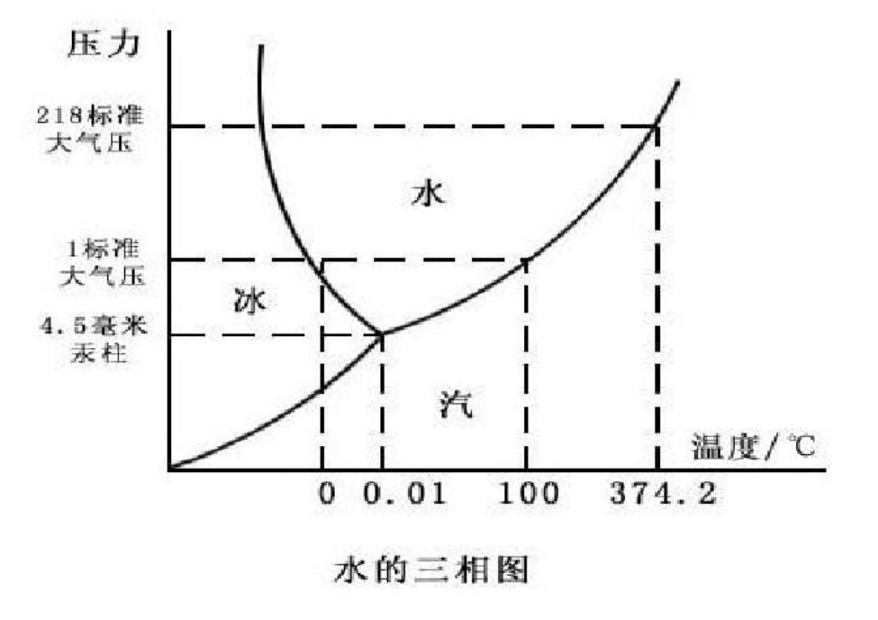
	

<B>★★★蒸汽定压发生过程</B>
---

蒸汽在定压加热设备中，经历未饱和液体 ——→ 饱和液体 ——→ 湿饱和蒸汽 ——→ 干饱和蒸汽 ——→ 过热蒸汽的过程，该过程由如以下T-s图表示：

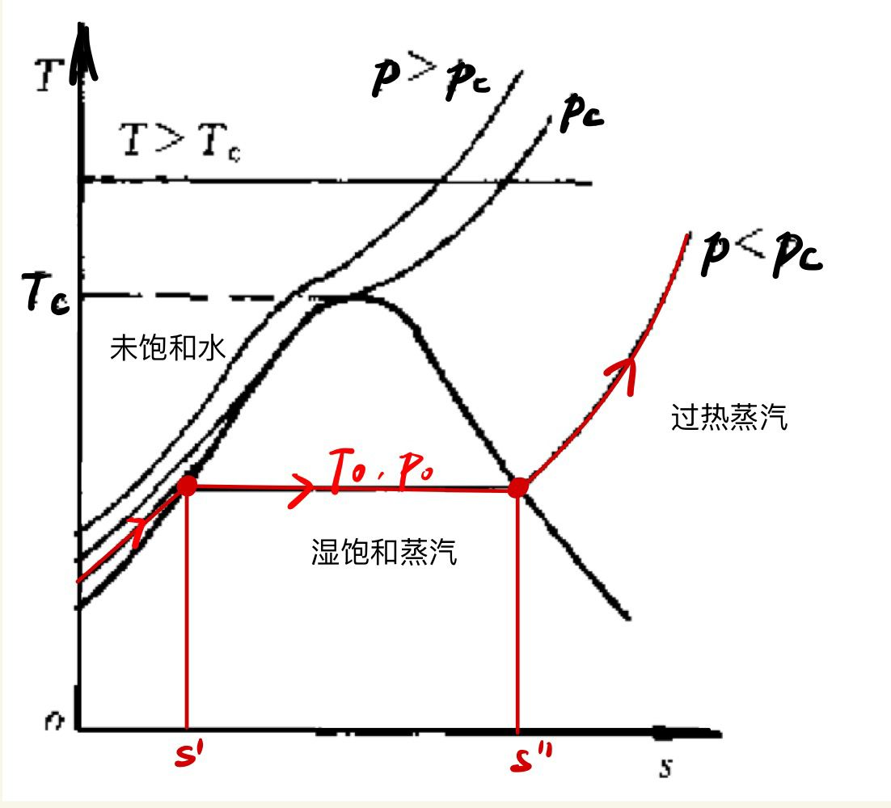

<B>考试中，重要的参数来源于卷面给出的表格<B>，因此当不清楚工质状态时，先查饱和表中对应的$p_s,T_s$来判断工质的状态，在从过热表/饱和表中查询对应的状态。

对于处于两相区的湿饱和蒸汽，需要先根据给出的参数来确定其干度(y为某一比参数)：

\[
	x = \frac{m_g}{m_g + m_f} = \frac{y - y'}{y" - y'}
\]

通过所得的干度$x$，可得湿蒸汽的其余参数:

\[
	\begin{aligned}
	h &= h' + x(h" - h') \\
	v &= v' + x(v" - v') \\
	s &= s' + x(s" - s') \\
	\end{aligned}
\]

!!! note "湿蒸汽的绝热过程"
	
	若不考虑损耗，水蒸气在汽轮机、水泵中的膨胀、压缩过程可以看作可逆绝热过程（定熵过程），如下图，因为$q = 0 = \Delta h + w_t$:
	
	\[
		w_t = - \Delta h = h_1 - h_2	
	\]
	
	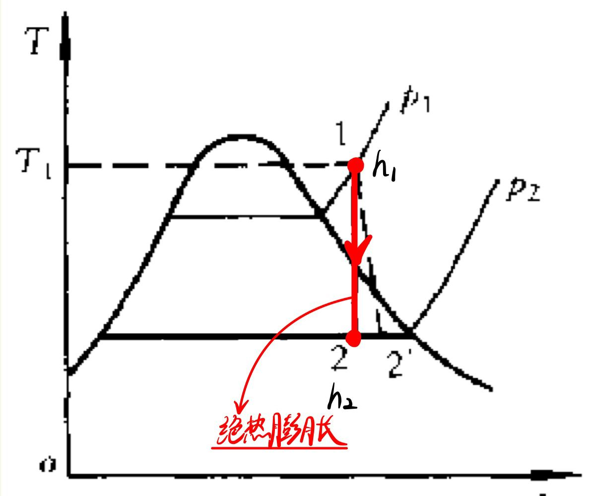

	若该过程存在损耗，即不可逆过程存在熵增（如图1-2'过程线）则实际技术功为：

	\[
		w_t ' = - \Delta h = h_1 - h_{2'} < w_t	
	\]

	为了反映绝热膨胀的不可逆程度(对外做功有损失，显然$w_t'< w_t$)，我们用汽轮机相对内效率$\eta_T$来表示：

	\[
		\eta_T = \frac{w_t '}{w_t} = \frac{h_1 - h_{2'}}{h_1 - h_2}
	\]

	由此可反过来求过程最后的$h_{2'}$，也可得过程的熵产$\delta s_g$与有效能损失$i$,设环境温度为$T_0$:

	\[
		\begin{aligned}
		h_{2'} =& h_1 + \eta_T (h_1 - h_2) \\ 
		\Delta s_g &= s_{2'} - s_2 \\
		i =& T_0 \Delta s_g = T_0 (s_{2'} - s_2) \\
		\end{aligned}
	\]

	

## 第七章 理想气体混合物与湿空气
---

!!! note "知识梳理"
    

    🌟概念:湿空气温度（干球，湿球，露点，绝热饱和），焓-湿图（h-s）

    🔧计算:含湿量d、相对湿度$\phi$、比焓、常用的湿空气过程（加热/冷却、绝热加湿、冷却去湿...）

    

湿空气是干空气与水蒸气的混合物，可以将其看作<B>理想气体混合物<B>,适用理想气体的状态方程等，区别是湿空气可能在热力过程中<B>出现凝结水<B>

<B>干球，湿球温度、绝热饱和温度$T_w$和露点温度$T_d$
---

对于湿蒸汽中的水蒸气分压$p_v$，存在一个临界值，即饱和压力$p_s(p_v \leq p_s)$,对应的状态为饱和湿空气，当$p_v$达到$p_s$时，水蒸气便会出现凝结现象，使得湿空气中的水含量减少。

- 干球温度$T$，指的是使用普通温度计测得的湿空气的温度$T$;

- <B>湿球温度<B>，指的是使用湿纱布包裹的湿球温度计测得的湿纱布中水的温度：若环境湿空气未饱和，则湿纱布上的水将不断蒸发，吸收汽化潜热，使得湿球温度下降与周围空气形成温差，导致环境向湿球传热，进而达到吸放热的一个稳定状态（不是平衡状态），<B>实验可知湿球温度=绝热饱和温度$T_w$<B>

- 露点温度$T_d$是指当前湿空气中水蒸气分压$p_v$所对应的饱和温度($p_v = p_s$),对于未饱和空气，需要在$p_v$不变的情况下进行降温($T$⬇，$p_s$⬇)才能达到，显然$T_d < T$。反之，当水蒸气分压$p_v$增大时，对应的露点温度$T_d$随之增大。

- 绝热饱和温度$T_w$,实在绝热条件下向湿空气中加入水分，并且使之蒸发而到达饱和状态时对应的温度。因为绝热条件下蒸发吸热，导致$T_w < T$。

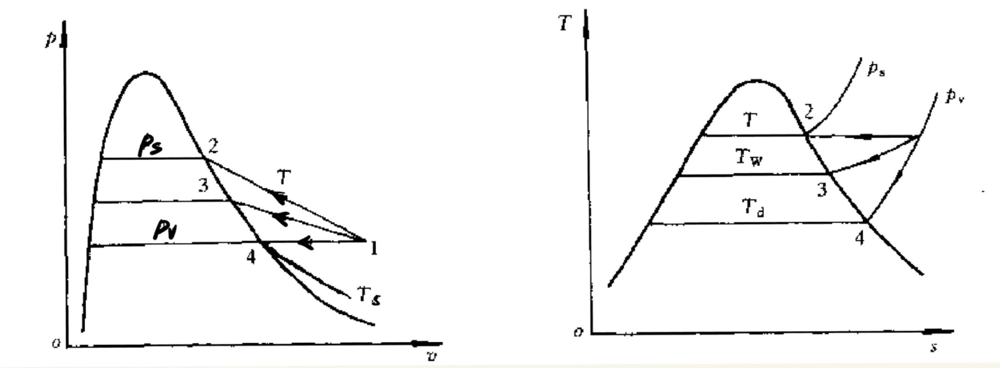

综上可知，对于未饱和空气，有$T_d < T_w < T$；对于饱和空气，则$T_d = T_w = T$。

<B>湿空气的重要参数（以干空气为单位）<B>
---

相对湿度$\phi$是湿空气中水蒸气分压力$p_v$与该温度对应的饱和压力$p_s$之比,能够反映湿空气的干湿程度：

\[
	\phi = \frac{p_v}{p_s}
\]

含湿量$d(kg/kg(A))$是单位质量干空气中所含有的水蒸气质量：

\[
	d = \frac{m_v}{m_a} = 0.622\frac{p_v}{p - p_v} = 0.622\frac{\phi p_s}{p - \phi p_s} 
\]

湿空气的比焓$h=$干空气焓与湿空气焓之和,是相对于单位质量的干空气的比参数,因此要在式子中分别体现干空气的焓($h_a$)与湿空气焓($dh_v$):

\[
	h = h_a + d h_v 
\]

> 考试常用${h}_{kJ/kg} = 1.005{t}_{℃} + d (2501 + 1.86{t}_{℃}) kJ/kg(A)$,注意代入该式的温度$t$单位为摄氏度

<B>焓湿图（h-s）★★★<B>
---

> 注意:h-s图需要在确定总压力$p$不变的情况下才能画出

在分析解题思路时，借助焓湿图可以清楚地表示湿空气的状态变化，是绝对需要清楚掌握的内容（对湿热比$\epsilon$的考察相对较少）

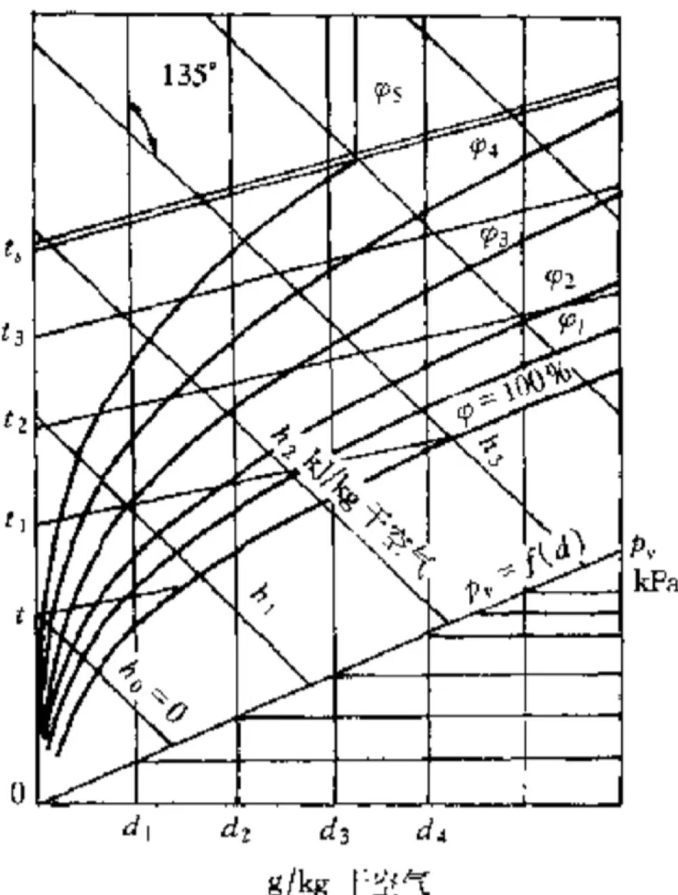

从上图可知：

- 定d线与一个$p_v$值对应，而$t_d$仅确定与$p_v$,因此定含湿量线与定$p_v$线、定露点温度$t_d$线相互对应；

- 定h线与$\phi=100%$的交点能确定该焓值下的绝热饱和温度$t_w$，因此定焓线与定绝热饱和温度$t_w$线一一对应；

!!! note "加热/冷却过程"
	
	加热/冷却过程为定含湿量过程，沿定d线进行，加热时朝焓增方向进行（向上），反之向下：

	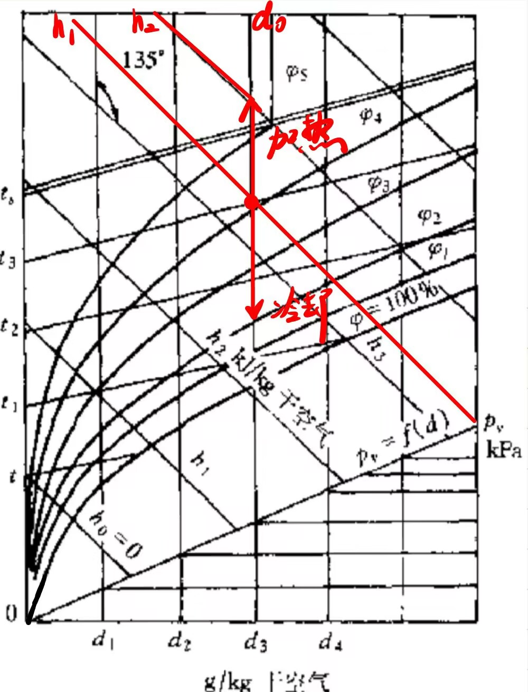

	对这个过程加入/放出的热量有：

	\[
		q = \Delta h = h_2 - h_1
	\]

	

!!! note "绝热加湿过程"
	
	在绝热条件下向空气加入水并且蒸发，吸收汽化潜热使得温度降低，该过程可以近似沿着定h线进行（向$\phi=100%$线靠近）：

	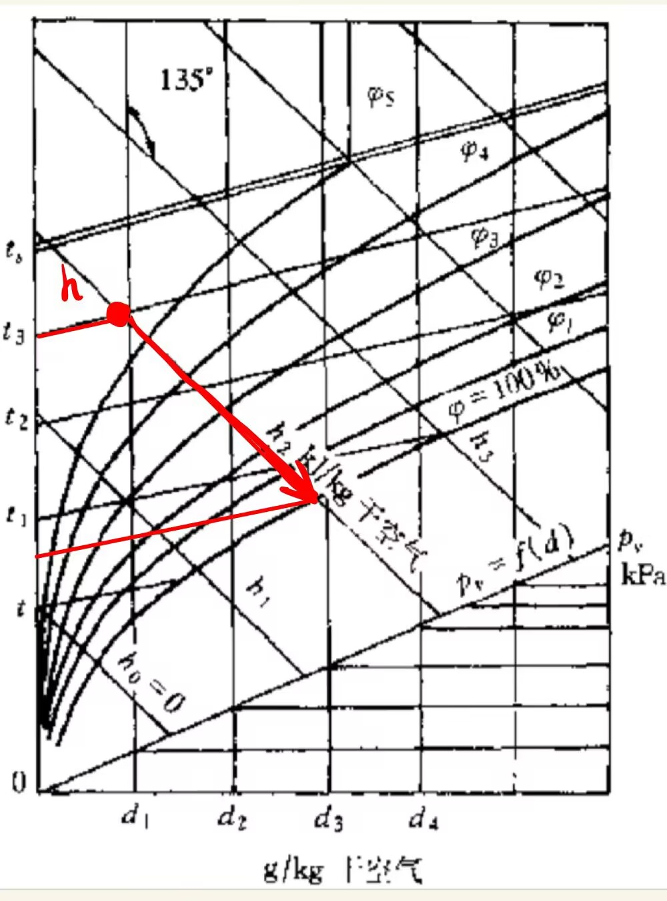

	对这个过程的能量守恒式有：

	\[
		h_1 + (d_2 - d_1) h_w = h_2
	\]

	其中$h_w$为加入时温度的水焓
	

!!! note "冷却去湿过程"
	
	湿空气线冷却到露点$T_d$后继续冷却析出水，该过程先沿着定d线再沿着$\phi=100%$线向下：

	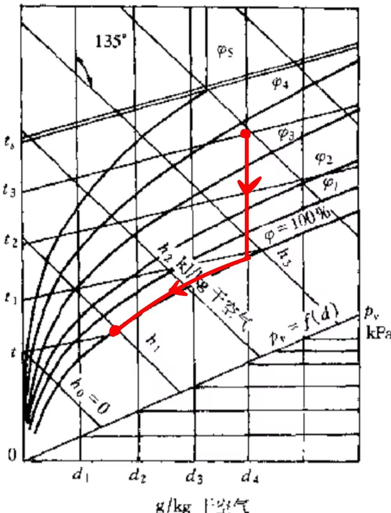

	对这个过程的能量守恒式有：

	\[
		q = h_1 - (h_2 + (d_1 - d_2)h_w)
	\]

	其中$h_w$为过程终点温度的水焓
	

!!! note "干湿球温度计测相对湿度$\phi$的工作原理"
	
	假设一个绝热饱和过程，通过加湿由不饱和状态1→饱和状态2，有：

	\[
		h_{a,1} + d_1 h_{v,1} + (d_2 - d_1)h_w = h_{a,2} + d_1 h_{v,2}
	\]

	整理可得：

	\[
		d_1 = \frac{(h_{a,2} - h_{a,1}) + d_2 (h_{v,2} - h_w)}{h_{v,1} - h_w}
	\]

	若加入的水分温度为$T_2$，h_{v,2}为饱和温度$T_2$下饱和蒸汽的比焓，则由$h_{v,2} - h_w = r$为$T_2温度下的汽化潜热，通过代换可得：

	\[
		d_1 = \frac{c_{p,a}(T_{2} - T_{1}) + d_2 r}{h_{v,1} - h_w}
	\]

	由于湿球温度计可测出绝热饱和温度$T_2$，可得出对应的$p_s{T_2}$与$d_2$以及饱和水焓$h_w$，由$T_1$可确定$h_{v,1}=2501+1.86t_1$,因此确定了上式右侧的各个量，有：

	\[
		0.622\frac{\phi p_s(T_1)}{p - \phi p_s(T_1)} = \frac{c_{p,a}(T_{2} - T_{1}) + d_2 r}{h_{v,1} - h_w} = f(T_1, T_2)
	\]

	有上式整理可知相对湿度$\phi = f(T_1, T_2)$可以由干球温度$T_1$与湿球温度$T_2$确定，这便是干湿球温度计的工作原理。

	

## 第八章 理想气体的热力过程(待补)
---

!!! note "知识梳理"
    

    🌟概念:四个经典热力过程以及对应图线，理想气体多变过程

    🔧计算:热力过程的焓值、熵、热力学能的变化量

    

## 第九章 气体与蒸汽的流动（待补）
---

!!! note "知识梳理"
    

    🌟概念:

    🔧计算:

    

## 第十章 气体的压缩
---

!!! note "知识梳理"
    

    🌟概念:压气机的工作原理、增压比$\pi$、绝热压缩、多变压缩、定温压缩的特点，余隙容积

    🔧计算:理想气体压缩过程的热力学参数分析（特点与优势？），最佳中间压力

    

<B>多级压缩，中间冷却<B>
---

多级压缩，中间冷却通过中间冷却器进行定压冷却，冷却到进气温度后再送入高压气缸，到终压后排出气缸。

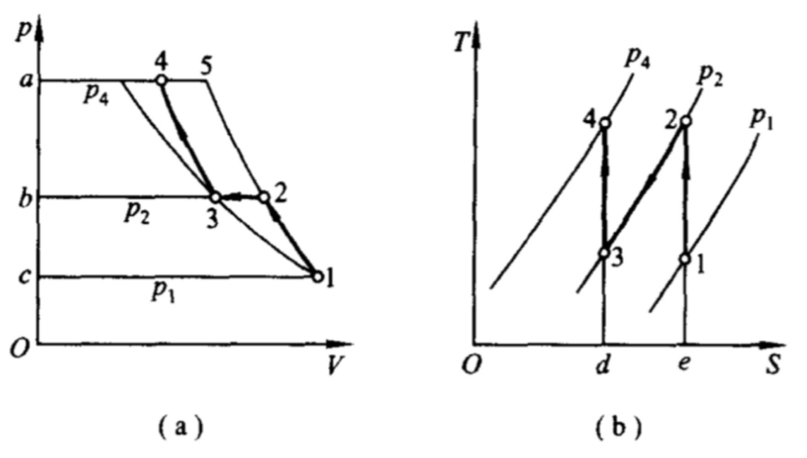

从上图可以看出，当初终态压力相同时（即增压比$\pi = \frac{p_4}{p_1}$相同）,两级压气机耗功量更少，所节省的功量等于面积2-3-4-5-2，并且从T-s图中可以看出，因为多了中间冷却的步骤，多级压缩的终态排气温度将更小。进一步增加压缩级数，可以使耗功量更加小，即使得压缩过程更加接近于定温压缩。但若压缩级数过多，会使得设备过于复杂，因此通常使用2-4级压缩。

如上图二级压缩机，总耗功量为：

\[
	w_{t} = w_t^1 + w_t^2 = \frac{\gamma}{\gamma - 1}p_1 v_1 [1- (\frac{p_2}{p_1})^{\frac{\gamma-1}{\gamma}}] + \frac{\gamma}{\gamma - 1}p_3 v_3 [1- (\frac{p_4}{p_3})^{\frac{\gamma-1}{\gamma}}] 	 
\]

## 第十一章 蒸汽动力循环
---

!!! note "知识梳理"
    

    🌟概念:蒸汽卡诺循环过程，朗肯循环（T-s图），再热循环、回热循环（两种不同的回热装置），混合式循环

    🔧计算:朗肯循环，再热循环、回热循环过程分析

    

## 第十二章 气体动力循环
---

!!! note "知识梳理"
    

    🌟概念:燃气轮机的布莱顿循环过程分析

    🔧计算:定压加热循环、定容加热循环、混合加热循环的热效率以及对比分析

    

## 第十三章 制冷循环
---

!!! note "知识梳理"
    

    🌟概念:制冷效率COP、热泵效率、制冷循环分析

    🔧计算:逆卡诺循环、空气压缩循环、蒸汽压缩循环的过程分析与效率比较

    

## 第十四章 化学反应系统的热力学原理（待补）
---

!!! note "知识梳理"
    

    🌟概念:化学翻译过程的反应热、热效应、热值、生成热的定义。赫斯定律和基尔霍夫定律的表述

    🔧计算:标准热效应、标准燃烧焓、标准生成焓、赫斯定律的运用、基尔霍夫定律的运用，理论燃烧温度

    

待续未完.......😞