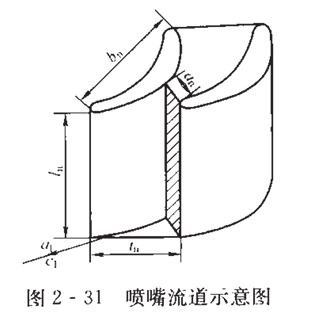

# 透平机械原理（汽轮机原理）

???+ summary "🌇Information"
    
    
    - 课程:透平机械原理 
    
    - 学分:4.0&ensp;&ensp;&ensp;&ensp;&ensp;&ensp;&ensp;&ensp;&ensp;&ensp;&ensp;&ensp;&ensp;&ensp;&ensp;&ensp;&ensp;&ensp;&ensp;&ensp;&ensp;&ensp;&ensp;&ensp;&ensp;&ensp;课程代码: 59120110
    
    - 教材:《汽轮机原理》(黄树红) 

	- 推荐阅读：

### 前置知识：气体与蒸汽的流动

### 第二章 汽轮机级内能量转换过程

#### 2.1 级的基本概念

<B>汽轮机的级是最基本的做功单元</B>，一台汽轮机可由单级/多级组成，现代大型汽轮机均由多级串联组成。<B>汽轮机的总输出功率是汽轮机各级输出功率之和</B>。

汽轮机的级由<B>喷嘴叶栅和动叶栅</B>组成，如上图：0-0截面为级的进口界面，1-1截面为喷嘴的出口截面，2-2揭秘那为级1的出口截面。

> 级的做功过程：首先，蒸汽在喷嘴叶栅中将热能转变为动能，再在动叶栅中将动能转变为机械能，使得叶轮与轴旋转（汽轮机利用蒸汽热能做功）。这个过程是蒸汽不断膨胀，压力在叶栅中逐渐降低的过程

蒸汽在汽轮机级内进行能量转换的条件：

（1）蒸汽具有一定品位的热能，即蒸汽具有够高的温度与压力；

（2）喷嘴进出口具有一定的蒸气压差；

（3）叶栅流道截面应该为连续的流线型，壁面光滑；

（4）动叶栅可以绕轴心线运动。

上图为汽轮机级的做功过程，0点为级前的蒸汽状态，0*为蒸汽等熵的滞止状态（$c_f = 0$）,满足：

$$
\frac{1}{2} c_f^2 + h = h^* > h
$$

过程中蒸汽压力从级前初压$p_0$，在喷嘴叶栅中<B>不可逆熵增膨胀</B>到$p_1$,再进入动叶栅继续膨胀到$p_2$。若假设这个过程为等熵过程，则从图上可知，从滞止点出发的$\Delta h_t^*$为级的滞止理想比焓降，从级前膨胀的$\Delta h_t$为级的理想比焓降。1点为喷嘴出口的蒸汽状态，$\Delta h_n^*$为喷嘴的滞止理想比焓降，$\Delta h_b$为动叶的理想比焓降，2点为级出口的实际蒸汽状态。

> 一般情况下，图上的$\Delta h_b'$不等于$\Delta h_b$,但在研究某一单级时可以认为$\Delta h_b' = \Delta h_b$。

在动叶栅中，蒸汽膨胀会给动叶<B>冲动力与反动力</B>两种力

<B>冲动力$F_i$</B>：气流在动叶栅中随着汽道形状改变流向，由此产生的作用在动叶上的离心力

<B>反动力$F_r$</B>：蒸汽在动叶中流动的同时继续膨胀，速度增加，在蒸汽流出汽道时，对动叶栅世家一个与流出方向相反的反作用力

<B>推动力$F_u$</B>：冲力与反力的合力在轮周方向上的分力

<B>为了衡量蒸汽在动叶栅中的膨胀程度，区分冲动力与反动力做功大小，引入反动度$\Omega$</B>的概念(假设$\Delta h_b' = \Delta h_b$)：

$$
\Omega = \frac{\Delta h_b}{\Delta h_t^*} = \frac{\Delta h_b}{\Delta h_n^* + \Delta h_b}
$$

由此可以推出:$\Delta h_b = \Omega \Delta h_t^*$，$\Delta h_n^* = (1 - \Omega) \Delta h_t^*$

> <B>级的反动度沿叶高是逐渐增大的</B>，对于三个特征截面（根部$\Omega_r$、平均$\Omega_m$、顶部$\Omega_t$）,有$\Omega_r < \Omega_m < \Omega_t$。

根据$\Omega$的大小，可以将汽轮机的级分为冲动级（$0 < \Omega< 0.5$）、反动级（$0.5 = \Omega$）

当$\Omega = 0$时，为纯冲动级，蒸汽只在喷嘴叶栅中膨胀，在动叶栅中不膨胀，此时级内没有反动度，没有反动力，只有冲动力。动叶栅进出口压力相等（$p_1 = p_2,\Delta h_b=0,\Delta h_t^*=\Delta h_n^*$）。<B>汽流流过纯冲动级的动叶时，会产生较厚的附面层(边界层)，效率较低，损失较大。</B>

对于$0 < \Omega< 0.5$带反动度的冲动级，动叶栅截面形状接近对称（膨胀少），作用在转子上的轴向力较小，可采用质量轻的<B>轮盘式转子</B>，且可以采用较大的径向间隙，增强运行的灵活性。由于喷嘴叶栅前后压力差较大，为了减少漏汽，要减少喷嘴叶栅与轴之间间隙的直径，设计隔板结构。

对于$\Omega = 0.5$的反动级，蒸汽的膨胀一半在喷嘴叶栅，一半在动叶栅，因此$\Delta h_b =\Delta h_n^* = 0.5\Delta h_t^*$，因此可以采用相同的叶型（减少成本）。反动级的动叶片前后有较大压力差（因为反动度大），可采用<B>转鼓式转子</B>来减小汽流对转子的轴向力。为了平衡轴向推力，设置平衡活塞。

同时，粗大的转鼓式转子质量大，热惯性大，增加了暖机时间，影响了运行的机动性。反动度效率大于冲动度，但做功能力较小。为了避免较大的级内损失，采用全周进汽。

<B>反动级总结</B>：

(1)反动度$\Omega = 0.5$，$\Delta h_b = \Delta h_n^* = 0.5\Delta h_t^*$，因而动叶片前后存在较大压力差

(2)喷嘴叶栅与动叶栅采用相同叶型，可降低成本

(3)采用转鼓式转子，喷嘴叶片设置在汽缸内壁

(4)设置平衡活塞

(5)采用全周进汽

(6)反动度效率大于冲动度，但做功能力较小

另外，根据是否可以改变进汽面积，分为调节级与非调节级（压力级）；根据蒸汽流过的叶栅数，分为单列级与速度级（多列）。压力级（非调节级）一般是单列级，可以是冲动级/反动级。

速度级中装有两列动叶栅的为复速级（双列级），一般为冲动级，由一列喷嘴叶栅+一列导向叶栅（转向作用）+两列动叶栅组成。为了提高效率，设计为带反动度的冲动级，复速级的做功能力大于单列冲动级。

#### 2.2 蒸汽在级内的流动过程

汽流参数与喷嘴形状的关系：

$$
\frac{dA}{A} = \frac{dc}{c} (Ma^2 - 1)
$$

当$Ma<1$时（亚声速），汽流在喷嘴中膨胀加速，通道的横截面积随着汽流加速而逐渐减小，称为渐缩喷管；

当$Ma>1$时（超声速），汽流在喷嘴中膨胀减速，通道的横截面积随着汽流减速而逐渐增大，称为渐扩喷管。

当$Ma=1$时，汽流速度等于当地声速，$dA=0$，喷嘴截面积为最小值。

缩放喷管/拉伐尔喷管：汽流从亚声速到超声速，截面由渐缩到渐扩，喉部$Ma=1$。

>临界压力：喷嘴喉部处，$Ma=1$，$dA=0$，喷嘴截面积为最小值，称为临界压力。当渐缩喷嘴出口压力降低时，汽流出口质量密度减小，并且加速；而当降到临界压力时，流速达到声速（$Ma=1$）.<B>如果想要获得超声速汽流，需要使用缩放喷管，且，出口压力要低于临界压力。</B>现代大型汽轮机的喷嘴一般为<B>渐缩喷嘴</B>

临界声速的大小仅仅取决于蒸汽的初始参数，与过程无关：

$$
c_{cr} = \sqrt{\kappa \frac{p_{cr}}{\rho_{cr}}} = \sqrt{\frac{2 \kappa}{\kappa + 1} \frac{p_{0}^*}{\rho_{0}^*}}  
$$

$$
\frac{p_{cr}}{\rho_{cr}} = \frac{2}{\kappa + 1} \frac{p_{0}^*}{\rho_{0}^*}
$$

临界压力比$\epsilon_{cr}$，可以根据滞止压力得到临界压力$p_{cr} = \epsilon_{cr} p^*_0$,且只与蒸汽的等熵指数$\kappa$有关:

$$
\epsilon_{cr} = \frac{p_{cr}}{p^*_0} = (\frac{2}{\kappa + 1})^{\kappa/(\kappa -1)}
$$

可知临界压比只于蒸汽绝热指数有关，与蒸汽状态无关，因此在确定蒸汽（过热/饱和/空气）后，临界压力比是确定的常数。

对于蒸汽在喷嘴中的理想等熵值膨胀过程(0点进口——>1t点理想喷嘴出口)：

$$
h_0 + \frac{c_0^2}{2} = h_{1t} + \frac{c_{1t}^2}{2}
$$

$$
\begin{aligned}
c_{1t} =& \sqrt{c_0^2 + 2(h_0 - h_{1t})} = \sqrt{c_0^2 + 2\Delta h_{n}} = \sqrt{2 \Delta h_n^*} \\ 

=& \sqrt{ \frac{2 \kappa}{\kappa - 1} \frac{p_{0}^*}{\rho_{0}^*} [1-\epsilon_n^{(\kappa-1)/\kappa}] } \\ 
\end{aligned}
$$

其中$\epsilon_n=p_1/p_0^*$为喷嘴出口压力与进口滞止压力之比，可知$c_{1t}$可由$\Delta h_{n}^*$得到，即蒸汽在喷嘴出口处的速度是由喷嘴进口和出口蒸汽参数决定的，和喷嘴进口蒸汽速度有关。

⭐如何推导$\Delta h_n^* = \frac{2 \kappa}{\kappa - 1} \frac{p_{0}^*}{\rho_{0}^*} [1-\epsilon_n^{(\kappa-1)/\kappa}]$ ：

对于理想气体，有$h=c_pT$,因此$\Delta h_n^* = c_p(T_0^* - T_{1t})$

对于等熵过程$pv^\kappa = const$，有：

$$
\frac{T_{1t}}{T_0^*} = (\frac{p_{1t}}{p_0^*})^{\frac{\kappa -1}{\kappa}}
$$

因此将焓差$\Delta h_n^*$表示为：

$$
\Delta h_n^* = c_p T_0^* [1 - (\frac{p_{1t}}{p_0^*})^{\frac{\kappa -1}{\kappa}}]
$$

对于理想气体，有$p = \rho R T$，且$c_p = \frac{\kappa}{\kappa-1}R$,则：

$$
c_p T_0^* = \frac{\kappa}{\kappa-1}RT_0^* = \frac{\kappa}{\kappa-1} \frac{p_0^*}{\rho_0^*}
$$

最终可得$\Delta h_n^* = c_p T_0^* [1 - (\frac{p_{1t}}{p_0^*})^{\frac{\kappa -1}{\kappa}}] = \frac{\kappa}{\kappa-1} \frac{p_0^*} {\rho_0^*} [1 - (\frac{p_{1t}}{p_0^*})^{\frac{\kappa -1}{\kappa}}] $

$$
c_{1t} = \sqrt{ \frac{2 \kappa}{\kappa - 1} \frac{p_{0}^*}{\rho_{0}^*} [1-\epsilon_n^{(\kappa-1)/\kappa}] }
$$

以上求得的$c_{1t}$为理想等熵情况下的喷嘴出口速度，实际上由于不可逆损失，实际速度$c_1$较小，我们引入速度系数$\phi$:

$$
\phi = \frac{c_1}{c_{1t}}
$$

$$
c_1 = \phi c_{1t} = \phi \sqrt{2 \Delta h_n^*}
$$

可得喷嘴损失$\delta h_n$,和喷嘴能量损失系数$\xi_n$:

$$
\delta h_n = \frac{c_{1t}^2}{2} - \frac{c_1^2}{2} = (1-\phi^2) \frac{c_{1t}^2}{2} = (1-\phi^2) \Delta h_n^*
$$

$$
\xi_n = \frac{\delta h_n}{\Delta h_n^*} = 1 - \phi^2
$$

> 为了实际出口焓值比理想更大？：假设流动过程绝热，损失的动能转变为热能也加热了蒸汽本身，所以喷嘴出口汽流时间比焓$h_1$大于$h_{1t}$。

理想喷嘴流量计算,由于$\frac{\rho_{1t}}{\rho_0^*} = (\frac{p_{1t}/RT_{1t}}{p_{0}^*/RT_{0}^*}) = \frac{\epsilon_n}{\epsilon_n^{(\kappa-1)/\kappa}} = \epsilon_n^{1 - (\kappa-1)/\kappa} = \epsilon_n^{\frac{1}{\kappa}}$

$$
\begin{aligned}
G_t = A_n \rho_{1t} c_{1t} = A_n \rho_{1t} \sqrt{\frac{2 \kappa}{\kappa -1} \frac{p_{0}^*}{\rho_{0}^*} [1-\epsilon_n^{(\kappa-1)/\kappa}] } \\

=  A_n c_{1t} = A_n \rho_{1t} \sqrt{\frac{2 \kappa}{\kappa -1} p_{0}^* \rho_{0}^* \frac{\rho_{1t}^2}{{\rho^*_{0}}^2} [1-\epsilon_n^{(\kappa-1)/\kappa}] }                                   \\

= A_n \sqrt{\frac{2 \kappa}{\kappa -1} p_{0}^* \rho_{0}^* [\epsilon_n^{2/\kappa}-\epsilon_n^{(\kappa+1)/\kappa}] } \\
\end{aligned}
$$

由此可知$G_t$取决于蒸汽参数（$p_0^*,\rho^*_0$）,出口面积$A_n$，以及喷嘴前后压力比$\epsilon_n$有关，可得：

（1）当$\epsilon_n = 1$时，即$p_1 = p_0^*$，喷嘴前后压力相等，无流动，$G_t=0$

(2)当喷嘴前后压力差增大（$epsilon_n$减小），喷嘴流量$G_t$逐渐增加而后不变，当$\epsilon_n=\epsilon_{cr}$时，喷嘴出口临界，流量最大（临界流量$(G_{t})_{cr}$）。而当$\epsilon_n < \epsilon_{cr}$时，流量保持在$(G_{t})_{cr}$不变

> <B>当$\epsilon_n=\epsilon_{cr}$时，出口流量已经到达声速，降低背压不能改变喷嘴出口的临界条件</B>

对于过热蒸汽$\kappa = 1.3,\epsilon_{cr}=0.546$：

$$
\begin{aligned}
(G_t)_{ct} =& A_n\sqrt{\frac{2 \times 1.3}{1.3 -1} p_{0}^* \rho_{0}^*[0.546^{2/1.3}-0.546^{(1.3+1)/1.3}] } \\

=& 0.667A_n \sqrt{p_0^* \rho_{0}^*}\\
\end{aligned}
$$

对于饱和蒸汽：

$$
(G_t)_{ct} = 0.635A_n \sqrt{p_0^* \rho_{0}^*}
$$

由于蒸汽在喷嘴中流动存在不可逆损失，因此引入流量系数$\mu_n$来计算实际流速:

$$
G = A_n \rho_1 c_1 = A_n \rho_1 \phi c_{1t} = \phi \frac{\rho_1}{\rho_{1t}}G_t  =\mu_n G_t 
$$

$$
\mu_n = \phi \frac{\rho_1}{\rho_{1t}} 
$$

> 对于一般绝热过程。由于流动摩擦热损失加热了蒸汽，使得比焓增加，实际密度$\rho_1 < \rho_{1t}$，因此$\mu_n = \phi \frac{\rho_1}{\rho_{1t}} < \phi$。在过热蒸汽区，$\mu_n = \phi =0.97$。在湿蒸汽区，$\mu_n > 1$ ,使得实际流量大于理想流量，可取$mu_n = 1.02$

不管是过热蒸汽还是饱和湿蒸汽，都可以使用的临界流量计算式：

$$
G = 0.648A_n \sqrt{p_0^* \rho_{0}^*}
$$

<B>彭台门系数$\beta$</B>:

引入彭台门系数，来表示通过喷嘴的实际流量与同初始状态下的临界流量之比

$$
\beta = \frac{G}{G_{cr}} = \frac{\mu_n G_{t}}{\mu_n (G_t)_{cr}} = \frac{\mu_n A_n \sqrt{\frac{2 \kappa}{\kappa-1} p_0^* \rho_0^* [\epsilon_n^{2/\kappa} - \epsilon_n^{(\kappa+1)/\kappa}]}}{\mu_n A_n \sqrt{\kappa (\frac{2}{\kappa+1})^{(\kappa+1)/(\kappa-1)}} p_0^* \rho_0^* } = \frac{ \sqrt{\frac{2}{\kappa-1} [\epsilon_n^{2/\kappa} - \epsilon_n^{(\kappa+1)/\kappa}]}}{\sqrt{(\frac{2}{\kappa+1})^{(\kappa+1)/(\kappa-1)}}}
$$

可知彭台门系数$\beta$仅仅与喷嘴进出口压力比和工质绝热指数$\kappa$有关。根据$\epsilon_n$查表$beta$,我们可得：

$$
G = 0.648 \beta A_n \sqrt{p_0^* \rho_{0}^*}
$$

<B>喷嘴斜切部分的流动</B>:

为了保证喷嘴汽流以正确的方向进入动叶栅，喷嘴出口设计为一个三角形区域，成为斜切部分，在理想情况下，喷嘴斜切部分的流动为稳定的等熵流动。实现两个作用：

（1）导流作用

（2）（$\epsilon_n < \epsilon_{cr}$）使蒸汽膨胀加速

当$\epsilon_n > \epsilon_{cr}$时，即出口压力大于临界压力，此时斜切部分仅起到导流作用

当$\epsilon_n <> \epsilon_{cr}$时，即出口压力小于临界压力，蒸汽在最小截面上保持临界压力$p_{cr}$，而出口截面的$p_1 < p_{cr}$，因此在斜切部分仍然要继续膨胀，从而获得超声速汽流($c_1 > c_{cr}$)。

斜切部分的特殊点：在A点，压力从$p_{cr}$突变到$p_1$，成为汽流的扰动中心，使得汽流方向产生$\delta_1$的偏转，超声速汽流以$\alpha_1+\delta_1$的角度流出喷嘴。

利用这一斜切设计的渐缩喷嘴，可以在一定程度上替代缩放喷嘴

设$l_n$为最小截面高度，$l_n'$为出口截面高度，$t_n$为AC长度，即斜切部分出口宽度：

在最小截面AB上：$G_t = A_{cr} c_{cr} \rho_{cr} = l_n c_{cr} \rho_{cr} t_n \sin{\alpha_1}$

在出口截面：$G_t = A_n c_{1t} \rho_{1t} = l_n' c_{1t} \rho_{1t} t_n \sin{(\alpha_1 + \delta_1)}$

显然在喷嘴内部流量稳定不变，假设$l_n=l_n'$，得到求解汽流偏转角的贝尔公式:

$$
\begin{aligned}
\frac{\sin{(\alpha_1 + \delta_1)}}{\sin{\alpha_1}} &= \frac{\rho_{cr} c_{cr}}{\rho_{1t} c_{1t}} = \frac{\rho_{cr} / \rho_{0}^*}{\rho_{1t} / \rho_{0}^*} \times \frac{c_{cr}}{c_{1t}}\\

&= \frac{\epsilon_{cr}^{\frac{1}{\kappa}}}{\epsilon_n^{\frac{1}{\kappa}}} \times \frac{\sqrt{ \frac{2 \kappa}{\kappa - 1} \frac{p_{0}^*}{\rho_{0}^*} [1-\epsilon_{cr}^{(\kappa-1)/\kappa}] }}{\sqrt{ \frac{2 \kappa}{\kappa - 1} \frac{p_{0}^*}{\rho_{0}^*} [1-\epsilon_n^{(\kappa-1)/\kappa}] }}           \\

&= \frac{\epsilon_{cr}^{\frac{1}{\kappa}}}{\epsilon_n^{1/\kappa}} \times \frac{\sqrt{ [1-\epsilon_{cr}^{(\kappa-1)/\kappa}] }}{\sqrt{ [1-\epsilon_n^{(\kappa-1)/\kappa}] }}\\

&\xlongequal{\epsilon_{cr}=(\frac{2}{\kappa + 1})^{\kappa (\kappa -1)}} \frac{{(\frac{2}{\kappa + 1})^{1/(\kappa -1)}}}{\epsilon_n^{1/\kappa}} \times \frac{\sqrt{ 1-\frac{2}{\kappa + 1}} }{\sqrt{ [1-\epsilon_n^{(\kappa-1)/\kappa}] }}\\

&= \frac{(\frac{2}{\kappa + 1})^{1/(\kappa -1)}\sqrt{ \frac{\kappa-1}{\kappa + 1}}} { \epsilon_n^{1/\kappa} \sqrt{ 1-\epsilon_n^{(\kappa-1)/\kappa} }}   \\
\end{aligned}
$$

根据推导，偏转角$\delta_1$由喷嘴压力比$\epsilon_n$，等熵指数$\kappa$和出汽角$\alpha_1$决定。

<B>极限压力的概念</B>：

喷嘴极限压力$p_d$是汽流在斜切部分产生的特性线达到出口边AC时的压力，也是膨胀的极限压力。通过$p_d$，我们了解喷嘴的膨胀潜力，避免过分膨胀。

$$
p_d = \epsilon_{cr} p_0^* (\sin{\alpha_1})^{\frac{2\kappa}{\kappa+1}}
$$

> 何为喷嘴的膨胀潜力：汽流流出喷嘴出口后，压力会从极限压力继续下降，由于没有了壁面限制，汽流不再会加速，产生膨胀不足损失。

以下的$\omega$表示的是蒸汽质点的相对速度，$c$为绝对速度，想要得到$\omega$需要得到汽轮机的<B>圆周速度u</B>

$$
u = \frac{\pi d_m n}{60}
$$

其中，$n$为汽轮机转速，$d_m$为级的平均轮径。

<B>动叶栅的蒸汽流动</B>：

上述的推导可以求出喷嘴出口速度$c_1$与方向角$\alpha_1$，而蒸汽进入动叶的速度为$\omega_1$,其与叶轮旋转平面的夹角为$\beta_1$（动叶进口汽流方向角）。由此可以画动叶进口速度三角形。

$$
\omega_1 = \sqrt{c_1^2 + u^2 -2c_1 u \cos{\alpha_1}}
$$

$$
\beta_1 = tan^{-1}(\frac{c_1 \sin{\alpha_1}}{c_1 \cos{\alpha_1} - u})
$$

对于蒸汽在动叶栅的出口，假设过程为理想状态的等熵过程（1——>2t）：

$$
h_1 + \frac{\omega_1^2}{2} = h_{2t} + \frac{\omega_{2t}^2}{2}
$$

$$
\omega_{2t} = \sqrt{2 \Delta h_b + \omega_1^2} = \sqrt{2 \Delta h_b^*}
$$

其中，$\Delta h_b^* = \Delta h_b + \frac{1}{2} \omega_1^2 > \Delta h_b $为蒸汽在动叶的滞止理想比焓降。

由于实际流动存在摩擦损失，引入动叶速度系数$\psi$来得到实际流动速度：

$$
\psi = \frac{\omega_2}{\omega_{2t}} < 1
$$

$$
\omega_2 = \psi \omega_{2t}
$$

同时可得到动叶栅中的能量损失$\delta h_b$以及损失系数$\xi_b$：

$$
\delta h_b = \frac{1}{2} \omega_{1t}^2 - \frac{1}{2} \omega_1^2 = \frac{1}{2} \omega_{1t}^2 (1-\psi^2)
$$

$$
\xi_b = \frac{\delta h_b}{\Delta h_b^*} = 1 - \psi^2
$$

对于动叶出口速度三角形，可得到：

$$
c_2 = \sqrt{u^2 + \omega_2^2 - 2 u \omega_2 \cos{\beta_2}}
$$

$$
\alpha_2 = tan^{-1}(\frac{\omega_2 \sin{\beta_2}}{\omega \cos{\beta_2} - u})
$$

对反动度$\Omega=0$的纯冲动级，$\Delta h_b=0, \omega_2 < \omega_1$（有动叶损失$\delta h_b$），其速度三角形不对称；对于反动度$\Omega=0.5$的反动级中，$\Delta h_n ≈ \Delta h_b$，且静叶与动叶形状对称，因此$c_1=\omega_2,c_2=\omega_1,\alpha_1=\beta_2,\alpha_2=\beta_1$。

<B>余速损失$\delta h_{c2}$</B>：

蒸汽以绝对速度$c_2$离开动叶栅，没有转变为机械功，成为了本级的余速损失：

$$
\delta h_{c2} = \frac{1}{2} c_2^2
$$

在多级汽轮机中，余速能量能够被下级利用（中间级）。引入余速利用系数$\mu$，用$\mu_0$表示本级利用上级余速动能的系数，则$\mu_0 c_0^2 / 2$为本级利用的余速能量；$\mu_1$表示本级的余速动能被下级利用的系数，则$\mu_1 c_2^2 / 2$为本级余速能量被下级利用的量。$(1 - \mu_1) c_2^2 / 2$则是本级<B>余速动能未被下级利用的部分，该部分会加热蒸汽，使得实际比焓值提高。</B>

余速利用条件：

（1）相邻两级<B>平均直径相等</B>

（2）喷嘴进气方向与上一级余速<B>方向相符合</B>

（3）相邻两级<B>全周进汽</B>

（4）级间无抽汽，流量不变

<B>蒸汽作用在动叶上的力和轮周功率</B>：

蒸汽对叶片的周向作用力$F_u$：

$$
F_u = G(\omega_1 \cos{\beta_1} + \omega_2 \cos{\beta_2}) = G(c_1 \cos{\alpha_1} + c_2 \cos{\alpha_2})
$$

轮周功率$P_u$:单位时间内汽流对动叶片做的有效功（周向力对转子做功）

$$
P_u = F_u u = G u (c_1 \cos{\alpha_1} + c_2 \cos{\alpha_2}) = Gu(\omega_1 \cos{\beta_1} + \omega_2 \cos{\beta_2}) = \frac{G}{2} [(c_1^2 - c_2^2)-(\omega_1^2 - \omega_2^2)]
$$

当$G=1kg/s$时，$P_{u1}$称为级的做功能力

$$
P_{u1} = u (c_1 \cos{\alpha_1} + c_2 \cos{\alpha_2}) = u(\omega_1 \cos{\beta_1} + \omega_2 \cos{\beta_2}) = = \frac{1}{2} [(c_1^2 - c_2^2)-(\omega_1^2 - \omega_2^2)]
$$

蒸汽对叶片的轴向作用力$F_z$：

$$
F_z = G(\omega_1 \sin{\beta_1} - \omega_2 \sin{\beta_2}) + A_z (p_1-p_2)= G(c_1 \sin{\alpha_1} + c_2 \sin{\alpha_2}) + A_z (p_1-p_2)
$$

其中，$G$为蒸汽流量,合力为$F_b = \sqrt{F_u^2 + F_z^2}$。

而蒸汽在该级所具有的理想能量$E_0$，是该级的滞止理想比焓降减去被下一级利用的余速动能：

$$
E_0 = \mu_0 \frac{c_0^2}{2} + \Delta h_t - \mu_1 \delta h_{c2} = \Delta h^*_t - \mu_1 \delta h_{c2} = \frac{c_a^2}{2} - \mu_1 \frac{c_2^2}{2}
$$

其中，$c_a = \sqrt{2 \Delta h_t^*}$为该级喷嘴出口理想速度

则轮周效率$\eta_u=\frac{P_{u1}}{E_0}$，是<B>衡量汽轮机的工作经济性指标</B>，说明蒸汽在级中理想能量转变为级的轮周功的份额。

$$
\eta_u = \frac{u(c_1 \cos{\alpha_1} + c_2 \cos{\alpha_2})}{\Delta h^*_t - \mu_1 \delta h_{c2}} = \frac{2u(c_1 \cos{\alpha_1} + c_2 \cos{\alpha_2})}{c_a^2 - \mu_1 c_2^2}
$$

或者：

$$
\eta_u = \frac{\Delta h^*_t -\delta h_n - \delta h_b - \delta h_{c2}}{E_0} = 1 - \xi_n - \xi_b - (1-\mu_1) \xi_{c2}
$$

其中，$\xi_n, \xi_b, \xi_{c2}$为喷嘴损失、动叶损失、余速损失与理想能量$E_0$之比。

<B>速度比$x$</B>：

列速度比$x_1 = \frac{u}{c_1}$，级速度比$x_a = \frac{u}{c_a}$，由于出口速度$c_1$较难测量，实际常用$x_a$代替$x_1$:

$$
x_a = \frac{u}{c_a} = x_1 \phi \sqrt{1 - \Omega_m} \propto x_1
$$ 

显然，$x_1$与$x_a$成比例关系，变化规律一致。

<B>最佳速度比$(x_a)_{op}$，$(x_1)_{op}$</B>:

为了获得最大的轮周效率，应使余速损失最小，即出口的绝对速度$c_2$最小，根据速度三角形，当$\alpha_2=90°$时，$c_2$最小，此时轮周效率最高，对应的$x$称为最佳速度比$(x_a)_{op}$，$(x_1)_{op}$。

对于纯冲动级（单列孤立级）$\Omega=0，\mu=0$

(1)喷嘴、动叶速度系数$\phi，\psi$越高，轮周效率越大($\eta_u \propto \phi^2$)

(2)减小喷嘴出汽角$\alpha_1$能提高$\eta_u$：当$\alpha_1$小时，蒸汽在轮周方向的分速度大，且轴向分速度小，余速损失也会变小。在一定流量下也使得叶高增大，有利于效率提高

> <B>$\alpha_1$不能过小，否则导致喷嘴流动损失增大而使得轮周效率$\eta_u$降低。通常$\alpha_1 >= 12° - 13°$</B>

(3)减小动叶出口角$\beta_2$能提高冲动级的轮周效率$\eta_u$

> <B>$\beta_2$不能过小，否则导致汽流转向过大而使得动叶损失过大，使轮周效率$\eta_u$降低。并且，考虑出口面积为定值，$\beta_2$过小会使得动叶出口高度过大（与动叶进口相差过大），使得汽流在叶根/叶顶出现脱离现象，增大损失。通常$\beta_2 = \beta_1 - (3° ~ 5°)$</B>

(4)速度比$x$对$\eta_u$的关系为平方+非线性，影响最大:最佳速度比为$(x_1)_{op} = \frac{1}{2} \cos{\alpha_1}$。

<B>推导纯冲动度$\Omega=0$的最佳速度比<B>:

已知$\Omega=0，\mu=0，\Delta h_b =0，E_0=\Delta h_t=\Delta h_n，c_a=c_{1t}，w_1=w_{2t}$

$$
\begin{aligned}
\eta_u &= \frac{2u(c_1 \cos{\alpha_1} + c_2 \cos{\alpha_2})}{c_a^2 - \mu_1 c_2^2} = \frac{2u  (\omega_1 \cos{\beta_1} + \omega_2 \cos{\beta_2})}{c_{1t}^2} \\
&= \frac{2u}{c^2_{1t}} \omega_1 \cos{\beta_1} (1 + \psi \frac{cos \beta_2}{cos \beta_1}) \\
&= 2 \phi^2 x_1 (cos \alpha_1 - x_1) (1 + \psi \frac{cos \beta_2}{cos \beta_1})
\end{aligned}
$$

$$
\frac{\partial \eta_u}{\partial x_1} = 2 \phi^2 (cos \alpha_1 - x_1) (1 + \psi \frac{cos \beta_2}{cos \beta_1}) =0
$$

根据求导结果，可得最佳速度比$(x_1)_{op} = \frac{cos \alpha_1}{2}$，$(x_a)_{op} = \phi (x_1)_{op} =\phi \frac{cos \alpha_1}{2}$，因为$\alpha_1 >= 12° - 16°$，所以$(x_1)_{op}=0.46 - 0.49$

(5)余速利用可以提高级的轮周效率$\eta_u$，并且使得速度比$x_a$对轮周效率的影响显著减小(曲线顶部平坦)，使得在有余速利用的情况下$\alpha_2$不再要求接近90°

<B>复速级的$\eta_u$与$x_a/x_1$</B>

 

<B>叶栅的几何特性</B>：

反动式叶栅是加速叶栅，汽道断面从进口到出口逐渐收缩，称为<B>亚声速叶栅</B>；

当汽道呈缩放型，名称为<B>超声速叶栅</B>

<B>叶栅类型的选择</B>:

按照汽流工作的马赫数$Ma$(喷嘴按照出口马赫数，动叶按照进口马赫数)分类，可分为：

（1）亚声速叶栅：$Ma < 0.8$

> 单列级一般选用亚声速叶栅；而双列复速级的工作马赫数$Ma$较高，但<B>由于超声速叶栅的工艺性能与变工况性能较差，而亚声速叶栅可利用斜切部分继续膨胀，来实现超声速流动</B>，因此仍然可采用亚声速叶栅

（2）跨声速叶栅：$0.8 <= Ma <= 1.4$

（3）超声速叶栅：$Ma > 1.4$

> 当喷嘴叶栅压比$\epsilon_n = p_1/p_0 <= （0.3-0.4）$，出口马赫数$Ma >1.5$时，必须采用跨声速或超声速叶栅

<B>汽流出口角$\alpha_1，\beta_2$的选择</B>:

在高压级，体积流量小，为了不使叶片高度太小，减小顶端损失，选择较小的出口角：

（1）冲动级$\alpha_1 = 11°-14°$

（2）反动级$\alpha_2 = 14°-20°$

在中低压部分中，由于体积流量大，选择出口角较大的叶型，冲动级通常$\alpha_1 = 13°-17°$

在动叶栅中，出汽角$\beta_2$可以：$\beta_2 = \beta_1 - (3° ~ 5°)$

<B>反动度$\Omega$选择</B>

当反动度较大时，动叶内存在较大的负压力梯度（在有负压力梯度的流动中，压力沿推动方向从高压流向低压流动，有助于流动），使得边界层减薄，从而提高动叶蒸汽速度和流动效率。

已知级的反动度沿叶高是逐渐增大的，根部反动度$\Omega_r$至关重要：

（1）根部反动度大时，动叶进口压力>>出口压力，这时喷嘴流出的<B>蒸汽有一部分从动叶进口根部的轴向间隙处漏出到级后，减少了动叶做功蒸汽量。</B>

（2）根部反动度小/为负值时，动叶根部进口压力略大/小于出口压力，部分隔板漏气通过动叶根部轴向间隙<B>吸入动叶汽道，但这些汽流不能做功且扰乱主汽流，增大损失</B>（吸气的影响比漏气更大）

（3）使动叶根部进口压力略大于出口压力是合理的，$\Omega_r = 0.03-0.05$

<B>泵浦效应</B>：叶轮高速旋转时，靠近叶轮壁面的蒸汽会向外流向动叶根部

<B>射汽抽气效益</B>：从喷嘴流出的高速汽流的作用，使得叶轮和隔板之间的汽室内的蒸汽被吸入动叶汽道，对主蒸汽产生扰乱。

<B>喷嘴叶栅尺寸设计</B>

根据喷嘴叶栅前后压力比$\epsilon_n = p_1 / p^*_0$来确定流动状态，由此确定喷嘴型式：

（一）渐缩喷管

1.亚临界流动：$\epsilon_n > \epsilon_{cr}$

斜切部分无膨胀，喷嘴出口截面汽流参数与最小截面相同

$$
A_n = \frac{G_n}{\mu_n \rho_{1t} c_{1t}} = a_n l_n = l_n t_n \sin{\alpha_1}
$$

其中，$a_n$为喷嘴喉部宽度，$t_n$为喷嘴叶栅节距，$l_n$为喷嘴出口高度

引入部分进汽度$e$来确定整个叶栅上喷嘴通道的比例：

$$
e = \frac{z_n t_n}{\pi d_m}
$$

其中，布置喷嘴的弧段长度为$z_n t_n$;$e=1$即为全周进汽，$e<1$为部分进汽。

如果喷嘴上有$z_n$个喷嘴流道，则总面积：

$$
A_n = z_n A = z_n l_n t_n \sin{\alpha_1} = e \pi d_m l_n \sin{\alpha_1}
$$

出口叶片高度:

$$
l_n = \frac{A_n}{e \pi d_m \sin{\alpha_1}}
$$

2.超临界流动($0.3 < \epsilon_n < \epsilon_{cr}$)

喷嘴斜切部分蒸汽膨胀，获得超临界流体

则在临界截面：

$$
(A_n)_{cr} = \frac{G_n}{0.648 \sqrt{p_0^* \rho_0^*}} = e \pi d_m (l_n)_{cr} \sin{\alpha_1}
$$

$$
(l_n)_{cr} = \frac{(A_n)_{cr}}{e \pi d_m \sin{\alpha_1}}
$$

(二)缩放喷嘴

当$\epsilon_n < 0.3$，使用缩放喷嘴，出口截面$A_n = z_n l_n a_n$：

$$
a_n = \frac{A_n}{z_n l_n}
$$

临界状态时，$(A_n)_{cr} = \frac{G_n}{0.648 \sqrt{p_0^* \rho_0^*}} = z_n (l_n)_{cr} a_{min}$

如图上，<B>要求扩张角不能过大，防止汽流从汽道壁面脱落引起过大的涡流损失</B>，一般取扩张角$\gamma = 6°-12°$，扩张部分长度$L$为:

$$
L = \frac{a_n - a_{min}}{2\tan{\frac{\gamma}{2}}}
$$

<B>动叶栅的尺寸</B>：

蒸汽在动叶栅中的流动多半为亚临界流动，一般为<B>渐缩形</B>。斜切部分是否膨胀通过动叶前后压力比$\epsilon_b=p_2 / p_1^*$判断：当$\epsilon_b < \epsilon_{cr}$时，有膨胀，需要计算偏转角$\omega_b$。

$$
A_b = \frac{G_b}{\mu_b \rho_{2t} c_{2t}} = e \pi d_b l_b \sin{\beta_2}
$$

$$
l_b = \frac{A_b}{e \pi d_b \sin{\beta_2}}
$$

其中，$A_b$为动叶出口面积，$d_b$为动叶栅平均直径：在高压级，可取$d_b = d_n$，在中低级，由于蒸汽比体积变化较大，一般$d_b > d_n$。$G_b$为流过动叶栅的蒸汽流量，因为漏气较小，所以一般可取$G_b = G_n$。

为了适应汽流的膨胀流动，动叶栅在高度上做成扩张形。同样为了适应膨胀，喷嘴出口到动叶进口也是扩张形，即动叶进口高度>喷嘴出口高度，称为盖度$\Delta$：

$$
\Delta = l_b' -l_n = \Delta_t + \Delta_r
$$

$$
l_b' = l_n + \Delta
$$

其中，$\Delta_t$与$\Delta_r$为动叶栅的顶部盖度和根部盖度（一般顶部盖度大于根部盖度）

<B>盖度的大小会影响级的效率</B>：

（1）盖度的存在满足了汽流在径向的扩散要求，且顶部盖度能减少顶部的漏汽

（2）适当的盖度能够减少流动损失（减少了冲击到叶根和围带上的汽流，减小附加损失）

（3）盖度不能过大，否则会助长汽流在径向的突然膨胀，在动叶顶部与根部汽流具有较大的径向分速度，形成漩涡，导致较大的流动损失，降低级效率

<B>最佳盖度</B>按照产生的损失（叶顶漏气损失+端部损失）最小的原则确定

<B>级内间隙$\delta$</B>

（1）轴向间隙$\delta$：

为了减小叶顶漏气损失和缩短机组轴向长度，开式轴向间隙$\delta_z$越小越好，但不能过小，否则可能运行时导致动静部分之间的碰撞摩擦，一般取$\delta_z = 1.5-2.0mm$

显然，开式轴向间隙$\delta_z$会影响级的效率，若不装叶顶汽封，开式轴向间隙$\delta_z$增大，漏气将迅速增加，效率下降；对设有径向汽封的级，则$\delta_z$对漏气的影响较小

闭式轴向间隙$\delta_1，\delta_2$的增大对级的效率的影响：

[1]正面影响；喷嘴出口与动叶进口的轴向距离增大，<B>减少了喷嘴出口尾迹影响，使得动叶进口汽流更均匀，改善级效率</B>

[2]负面影响：汽流运动路程变长，<B>增加了汽流与上下端壁之间的摩擦，减少了进口汽流的动能，不利于级效率</B>。

(2)径向间隙$\delta_r$:

径向间隙大小需要综合考虑机组的经济性与安全性，一般取$\delta_r= 0.5-1.5mm$：

<B>叶栅损失</B>

（一）叶型损失：蒸汽流过叶栅时，由于流体黏性产生附面层（边界层），附面层的特性决定了叶型损失的大小：<B>附面层的摩擦损失、附面层分离引起的涡流损失、出口边的尾迹损失、冲波损失</B>

1.附面层的摩擦损失

层流附面层，在黏性作用下，壁面的附面层会产生流层之间的黏性切应力，引起摩擦损失

紊流附面层，流体质点之间混杂着动量交换，产生比黏性切应力更大的附加应力，造成更大的摩擦损失

背弧上的摩擦损失大于内弧上

对于冲动级，可以采用一定的反动度来提高汽流速度，使附面层减薄，减少附面层的摩擦损失。或者减少叶栅的叶片数并且增大相对节距$t$，减小汽流流经的表面积

2.附面层分离引起的涡流损失

在扩压段，容易发生倒流现象而使得附面层分离，增大附面层厚度，形成强烈的漩涡。这在扩压作用强烈的背弧出口最为严重。

叶型弯曲程度越大，正冲角却大，越容易附面层分离

3.出口边的尾迹损失

附面层分离在尾缘后形成漩涡区，称为尾迹，其汽流速度远慢与主流，通过黏性与主流进行动量交换，损耗动能。

尾迹损失与喷嘴出口边厚度有关，尾缘越薄，尾迹损失越小。

4.冲波损失

在冲动叶栅的进出口、反动叶栅的出口处和背弧，会出现超声波汽流产生冲波，使压力升高，流速下降，引起附面层加厚而分离，增加损失

(二)端部损失：

1.端部的附面层摩擦损失

显然，汽道的上下壁面同样形成附面层，造成摩擦损失

2.二次流损失

在叶栅中，内弧面上的压力总是大于背弧面，存在横向的压力梯度。对于主流，压力梯度会被在弯曲通道产生的离心惯性力平衡。但对于端部附面层的流体，由于黏性摩擦力，其动能较小，没有能力平衡横向压差的作用，会形成从内弧面流向背弧面的横向流动，称为二次流。二次流使得上下端面的附面层加厚，且会发生局部分离。加上主流产生的横向补偿流动，形成两个方向相反的漩涡区，产生较大损失。

<B>影响叶栅损失的因素</B>：

1.相对节距$t$

影响壁面的摩擦损失与出口的尾迹损失：

> 冲动式叶栅对$t$的变化比反动式叶栅敏感，相对节距偏小带来的损失大于相对节距偏大带来的损失

2.安装角$\alpha_s$

汽道形状取决于安装角，过大过小都会带来损失，因此选择一个最佳安装角。冲动式$\alpha_s = 65°-80°$，反动式$\alpha_s = 30°-50°$

3.汽流角与冲角

冲角 = 叶型进口角 - 汽流进口角

1）冲角等于零时，叶栅损失最小；

2）正冲角的叶栅损失（背弧上附面层分离）大于负冲角的叶栅损失。

4.马赫数$Ma$

当$Ma < 1$，亚声速叶栅，马赫数增大时减薄附面层，减少叶型损失

当$Ma > 1$时，超声速叶栅，在背弧出口段产生局部的超声速流动，产生冲波，造成附面层增厚分离，加大冲波损失。存在一个最佳马赫数

> 冲动式对出口马赫数的敏感性大于反动式

5.雷诺数$Re$

随着雷诺数Re的增加，叶型损失系数相应下降。当Re达到某一数值后继续增大时，叶型损失系数基本不再变化，称为自模化流动雷诺数（$Re = (5-7) \times 10^{5}$）。

6.叶型几何影响

叶型的型线影响着速度分布和压力分布，尤其是背弧面曲率的影响更为显著。

（1）叶型曲率保持均匀变化

（2）内弧：可采用等曲率的圆弧相连；背弧：进口段逐渐减小，中间段逐渐增大，出口段又逐渐减小的曲率

（3）后缘应该圆整，且相对半径尽量小，缩小尾迹区造成的损失

<B>影响端部损失的因素</B>：

1.相对叶高$l$:

<B>相对叶高对端部损失的影响最大</B>，存在一个极限相对叶高：当叶高大于极限叶高时，二次流变化不大，端部损失的绝对值保持不变。

> 叶高的总损失系数与叶高的变化相同，叶高增大则端部损失在总损失的占比减小

当相对叶高小于极限相对叶高时，上下端面的涡旋相互叠加、强化干扰，端部损失随着叶高的减少急剧增加，因此设计叶高不能小于极限叶高。

2.汽流进口角

汽流进口角减小，叶片背弧进口段压力骤降，加剧端部横向流动，也加速背弧附面层分离，导致端部涡流损失增大。

3.相对节距

4.马赫数

在亚声速叶栅，出口马赫数$Ma$增大，横向压力梯度逐渐减小，且附面层厚度变薄，减少附面层摩擦损失，减小端部损失。但当在超声波叶栅，背弧出口产生超声速流动，产生冲波，加速附面层分离，使得端面涡流强化，增大端面损失。

5.盖度

盖度减少漏气损失，但会增大端部损失。盖度使得汽流从喷嘴进入动叶时，加剧端部汽流突然膨胀的程度，促进附面层发展和二次流形成，加剧端部损失。

6.叶栅型式（冲动/反动）

冲动式叶栅的端部损失大于反动式叶栅

<B>级内损失</B>：

（一）流动损失

在级内的喷嘴损失$\delta h_n$、动叶损失$\delta h_b$:

$$
\delta h_n = (1 - \phi^2) \Delta h_n^*
$$

$$
\delta h_b = (1 - \psi^2) \Delta h_b^*
$$

叶高损失$\delta h_l$:

$$
\delta h_l = \frac{a}{l} \Delta h_u
$$

其中，$a$为系数，与级的型式有关

(二)叶轮摩擦损失

$\delta h_f$由两部分组成：

（1）叶轮旋转时，靠近叶轮的蒸汽圆周速度与靠近静止部分（气缸表面、隔板表面）的圆周速度（接近0）存在较大差异，因为蒸汽存在一定黏度，形成摩擦力，产生摩擦损失。

（2）紧靠叶轮表面的蒸汽随着叶轮转动，受到离心力作用，由内向外径向流动，而靠近静止部分的蒸汽速度小，受到离心力作用小，自然向中心移动来补偿向外流的蒸汽，在叶轮的子午面内形成涡流运动，使得摩擦阻力增加。

斯托多拉（stodola）公式求摩擦损耗的轮周功率：

$$
\Delta P_f = K_1 (\frac{u}{100})^{3} d_m^2 \frac{1}{v}
$$

其中，$K_1=1.0-1.3$为经验系数，$u$为蒸汽速度，$d_m$为级的平均直径，$v$为蒸汽的比体积

若级的进汽量$G(kg/s)$，则叶轮摩擦损失:

$$
\delta h_f = \frac{\Delta P_f}{G}
$$

损失系数：

$$
\xi_f = \frac{\delta h_f}{E_0}
$$

> 减小叶轮周围的蒸汽空间，提高叶轮表面粗糙度可以降低叶轮损失

(三)部分进气损失

1.鼓风损失$\delta h_w$:

对于部分进汽的级，在工作喷嘴的弧段采用蒸汽流过，而没有工作喷嘴的弧段对应的动叶栅中和喷嘴与动叶之间的轴向间隙中充满停滞的蒸汽，旋转的动叶与间隙中停滞的蒸汽摩擦，产生鼓风损失

部分进汽度$e$越小，鼓风损失越大。为了减小损失，通常在没有布置喷嘴的弧段对应的动叶栅两侧用护套罩起来，减少间隙

2.斥汽损失$\delta h_s$:

当动叶栅从没有工作喷嘴的弧段进入工作喷嘴的弧段，喷嘴流出的高速汽流要加速停滞在汽道中的蒸汽，从而消耗一部分动能，产生斥汽损失

动叶每经过一次喷嘴就发生一次斥汽损失，在相同进气度的情况下，叶栅圆周上的喷嘴组数越多，斥汽损失越大。因此应尽量减小喷嘴组数。

<B>还要尽可能使两组喷嘴之间的间隙不大于喷嘴叶栅的节距，可以有效减少部分进气损失，这样可以算作一个喷嘴组处理。</B>

总部分进气损失:$\delta h_e = \delta h_w + \delta h_s$

（四）漏汽损失$\delta h_{\delta}$:

蒸汽通过隔板汽封漏到隔板与叶轮的间隙。动叶栅顶部前后压力差以及汽缸之间的径向间隙，也使一部分蒸汽漏到级后。漏气减少了做功的蒸汽量，称为漏气损失。

（五）湿汽损失$\delta h_x$

1.隔板漏气损失$\delta h_p$

减少隔板漏气损失：

（1）隔板与主轴之间使用高低齿式汽封，间隙很小，汽流每通过一个齿产生一次节流作用，每个齿都承担压差的一部分，减小漏气损失

（2）在叶轮上开平衡孔，并且使得动叶根部具有适当的反动度，使得隔板漏气全部通过平衡孔流到级后，避免漏气干扰动叶的主流

2.叶顶漏气损失$\delta h_t$

减小叶顶漏气损失：在围带上加装径向汽封和轴向汽封。对无围带的长叶片，把动叶顶部削薄以达到叶顶汽封的作用。尽量减小叶顶的反动度。

总漏气损失：$\delta h_{\delta} = \delta h_p + \delta h_t$

(五)湿汽损失$\delta h_x$

火电厂汽轮机的末几级和核电站汽轮机的大部分级工作在湿蒸汽区域中，此时的工质是由微小液滴+蒸汽组成的两相流，造成的能量损失为湿汽损失。

湿蒸汽携带的水滴分为两类：

饱和蒸汽在过程中生成的小水滴（$d_w=0.1-2.0\mu m$）,质量小，产生的摩擦损失和侵蚀作用小；

喷嘴叶片表面水膜在高速汽流作用下，从出口边撕裂而成的大水滴（$d_w=5-500\mu m$），大水滴速度远小于蒸汽流速，造成较大的机械能损失+金属材料侵蚀。末级的湿度限制在12%-14%。

湿汽损失大小主要与级前后平均干度$x_m = \frac{x_0+x_2}{2}$有关

$$
\delta h_x = (1 - x_m) \Delta h_i'
$$

$$
\xi_x = \frac{\delta h_x}{E_0}
$$

<B>级的相对内效率</B>

$\Delta h_i$为级的有效比焓降，是1kg蒸汽所具有的理想能量中最后转变为有用功的能量

级内流动损失不仅使轮周效率降低，而且使最佳速度比减小。当其他损失存在时，效率和最佳速度比进一步减小。