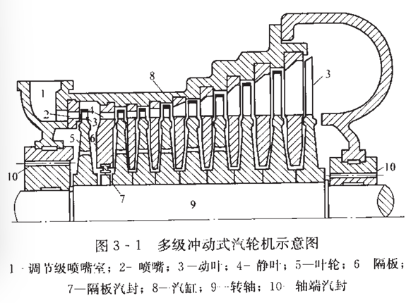
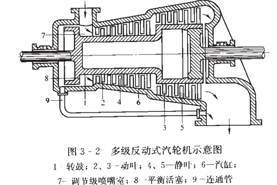

# 透平机械原理（汽轮机原理）

???+ summary "🌇Information"
    
    
    - 课程:透平机械原理 
    
    - 学分:4.0&ensp;&ensp;&ensp;&ensp;&ensp;&ensp;&ensp;&ensp;&ensp;&ensp;&ensp;&ensp;&ensp;&ensp;&ensp;&ensp;&ensp;&ensp;&ensp;&ensp;&ensp;&ensp;&ensp;&ensp;&ensp;&ensp;课程代码: 59120110
    
    - 教材:《汽轮机原理》(黄树红) 

	- 推荐阅读：

### 第三章 多级汽轮机

为了提高循环热效率和汽轮机单机效率，有效的方法是提高循环初参数和降低终参数，使得蒸汽比焓降$\Delta h_t$增大。若只使用单级，喷嘴出口流速$c_1$将非常大。

为了维持级有较高的轮周效率，维持最佳速度比$(x_1)_{op} = (\frac{u}{c_1})_{op}$，这使得圆周速度$u$也将很大（材料强度不允许）。因此汽轮机的焓降需要由多级来分担。

高压级比焓降$30-60kJ/kg$，低压级比焓降$120-160kJ/kg$。

多级汽轮机保证了整机具有较强的做功能力，每一级都处在最佳速度比附近工作，又满足材料工作强度。

1.循环热效率提高：采用多级汽轮机，允许更大提高蒸汽的初参数，降低终参数。可以实现回热循环与中间再热循环。

2.相对内效率提高：

（1）多级汽轮机更容易保证每一级工作在最佳速度比；

（2）每级分配比焓降，使得每一级的平均直径$d_m$和喷嘴出口高度$l$合理，减少叶高损失；

（3）重热现象：多级汽轮机内上一级损失中的一小部分可以在以后各级中得到利用，提高整体效率

（4）余速动能可以被下一级很好地利用，使得多级相对内效率高于单级内效率

3.单位功率的投资和运行成本降低

机组容量越大，单位功率的投资和运行成本降低越显著

4.其他

多级汽轮机存在附加能量损失、机组长度重量增加、零件部件材料要求和数量提高、结构复杂、整机造价高等问题，但总体上，多级汽轮机具有效率高、功率大、性能稳定，单位功率投资小等优势

> 汽轮机功率式各级功率之和

<B>多级汽轮机形式</B>：

冲动式汽轮机：由调节级和若干压力级组成，每两个叶轮用隔板分开，隔板上装有喷嘴，隔板内圆装有汽封片，减少级内漏气。

反动式汽轮机；转子为转鼓式(减少轴向推力)

高压级缸：

低压级缸：

中压级缸：

<B>多级的重热现象</B>