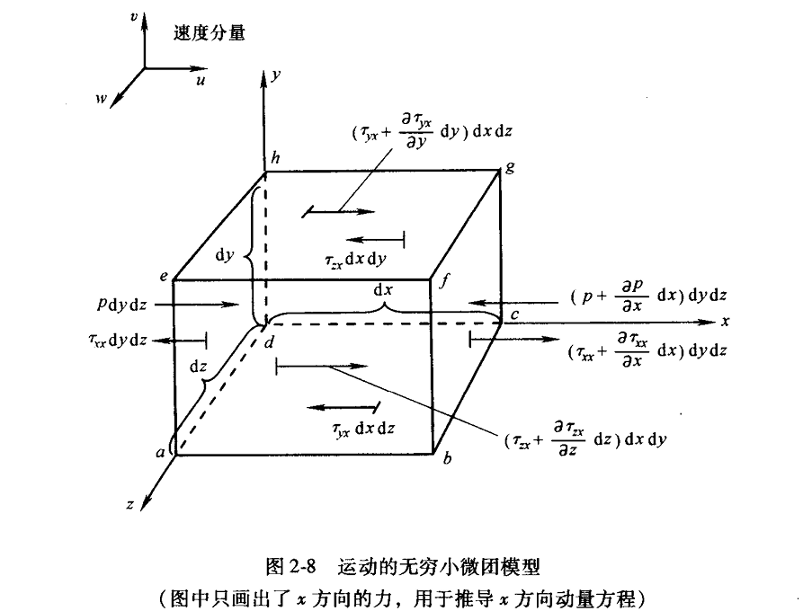
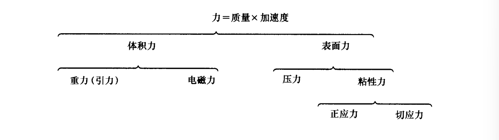
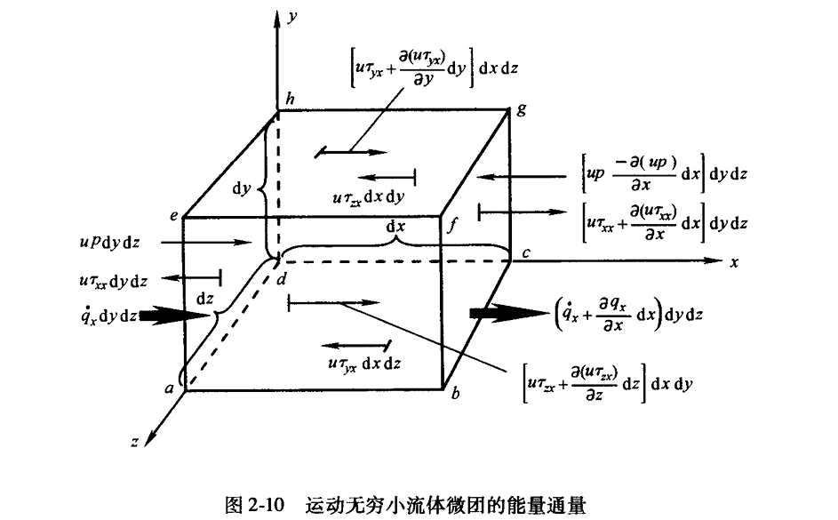

# 计算流体力学（CFD）

### 控制方程组

对于随流体运动的流体微团，其密度表示为$\rho = \rho(x, y, z, t)$，，假设$t_2$和$t_1$两个时刻，有：

$$
\rho_2 = \rho_1 + (\frac{\partial \rho}{\partial t})_1 (t_2 - t_1) + (\frac{\partial \rho}{\partial x})_1 (x_2 - x_1) + (\frac{\partial \rho}{\partial y} )_1 (y_2 - y_1) + (\frac{\partial \rho}{\partial z})_1 (z_2 - z_1) + (高阶项)
$$

当$t_2$趋近于$t_1$:

$$
\lim_{t_2 \rightarrow t_1} \frac{\rho_2 - \rho_1}{t_2 -t_1} = \frac{D \rho}{D t}
$$

其中$\frac{D}{D t}$为物质导数，表示流体微团随流体运动时其任何属性的时间变化率，而$\frac{\partial}{\partial t}$为当地导数，是物理上固定点处的时间变化率，由上述公式易得：

$$
\frac{D \rho}{Dt} = \frac{\partial \rho}{\partial t} + u \frac{\partial \rho}{\partial x} + v \frac{\partial \rho}{\partial y} + w \frac{\partial \rho}{\partial z}
$$

$$
\frac{D }{Dt} = \frac{\partial }{\partial t} + u \frac{\partial }{\partial x} + v \frac{\partial }{\partial y} + w \frac{\partial }{\partial z}
$$

也可写作：$\frac{D }{Dt} = \frac{\partial }{\partial t} + (\nabla \cdot \vec{V}) $。$\nabla \cdot \vec{V}$为迁移导数，表示物理上由于流体微团从流场种的一点运动到另一点，因为流畅空间不均匀性而引起的时间变化率。

<B>速度散度$\nabla \cdot \vec{V}$</B>

由于流体控制体运动到不同区域时密度不同，因而体积$\mathscr{V}$与控制面$S$会随着时间改变：

$$
\Delta \mathscr{V} =[(\vec{V} \Delta t) \cdot \vec{n}] d S = (\vec{V} \Delta t) \cdot d\vec{S}
$$

$$
\frac{D \mathscr{V}}{Dt} = \frac{1}{\Delta t} \iint_S (\vec{V} \Delta t) \cdot d\vec{S} = \iint_S \vec{V} \cdot d\vec{S}
$$

根据散度定律：

$$
\frac{D \mathscr{V}}{Dt} = \iiint_{\mathscr{V}} (\nabla \cdot \vec{V}) d\mathscr{V}
$$

$$
\frac{D (\delta \mathscr{V})}{Dt} = (\nabla \cdot \vec{V}) \delta \mathscr{V}
$$

因此我们得到$$\nabla \cdot \vec{V} = \frac{1}{\delta \mathscr{V}} \frac{D (\delta \mathscr{V})}{Dt}$$

> 即$\nabla \cdot \vec{V}$是单位体积的流体微团体积的时间变化率

<B>连续性方程</B>

对于<B>空间位置固定的有限控制体</B>：

$$
\frac{\partial}{\partial t}\iiint_{\mathscr{V}} \rho d\mathscr{V} + \iint_S \rho \vec{V} \cdot d\vec{S} = 0
$$

其中，$\frac{\partial}{\partial t}\iiint_{\mathscr{V}} \rho d\mathscr{V}$是体积$\mathscr{V}$内质量随时间的变化率，$\iint_S \rho \vec{V} \cdot d\vec{S}$是体积$\mathscr{V}$是单位时间内流出(+)/流入(-)控制体的净质量。  

对于<B>随着流体运动的有限控制体</B>：

$$
\frac{D}{Dt} \iiint_{\mathscr{V}} \rho d\mathscr{V} = 0
$$

根据物质导数，有限控制体具有固定不变的总质量$m=\iiint_{\mathscr{V}} \rho d\mathscr{V}$，因此得到上式。

对于<B>空间位置固定的无穷小微团</B>：

$$
\frac{\partial \rho}{\partial t} + \nabla \cdot (\rho \vec{V}) = 0
$$

对于<B>随着流体运动的的无穷小微团</B>：

$$
\frac{D(\delta m)}{Dt} = \frac{D(\rho \delta \mathscr{V})}{Dt} =\delta \mathscr{V} \frac{D(\rho)}{Dt} + \rho \frac{D(\delta \mathscr{V})}{Dt} = 0
$$

$$
\frac{D \rho}{D t} + \rho \nabla \cdot  \vec{V}  = 0
$$

# 动量方程

综上，假设$\vec{f}$为体积力，对于运动的流体微团：

$$
F_x = ma_x = [p - (p + \frac{\partial p}{\partial x} dx)]dydz + [(\tau_{xx} + \frac{\partial \tau_{xx}}{\partial x} dx) - \tau_{xx}]dydz \\ + [(\tau_{yx} + \frac{\partial \tau_{yx}}{\partial y} dy) - \tau_{yx}]dxdz + [(\tau_{zx} + \frac{\partial \tau_{zx}}{\partial z} dz) - \tau_{zx}]dxdy + \rho f_x dxdydz\\ =  (-\frac{\partial p}{\partial x} + \frac{\partial \tau_{xx}}{\partial x}  + \frac{\partial \tau_{yx}}{\partial y} + \frac{\partial \tau_{zx}}{\partial z} )dxdydz + \rho f_x dxdydz
$$

因为运动的流体微团质量固定不变$m = \rho dxdydz$，且$a_x = \frac{Du}{Dt}$，因此得到<B>粘性流的动量方程</B>：

$$
\begin{aligned}
\rho \frac{Du}{Dt} = (-\frac{\partial p}{\partial x} + \frac{\partial \tau_{xx}}{\partial x}  + \frac{\partial \tau_{yx}}{\partial y} + \frac{\partial \tau_{zx}}{\partial z} ) + \rho f_x \\
\rho \frac{Dv}{Dt} = (-\frac{\partial p}{\partial y} + \frac{\partial \tau_{xy}}{\partial x}  + \frac{\partial \tau_{yy}}{\partial y} + \frac{\partial \tau_{zy}}{\partial z} ) + \rho f_y \\
\rho \frac{Dw}{Dt} = (-\frac{\partial p}{\partial z} + \frac{\partial \tau_{xz}}{\partial x}  + \frac{\partial \tau_{yz}}{\partial y} + \frac{\partial \tau_{zz}}{\partial z} ) + \rho f_z \\
\end{aligned}
$$

由于:

$$
\begin{aligned}
\rho \frac{Du}{Dt} &= \rho \frac{\partial u}{\partial t} + \rho \vec{V} \cdot \nabla u  \\
\rho \frac{\partial u}{\partial t} &= \frac{\partial (\rho u)}{\partial t} - u \frac{\partial \rho}{\partial t} \\
\rho \vec{V} \cdot \nabla u &= \nabla \cdot (\rho u \vec{V}) - u \nabla \cdot (\rho \vec{V}) \\
\end{aligned}
$$

整合上述式子，得到：

$$
\begin{aligned}
\rho \frac{Du}{Dt} &= \rho \frac{\partial u}{\partial t} + \rho \vec{V} \cdot \nabla u  \\
&= \frac{\partial (\rho u)}{\partial t} - u \frac{\partial \rho}{\partial t} + \nabla \cdot (\rho u \vec{V}) - u \nabla \cdot (\rho \vec{V}) \\
&= \frac{\partial (\rho u)}{\partial t} + \nabla \cdot (\rho u \vec{V}) - u[\frac{\partial \rho}{\partial t} + \nabla \cdot (\rho \vec{V})] \\
&= \frac{\partial (\rho u)}{\partial t} + \nabla \cdot (\rho u \vec{V})\\
\end{aligned}
$$

代入上述式子可得$Naive-Stokes$方程的守恒形式：

$$
\begin{aligned}
\frac{\partial (\rho u)}{\partial t} + \nabla \cdot (\rho u \vec{V}) = (-\frac{\partial p}{\partial x} + \frac{\partial \tau_{xx}}{\partial x}  + \frac{\partial \tau_{yx}}{\partial y} + \frac{\partial \tau_{zx}}{\partial z} ) + \rho f_x \\
\frac{\partial (\rho v)}{\partial t} + \nabla \cdot (\rho v \vec{V}) = (-\frac{\partial p}{\partial y} + \frac{\partial \tau_{xy}}{\partial x}  + \frac{\partial \tau_{yy}}{\partial y} + \frac{\partial \tau_{zy}}{\partial z} ) + \rho f_y \\
\frac{\partial (\rho w)}{\partial t} + \nabla \cdot (\rho w \vec{V}) = (-\frac{\partial p}{\partial z} + \frac{\partial \tau_{xz}}{\partial x}  + \frac{\partial \tau_{yz}}{\partial y} + \frac{\partial \tau_{zz}}{\partial z} ) + \rho f_z \\
\end{aligned}
$$

### 能量方程

显然，<B>流体微团内能量的变化率 = 流入微团的净热流量 + 体积力与表面力对微团做功的功率</B>。

体积力对微团做功的功率：

$$
\vec{f} \cdot \rho \vec{V} dxdydz
$$

对于表面力（压力+切应力+正应力）在x轴上的做功功率:

$$
[-\frac{\partial (up)}{\partial x} + \frac{\partial (u \tau_{xx})}{\partial x}  + \frac{\partial (u \tau_{yx})}{\partial y} + \frac{\partial (u \tau_{zx})}{\partial z} ]dxdydz
$$

因此x,y,z方向上表面力贡献的功率总和为：

$$
[-(\frac{\partial (up)}{\partial x}+\frac{\partial (vp)}{\partial y}+\frac{\partial (wp)}{\partial z}) + \frac{\partial (u \tau_{xx})}{\partial x}  + \frac{\partial (u \tau_{yx})}{\partial y} + \frac{\partial (u \tau_{zx})}{\partial z} +  \frac{\partial (v \tau_{xy})}{\partial x}  + \\ \frac{\partial (v \tau_{yy})}{\partial y} + \frac{\partial (v \tau_{zy})}{\partial z} + \frac{\partial (w \tau_{xz})}{\partial x}  + \frac{\partial (w \tau_{yz})}{\partial y} + \frac{\partial (w \tau_{zz})}{\partial z}]dxdydz + \rho f \cdot \vec{V} dxdydz
$$

假设$\dot{q}$为单位质量的体积加热率，则微团的体积加热$=\rho \dot{q} dxdydz$。还需要考虑周围通过微团表面的热传导：

$$
\Big[\dot{q}_x - (\dot{q}_x + \frac{\partial \dot{q}_x}{\partial x} dx) \Big] dydz = - \frac{\partial \dot{q}_x}{\partial x} dxdydz
$$

热传导对流体微团的加热$$ - (\frac{\partial \dot{q}_x}{\partial x} + \frac{\partial \dot{q}_y}{\partial y} + \frac{\partial \dot{q}_z}{\partial z} )dxdydz$$

根据傅里叶导热定律：$\dot{q}_x = - k \frac{\partial T}{\partial x},\dot{q}_y = - k \frac{\partial T}{\partial y},\dot{q}_z = - k \frac{\partial T}{\partial z}$

因此流入微团的净热流量：

$$
\Big[ \rho \dot{q} + \frac{\partial}{\partial x} (k \frac{\partial T}{\partial x}) + \frac{\partial}{\partial y} (k \frac{\partial T}{\partial y}) + \frac{\partial}{\partial z} (k \frac{\partial T}{\partial z}) \Big] dxdydz
$$

而运动着的流体微团的总能量=动能+内能（$e + V^2/2$），则流体微团内能量的变化率：

$$
\rho \frac{D}{Dt} (e + \frac{V^2}{2})dxdydz
$$

因而得到非守恒的能量方程:

$$
\begin{aligned}
\rho \frac{D}{Dt} (e + \frac{V^2}{2}) =& \Big[ \rho \dot{q} + \frac{\partial}{\partial x} (k \frac{\partial T}{\partial x}) + \frac{\partial}{\partial y} (k \frac{\partial T}{\partial y}) + \frac{\partial}{\partial z} (k \frac{\partial T}{\partial z}) \Big]  \\
-& (\frac{\partial (up)}{\partial x}+\frac{\partial (vp)}{\partial y}+\frac{\partial (wp)}{\partial z}) + \frac{\partial (u \tau_{xx})}{\partial x}  + \frac{\partial (u \tau_{yx})}{\partial y} +  \frac{\partial (u \tau_{zx})}{\partial z} + \frac{\partial (v \tau_{xy})}{\partial x}  \\
+& \frac{\partial (v \tau_{yy})}{\partial y} + \frac{\partial (v \tau_{zy})}{\partial z} + \frac{\partial (w \tau_{xz})}{\partial x}  + \frac{\partial (w \tau_{yz})}{\partial y} + \frac{\partial (w \tau_{zz})}{\partial z} + \rho f \cdot \vec{V}
\end{aligned}
$$

根据物质导数的定义：

$$
\begin{aligned}
\rho \frac{De}{Dt} &= \rho \frac{\partial e}{\partial t} + \rho \vec{V} \cdot \nabla e \\
&= \frac{\partial (\rho e)}{\partial t} - e [\frac{\partial \rho}{\partial t} + \nabla \cdot (\rho \vec{V})] + \nabla (\rho e \vec{V} ) \\
&= \frac{\partial (\rho e)}{\partial t} + \nabla \cdot (\rho e \vec{V} ) \\
\end{aligned}
$$

显然：

$$
\rho \frac{D}{Dt}(e + \frac{V^2}{2}) = \frac{\partial}{\partial t}[\rho (e + \frac{V^2}{2})] + \nabla \cdot (\rho (e + \frac{V^2}{2}) \vec{V} )
$$

因此，得到守恒的能量方程可以写为：

$$
\begin{aligned}
&\frac{\partial}{\partial t}[\rho (e + \frac{V^2}{2})] + \nabla \cdot (\rho (e + \frac{V^2}{2}) \vec{V} ) \\
=& \Big[ \rho \dot{q} + \frac{\partial}{\partial x} (k \frac{\partial T}{\partial x}) + \frac{\partial}{\partial y} (k \frac{\partial T}{\partial y}) + \frac{\partial}{\partial z} (k \frac{\partial T}{\partial z}) \Big]  \\
-& (\frac{\partial (up)}{\partial x}+\frac{\partial (vp)}{\partial y}+\frac{\partial (wp)}{\partial z}) + \frac{\partial (u \tau_{xx})}{\partial x}  + \frac{\partial (u \tau_{yx})}{\partial y} +  \frac{\partial (u \tau_{zx})}{\partial z} + \frac{\partial (v \tau_{xy})}{\partial x}  \\
+& \frac{\partial (v \tau_{yy})}{\partial y} + \frac{\partial (v \tau_{zy})}{\partial z} + \frac{\partial (w \tau_{xz})}{\partial x}  + \frac{\partial (w \tau_{yz})}{\partial y} + \frac{\partial (w \tau_{zz})}{\partial z} + \rho f \cdot \vec{V}
\end{aligned}
$$

以上是<B>非定常三维粘性流动的Navier-Stokes方程</B>的全部形式

### 无粘流欧拉（Eulaer）方程

> 无粘流：忽略耗散、粘性运输、质量扩散以及热传导的流动（去掉摩擦项和热传导项）

<B>连续性方程</B>

$$
\text{非守恒形式：} \ \frac{D \rho}{D t} + \rho \nabla \cdot \vec{V} = 0
$$

$$
\text{守恒形式：} \ \frac{\partial \rho}{\partial t} + \nabla \cdot (\rho \vec{V}) = 0
$$

<B>动量方程</B>

非守恒形式：

$$
\begin{cases}
\rho \frac{D u}{D t} = - \frac{\partial p}{\partial x} + \rho f_x \\
\rho \frac{D v}{D t} = - \frac{\partial p}{\partial y} + \rho f_y \\
\rho \frac{D w}{D t} = - \frac{\partial p}{\partial z} + \rho f_z \\
\end{cases}
$$

守恒形式：

$$
\begin{cases}
\frac{\partial (\rho u)}{\partial t} + \nabla \cdot (\rho u \vec{V}) = - \frac{\partial p}{\partial x} + \rho f_x \\
\frac{\partial (\rho v)}{\partial t} + \nabla \cdot (\rho v \vec{V}) = - \frac{\partial p}{\partial y} + \rho f_y \\
\frac{\partial (\rho w)}{\partial t} + \nabla \cdot (\rho w \vec{V}) = - \frac{\partial p}{\partial z} + \rho f_z \\
\end{cases}
$$

<B>能量方程</B>

非守恒形式：

$$
\rho \frac{D}{Dt} (e + \frac{V^2}{2}) = \rho \dot{q} - \frac{\partial (u p)}{\partial x} - \frac{\partial (v p)}{\partial y} - \frac{\partial (w p)}{\partial z} + \rho f \cdot \vec{V}
$$

守恒形式：

$$
 \frac{\partial}{\partial t} \Big[\rho (e + \frac{V^2}{2}) \Big] + \nabla \cdot  \Big[\rho (e + \frac{V^2}{2}) \Big]= \rho \dot{q} - \frac{\partial (u p)}{\partial x} - \frac{\partial (v p)}{\partial y} - \frac{\partial (w p)}{\partial z} + \rho f \cdot \vec{V}
$$

### CFD中的控制方程

联合所有控制方程的守恒形式：连续性方程，动量方程，能量方程

$$
\frac{\partial U}{\partial t} + \frac{\partial F-F_v}{\partial x} + \frac{\partial G-G_v}{\partial y} + \frac{\partial H-H_v}{\partial z}= J
$$

其中$U,F,G,H,J$为列向量：

$$
U = \begin{pmatrix}
\rho \\
\rho u \\
\rho v \\
\rho w \\
\rho (e+\frac{V^2}{2})
\end{pmatrix}
$$

$$
F = \begin{pmatrix}
\rho u \\
\rho u^2 + p \\
\rho uv \\
\rho uw \\
\rho u(e + \frac{u^2}{2}) +pu
\end{pmatrix},
F_v = \begin{pmatrix}
0 \\
\tau_{xx} \\
\tau_{xy} \\
\tau_{xz} \\
k \frac{\partial T}{\partial x} + u \tau_{xx} + v \tau_{xy} + w \tau_{xz}
\end{pmatrix}
$$

$$
G = \begin{pmatrix}
\rho v \\
\rho uv  \\
\rho v^2 + p \\
\rho wv \\
\rho v(e + \frac{u^2}{2}) + pv
\end{pmatrix},
G_v = \begin{pmatrix}
0 \\
\tau_{yx} \\
\tau_{yy} \\
\tau_{yz} \\
k \frac{\partial T}{\partial y} + u \tau_{yx} + v \tau_{yy} + w \tau_{yz}
\end{pmatrix}
$$

$$
H = \begin{pmatrix}
\rho w \\
\rho wu  \\
\rho vw \\
\rho w^2 + p \\
\rho w(e + \frac{u^2}{2}) + pw
\end{pmatrix},
H_v = \begin{pmatrix}
0 \\
\tau_{zx} \\
\tau_{zy} \\
\tau_{zz} \\
k \frac{\partial T}{\partial z} + u \tau_{zx} + v \tau_{zy} + w \tau_{zz}
\end{pmatrix}
$$

$$
J = \begin{pmatrix}
0  \\
\rho f_x  \\
\rho f_y \\
\rho f_z \\
\rho \dot{q} + \rho(uf_x + vf_y + wf_z) 
\end{pmatrix}
$$

其中列向量$F,G,H$为通量项，$J$代表源项，$U$则称为解向量。