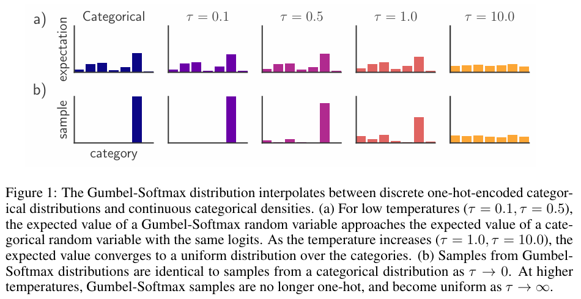

# Gumbel-Softmax

<script src="https://polyfill.io/v3/polyfill.min.js?features=es6"></script>
<script src="https://cdn.jsdelivr.net/npm/mathjax@3/es5/tex-chtml.js"></script>


### 前置：离散概率分布的采样
---

一般程序中对于离散概率分布采样方法为:

$$
z = \{ i \ | \ \sum_{k=1}^{i-1} p_k \leq u \}, \quad i=1,2,...,n
$$

其中$i=1,...,n$为类别的下标，随机变量$u \sim U(0,1)$，其中$\sum_{k=1}^{i-1} p_k$是累计概率的过程，类似于累计分布函数。

因此，我们可以首先在$[0,1]$之间均匀采样出$[0.1, 0.2,...,0.9]$，再将这9个值作为y值代入某个分布的CDF函数，求出x，即为采样得到的值。

### 介绍
---

论文：[Categorical Reparameterization with Gumbel-Softmax](https://arxiv.org/abs/1611.01144v5)

深度学习模型主要依靠梯度下降进行参数的更新，激活函数需要满足单调、处处可导等条件。对于ReLU函数，显然在$x=0$处不可导，理论上无法通过梯度下降进行优化。此时我们使用的是<B>次梯度</B>：当$x>0$时其导数为1，当$x<0$时为0，而当在$x=0$处时的次梯度为$c \in [0,1]$，一般直接取$c=0$
在许多机器学习任务中，需要从一个离散的分布中采样，但直接从离散的分布中采样是不连续的，无法使用反向传播来更新参数(<B>核心问题：离散采样不可导</B>)。

```Gumbel-Softmax```是一种结合```Gumbel```分布和```Softmax```函数的技巧，用于在离散变量的采样过程中实现梯度反向传播。

<B>Gumbel distribution</B>

其分布函数和概率密度函数分别为:

$$
F(x;\mu, \beta) = e^{-e^{-(x-\mu)/\beta}} ,\quad f(x;\mu, \beta) = \frac{1}{\beta} e^{[e^{-(x-\mu)/\beta} + (x-\mu)/\beta]}
$$

标准Gumbel分布(即$\mu=0,\beta=1$)的概率密度函数为:

$$
F(x) = e^{-e^{-x}} ,\quad f(x) = e^{-(e^{-x} + x)}
$$


<B>Gumbel-Max Trick</B>

因为：

$$
P(F^{-1}(u) \leq x) = P(u \leq F(x)) = F(x), \quad u \sim U(0,1).
$$

从Gumbel分布中采样, 只需:

$$
x = F^{-1}(u) = \mu - \beta \log(-\log(u))
$$

即$F^{-1}(u)$的分布函数为$F(x)$.

假设有一个离散的分布$[\pi_1, \pi_2,...,\pi_k]$共k类，$\pi_i$代表第i类的概率，有$P(z=i)=\pi_i$，我们希望从该分布中采样，则可以采用以下方法:

$$
\begin{aligned}
P(\log{\pi_i} + G_i \geq \max_{j \neq i} \{ \log{\pi_j} + G_j \}) = \int_{- \infty}^{+ \infty} f(x) P(x + \log{\pi_i} \geq \{ \log{\pi_j} + G_j \}_{j \neq i}) dx \\
\end{aligned}
$$

可知对于所有$j \neq i$，上式的概率条件可写为$G_j \leq x + \log{\pi_i} - \log{\pi_j}$ 

$$
P(G_j \leq x + \log{\pi_i} - \log{\pi_j}) = e^{-e^{-(x + \log{\pi_i} - \log{\pi_j})}} = e^{e^{-x} \cdot \frac{\pi_j}{\pi_i}}
$$

由于$G_j$是独立的```Gumbel```分布随机变量，我们将联合概率分解为各个独立事件的乘积：

$$
\begin{aligned}
P(x + \log{\pi_i} \geq \{ \log{\pi_j} + G_j \}_{j \neq i} ) &= \prod_{j \neq i} P(G_j \leq x + \log{\pi_i} - \log{\pi_j})  \\
& = \prod_{j \neq i} e^{e^{-x} \cdot \frac{\pi_j}{\pi_i}} = e^{- \sum_{j \neq i} (e^{-x} \cdot \frac{\pi_j}{\pi_i})} \\
&= e^{-e^{-x} \cdot \frac{1-\pi_i}{\pi_i}} \\
\end{aligned}
$$

代入上述公式中，可得：

$$
P(\log{\pi_i} + G_i \geq \max_{j \neq i} \{ \log{\pi_j} + G_j \})=\int_{- \infty}^{+ \infty} e^{-(e^{-x} + x)} \cdot e^{-e^{-x} \cdot \frac{1-\pi_i}{\pi_i}} dx \\
=\int_{- \infty}^{+ \infty} e^{-(x + e^{-x} \cdot \frac{1}{\pi_i} )} dx =\int_{- \infty}^{+ \infty} \pi_i e^{-[(x + \log{\pi_i}) + e^{-(x+\log{\pi_i})} ]} dx= \pi_i = P(z=i)\\
$$

因此将该分布的采样$z$等价于:

$$
z = \argmax_i{[G_i + \log{\pi_i}]}, \quad G_i \sim \text{Gumbel}(0,1)
$$

其中$G_i$也可以写成标准Gumbel分布的采样形式:

$$
G_i = -\log(-\log(u_i)), \quad u_i \sim U(0,1)
$$

实际上，```Gumbel-Max Trick```使用了这样的重参数技巧把采样过程分成了确定性的部分和随机性的部分（对数概率+噪声$G_i$）.。根据上述推导，选择```Gumbel```分布作为噪声，可以保证采样结果服从离散分布$[\pi_1, \pi_2,...,\pi_k]$。

> ```[0.1, 0.7, 0.2] -> [log(0.1) + gumbel_noise, log(0.7) + gumbel_noise, log(0.2) + gumbel_noise]```

<B>Gumbel Softmax</B>
---

显然，```Gumbel-Max Trick```中含有不可导的```argmax```，而我们可以使用可导的```softmax```函数来替换，得到公式：

$$
\pi_i' = \frac{e^{{(G_i + \log{\pi_i})}/\tau} }{\sum_{j=1}^{k} e^{(G_j + \log{\pi_j})/\tau}}, \quad G_i \sim \text{Gumbel}(0,1)
$$

其中$\tau$是温度系数，$\tau$越小，```softmax```的结果越逼近```argmax```，分布越尖锐；$\tau$越大，分布越平滑，接近于均匀分布。

