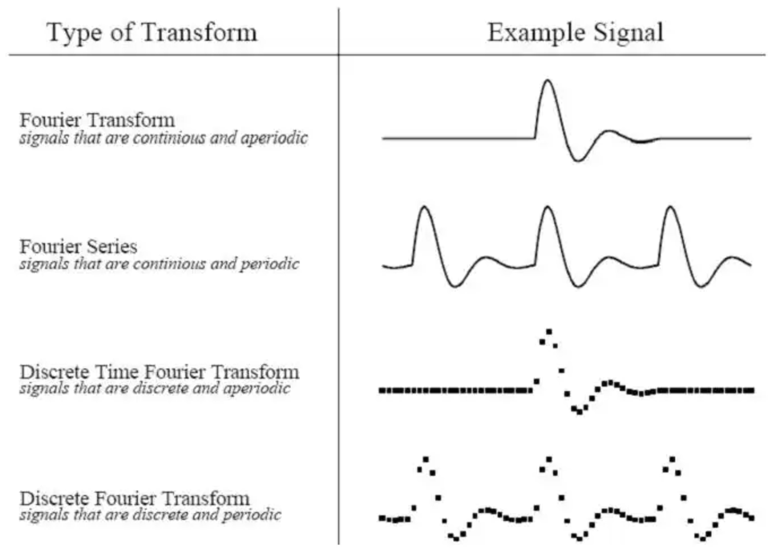

# 数学物理方法：Mathematical methods in Physics

!!! info "相关信息"
    
    
    相关阅读资料:《数学物理方法（第三版）》，吴崇试 编
    

## Fourier 变换

根据原信号的不同类型，我们可以把傅立叶变换分为四种类别：

1、非周期性连续信号：傅立叶变换（Fourier Transform） 

2、周期性连续信号：傅立叶级数(Fourier Series) 

3、非周期性离散信号：离散时域傅立叶变换（Discrete Time Fourier Transform） 

4、周期性离散信号：离散傅立叶变换(Discrete Fourier Transform) 

### 傅里叶级数

设$f(x)$是以$2L$为周期或只是定义在$[-L, L]$上，在$[-L,L]$上可积，则可展开为傅里叶级数：

$$
f(x) = \frac{a_0}{2} + \sum_{n=1}^{\infty} [a_n \cos (\frac{n \pi}{L} x) + b_n \sin (\frac{n \pi}{L} x)]
$$

其中：

$$
a_0 = \frac{1}{L} \int_{-L}^{L} f(x) dx
$$

$$
a_n = \frac{1}{L} \int_{-L}^{L} f(x) \cos (\frac{n \pi}{L} x) dx
$$

$$
b_n = \frac{1}{L} \int_{-L}^{L} f(x) \sin (\frac{n \pi}{L} x) dx
$$

