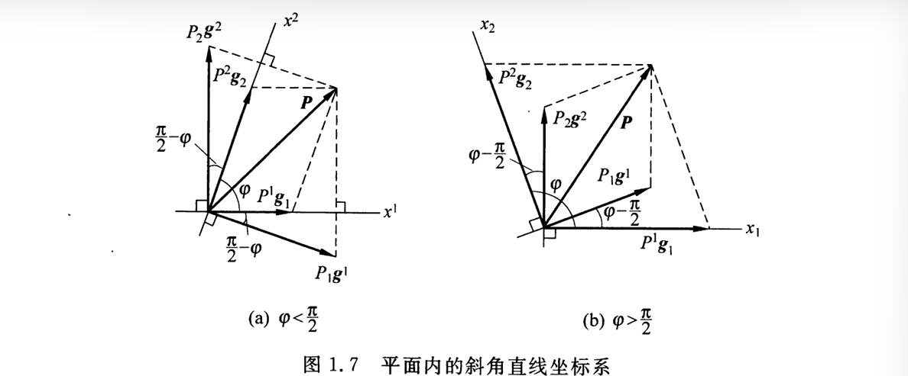
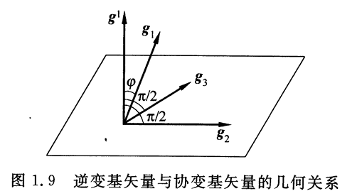
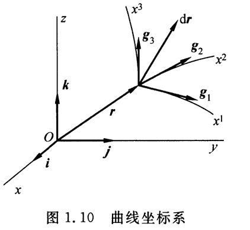

# 张量分析：Tensor Analysis

## 矢量与张量

### 基础运算
---

<B>维数（dimension）</B>：一个矢量空间所包含的最大线性无关矢量的数目。如，三维空间最多有3个线性无关的矢量

<B>叉积（cross product）</B>：两个矢量$u$和$v$的叉积$u×v$是一个矢量$w$，其方向垂直于$u$和$v$所决定的平面。其方向由右手定则确定。

$$
w = u×v = \begin{vmatrix}
\mathbf{i} & \mathbf{j} & \mathbf{k} \\
u_x & u_y & u_z \\
v_x & v_y & v_z \\
\end{vmatrix} 
$$

叉积的模为$|u×v|=|u||v| \sin{(u,v)}$

<B>混合积</B>：$[u \ v \ w] = (u \times v) \cdot w = u \cdot (v \times w) = \begin{vmatrix}
u_x & u_y & u_z \\
v_x & v_y & v_z \\
w_x & w_y & w_z \\
\end{vmatrix} = \begin{vmatrix}
u_x & v_x & w_x \\
u_y & v_y & w_y \\
u_z & v_z & w_z \\
\end{vmatrix} $，其物理意义为以$u$，$v$，$w$为棱的平行六面体的体积。（当$u,v,w$构成右手系时，六面体体积为正，即混合积$[u \ v \ w]$为正）

混合积的乘法：$[u \ v \ w] [u' \ v' \ w'] = \begin{vmatrix}
u \cdot u' & u \cdot v' & u \cdot w' \\
v \cdot u' & v \cdot v' & v \cdot w' \\
w \cdot u' & w \cdot v' & w \cdot w' \\
\end{vmatrix} $

### 平面斜角直线坐标系
---

笛卡尔坐标系是标准的正交直线坐标系，而平面斜角直线坐标系的坐标轴不互相垂直，存在夹角$\phi(\phi < \pi)$。

如下图，平面内的直线坐标系$x^1,x^2$，其坐标线互不正交。选取沿坐标线$x^1,x^2$的参考矢量$\mathbf{g}_{1},\mathbf{g}_{2}$

平面中的任意矢量$\mathbf{P}$可以分解为：$\mathbf{P} = P^1 \mathbf{g}_1+ P^2 \mathbf{g}_2 = \sum^2_{\alpha=1} P^\alpha \mathbf{g}_\alpha$

<B>哑指标</B>:采用爱因斯坦求和约定，我们可以省略表达式的求和符号$\sum$。在同一项中，以一个上指标与一个下指标成对出现，表示遍历其取值范围求和。如$\sum^2_{\alpha=1} P^\alpha \mathbf{g}_\alpha = P^\alpha \mathbf{g}_\alpha = P^\beta \mathbf{g}_\beta$

再引入一对于$\mathbf{g}_\alpha(\alpha=1,2)$对偶的参考矢量$\mathbf{g}^\alpha(\alpha=1,2)$，其中$\mathbf{g}^1$，$\mathbf{g}^2$分别与$\mathbf{g}_2$，$\mathbf{g}_1$相互正交，如上图。

$$
|\mathbf{g}^1| = \frac{1}{|\mathbf{g_1}| \sin{(\phi)}}，|\mathbf{g}^2| = \frac{1}{|\mathbf{g_2}| \sin{(\phi)}}
$$

其中，我们称$\mathbf{g}_\alpha(\alpha=1,2)$为<B>协变基矢量</B>，$\mathbf{g}^\beta(\beta=1,2)$为<B>逆变基矢量</B>。两者的<B>对偶条件</B>:

$$
\mathbf{g}_\alpha \cdot \mathbf{g}^\beta = \delta_\alpha^\beta(\alpha,\beta=1,2) = 
\begin{cases}
1, \quad \alpha = \beta \\
0, \quad \alpha \neq \beta
\end{cases}
$$

$\delta_\alpha^\beta$为$Kronecker \ \delta$(克罗内克Delta函数)

矢量对协变基矢量的分量成为矢量$\mathbf{P}$的<B>逆变分量</B>$P^\alpha = \mathbf{P} \cdot \mathbf{g}^\alpha（\alpha=1,2）$。同理，矢量对逆变基矢量的分量成为矢量$\mathbf{P}$的<B>协变分量</B>$P_\alpha = \mathbf{P} \cdot \mathbf{g}_\alpha（\alpha=1,2）$

### 三维空间的斜角直线坐标系
---

三维空间中的斜角直线坐标系$x^1,x^2,x^3$，其坐标线互不正交。其空间中的任意一点可用以原点为起点的矢径$\mathbf{r} = x^i \mathbf{g}_i（i=1,2,3）$表示。

显然，三维空间的协变基矢量$\mathbf{g}_i = \frac{\partial \mathbf{r}}{\partial x^i}$，称为自然基矢量（大小为沿着坐标线的单位长度）。

当$\mathbf{g}_1, \mathbf{g}_2, \mathbf{g}_3$构成右手系时，混合积为正：

$$
[\mathbf{g}_1 \ \mathbf{g}_2 \ \mathbf{g}_3] = \delta_{ij} = \sqrt{g}
$$

根据对偶条件：$\mathbf{g}^j \cdot \mathbf{g}_i = \delta^j_i (i,j=1,2,3) = G_{i,j},G_{3 \times 3} = \begin{bmatrix}
1 \ 0 \ 0 \\
0 \ 1 \ 0 \\
0 \ 0 \ 1 \\
\end{bmatrix} $

根据几何关系，逆变基矢量$\mathbf{g}^i$与对应的协变基矢量$\mathbf{g}_i$的夹角为$\phi$，则：

$$
|\mathbf{g}^i| = \frac{1}{|\mathbf{g}_i| cos(\phi)} 
$$

对逆变基矢量进行分解：$\mathbf{g}^i = \sum_{j=1}^3 g^{ij} \mathbf{g}_j  = g^{ij} \mathbf{g}_j \ (i = 1,2,3)$

对协变基矢量进行分解：$\mathbf{g}_i = g_{ij} \mathbf{g}^j \ (i = 1,2,3)$

显然，$\mathbf{g}_i \cdot \mathbf{g}_j = g_{ij} = g_{ji}，\ \mathbf{g}^i \cdot \mathbf{g}^j = g^{ij} = g^{ji}$

由系数构成的$3 \times 3$的对称矩阵$[g_{ij}]，[g^{ij}]$为互逆矩阵：

$$
[g_{ij}]= \begin{bmatrix}
g_{11} & g_{12} & g_{13} \\
g_{21} & g_{22} & g_{23} \\
g_{31} & g_{32} & g_{33} \\
\end{bmatrix}
=
\begin{bmatrix}
\mathbf{g}_1 \cdot \mathbf{g}_1 & \mathbf{g}_1 \cdot \mathbf{g}_2 & \mathbf{g}_1 \cdot \mathbf{g}_3 \\
\mathbf{g}_2 \cdot \mathbf{g}_1 & \mathbf{g}_2 \cdot \mathbf{g}_2 & \mathbf{g}_2 \cdot \mathbf{g}_3 \\
\mathbf{g}_3 \cdot \mathbf{g}_1 & \mathbf{g}_3 \cdot \mathbf{g}_2 & \mathbf{g}_3 \cdot \mathbf{g}_3 \\
\end{bmatrix}

$$

$$

[g^{ij}] = \begin{bmatrix}
g^{11} & g^{12} & g^{13} \\
g^{21} & g^{22} & g^{23} \\
g^{31} & g^{32} & g^{33} \\
\end{bmatrix}
=
\begin{bmatrix}
\mathbf{g}^1 \cdot \mathbf{g}^1 & \mathbf{g}^1 \cdot \mathbf{g}^2 & \mathbf{g}^1 \cdot \mathbf{g}^3 \\
\mathbf{g}^2 \cdot \mathbf{g}^1 & \mathbf{g}^2 \cdot \mathbf{g}^2 & \mathbf{g}^2 \cdot \mathbf{g}^3 \\
\mathbf{g}^3 \cdot \mathbf{g}^1 & \mathbf{g}^3 \cdot \mathbf{g}^2 & \mathbf{g}^3 \cdot \mathbf{g}^3 \\
\end{bmatrix}
$$

$$
\begin{aligned}
[g_{ij}][g^{ij}] =& [g_{ik}g^{kj} ] \ (i,j=1,2,3) \\
g_{ik}g^{kj} =& g_{ik} \mathbf{g}^k \cdot \mathbf{g}^j = \mathbf{g}_i \cdot \mathbf{g}^j = \delta_i^j \\
\end{aligned}
$$

因此$[g^{ij}] = [g_{ij}]^{-1}$

称$[g_{ij}]$为度量张量的协变分量，$[g^{ij}]$为度量张量的逆变分量。

显然，$[g_{ij}] = 
\begin{bmatrix}
\mathbf{g}_1 \\
\mathbf{g}_2 \\ 
\mathbf{g}_3 \\
\end{bmatrix}  \cdot \begin{bmatrix} \mathbf{g}_1 \ \mathbf{g}_2 \ \mathbf{g}_3 \end{bmatrix}$，则$det([g_{ij}]) = [\mathbf{g}_1 \ \mathbf{g}_2 \ \mathbf{g}_3]^2 = g$

$[\mathbf{g}^1 \ \mathbf{g}^2 \ \mathbf{g}^3] = [\mathbf{g}_1 \ \mathbf{g}_2 \ \mathbf{g}_3]^{-1} = \frac{1}{\sqrt{g}}$，因此若协变量基矢量$\mathbf{g}_1,\mathbf{g}_2,\mathbf{g}_3$构成右手系，$g > 0$，则逆变基矢量$\mathbf{g}^1,\mathbf{g}^2,\mathbf{g}^3$也构成右手系。

<B>指标升降关系</B>：已知$\mathbf{P} = P^i \mathbf{g}_i = P_j \mathbf{g}^j $，$\mathbf{P}$为空间任一矢量，则有：

$$
\begin{aligned}
P^i = \mathbf{P} \cdot \mathbf{g}^i = P_k \mathbf{g}^k \cdot \mathbf{g}^i = P_k g^{ki} \\
P_j = \mathbf{P} \cdot \mathbf{g}_j = P^k \mathbf{g}_k \cdot \mathbf{g}_j = P^k g_{kj} \\
\end{aligned}
$$

利用协变与逆变分量，可以将内积运算写成：$\mathbf{X} \cdot \mathbf{Y} = (x^i \mathbf{g}_i) \cdot (y_j \mathbf{g}^j) = x^i y_i = x_i y^i = x^i y^i g_{ij} = g^{ij} x_i y_i$

### 曲线坐标系
---

设三维空间中任意点P的位置用固定点O到该点的矢径$\mathbf{r}$表示：

$$
\mathbf{r} = \mathbf{r} (x^1,x^2,x^3)
$$

借助笛卡尔坐标系$x,y,z$以及标准正交基$\mathbf{i},\mathbf{j},\mathbf{k}$来表示：

$$
\mathbf{r} = x(x^1,x^2,x^3) \ \mathbf{i} + y(x^1,x^2,x^3) \ \mathbf{j} + z(x^1,x^2,x^3) \ \mathbf{k} 
$$

- 要求：曲线坐标$x^i$与空间点一一对应，即函数$ x(x^1,x^2,x^3),y(x^1,x^2,x^3),z(x^1,x^2,x^3)$在$x^i$的定义域内<B>单值、连续光滑且可逆</B>:

$$
det([\frac{\partial x^{k'}}{\partial x^i}]) \neq 0 \quad (x^{k'} = x,y,z)
$$

$$
det([\frac{\partial x^i}{\partial x^{k'}}]) \neq 0 
$$

即该曲线坐标系的Jacobian行列式不为零。

假设坐标存在微小的增量$d \mathbf{r} = \frac{\partial \mathbf{r}}{\partial x^i} dx^i = \mathbf{g_i} dx_i$，其中$\mathbf{g_i}= \frac{\partial \mathbf{r}}{\partial x^i} \ (i=1,2,3)$为<B>协变基矢量</B>或<B>自然局部基矢量</B>，

$\mathbf{g_i} \ (i=1,2,3)$沿着P点的3根坐标线的切线并指向$x^i$增加的方向，形成了一组3个非共面的活动标架，称为空间某点关于曲线系$(x^1,x^2,x^3)$的<B>切标架</B>。显然，基矢量$\mathbf{g_i}$不是常矢量，随着空间点位置的变化而变化，因此是一种局部基矢量。

$$
\mathbf{g_i} = \frac{\partial x}{\partial x^i} \mathbf{i}+\frac{\partial y}{\partial x^i} \mathbf{j}+\frac{\partial z}{\partial x^i} \mathbf{k} \ (i=1,2,3)
$$

根据对偶条件，引入一组与$\mathbf{g_i}$对应的逆变基矢量$\mathbf{g^j} \ (j=1,2,3)$，同样是空间每一点的局部标架。显然，逆变基矢量是坐标面的在某点的梯度：

$$
\mathbf{g^j} = \nabla x^j = grad \ x^j = \frac{\partial x^j}{\partial x} \mathbf{i}+\frac{\partial y^j}{\partial y} \mathbf{j}+\frac{\partial z^j}{\partial z} \mathbf{k} \ (j=1,2,3)
$$

因此线元$d \mathbf{r}$的分解：

$$
d \mathbf{r} = \mathbf{g_i} dx^i = \mathbf{g^j} dx_j
$$

指标升降关系：$dx_i = g_{ij} dx^j$。

### 正交曲线坐标系
---

若曲线坐标系$(x^1,x^2,x^3)$的坐标线处处正交，则为正交曲线坐标系

正交系满足：$g_{ij}=g^{ij}=0，i \neq j，i,j=1,2,3$，显然度量张量矩阵$[g_{ij}],[g^{ij}]$为对角矩阵，且$\mathbf{g_i}$与$\mathbf{g^i}$共线。

线元$d \mathbf{r}$的长度平方$ds^2 = d \mathbf{r} \cdot d \mathbf{r} = g_{11} (dx^1)^2 + g_{22} (dx^2)^2 + g_{33} (dx^3)^2 $。定义Lamé常数$A_i (i=1,2,3) = \sqrt{g_{ii}}$。

因此$ds^2  = (A_1 dx^1)^2 + (A_2 dx^2)^2 + (A_3 dx^3)^2$

> 为了求解正交系中的度量张量，先由几何方法得出矢径的微分与坐标的微分之间的关系，确定$A_i$，再因此得到度量张量的协变分量$g_{ij}$，进而也得到逆变分量$g^{ij}$。

### 坐标转换
---

假设有一组老坐标系$x^i$和新坐标系$x^{j'}$，之间存在$x^i(x^{j'})$或$x^{j'}(x^i)$的函数关系（满足Jacobian行列式不为零）。

将新坐标的基矢量对老坐标的基矢量分解：

$$
\mathbf{g}_{i'} = \beta^j_{i'} \mathbf{g}_j , \quad
\mathbf{g}^{i'} = \beta_j^{i'} \mathbf{g}^j \ (i'=1,2,3)
$$

其中，$\beta^j_{i'}, \ \beta_j^{i'}$分别为协变转换系数和逆变转换系数，形成$3 \times 3$矩阵。显然，$[\beta^j_{i'}]$与$[\beta_j^{i'}]$互逆。

$$
\delta^{j'}_{i'} = \mathbf{g}_{i'} \cdot \mathbf{g}^{j'} = \beta^k_{i'} \mathbf{g}_{k}  \cdot \beta^{j'}_{l} \mathbf{g}^{l} = \beta^k_{i'} \beta^{j'}_{l} \delta^l_k = \beta^k_{i'} \beta^{j'}_{k} \quad (i',j'=1,2,3)
$$

因此老坐标的基矢量对新坐标的基矢量分解：

$$
\mathbf{g}_{j} = \beta_j^{i'} \mathbf{g}_{i'} , \quad
\mathbf{g}^{j} = \beta^j_{i'} \mathbf{g}^{i'} \ (j=1,2,3)
$$

> 新老坐标的协变基与逆变基矢量之间的转换只需要9个独立的系数

上述提到$\mathbf{g}_{i'} = \frac{\partial \mathbf{r}}{\partial x^{i'}} = \frac{\partial \mathbf{r}}{\partial x^{j}} \frac{\partial \mathbf{x^{j}}}{\partial x^{i'}} = \frac{\partial \mathbf{x^{j}}}{\partial x^{i'}} \mathbf{g}_{j}$ \quad (i'=1,2,3)。因此协变转换系数:

$$
\beta^j_{i'} = \frac{\partial x^{j}}{\partial x^{i'}} \quad (i',j=1,2,3)
$$

逆变转换系数：

$$
\beta_j^{i'} = \frac{\partial x^{i'}}{\partial x^{j}} \quad (i',j=1,2,3)
$$

因此,$\ \mathbf{g}^{i'} = \frac{\partial \mathbf{x^{i'}}}{\partial x^{j}} \mathbf{g}^{j} \quad (i'=1,2,3)$

对空间中的任意矢量$\mathbf{v}$，其在新老坐标系的分解：

$$
\begin{aligned}
\mathbf{v} &= v_j \mathbf{g}^j = v_{i'} \mathbf{g}^{i'} \\
&= v^j \mathbf{g}_j = v^{i'} \mathbf{g}_{i'} \\
\end{aligned}
$$

由上式显然可得，$v_{i'} = v_j \beta^j_{i'} \quad v^{i'} = v^j \beta_j^{i'}$

度量张量分量在新老坐标系中的转换：

$$
\begin{aligned}
g_{i'j'} =& \mathbf{g}_{i'} \cdot \mathbf{g}_{j'} = \beta^k_{i'} \mathbf{g}_{k} \cdot \beta^l_{j'} \mathbf{g}_{l} = \beta^k_{i'} \beta^l_{j'} g_{kl} \quad (i',j'=1,2,3) \\
g_{ij} =& \beta^{k'}_{i} \beta^{l'}_{j} g_{kl} \quad (i,j=1,2,3) \\
g^{ij} =& \beta_{k'}^{i} \beta_{l'}^{j} g^{k'l'} \quad (i,j=1,2,3) \\
g^{i'j'} =& \beta_{k}^{i'} \beta_{l}^{j'} g^{kl} \quad (i',j'=1,2,3) \\
\end{aligned}
$$

假设任意曲线坐标系$(x^1,x^2,x^3)$与笛卡尔标准正交坐标系$(x^{1'}=x,y^{1'}=y,z^{1'}=z)$存在转换关系$x^i(x,y,z)$，坐标转换系数$\beta^{k'}_i=\partial x^{k'} / \partial x^i$，则：

$$
\begin{aligned}
g_{11} =& \beta^{k'}_1 \beta^{l'}_1 g_{k'l'} = \beta^{1'}_1 \beta^{1'}_1 g_{1'1'} + \beta^{2'}_1 \beta^{2'}_1 g_{2'2'} + \beta^{3'}_1 \beta^{3'}_1 g_{3'3'} = (\frac{\partial x}{\partial x^{1}})^2 + (\frac{\partial y}{\partial x^{1}})^2 + (\frac{\partial z}{\partial x^{1}})^2 \\
g_{12} =& g_{21} = \beta^{k'}_1 \beta^{l'}_2 g_{k'l'} =\beta^{1'}_1 \beta^{1'}_2 g_{1'1'} + \beta^{2'}_1 \beta^{2'}_2 g_{2'2'} + \beta^{32'}_1 \beta^{3'}_2 g_{3'3'} = (\frac{\partial x}{\partial x^{1}})( \frac{\partial x}{\partial x^{2}}) + (\frac{\partial y}{\partial x^{1}}) (\frac{\partial y}{\partial x^{2}}) + (\frac{\partial z}{\partial x^{1}}) (\frac{\partial z}{\partial x^{2}}) \\
.....
\end{aligned}
$$

### 并矢
---

$\mathbf{a} \otimes \mathbf{b}$或$\mathbf{a}\mathbf{b}$称为并矢，也成为张量积

设矢量$\mathbf{a}=(a_1,a_2,a_3)^T, \mathbf{b}=(b_1,b_2,b_3)^T$构成$3\times 1$的矩阵，则其并矢

$$
\mathbf{a} \otimes \mathbf{b}= 
\begin{bmatrix}
a_1b_1 & a_1b_2 & a_1b_3 \\
a_2b_1 & a_2b_2 & a_2b_3 \\
a_3b_1 & a_3b_2 & a_3b_3 \\
\end{bmatrix} = 
\begin{bmatrix}
a_1 \\
a_2 \\
a_3 \\
\end{bmatrix} 
\begin{bmatrix}
b_1 & b_2 & b_3 \\
\end{bmatrix} 
$$

显然，$\mathbf{a} \otimes \mathbf{b} \neq \mathbf{b} \otimes \mathbf{a}$，并矢中的矢量顺序不能随意调换。

$$
(\mathbf{a} \otimes \mathbf{b})^T = \mathbf{b} \otimes \mathbf{a}
$$

并矢的点积：指的是将相邻的两个矢量进行缩并

$$
\begin{aligned}
\mathbf{u} \cdot (\mathbf{a} \mathbf{b}) = (\mathbf{u} \cdot \mathbf{a}) \mathbf{b} \\
(\mathbf{a} \mathbf{b}) \cdot \mathbf{u} = (\mathbf{b} \cdot \mathbf{u})\mathbf{a}  \\
(\mathbf{a} \mathbf{b}) \cdot (\mathbf{c} \mathbf{d} ) = (\mathbf{b} \cdot \mathbf{c} ) \mathbf{a} \mathbf{d} \\ 
\end{aligned}
$$

并矢的缩并：若取某两个矢量进行点积，称为缩并。（一次缩并使得并矢的阶数降低两阶）

如设四阶并矢$\mathbf{abcd}$,进行缩并,降为二阶并矢：

$$
\mathbf{a} \cdot \mathbf{bcd} = (\mathbf{a} \cdot \mathbf{b}) \mathbf{cd} 
$$

$$
\mathbf{abc} \cdot \mathbf{d}= (\mathbf{c} \cdot \mathbf{d}) \mathbf{ab} 
$$

> 双点积指的是两个张量元素之间的乘积，对于相同形状的矩阵$A,B$，双点积记为$A:B = \sum_{i.j} A_{ij}B_{ij}$

两个并矢的双点积：指的是将它们最邻近的4个矢量两两缩并

- 并联式：$\mathbf{a} \mathbf{b} : \mathbf{c} \mathbf{d} = (\mathbf{a} \cdot \mathbf{c})( \mathbf{b} \cdot \mathbf{d})$
- 串联式：$\mathbf{a} \mathbf{b} \cdot \cdot \ \mathbf{c} \mathbf{d} = (\mathbf{b} \cdot \mathbf{c})( \mathbf{a} \cdot \mathbf{d})$

对一个二阶并矢$T=AB$，引入两组线性无关的基矢量$\mathbf{(a_1,a_2,a_3), (b_1,b_2,b_3)}$，则:

$$
\mathbf{T} = (A^i \mathbf{a}_i)(B^j \mathbf{b}_j) = A^i B^j \mathbf{a}_i \mathbf{b}_j = T^{ij} \mathbf{a}_i \mathbf{b}_j
$$

易得$T^{ij} = A^i B^j \quad (i,j=1,2,3)$共9个分量，并且$\mathbf{a}_i \mathbf{b}_j$是9个线性无关的二阶并基。

因此，对于三阶并矢$\mathbf{T = ABC} = T^{ijk} \mathbf{a}_i \mathbf{b}_j \mathbf{c}_k$，存在$3^3=27$个并基和对应的分量。

### 张量的概念
---

张量