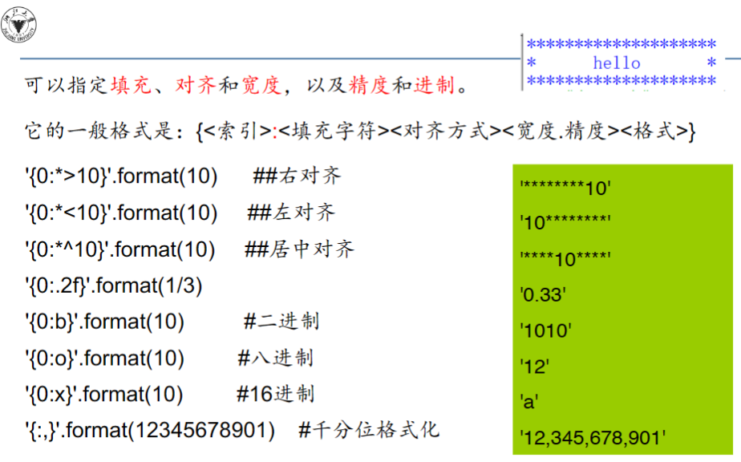

# 🔗Python校内课程笔记
<script src="https://polyfill.io/v3/polyfill.min.js?features=es6"></script>
<script src="https://cdn.jsdelivr.net/npm/mathjax@3/es5/tex-chtml.js"></script>
!!! info "想说的话"
    <font size = 4><B>人生苦短,我学Pyhton.</B></font>
    
    <font size = 3>

    我的培养方案中Python程序设计是必修的一门课,本页结合课内要求和**[CS50p](https://cs50.harvard.edu/python/)**做一个比较完善的个人笔记,用于应付课程考试
    
    官方文档:[https://docs.python.org/3/library/functions.html](https://docs.python.org/3/library/functions.html)
    </font>

### 🎨一些零碎知识点
---

#### 语句格式
```python
a=1;b=2;c=3         # 用分号在一行中输入多个语句

sum = a + b \       # 使用'\'来续行
    + c
```

#### 科学计数法e
对于很大的浮点数,可用e代替10,其中e后面的数字必须为整数
```python
>>>1.32e-1
0.132
>>>1.32e0
1.32
```
>不是所有实数在计算机中都可以精确表达,所以会存在误差

#### 复数 real + imag * j
>   ```python
    >>>type(3+4J)         # j/J虚部字母大小写均可
    complex               # 复数的数据类型
    >>>a = complex(3,4)
    >>>a.real, a.imag     # 复数的实部、虚部为浮点数(float)
    (3.0,4.0)
    >>>a.conjugate()
    3-4J
    ```

#### 进制转换
---

>- 0b,0B 二进制
 - 0x,0X 十六进制
 - 0o,0O 八进制

```python
>>>list(bin(3),oct(10),hex(15))       # 只能转换整数!
('0b11', '0o12', '0xf')
>>>type(bin(3))      # 输出的是字符串
str
```
>int()转换进制(输出十进制)

```python
>>>int('101',2)
5
>>>int('0x1d',16)
29
>>>int('0b101',2)
5
```

### eval('str')函数
将字符串当成有效的表达式来求值，并返回计算结果

> eval()函数会把输入的字符串的<B>引号去掉</B>，把中间的内容当成Python的代码，并执行这段代码返回执行结果
```python
>>>eval("254+1")
255
>>eval("'+' * 5")
+++++
>>>eval('[1,2,3,4,5]')
[1, 2, 3, 4, 5]
```

#### 空值None
---

不同于0、False或空字符串，None是一个独立的数据类型（NoneType）。只有None可以等于None。
```python
>>>type(None)
NoneType
>>>None == 0 or [None] == [] or '' == 'None' # None表示空值但不等于空
False
>>>1 > None        # None 不能作大小比较
TypeError: '>' not supported between instances of 'int' and 'NoneType'
```

#### 字符串无法修改
```python
>>>s = 'abc'
>>>s[0] = 'k'
TypeError: 'str' object does not support item assignment
>>>s[4] = 'u'            #添加也不行
TypeError: 'str' object does not support item assignment
```


### 📠Ascii码-Unicode编码-UTF-8编码
---
pta和课本上有相关题目,因此做简单的概念区分

- <B>"Ascii码"</B>:用二进制编码来表示非数值的文字与符号(数字化),如今普遍采用的就是ASCII(美国信息交换标准代码),有7位二进制与八位二进制两种版本(国际通用7位,有$2^7 = 128$个元素),与 Unicode 编码和 UTF-8 编码兼容
> 字符 A:65,a:97,Z:90,z:122

- <B>"Unicode编码"</B>:包含了世界上几乎所有的字符，包括各种语言的文字、符号、表情符号等。它是目前使用最广泛的字符编码方案，可以满足不同语言和文化之间的交流需求。Python3中的字符串是Unicode字符串而不是字节数组.

- <B>"UTF-8"</B>:是 Unicode 编码的一种实现方式,使用1到4个字节来表示不同的字符,特点是对不同范围的字符使用不同长度的编码(不等长).对于0x00-0x7f之间的字符,UTF8与ascii编码完全一致.

#### ord()与chr()
用于将字符转换为整数(ord())，以及将整数转换为字符(chr())
```python
# 将字符转换为Unicode代码点值
>>>ord('a')
97
# 将整数转换为字符
>>>chr(65)
A
>>>ord('ab')
TypeError: ord() expected a character, but string of length 2 found
>>>ord('a'and'b')
98
>>>ord('我')    # 输出对应的Unicode码
25105
>>>chr(20014)
'丰'
```

#### int--float
```python
>>>32.2//6-24//6
1.0                 # 32.2为float 输出浮点型1.0
```


### ✍print(*objects, sep=' ', end='\n', file=None, flush=False):
---
!!! info ""
    <font size = 3>print函数自带sep=' ',输出多个变量时有空格隔开</font>

### 📒字符串str
---

>Python3d的字符串缺省编码为Unicode编码

!!! advice "特性"
    - <font size = 4>可拼接</font>:
        ```python
        >>>"abc" + '123'
        'abc123'
        >>>"abc" + 123
        TypeError: can only concatenate str (not "int") to str
        ```
    - <font size = 4>可复制</font>:
        ```python
        >>>'abc' * 5
        'abcabcabcabcabc'
        >>>abc' * 0
        ''     # 空字符
        ```

#### 字符串转换方法
---
<font size = 4>

>方法将字符串转换输出,但没有改变原变量

|方法|功能|
|-|-|
|x.capitalize()|#返回首字母大写其他字母都小写的字符串|
|x.casefold()|#返回所有字母都小写的字符串|
|x.title()|#返回每个单词首字母大写其他字母小写的字符串|
|x.upper() / x.lower()|#将所有字母都转换成大/小写|
|x.swapcase()|#反转字符串大小写|
|x.strip()/.rstrip()/.lstrip()|#只去除字符串两端/右边/左边的空格|
|x.center(width, [fillchar])|字符串居中对齐的方法,在字符串两侧填充指定的字符|
</font>

```python
>>>name = 'zju hello'
>>>name.capitalize()          # 转换为首字母大写的字符串
'Zju hello'             
>>>name.title()               # 每个单词首字母大写,仅识别空格隔开的单词
'Zju Hello'
>>>name.upper()
'ZJU HELLO'
>>>block = '  twist zz '
>>>block.strip()
'twist zz'                     # 仅去除字符串两端空格
>>>sentence = "Python is awesome"
>>>sentence.center(24, '*')
'***Python is awesome****'
```


#### 隐式字符串连接
>如果两个字符串直接相邻，它们会自动连接在一起
 ```python
 >>>'aa' 'b'
 'aab'
 ```

#### 原始字符串
>使用r字符转换为原始字符串,字符串中的'\n'等转义字符将被识别为普通字符
```python
sentence_1 = '''hello      
world'''                         #用''' '''来表示跨多行的长字符串
sentence_2 = 'hello\nworld'
sentence_3 = r'hello\nworld'     # 转为原始字符串
>>>sentence_1 == sentence_2
True
>>>sentence_2 == sentence_3
False
```
#### 拆分,替换,查找
```python
S = 'sha bby'
>>>S.split(' ')        # 将字符串拆分位list
['sha', 'bby']
>>>S.replace(' bby','rk')      # 替换指定字符串
'shark'
>>>(S*4).replace(' bby','rk')   # 会无差别替换所有指定字符串
'sharksharksharkshark'
>>>(S*4).count('bby')           # 统计某指定字符串出现次数
4
>>>(S*4).find('bby')            # 查找 某指定字符串第一次出现的地方
4
>>>(S*4).find('bby',5,15)       # 指定范围
11
>>>(S*4).find('bby',1,2)        # 无法找到则输出-1
-1
```
#### 字符串不可修改
```python
>>>s = 'hello'
>>>s[0] = 'f'
# 对字符串元素的赋值时非法的
```


### 🌦浮点数相关
```python 
>>>divmod(9.0,2.5)      # 求(商,余数)
(3.0, 1.5)              # 范围tuple类型
>>>round(4.55,1)              # 四舍五入 round( number[, ndigits=None] ) ndigits控制保留到小数点后几位
4 # 而不是3.6, Python 3.x采用“round half to even”,将.5的值舍入到最近的偶数结果，而不是向上舍入  
>>>abs(-44)
44
```

### ❌布尔值相关bool
---

#### 字符串与数字不能比较大小
```python
>>>"hello" > 3 
TypeError:unorderable types:str()>int()
```

#### 短路运算符'and'、'or'
'and'、'or'会返回最后一个被计算的表达式的值:

- 'and'运算符：
  如果所有表达式都为真（True），则返回最后一个表达式的值；如果有任何一个表达式为假（False），则返回第一个为假的表达式的值。#当$A_1$ and $B_2$时,若$A_1$为真,则返回$B_2$,否则返回$A_1$.
  
    ```python
        # and 运算符示例
        a = 1
        b = 5
        print(a and b)  # 输出5
        print(a and False)  # 输出False
        print(a and None)  # 输出None
        print(False and a)  # 输出False
        print(None and a)  # 输出None
        print(True and 'a' and 2 and 5>2)  # 输出True
    ```

- 'or'运算符：
  如果有任何一个表达式为真（True），则返回第一个为真的表达式的值；如果所有表达式都为假（False），则返回最后一个表达式的值。#当$A_1$ and $B_2$时,若$A_1$为真,则返回$A_1$,否则返回$B_2$.
    ```python
    # or 运算符示例
    print(2 or False)  # 输出2
    print(0 or False)  # 输出False
    print(0 or False or {} or 4)  # 输出4
    ```

>所有非零值在参与逻辑运算时作为True的逻辑量,0作为False

#### 布尔值可作数字运算,True为1,false为0

```python
>>>True > 0.5
True
>>>True > False
True
>>> True > None
TypeError: '>' not supported between instances of 'bool' and 'NoneType'
```

### 📑列表list
---

#### 空列表[]
```python
>>>type([])
list
>>>[] + 'a'        # 空列表不能直接加字符串
TypeError: can only concatenate list (not "str") to list
>>>[] + ['a']
['a']
>>>['a'] * 2
['a', 'a']
>>>[] == 0 or [] == None or [] == {} 
False
>>>[] == list()
True
>>>bool([])   # [] and 1>2
False
```

#### 列表推导式
用于创建列表的紧凑语法,根据现有的可迭代对象（如列表、元组、集合等）快速构建新的列表
```python
old_list = [1, 2, 3, 4, 5]
new_list = [x * 2 for x in old_list if x % 2 == 0]
>>>new_list 
[4, 8]
```

#### 同时对两个或多个可迭代对象的列表推导式
```python
list1 = [1, 2, 3]
list2 = ['a', 'b', 'c']
combined_list = [(x, y) for x in list1 for y in list2 if x % 2 == 0 and y != 'a']
>>>combined_list
[(2, 'b'), (2, 'c')]
```
Tips:但假如两个可迭代对象的长度不同,则会对但的对象重复输出
```python
list1 = [1, 2, 3]
list2 = ['a', 'b']
combined_list = [(x, y) for x in list1 for y in list2]
>>>combined_list
[(1, 'a'), (1, 'b'), (2, 'a'), (2, 'b'), (3, 'a'), (3, 'b')]
```

#### 同一序列多种形式组成
```python
>>>[1/i if i % 2 == 2 else -1/i for i in range(1,6)]
[-1.0, -0.5, -0.3333333333333333, -0.25, -0.2]
>>>[1/i if i % 2 == 0 else -1/i for i in range(1,10) if i % 2 ==1]
[-1.0, -0.3333333333333333, -0.2, -0.14285714285714285, -0.1111111111111111]
```
#### 切片操作
|0|1|2|3|4|
|-|-|-|-|-|
|a|b|c|d|e|
|-5|-4|-3|-2|-1|

```python
lis = [i for i in range(1,6)]
>>>lis[::-1]                         # 将元素倒序 
[5, 4, 3, 2, 1]
>>>lis[1:3:-1]                       # 步长为负数,但索引正向,则返回空列表[]
[]
```
#### b=a 与b=a[:] 的区分
--- 

- b = a 是将b指向a列表的引用,因此a,b会同步改变元素
```python
a = list(range(1,5))
b = a 
b += [99]
>>>a
[1, 2, 3, 4, 99]
```

-  b = a[:]创建了一个a的副本并将其赋值给b,a与b不会互相影响

- b = a[1]是对a列表中索引为1的元素的引用,然而修改了b的值,a表中的元素并不会受到影响

#### del 删除元素
```python
>>>name = ['Alice', 'Kim', 'Karl', 'John']
>>>del name[2]
>>>name
['Alice','Kim','John']
```
#### 列表常用方法

|方法|功能|
|-|-|
|str.append(x)|在末尾追加x|
|str.clear|清除所有元素|
|str.count(x)|统计列表中x出现的次数|
|str.copy()|创建列表备份|
|str.remove(x)|删除<B>值为x</B>的第一个元素|
|str.sort()|列表元素排列|
|str.reverse()|倒序列表|
|str.insert(index,x)|在index处插入x|
|str.index(value[,start[,stop]])|在指定范围内寻找value第一次出现的下标|
|str.extend()|将列表x扩充到str中(类似.append(),能够一次添加多个元素)|
|str.sort(reverse=False)|列表元素排序,默认升序(False)|

```python
>>>a = [2,3,5,7,11,13]
>>>a.remove(4)               # 无法清除列表中没有的元素
ValueError: list.remove(x): x not in list

>>>a.reverse()               # 将列表反转,会直接改变a列表的值
>>>a
[13, 11, 7, 5, 3, 2]

>>>a.index(6)                # 无法找出列表中没有的元素
ValueError: 6 is not in list

>>>a = [1,2,3,5,4,8,0]
>>>type(a.sort(reverse = True)),type(a.remove(4)),type(a.clear())
(NoneType, NoneType, NoneType)

#a.sort()方法会直接修改列表a，并返回None。对于会改变数据的函数和方法（如list.sort()），通常会返回None类型，以提示它们是在原地修改数据
```


#### 聚合.join()函数
---
.join()函数可将一个列表的字符串类型元素组合为<B>单独一个字符串<／B>:

```格式:<分隔符>.join(x)```

```python
>>>a = ['Hello','world','!!']
>>>':'.join(a)
'Hello:world:!!'
>>>b = ['Hello',123]
>>>' '.join(b)                     # 若列表中存在非str元素,则会报错
TypeError: sequence item 1: expected str instance, int found
```


### 🖇for循环语句 (important)
---
>for循环语句用于迭代序列（可以是列表、元组、字典、集合或字符串）中的每个项目

- 遍历字符串:
即使字符串是不可变对象，它们也是可迭代对象，可以使用for循环遍历字符串中的每个字符。
```python
word = "banana"
for x in word:
    print(x)
```

- range(start=0, stop, step=1)函数:
可用于指定循环的次数,根据step递增/递减到指定数字stop结束(但是不包括stop)
```python
>>>type(range(1,5))
<class 'range'>          # 作为一种特殊的range对象,代表特定区间的序列
>>>list(range(1,5))
[1, 2, 3, 4]             # 不包括5
```

- 在for循环中使用else:
在for循环结束后执行else中的代码块。但如果循环被break语句中止，则不会执行else块。
```python
for x in range(6):
    sum += x
else:
    print("Finally finished!")
```

- break语句/continue语句:
break语句可用于提前退出循环(与if语句配合)
continue语句用于跳过当前迭代并继续下一次迭代(跳过特定值)
```python
fruits = ["apple", "banana", "cherry"]
for x in fruits:
    print(x)
    if x == "banana":
        break

for x in fruits:
    if x == "banana":
        continue
    print(x)
```
- 遍历列表list()


### ✨F-string (important)
---
F-string是一种格式化字符串常量，它允许我们在字符串中插入变量或表达式，并以指定的格式输出。
>在格式化的字符串中，使用大括号 {} 来表示需要被替换的字段，而不在大括号 {} 内的内容将会被原样输出。如果想要输出大括号 {} 字符本身，可以使用双层大括号 {{}} 将其包裹起来。通过在大括号 {} 中直接填入要替换的内容，我们可以轻松地生成格式化后的字符串。

#### 常用格式(f,d,s)

```python
float_0 = 2305.665
int_0 = 230
word = 'machinewjq'

>>>f'Results of the {float_0:.2f}'        # :.?f 保留n位小数(Banker's rounding)
>>>'Results of the 2305.66'
>>>f'Results of the {int_0:.2f}'
>>>'Results of the 230.00'                # int转float输出

>>>f'Results of the {float_0:10d}'            # 浮点数无法使用'最小字符宽度设置d'
>>>ValueError: Unknown format code 'd' for object of type 'float'
>>>f'Results of the {int_0:10d}'
>>>'Results of the       2305'
>>>f'Results of the {int_0:3d}'               # 当设置宽度小于原字符串,则不会变动
>>>'Results of the       2305'
``` 
可知f与d互斥,不能一起使用(f用于float,d用于int,字符串使用s)
```python
>>>f'this is {int_0:#>10}'
'this is #######230'          # 右对齐,#填充
>>>f'this is {int_0:-^10}'
'this is ---230----'          # 居中,-填充

table = {'Sjoerd': 4127, 'Jack': 4098, 'Dcab': 7678}
for name, phone in table.items():
    print(f'{name:10} ==> {phone:10d}')
#Sjoerd     ==>       4127
#Jack       ==>       4098
#Dcab       ==>       7678
```

!!! note "一种特殊使用"
    对于字符串str
    ```python
    name = "Alice"
    formatted_name = f"{name:0>8s}"     #字符串使用s
    >>>formatted_name
    '000Alice'
    >>>'{:>08s}'.format(bin(31)[2:])
    '00011111'
    >>>'{:08s}'.format(bin(31)[2:])
    '11111000'                      # 字符串s默认左对齐
    >>>'{:8s}'.format(bin(31)[2:])
    '11111   '
    >>>'{:8d}'.format(123)
    '     123'                     # 整数d默认右对齐 
    >>>'{:08d}'.format(123)
    '00000123'
    ```
    其中的{:0ns}、{:0nd}是相较于{:ns}、{:nd}的一种特殊用法,<B>表示用0填充</B>,而默认为用空格填充.




#### 分隔符/小数点/科学计数法
---
```python
this_num = 1234.5678
>>>f'this number is {this_num:,}'    #千位分隔符
'this number is 1,234.5678'

>>>f'this number is {this_num:.2e}'   # 科学计数法+保留2位小数
'this number is 1.23e+03'
```

#### if/else条件f-string
---
```python
score = 65
>>>f'student {'pass' if score > 60 else 'fail'}'
'student pass'
```

### 💭tuple 元组 (important!)
---
tuple是<B>不可修改</B>的任何类别的数据序列

#### 从函数中返回多个值时，通常会使用tuple

```python
def xxx():
    name = "John"
    age = 22
    return name, age    # 实际上,使用逗号分隔即可创建元组

result = xxx()
print(result)         # ('John', 30)
```

#### 更新元组

虽然元组是不可更改的，但可以通过将元组转换为列表、修改列表，然后再转换回元组来间接更新元组

```python
my_tuple = (1, 2, 3)
# 将元组转换为列表，更新列表，然后再转换回元组
my_list = list(my_tuple)
my_list[1] = 4
updated_tuple = tuple(my_list)
print(updated_tuple)  # 输出: (1, 4, 3)
```

#### 元组常用函数/方法
> sorted()会把tuple等类型转换为list, 返回的是一个新的已排序的列表，不会改变原始的元组

```python
my_tuple = (3, 1, 4, 2)
# 对元组中的元素进行排序
sorted_tuple = sorted(my_tuple) 
print(sorted_tuple)  
# 输出: [1, 2, 3, 4]

my_tuple_A = (1, 4, 2, 'a')              # 当元组中str与int/float混合时,不能使用sorted()排序
sorted_tuple_A = sorted(my_tuple_A)
# TypeError: '<' not supported between instances of 'str' and 'int'

my_tuple_B = ('b', 'a', 'z')              # 当元组中str与int/float混合时,不能使用sorted()排序
sorted_tuple_B = sorted(my_tuple_B)
# 输出: ['A', 'a', 'b', 'z']
```

>因为tuple不可修改元素的值,.append(), .remove()等方法均不适用,查找类方法则可以使用:

|方法|功能|
|-|-|
|tuple.count(x)|计算x元素出现的次数|
|tuple.index(x)|计算x元素第一次出现的下标|

### 🍥集合set()

---

集合是一种<B>无序的不重复元素序列</B>,,可以添加/删除元素,类似数学中的集合概念

>常用方法:.add(), .remove(), sum(), max()/min()

|方法|功能|
|-|-|
|set_1.issuperset(set_2) / set_1 >= set_2 |判断s2是s1的超集|
|set_1.issubset(set_2) / set_1 <= set_2 |判断s1是s2的子集|
|set_1.union(set_3)|求并集|
|set_1.intersection(set_2)|求交集|
|set_1.defference(set_2)|求差集|

```python
set_1 = {2,3,5,7,11}
set_2 = {2,3,4,5,6,7,8,9,10,11}
set_3 = {'a','b','c'}

>>>set_2.issuperset(set_1), set_1.issubset(set_2)
(True, True)
>>>union(set_1,set_3)
{11, 2, 3, 5, 7, 'a', 'b', 'c'}
>>>set_1.intersection(set_2)
{2, 3, 5, 7, 11}
>>>set_2.difference(set_1)
{4, 6, 8, 9, 10}
>>>set_1.difference(set_2)       # 若set1为set2子集
set()
```

### 🎍字典dict()
---

#### .get()方法查找字典
    dictionary.get(keyname, value=None)

    - 'keyname'：必需，要返回其值的键名。

    - 'value'：可选，如果指定的键不存在，则返回该值作为默认值。如果不提供该参数，则默认值为 None。

```python
# 创建一个字典
my_dict = {'name': 'Alice', 'age': 25, 'city': 'New York'}

# 使用.get()方法安全地检索值
print(my_dict.get('name', 'Unknown'))  # 输出：'Alice'
print(my_dict.get('gender', 'Unknown'))  # 输出：'Unknown'

```

>Tips: {}创建的是一个空字典而不是空集合

#### dict()创建字典

```python
>>>url = dict(baidu = 'www.xxx.com', sina = 'hahaha')         # 正确
>>>url
{'baidu': 'www.xxx.com', 'sina': 'hahaha'}

>>>url_2 = dict('baidu' = 'www.xxx.com', 'sina' = 'hahaha')   # 错误
SyntaxError: expression cannot contain assignment, perhaps you meant "=="?

>>>url_3 = {'baidu' : 'www.xxx.com', 'sina' : 'hahaha'}       # 正确

>>>url_4 = {key: value for key, value in [('baidu', 'www.xxx.com'), ('sina', 'hahaha')]#必须为列表}                              # 推导式方法
```

#### 检测键

    in与not in运算符可以检测字典中是否存在某个键,返回True/False

```python
>>>url = dict(baidu = 'www.xxx.com', sina = 'hahaha') 
>>>'baidu' in url
 True
>>>'www.xxx.com' in url
False
```

#### for-in循环遍历字典(键)

```python
name = {'mood':'happy','health':'good'}
for i in name:
    print(i+':'+name[i])           # 按照键遍历,而不是键值

#mood:happy
#health:good
```
#### 字典解包unpack
---
解包操作将字典中的键值对拆分并传递给函数或变量,使用**操作符来实现

```python
def print_info(name, age):
    print(f"Name: {name}, Age: {age}")

person = {'name': 'Alice', 'age': 30}

print_info(**person)

#Name: Alice
#Age: 30
```
>**解包可以用来更新字典
当dict1与dict2有相同的键时,由后一个代替前一个:

```python
dict1 = {'a': 1, 'b': 2}
dict2 = {'b': 3, 'c': 4}
merged_dict = {**dict1, **dict2}
print(merged_dict)  # 输出: {'a': 1, 'b': 3, 'c': 4}
```
#### 解包到列表或元组

```python
my_dict = {'a': 1, 'b': 2, 'c': 3}
keys_list = [*my_dict]  # 解包键到列表
values_tuple = (*my_dict.values(),)  # 解包值到元组,注意结尾需要逗号','

print(keys_list)  
# 输出: ['a', 'b', 'c']
print(values_tuple)  
# 输出: (1, 2, 3)
```

#### 字典方法/函数 (important !)
|方法/函数|功能|
|-|-|
|dict.keys()||
|dict.values()||
|dict.get(key,value)||
|dict1.update(dict2)||

### ❌del操作
---

del语句是用于删除对象的关键字。可以用于删除变量、列表、字典等不同类型的对象。

---

