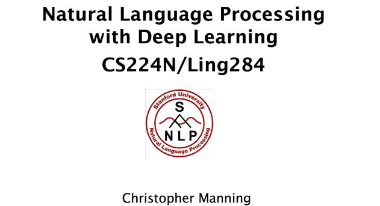

# 🛣[Deep Learning]Stanford CS224n:Natural Language Processing  
---

!!! info "想说的话🎇"
    
    
    🔝课程网站：http://web.stanford.edu/class/cs224n/index.html
    
    👀一些资源: 
    https://www.bilibili.com/video/BV1jt421L7ui/(B站双语精翻)
    https://www.showmeai.tech/tutorials/36?articleId=231(课件翻译+知识梳理)

    

!!! advice "Chapter"

    

    - [Chapter 1：Image Classification with Linear Classifiers](./cs224n-notebook/chapter1.md) 
   
    