# 🛣[Deep Learning]Stanford CS224w:Machine Learning with Graphs
---

!!! info "想说的话🎇"
    
    
    🔝课程网站：http://web.stanford.edu/class/cs224w/
    
    👀一些资源: 
    B站精讲：https://www.bilibili.com/video/BV1pR4y1S7GA/?spm_id_from=333.337.search-card.all.click&vd_source=280e4970f2995a05fdeab972a42bfdd0
    
    https://github.com/TommyZihao/zihao_course/tree/main/CS224W
    
    Slides: http://web.stanford.edu/class/cs224w/slides
    
    

### Subgraph

<B>Def 1.:Node-induced subgraph</B>

Given a graph $G=(V,E)$, a subgraph $G'=(V',E')$ is a node induced subgraph iff $V'\subseteq V$ and $E=\{(u,v) \in E|u,v \in V'\}$.

> induced subgraph(诱导子图)：该图顶点的子集和该子集的所有边的集合（determined by nodes）

<B>Def 2.:Edge-induced subgraph</B>

$G'=(V',E')$ is an edge induced subgraph iff $E'\subseteq E$ and $V'=\{ v \in V | (v,u) \in E' for some u \}$

> non-induced subgraph(非诱导子图)：该图边的子集和该子集的对应顶点的集合（determined by edges）

### Graph Isomorphism (图同构)

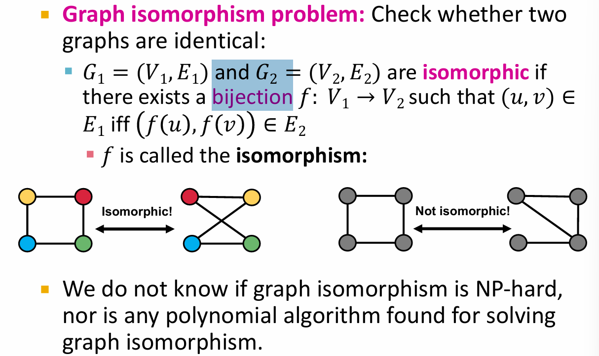

> 即$G_1$中的节点能一一映射到$G_2$中的节点，使节点之间对应的边关系也能同时映射到另一个图所对应的节点之间

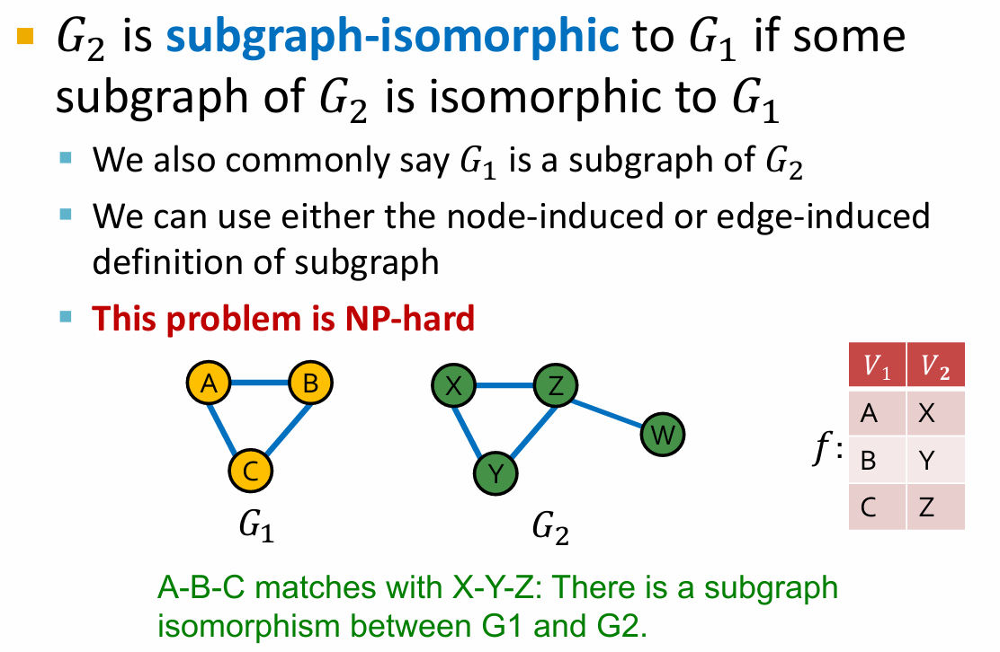

> 因为节点没有固定顺序，所以我们不知道节点之间是怎么映射的，所以我们需要遍历所有可能。检验图是否同构的问题是否NP-hard未知，但至今没有提出polynomial algorithm。

### Network motifs (网络模体)

> Network motifs: “recurring, significant patterns of interconnections” 

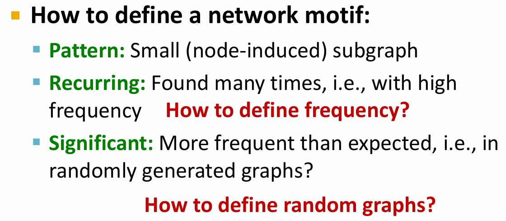

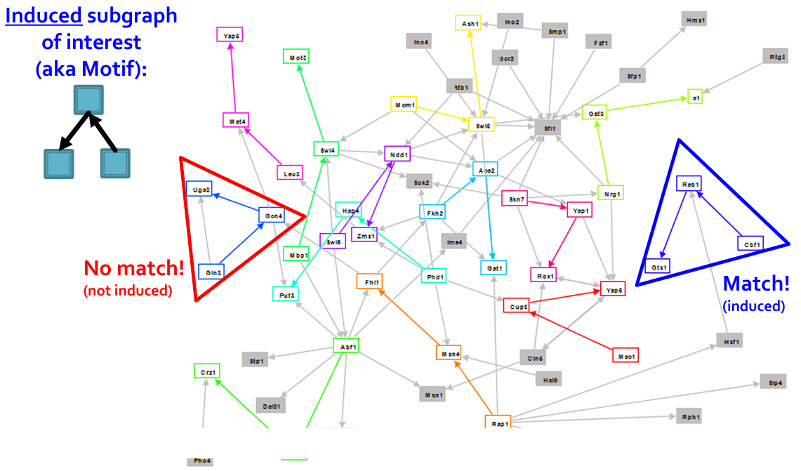

- Graph-level Subgraph Frequency Definition

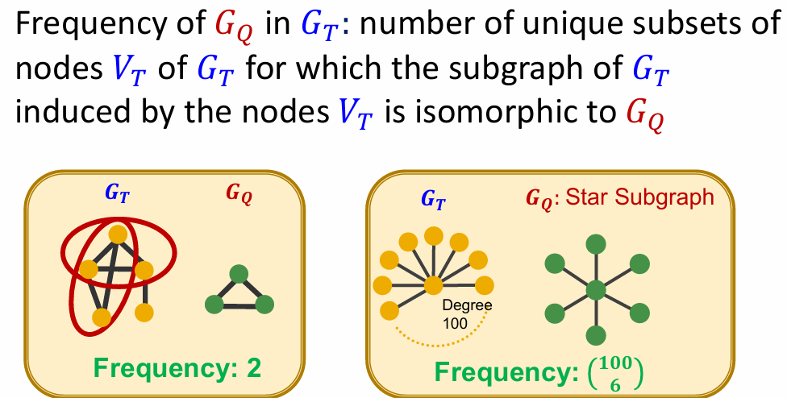

- Node-level Subgraph Frequency Definition

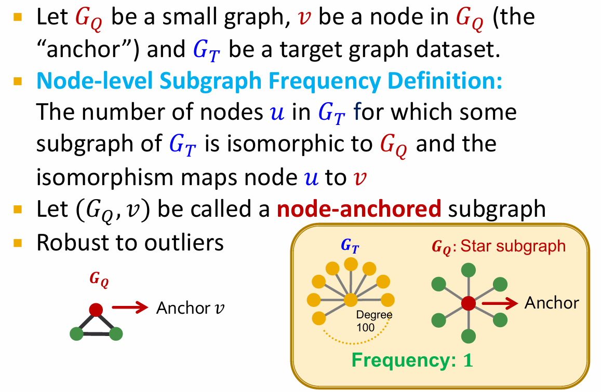

> 这种定义对异常值比较鲁棒.如在图例中，Star subgraph以中心节点为anchor，其在$G_T$中的frequency就是1；若以其外围节点作为anchor，则其frequency就是100.

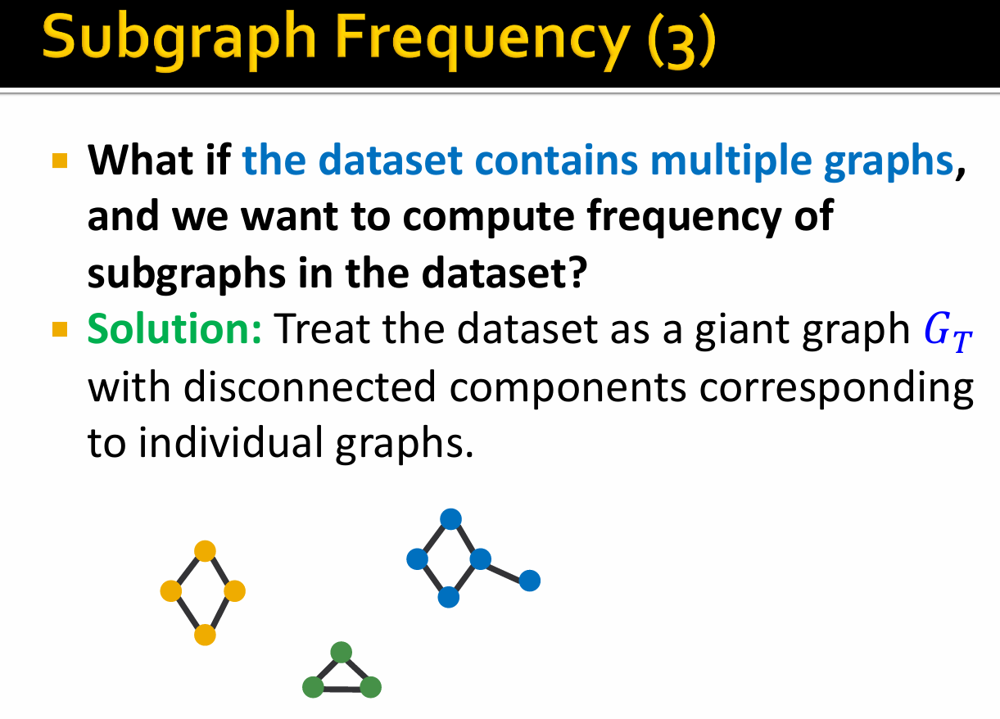

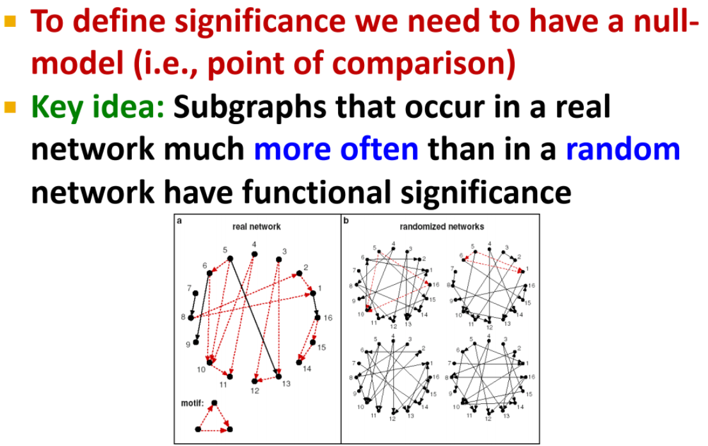

### Define Random Graphs

- Erdős–Rényi(ER) random graphs:

$G_{n,p}$:undirected graph on $n$ nodes where each $(u,v)$ appears i.i.d.(独立同分布) with probability $p$.

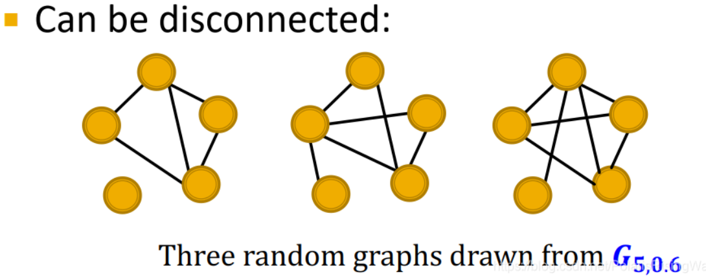

<B>Goal:Generate a random graph with a given degree sequence $k_1,k_2,...,k_N$.</B>(Configuration model)

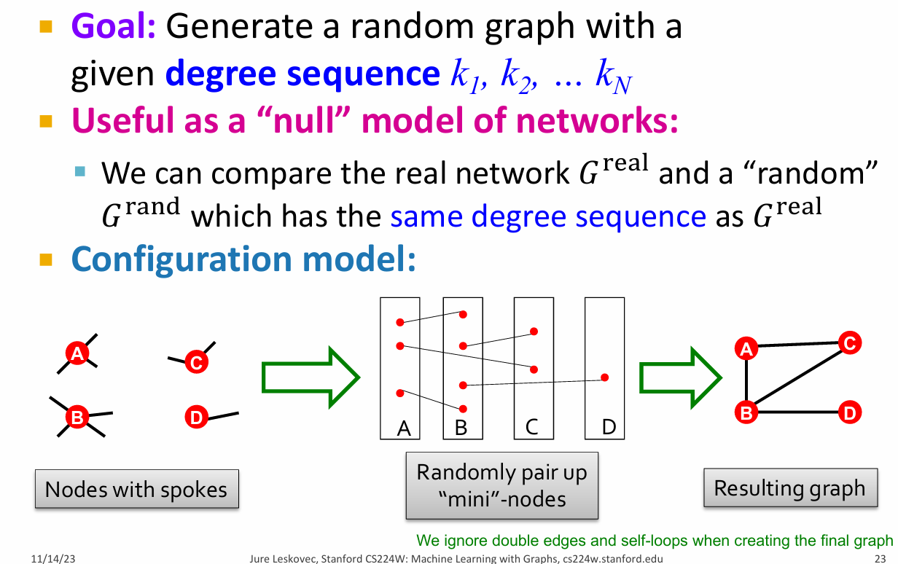

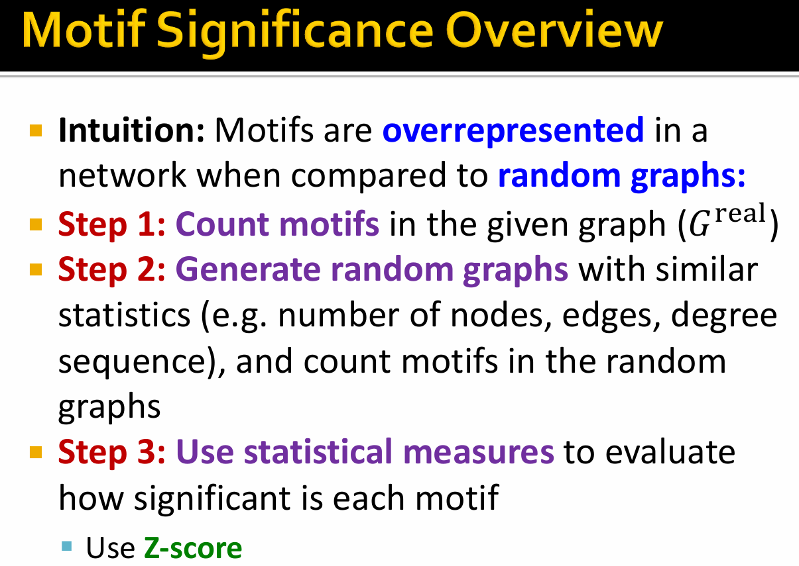

Z-score captrues statistical significance of motif $i$:

$$
Z_i = \frac{N_i^{real} - \bar N_i^{rand}}{std(N_i^{rand})}
$$

- $N_i^{real}$ is motif $i$ in graph $G$.

- $\bar N_i^{rand}$ is the average number of motif $i$ in random graphs with the same degree sequence as $G$.

<B>Network significance profile($SP$)</B>:

$$
SP_i = \frac{Z_i}{\sqrt{\sum_j Z_j^2}}
$$

> $SP$ is a vector of normalized Z-scores,the dim depends on number of motifs considered.

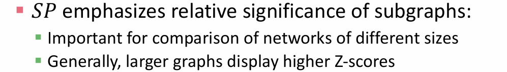

