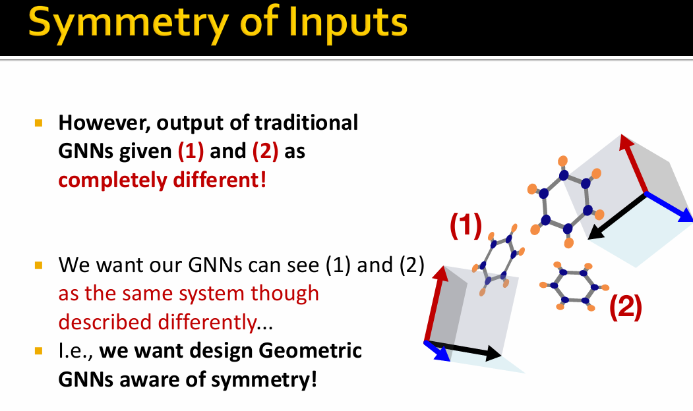

# 🛣[Deep Learning]Stanford CS224w:Machine Learning with Graphs
---

!!! info "想说的话🎇"
    
    
    🔝课程网站：http://web.stanford.edu/class/cs224w/
    
    👀一些资源: 
    B站精讲：https://www.bilibili.com/video/BV1pR4y1S7GA/?spm_id_from=333.337.search-card.all.click&vd_source=280e4970f2995a05fdeab972a42bfdd0
    
    https://github.com/TommyZihao/zihao_course/tree/main/CS224W
    
    Slides: http://web.stanford.edu/class/cs224w/slides
    
    

### Geometric Graphs
---

A geometric graph $G=(A,S,X)$ is a graph where each node is embeddedd in $d$-dimensional Euclidean space:

- $A$: an $n \times n$ adjacency matrix

- $S \in \mathbb{R}^{n \times f}$: scalar features

- $X \in \mathbb{R}^{n \times d}$: tensor features(e.g.,coordinates)

### Geometric GNNs

- <B>Invariant GNNs</B> for learning invariant scalar features

- <B>Equivariant GNNs</B> for learning equivariant tensor features

Invariant GNNs: <B>SchNet</B>
---

