# 🛣[Deep Learning]Stanford CS224w:Machine Learning with Graphs
---

!!! info "想说的话🎇"
    
    
    🔝课程网站：http://web.stanford.edu/class/cs224w/
    
    👀一些资源: 
    B站精讲：https://www.bilibili.com/video/BV1pR4y1S7GA/?spm_id_from=333.337.search-card.all.click&vd_source=280e4970f2995a05fdeab972a42bfdd0
    
    https://github.com/TommyZihao/zihao_course/tree/main/CS224W
    
    Slides: http://web.stanford.edu/class/cs224w/slides
    
    

### The limitation of node embedding 

- $O(|V|d)$ parameters are needed：every node has its own unique embedding

- have no ability to generate embeddings for nodes that are not in the training set

- Do not incorporate structural node features (e.g. node type, node degree)

### Permutation Invariance(置换不变性)

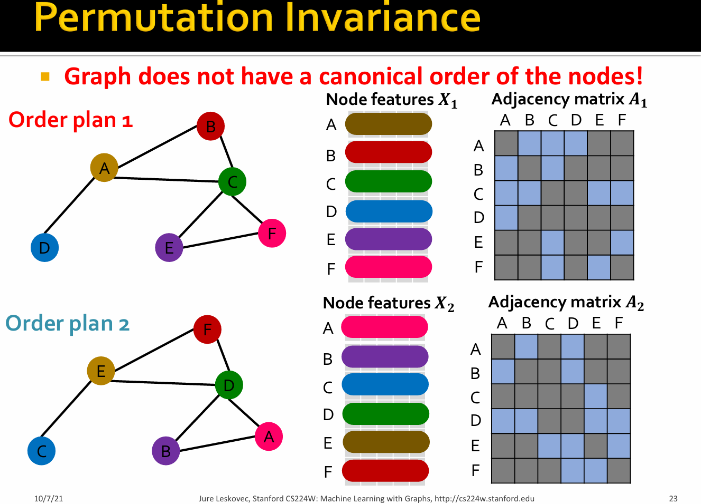

For order plan 1 and order plan 2, graph and node representation should be the same, but the node embeddings are different.

Consider we learn a function $f:\mathbb{R}^{|V| \times m}\times \mathbb{R}^{|V| \times |V|}$ to map the graph $G=(A,X)$ to a vector $\mathbb{R}^d$, then the function $f$ should be <B>permutation invariant</B>: $f(A,X) = f(A',X')=f(PAP^T,PX)$ for any permutation $P$.

>  Permutation 𝑃: a shuffle of the node order.Example:$(A,B,C)->(B,C,A)$.

> for different order of nodes, the adjacency matrix $A$ is different, but the output of $f$ should be the same!.

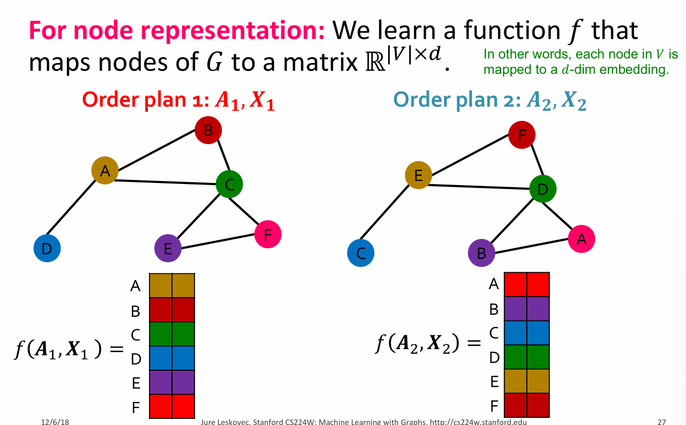

### Permutation Equivariant(置换等变性)

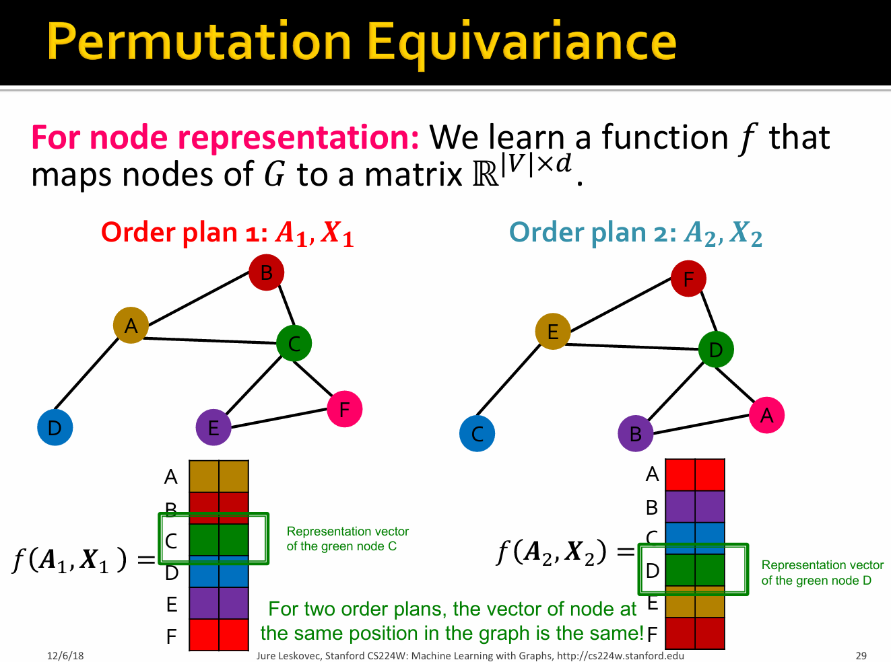

Consider we learn a function $f:\mathbb{R}^{|V| \times m}\times \mathbb{R}^{|V| \times |V|}$ to map the graph $G=(A,X)$ to a vector $\mathbb{R}^{|V| \times d}$.then the function $f$ should be <B>permutation equivariant</B>: $Pf(A,X) =f(PAP^T,PX)$ for any permutation $P$.

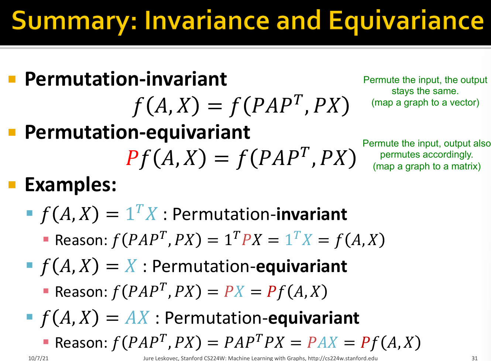
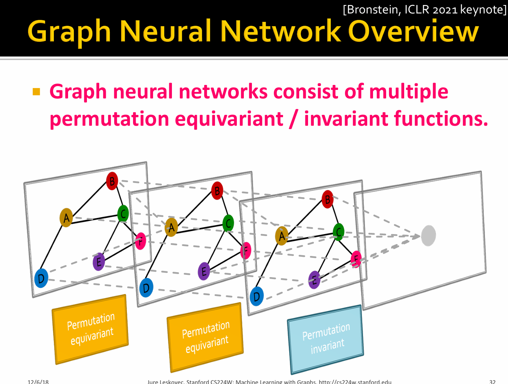
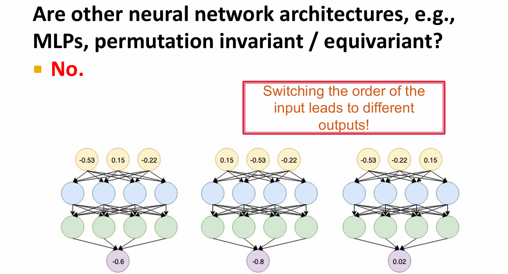

> Idea: Node’s neighborhood defines a computation graph

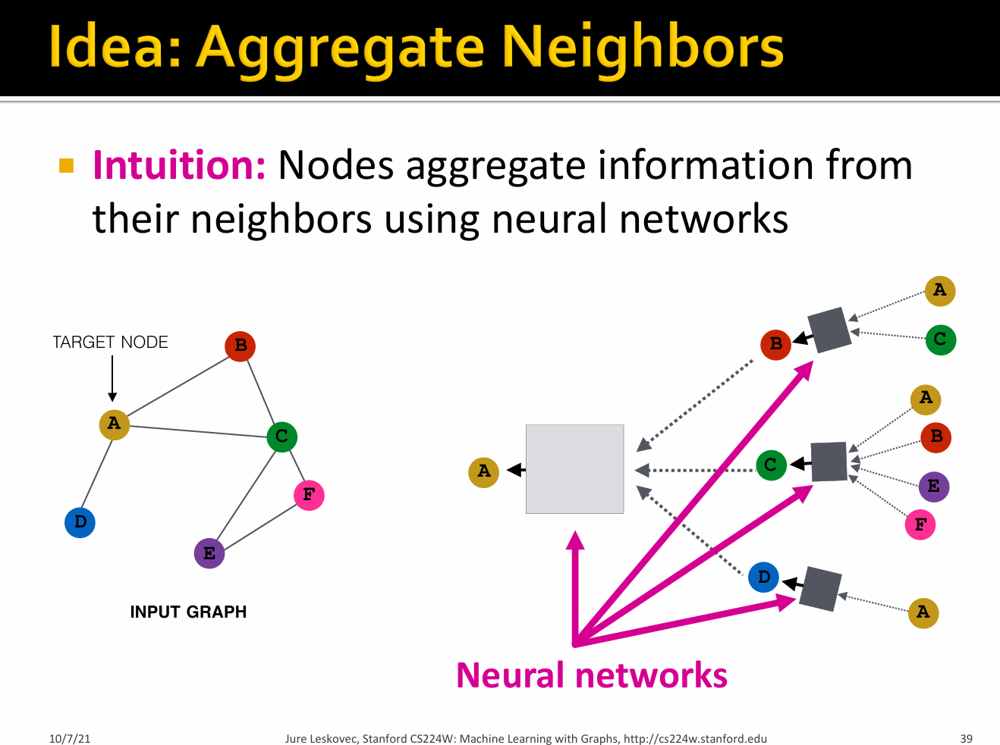
.png)

.png)

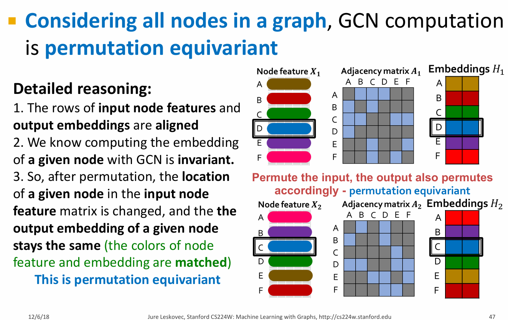

### Graph Neural Networks

$$
\begin{aligned}
h_v^{(0)} =& x_v \\
h_v^{(k+1)} =& \sigma(W_k \sum_{u\in N(v)} \frac{h_u^{(k)}}{|N(v)|} + B_k h_v^{(k)}), ∀k \in \{ 0,...,k-1 \}\\
z_v =& h_v^{(K)}(\text{Final node embedding})\\
\end{aligned}
$$

设$H^{(k)}=[h_1^{(k)},...,h_{|V|}^{(k)}]^T$，则$\sum_{u \in N_v} h_u^{(k)}=A_{v,:}H^{(k)}$

设对角矩阵（diagonal matrix）$D$,即$D_{v,v}=Deg(v)=|N(v)|$,则$D_{v,v}^{-1}=1/|N(v)|$.

Therefore,$\sum_{u \in N(v)} \frac{h_u^{(k-1)}}{|N(v)|} \rightarrow H^{(k+1)} = D^{-1}AH^{(k)}$

so，$H^{(k+1)} = \sigma (D^{-1} A H^{(k)} W_k^T + H^{(k)} B_k^T) $

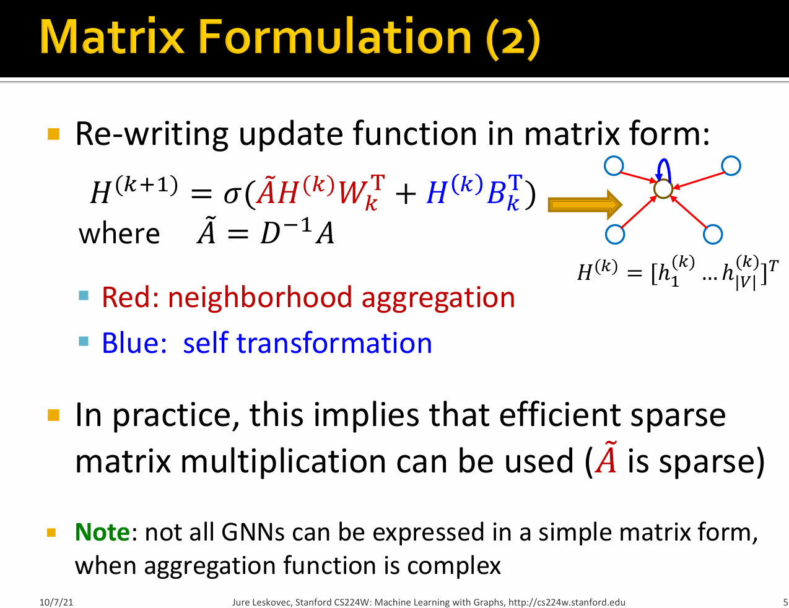

#### Graph unsupervised training

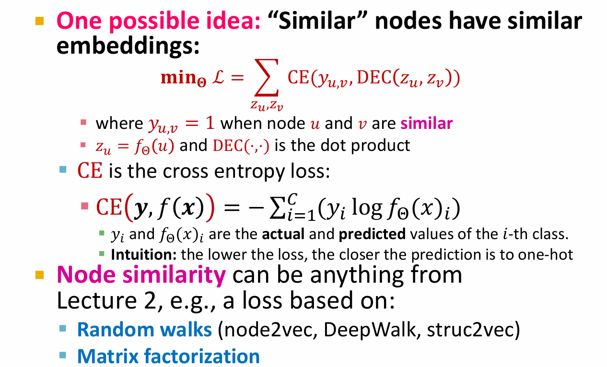

#### Graph supervised training

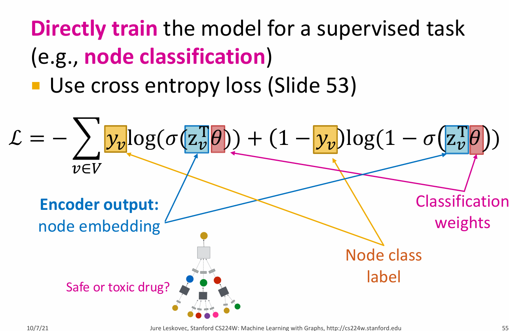

### comparison with other methods

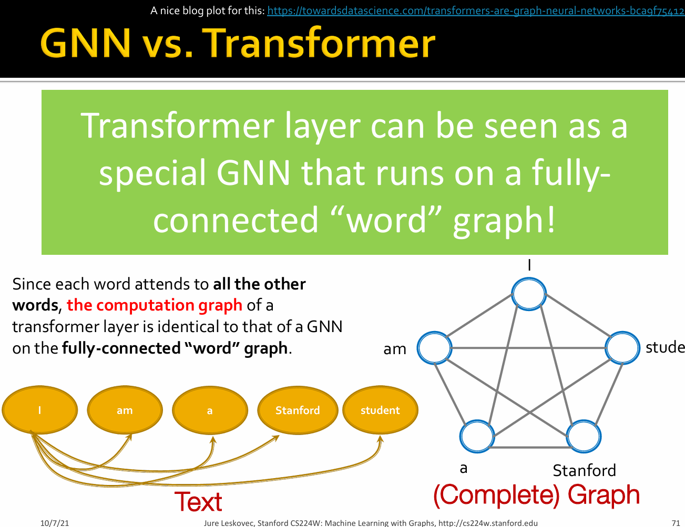
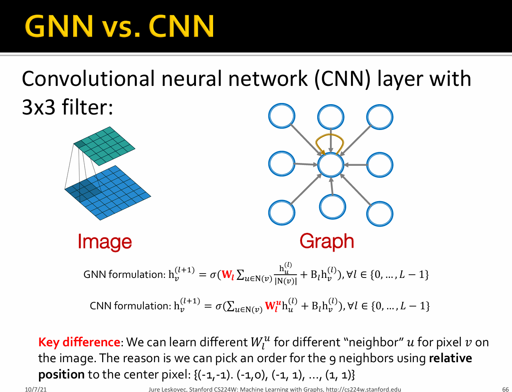