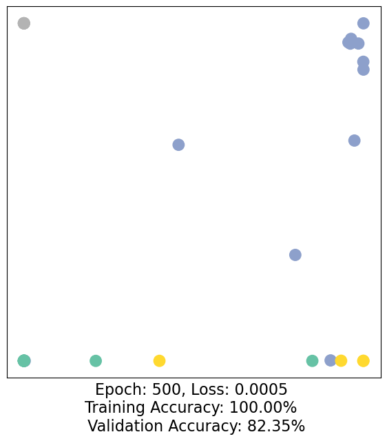

# 🛣[Deep Learning]Stanford CS224w:Machine Learning with Graphs
---
<script src="https://polyfill.io/v3/polyfill.min.js?features=es6"></script>
<script src="https://cdn.jsdelivr.net/npm/mathjax@3/es5/tex-chtml.js"></script>

!!! info "想说的话🎇"
    <font size = 3.5>
    
    🔝课程网站：http://web.stanford.edu/class/cs224w/
    
    👀一些资源: 
    B站精讲：https://www.bilibili.com/video/BV1pR4y1S7GA/?spm_id_from=333.337.search-card.all.click&vd_source=280e4970f2995a05fdeab972a42bfdd0
    
    https://github.com/TommyZihao/zihao_course/tree/main/CS224W
    
    Slides: http://web.stanford.edu/class/cs224w/slides
    
    </font>

### The limitation of node embedding 

- $O(|V|d)$ parameters are needed：No sharing of parameters between nodes，every node has its own unique embedding

- Have no ability to generate embeddings for nodes that are not in the training set

- Do not incorporate structural node features (e.g. node type, node degree)

### Permutation Invariance(置换不变性)


For order plan 1 and order plan 2, graph and node representation should be the same, but the node embeddings are different.

Consider we learn a function $f:\mathbb{R}^{|V| \times m}\times \mathbb{R}^{|V| \times |V|}$ to map the graph $G=(A,X)$ to a vector $\mathbb{R}^d$, then the function $f$ should be <B>permutation invariant</B>: $f(A,X) = f(A',X')=f(PAP^T,PX)$ for any permutation $P$.

>  Permutation 𝑃: a shuffle of the node order.Example:$(A,B,C)->(B,C,A)$.

> for different order of nodes, the adjacency matrix $A$ is different, but the output of $f$ should be the same!.


### Permutation Equivariant(置换等变性)


Consider we learn a function $f:\mathbb{R}^{|V| \times m}\times \mathbb{R}^{|V| \times |V|}$ to map the graph $G=(A,X)$ to a vector $\mathbb{R}^{|V| \times d}$.then the function $f$ should be <B>permutation equivariant</B>: $Pf(A,X) =f(PAP^T,PX)$ for any permutation $P$.


> Idea: Node’s neighborhood defines a computation graph


.png)

.png)


### Graph Neural Networks

$$
\begin{aligned}
h_v^{(0)} =& x_v \\
h_v^{(k+1)} =& \sigma(W_k \sum_{u\in N(v)} \frac{h_u^{(k)}}{|N(v)|} + B_k h_v^{(k)}), ∀k \in \{ 0,...,k-1 \}\\
z_v =& h_v^{(K)}(\text{Final node embedding})\\
\end{aligned}
$$

设$H^{(k)}=[h_1^{(k)},...,h_{|V|}^{(k)}]^T$，则$\sum_{u \in N_v} h_u^{(k)}=A_{v,:}H^{(k)}$

> A 为一个稀疏的单位矩阵，Example:$\begin{bmatrix} 1 & 0 & ... & 0 & 1 & 0 \\ 1 & 0 & ... & 0 & 1 & 0 \\ ...  \\ 1 & 0 & ... & 0 & 1 & 0 \\ \end{bmatrix}$

设对角矩阵（diagonal matrix）$D$,即$D_{v,v}=Deg(v)=|N(v)|$,则$D_{v,v}^{-1}=1/|N(v)|$.

Therefore,$\sum_{u \in N(v)} \frac{h_u^{(k-1)}}{|N(v)|} \rightarrow H^{(k+1)} = D^{-1}AH^{(k)}$

so，$H^{(k+1)} = \sigma (D^{-1} A H^{(k)} W_k^T + H^{(k)} B_k^T) $


#### Graph unsupervised training


#### Graph supervised training


```python
import torch
from torch.nn import Linear
from torch_geometric.nn import GCNConv

class GCN(torch.nn.Module):
    def __init__(self):
        super().__init__()
        torch.manual_seed(1234)
        self.conv1 = GCNConv(dataset.num_features, 4)
        self.conv2 = GCNConv(4, 4)
        self.conv3 = GCNConv(4, 2)
        self.classifier = Linear(2, dataset.num_classes)

    def forward(self, x, edge_index):
        h = self.conv1(x, edge_index)
        h = h.tanh()
        h = self.conv2(h, edge_index)
        h = h.tanh()
        h = self.conv3(h, edge_index)
        h = h.tanh()  # Final GNN embedding space.

        # Apply a final (linear) classifier.
        out = self.classifier(h)

        return out, h

model = GCN()

_, h = model(data.x, data.edge_index)
print(f'Embedding shape: {list(h.shape)}')

visualize(h, color=data.y)
```

根据上述，GNN的目标是获取一个输入图$G=(\mathbb{V,E})$，其中每个节点$v_i \in \mathbb{V}$都有一个输入特征向量$X_i$，以此学习一个函数$f_G : \mathbb{V} \times \mathbb{R}^{d_1} \to \mathbb{R}^{d_2} $，该函数接收一个节点及其特征向量以及图结构，并输出一个嵌入，即一个以对我们的下游任务有用的方式表示该节点的向量。

```python
criterion = torch.nn.CrossEntropyLoss()  # Define loss criterion.
optimizer = torch.optim.Adam(model.parameters(), lr=0.01)  # Define optimizer.

def train(data):
    optimizer.zero_grad()  # Clear gradients.
    out, h = model(data.x, data.edge_index)  # Perform a single forward pass.
    loss = criterion(out[data.train_mask], data.y[data.train_mask])  # Compute the loss solely based on the training nodes.
    loss.backward()  # Derive gradients.
    optimizer.step()  # Update parameters based on gradients.

    accuracy = {}
    # Calculate training accuracy on our four examples
    predicted_classes = torch.argmax(out[data.train_mask], axis=1) # [-0.6, 0.2, 0.7, 0.1] -> 2
    target_classes = data.y[data.train_mask]
    accuracy['train'] = torch.mean(
        torch.where(predicted_classes == target_classes, 1, 0).float())

    # Calculate validation accuracy on the whole graph
    predicted_classes = torch.argmax(out, axis=1)
    target_classes = data.y
    accuracy['val'] = torch.mean(
        torch.where(predicted_classes == target_classes, 1, 0).float())

    return loss, h, accuracy

for epoch in range(1,501):
    loss, h, accuracy = train(data)
    # Visualize the node embeddings every 10 epochs
    if epoch % 10 == 0:
        visualize(h, color=data.y, epoch=epoch, loss=loss, accuracy=accuracy)
```



### comparison with other methods


以 ```karate club```为例：

```python
G = nx.karate_club_graph()
```

Q1:Average Degree if a graph
---

```python
def average_degree(num_edges, num_nodes):
    average_degree = 0
    average_degree = round(2* num_edges / num_nodes)
    return average_degree

num_edges = G.number_of_edges()
num_nodes = G.number_of_nodes()
avg_degree = average_degree(num_edges, num_nodes)
print(f'Average Degree:{avg_degree}')
```

Q2:the average clustering coefficient of the graph
---

>平均聚类系数(average clustering coefficient):描述一个图中的顶点之间集成<B>团</B>(clique)的程度系数。即一个点的邻接点之间相互连接的程度。若一个节点$i$的度为$k_i$，$e_i$为该节点与邻居之间存在的边数，则$$C_i=\frac{2e_i}{k_i(k_i-1)}$$

```python
def average_clustering_coefficient(G):
    avg_clustering_coef = 0
    avg_clustering_coef = round(nx.average_clustering(G), 2)
    return avg_clustering_coef

avg_cluster_coef = average_clustering_coefficient(G)
```

Q3:PageRank 
---

- 经典图算法：PageRank

PageRank measures importance of nodes in a graph based on its link structure.

Core idea:

- The more pages link to this page, the more important it is;

- A link from an important page is worth more.

If a page $i$ with importance $r_i$ has $d_i$ out-links, then each link gets $\frac{r_i}{d_i}$ votes.Thus, the importance of a page $j$, represented as $r_j$ is the sum of the votes on its in links.

$$
r_j = \sum_{i \rightarrow j} \frac{r_i}{d_i}
$$

, where $d_i$ is the out degree of node $i$.

The PageRank algorithm (used by Google) outputs a <B>probability distribution</B> which represent the likelihood of a random surfer clicking on links will arrive at any particular page.

At each time step, the random surfer has two options:

- with prob. $\beta$, follow a link at random

- with prob. $1- \beta$, jump to a random page

$$
r_j = \beta \sum_{i \rightarrow j} \frac{r_i}{d_i} + (1-\beta) \frac{1}{N}
$$

What is the PageRank value for node 0 after one PageRank iteration?

```python
def one_iter_pagerank(G, beta, r0, node_id):
    r1 = (1 - beta) / G.number_of_nodes()
    for neighbor in G.neighbors(node_id):
        r1 += beta * r0 / G.degree(neighbor)
    # PageRank_list = nx.pagerank(G, alpha=beta)
    return round(r1, 2)

beta = 0.8
r0 = 1 / G.number_of_nodes()
node = 0
r1 = one_iter_pagerank(G, beta, r0, node)
```

Q4:the (raw) closeness centrality
---

> 邻近中心度(closeness centrality)衡量网络中节点到其他节点的平均距离,距离越短表示节点越接近网络中的其他节点,其Closeness Centrality值越高。$$c(v) = \frac{1}{\sum_{u \neq v}\text{shortest path length between } u \text{ and } v}$$

```python
def closeness_centrality(G, node=5):
    clossness = nx.clossness_centrality(G, node) / (len(nx.node_connected_component(G, node)) - 1)
    clossness = round(clossness, 2)
    return clossness

node = 5
closeness = closeness_centrality(G,  node=node)
```

> ```nx.clossness_centrality```输出的是$\frac{n-1}{\sum_{u \neq v} d(u,v)}$，其中$d(u,v)$表示节点$u$和$v$之间的最短路径长度。

Q5:get the edge_list ,transform it into torch.LongTensor
---

```python
def graph_to_edge_list(G):
    return [edge for edge in G.edges()]
def edge_list_to_tensor(edge_list):
    return torch.LongTensor(edge_list).t()

pos_edge_list = graph_to_edge_list(G)
pos_edge_index = edge_list_to_tensor(pos_edge_list)
```

Q6:negative sampling
---

> "Negative" edges 指的是图中不存在的边，可以作为负样本

```python
import random

def sample_negative_edges(G, num_neg_samples):
    neg_edge_list = [random.sample(list(enumerate(nx.non_edges(G))), num_neg_samples)[i][1] for i in range(num_neg_samples)]
    return neg_edge_list

def can_be_negative(G, edge):
    return not G.has_edge(*edge)
```