# 🛣[Deep Learning]Stanford CS224w:Machine Learning with Graphs
---
<script src="https://polyfill.io/v3/polyfill.min.js?features=es6"></script>
<script src="https://cdn.jsdelivr.net/npm/mathjax@3/es5/tex-chtml.js"></script>

!!! info "想说的话🎇"
    <font size = 3.5>
    
    🔝课程网站：http://web.stanford.edu/class/cs224w/
    
    👀一些资源: 
    B站精讲：https://www.bilibili.com/video/BV1pR4y1S7GA/?spm_id_from=333.337.search-card.all.click&vd_source=280e4970f2995a05fdeab972a42bfdd0
    
    https://github.com/TommyZihao/zihao_course/tree/main/CS224W
    
    Slides: http://web.stanford.edu/class/cs224w/slides
    
    </font>

### A GNN Layer

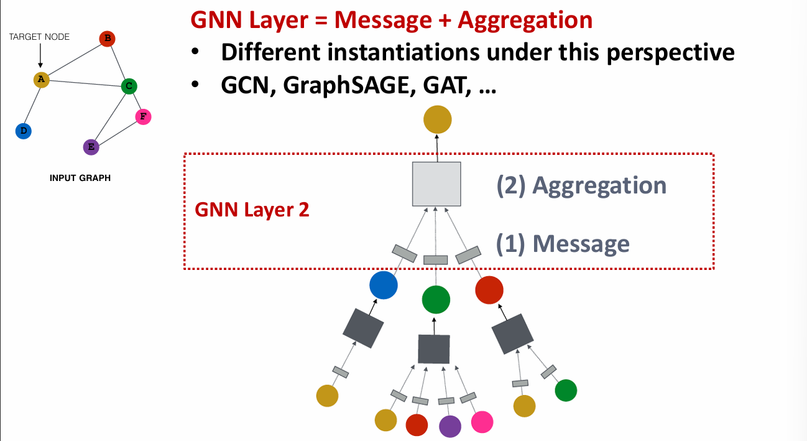

### Message Computation

- Message function: $m_u^{(l)} = MSG^{(l)} (h_u^{(l-1)})$, For example: A Linear layer $m_u^{(l)} = W^{(l)} h^{(l-1)} $

>  Intuition: Each node will create a message, which will be sent to other nodes later

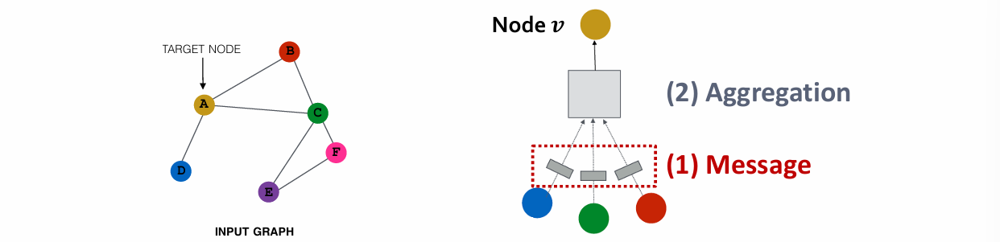

### Aggregation 

- Aggregation function: $h_v^{(l)} = AGG^{(l)} (m_{v1}^{(l)}, m_{v2}^{(l)}, \ldots, m_{vk}^{(l)})$, For example: Summing up all messages $h_v^{(l)} = \sum_{u \in N(v)} m_u^{(l)}$

>  Intuition: Node 𝑣 will aggregate the messages from its neighbors 

In order to consider the node $v$ itself, we can include $h_v^{(l-1)}$ when computing $h_v^{(l)}$.For example: 

$$
h_v^{(l)} = Concat(AGG({m_u^{(l)}}, u \in N(v)), m_v^{(l)})
$$

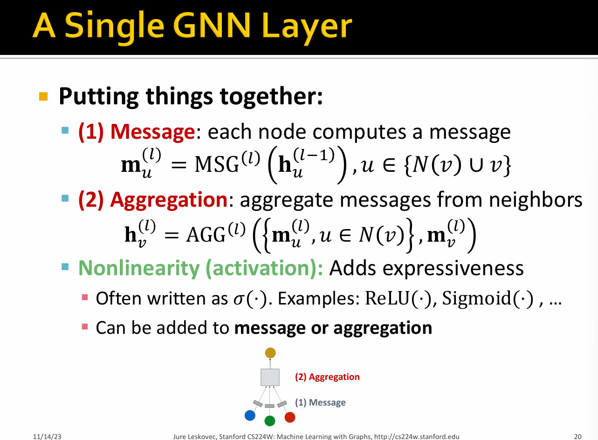

### Graph Convolutional Network (GCN)

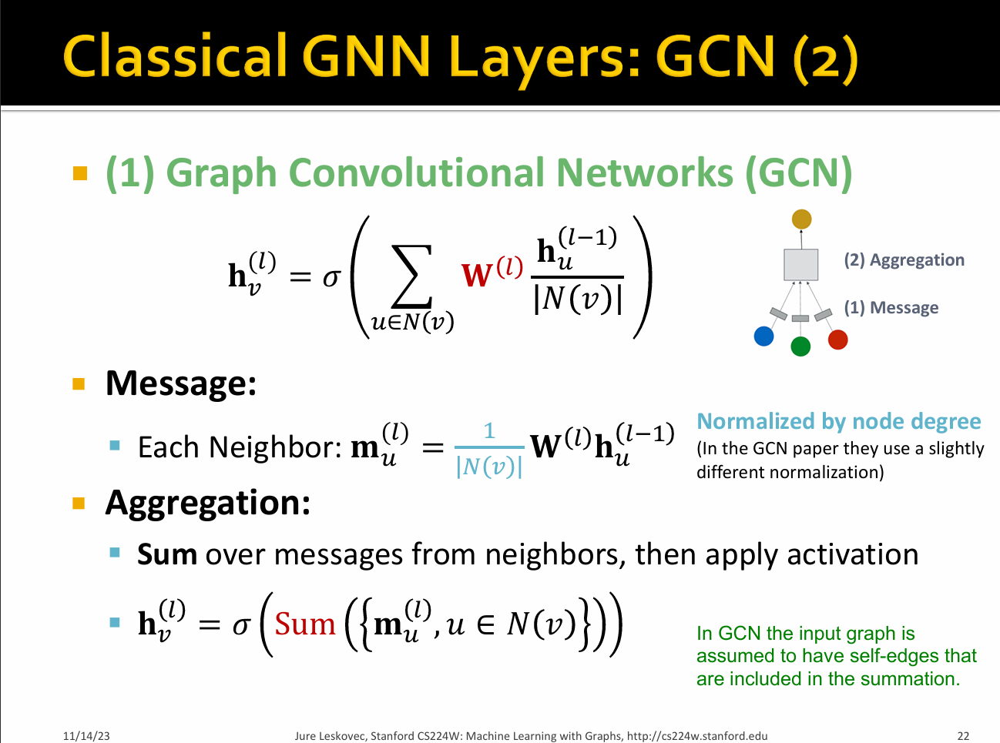

论文标题: [Semi-Supervised Classification with Graph Convolutional Networks](https://arxiv.org/abs/1609.02907)

假设一个下图这样的图结构，存在ABCDE五个节点，节点之间存在连接

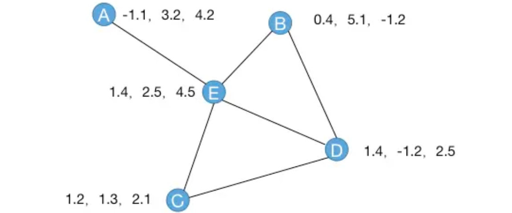

因此，可以这样聚合信息：

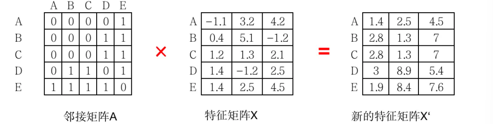

但显然这样的聚合方式过于简单，没有考虑到节点自身信息，因此我们可以改进邻接矩阵：

$$
\widetilde{A} = A + I
$$

将节点自身与其近邻粗暴的加和的聚合方法显然是有问题的，相当于我们变相的改变了特征的量级，随着迭代的增加，特征量级会变得越来越大。因此我们引入$D=Deg(N(v))= \sum_j A_{ij}$的度矩阵（与该节点相邻节点的数据）,并且考虑自身信息，在$D$上加入单位矩阵$I$：$\widetilde{D}=D+I=\sum_j \widetilde{A}_{ij}$

最终，我们得到：$\widetilde{D}^{-1} \widetilde{A} X$

> $\widetilde{D}^{-1}$作为一个初等矩阵，左乘$\widetilde{D}^{-1}$相当于行变换，即$\widetilde{A} X$ 每一行除以度.

- <B>Renormalization trick</B>: $\widetilde{D}^{-\frac{1}{2}} \widetilde{A} \widetilde{D}^{-\frac{1}{2}} X$

$\widetilde{A}$左右都乘以一个初等矩阵$\widetilde{D}^{-\frac{1}{2}}$，$\widetilde{A}_{ij}$表示$\widetilde{A}$中第$i$行第$j$列的元素，即为$i$节点与$j$节点的关系。左侧的$\widetilde{D}^{-\frac{1}{2}}$很好理解，即是对量度的归一化，而右侧的$\widetilde{D}^{-\frac{1}{2}}$则是对节点间关系的归一化，即是将节点的邻接节点对其的“贡献”进行标准化。

> 比如说App上的用户之间的关注关系是天然的同构图，假设我们要做节点分类判定某个用户A是不是算法工程师，并且假设A用户仅仅和另一个算法工程师B以及10个猎头有关注的关系。直观上，猎头对用户A的节点类别的判定的贡献应该是很小的，因为猎头往往会和算法，开发，测试，产品等不同类型的用户有关联关系，他们对于用户A的“忠诚关联度”是很低的，而对于算法工程师B而言，假设他仅仅和A有关联，那么明显B对A的“忠诚关联度”是很高的，B的Node Features以及B和A的关联关系在对A进行节点分类的时候应该是更重要的！

- GCN算法流程

图网络的计算就是不断考虑邻居及自身信息的一个迭代过程，每进行一次迭代就是一次特征重组，下一层的特征为上一层特征的图卷积：

$$
X^{k+1} = \widetilde{D}^{-\frac{1}{2}} \widetilde{A} \widetilde{D}^{-\frac{1}{2}} X^k
$$

令renormalization之后的矩阵为$\hat{A}$:

$$
X^{k+1} = \hat{A} X^k
$$

一个两层的GCN网络为($W$为权重矩阵)：

$$
Z = \hat{A} \sigma (\hat{A} X^k W^{(0)}) W^{(1)}
$$

<details> 
<summary>utils</summary>

```python
def encode_onehot(labels): #独热编码
    classes = set(labels)
    classes_dict = {c: np.identity(len(classes))[i, :] for i, c in enumerate(classes)} #对角单位矩阵
    labels_onehot = np.array(list(map(classes_dict.get, labels)), dtype=np.int32)
    return labels_onehot


def load_data(path="../data/cora/", dataset="cora"):
    """Load citation network dataset (cora only for now)"""
    print('Loading {} dataset...'.format(dataset))

    idx_features_labels = np.genfromtxt(f"{path}{dataset}.content", dtype=np.dtype(str))
    features = sp.csr_matrix(idx_features_labels[:, 1:-1], dtype=np.float32) #稀疏矩阵
    labels = encode_onehot(idx_features_labels[:, -1])

    # build graph
    idx = np.array(idx_features_labels[:, 0], dtype=np.int32)
    idx_map = {j: i for i, j in enumerate(idx)}
    edges_unordered = np.genfromtxt(f"{path}{dataset}.cites", dtype=np.int32)
    edges = np.array(list(map(idx_map.get, edges_unordered.flatten())),
                     dtype=np.int32).reshape(edges_unordered.shape)
    adj = sp.coo_matrix((np.ones(edges.shape[0]), (edges[:, 0], edges[:, 1])), shape=(labels.shape[0], labels.shape[0]), dtype=np.float32)
    # sp.coo_matrix((data,(row,col)), shape=, dtype=)
    # build symmetric adjacency matrix
    adj = adj + adj.T.multiply(adj.T > adj) - adj.multiply(adj.T > adj)
    # 对称化邻接矩阵(无向图)
    features = normalize(features)
    adj = normalize(adj + sp.eye(adj.shape[0]))

    idx_train = range(140)
    idx_val = range(200, 500)
    idx_test = range(500, 1500)

    features = torch.FloatTensor(np.array(features.todense()))
    labels = torch.LongTensor(np.where(labels)[1])
    adj = sparse_mx_to_torch_sparse_tensor(adj)

    idx_train = torch.LongTensor(idx_train)
    idx_val = torch.LongTensor(idx_val)
    idx_test = torch.LongTensor(idx_test)

    return adj, features, labels, idx_train, idx_val, idx_test


def normalize(mx):
    """Row-normalize sparse matrix"""
    rowsum = np.array(mx.sum(1))
    r_inv = np.power(rowsum, -1/2).flatten()
    r_inv[np.isinf(r_inv)] = 0.
    r_mat_inv = sp.diags(r_inv) #对角矩阵
    mx = r_mat_inv.dot(mx.dot(r_mat_inv))
    return mx

def accuracy(output, labels):
    preds = output.max(1)[1].type_as(labels)
    correct = preds.eq(labels).double()
    correct = correct.sum()
    return correct / len(labels)

def sparse_mx_to_torch_sparse_tensor(sparse_mx):
    """Convert a scipy sparse matrix to a torch sparse tensor."""
    sparse_mx = sparse_mx.tocoo().astype(np.float32)
    # COO格式(.tocoo())用三个数组来表示矩阵：
    # 行索引数组.row、列索引数组.col、数据数组.data
    indices = torch.from_numpy(
        np.vstack((sparse_mx.row, sparse_mx.col)).astype(np.int64))
    values = torch.from_numpy(sparse_mx.data)
    shape = torch.Size(sparse_mx.shape)
    return torch.sparse.FloatTensor(indices, values, shape)
```

</details>

<details> 
<summary>Model</summary>

```python
class GraphConvolution(Module):
    """
    Simple GCN layer, similar to https://arxiv.org/abs/1609.02907
    """
    def __init__(self, in_features, out_features, bias=True):
        super(GraphConvolution, self).__init__()
        self.in_features = in_features
        self.out_features = out_features
        self.weight = Parameter(torch.FloatTensor(in_features, out_features))
        if bias:
            self.bias = Parameter(torch.FloatTensor(out_features))
        else:
            self.register_parameter('bias', None)
        self.reset_parameters()

    def reset_parameters(self): # 初始化权重和偏置参数
        stdv = 1. / math.sqrt(self.weight.size(1))
        self.weight.data.uniform_(-stdv, stdv)
        if self.bias is not None:
            self.bias.data.uniform_(-stdv, stdv)

    def forward(self, input, adj):
        support = torch.mm(input, self.weight)
        output = torch.spmm(adj, support)  #torch.spmm稀疏矩阵乘法
        if self.bias is not None:
            return output + self.bias
        else:
            return output

    def __repr__(self):
        return self.__class__.__name__ + ' (' \
               + str(self.in_features) + ' -> ' \
               + str(self.out_features) + ')'

class GCN(nn.Module):
    def __init__(self, nfeat, nhid, nclass, dropout):
        super(GCN, self).__init__()

        self.gc1 = GraphConvolution(nfeat, nhid)
        self.gc2 = GraphConvolution(nhid, nclass)
        self.dropout = dropout

    def forward(self, x, adj):
        x = F.relu(self.gc1(x, adj))
        x = F.dropout(x, self.dropout, training=self.training)
        x = self.gc2(x, adj)
        return F.log_softmax(x, dim=1)
```
</details> 

<details> 
<summary>Train</summary>

```python
from __future__ import division
from __future__ import print_function
import time
import argparse
import numpy as np

import torch
import torch.nn.functional as F
import torch.optim as optim

from pygcn.utils import load_data, accuracy
from pygcn.models import GCN

# Training settings
parser = argparse.ArgumentParser()
parser.add_argument('--no-cuda', action='store_true', default=False,
                    help='Disables CUDA training.')
parser.add_argument('--fastmode', action='store_true', default=False,
                    help='Validate during training pass.')
parser.add_argument('--seed', type=int, default=42, help='Random seed.')
parser.add_argument('--epochs', type=int, default=200,
                    help='Number of epochs to train.')
parser.add_argument('--lr', type=float, default=0.01,
                    help='Initial learning rate.')
parser.add_argument('--weight_decay', type=float, default=5e-4,
                    help='Weight decay (L2 loss on parameters).')
parser.add_argument('--hidden', type=int, default=16,
                    help='Number of hidden units.')
parser.add_argument('--dropout', type=float, default=0.5,
                    help='Dropout rate (1 - keep probability).')

args = parser.parse_args()
args.cuda = not args.no_cuda and torch.cuda.is_available()

np.random.seed(args.seed)
torch.manual_seed(args.seed)
if args.cuda:
    torch.cuda.manual_seed(args.seed)

# Load data
adj, features, labels, idx_train, idx_val, idx_test = load_data()

# Model and optimizer
model = GCN(nfeat=features.shape[1],
            nhid=args.hidden,
            nclass=labels.max().item() + 1,
            dropout=args.dropout)
optimizer = optim.Adam(model.parameters(), lr=args.lr, weight_decay=args.weight_decay)

if args.cuda:
    model.cuda()
    features = features.cuda()
    adj = adj.cuda()
    labels = labels.cuda()
    idx_train = idx_train.cuda()
    idx_val = idx_val.cuda()
    idx_test = idx_test.cuda()


def train(epoch):
    t = time.time()
    model.train()
    optimizer.zero_grad()
    output = model(features, adj)
    loss_train = F.nll_loss(output[idx_train], labels[idx_train])
    acc_train = accuracy(output[idx_train], labels[idx_train])
    loss_train.backward()
    optimizer.step()

    if not args.fastmode:
        # Evaluate validation set performance separately,
        # deactivates dropout during validation run.
        model.eval()
        output = model(features, adj)

    loss_val = F.nll_loss(output[idx_val], labels[idx_val])
    acc_val = accuracy(output[idx_val], labels[idx_val])
    print('Epoch: {:04d}'.format(epoch+1),
          'loss_train: {:.4f}'.format(loss_train.item()),
          'acc_train: {:.4f}'.format(acc_train.item()),
          'loss_val: {:.4f}'.format(loss_val.item()),
          'acc_val: {:.4f}'.format(acc_val.item()),
          'time: {:.4f}s'.format(time.time() - t))


def test():
    model.eval()
    output = model(features, adj)
    loss_test = F.nll_loss(output[idx_test], labels[idx_test])
    acc_test = accuracy(output[idx_test], labels[idx_test])
    print("Test set results:",
          "loss= {:.4f}".format(loss_test.item()),
          "accuracy= {:.4f}".format(acc_test.item()))


# Train model
t_total = time.time()
for epoch in range(args.epochs):
    train(epoch)
print("Optimization Finished!")
print("Total time elapsed: {:.4f}s".format(time.time() - t_total))

# Testing
test()
```
</details> 


### GraphSAGE（Graph Sample and Aggregate）

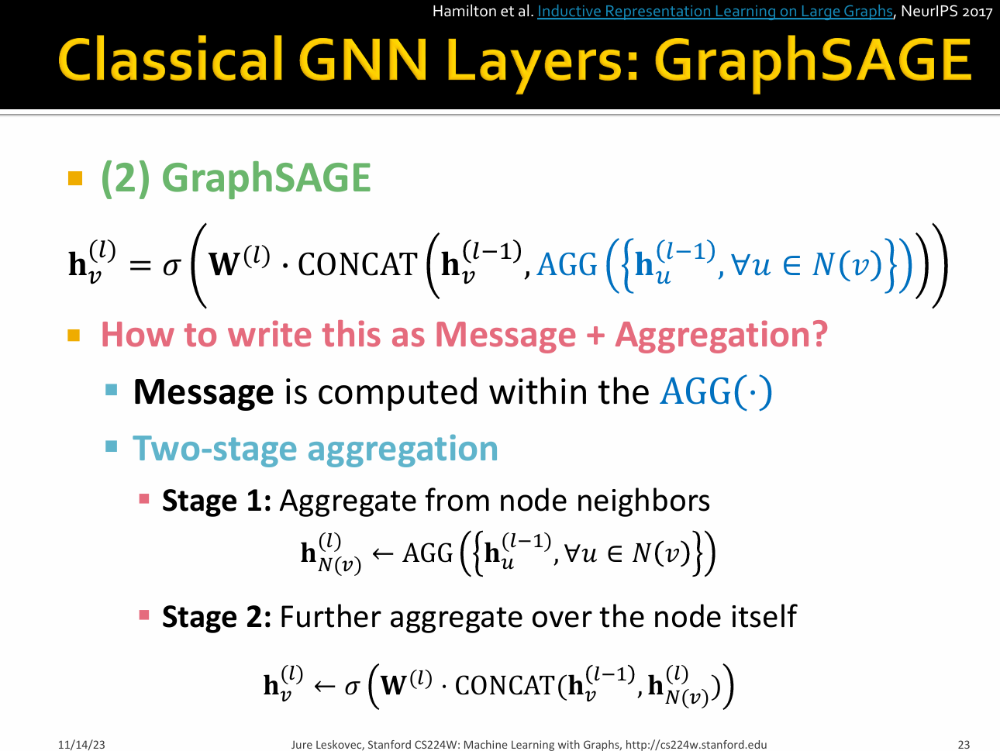
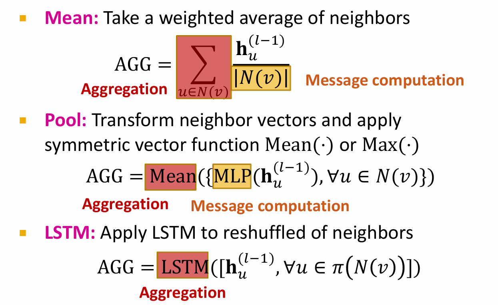


论文标题: [Inductive Representation Learning on Large Graphs](https://arxiv.org/abs/1609.02907)

```GCN```本身有一个局限，即没法快速表示新节点。```GCN```需要把所有节点都参与训练（整个图都丢进去训练）才能得到```node embedding```，如果新```node```来了，没法得到新```node```的```embedding```。所以说，```GCN```是```transductive```的。（```Transductive```任务是指：训练阶段与测试阶段都基于同样的图结构）

而```GraphSAGE```是```inductive```的。```inductive```任务是指：训练阶段与测试阶段需要处理的graph不同。通常是训练阶段只是在子图（```subgraph```）上进行，测试阶段需要处理未知的顶点。

要想得到新节点的表示，需要让新的```node```或者```subgraph```去和已经优化好的```node embedding```去“对齐”。然而每个节点的表示都是受到其他节点的影响（牵一发而动全身），因此添加一个节点，意味着许许多多与之相关的节点的表示都应该调整。

```GraphSAGE```方法提供了一种通用的归纳式框架，使用结点信息特征为未出现过的（unseen）结点生成结点向量，这一方法为后来的 ```PinSage```（```GCN``` 在商业推荐系统首次成功应用）提供了基础。

GraphSAGE的核心思想在于<B>先使用采样的方法，采样固定数量的邻居结点；然后进行聚合</B>

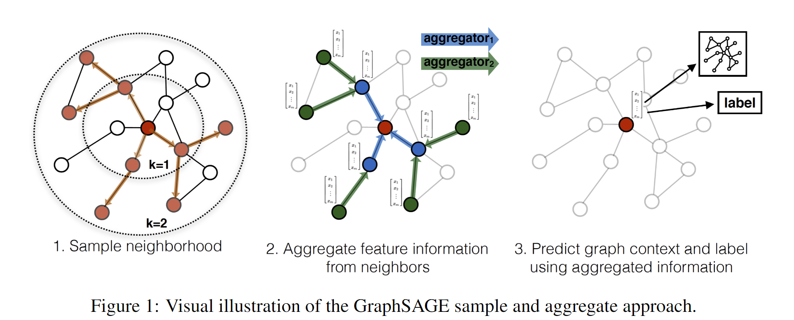

- 在图中随机采样若干结点，结点数为超参数```batch_size```，对于每一个被采样的结点又随机选取它们固定个数的邻居节点，这个可以是一阶邻居也可以是二阶邻居，最后构成进行卷积操作的图。

- 将邻居节点的信息通过```aggregate```函数聚合起来更新刚刚采样的结点。

- 计算采样结点处的损失，如果是无监督任务，则目标设为<B>图上邻居结点的编码相似</B>（在这个过程中，如果我们希望邻居节点的编码相似，那么我们就可以将聚合后的特征进行归一化，使得它们在向量空间中的距离更加接近，从而增强节点表示的相似性）；如果是有监督任务，则根据有监督结点的标签和最后的值计算loss反传更新。

<B>邻居节点的选取</B>

本文中采用的是对邻居节点的均匀采样（固定大小），每一跳抽样的邻居数量不多于$S_K$个，如果不是固定采样的话，单个批次的内存和预期运行时间都是不可预测的，最坏情况下是$O(|V|)$，当图规模很大时很容易训练不动模型。

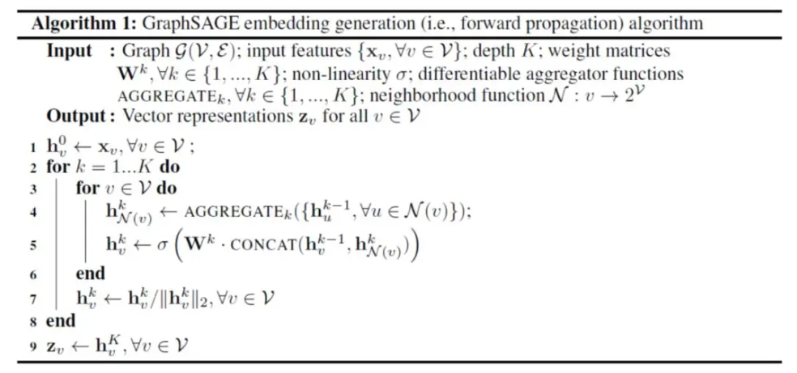

> 随着层数K的增加，可以<B>聚合越来越远距离的信息</B>。这是因为，虽然每次选择邻居的时候就是从周围的一阶邻居中均匀地采样固定个数个邻居，但是由于节点的邻居也聚合了其邻居的信息，这样，在下一次聚合时，该节点就会接收到其邻居的邻居的信息，也就是聚合到了二阶邻居的信息了。


- Mean Aggregate

$$
h_v^k \leftarrow  \sigma(W \cdot mean(\{h_v^{k-1}\} \cup \{h_u^{k-1},\forall u \in N(v)\}) )
$$

> 当前节点$v$本身和它所有的邻居在$k-1$层的```embedding```的```mean```，然后经过```MLP+sigmoid```。（这个聚合函数比较粗糙）

- LSTM Aggregate

使用```LSTM```对邻居结点信息进行聚合，拥有更强的表达能力。值得注意地是，因为 LSTM 的序列性，这个聚合函数不具备对称性。文章中使用对邻居结点随机排列的方法来将其应用于无序集合。 

- pooling Aggregate

$$
Aggregate^{pool}_k = max({\sigma(W_{pool} h^k_{u_i} + b), \cup \{h_u^{k-1},\forall u \in N(v)})
$$

> 把节点$v$的所有邻居节点都独立地输入一个```MLP+sigmoid```得到一个向量，最后把所有邻居的向量做一个```element-wise```(逐元素)的```max-pooling```。(实验发现```max pooling```和```mean pooling```效果上基本一致)

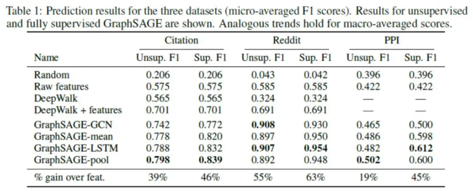

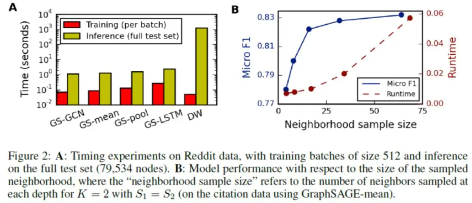

对于邻居节点的采样，满足$K=2,S_1 \cdot S_2 <= 500$表现比较好

对于聚合函数的比较上，```LSTM aggregator``` 和 ``Pooling aggregator`` 表现最好，但是前者比后者慢大约两倍。

- GraphSAGE的<B>无监督学习</B>

对于<B>无监督学习</B>，设计的损失函数应该让临近的节点的拥有相似的表示，反之应该表示大不相同

$$
J_G(z_u)=-log(\sigma(z_u^T z_v)) -Q\cdot \mathbb{E}_{v_n ∼ P_n(v)} log(\sigma(z_u^T z_{v_n}))
$$

> $P_n$:负采样分布，$Q$:负采样样本的数量


对于有监督学习，可以直接使用cross-entropy loss等常规损失函数，上面的这个loss也可以作为一个辅助loss。

<details> 
<summary>model</summary>

```python
class Classification(nn.Module):

	def __init__(self, emb_size, num_classes):
		super(Classification, self).__init__()

		#self.weight = nn.Parameter(torch.FloatTensor(emb_size, num_classes))
		self.layer = nn.Sequential(
								nn.Linear(emb_size, num_classes)	  
								#nn.ReLU()
							)
		self.init_params() #初始化

	def init_params(self):
		for param in self.parameters():
			if len(param.size()) == 2:
				nn.init.xavier_uniform_(param)

	def forward(self, embeds):
		logists = torch.log_softmax(self.layer(embeds), 1)
		return logists

# class Classification(nn.Module):

# 	def __init__(self, emb_size, num_classes):
# 		super(Classification, self).__init__()

# 		self.weight = nn.Parameter(torch.FloatTensor(emb_size, num_classes))
# 		self.init_params()

# 	def init_params(self):
# 		for param in self.parameters():
# 			nn.init.xavier_uniform_(param)

# 	def forward(self, embeds):
# 		logists = torch.log_softmax(torch.mm(embeds,self.weight), 1)
# 		return logists

class UnsupervisedLoss(object):
	"""docstring for UnsupervisedLoss"""
	def __init__(self, adj_lists, train_nodes, device):
		super(UnsupervisedLoss, self).__init__()
		'''
        Args:
            Q: 调整负样本得分的缩放
            N_WALKS: 随机游走的次数
            WALK_LEN: 随机游走的长度
            N_WALK_LEN: 计算负样本时，允许扩展的步数，用于寻找远离当前节点的负样本
            MARGIN: 边界参数
            adj_lists: 访问节点的邻接关系
            train_nodes: 训练节点
        '''
        
        self.Q = 10
		self.N_WALKS = 6
		self.WALK_LEN = 1
		self.N_WALK_LEN = 5
		self.MARGIN = 3
		self.adj_lists = adj_lists
		self.train_nodes = train_nodes
		self.device = device

		self.target_nodes = None
		self.positive_pairs = []
		self.negtive_pairs = []
		self.node_positive_pairs = {}
		self.node_negtive_pairs = {}
		self.unique_nodes_batch = []

	def get_loss_sage(self, embeddings, nodes): # 基于SAGE模型计算损失
		assert len(embeddings) == len(self.unique_nodes_batch)
		assert False not in [nodes[i]==self.unique_nodes_batch[i] for i in range(len(nodes))]
		node2index = {n:i for i,n in enumerate(self.unique_nodes_batch)}

		nodes_score = []
		assert len(self.node_positive_pairs) == len(self.node_negtive_pairs)
		for node in self.node_positive_pairs:
			pps = self.node_positive_pairs[node]
			nps = self.node_negtive_pairs[node]
			if len(pps) == 0 or len(nps) == 0:
				continue

			# Q * Exception(negative score)
			indexs = [list(x) for x in zip(*nps)]
			node_indexs = [node2index[x] for x in indexs[0]]
			neighb_indexs = [node2index[x] for x in indexs[1]]
			neg_score = F.cosine_similarity(embeddings[node_indexs], embeddings[neighb_indexs])
			neg_score = self.Q*torch.mean(torch.log(torch.sigmoid(-neg_score)), 0)
			#print(neg_score)

			# multiple positive score
			indexs = [list(x) for x in zip(*pps)]
			node_indexs = [node2index[x] for x in indexs[0]]
			neighb_indexs = [node2index[x] for x in indexs[1]]
			pos_score = F.cosine_similarity(embeddings[node_indexs], embeddings[neighb_indexs])
			pos_score = torch.log(torch.sigmoid(pos_score))
			#print(pos_score)

			nodes_score.append(torch.mean(- pos_score - neg_score).view(1,-1))
				
		loss = torch.mean(torch.cat(nodes_score, 0))
		
		return loss

	def get_loss_margin(self, embeddings, nodes):
		assert len(embeddings) == len(self.unique_nodes_batch)
		assert False not in [nodes[i]==self.unique_nodes_batch[i] for i in range(len(nodes))]
		node2index = {n:i for i,n in enumerate(self.unique_nodes_batch)}

		nodes_score = []
		assert len(self.node_positive_pairs) == len(self.node_negtive_pairs)
		for node in self.node_positive_pairs:
			pps = self.node_positive_pairs[node]
			nps = self.node_negtive_pairs[node]
			if len(pps) == 0 or len(nps) == 0:
				continue

			indexs = [list(x) for x in zip(*pps)]
			node_indexs = [node2index[x] for x in indexs[0]]
			neighb_indexs = [node2index[x] for x in indexs[1]]
			pos_score = F.cosine_similarity(embeddings[node_indexs], embeddings[neighb_indexs])
			pos_score, _ = torch.min(torch.log(torch.sigmoid(pos_score)), 0)

			indexs = [list(x) for x in zip(*nps)]
			node_indexs = [node2index[x] for x in indexs[0]]
			neighb_indexs = [node2index[x] for x in indexs[1]]
			neg_score = F.cosine_similarity(embeddings[node_indexs], embeddings[neighb_indexs])
			neg_score, _ = torch.max(torch.log(torch.sigmoid(neg_score)), 0)

			nodes_score.append(torch.max(torch.tensor(0.0).to(self.device), neg_score-pos_score+self.MARGIN).view(1,-1))
			# nodes_score.append((-pos_score - neg_score).view(1,-1))

		loss = torch.mean(torch.cat(nodes_score, 0),0)

		# loss = -torch.log(torch.sigmoid(pos_score))-4*torch.log(torch.sigmoid(-neg_score))
		
		return loss

	def extend_nodes(self, nodes, num_neg=6): 
        ''' 
        为每个目标节点生成正负样本节点对
        '''
		self.positive_pairs = []
		self.node_positive_pairs = {}
		self.negtive_pairs = []
		self.node_negtive_pairs = {}

		self.target_nodes = nodes
		self.get_positive_nodes(nodes)
		# print(self.positive_pairs)
		self.get_negtive_nodes(nodes, num_neg)
		# print(self.negtive_pairs)
		self.unique_nodes_batch = list(set([i for x in self.positive_pairs for i in x]) | set([i for x in self.negtive_pairs for i in x]))
		assert set(self.target_nodes) < set(self.unique_nodes_batch)
		return self.unique_nodes_batch

	def get_positive_nodes(self, nodes):
		return self._run_random_walks(nodes)

	def get_negtive_nodes(self, nodes, num_neg):
		for node in nodes:
			neighbors = set([node])
			frontier = set([node])
			for i in range(self.N_WALK_LEN):
				current = set()
				for outer in frontier:
					current |= self.adj_lists[int(outer)]
				frontier = current - neighbors
				neighbors |= current
			far_nodes = set(self.train_nodes) - neighbors
			neg_samples = random.sample(far_nodes, num_neg) if num_neg < len(far_nodes) else far_nodes
			self.negtive_pairs.extend([(node, neg_node) for neg_node in neg_samples])
			self.node_negtive_pairs[node] = [(node, neg_node) for neg_node in neg_samples]
		return self.negtive_pairs

	def _run_random_walks(self, nodes):
		for node in nodes:
			if len(self.adj_lists[int(node)]) == 0:
				continue
			cur_pairs = []
			for i in range(self.N_WALKS):
				curr_node = node
				for j in range(self.WALK_LEN):
					neighs = self.adj_lists[int(curr_node)]
					next_node = random.choice(list(neighs))
					# self co-occurrences are useless
					if next_node != node and next_node in self.train_nodes:
						self.positive_pairs.append((node,next_node))
						cur_pairs.append((node,next_node))
					curr_node = next_node

			self.node_positive_pairs[node] = cur_pairs
		return self.positive_pairs
		
class SageLayer(nn.Module):
	"""
	Encodes a node's using 'convolutional' GraphSage approach
	"""
	def __init__(self, input_size, out_size, gcn=False): 
		super(SageLayer, self).__init__()

		self.input_size = input_size
		self.out_size = out_size
		self.gcn = gcn
		self.weight = nn.Parameter(torch.FloatTensor(out_size, self.input_size if self.gcn else 2 * self.input_size))

		self.init_params()

	def init_params(self):
		for param in self.parameters():
			nn.init.xavier_uniform_(param)

	def forward(self, self_feats, aggregate_feats, neighs=None):
		"""
		Generates embeddings for a batch of nodes.

		nodes	 -- list of nodes
		"""
		if not self.gcn:
			combined = torch.cat([self_feats, aggregate_feats], dim=1)
		else:
			combined = aggregate_feats
		combined = F.relu(self.weight.mm(combined.t())).t()
		return combined

class GraphSage(nn.Module):
	"""docstring for GraphSage"""
	def __init__(self, num_layers, input_size, out_size, raw_features, adj_lists, device, gcn=False, agg_func='MEAN'):
		super(GraphSage, self).__init__()

		self.input_size = input_size
		self.out_size = out_size
		self.num_layers = num_layers
		self.gcn = gcn
		self.device = device
		self.agg_func = agg_func
		self.raw_features = raw_features
		self.adj_lists = adj_lists

		for index in range(1, num_layers+1):
			layer_size = out_size if index != 1 else input_size
			setattr(self, 'sage_layer'+str(index), SageLayer(layer_size, out_size, gcn=self.gcn))

	def forward(self, nodes_batch):
		"""
		Generates embeddings for a batch of nodes.
		nodes_batch	-- batch of nodes to learn the embeddings
		"""
		lower_layer_nodes = list(nodes_batch)
		nodes_batch_layers = [(lower_layer_nodes,)]
		# self.dc.logger.info('get_unique_neighs.')
		for i in range(self.num_layers):
			lower_samp_neighs, lower_layer_nodes_dict, lower_layer_nodes= self._get_unique_neighs_list(lower_layer_nodes)
			nodes_batch_layers.insert(0, (lower_layer_nodes, lower_samp_neighs, lower_layer_nodes_dict))

		assert len(nodes_batch_layers) == self.num_layers + 1

		pre_hidden_embs = self.raw_features
		for index in range(1, self.num_layers+1):
			nb = nodes_batch_layers[index][0]
			pre_neighs = nodes_batch_layers[index-1]
			# self.dc.logger.info('aggregate_feats.')
			aggregate_feats = self.aggregate(nb, pre_hidden_embs, pre_neighs) # 
			sage_layer = getattr(self, 'sage_layer'+str(index))
			if index > 1:
				nb = self._nodes_map(nb, pre_hidden_embs, pre_neighs)
			# self.dc.logger.info('sage_layer.')
			cur_hidden_embs = sage_layer(self_feats=pre_hidden_embs[nb],
										aggregate_feats=aggregate_feats)
			pre_hidden_embs = cur_hidden_embs

		return pre_hidden_embs

	def _nodes_map(self, nodes, hidden_embs, neighs):
		layer_nodes, samp_neighs, layer_nodes_dict = neighs
		assert len(samp_neighs) == len(nodes)
		index = [layer_nodes_dict[x] for x in nodes]
		return index

	def _get_unique_neighs_list(self, nodes, num_sample=10) -> list(set), dict, list:
        '''
        进行邻居采样，返回：
            samp_neighs: 每个节点的邻居集合列表（包含自身）
            unique_nodes: 被选中的邻居节点（字典）
            _unique_nodes_list: 被选中的邻居节点（列表）
        '''
		_set = set
		to_neighs = [self.adj_lists[int(node)] for node in nodes]
		if not num_sample is None:
			_sample = random.sample
			samp_neighs = [_set(_sample(to_neigh, num_sample)) if len(to_neigh) >= num_sample else to_neigh for to_neigh in to_neighs] #随机采样
		else:
			samp_neighs = to_neighs
		samp_neighs = [samp_neigh | set([nodes[i]]) for i, samp_neigh in enumerate(samp_neighs)] # 将每个节点自身也加入其邻居集合
		_unique_nodes_list = list(set.union(*samp_neighs)) # 并集，得到所有邻居节点
		i = list(range(len(_unique_nodes_list)))
		unique_nodes = dict(list(zip(_unique_nodes_list, i)))
		return samp_neighs, unique_nodes, _unique_nodes_list # lower_samp_neighs, lower_layer_nodes_dict, lower_layer_nodes

	def aggregate(self, nodes, pre_hidden_embs, pre_neighs, num_sample=10):
		# 聚合函数
		'''
		pre_hidden_embs: 所有节点的预训练嵌入矩阵
		unique_nodes：所有唯一邻居节点的 ID 到其在 unique_nodes_list 中索引的映射（字典） idx -> index
		unique_nodes_list：所有唯一邻居节点的 ID 列表
		samp_neighs：每个节点对应的采样邻居节点 ID 列表
		'''
		unique_nodes_list, samp_neighs, unique_nodes = pre_neighs

		assert len(nodes) == len(samp_neighs)
		indicator = [(nodes[i] in samp_neighs[i]) for i in range(len(samp_neighs))]
		assert (False not in indicator)

		if not self.gcn:
			samp_neighs = [(samp_neighs[i]-set([nodes[i]])) for i in range(len(samp_neighs))]
		# self.dc.logger.info('2')
		if len(pre_hidden_embs) == len(unique_nodes):
			embed_matrix = pre_hidden_embs
		else:
			embed_matrix = pre_hidden_embs[torch.LongTensor(unique_nodes_list)] #取需要的节点嵌入矩阵
		# self.dc.logger.info('3')
		mask = torch.zeros(len(samp_neighs), len(unique_nodes))
		# 掩码指示哪些邻居节点参与聚合
		# mask 矩阵的每一行对应一个待处理节点，每一列对应一个唯一的邻居节点。
		column_indices = [unique_nodes[n] for samp_neigh in samp_neighs for n in samp_neigh] # 所有需要参与聚合的邻居节点在 unique_nodes中的索引
		row_indices = [i for i in range(len(samp_neighs)) for j in range(len(samp_neighs[i]))] # 所有需要进行邻居节点特征聚合的节点在 samp_neighs 中的索引
		'''
		row_indices -> [[0,0,0,...],[1,1,1,...],[2,2,2,...],...]	
		'''
		mask[row_indices, column_indices] = 1
		# self.dc.logger.info('4')
		# Example:节点i的邻居节点列表中包含节点n，那么 mask[i, unique_nodes[n]]被设置为 1，表示该邻居节点参与节点i的特征聚合。

		if self.agg_func == 'MEAN':
			num_neigh = mask.sum(1, keepdim=True)
			mask = mask.div(num_neigh).to(embed_matrix.device)
			aggregate_feats = mask.mm(embed_matrix)

		elif self.agg_func == 'MAX':
			# print(mask)
			indexs = [x.nonzero() for x in mask==1]
			# nonzero() 方法会返回数组中非零元素的索引，以元组的形式返回
			aggregate_feats = []
			# self.dc.logger.info('5')
			for feat in [embed_matrix[x.squeeze()] for x in indexs]:
				if len(feat.size()) == 1:
					aggregate_feats.append(feat.view(1, -1))
				else:
					aggregate_feats.append(torch.max(feat,0)[0].view(1, -1))
			aggregate_feats = torch.cat(aggregate_feats, 0)
		# self.dc.logger.info('6')
		return aggregate_feats
```
</details>

### Graph Attention Networks

.png)

.png)

论文标题: [Graph Attention Networks](https://arxiv.org/abs/1710.10903)

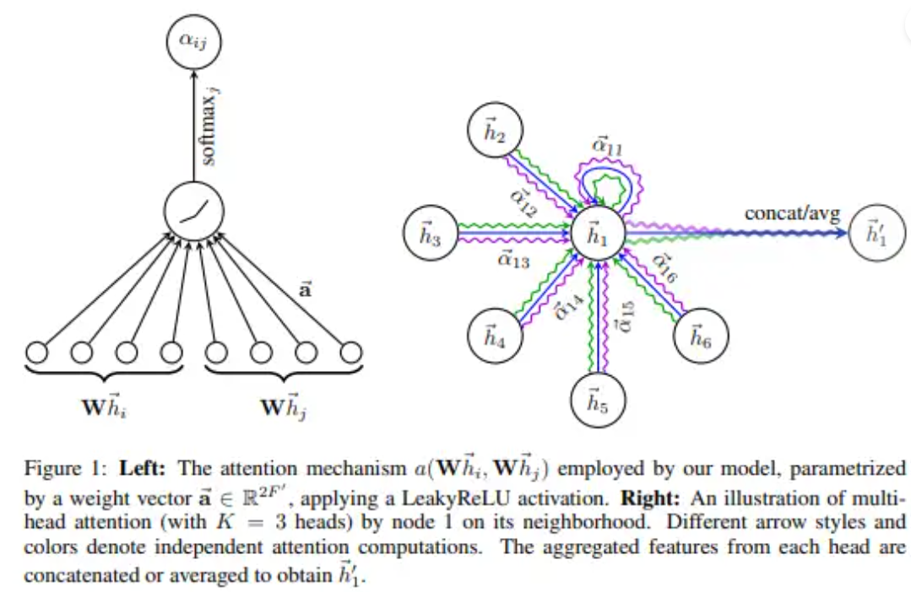

- Attention coefficients $e_{vu}$ across pairs of nodes $u$ and $v$ based on their features $h_u$ and $h_v$.

$$
e_{vu} = a(W^{l}h_u{l-1}, W^{l}h_v{l-1})
$$

> $e_{vu}$ indicates the importance of node $v$ to node $u$.

- Normalize the attention coefficients to obtain the attention coefficients $\alpha_{vu}$.

$$
a_{vu} = \frac{exp(e_{vu})}{\sum_{k \in N(v)} exp(e_{vk})}
$$

- Weighted sum based on the final attention weights $\alpha_{vu}$.

$$
h_v^l = \sigma( \sum_{u \in N(v)} \alpha_{vu} W^l h_u^{l-1})
$$

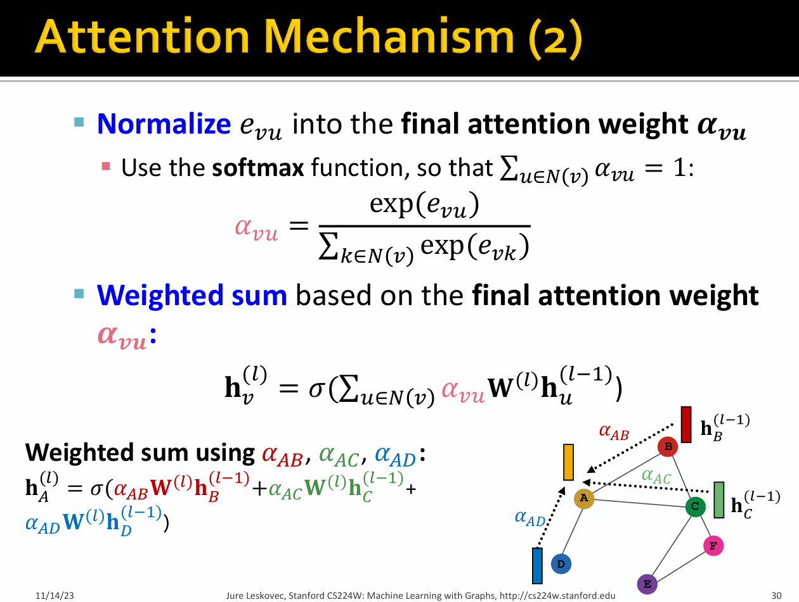
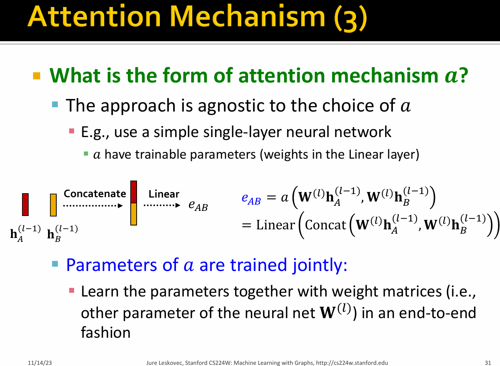
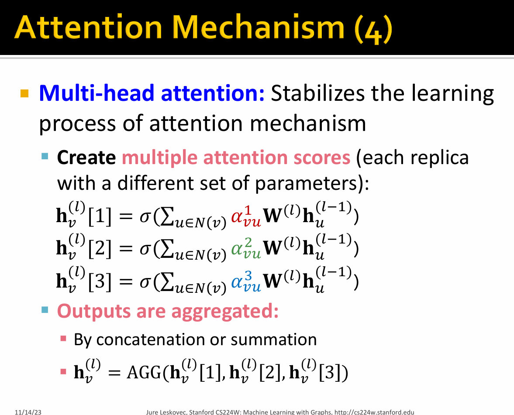

本文提出的Graph Attention Layers的输入为一组节点的特征：$\mathbf{h} = \{ h_1,h_2,...,h_N \},h_i \in \mathbb{R}^F$，$N$为节点个数，$F$为每个节点的特征数。该层输出为一组新的节点特征$\mathbf{h}' = \{ h_1',h_2',...,h_N' \},h_i' \in \mathbb{R}^{F'} $

将输入特征转换为高层特征，我们提供一个共享参数的线性变换$\mathbf{W}$:

$$
e_{ij} = a(\mathbf{W} h_i, \mathbf{W} h_j)
$$

> $e_{ij}$是从一个节点到另一个节点的注意力分数（importance），$a$是计算注意力分数的注意力机制，$a \in \mathbf{R}^{2F'}$

$$
e_{ij} = LeakyReLU(\mathbf{a}^T [\mathbf{W} h_i || \mathbf{W} h_j])
$$

因此:

$$
\alpha_{ij} = \frac{exp (LeakyReLU(\mathbf{a}^T [\mathbf{W} h_i || \mathbf{W} h_j]))}{\sum_{k \in \mathcal{N}(i)} exp(LeakyReLU(\mathbf{a}^T [\mathbf{W} h_i || \mathbf{W} h_k]))}
$$

得到各个邻节点的$\alpha_{ij}$后，我们对其进行加权求和:

$$
h_i' = \sigma(\sum_{j \in \mathcal{N}(i)} \alpha_{ij} \mathbf{W} h_j)
$$

- Multi-head Graph Attention

为了稳定 ```attention``` 的学习过程，我们发现将我们的机制拓展到 ```multi-head attention``` 是有好处的:

$$
h_i' = \mathop{\Big|\Big|}\limits_{k=1}^K  \sigma(\sum_{j \in \mathcal{N}(i)} \alpha_{ij}^k \mathbf{W}^k h_j)
$$

倘若我们在最后输出层执行该 ```multi-head attention```则```concat```操作不是必须的，可以使用```Average```代替，推迟执行最终非线性:

$$
h_i' =  \sigma( \frac{1}{K} \sum_{k=1}^{K}  \sum_{j \in \mathcal{N}(i)} \alpha_{ij}^k \mathbf{W}^k h_j)
$$

<details> 
<summary>layers</summary>

```python
class GraphAttentionLayer(nn.Module):
    """
    Simple GAT layer, similar to https://arxiv.org/abs/1710.10903
    """
    def __init__(self, in_features, out_features, dropout, alpha, concat=True):
        super(GraphAttentionLayer, self).__init__()
        self.dropout = dropout
        self.in_features = in_features
        self.out_features = out_features
        self.alpha = alpha
        self.concat = concat

        self.W = nn.Parameter(torch.empty(size=(in_features, out_features)))
        nn.init.xavier_uniform_(self.W.data, gain=1.414)
        self.a = nn.Parameter(torch.empty(size=(2*out_features, 1)))
        nn.init.xavier_uniform_(self.a.data, gain=1.414)

        self.leakyrelu = nn.LeakyReLU(self.alpha)

    def forward(self, h, adj):
        Wh = torch.mm(h, self.W) # h.shape: (N, in_features), Wh.shape: (N, out_features)
        e = self._prepare_attentional_mechanism_input(Wh)

        zero_vec = -9e15*torch.ones_like(e)
        attention = torch.where(adj > 0, e, zero_vec) # 逐元素操作 e if adj > 0 else -9e15
        attention = F.softmax(attention, dim=1)
        attention = F.dropout(attention, self.dropout, training=self.training)
        h_prime = torch.matmul(attention, Wh)

        if self.concat:
            return F.elu(h_prime)
        else:
            return h_prime

    def _prepare_attentional_mechanism_input(self, Wh):
        # Wh.shape (N, out_feature)
        # self.a.shape (2 * out_feature, 1)
        # Wh1&2.shape (N, 1)
        # e.shape (N, N)
        Wh1 = torch.matmul(Wh, self.a[:self.out_features, :])
        Wh2 = torch.matmul(Wh, self.a[self.out_features:, :])
        # broadcast add
		'''
		a = torch.tensor([[1],[2], [3], [4], [5]])
		b = torch.tensor([[1], [2], [3], [4], [5]])
		a+b.T
		>>> tensor([[ 2,  3,  4,  5,  6],
					[ 3,  4,  5,  6,  7],
					[ 4,  5,  6,  7,  8],
					[ 5,  6,  7,  8,  9],
					[ 6,  7,  8,  9, 10]])
		'''
        e = Wh1 + Wh2.T
        return self.leakyrelu(e)

    def __repr__(self):
        return self.__class__.__name__ + ' (' + str(self.in_features) + ' -> ' + str(self.out_features) + ')'

class SpecialSpmmFunction(torch.autograd.Function): 
	# 在 稀疏矩阵乘法 中只对 稀疏区域 进行 反向传播 计算
    """Special function for only sparse region backpropataion layer."""
    @staticmethod
    def forward(ctx, indices, values, shape, b):
        assert indices.requires_grad == False
        a = torch.sparse_coo_tensor(indices, values, shape)  #稀疏张量
        ctx.save_for_backward(a, b)
        ctx.N = shape[0] # 将稀疏矩阵的第一维大小保存到 ctx.N 中，用于后续计算
        return torch.matmul(a, b)

    @staticmethod
    def backward(ctx, grad_output):
        # grad_output输出张量的梯度
		a, b = ctx.saved_tensors
        grad_values = grad_b = None # 分别表示values（稀疏矩阵中非零元素）的梯度和b的梯度。
        if ctx.needs_input_grad[1]: # 检查是否需要计算values的梯度
            grad_a_dense = grad_output.matmul(b.t()) # 计算稀疏矩阵a的梯度, a_dense表示a的密集形式。
			# 根据链式法则，a的梯度等于输出梯度 grad_output 乘以 output 对 a 的偏导数
            edge_idx = a._indices()[0, :] * ctx.N + a._indices()[1, :] 
			# 转换为线性索引
            grad_values = grad_a_dense.view(-1)[edge_idx]
        if ctx.needs_input_grad[3]: # 检查是否需要计算b的梯度。
            grad_b = a.t().matmul(grad_output)
        return None, grad_values, None, grad_b


class SpecialSpmm(nn.Module):
    def forward(self, indices, values, shape, b):
        return SpecialSpmmFunction.apply(indices, values, shape, b)

    
class SpGraphAttentionLayer(nn.Module):
    """
    Sparse version GAT layer, similar to https://arxiv.org/abs/1710.10903
    """

    def __init__(self, in_features, out_features, dropout, alpha, concat=True):
        super(SpGraphAttentionLayer, self).__init__()
        self.in_features = in_features
        self.out_features = out_features
        self.alpha = alpha
        self.concat = concat

        self.W = nn.Parameter(torch.zeros(size=(in_features, out_features)))
        nn.init.xavier_normal_(self.W.data, gain=1.414)
                
        self.a = nn.Parameter(torch.zeros(size=(1, 2*out_features)))
        nn.init.xavier_normal_(self.a.data, gain=1.414)

        self.dropout = nn.Dropout(dropout)
        self.leakyrelu = nn.LeakyReLU(self.alpha)
        self.special_spmm = SpecialSpmm()

    def forward(self, input, adj):
        dv = 'cuda' if input.is_cuda else 'cpu'

        N = input.size()[0]
        edge = adj.nonzero().t() 
		# [所有边的起点节点索引,
		#	所有边的终点节点索引]

        h = torch.mm(input, self.W)
        # h: N x out
        assert not torch.isnan(h).any()

        # Self-attention on the nodes - Shared attention mechanism
        edge_h = torch.cat((h[edge[0, :], :], h[edge[1, :], :]), dim=1).t() 
        # edge: 2*D x E 
		# h[edge[0, :], :] 取出所有起点节点的特征，h[edge[1, :], :] 取出所有终点节点的特征。

        edge_e = torch.exp(-self.leakyrelu(self.a.mm(edge_h).squeeze()))
        assert not torch.isnan(edge_e).any()
        # edge_e: E

        e_rowsum = self.special_spmm(edge, edge_e, torch.Size([N, N]), torch.ones(size=(N,1), device=dv)) 
		# 每个节点的注意力权重之和 e_rowsum
        # e_rowsum: N x 1

        edge_e = self.dropout(edge_e)
        # edge_e: E

        h_prime = self.special_spmm(edge, edge_e, torch.Size([N, N]), h) 
		# 加权邻居特征之和 h_prime
        assert not torch.isnan(h_prime).any()
        # h_prime: N x out
        
        h_prime = h_prime.div(e_rowsum)
        # h_prime: N x out
        assert not torch.isnan(h_prime).any()

        if self.concat:
            # if this layer is not last layer,
            return F.elu(h_prime)
        else:
            # if this layer is last layer,
            return h_prime

    def __repr__(self):
        return self.__class__.__name__ + ' (' + str(self.in_features) + ' -> ' + str(self.out_features) + ')'
```
</details> 

<details> 
<summary>model</summary>

```python
import torch
import torch.nn as nn
import torch.nn.functional as F
from layers import GraphAttentionLayer, SpGraphAttentionLayer


class GAT(nn.Module):
    def __init__(self, nfeat, nhid, nclass, dropout, alpha, nheads):
        """Dense version of GAT."""
        super(GAT, self).__init__()
        self.dropout = dropout

        self.attentions = [GraphAttentionLayer(nfeat, nhid, dropout=dropout, alpha=alpha, concat=True) for _ in range(nheads)]
        for i, attention in enumerate(self.attentions):
            self.add_module('attention_{}'.format(i), attention)
			# .add_module()将每个图注意力层添加到模块中，并为每个图注意力层添加一个唯一的名称。

        self.out_att = GraphAttentionLayer(nhid * nheads, nclass, dropout=dropout, alpha=alpha, concat=False)
		# 将nheads个图注意力层的输出特征拼接起来，并映射到 nclass 维的输出特征

    def forward(self, x, adj):
        x = F.dropout(x, self.dropout, training=self.training)
        x = torch.cat([att(x, adj) for att in self.attentions], dim=1)
        x = F.dropout(x, self.dropout, training=self.training)
        x = F.elu(self.out_att(x, adj))
        return F.log_softmax(x, dim=1)


class SpGAT(nn.Module):
    def __init__(self, nfeat, nhid, nclass, dropout, alpha, nheads):
        """Sparse version of GAT."""
        super(SpGAT, self).__init__()
        self.dropout = dropout

        self.attentions = [SpGraphAttentionLayer(nfeat, 
                                                 nhid, 
                                                 dropout=dropout, 
                                                 alpha=alpha, 
                                                 concat=True) for _ in range(nheads)]
        for i, attention in enumerate(self.attentions):
            self.add_module('attention_{}'.format(i), attention)

        self.out_att = SpGraphAttentionLayer(nhid * nheads, 
                                             nclass, 
                                             dropout=dropout, 
                                             alpha=alpha, 
                                             concat=False)

    def forward(self, x, adj):
        x = F.dropout(x, self.dropout, training=self.training)
        x = torch.cat([att(x, adj) for att in self.attentions], dim=1)
        x = F.dropout(x, self.dropout, training=self.training)
        x = F.elu(self.out_att(x, adj))
        return F.log_softmax(x, dim=1)
```
</details> 

### The over-smoothing problem

When we stack many GNNLayers together, the output of the network will suffer from <B>the over-smoothing problem:all the node embeddings converge to the same value</B>

But we want to see the diffierences between different nodes.

Why does this problem happen: <B>Receptive field of a GNN</B>

- <B>Receptive field of a GNN</B>: the set of nodes that determine the embedding of a node of interest.

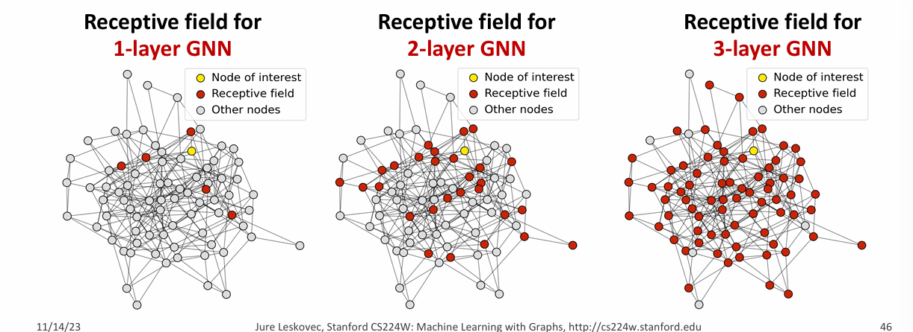

In a 3-layer GNN, the receptive field overlap for two nodes(感受野重叠过大). The shared neighbors quickly grows when the number of GNNlayers $>=$ 3.So we should be cautious when adding GNNLayers.

> If two nodes have highly-overlapped receptive fields, then their embeddings are highly similar

- <B>Goal:Making a shallow GNN more expressive.</B>

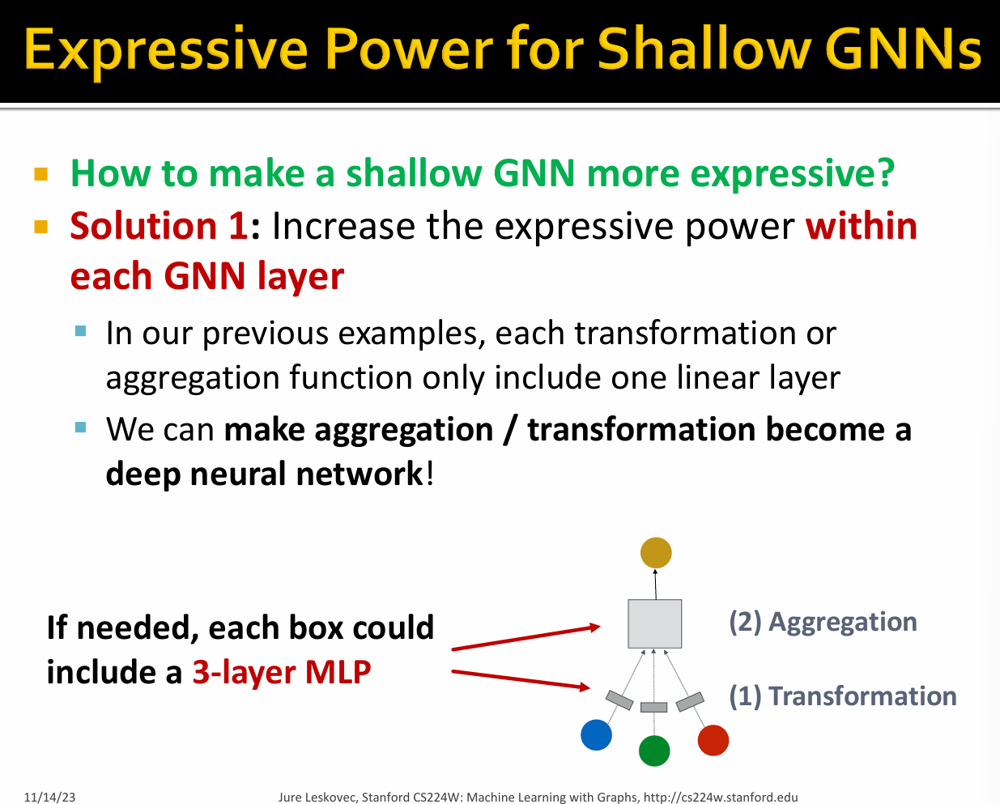

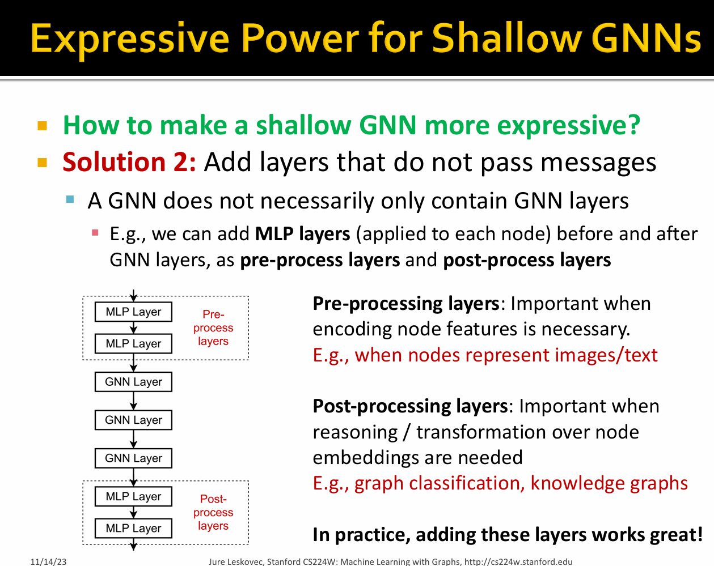

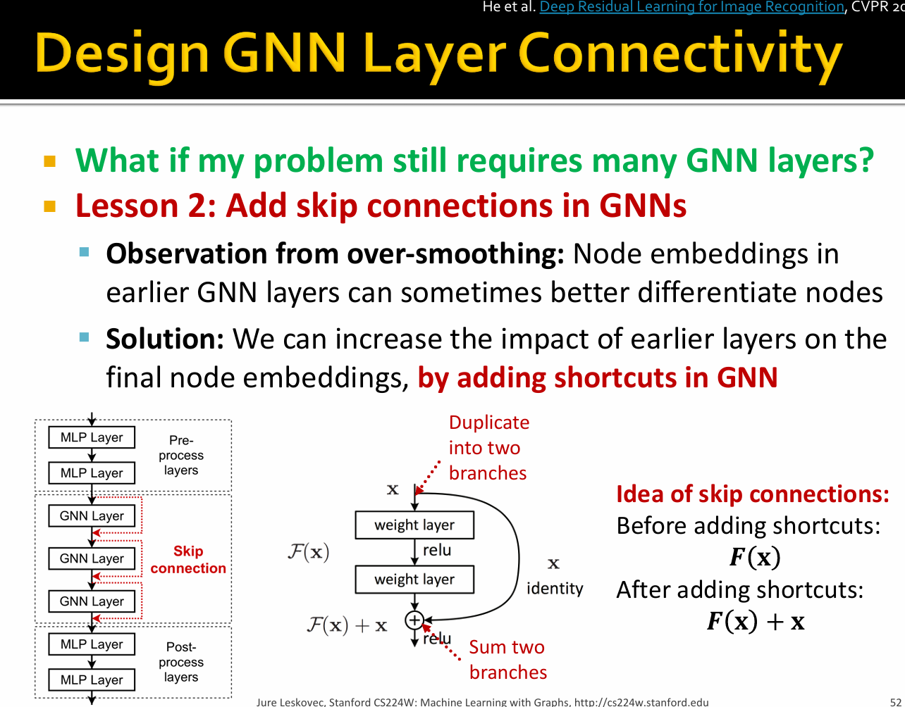

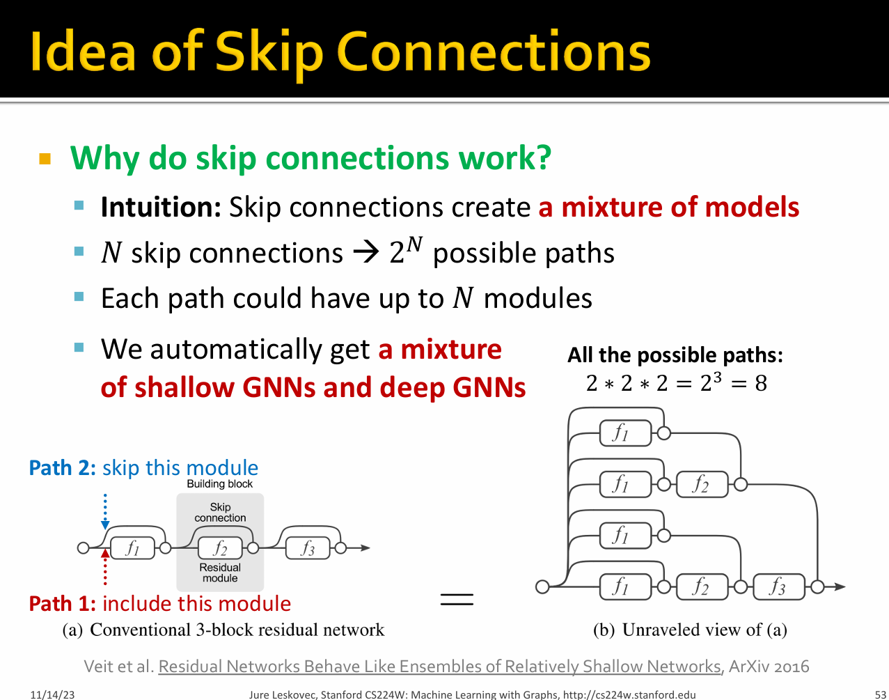
.png)

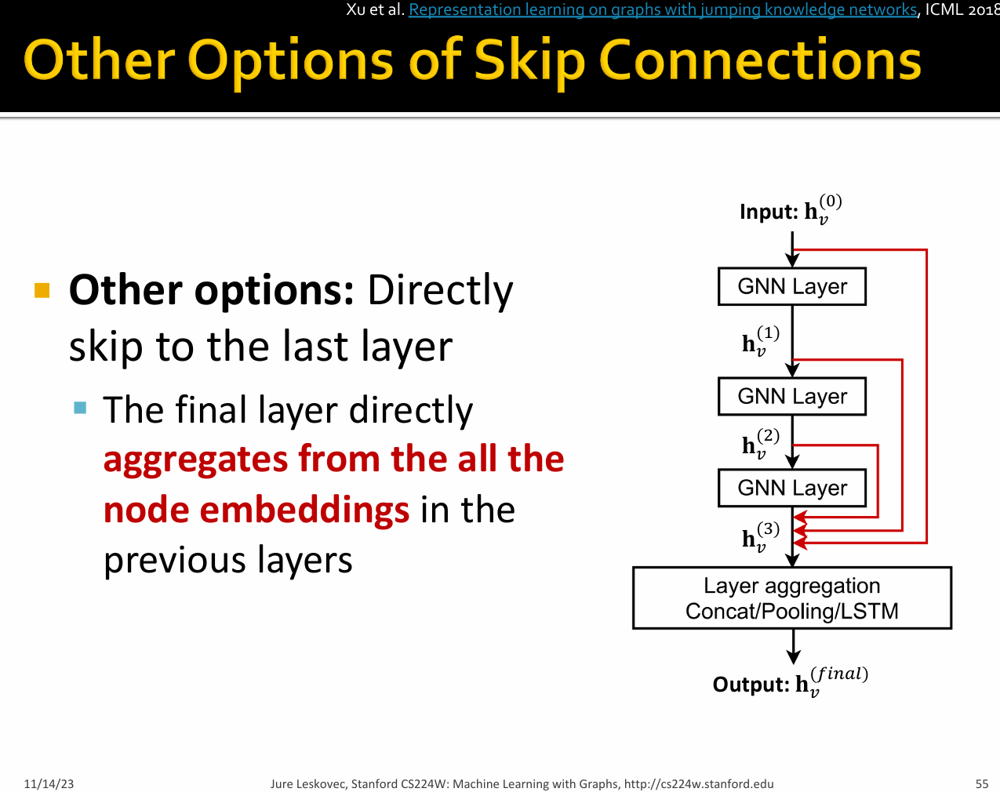

### Manipulate Graphs

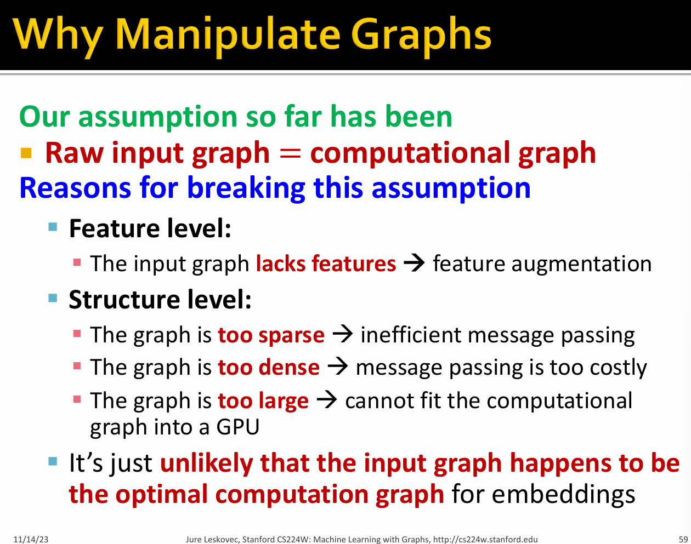

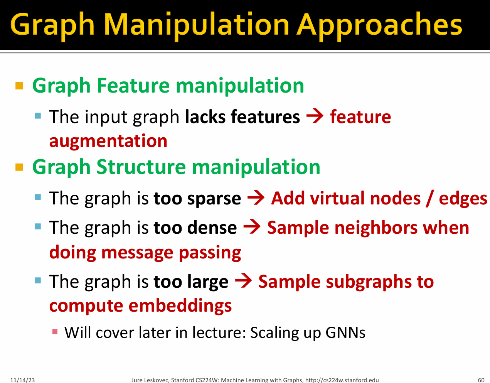

### Feature Augmentation on Graphs

.png)
.png)

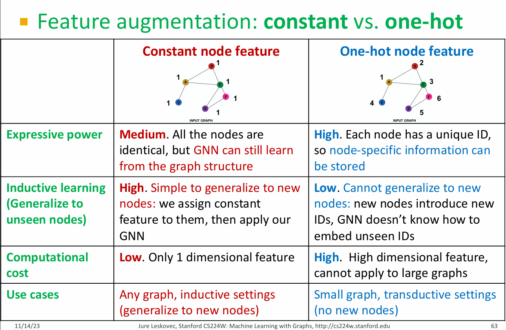

### Add Virtual Nodes/Edges: Augment sparse graphs

- Add virtual edges

.png)

- Add virtual nodes

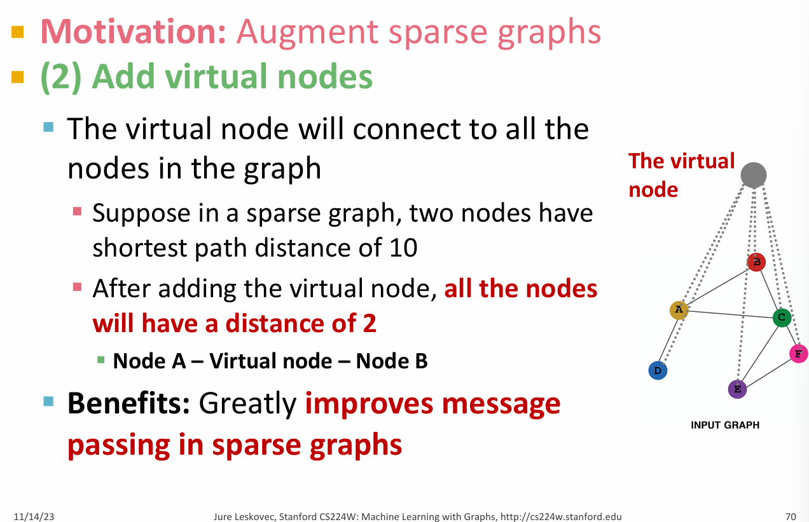

### Node Neighborhood Sampling

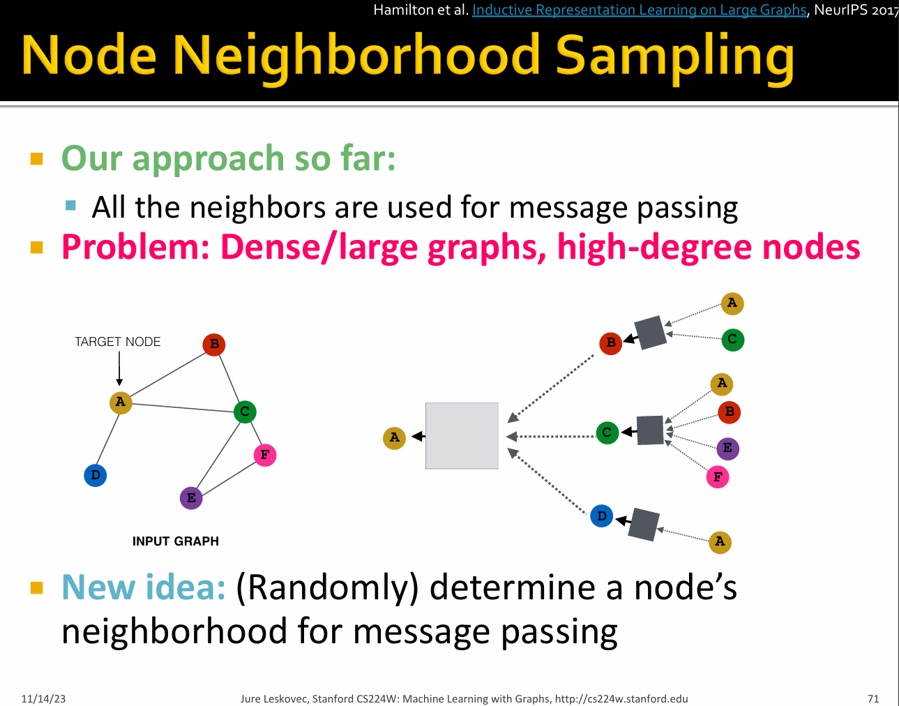

.png)

.png)

.png)