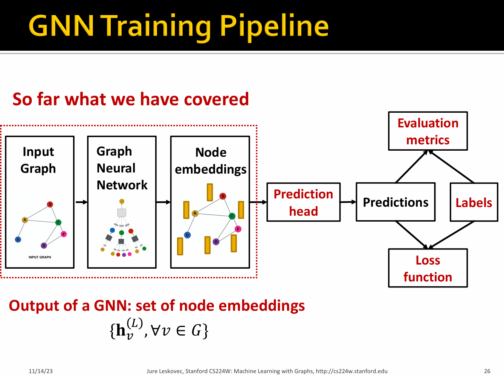
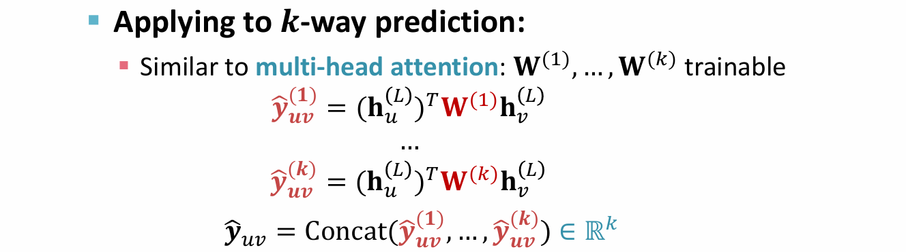
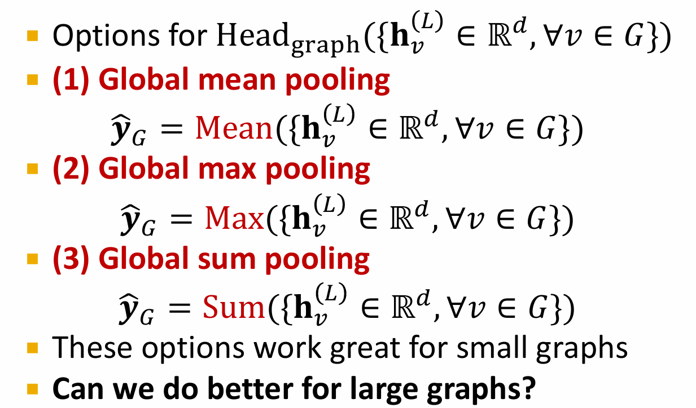
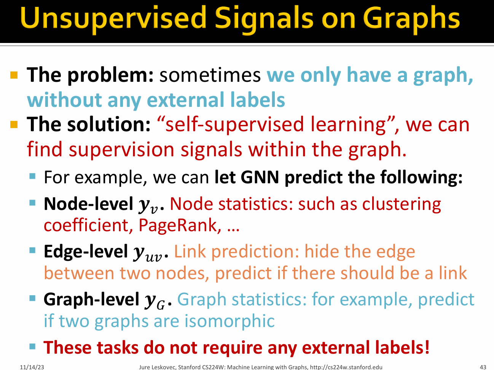
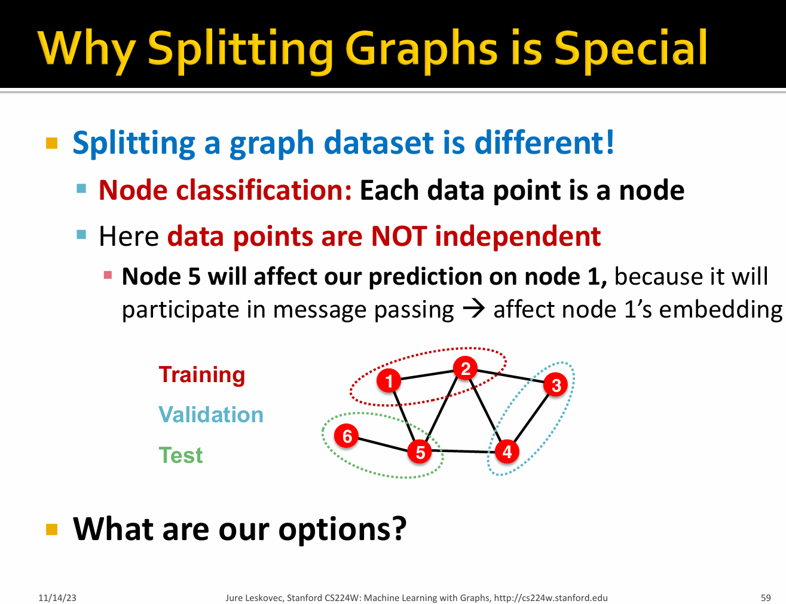

# 🛣[Deep Learning]Stanford CS224w:Machine Learning with Graphs
---

!!! info "想说的话🎇"
    
    
    🔝课程网站：http://web.stanford.edu/class/cs224w/
    
    👀一些资源: 
    B站精讲：https://www.bilibili.com/video/BV1pR4y1S7GA/?spm_id_from=333.337.search-card.all.click&vd_source=280e4970f2995a05fdeab972a42bfdd0
    
    https://github.com/TommyZihao/zihao_course/tree/main/CS224W
    
    Slides: http://web.stanford.edu/class/cs224w/slides
    
    

### Prediction with GNN

- Node-level prediction

After GNN computation, we can get node embeddings:$\{ \mathbf{h}_v^{l} \in \mathbb{R}^d, \forall v \in G \}$

$$
\hat{y}^v = Head_{node} (\mathbf{h}_v^{l}) = \mathbf{W}^{H} \mathbf{h}_v^{l}
$$

其中$\hat{y}^v \in \mathbb{R}^k$来表示要分类的k类

- Edge-level prediction

$$
\hat{y}^{uv} = Head_{edge} (\mathbf{h}_v^{l}, \mathbf{h}_v^{l})
$$

(1)Concatenation + Linear

$$
\hat{y}^{uv} = Linear(Concat(\mathbf{h}_v^{l}, \mathbf{h}_u^{l}))
$$

(2) Dot product

$$
\hat{y}^{uv} = (\mathbf{h}_u^{l})^T \mathbf{h}_v^{l}
$$

>  This approach only applies to 𝟏-way prediction (e.g., link prediction: predict the existence of an edge)

- Graph-level prediction

$$
\hat{y}^{G} = Head_{graph} ( \{\mathbf{h}_v^{l}, \forall v \in G \})
$$

### Dataset Split:Fixed split/Random split

.png)

.png)

.png)

.png)

.png)

.png)

### Seting up Link Prediction Task

.png)

.png)

.png)

.png)

.png)

.png)