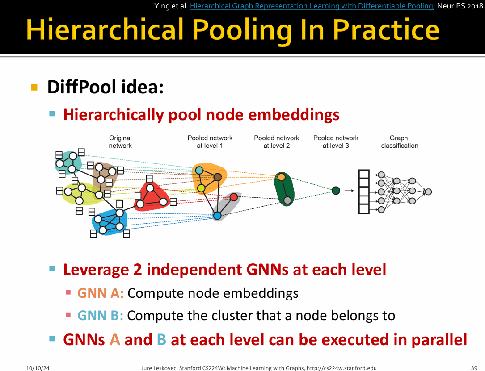
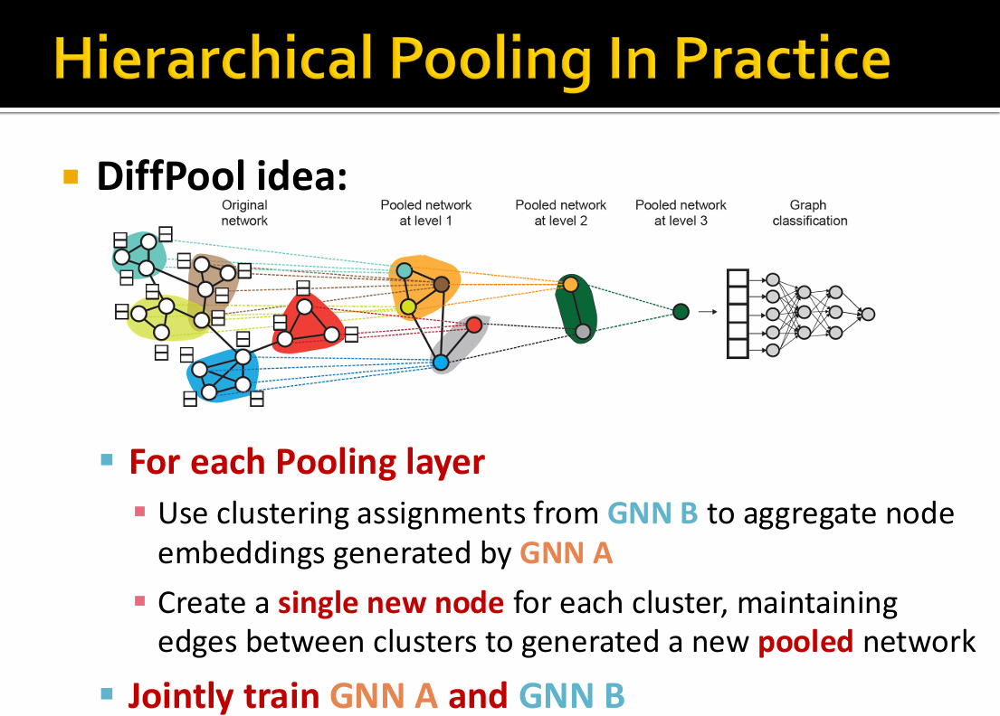

# 🛣[Deep Learning]Stanford CS224w:Machine Learning with Graphs
---
<script src="https://polyfill.io/v3/polyfill.min.js?features=es6"></script>
<script src="https://cdn.jsdelivr.net/npm/mathjax@3/es5/tex-chtml.js"></script>

!!! info "想说的话🎇"
    <font size = 3.5>
    
    🔝课程网站：http://web.stanford.edu/class/cs224w/
    
    👀一些资源: 
    B站精讲：https://www.bilibili.com/video/BV1pR4y1S7GA/?spm_id_from=333.337.search-card.all.click&vd_source=280e4970f2995a05fdeab972a42bfdd0
    
    https://github.com/TommyZihao/zihao_course/tree/main/CS224W
    
    Slides: http://web.stanford.edu/class/cs224w/slides
    
    </font>

### Prediction with GNN


- Node-level prediction

After GNN computation, we can get node embeddings:$\{ \mathbf{h}_v^{l} \in \mathbb{R}^d, \forall v \in G \}$

$$
\hat{y}^v = Head_{node} (\mathbf{h}_v^{l}) = \mathbf{W}^{H} \mathbf{h}_v^{l}
$$

其中$\hat{y}^v \in \mathbb{R}^k$来表示要分类的k类

- Edge-level prediction

$$
\hat{y}^{uv} = Head_{edge} (\mathbf{h}_v^{l}, \mathbf{h}_v^{l})
$$

(1)Concatenation + Linear

$$
\hat{y}^{uv} = Linear(Concat(\mathbf{h}_v^{l}, \mathbf{h}_u^{l}))
$$

(2) Dot product

$$
\hat{y}^{uv} = (\mathbf{h}_u^{l})^T \mathbf{h}_v^{l}
$$

>  This approach only applies to 1-way prediction (e.g., link prediction: predict the existence of an edge)


- Graph-level prediction

$$
\hat{y}^{G} = Head_{graph} ( \{\mathbf{h}_v^{l}, \forall v \in G \})
$$


<B>Hierarchical Pooling: 分层池化方法</B>
---

论文地址：[Hierarchical Graph Representation Learning with Differentiable Pooling](https://arxiv.org/abs/1806.08804)

Code: [Diffpool](https://github.com/RexYing/diffpool)





对于常见的图分类任务，标准的方法是为图中的所有节点生成```embedding```，然后对所有节点的```embedding```进行全局```pooling```。但这种全局pooling方法忽略了图中可能存在的层次结构。而```DiffPool```是一种<B>可微分的图池化模块</B>，可以层次化和端到端方式适应各种图神经网络架构。

定义图$\mathbf{G}:(A, F)$，其中$A \in \{ 0, 1 \}^{n \times n}$是一个邻接矩阵，$F \in \mathbb{R}^{n \times d}$是节点的特征矩阵。假设一个有标签的图集为$\mathcal{D}=\left\{\left(G_{1}, y_{1}\right),\left(G_{2}, y_{2}\right), \ldots\right\}$。

图分类任务的目标是学习一个映射函数：$f : \mathcal{G} \rightarrow \mathcal{Y}$。

$$
H^{(k)} = M(A,H^{(k-1);\theta^{(k)}})
$$

其中$H^{k} \in \mathbb{R}^{n \times d}$是第k层节点表示，$M$是消息传递函数，依赖于邻接矩阵和可训练的参数$\theta^{(k)}$。如```GCN```实现的为：

$$
H^{(k)} = \operatorname{ReLU}\left(\tilde{D}^{-\frac{1}{2}} \tilde{A} \tilde{D}^{-\frac{1}{2}} H^{(k-1)} W^{(k-1)}\right)
$$

其中$\tilde{A} = A+I, \tilde{D}=\sum_j \tilde{A}_{ij}$。本文中的```DiffPool```可以使用任意一个消息传递函数模块$M$，可写成$Z=GNN(A, X)$。$Z=H^{(k)} \in \mathbb{R}^{n \times d}$，其中$K$的范围通常为2~6。

> 本文的目标是建立一个通用的、端到端的、可微的能够stack多个GNN的层次化模型

我们寻求一种策略来在$n$个节点的原图基础上生成$m<n$个节点的新粗化图，并且具有写的邻接矩阵$A'$以及节点```embedding``` $Z' \in \mathbb{R}^{m \times d}$，再输入到另一个```GNNlayer```中，整个过程可以重复$L$次，生成一个具有$L$个```GNNlayer```的模型。

$$
\begin{aligned}
X^{(l+1)} &= {S^{(l)}}^T Z^{(l)} \in \mathbb{R}^{n_{l+1} \times d} \\
A^{(l+1)} &= {S^{(l)}}^T A^{(l)} S^{(l)} \in \mathbb{R}^{n_{l+1} \times n_{l+1}}\\
\end{aligned}
$$

其中$S^{(l)} \in \mathbb{R}^{n_l \times n_{l+1}}$定义为第$l$层学到的```cluster assignment matrix```，$n_l$表示在第$l$层的节点数，$n_{l+1}$表示在第$l+1$层的节点数（$n_l > n_{l+1}$）

$$
\begin{aligned}
Z^{(l)} &= GNN_{l,embed}(A^{(l)}, X^{(l)}) \\
S^{(l)} &= \operatorname{Softmax}\left(GNN_{l,pool}(A^{(l)}, X^{(l)}) \right) \\
\end{aligned}
$$

其中，```softmax```是对每一行进行```softmax```。得到$l$层各个节点划分到$l+1$层各个```cluster```的概率。

> 在倒数第二层的$S$被指定为一个全为$1$的列向量，表示最后一层只有一个类别。所有的节点被分配到这个类别产生的embedding代表整个图。

在实践中，仅使用图分类任务中的梯度信号来训练```pooling GNN```可能很困难。因此引入两个正则化$L_{LP}$和$L_E$:

- ```Auxiliary Link Prediction Objective```: $L_{LP}=|| A^{(l)} - S^{(l)} {S^{(l)}}^T ||_F $，where $|| \cdot ||_F$ denotes the Frobenius norm。Frobenius norm 表示矩阵中每个元素平方和再开方，即$L_{LP}$表示$A^{(l)}$与$S^{(l)}{S^{(l)}}^T$之间的距离要尽可能接近。

$S^{(l)} \in \mathbb{R}^{n_l \times n_{l+1}}$是第$l$层的```assignment matrix```，表示将第l层的$n_l$个节点分配到第$l$层的$n_{l+1}$个节点。$S^{(l)}_{ik}$表示将第l层的第$i$个节点分配到第$l+1$层的第$k$个cluster的概率。${(S^{(l)} {S^{(l)}}^T)}_{ij} = \sum_k S^{(l)}_{ik} {S^{(l)}_{kj}}^T$，即i节点与j节点映射到下一层同一个cluster的概率对应相乘再相加，两个节点之间映射到同一个cluster的概率越大，
${(S^{(l)} {S^{(l)}}^T)}_{ij}$数值越大。通过最小化$L_{LP}$，可以使得连接强度越大的两节点更容易被映射到同一个cluster上。

- ```Entropy Regularization```: $L_E = \frac{1}{n} \sum_{i=1}^n H(S_i)$

$S_i$表示第i个节点映射到下一层每个cluster的概率，所以应该是一个接近```one-hot```的向量，最优情形是第i个节点只映射到下一层的一个cluster。$H(S_i)$表示熵函数，熵表示体系分布的混乱程度，通过减小熵的方式减少映射分布的不确定性。

$$
\text{Information Entropy:} \ H(X) = - \sum_{i=1}^n p(x_i) \log{(p(x_i))}
$$

> 最优情形是，第i个节点只映射到下一层的一个cluster，熵$H(S_i)$为0。

### Dataset Split:Fixed split/Random split


.png)

.png)

.png)

.png)

.png)

.png)

### Seting up Link Prediction Task

.png)

.png)

.png)

.png)

.png)

.png)