# 🛣[Deep Learning]Stanford CS224w:Machine Learning with Graphs
---
<script src="https://polyfill.io/v3/polyfill.min.js?features=es6"></script>
<script src="https://cdn.jsdelivr.net/npm/mathjax@3/es5/tex-chtml.js"></script>

!!! info "想说的话🎇"
    <font size = 3.5>
    
    🔝课程网站：http://web.stanford.edu/class/cs224w/
    
    👀一些资源: 
    B站精讲：https://www.bilibili.com/video/BV1pR4y1S7GA/?spm_id_from=333.337.search-card.all.click&vd_source=280e4970f2995a05fdeab972a42bfdd0
    
    https://github.com/TommyZihao/zihao_course/tree/main/CS224W
    
    Slides: http://web.stanford.edu/class/cs224w/slides
    
    </font>

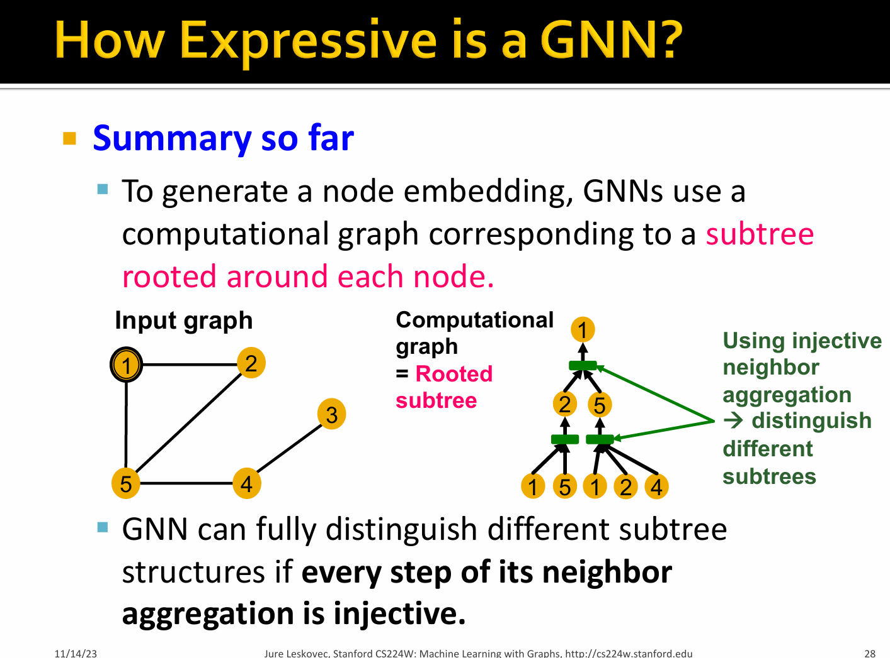

### Neighborhood Aggregation

- Observation: Neighbor aggregation can be abstracted as a function over a multi-set (a set with repeating elements).

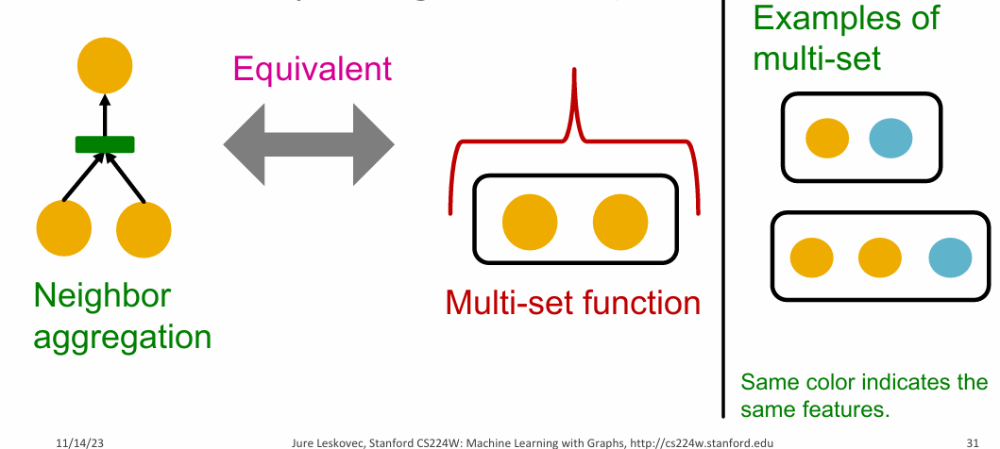

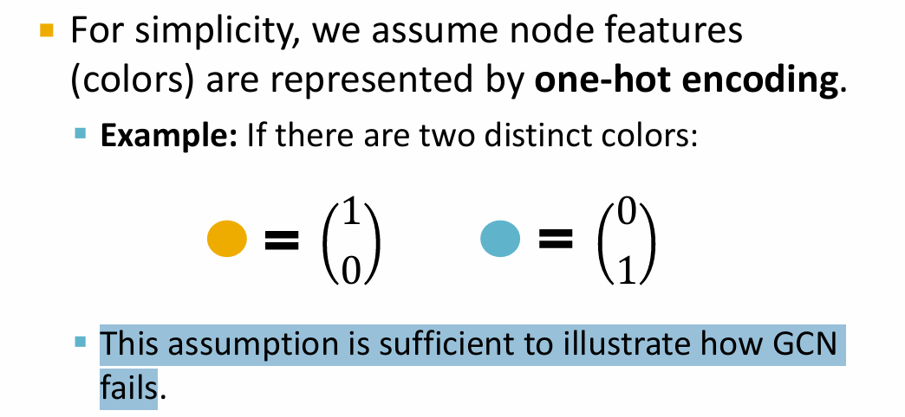

- GCN

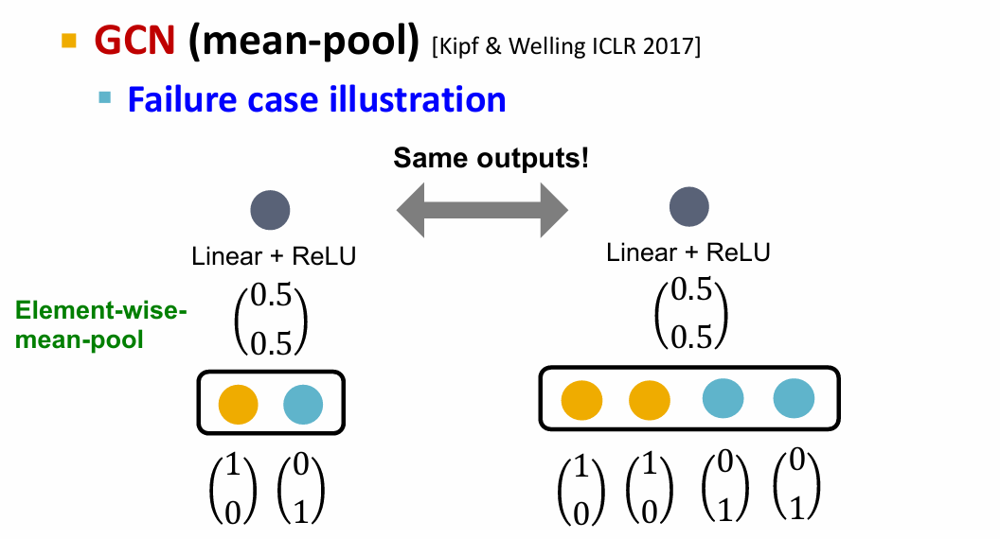

- GraphSAGE

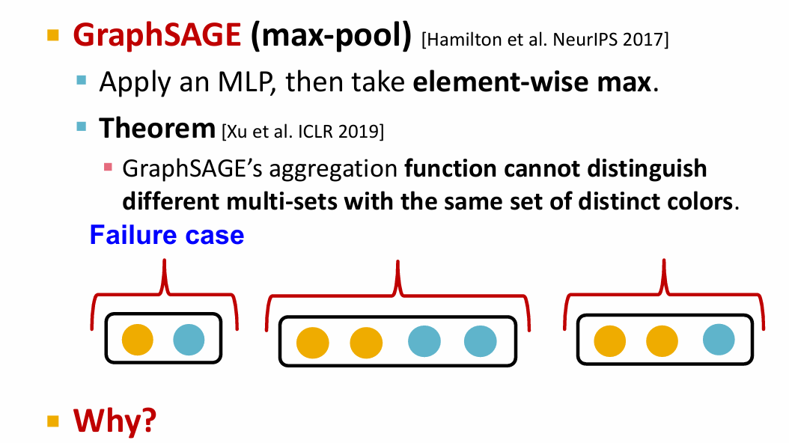

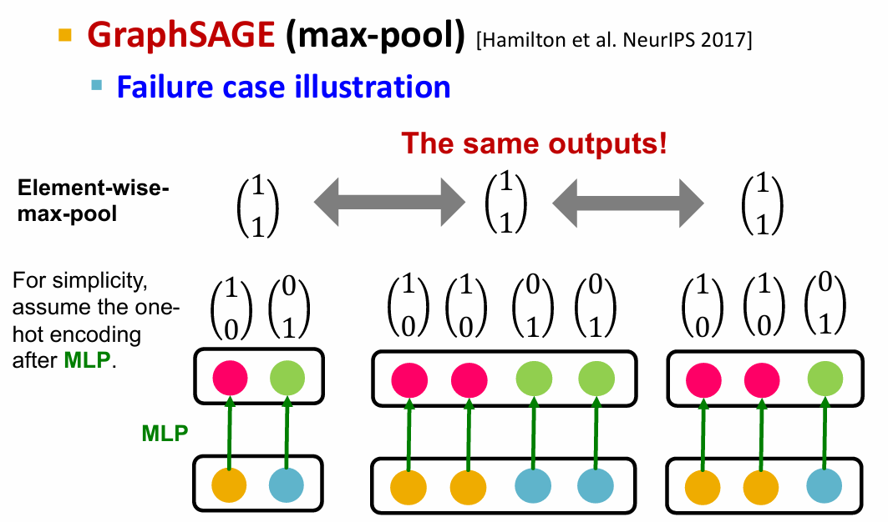

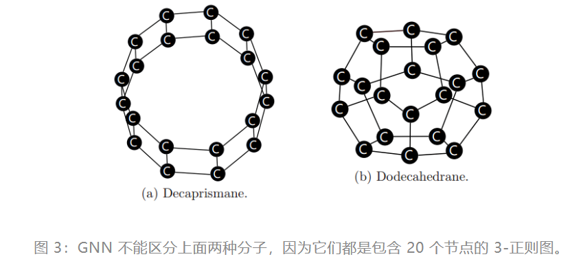
.png)
.png)

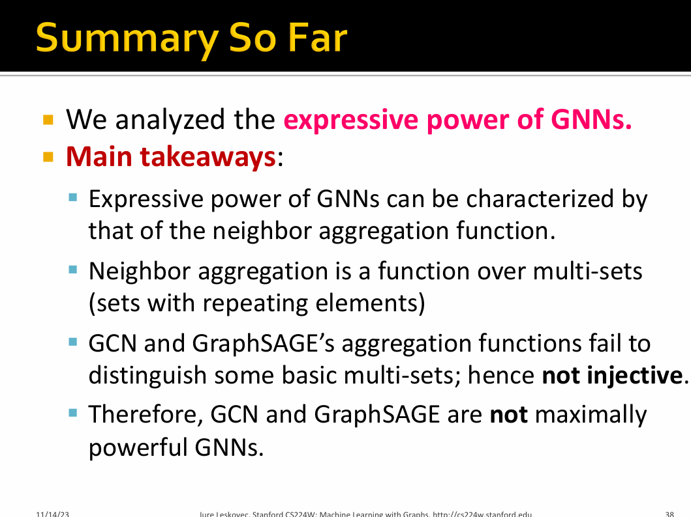

### Designing Most Expressive GNNs

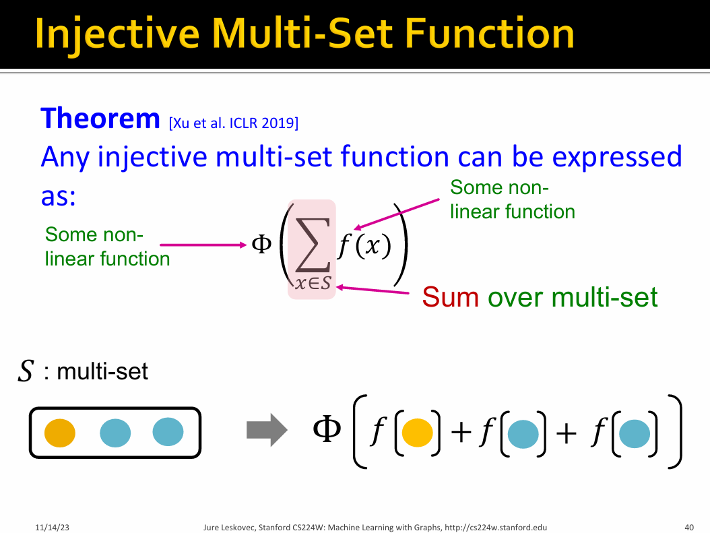

.png)

.png)

### Graph Isomorphism Network(GIN)

GIN(图同构网络)'s neighbor aggregation function is <B>injective</B>, so GIN is the most expressive GNN

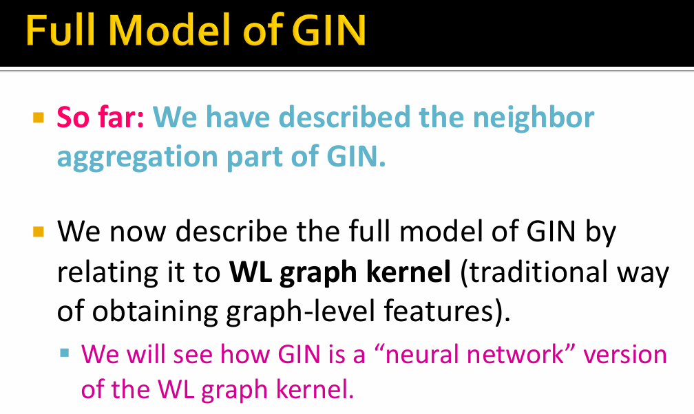

- 1-Weisfeiler-Lehman（Color refinement algorithm）算法

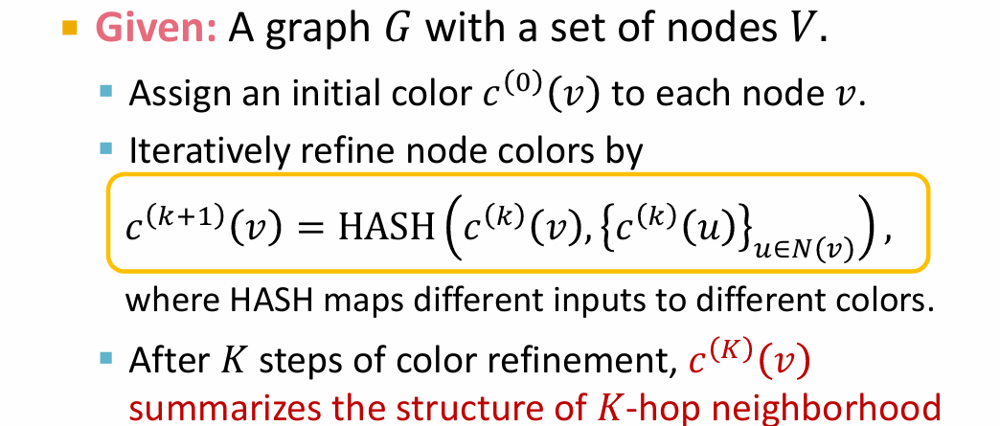

.png)
.png)
.png)

GIN uses a NN to model the injective HASH function

$$
\begin{aligned}
&GINconv(c^{(k)}(v),\{ c^{(k)}(u)_{u \in N(v)} \}) \\
=& MLP_{\phi} \Big( (1+\epsilon)MLP_f (c^{(k)}(v))+ \sum_{u\in N(v)} MLP_f (c^{(k)}(u)) \Big)\\
\end{aligned}
$$

> where $\epsilon$ is a learnable parameter.

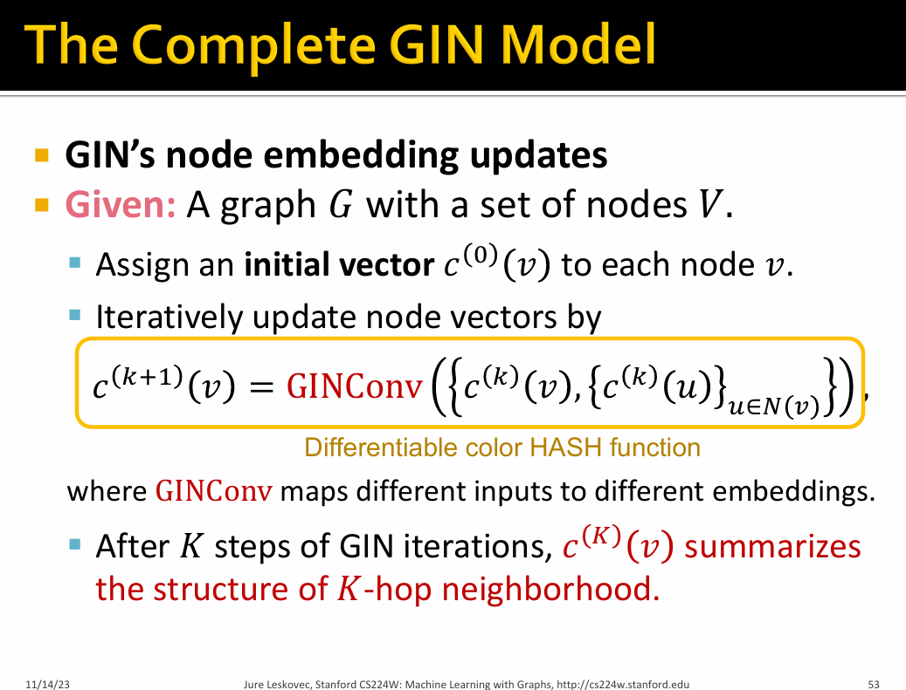

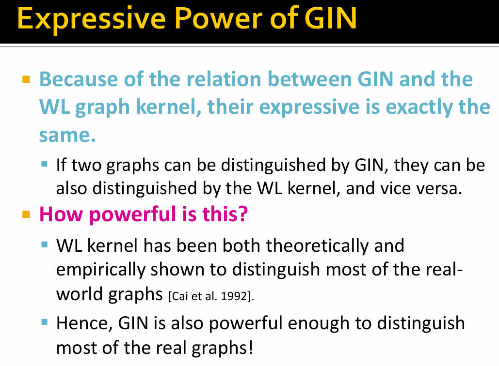

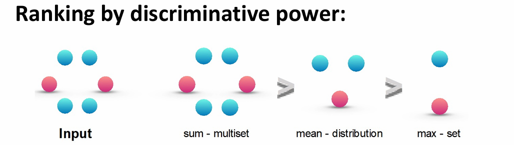

### General tips

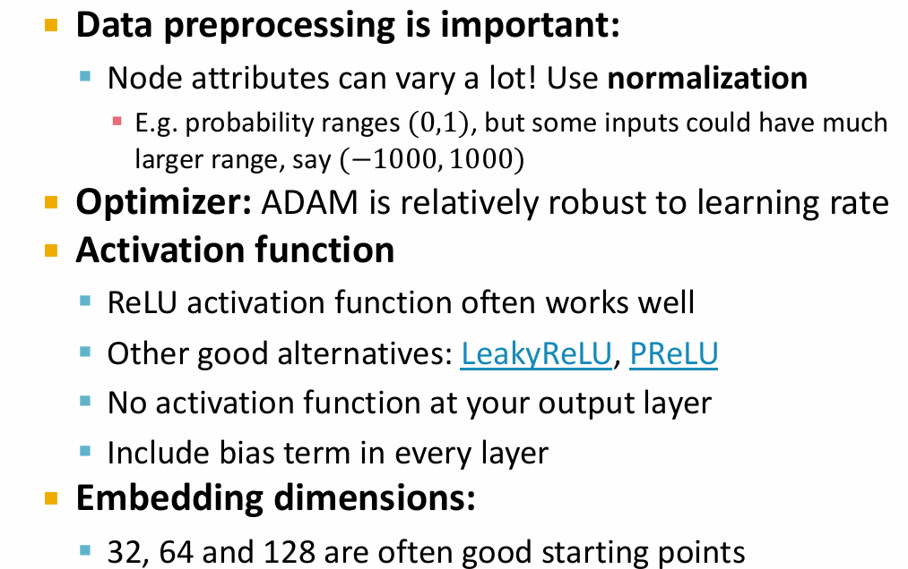

### Understand GIN 

论文地址：[How Powerful are Graph Neural Networks](https://arxiv.org/abs/1810.00826)

```python
class S2VGraph(object):
    def __init__(self, g, label, node_tags=None, node_features=None):
        '''
            g: a networkx graph
            label: an integer graph label
            node_tags: a list of integer node tags
            node_features: a torch float tensor, one-hot representation of the tag that is used as input to neural nets
            edge_mat: a torch long tensor, contain edge list, will be used to create torch sparse tensor
            neighbors: list of neighbors (without self-loop)
        '''
        self.label = label # 图的标签
        self.g = g # networkx graph type
        self.node_tags = node_tags # 节点标签
        self.neighbors = []
        self.node_features = 0 # 节点特征
        self.edge_mat = 0
        self.max_neighbor = 0
'''
COLLAB 是一个科学合作数据集。图对应于研究人员的自我网络，即研究人员及其合作者是节点，边表示两个研究人员之间的合作。研究人员的自我网络有三个可能的标签，即高能物​​理、凝聚态物理和天体物理，这些是研究人员所属的领域。该数据集有 5,000个图，每个图（graphs）都有标签 0、1 或 2。

COLLAB数据集（.txt）格式：
5000 # 图的数量
45 0 # 第一个图的节点数和标签
0 44 1 2 3 4 5 6 7 8 9 10 11 12 13 14 15 16 17 18 19 20 21 22 23 24 25 26 27 28 29 30 31 32 33 34 35 36 37 38 39 40 41 42 43 44
0 44 0 2 3 4 5 6 7 8 9 10 11 12 13 14 15 16 17 18 19 20 21 22 23 24 25 26 27 28 29 30 31 32 33 34 35 36 37 38 39 40 41 42 43 44
0 44 0 1 3 4 5 6 7 8 9 10 11 12 13 14 15 16 17 18 19 20 21 22 23 24 25 26 27 28 29 30 31 32 33 34 35 36 37 38 39 40 41 42 43 44
.. ... ... 

第一次接触图神经网络的数据集，必须搞清楚数据集的格式，才能正确地读取数据。
'''


def load_data(dataset, degree_as_tag):
    '''
        dataset: name of dataset
        test_proportion: ratio of test train split
        seed: random seed for random splitting of dataset
    '''
    print('loading data')
    g_list = [] # 存放图对象
    label_dict = {} # 存放标签映射
    feat_dict = {} # 存放节点特征映射

    with open('dataset/%s/%s.txt' % (dataset, dataset), 'r') as f:
        n_g = int(f.readline().strip())
        for i in range(n_g):
            row = f.readline().strip().split()
            n, l = [int(w) for w in row] # number of nodes and label
            if not l in label_dict:
                mapped = len(label_dict)
                label_dict[l] = mapped
            g = nx.Graph() # NetworkX
            node_tags = [] # 节点标签列表
            node_features = [] # 节点特征列表
            n_edges = 0 # 边数
            for j in range(n):
                g.add_node(j) # .add_node添加节点
                row = f.readline().strip().split()
                tmp = int(row[1]) + 2 # 用于确定节点属性的数量
                if tmp == len(row):
                    # no node attributes 没有节点属性
                    row = [int(w) for w in row]
                    attr = None
                else:
                    row, attr = [int(w) for w in row[:tmp]], np.array([float(w) for w in row[tmp:]])
                if not row[0] in feat_dict:
                    mapped = len(feat_dict)
                    feat_dict[row[0]] = mapped
                node_tags.append(feat_dict[row[0]]) # 节点标签

                if tmp > len(row): 
                    node_features.append(attr)

                n_edges += row[1] # 加边
                for k in range(2, len(row)):
                    g.add_edge(j, row[k]) # .add_edge添加边
            '''
            g.add_node
            g.add_edge
            '''

            if node_features != []:
                node_features = np.stack(node_features)
                node_feature_flag = True
            else:
                node_features = None
                node_feature_flag = False

            assert len(g) == n

            g_list.append(S2VGraph(g, l, node_tags)) #(图，图标签，节点标签)

    #add labels and edge_mat       
    for g in g_list:
        g.neighbors = [[] for i in range(len(g.g))]
        # 为每个图的每个节点初始化邻居列表
        for i, j in g.g.edges():
            g.neighbors[i].append(j)
            g.neighbors[j].append(i)
        # 为每个节点填充邻居列表（无向图）
        degree_list = []
        for i in range(len(g.g)):
            g.neighbors[i] = g.neighbors[i]
            degree_list.append(len(g.neighbors[i])) # 每个节点的度数
        g.max_neighbor = max(degree_list)

        g.label = label_dict[g.label]

        edges = [list(pair) for pair in g.g.edges()]
        # 边的节点对
        edges.extend([[i, j] for j, i in edges])
        # 无向图
        deg_list = list(dict(g.g.degree(range(len(g.g)))).values())
        # 计算所有节点的度数，并将其转换为列表
        g.edge_mat = torch.LongTensor(edges).transpose(0,1)
        # 用于生成稀疏矩阵A

    if degree_as_tag:
        for g in g_list:
            g.node_tags = list(dict(g.g.degree).values())

    #Extracting unique tag labels   
    tagset = set([])
    for g in g_list:
        tagset = tagset.union(set(g.node_tags))

    tagset = list(tagset)
    tag2index = {tagset[i]:i for i in range(len(tagset))}

    for g in g_list:
        g.node_features = torch.zeros(len(g.node_tags), len(tagset))
        g.node_features[range(len(g.node_tags)), [tag2index[tag] for tag in g.node_tags]] = 1


    print('# classes: %d' % len(label_dict))
    print('# maximum node tag: %d' % len(tagset))

    print("# data: %d" % len(g_list))

    return g_list, len(label_dict)

def separate_data(graph_list, seed, fold_idx):
    assert 0 <= fold_idx and fold_idx < 10, "fold_idx must be from 0 to 9."
    skf = StratifiedKFold(n_splits=10, shuffle = True, random_state = seed)

    labels = [graph.label for graph in graph_list]
    idx_list = []
    for idx in skf.split(np.zeros(len(labels)), labels):
        idx_list.append(idx)
    train_idx, test_idx = idx_list[fold_idx]

    train_graph_list = [graph_list[i] for i in train_idx]
    test_graph_list = [graph_list[i] for i in test_idx]

    return train_graph_list, test_graph_list

class MLP(nn.Module):
    def __init__(self, num_layers, input_dim, hidden_dim, output_dim):
        '''
            num_layers: number of layers in the neural networks (EXCLUDING the input layer). If num_layers=1, this reduces to linear model.
            input_dim: dimensionality of input features
            hidden_dim: dimensionality of hidden units at ALL layers
            output_dim: number of classes for prediction
            device: which device to use
        '''
    
        super(MLP, self).__init__()

        self.linear_or_not = True #default is linear model
        self.num_layers = num_layers

        if num_layers < 1:
            raise ValueError("number of layers should be positive!")
        elif num_layers == 1:
            #Linear model
            self.linear = nn.Linear(input_dim, output_dim)
        else:
            #Multi-layer model
            self.linear_or_not = False
            self.linears = torch.nn.ModuleList()
            self.batch_norms = torch.nn.ModuleList()
        
            self.linears.append(nn.Linear(input_dim, hidden_dim))
            for layer in range(num_layers - 2):
                self.linears.append(nn.Linear(hidden_dim, hidden_dim))
            self.linears.append(nn.Linear(hidden_dim, output_dim))

            for layer in range(num_layers - 1):
                self.batch_norms.append(nn.BatchNorm1d((hidden_dim)))

    def forward(self, x):
        if self.linear_or_not:
            #If linear model
            return self.linear(x)
        else:
            #If MLP
            h = x
            for layer in range(self.num_layers - 1):
                h = F.relu(self.batch_norms[layer](self.linears[layer](h)))
            return self.linears[self.num_layers - 1](h)

class GraphCNN(nn.Module):
    def __init__(self, num_layers, num_mlp_layers, input_dim, hidden_dim, output_dim, final_dropout, learn_eps, graph_pooling_type, neighbor_pooling_type, device):
        '''
            num_layers: number of layers in the neural networks (INCLUDING the input layer)
            num_mlp_layers: number of layers in mlps (EXCLUDING the input layer)
            input_dim: dimensionality of input features
            hidden_dim: dimensionality of hidden units at ALL layers
            output_dim: number of classes for prediction
            final_dropout: dropout ratio on the final linear layer
            learn_eps: If True, learn epsilon to distinguish center nodes from neighboring nodes. If False, aggregate neighbors and center nodes altogether. 
            neighbor_pooling_type: how to aggregate neighbors (mean, average, or max)
            graph_pooling_type: how to aggregate entire nodes in a graph (mean, average)
            device: which device to use
        '''

        super(GraphCNN, self).__init__()

        self.final_dropout = final_dropout
        self.device = device
        self.num_layers = num_layers
        self.graph_pooling_type = graph_pooling_type
        self.neighbor_pooling_type = neighbor_pooling_type
        self.learn_eps = learn_eps
        self.eps = nn.Parameter(torch.zeros(self.num_layers-1))
        # learn_eps 是否添加自环

        ###List of MLPs
        self.mlps = torch.nn.ModuleList()

        ###List of batchnorms applied to the output of MLP (input of the final prediction linear layer)
        self.batch_norms = torch.nn.ModuleList()

        for layer in range(self.num_layers-1):
            if layer == 0:
                self.mlps.append(MLP(num_mlp_layers, input_dim, hidden_dim, hidden_dim))
            else:
                self.mlps.append(MLP(num_mlp_layers, hidden_dim, hidden_dim, hidden_dim))

            self.batch_norms.append(nn.BatchNorm1d(hidden_dim))

        #Linear function that maps the hidden representation at dofferemt layers into a prediction score
        self.linears_prediction = torch.nn.ModuleList()
        for layer in range(num_layers):
            if layer == 0:
                self.linears_prediction.append(nn.Linear(input_dim, output_dim))
            else:
                self.linears_prediction.append(nn.Linear(hidden_dim, output_dim))


    def __preprocess_neighbors_maxpool(self, batch_graph): 
        #为最大池化创建填充的邻居列表
        ###create padded_neighbor_list in concatenated graph

        #compute the maximum number of neighbors within the graphs in the current minibatch
        max_deg = max([graph.max_neighbor for graph in batch_graph])

        padded_neighbor_list = []
        start_idx = [0]
        '''
        为什么要使用节点索引偏移量？
        
        为每个图的邻居节点添加偏移量是为了确保邻居节点在批处理中的全局索引是唯一的和正确的

        在处理多个图时，图的节点索引是局部的。每个图的节点索引从0开始，而在批处理的上下文中，所有图的节点索引需要合并成一个统一的索引空间。通过加上 start_idx[i]，可以将当前图的邻居节点索引转换为全局索引，避免索引冲突。
        '''

        for i, graph in enumerate(batch_graph):
            start_idx.append(start_idx[i] + len(graph.g))
            #更新 start_idx列表，将当前图的节点数添加到前一个图的结束索引，以便为下一个图的节点分配正确的索引。
            padded_neighbors = []
            for j in range(len(graph.neighbors)):
                #第i个图第j个节点的邻居列表
                #add off-set values to the neighbor indices
                pad = [n + start_idx[i] for n in graph.neighbors[j]]
                #padding, dummy data is assumed to be stored in -1
                #为每个邻居节点添加偏移量，确保它们的索引在整个批次中的正确位置。(将邻居节点的索引转换为全局索引)

                pad.extend([-1]*(max_deg - len(pad)))
                #将邻居列表填充到 max_deg 的长度，填充部分用 -1 表示，表示无效的邻居
                #Add center nodes in the maxpooling if learn_eps is False, i.e., aggregate center nodes and neighbor nodes altogether.
                if not self.learn_eps:
                    pad.append(j + start_idx[i])

                padded_neighbors.append(pad)
            padded_neighbor_list.extend(padded_neighbors)
        '''
        output:padded_neighbor_list->[num_nodes, max_degree]
        '''
        return torch.LongTensor(padded_neighbor_list)


    def __preprocess_neighbors_sumavepool(self, batch_graph):
        ###create block diagonal sparse matrix
        # 构建一个用于求和或平均池化的块对角稀疏矩阵
        edge_mat_list = []
        start_idx = [0]
        for i, graph in enumerate(batch_graph):
            start_idx.append(start_idx[i] + len(graph.g))
            edge_mat_list.append(graph.edge_mat + start_idx[i])
            # 将当前图的边矩阵 graph.edge_mat 的索引加上当前图的起始索引，以便将所有图合并到一个统一的索引空间。
        Adj_block_idx = torch.cat(edge_mat_list, 1)
        Adj_block_elem = torch.ones(Adj_block_idx.shape[1])

        #Add self-loops in the adjacency matrix if learn_eps is False, i.e., aggregate center nodes and neighbor nodes altogether.

        if not self.learn_eps:
            num_node = start_idx[-1]
            self_loop_edge = torch.LongTensor([range(num_node), range(num_node)])
            elem = torch.ones(num_node)
            Adj_block_idx = torch.cat([Adj_block_idx, self_loop_edge], 1)
            Adj_block_elem = torch.cat([Adj_block_elem, elem], 0)

        Adj_block = torch.sparse.FloatTensor(Adj_block_idx, Adj_block_elem, torch.Size([start_idx[-1],start_idx[-1]]))

        return Adj_block.to(self.device)


    def __preprocess_graphpool(self, batch_graph):
        ###create sum or average pooling sparse matrix over entire nodes in each graph (num graphs x num nodes)
        
        start_idx = [0]

        #compute the padded neighbor list
        for i, graph in enumerate(batch_graph):
            start_idx.append(start_idx[i] + len(graph.g))

        idx = []
        elem = []
        #idx用于存储稀疏矩阵中非零元素的索引，elem用于存储对应的权重
        for i, graph in enumerate(batch_graph):
            ###average pooling   权重为 1 / len(graph.g)
            if self.graph_pooling_type == "average":
                elem.extend([1./len(graph.g)]*len(graph.g))
            
            else:
            ###sum pooling   权重为 1 
                elem.extend([1]*len(graph.g))

            idx.extend([[i, j] for j in range(start_idx[i], start_idx[i+1], 1)])
            #将每个节点的全局索引添加到idx列表中，格式为: 
            # [[图索引, 节点索引], ...]，图与其的节点索引对应
        elem = torch.FloatTensor(elem)
        idx = torch.LongTensor(idx).transpose(0,1)
        graph_pool = torch.sparse.FloatTensor(idx, elem, torch.Size([len(batch_graph), start_idx[-1]]))
        '''
        output:graph_pool 关于图与节点关系的稀疏矩阵，其中每个元素表示一个节点存在于哪个图
        '''
        return graph_pool.to(self.device)

    def maxpool(self, h, padded_neighbor_list):
        ###Element-wise minimum will never affect max-pooling
        #对图中的节点特征进行最大池化
        '''
        h: 特征矩阵
        padded_neighbor_list: 邻居列表
        '''
        dummy = torch.min(h, dim = 0)[0]
        h_with_dummy = torch.cat([h, dummy.reshape((1, -1)).to(self.device)])
        #将原特征矩阵h和虚拟节点dummy结合，形成新的特征矩阵 h_with_dummy
        pooled_rep = torch.max(h_with_dummy[padded_neighbor_list], dim = 1)[0] 
        # dummy对应padded_neighbor_list中的元素-1
        '''
        output: pooled_rep 通过最大池化从邻节点特征中提取信息
        '''
        return pooled_rep

    def next_layer_eps(self, h, layer, padded_neighbor_list = None, Adj_block = None):
        ###pooling neighboring nodes and center nodes separately by epsilon reweighting. 

        if self.neighbor_pooling_type == "max":
            ##If max pooling
            pooled = self.maxpool(h, padded_neighbor_list)
        else:
            #If sum or average pooling
            pooled = torch.spmm(Adj_block, h)
            if self.neighbor_pooling_type == "average":
                #If average pooling
                degree = torch.spmm(Adj_block, torch.ones((Adj_block.shape[0], 1)).to(self.device))
                pooled = pooled/degree

        #Reweights the center node representation when aggregating it with its neighbors
        pooled = pooled + (1 + self.eps[layer])*h
        pooled_rep = self.mlps[layer](pooled)
        h = self.batch_norms[layer](pooled_rep)

        #non-linearity
        h = F.relu(h)
        return h

    def next_layer(self, h, layer, padded_neighbor_list = None, Adj_block = None):
        ###pooling neighboring nodes and center nodes altogether  
        # 将邻居节点和中心节点的表示一起处理    
        if self.neighbor_pooling_type == "max":
            ##If max pooling
            pooled = self.maxpool(h, padded_neighbor_list)
        else:
            #If sum or average pooling
            pooled = torch.spmm(Adj_block, h)
            if self.neighbor_pooling_type == "average":
                #If average pooling
                degree = torch.spmm(Adj_block, torch.ones((Adj_block.shape[0], 1)).to(self.device))
                pooled = pooled/degree

        #representation of neighboring and center nodes 
        pooled_rep = self.mlps[layer](pooled)

        h = self.batch_norms[layer](pooled_rep)

        #non-linearity
        h = F.relu(h)
        return h

    '''
    - next_layer_eps 在聚合时关注于中心节点的重权重，确保在池化时考虑中心节点的特征。
    - next_layer 则是将邻居和中心节点的特征直接合并进行处理。
    '''

    def forward(self, batch_graph):
        X_concat = torch.cat([graph.node_features for graph in batch_graph], 0).to(self.device)
        graph_pool = self.__preprocess_graphpool(batch_graph)

        if self.neighbor_pooling_type == "max":
            padded_neighbor_list = self.__preprocess_neighbors_maxpool(batch_graph)
        else:
            Adj_block = self.__preprocess_neighbors_sumavepool(batch_graph)

        #list of hidden representation at each layer (including input)
        hidden_rep = [X_concat]
        h = X_concat

        for layer in range(self.num_layers-1):
            if self.neighbor_pooling_type == "max" and self.learn_eps:
                h = self.next_layer_eps(h, layer, padded_neighbor_list = padded_neighbor_list)
            elif not self.neighbor_pooling_type == "max" and self.learn_eps:
                h = self.next_layer_eps(h, layer, Adj_block = Adj_block)
            elif self.neighbor_pooling_type == "max" and not self.learn_eps:
                h = self.next_layer(h, layer, padded_neighbor_list = padded_neighbor_list)
            elif not self.neighbor_pooling_type == "max" and not self.learn_eps:
                h = self.next_layer(h, layer, Adj_block = Adj_block)

            hidden_rep.append(h)

        score_over_layer = 0
    
        #perform pooling over all nodes in each graph in every layer
        for layer, h in enumerate(hidden_rep):
            pooled_h = torch.spmm(graph_pool, h)
            #graph_pool是一个稀疏矩阵，表示节点在图中的聚合方式。通过矩阵乘法torch.spmm（稀疏矩阵与稠密矩阵的乘法），将当前层的隐藏表示h进行池化。
            score_over_layer += F.dropout(self.linears_prediction[layer](pooled_h), self.final_dropout, training = self.training)

        return score_over_layer
```

对于节点分类任务，节点表示$h_v^{(k)}$作为预测的输入；对于图分类任务，READOUT函数聚合了最后一侧迭代输出的节点表示$h_v^{(k)}$,并生成图表示$h_G$:

$$
h_G = READOUT( \{ h_v^{(k)} | v \in G \} )
$$

> READOUT函数是具有排列不变性的函数，如sum,average, max-pooling...

而本文提出READOUT函数使用```Concat+Sum```,对每次迭代所得到的所有节点特征求和以得到图的特征，最后拼接起来

$$
h_G = Concat(Sum(\{ h_v^{(k)} | v \in G \})| k = 0,1,...,K) 
$$

三种不同的aggregate函数：

- sum：学习全部的标签以及数量，可以学习精确的结构信息（不仅保存了分布信息，还保存了类别信息）

- mean：学习标签的比例（比如两个图标签比例相同，但是节点有倍数关系），偏向学习分布信息

- max：学习最大标签，忽略多样，偏向学习有代表性的元素信息

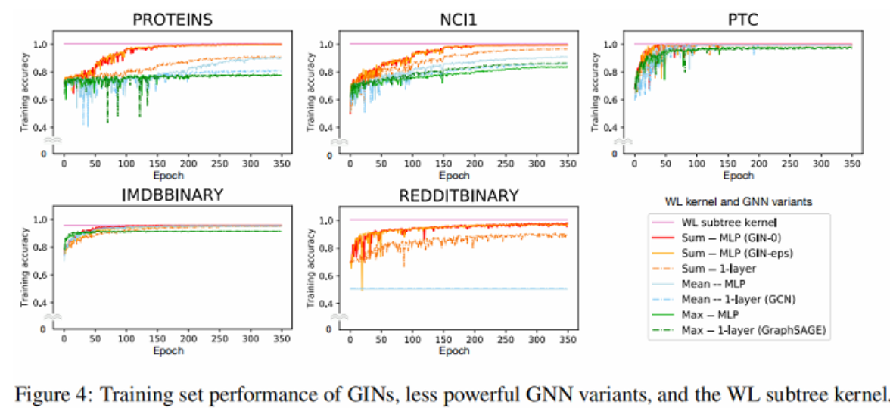

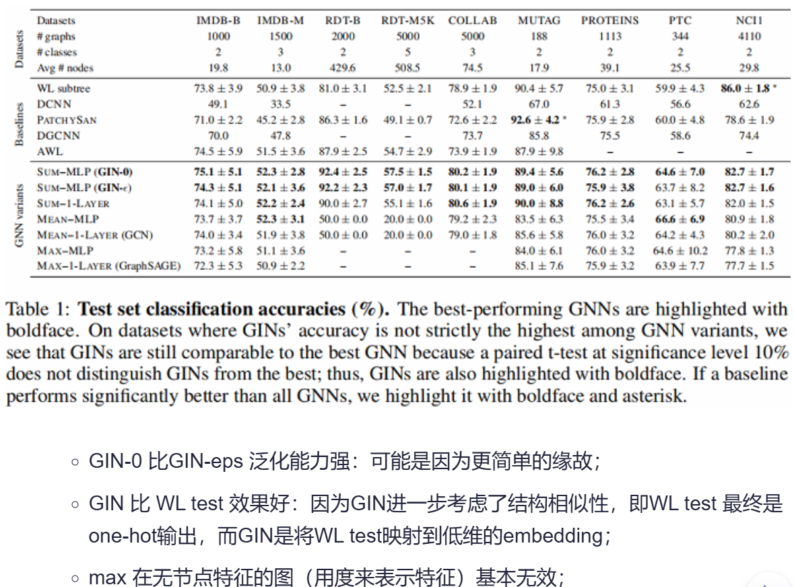

- <B>借助```DGL```库的简洁实现</B>

```python
import argparse

import numpy as np
import torch
import torch.nn as nn
import torch.nn.functional as F
import torch.optim as optim

from dgl.data import GINDataset
from dgl.dataloading import GraphDataLoader
from dgl.nn.pytorch.conv import GINConv
from dgl.nn.pytorch.glob import SumPooling
from sklearn.model_selection import StratifiedKFold
from torch.utils.data.sampler import SubsetRandomSampler


class MLP(nn.Module):
    """Construct two-layer MLP-type aggreator for GIN model"""

    def __init__(self, input_dim, hidden_dim, output_dim):
        super().__init__()
        self.linears = nn.ModuleList()
        # two-layer MLP
        self.linears.append(nn.Linear(input_dim, hidden_dim, bias=False))
        self.linears.append(nn.Linear(hidden_dim, output_dim, bias=False))
        self.batch_norm = nn.BatchNorm1d((hidden_dim))

    def forward(self, x):
        h = x
        h = F.relu(self.batch_norm(self.linears[0](h)))
        return self.linears[1](h)


class GIN(nn.Module):
    def __init__(self, input_dim, hidden_dim, output_dim):
        super().__init__()
        self.ginlayers = nn.ModuleList()
        self.batch_norms = nn.ModuleList()
        num_layers = 5
        # five-layer GCN with two-layer MLP aggregator and sum-neighbor-pooling scheme
        for layer in range(num_layers - 1):  # excluding the input layer
            if layer == 0:
                mlp = MLP(input_dim, hidden_dim, hidden_dim)
            else:
                mlp = MLP(hidden_dim, hidden_dim, hidden_dim)
            self.ginlayers.append(
                GINConv(mlp, learn_eps=False)
            )  # set to True if learning epsilon
            self.batch_norms.append(nn.BatchNorm1d(hidden_dim))
        # linear functions for graph sum poolings of output of each layer
        self.linear_prediction = nn.ModuleList()
        for layer in range(num_layers):
            if layer == 0:
                self.linear_prediction.append(nn.Linear(input_dim, output_dim))
            else:
                self.linear_prediction.append(nn.Linear(hidden_dim, output_dim))
        self.drop = nn.Dropout(0.5)
        self.pool = (
            SumPooling()
        )  # change to mean readout (AvgPooling) on social network datasets

    def forward(self, g, h):
        # list of hidden representation at each layer (including the input layer)
        hidden_rep = [h]
        for i, layer in enumerate(self.ginlayers):
            h = layer(g, h)
            h = self.batch_norms[i](h)
            h = F.relu(h)
            hidden_rep.append(h)
        score_over_layer = 0
        # perform graph sum pooling over all nodes in each layer
        for i, h in enumerate(hidden_rep):
            pooled_h = self.pool(g, h)
            score_over_layer += self.drop(self.linear_prediction[i](pooled_h))
        return score_over_layer


def split_fold10(labels, fold_idx=0):
    skf = StratifiedKFold(n_splits=10, shuffle=True, random_state=0)
    idx_list = []
    for idx in skf.split(np.zeros(len(labels)), labels):
        idx_list.append(idx)
    train_idx, valid_idx = idx_list[fold_idx]
    return train_idx, valid_idx


def evaluate(dataloader, device, model):
    model.eval()
    total = 0
    total_correct = 0
    for batched_graph, labels in dataloader:
        batched_graph = batched_graph.to(device)
        labels = labels.to(device)
        feat = batched_graph.ndata.pop("attr")
        total += len(labels)
        logits = model(batched_graph, feat)
        _, predicted = torch.max(logits, 1)
        total_correct += (predicted == labels).sum().item()
    acc = 1.0 * total_correct / total
    return acc


def train(train_loader, val_loader, device, model):
    # loss function, optimizer and scheduler
    loss_fcn = nn.CrossEntropyLoss()
    optimizer = optim.Adam(model.parameters(), lr=0.01)
    scheduler = optim.lr_scheduler.StepLR(optimizer, step_size=50, gamma=0.5)

    # training loop
    for epoch in range(350):
        model.train()
        total_loss = 0
        for batch, (batched_graph, labels) in enumerate(train_loader):
            batched_graph = batched_graph.to(device)
            labels = labels.to(device)
            feat = batched_graph.ndata.pop("attr")
            logits = model(batched_graph, feat)
            loss = loss_fcn(logits, labels)
            optimizer.zero_grad()
            loss.backward()
            optimizer.step()
            total_loss += loss.item()
        scheduler.step() #更新optimizer的learning rate
        train_acc = evaluate(train_loader, device, model)
        valid_acc = evaluate(val_loader, device, model)
        print(
            "Epoch {:05d} | Loss {:.4f} | Train Acc. {:.4f} | Validation Acc. {:.4f} ".format(
                epoch, total_loss / (batch + 1), train_acc, valid_acc
            )
        )


if __name__ == "__main__":
    parser = argparse.ArgumentParser()
    parser.add_argument(
        "--dataset",
        type=str,
        default="MUTAG",
        choices=["MUTAG", "PTC", "NCI1", "PROTEINS"],
        help="name of dataset (default: MUTAG)",
    )
    args = parser.parse_args()
    print(f"Training with DGL built-in GINConv module with a fixed epsilon = 0")
    device = torch.device("cuda" if torch.cuda.is_available() else "cpu")

    # load and split dataset
    dataset = GINDataset(
        args.dataset, self_loop=True, degree_as_nlabel=False
    )  # add self_loop and disable one-hot encoding for input features
    labels = [l for _, l in dataset]
    train_idx, val_idx = split_fold10(labels)

    # create dataloader
    train_loader = GraphDataLoader(
        dataset,
        sampler=SubsetRandomSampler(train_idx),
        batch_size=128,
        pin_memory=torch.cuda.is_available(),
    )
    val_loader = GraphDataLoader(
        dataset,
        sampler=SubsetRandomSampler(val_idx),
        batch_size=128,
        pin_memory=torch.cuda.is_available(),
    )

    # create GIN model
    in_size = dataset.dim_nfeats
    out_size = dataset.gclasses
    model = GIN(in_size, 16, out_size).to(device)

    # model training/validating
    print("Training...")
    train(train_loader, val_loader, device, model)
```