# 🛣[Deep Learning]Stanford CS224w:Machine Learning with Graphs
---
<script src="https://polyfill.io/v3/polyfill.min.js?features=es6"></script>
<script src="https://cdn.jsdelivr.net/npm/mathjax@3/es5/tex-chtml.js"></script>

!!! info "想说的话🎇"
    <font size = 3.5>
    
    🔝课程网站：http://web.stanford.edu/class/cs224w/
    
    👀一些资源: 
    B站精讲：https://www.bilibili.com/video/BV1pR4y1S7GA/?spm_id_from=333.337.search-card.all.click&vd_source=280e4970f2995a05fdeab972a42bfdd0
    
    https://github.com/TommyZihao/zihao_course/tree/main/CS224W
    
    Slides: http://web.stanford.edu/class/cs224w/slides
    
    </font>

### Limitations of Graph Neural Networks

A perfect GNN should build an injective function between neighborhood structure (regardless of Shops) and node embeddings

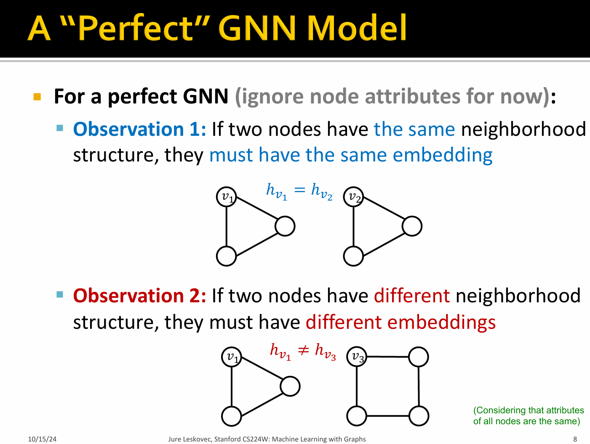

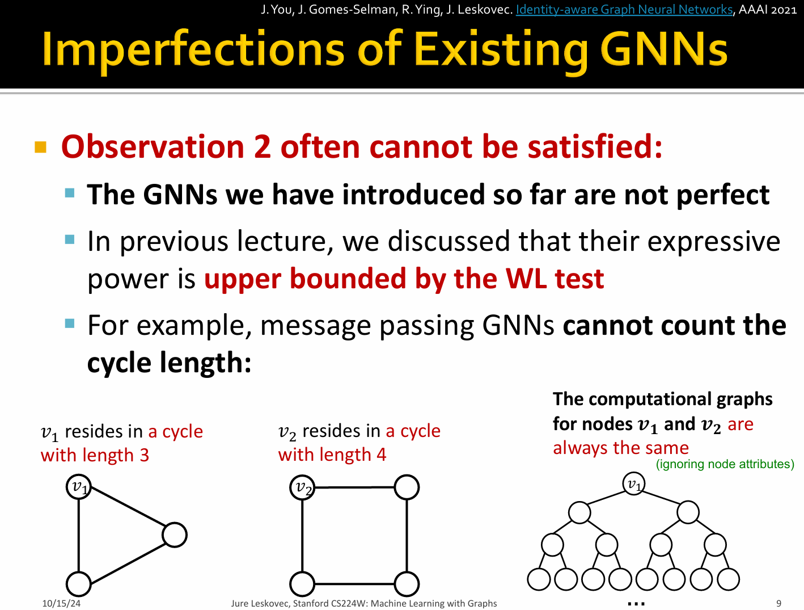

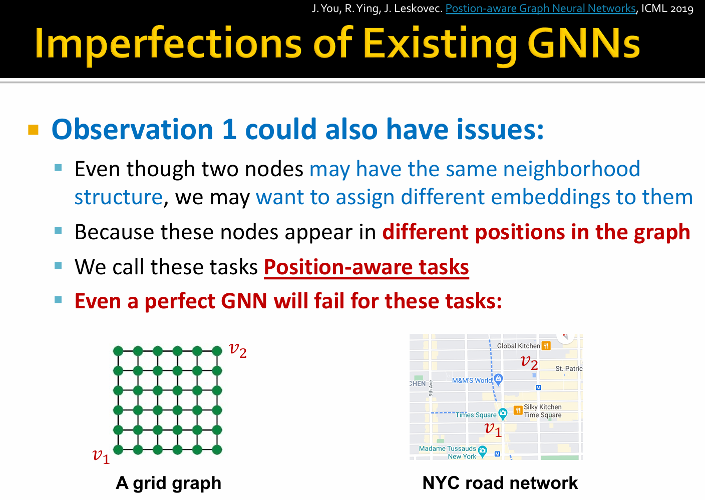

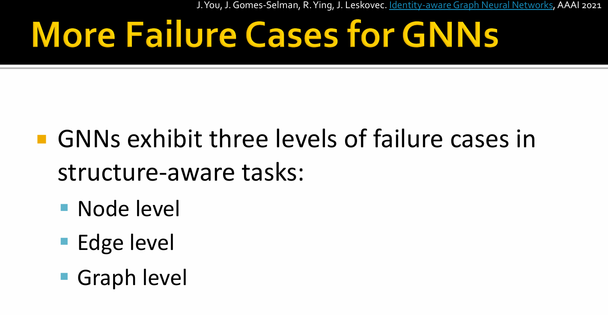

> GNN无法区分不同大小规则图中的节点

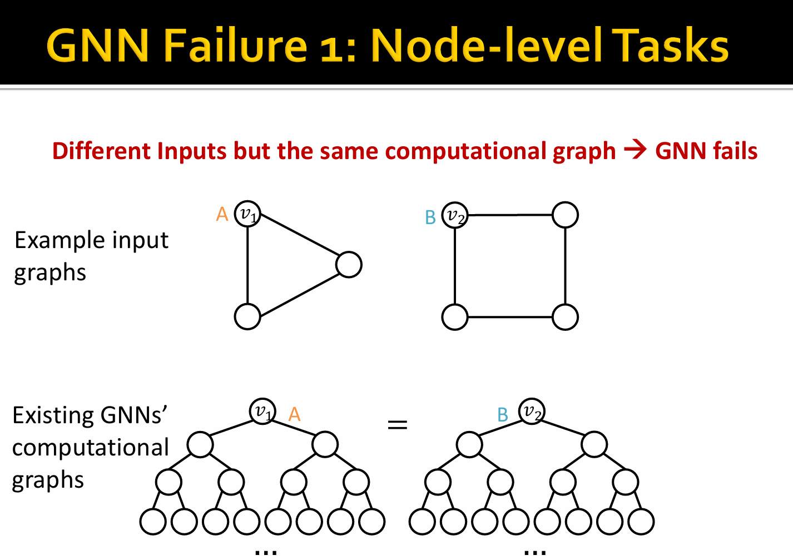 

> 在链路预测任务中，不能区分邻域结构相同但到源节点最短路径距离不同的候选节点

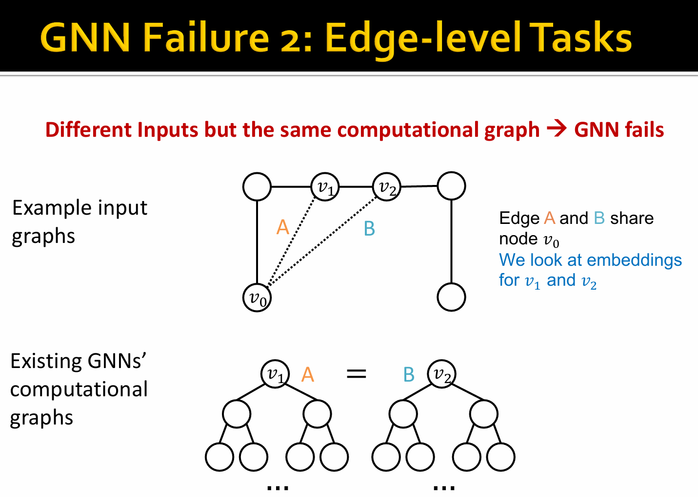 

> 在图分类任务中，它们不能区分正则图

<B>d-正则图</B>指的是，对于一张无向的graph，每个顶点具有相同数量的邻节点， 即每个顶点具有相同的度。 对于一张有向的正则图，每个顶点的出度和入度都相同。

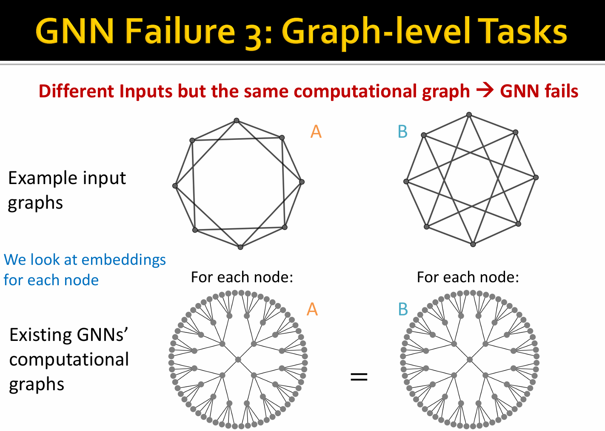

上一节提到的GIN:

$$
c^{(l+1)}_v = MLP \Big( (1+\epsilon)c^{(l)}_v + \sum_{u \in \mathcal{N}(v)} c^{(l)}_u \Big)
$$

将MLP的第一层单独拆解，公式可表示为：

$$
c^{(l+1)}_v = MLP_{-1} \Big( \sigma \Big( (1+\epsilon)c^{(l)}_v + \sum_{u \in \mathcal{N}(v)} c^{(l)}_u \Big) \Big)
$$

我们可以以矩阵形式编写:

$$
\begin{aligned}
C^{(l+1)} &= MLP_{-1} \Big( \sigma \Big( C^{(l)} W_0^{(l)} + A C^{(l)} W_1^{(l)}  \Big) \Big) \\
&= MLP_{-1} \Big( \sigma \Big( \sum_{k=0}^1 A^k C^{(l)} W_k^{(l)} \Big) \Big)
\end{aligned}
$$

其中$C^{(l)} \in \mathbb{R}^{N \times d}, \ C^{(l)}[v,:] = c^{(l)}_v$，$A \in \{ 0,1 \}^{N \times N}$是该图的邻接矩阵。

我们将邻接矩阵进行奇异值分解：

$$
A = V Λ V^T
$$

其中$V=[v_1,...,v_n]$为特征向量的正交矩阵，$Λ$是特征值对角矩阵$\{ \lambda_n \}^N_{n=1}$。

- 邻接矩阵的特征值分解（谱分解）是图的普遍特征（universal characterization of the graph）

- 不同的图具有不同的谱分解（Different graphs have different spectral decompositions）

- 图中的环的数量可以看作图的邻接矩阵的特征值与特征向量的函数

> 谱方法，待补充

### Feature Augmentation: Structurally-Aware GNNs

[基于标注提升的ID-GNN:Identity-aware Graph Neural Networks](https://arxiv.org/pdf/2101.10320)

[ID-GNN的深入代码解读](https://zhuanlan.zhihu.com/p/669036859)

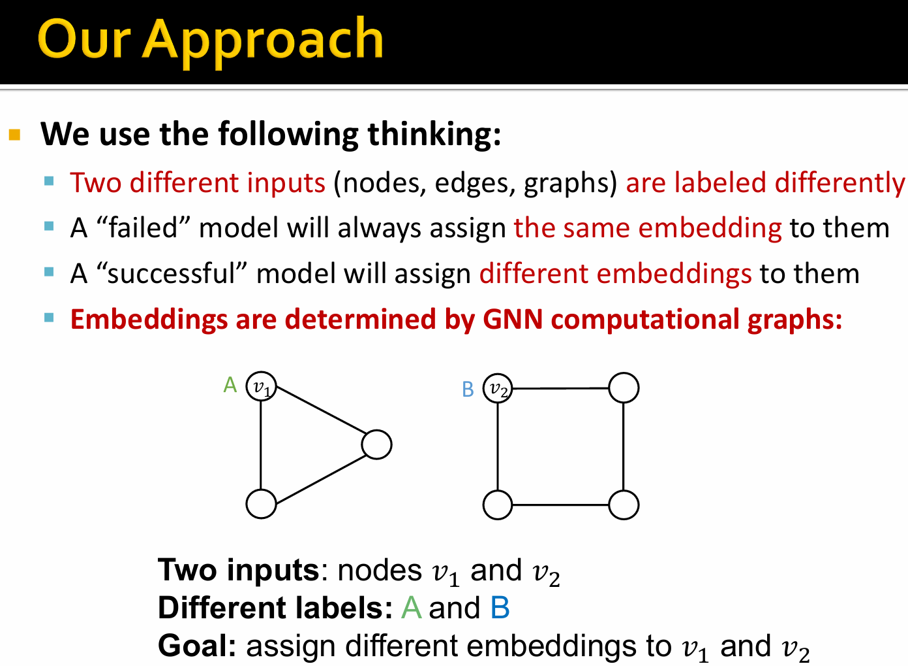

In fact, certain structures are hard to learn by GNNs

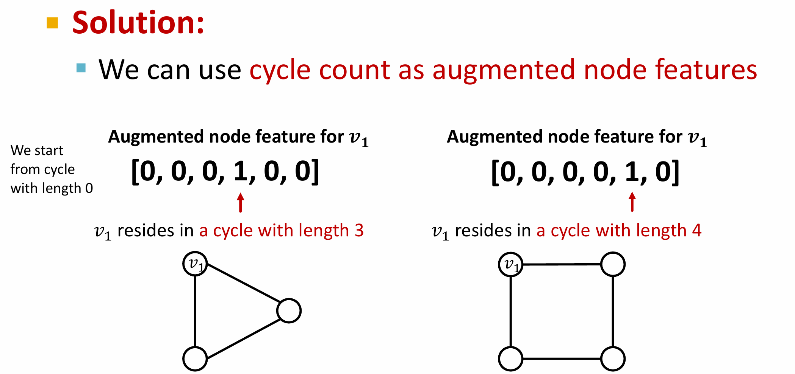

由前几节可知，消息传递GNNs的表达能力上限是```1-Weisfeiler-Lehman（1-WL）```(图同构检验)，这意味着普通GNN不能预测节点聚类系数和最短路径距离，也不能区分不同的正则图。

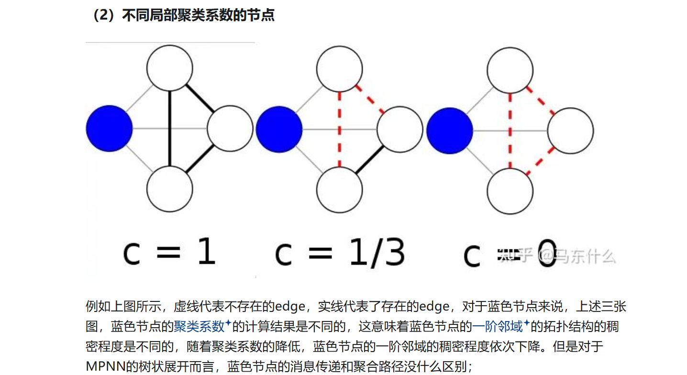

> 正则图指的是各顶点的度均相同的无向简单图，对于常规GNN两个具有不同邻域结构的节点可能拥有相同的计算图，从而出现难以区分的现象。

论文中提出```Identity-aware GraphNeural Networks（ID-GNNs）```，比1-WL具有更强大的表达能力。

ID-GNN通过在消息传递过程中归纳地（inductively）考虑节点的身份，扩展了现有的GNN体系结构。为了获得一个给定的节点的嵌入，ID-GNN首先提取以该节点为中心的Ego-Networks（即自我网络），然后进行多轮的异构消息传递，在自我网络的中心节点上应用与其他节点不同的参数（即自我网络的中心节点与其他节点的聚合函数不为同一个）。 同时论文还提出了一个更快的ID-GNN-fast，它将节点身份信息作为增强的节点特征注入节点中。

假设图$\mathcal{G}=(\mathcal{V},\epsilon)$，其中$\mathcal{V}=\{ v_1,...,v_n \}$代表节点集，$\epsilon$代表图中节点的连接关系，节点特征$\mathcal{X} = \{ x_v |\ \forall v \in \mathcal{V} \}$，边也可以存在特征$\mathcal{F}=\{ f_{uv} | \ \forall e_{uv} \in \epsilon \}$。对于迭代k层的常见GNN网络可以表示为：

$$
\mathbf{m}_u^{(k)}=\mathbf{MSG}^{(k)}(h_u^{(k-1)})\\h_v^{(k)}=\mathbf{AGG}^{(k)}(\{\mathbf{m}_u^{}(k),u\in\mathcal{N}(v)\},h_v^{(k-1)})
$$

ID-GNN 的两个重要组成部分：

- <B>归纳身份着色，将身份信息注入到每个节点</B>

- <B>异构消息传递，在消息传递中使用身份信息</B>

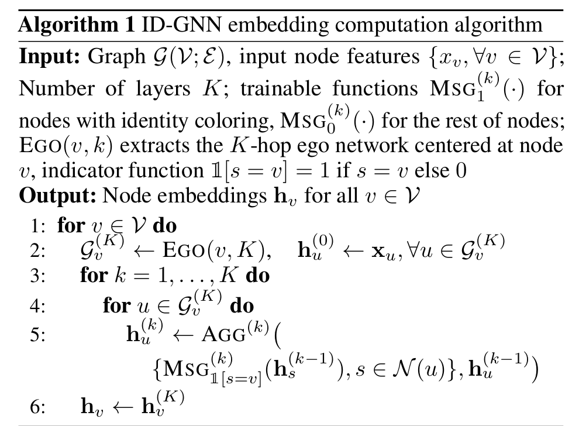

我们先抽取以节点 $v$ 为中心进行K-hop得到的Ego-Networks $\mathcal{G}^{(K)}_v$，，其节点分为两类：着色节点与非着色节点。然后进行多轮的异构消息传递，在自我网络的中心节点上应用与其他节点不同的参数。

即每个节点形成了一个以这个节点为中心的ego network(subgraphs)，将batch graph的方式转化为一个big batch graph。

ID-GNN的想法很简单, 就是为对ego节点和其它节点采取不同的消息传播方式:

$$
\mathbf{m}_{su}^{(k)}=\mathbf{MSG}_{1[s=v]}^{(k)}(h_s^{(k-1)}, f_{su})\\h_u^{(k)}=\mathbf{AGG}^{(k)}(\{\mathbf{m}_{su}^{(k)},s \in \mathcal{N}(u)\},h_u^{(k-1)})
$$

异构消息传递使用了两种$MSG^{(k)}$，$MSG_1^{(k)}$用于着色节点的嵌入，$MSG_0^{(k)}$用于非着色节点的嵌入，$1[s=v]$为$MSG$的示性函数。如果当前节点是某个ego network的中心点(seed node)，则这个节点会额外进行一次```Linear```，然后和按照正常计算出来的GNN的outputs，做一个seed node上的相加。

```ID-GNN-Fast```通过源自给定节点的周期计数（cycle counts）注入身份信息作为增强节点特征。cycle counts通过对计算图的每一层中的着色节点进行计数来捕获节点身份信息$x^+_v \in \mathcal{R}$，并且可以通过图的邻接矩阵的幂来有效地计算$x^+_v [k] = Diag (A^k) [v]$，最终通过级联操作完成增强$x_v = Concat(x_v, x^+_v)$。

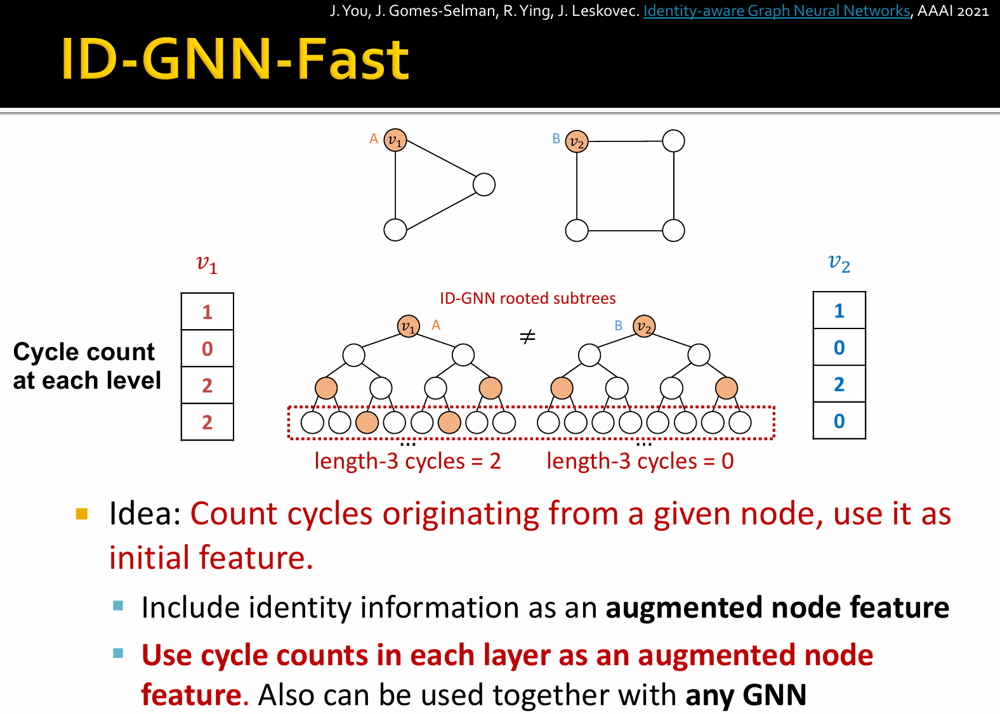

如上图，实际上我们对中心节点额外进行了一次nn.linear并将两次变换的结果求和，使得二者的计算结构不同，使得ID-GNN具有更强的表达能力的同时能区分出不同结构的正则图。

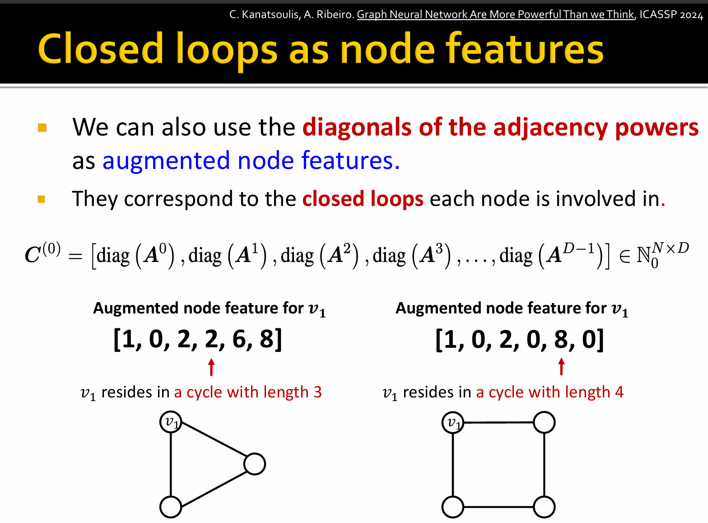


[Graph Neural Networks are More Powerful than We Think](https://ieeexplore.ieee.org/stamp/stamp.jsp?tp=&arnumber=10447704&tag=1)

[Counting Graph Substructures with Graph Neural Networks](https://openreview.net/pdf?id=qaJxPhkYtD)

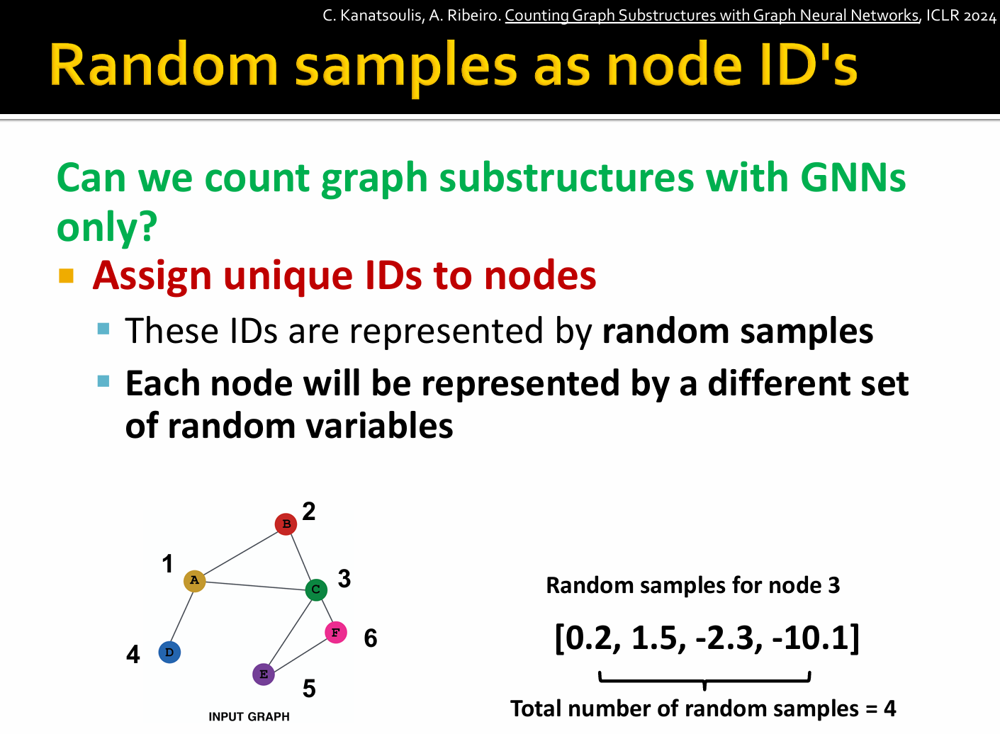

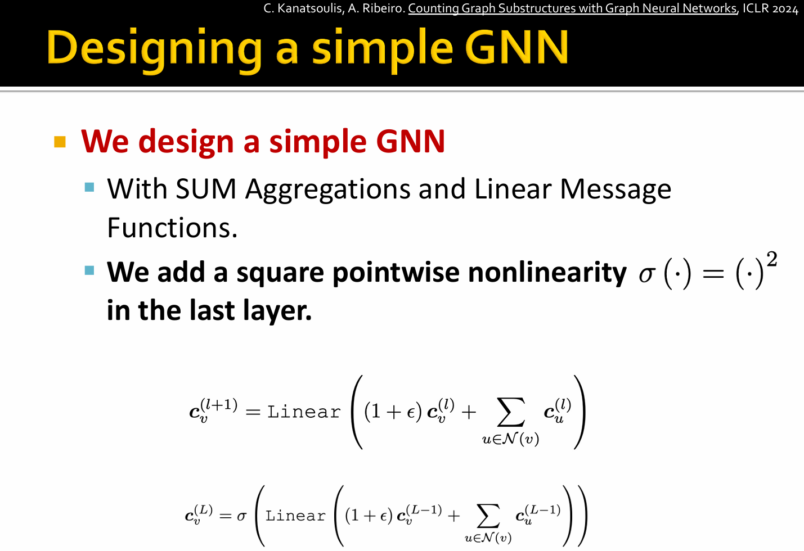

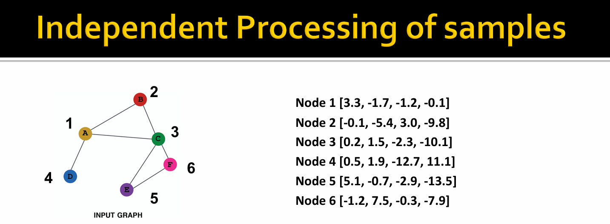

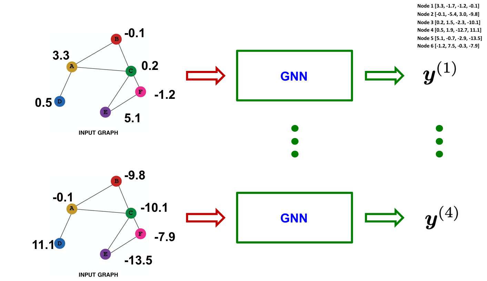

To maintain inductive capability the final output:

$$
\mathbf{y}= \mathbb{E}[y^{(m)}] =\frac{1}{M} \sum_{m=1}^M \mathbf{y}^{(m)}
$$

computes the closed loops of a graph:

$$
C^{(0)} = [diag(A^0), diag(A^1), ..., diag(A^{D-1})] \in \mathbb{N}_0^{N \times D}
$$

> 已知，邻接矩阵$A$表示图的连接关系，其中$A[i][j]=1$表示节点i到j有一条边。而对于邻接矩阵的幂次$A^k$，$A^k[i][j]$表示从节点i出发，经过k步到达j的路径数量。而$diag(A^k)$提取$A^k$的对角线元素，即$diag(A^k)[i] = A^k [i][i]$，表示从节点i出发，经过k步回到自身的闭合路径数(cycle conut)。

### Position-aware GNNs

[Position-aware Graph Neural Networks](https://arxiv.org/pdf/1906.04817)

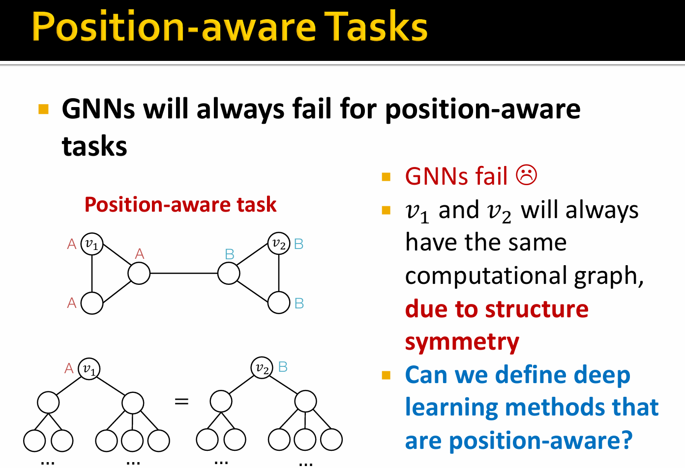

We randomly denote an <B>Anchor node</B>(coordinate axis), then represent the position of each node as the distance to the anchor node, which are different.

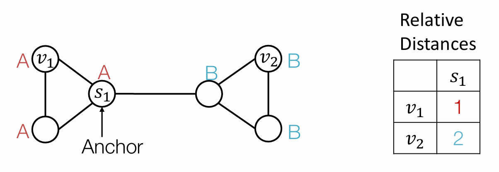

> Observation: picking more anchors can better characterize node position in different regions of the graph

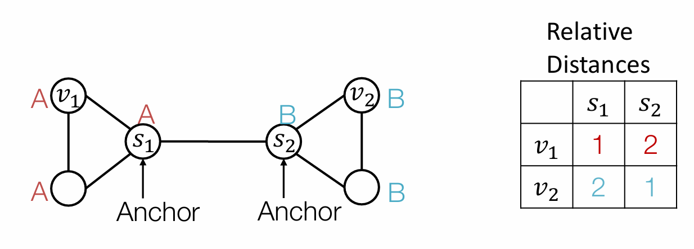

Meanwhile, we generalize anchor from a single node to a <B>set of nodes</B>

> Observation: Large anchor-sets can sometimes provide more precise position estimate

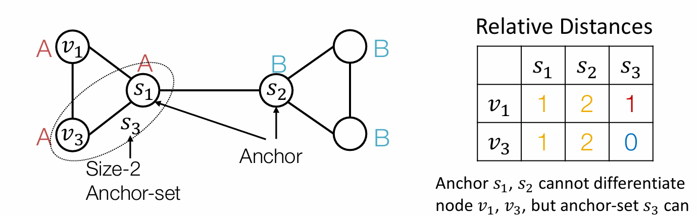

P-GNN follows the theory of <B>Bourgain theorem</B>:

We embed the metric space $(V,d)$ into the Euclidean space $\mathbb{R}^k$ such that the original distance metric is preserved.($||z_u - z_v||_2$ is close to the original distance metric $d(u,v)$)

$$
f(v) = \Big( d_{min}(v, S_{1,1}), d_{min}(v, S_{1,2}),..., d_{min}(v, S_{\log{n},c\log{n}})  \Big) \in \mathbb{R}^{c\log^2{n}}
$$

其中，$c$为常数，$S_{i,j} \subset V$以$\frac{1}{2^i}$的概率从节点集$V$中选择，$d_{min}(v, S_{i,j}) ≡ \min_{u \in S_{i,j}} d(v,u)$

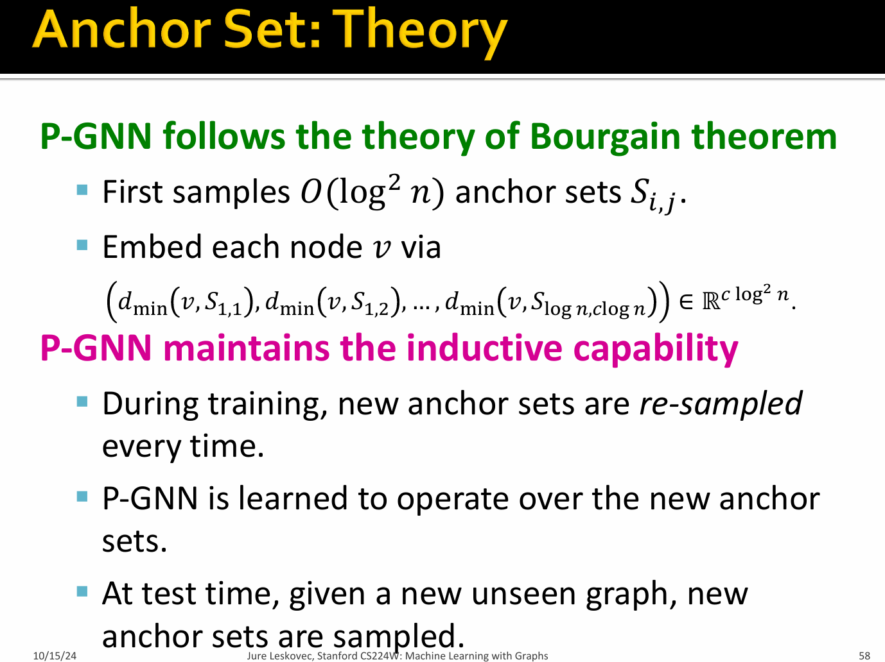

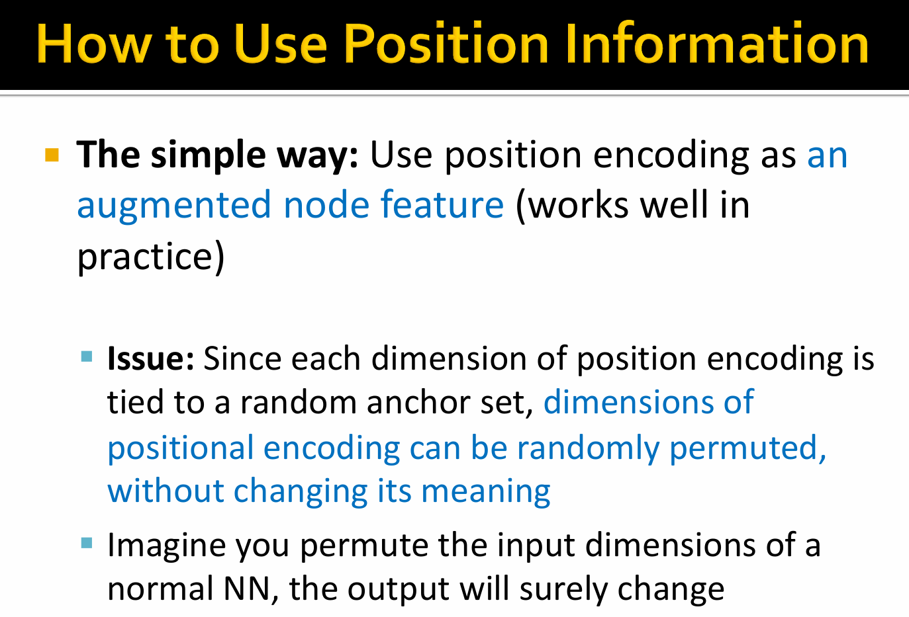

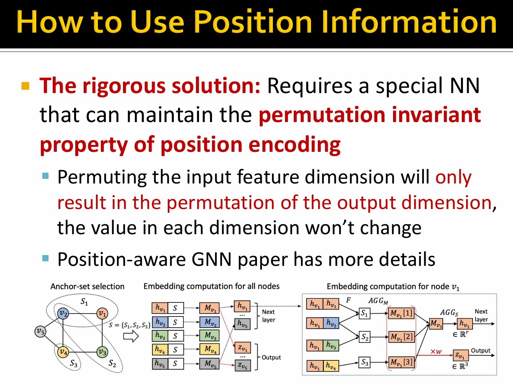

如果两个节点的嵌入可用于（近似）恢复它们在网络中的最短路径距离，我们称节点嵌入为位置感知(position-aware)。

$Def.$ 节点嵌入$z_i = f_p (v_i) , \ \forall v_i \in \mathcal{V}$，若存在$g_p (\cdot, \cdot)$使得$d_{sp}(v_i,v_j)=g_p(z_i,z_j)$（$d_{sp}(\cdot, \cdot)$是最短路径距离），则节点嵌入为position-aware。

```P-GNN```包含以下关键组件：

- k个大小不同的锚点集$S_i$

- 将两个节点特征信息与其网络距离相结合的消息计算函数$F$

- 锚点集消息的矩阵$M$，其中每一行$i$是$F$计算的锚集消息$\mathcal{M_i}$

- 可训练聚合函数${AGG}_M、{AGG}_S$，聚合锚点集中节点的特征信息

- 将消息矩阵$M$投影到低维嵌入空间的可训练向量$w$

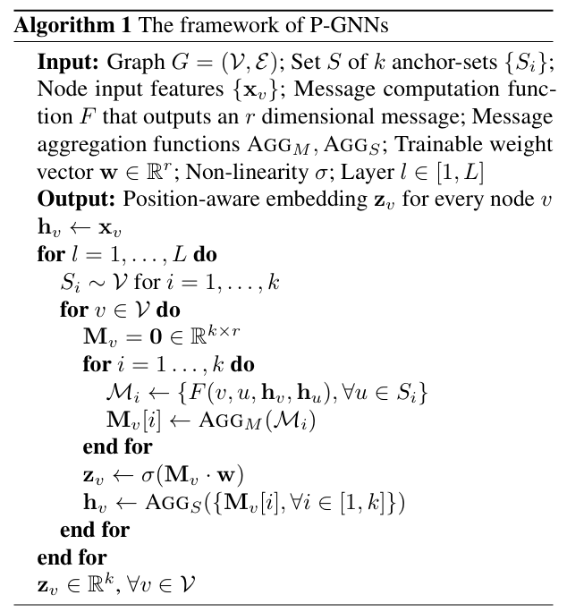

$Def. $ 给定两个度量空间$(\mathcal{V},d)$和$(\mathcal{Z},d')$以及映射函数$f:\mathcal{V} \rightarrow \mathcal{Z}$，若$\forall u,v \in \mathcal{V}, \ \frac{1}{\alpha} d(u,v) \leq d' (f(u),f(v)) \leq d(u,v)$，则称$f$的失真度为$\alpha$。

$Bourgain \ Theorem:$ 对于任意有限度量空间$(\mathcal{V},d)$($|\mathcal{V}|=n$)，存在一个嵌入映射将其映射到$\mathcal{R}^k$中，其中$k = O(\log^2 n)$，失真度为$O(\log n)$。

> 该定理为高维或复杂结构的度量空间提供了低维嵌入的理论保证。

对于度量空间$(\mathcal{V},d)$，设$k=clog^2n，S_{i,j} \subset \mathcal{V},\ i=1,2,...,\log{n}, \ j=1,2,...,c\log{n}，d(v,S_{i,j})=\min_{u \in S_{i,j}} d(v,u)$。本文提出的一种嵌入方法定义为：

$$
f(v) = \Big( \frac{d(v, S_{1,1})}{k}, \frac{d(v, S_{1,2})}{k},...,\frac{d(v, S_{\log{n},c\log{n}})}{k} \Big) 
$$

- 需要采样$O(\log^2{n})$个锚点集来保证低失真嵌入（low distortion embedding）

- 锚集的大小呈指数分布（$\frac{1}{2^i}$）

<B>Message Computation Function $F$</B>：消息计算函数$F(v,u,\mathbf{h}_v,\mathbf{h}_u)$考虑位置相似度以及特征信息

由于最短路径距离的计算具有$O(|\mathcal{V}|^3)$计算复杂度，我们提出以下$q$-hop最短路径距离：

$$
d^q_{sp} (v,u) = 
\begin{cases}
d_{sp}(v,u), \ if \ d_{sp}(v,u) \leq q \\
\infty, \ otherwise
\end{cases}
$$

> 舍去过远的节点，并且1-hop的节点可以直接通过邻接矩阵得到

我们将距离定义为：

$$
s(v,u) = \frac{1}{d^q_{sp}(v,u) + 1} \in (0,1)
$$

最后将特征信息与位置信息结合：

$$
F(v,u,\mathbf{h}_v,\mathbf{h}_u) = s(v,u) \cdot \text{Concat}(h_v)
$$

### Graph Transformers

> chapter8 待补

###  Heterogeneous graphs(异构图)

> 异质图(heterogeneous graph，也称异构图)，又被称为异质信息网络(heterogeneous information network，也称异构信息网络)。区别于同质图(homogeneous graph)，它是一种具有多种节点类型或多种边类型的图数据结构( graphs with multiple nodes or edge types)，用于刻画复杂异质对象及其交互，具有丰富的语义信息，为图数据挖掘提供了一种有效的建模工具和分析方法。同时，异质图数据也是一种广泛存在的数据类型，例如知识图谱，社交网络数据。

- Relational GCNs

- Heterogeneous Graph Transformer

- Design space for heterogeneous GNNs


A heterogeneous graph can be defined as :

$$
\mathbf{G} = \{\mathbf{V}, \mathbf{E}, \tau,\phi \}
$$

- Node with node types: $v \in \mathbf{V}$

- Node types for node: $v:\tau (v)$

- Edge with edge types: $(u,v) \in \mathbf{E}$

- Edge types: $(u,v): \phi (u,v)$

heterogeneous graph's relation type for edge $e$ is a tuple：$r(u,v) = (\tau(u,v), \phi(u,v), \tau(v))$


### Relation GCN(RGCN)

> How do we extend GCNmodel to handle heterogeneous graphs?


$$
h^{(l+1)}_v = \sigma( \sum_{r \in R} \sum_{u \in N^r_v} \frac{1}{c_{v,r}} W_r^{(l)} h^{(l)}_u + W_0^{(l)} h^{(l)}_v )
$$

- $c_{v,r}=|N^r_v|$ is the number of relations of $v$, for normalization.

- Each neighbor of a given relation:

$$
m_{u,r}^{(l)} = \frac{1}{c_{v,r}} W_r^{(l)} h^{(l)}_u
$$

- Self-loop

$$
m_{v}^{(l)} = W_0^{(l)} h^{(l)}_v
$$

- Aggregation:

$$
h^{(l+1)}_v = \sigma(Sum(\{{m_{u,r}^{(l)} ， u \in N^r_v}\}) ∪ \{m_{v}^{(l)}\})
$$


### Block Diagonal Matrix（分块对角矩阵）


### Basis Learning（学习基矩阵）


### RGCN for Link Prediction

Firstly, assume $(E, r_3, A)$ is training supervision edge, all the other edges are training message edges


- Use RGCN to score the training supervision edge $(E, r_3, A)$

- Create a negative edge by perturbing the supervision edge , e.g. $(E, r_3, B)$, $(E, r_3, D)$

> Note that negative edges should not belong to training message edges or training supervision edges.

- Use GNN model to score negative edge

- Optimize a standatd CrossEntropy loss 

1. Maximize the score of training supervision edge

2. Minimize the score of negative edges

$$
\mathcal{l} = -log \sigma (f_{r3} (h_E,h_A)) - log (1-\sigma(f_{r3} (h_E-h_B)))
$$


> Hits@k:一个评估信息检索系统性能的指标，常用于推荐系统、搜索引擎和图神经网络（GNN）等场景.对于给定的预测列表，如果真实的元素出现在列表的前 k 个位置中，则认为是一个成功的预测（Hit）。Hits@k 指标计算的是所有成功的预测占总预测次数的比例。

> Reciprocal Rank (RR):一个衡量信息检索系统性能的指标，它特别关注最相关结果的排名。在推荐系统、搜索引擎、图神经网络等领域中，这个指标用来评估模型预测的准确性和相关性。在给定的查询中，取最相关结果的排名的倒数。如果最相关的结果排名越靠前，其倒数（即 Reciprocal Rank）就越大，表示系统的性能越好。

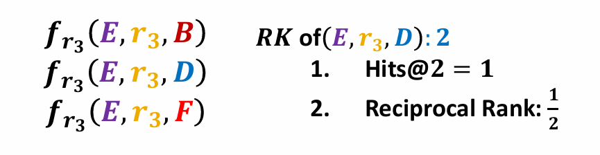


### Understanding RGCN(关系图卷积)

论文：[Modeling Relational Data with Graph Convolutional Networks](https://arxiv.org/abs/1703.06103)


