# 🛣[Deep Learning]Stanford CS224w:Machine Learning with Graphs
---

!!! info "想说的话🎇"
    
    
    🔝课程网站：http://web.stanford.edu/class/cs224w/
    
    👀一些资源: 
    B站精讲：https://www.bilibili.com/video/BV1pR4y1S7GA/?spm_id_from=333.337.search-card.all.click&vd_source=280e4970f2995a05fdeab972a42bfdd0
    
    https://github.com/TommyZihao/zihao_course/tree/main/CS224W
    
    Slides: http://web.stanford.edu/class/cs224w/slides
    
    

###  Heterogeneous graphs(异构图)

> 异质图(heterogeneous graph，也称异构图)，又被称为异质信息网络(heterogeneous information network，也称异构信息网络)。区别于同质图(homogeneous graph)，它是一种具有多种节点类型或多种边类型的图数据结构( graphs with multiple nodes or edge types)，用于刻画复杂异质对象及其交互，具有丰富的语义信息，为图数据挖掘提供了一种有效的建模工具和分析方法。同时，异质图数据也是一种广泛存在的数据类型，例如知识图谱，社交网络数据。

- Relational GCNs

- Heterogeneous Graph Transformer

- Design space for heterogeneous GNNs

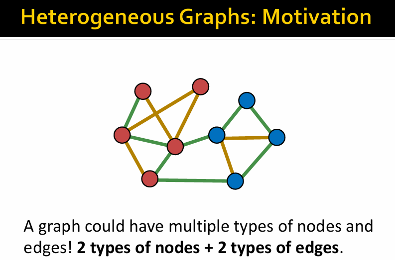

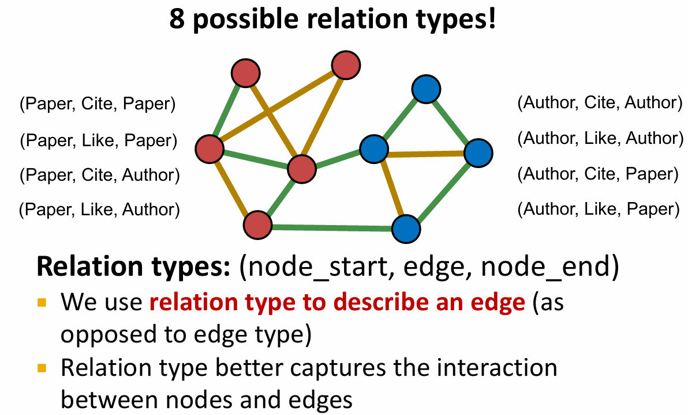

A heterogeneous graph can be defined as :

$$
\mathbf{G} = \{\mathbf{V}, \mathbf{E}, \tau,\phi \}
$$

- Node with node types: $v \in \mathbf{V}$

- Node types for node: $v:\tau (v)$

- Edge with edge types: $(u,v) \in \mathbf{E}$

- Edge types: $(u,v): \phi (u,v)$

heterogeneous graph's relation type for edge $e$ is a tuple:$r(u,v) = (\tau(u,v), \phi(u,v), \tau(v))$

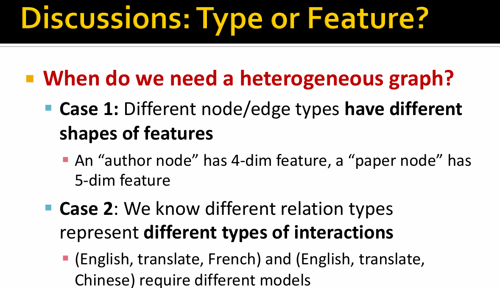

### Relation GCN(RGCN)

> How do we extend GCNmodel to handle heterogeneous graphs?

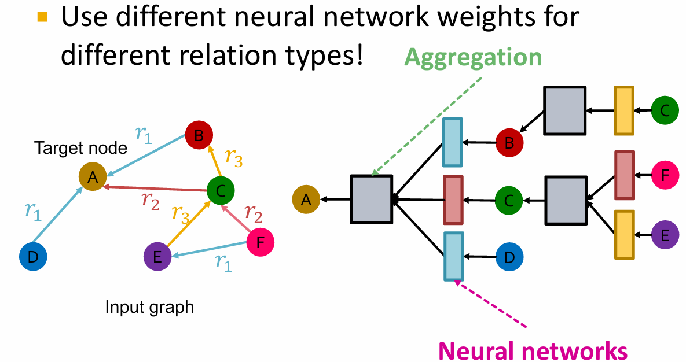

$$
h^{(l+1)}_v = \sigma( \sum_{r \in R} \sum_{u \in N^r_v} \frac{1}{c^{r}_{v}} W_r^{(l)} h^{(l)}_u + W_0^{(l)} h^{(l)}_v )
$$

- $c^{r}_{v}$ is the number of relations of $v$, for normalization.

- Each neighbor of a given relation:

$$
m_{u,r}^{(l)} = \frac{1}{c_{v,r}} W_r^{(l)} h^{(l)}_u
$$

- Self-loop

$$
m_{v}^{(l)} = W_0^{(l)} h^{(l)}_v
$$

- Aggregation:

$$
h^{(l+1)}_v = \sigma(Sum(\{{m_{u,r}^{(l)} ， u \in N^r_v}\}) ∪ \{m_{v}^{(l)}\})
$$

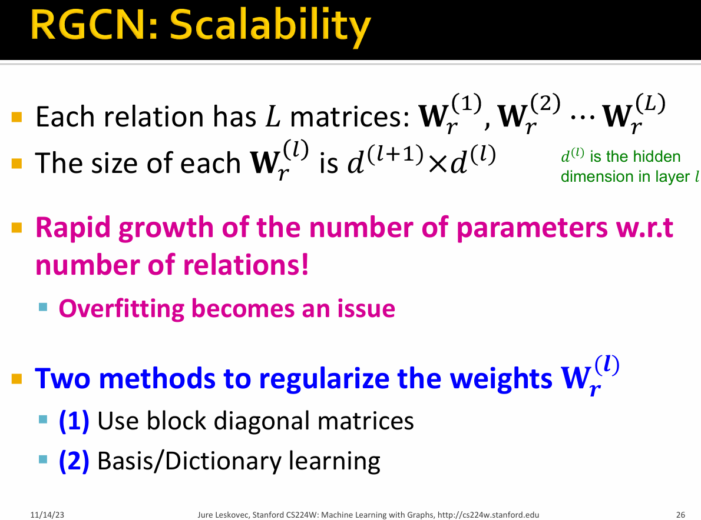

### Block Diagonal Matrix（分块对角矩阵）

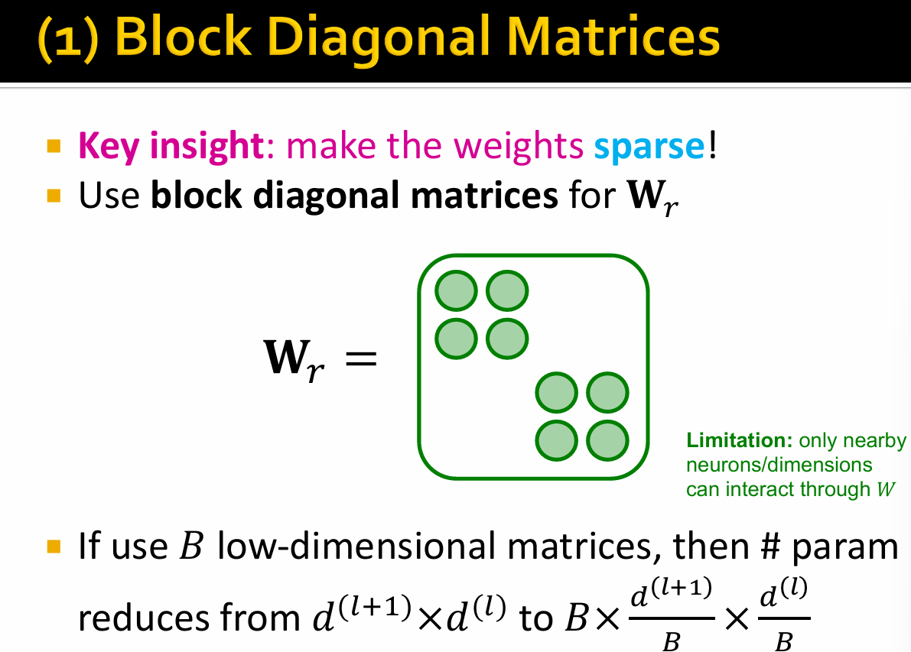

### Basis Learning

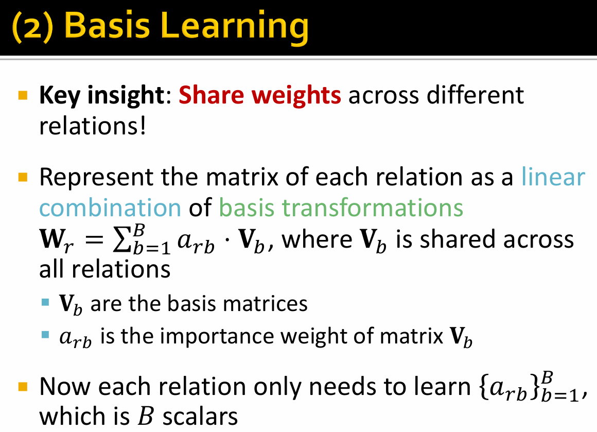

### RGCN for Link Prediction

Firstly, assume $(E, r_3, A)$ is training supervision edge, all the other edges are training message edges

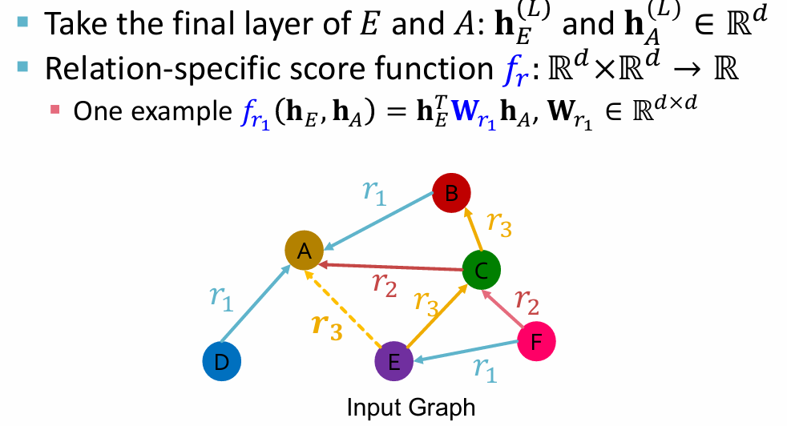

- Use RGCN to score the training supervision edge $(E, r_3, A)$

- Create a negative edge by perturbing the supervision edge , e.g. $(E, r_3, B)$, $(E, r_3, D)$

> Note that negative edges should not belong to training message edges or training supervision edges.

- Use GNN model to score negative edge

- Optimize a standatd CrossEntropy loss 

1. Maximize the score of training supervision edge

2. Minimize the score of negative edges

$$
\mathcal{l} = -log \sigma (f_{r3} (h_E,h_A)) - log (1-\sigma(f_{r3} (h_E-h_B)))
$$

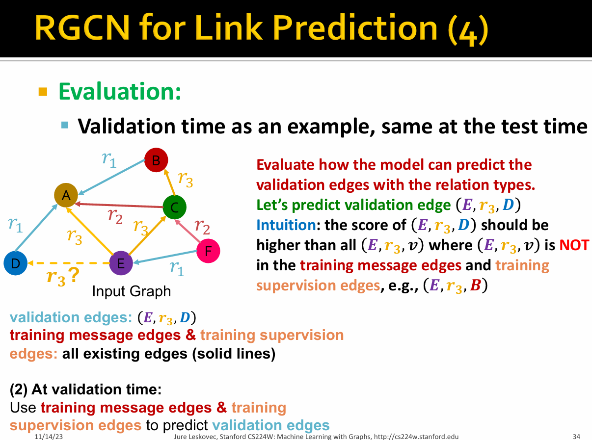

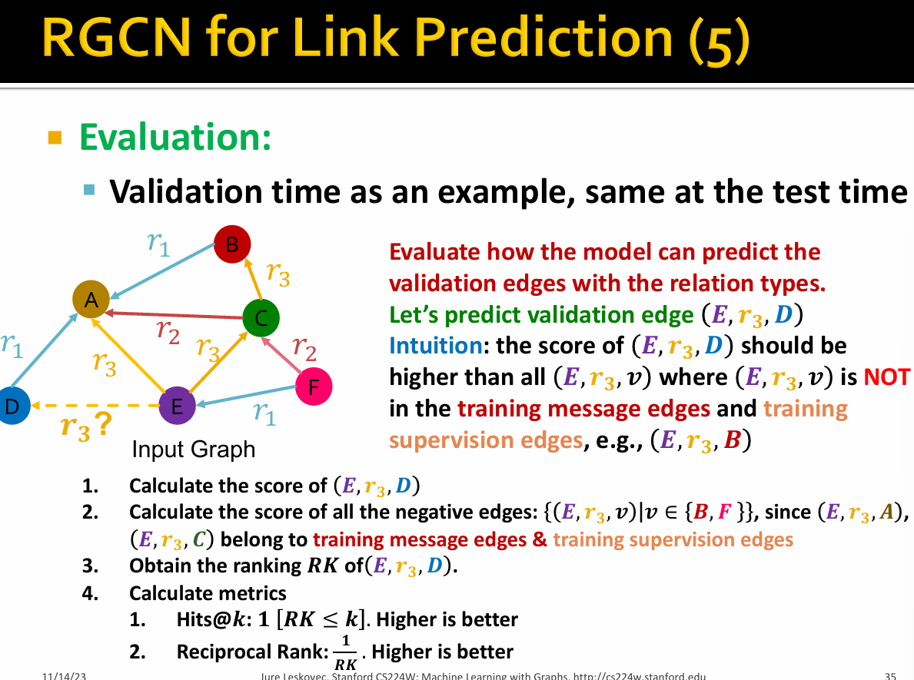

> Hits@k:一个评估信息检索系统性能的指标，常用于推荐系统、搜索引擎和图神经网络（GNN）等场景.对于给定的预测列表，如果真实的元素出现在列表的前 k 个位置中，则认为是一个成功的预测（Hit）。Hits@k 指标计算的是所有成功的预测占总预测次数的比例。

> Reciprocal Rank (RR):一个衡量信息检索系统性能的指标，它特别关注最相关结果的排名。在推荐系统、搜索引擎、图神经网络等领域中，这个指标用来评估模型预测的准确性和相关性。在给定的查询中，取最相关结果的排名的倒数。如果最相关的结果排名越靠前，其倒数（即 Reciprocal Rank）就越大，表示系统的性能越好。

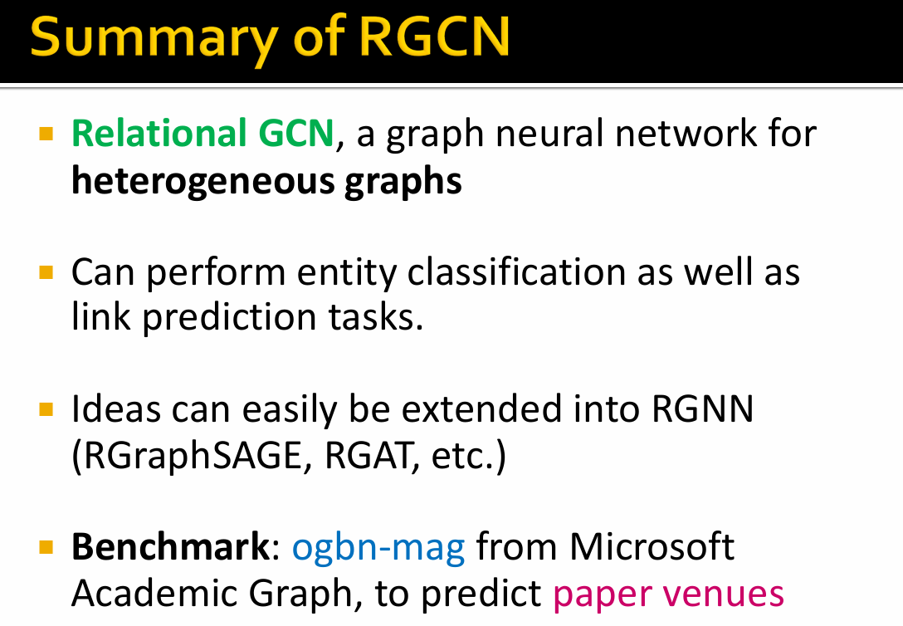

### Understanding RGCN(paper)

阅读地址：[Modeling Relational Data with Graph Convolutional Networks](https://arxiv.org/abs/1703.06103)

假设有向标记图$G=(V,\epsilon,R)$，其中节点$v_i \in V$，有标签的边为$(v_i,r,v_j) \in \epsilon$，关系类型$r \in R$.

本文最初的动机是将本地图邻域上运行的GCN扩展到大规模关系数据。这些及相关方法(如GNN)可以理解为一个简单的可微消息传递框架的特殊情况：

$$
h_i^{(l+1)} = \sigma \Big( \sum_{m \in \mathcal{M}_i} g_m (h_i^{(l)}, h_j^{(l)}) \Big)
$$

