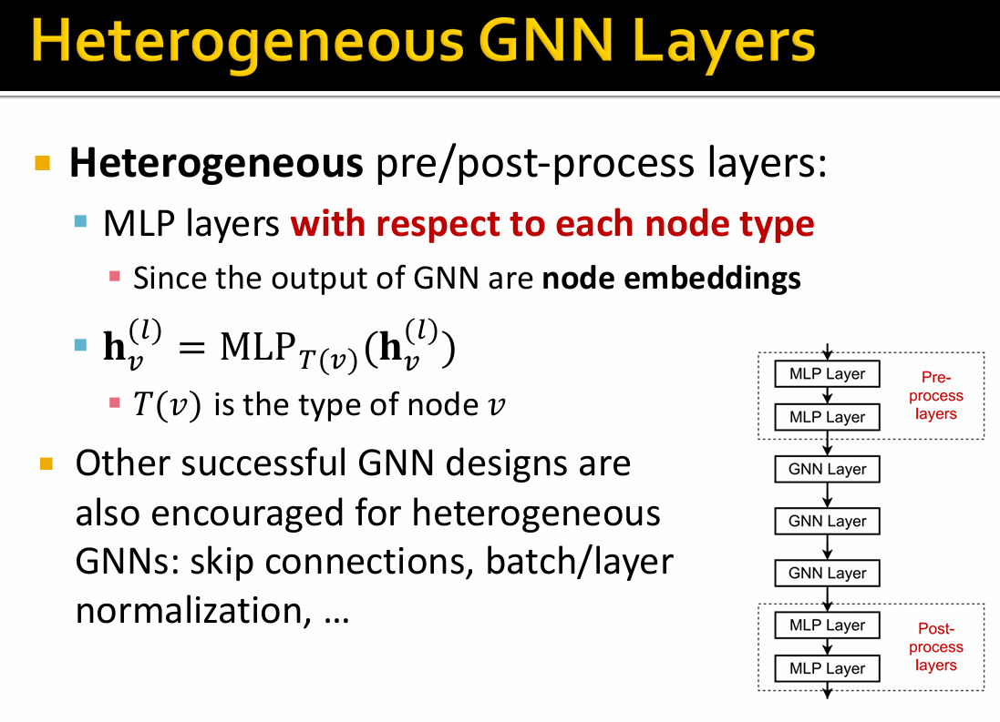
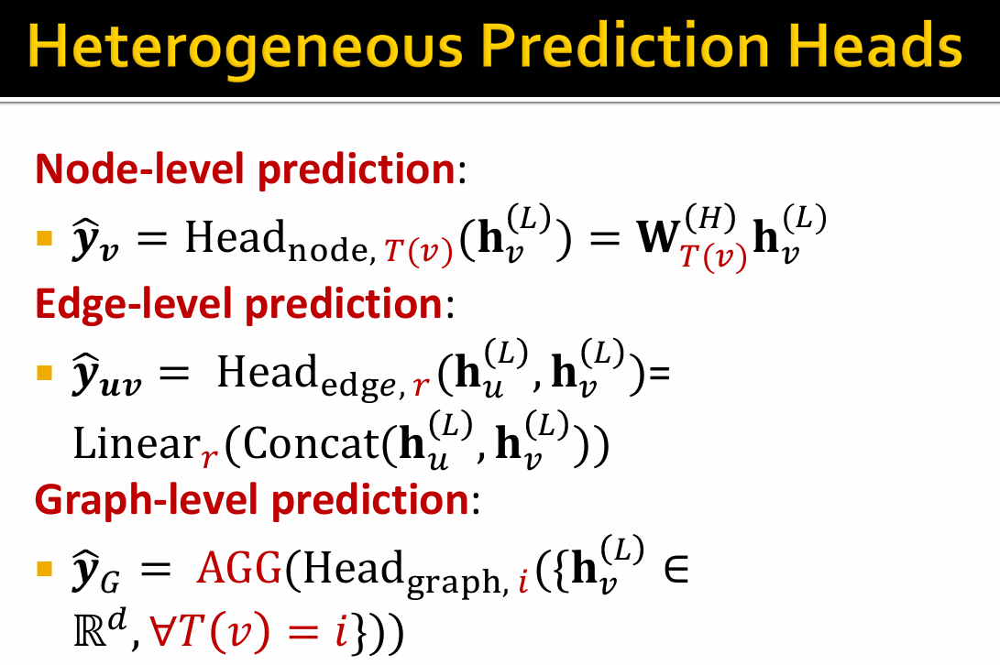

# 🛣[Deep Learning]Stanford CS224w:Machine Learning with Graphs
---

!!! info "想说的话🎇"
    
    
    🔝课程网站：http://web.stanford.edu/class/cs224w/
    
    👀一些资源: 
    B站精讲：https://www.bilibili.com/video/BV1pR4y1S7GA/?spm_id_from=333.337.search-card.all.click&vd_source=280e4970f2995a05fdeab972a42bfdd0
    
    https://github.com/TommyZihao/zihao_course/tree/main/CS224W
    
    Slides: http://web.stanford.edu/class/cs224w/slides
    
    

## Heterogeneous Graphs Transformer(HGT)

Innovation: Decompose heterogeneous graph to <B>Node-type and edge-type dependent attention mechanism</B>

$$
\begin{aligned}
AttenHead^i (s,e,t) =& (K^i(s) W^{ATT}_{\phi(e)} Q^i(t)^T) \\
K^i(s) = KLinear^i_{\tau(s)} &(H^{(l-1)[s]}) \\
Q^i(t) = QLinear^i_{\tau(t)} &(H^{(l-1)[t]}) \\
\end{aligned}
$$

Each relation $(Type(s), Relation(e), Type(t))$ has a distinct set of projection weights

### Understanding Heterogeneous Graph Transformer

阅读地址：[Understanding Heterogeneous Graph Transformer](https://arxiv.org/abs/2003.01332)

## Design space of Herterogeneous GraphNNs

Observation: Each node could receive <B>multiple types of messages</B> from its neighbors, and multiple neighbors may belong to each message type.

$$
h_v^{(l)} = AGG^{(l)}_{all} (AGG^{(l)}_r (\{ \mathbf{m}^{(l)}_u, u \in N_r(v)\}) )
$$

> Within each message type, aggregate the messages that belongs to the edge type with $AGG^{(l)}_r$. Aggregate across the edge types with $AGG^{(l)}_{all}$

