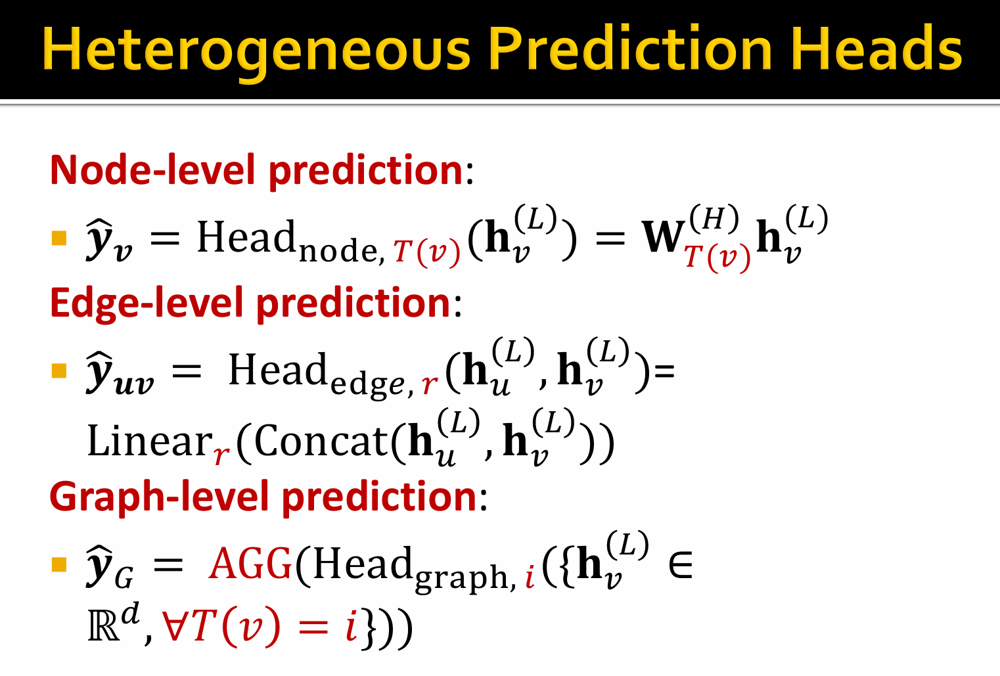
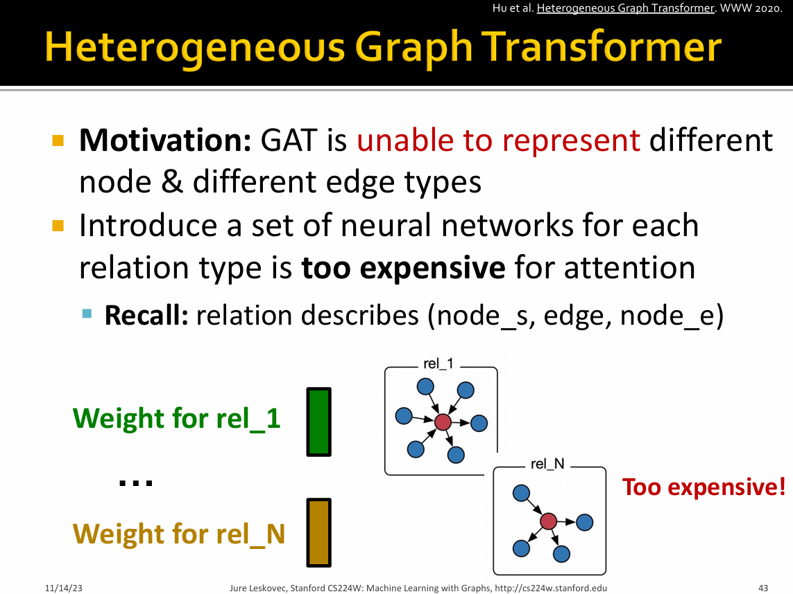
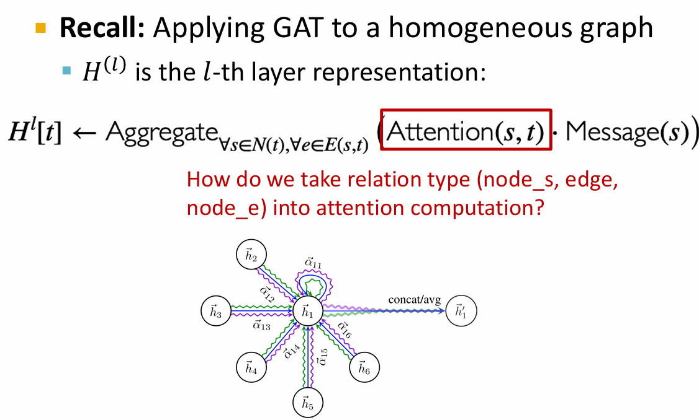
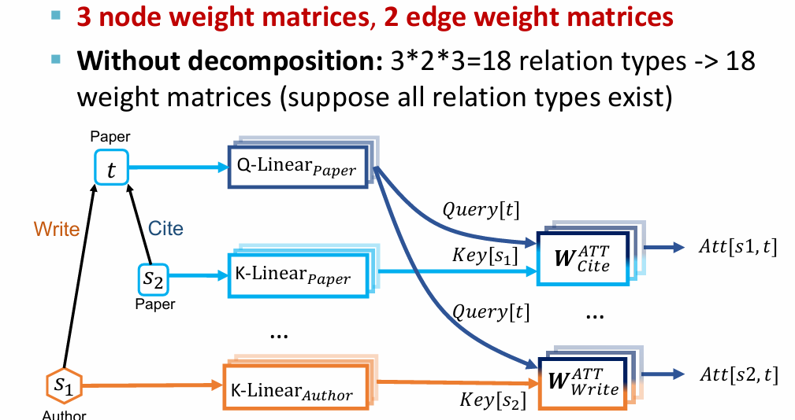
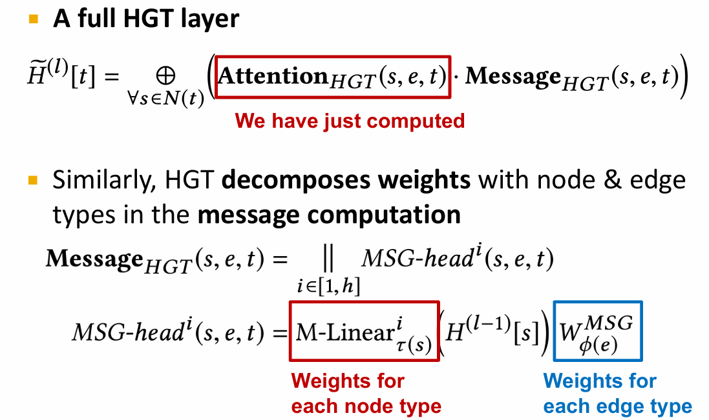
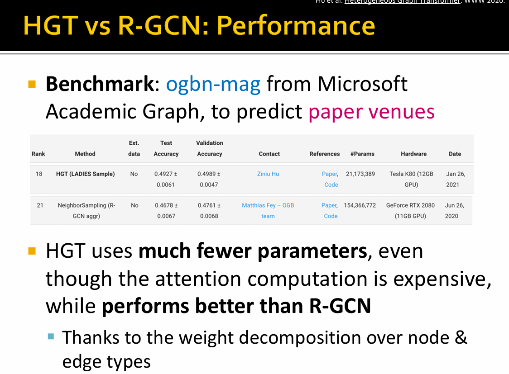
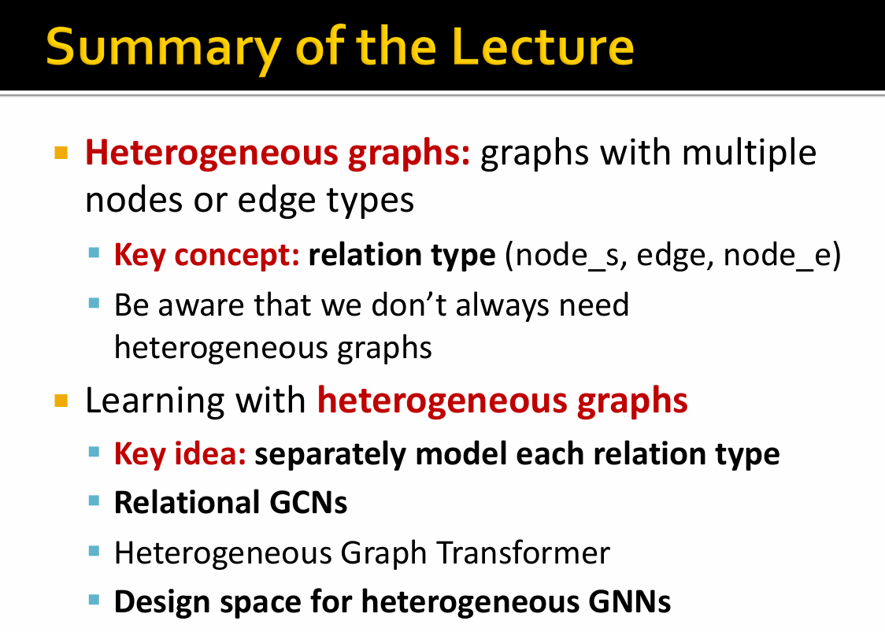
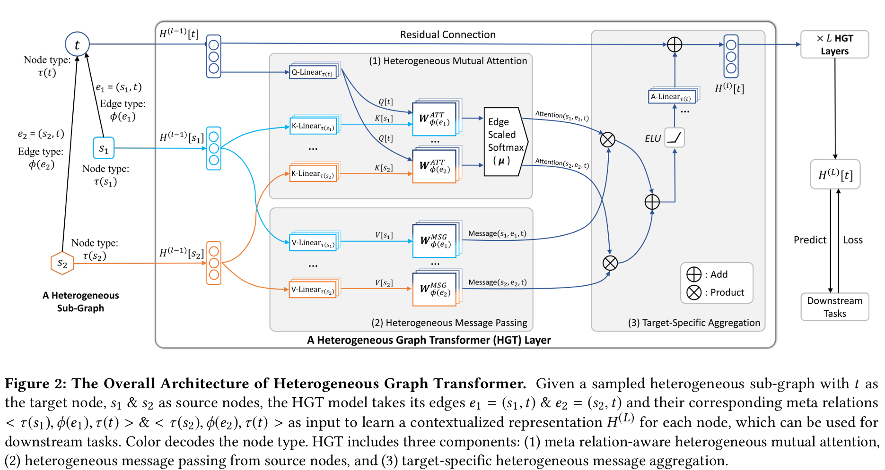
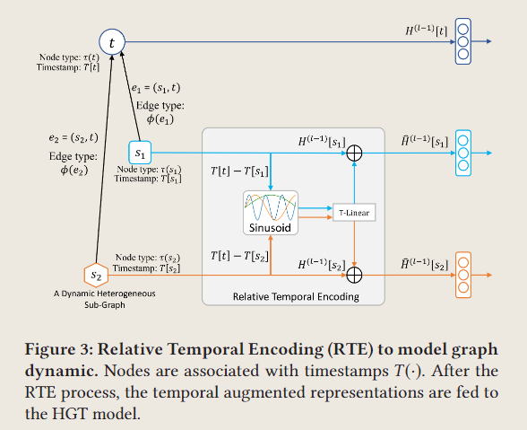

# 🛣[Deep Learning]Stanford CS224w:Machine Learning with Graphs
---
<script src="https://polyfill.io/v3/polyfill.min.js?features=es6"></script>
<script src="https://cdn.jsdelivr.net/npm/mathjax@3/es5/tex-chtml.js"></script>

!!! info "想说的话🎇"
    <font size = 3.5>
    
    🔝课程网站：http://web.stanford.edu/class/cs224w/
    
    👀一些资源: 
    B站精讲：https://www.bilibili.com/video/BV1pR4y1S7GA/?spm_id_from=333.337.search-card.all.click&vd_source=280e4970f2995a05fdeab972a42bfdd0
    
    https://github.com/TommyZihao/zihao_course/tree/main/CS224W
    
    Slides: http://web.stanford.edu/class/cs224w/slides
    
    </font>

<B>Heterogeneous Message</B>
---

Message function： $\mathbf{m}_u^{(l)} = MSG_r^{(l)} (\mathbf{h}_u^{(l-1)}), \ r=(u,e,v)$

Observation: A node could receive multiple types of messages. <B>Num of message type = Num of relation type. </B>

$r=(u,e,v)$ is the  relation type between node $u$ that sends the message, edge type $e$ , and node $v$ that receive the message.

<B>Heterogeneous Aggregation</B>
---

Observation: Each node could receive multiple types of messages from its neighbors, and multiple neighbors may belong to each message type.

$$
h_v^{(l)} = AGG^{(l)}_{all} \Big( AGG^{(l)}_r (\{ \mathbf{m}^{(l)}_u, u \in N_r(v)\}) \Big)
$$

- $AGG^{(l)}_r$：aggregate the messages that belongs to the relation type

- $AGG^{(l)}_{all}$：aggregate across the edge types




## Heterogeneous Graphs Transformer(HGT)





Innovation: Decompose heterogeneous graph to <B>Node-type and edge-type dependent attention mechanism</B>



$$
\begin{aligned}
AttenHead^i (s,e,t) =& (K^i(s) W^{Att}_{\phi(e)} Q^i(t)^T) \\
K^i(s) = KLinear^i_{\tau(s)} &(H^{(l-1)[s]}) \\
Q^i(t) = QLinear^i_{\tau(t)} &(H^{(l-1)[t]}) \\
\end{aligned}
$$

Each relation $(Type(s), Relation(e), Type(t))$ has a distinct set of projection weights







### Understanding Heterogeneous Graph Transformer

阅读地址：[Heterogeneous Graph Transformer](https://arxiv.org/abs/2003.01332)



回顾GAT，其假设所有的节点拥有相同的特征分布（使用了同一个权重矩阵$W$），但对于异质图来说，不同类型的节点拥有不同的特征分布，因此需要为不同类型的节点使用不同的权重矩阵$W$。

因此，该论文设计了```Heterogeneous Mutual Attention```机制。设定一个目标节点$t$，以及其属于不同分布的所有邻居$s \in N(t)$，我们希望根据节点之间的元关系来计算相互注意力$(\tau(s), \phi(e), \tau(t))$三元组。

$$
\begin{aligned}
\text{Attention}_{HGT} (s,e,t)&= Softmax_{\forall s \in N(t)} \Big( ||_{i\in [1,h]} \text{Att-head}^i (s,e,t) \Big) \\
\text{Att-head}^i (s,e,t) &= (K^i(s) W^{Att}_{\phi(e)} Q^i(t)^T) \cdot \frac{\mu_{<\tau(s), \phi(e), \tau(t)>}}{\sqrt{d}} \\
K^i(s) &= \text{K-Linear}^i_{\tau(s)} &(H^{(l-1)[s]}) \\
Q^i(t) &= \text{Q-Linear}^i_{\tau(t)} &(H^{(l-1)[t]}) \\
\end{aligned}
$$

对于第i个注意力头$\text{Att-head}^i (s,e,t)$，我们使用线性投影$\text{K-Linear}_{\tau(s)}^i$将$\tau(s)$类型的源节点$s$投影到$i$-th $Key$向量$K^i(s)$：$\mathbb{R}^d \rightarrow \mathbb{R}^{\frac{d}{h}}$，其中$h$是注意力头的数量，$\frac{d}{h}$是每个头的向量表示。

> 每种类型$\tau(s)$的节点都有一个唯一的线性投影$\text{Linear}_{\tau(s)}^i$来最大限度地建模分布差异。

异构图的一个独特特征是节点类型对之间可能存在不同的边关系，因此我们为每个边类型$\phi(e)$定义一个投影矩阵$W^{Att}_{\phi(e)} \in \mathbb{R}^{\frac{d}{h} \times \frac{d}{h}}$，

并且，由于并非所有的关系连接对目标节点的贡献相同，因此我们添加一个先验张量（prior tensor）$\mu \in \mathbb{R}^{|\mathcal{A}| \times |\mathcal{R}| \times |\mathcal{A}|}$，来表示每个元关系三元组的一般意义，作为对注意力的自适应缩放。

最后，我们将$h$个注意力头连接在一起以获得每个节点对的注意力向量。对于每个目标节点$t$，我们从其邻居$N (t)$中收集所有注意力向量并进行softmax，有$\sum_{\forall s \in N(t)} \text{Attention}_{HGT} (s,e,t) = \mathbf{1}_{h \times 1}$

$$
\text{Message}_{HGT} (s,e,t) = ||_{i\in [1,h]} \text{MSG-head}^i (s,e,t) \\ \text{MSG-head}^i (s,e,t) = \text{M-Linear}^i_{\tau(t)} (H^{(l-1)}[s]) W^{MSG}_{\phi(e)}
$$

其中$\text{M-Linear}^i_{\tau(t)}: \ \mathbb{R}^d \rightarrow \mathbb{R}^{\frac{d}{h}}$是目标节点$t$的线性投影，$W^{MSG}_{\phi(e)} \in \mathbb{R}^{\frac{d}{h} \times \frac{d}{h}}$是边类型$\phi(e)$的投影矩阵。最后连接所有$h$个消息头以获得每个节点对的消息$\text{Message}_{HGT}(s, e, t)$。

$$
\tilde{H}^{(l)}[t] = \mathop{\oplus}\limits_{\forall s \in N(t)} (\text{Attention}_{HGT} (s,e,t) \cdot \text{Message}_{HGT} (s,e,t))
$$

这将信息聚合到来自不同特征分布的所有邻居（源节点）的目标节点$t$。

$$
H^{(l)}[t] = \text{A-Linear}_{\tau(t)} (\sigma(\tilde{H}^{(l)}[t])) + H^{(l-1)}[t]
$$

<B>Relative Temporal Encoding</B>



本文提出了相对时间编码 (RTE) 机制来模拟异构图中的动态依赖关系。RTE受到 Transformer的位置编码方法的启发。给定一个源节点$s$和一个目标节点$t$，以及响应的时间戳$T(s)$和$T(t)$，我们将相对时间间隔$\Delta T(t,s) = T(t) - T(s)$表示为获得相对时间编码$\text{RTE}(\Delta T(t,s))$的索引。

$$
\begin{aligned}
Base (\Delta T(t,s), 2i) &= \sin{(\Delta T(t,s) / 10000^{2i/d})} \\
Base (\Delta T(t,s), 2i+1) &= \cos{(\Delta T(t,s) / 1 0000^{(2i+1)/d})} \\
RTE(\Delta T(t,s)) &= \text{T-Linear} (Base(\Delta T_{t,s})) \\
\end{aligned}
$$

最后，将相对于目标节点 t 的时间编码添加到源节点 s 的表示中:

$$
\tilde{H}^{(l-1)}[t] = H^{(l-1)}[t] + RTE(\Delta T(t,s))
$$

