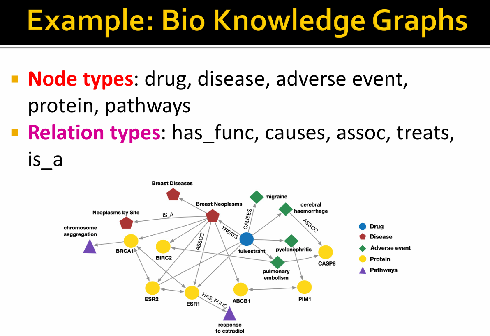
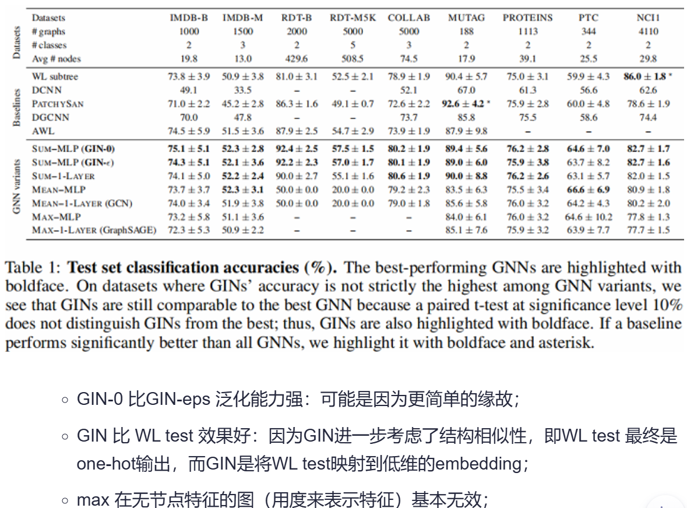
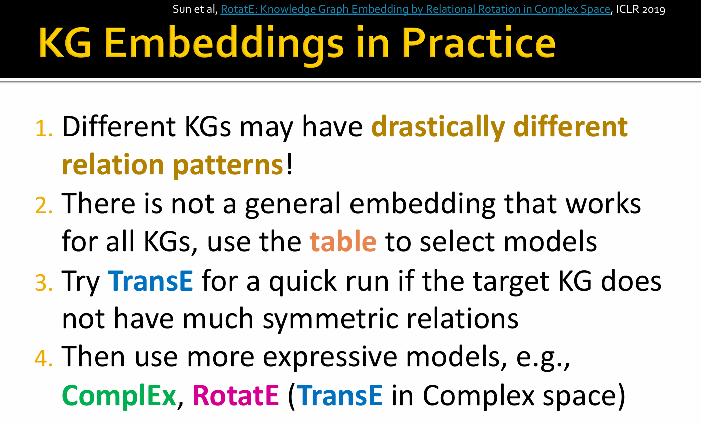

# 🛣[Deep Learning]Stanford CS224w:Machine Learning with Graphs
---

!!! info "想说的话🎇"
    
    
    🔝课程网站：http://web.stanford.edu/class/cs224w/
    
    👀一些资源: 
    B站精讲：https://www.bilibili.com/video/BV1pR4y1S7GA/?spm_id_from=333.337.search-card.all.click&vd_source=280e4970f2995a05fdeab972a42bfdd0
    
    https://github.com/TommyZihao/zihao_course/tree/main/CS224W
    
    Slides: http://web.stanford.edu/class/cs224w/slides
    
    

### Knowledge Graphs

###

### TransE

For a triple $(h,r,t)$,let $h,r,t \in \mathbb{R}^d$ be embedding vectors.

<B>TransE</B>: $h + r ≈ t$ if the given link exists else $h + r ≠ t$.

Entity scoring func:

$$
f_r(h,t) =  -|| h + r - t ||
$$

> 对比损失(Contrastive loss)：对有效的三元组支持较低的距离（或较高的分数），对损坏的三元组则支持较高的距离（或者较低的分数）

### Connectivity Patterns in KG

- Symmetry:  If the edge $(h,"Roommate",t)$ exists in KG, then the edge $(t,"Roommate",h)$ should also exist.

- Inverse relation :  If the edge $(h,"Advisor",t)$ exists in KG, then the edge $(t, "Advisee",h)$ should also exist.

> Are TransE expressive enough to capture these patterns?

.png)
.png)
.png)
.png)

### TransR

> TransE models translation of any relation in the same embedding space.

<B>TransR</B>: model entities as vectors in the entity space $\mathbb{R}^d$ and model each relation as vector in relation space $\mathbf{r} \in \mathbb{R}^{k}$ with $\mathbf{M}_r \in \mathbb{R}^{k \times d}$ as the projection matrix.

$h_{k} = M_r h, t_k=M_r t$

scoring func:
$$ 
f_r(h,t) = -|| h_k + r - t_k ||
$$

.png)
.png)
.png)
.png)

- DistMult

Entities and relations are vectros in $\mathbb{R}^k$

Score func:

$$
f_r(h,t)= \sum_i \mathbf{h}_i \cdot \mathbf{r}_i \cdot \mathbf{t}_i
$$

> Intuition of the score function: Can be viewed as a cosine similarity between $\mathbf{h} \cdot \mathbf{r}$ and $\mathbf{t}$

.png)

.png)

- ComplEx

model entities and relations as complex vectors in $\mathbb{C}^k$

Score func:

$$
f_r(h,t) = \text{Re}(\sum_i \mathbf{h}_i \cdot \mathbf{r}_i \cdot \bar{\mathbf{t}_i} )
$$

.png)

.png)

.png)

.png)

