# 🛣[Deep Learning]Stanford CS224w:Machine Learning with Graphs
---
<script src="https://polyfill.io/v3/polyfill.min.js?features=es6"></script>
<script src="https://cdn.jsdelivr.net/npm/mathjax@3/es5/tex-chtml.js"></script>

!!! info "想说的话🎇"
    <font size = 3.5>
    
    🔝课程网站：http://web.stanford.edu/class/cs224w/
    
    👀一些资源: 
    B站精讲：https://www.bilibili.com/video/BV1pR4y1S7GA/?spm_id_from=333.337.search-card.all.click&vd_source=280e4970f2995a05fdeab972a42bfdd0
    
    https://github.com/TommyZihao/zihao_course/tree/main/CS224W
    
    Slides: http://web.stanford.edu/class/cs224w/slides
    
    </font>

### Reasoning over KGs

Goal: How to perform multi-hop reasoning over KGs?

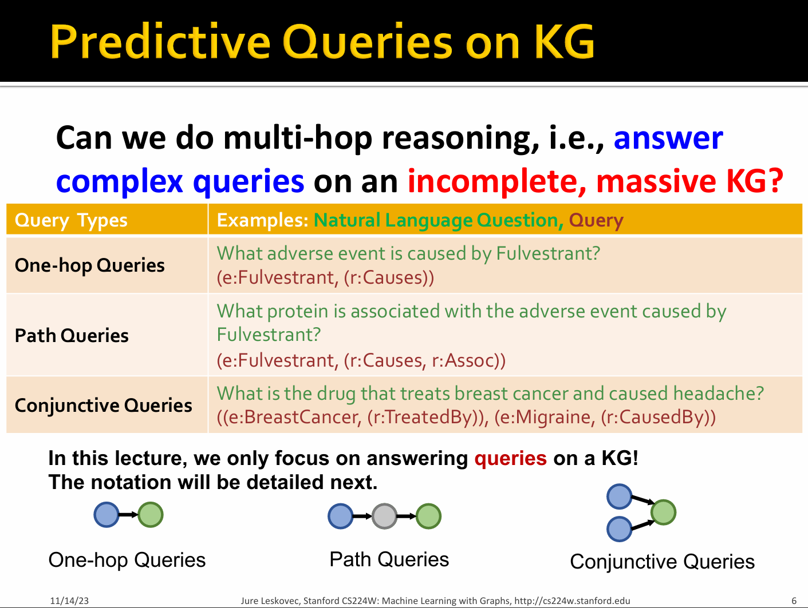

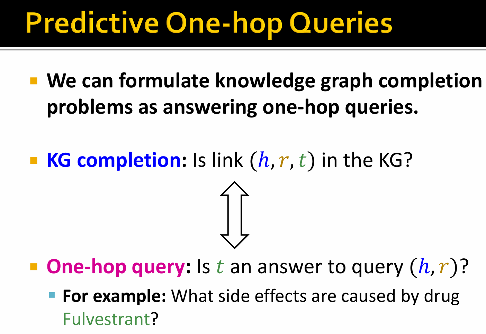

- Path Querise

An N-hop path query q can be represented by

$$
q = (v_a ,(r_1,...,r_n))
$$

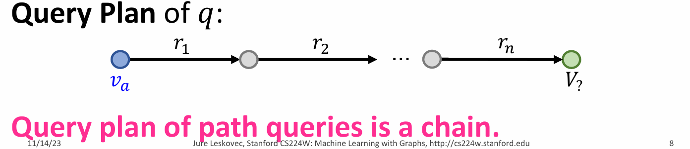

Question: What proteins are associated with adverse events caused by Fulvestrant?

- $v_a$ is : ```e:Fulvestrant```

- $(r_1,r_2)$ is ```(r:Causes, r:Assoc)```

- Query: ```(e:Fulvestrant,(r:Causes,r:Assoc))```

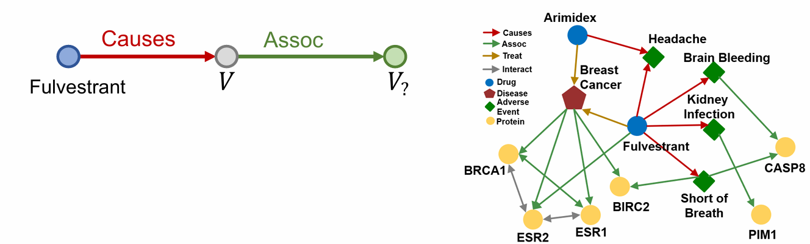

Because the completed(probabilistic) KGs is a dense graph, we need a way to answer path-based queries over an incomplete knowledge graph

Task: Predictive queries

- Want to be able to answer arbitrary queries while implicitly imputing for the missing information

Key Idea:Embed queries

- Generalize TransE to multi-hop reasoning.

- Query embedding: $q = h + r$

- Goal: query embedding $q$ should be close to the answer embedding $t$

$$
f_q(t) = -||q - t||
$$

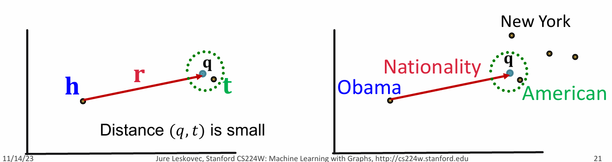

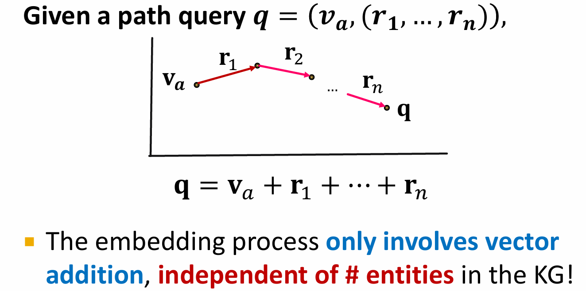

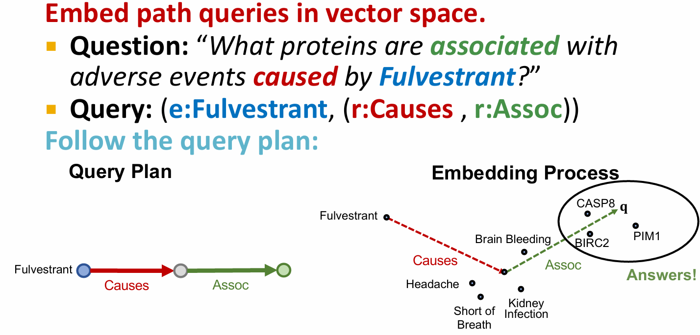

Since TransE can naturally handle compositional relations, it can handle path queries by translating in the latent space for multiple hops using addition of relation embeddings.(DistMult / ComplEx can't)

- Conjunctive Queries

Conjunctive Queries: What are drugs that cause Short of Breath and treat diseases associated with protein ESR2?
 
```(e:ESR2, (r:Assoc, r:TreatedBy)), (e:Short of Breath, (r:CausedBy))```

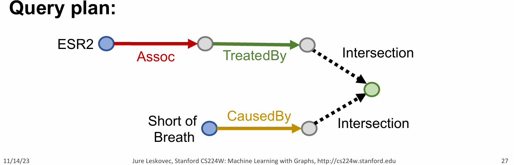

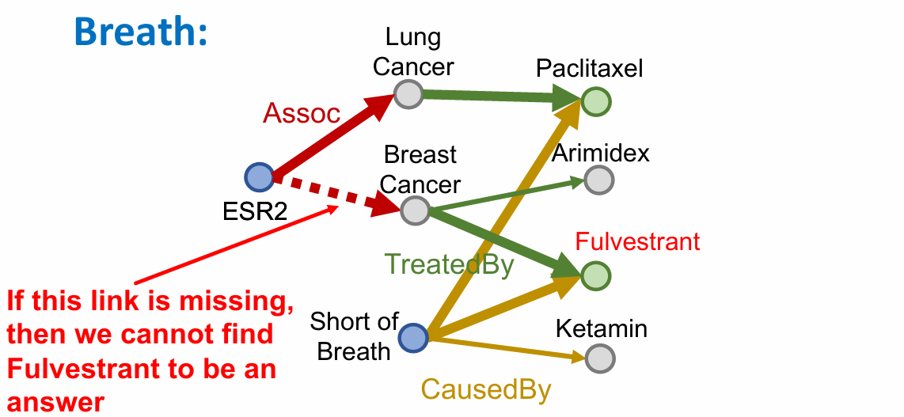

How can we use embeddings to implicitly impute the missing edges?

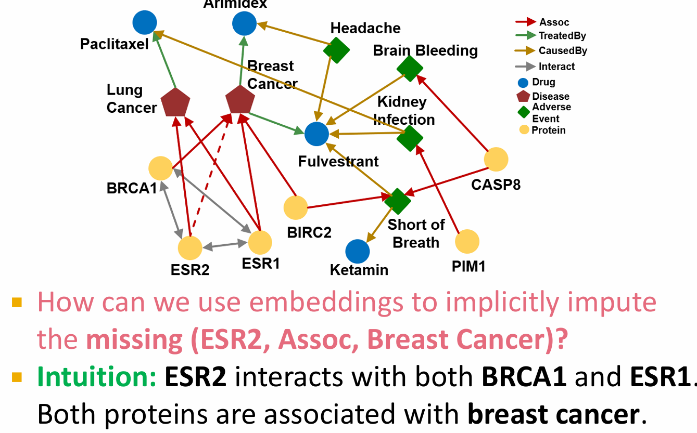

- Query2Box

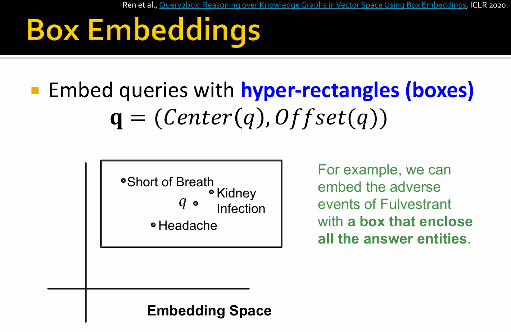

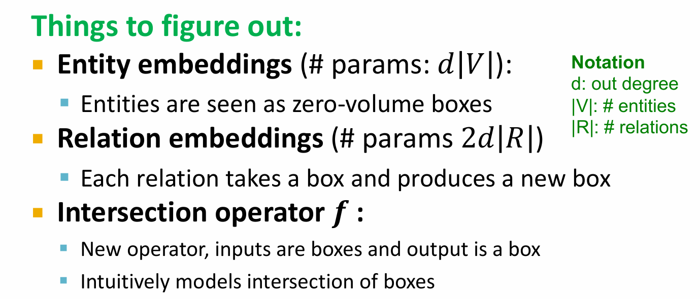

<B>Projection Operator $\mathcal{P}$</B>:

> Intuition:Take the current box as input and use the relation embedding to project and expand the box

$$
Cen(q') = Cen(q) + Cen(r)
$$

$$
Off(q') = Off(q) + Off(r)
$$

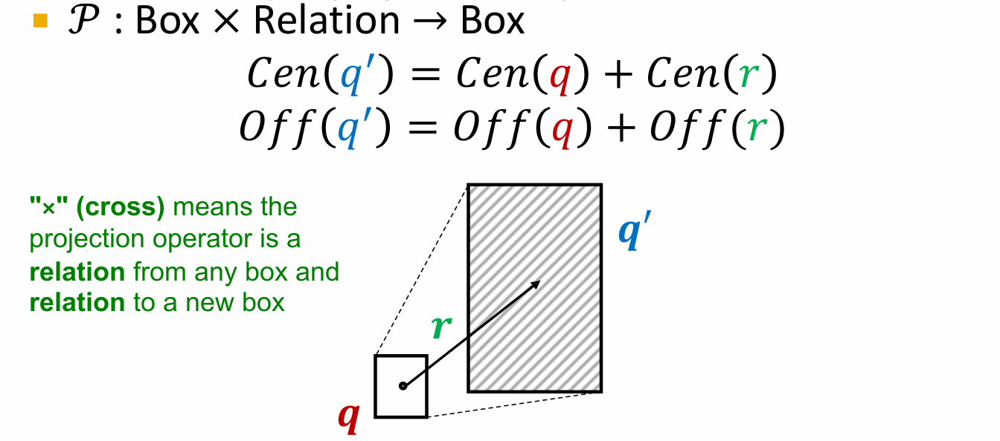

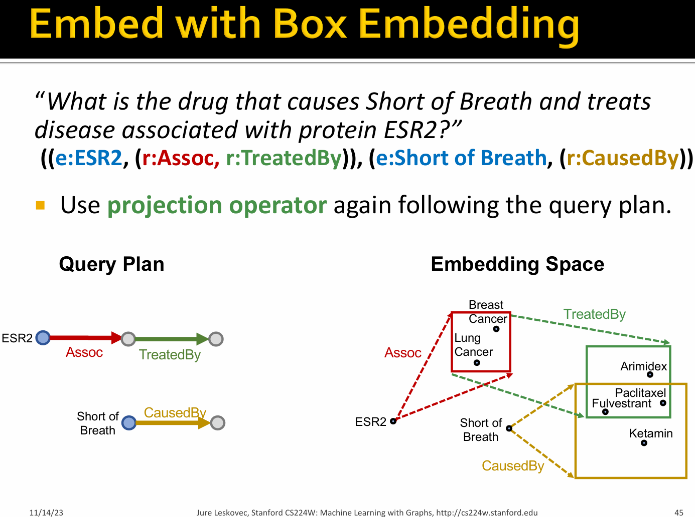

> How do we take intersection of boxes?

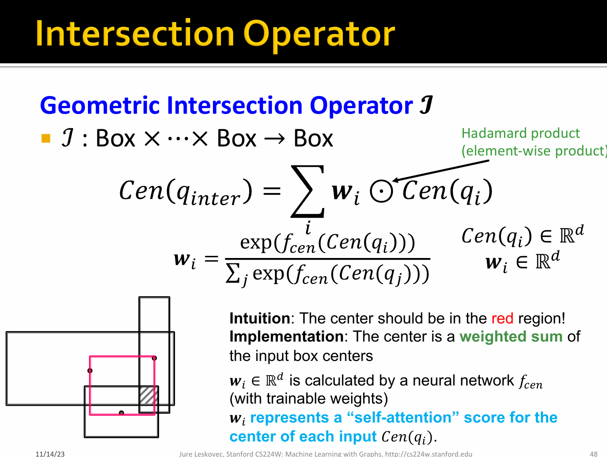

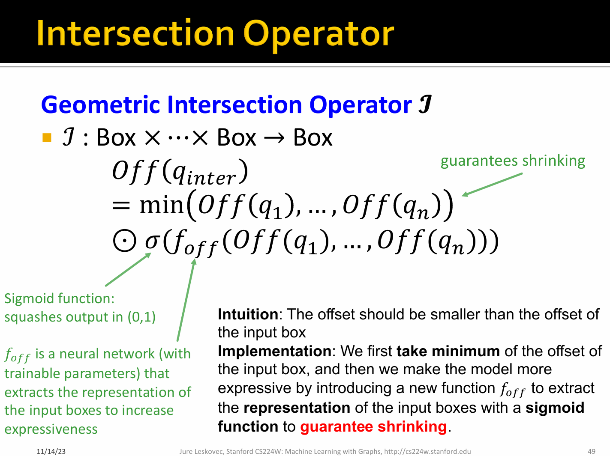