# 🛣[Deep Learning]Stanford CS224w:Machine Learning with Graphs
---
<script src="https://polyfill.io/v3/polyfill.min.js?features=es6"></script>
<script src="https://cdn.jsdelivr.net/npm/mathjax@3/es5/tex-chtml.js"></script>

!!! info "想说的话🎇"
    <font size = 3.5>
    
    🔝课程网站：http://web.stanford.edu/class/cs224w/
    
    👀一些资源: 
    B站精讲：https://www.bilibili.com/video/BV1pR4y1S7GA/?spm_id_from=333.337.search-card.all.click&vd_source=280e4970f2995a05fdeab972a42bfdd0
    
    https://github.com/TommyZihao/zihao_course/tree/main/CS224W
    
    Slides: http://web.stanford.edu/class/cs224w/slides
    
    </font>

### Reasoning over KGs

Goal: How to perform multi-hop reasoning over KGs?


- Path Querise

An N-hop path query q can be represented by

$$
q = (v_a ,(r_1,...,r_n))
$$


Question: What proteins are associated with adverse events caused by Fulvestrant?

- $v_a$ is : ```e:Fulvestrant```

- $(r_1,r_2)$ is ```(r:Causes, r:Assoc)```

- Query: ```(e:Fulvestrant,(r:Causes,r:Assoc))```


Because the completed(probabilistic) KGs is a dense graph, we need a way to answer path-based queries over an incomplete knowledge graph

Task: Predictive queries

- Want to be able to answer arbitrary queries while implicitly imputing for the missing information

Key Idea:Embed queries

- Generalize TransE to multi-hop reasoning.

- Query embedding: $q = h + r$

- Goal: query embedding $q$ should be close to the answer embedding $t$

$$
f_q(t) = -||q - t||
$$


Since TransE can naturally handle compositional relations, it can handle path queries by translating in the latent space for multiple hops using addition of relation embeddings.(DistMult / ComplEx can't)

- Conjunctive Queries

Conjunctive Queries: What are drugs that cause Short of Breath and treat diseases associated with protein ESR2?
 
```(e:ESR2, (r:Assoc, r:TreatedBy)), (e:Short of Breath, (r:CausedBy))```


How can we use embeddings to implicitly impute the missing edges?


- Query2Box


<B>Projection Operator $\mathcal{P}$</B>:

> Intuition:Take the current box as input and use the relation embedding to project and expand the box

$$
Cen(q') = Cen(q) + Cen(r)
$$

$$
Off(q') = Off(q) + Off(r)
$$


> How do we take intersection of boxes?


> How do we define the score function $f_q(v)$ (negative distance) ?

$$
d_{box}(\mathbf{q},\mathbf{v}) = d_{out}(\mathbf{q},\mathbf{v}) + \alpha \cdot d_{in}(\mathbf{q},\mathbf{v})
$$

where $0< \alpha <1$

> Intuition: if the point is enclosed in the box, the distance should be downweighted.

> $\alpha$让应该在box内部的点更加靠近box中心，增强鲁棒性。


$$
f_q(v) = -d_{box}(\mathbf{q},\mathbf{v})
$$

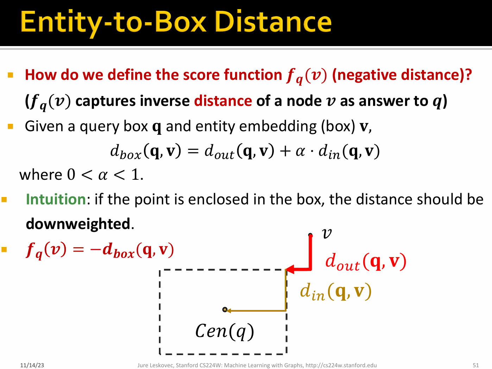

### AND-OR queries (union operation)

E.g.: What drug can treat breast cancer <B>or</B> lung cancer?

<B>AND-OR queries</B>: Conjunctive queries + disjunction, called 
Existential Positive First-order (EPFO) queries.

> 问题：在box的表示形式下，使用union操作的话，那么我们的嵌入空间维度会很大，节点越多维度越大。而在知识图谱中，节点非常多。

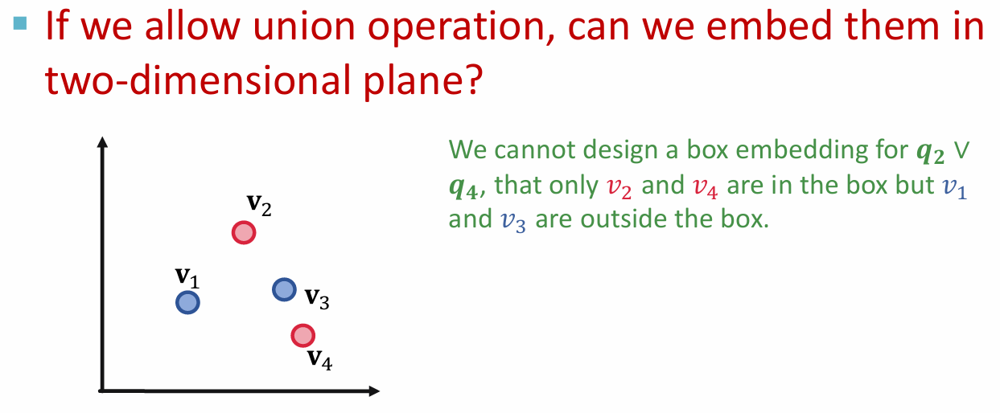

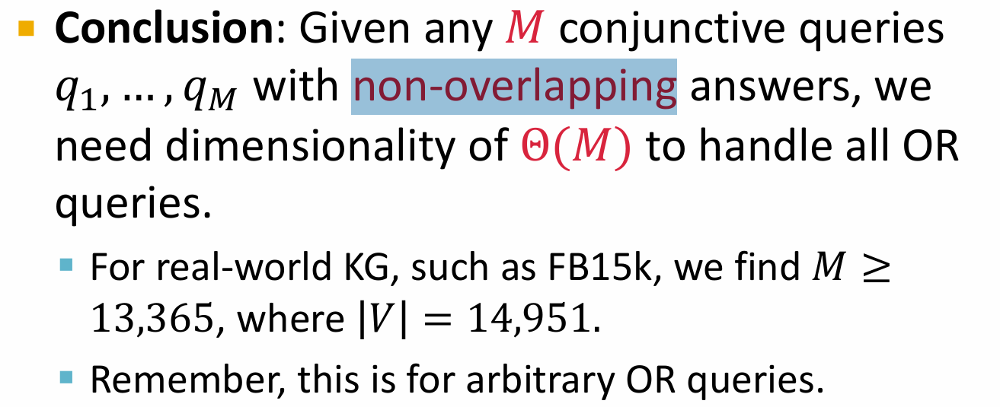

> 因此我们很难在低维空间中嵌入AND-OR查询

Key idea: take all unions out and only do union at the last step

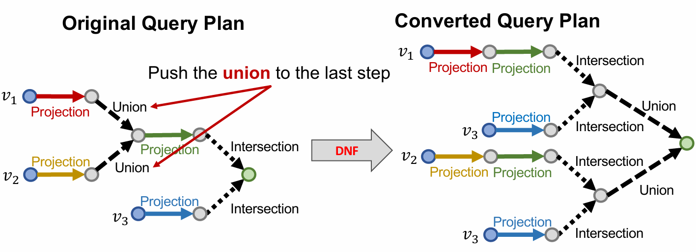

Logically, any AND-OR query can be expressed as a disjunction of conjunctive queries.

Distance between entity embedding and a DNF $q=q_1 \cup q_2 \cup... \cup q_m$ is defined as:

$$
d_{box}(\mathbf{q},\mathbf{v}) = \min( d_{box}(\mathbf{q_1},\mathbf{v}),..., d_{box}(\mathbf{q_m},\mathbf{v}))
$$

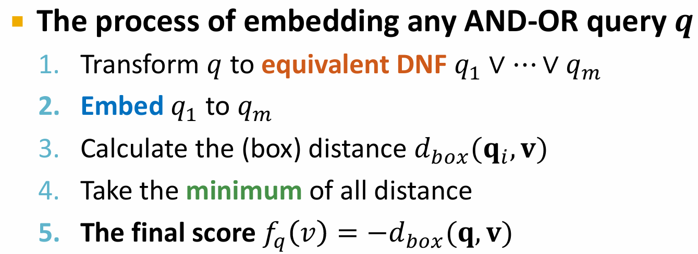

### Training Query2Box

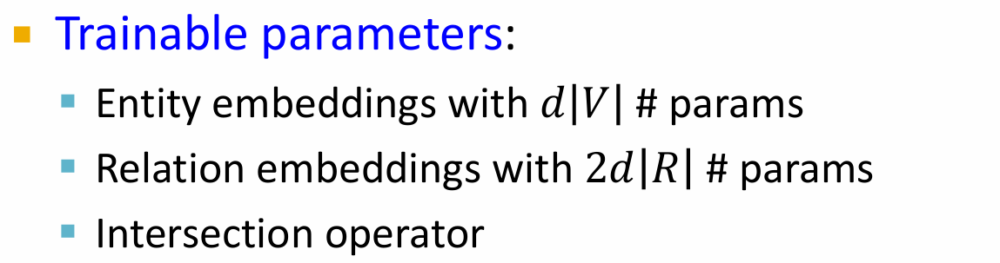

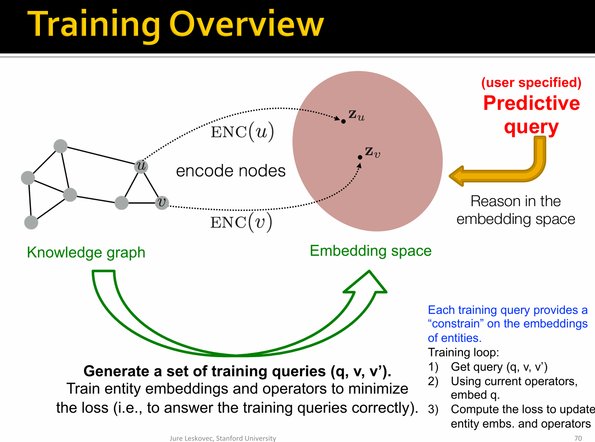

- Training:

1. Smaple a query $q$ from the training graph $G_{train}$, answer $v \in [q]_{G_{train}}$,and a negative sample $v' \notin [q]_{G_{train}}$

> Negative sample: Entity of same type as $v$ but not answer to $q$

2. Embed the query $\mathbf{q}$

3. Calculate the score $f_q(v)$ and $f_q(v')$.

4. Optimize the loss $\mathcal{l}$ to maximize $f_q(v)$ while minimize $f_q(v')$.

$$
\mathcal{l} = -log \sigma(f_q(v)) - log(1-\sigma(f_q(v'))) 
$$

### Query Template

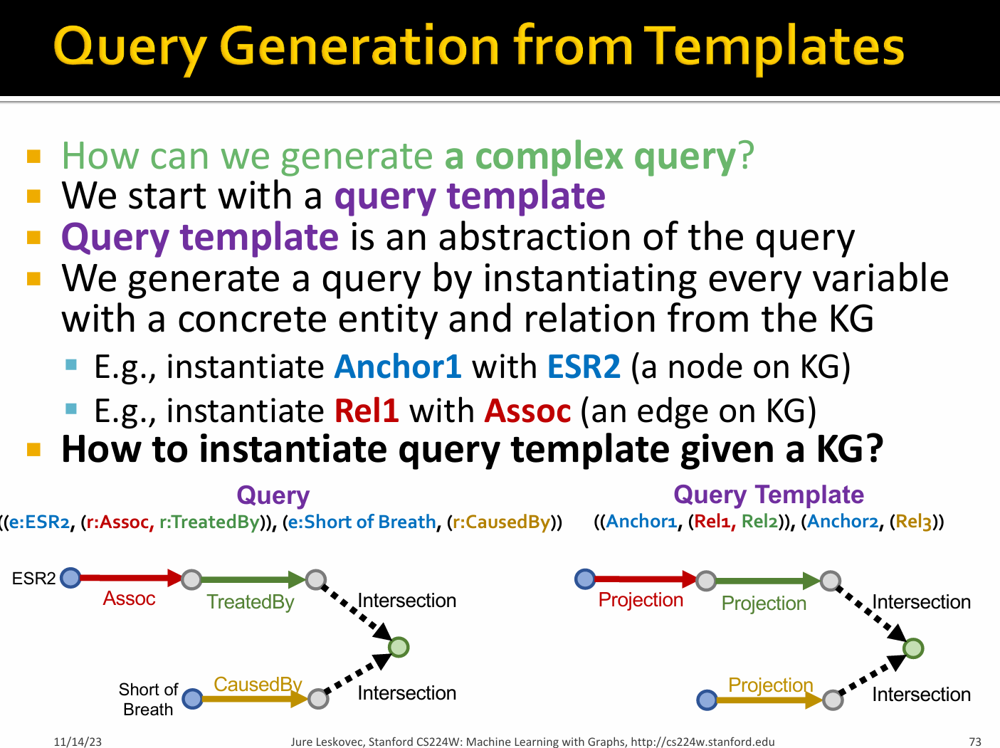

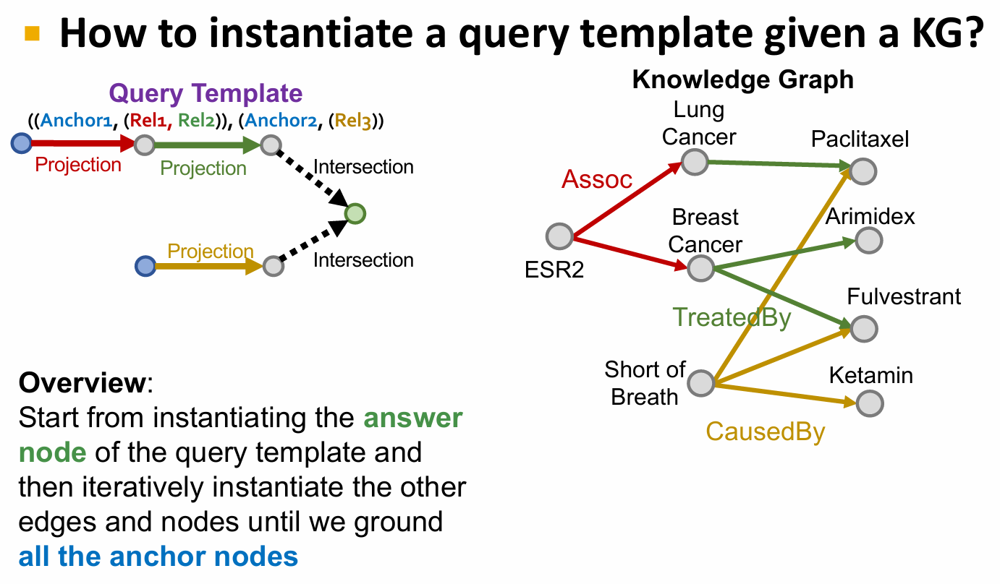

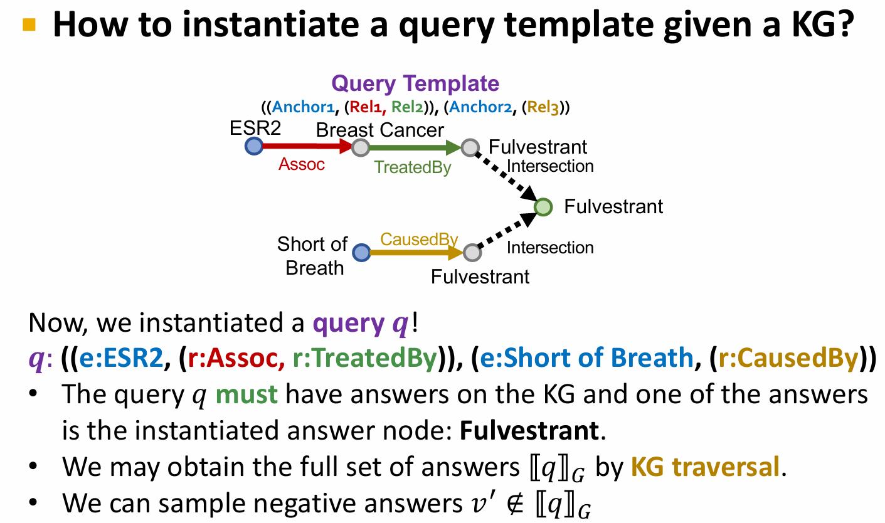

### A Simple Example

We use t-SNE to reduce the dimension of the embedding space to 2D for visualization.

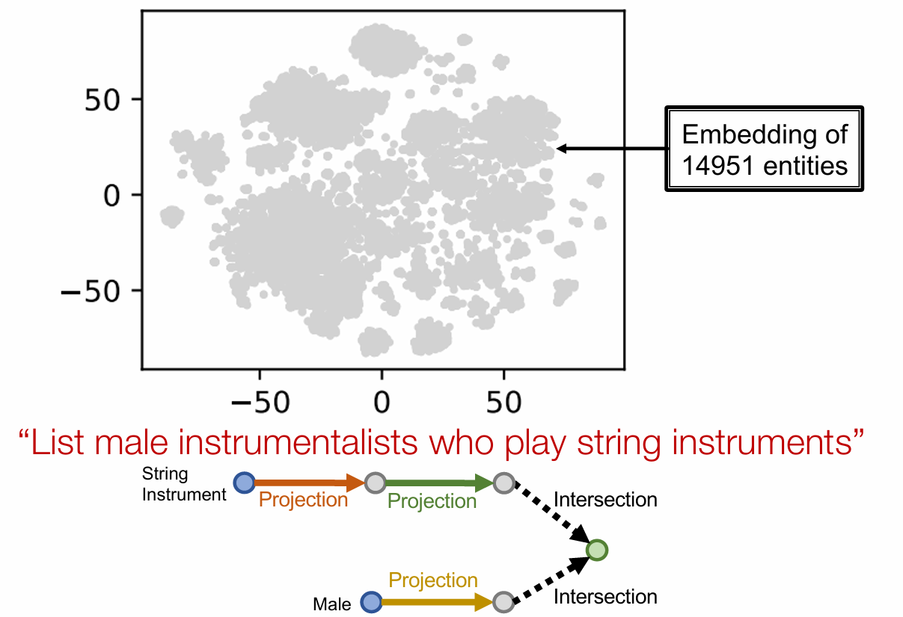

.png)

.png)

.png)

.png)

.png)

.png)

> TP (True Positive)：实际为正，预测也为正。TN (True Negative)：实际为负，预测也为负。FP (False Positive)：实际为负，但预测为正。也被称为 I 类错误或“假阳性”。FN (False Negative)：实际为正，但预测为负。也被称为 II 类错误或“假阴性”。

### Understanding Query2Box

