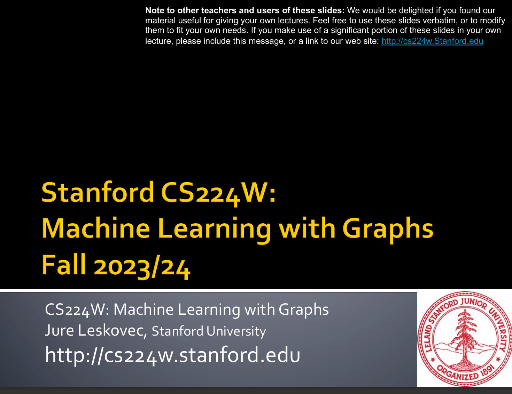

# 🔭Stanford CS224w:

!!! info "想说的话🎇"
    
    
    
    图是一种强大的数据结构，可以用于建模许多真实世界的场景，图能够对样本之间的关系信息进行建模。但是真实图的数据量庞大，动辄上亿节点、而且内部拓扑结构复杂，很难将传统的图分析方法如最短路径、DFS、BFS、PageRank 等算法应用到这些任务上。因此有研究者提出将机器学习方法和图数据结合起来，即图机器学习，这逐渐成为近年来机器学习中的一股热潮，特别是图神经网络（GNN）。
    
    🔝课程网站：[http://web.stanford.edu/class/cs224w/](http://web.stanford.edu/class/cs224w/)
    
    

!!! advice "Chapter"

    

    - [Chapter 1：Node Embeddings](./cs224w-notebook/chapter1.md) 

    - [Chapter 2：Graph Neural Networks](./cs224w-notebook/chapter2.md)
    
    - [Chapter 3：A Single Layer of a GNN](./cs224w-notebook/chapter3.md)
    

    