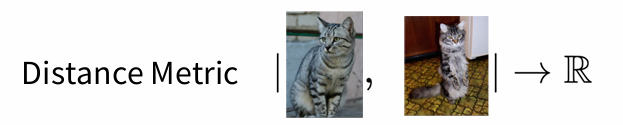
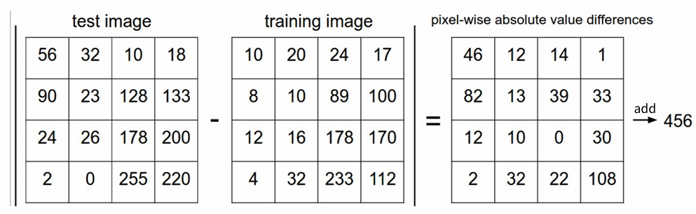
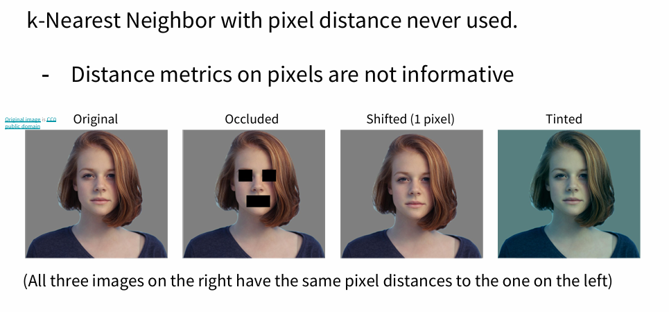
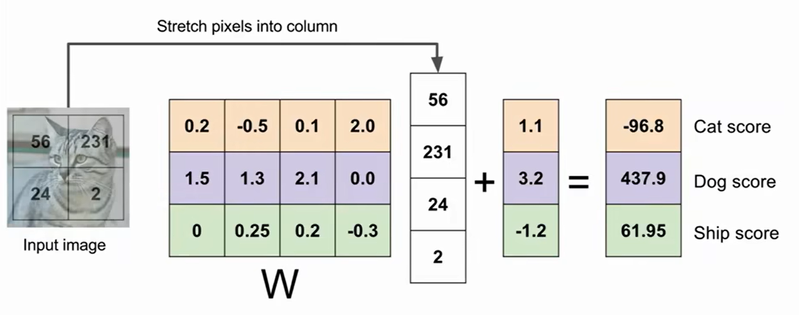
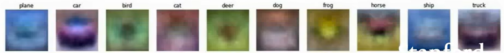
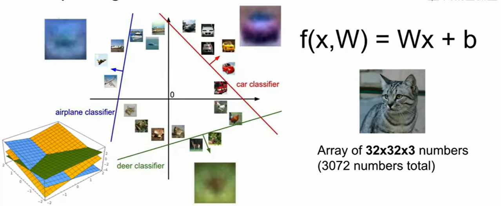
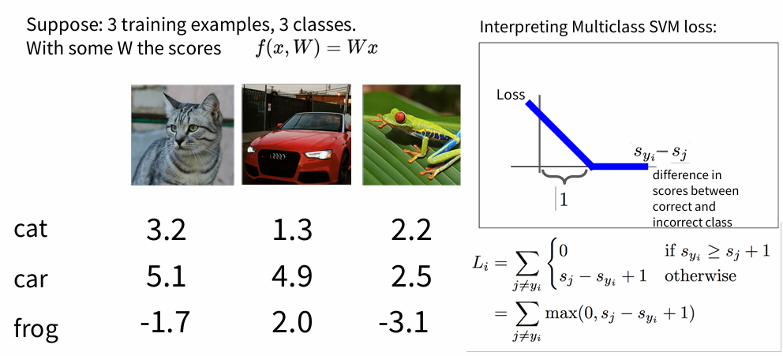
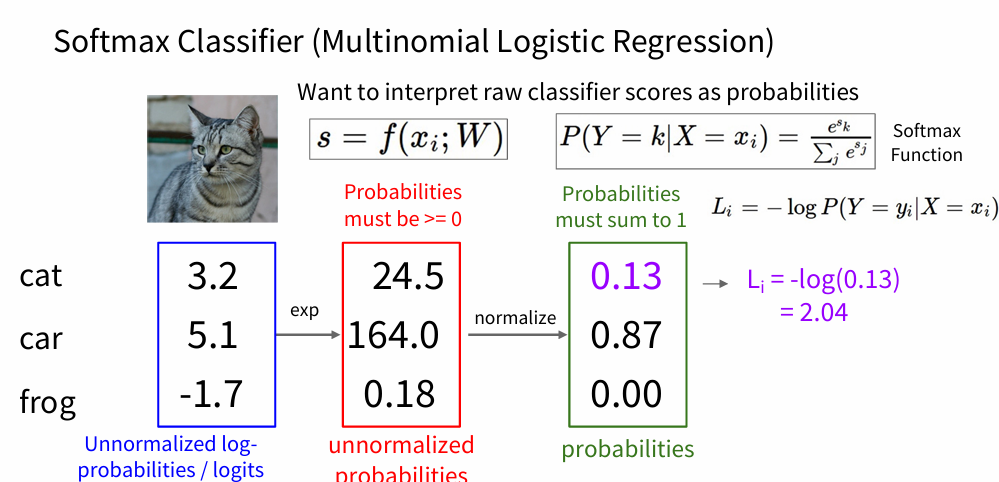

# 🛣Stanford CS231n:Deep Learning for Computer Vision  
---

<script src="https://polyfill.io/v3/polyfill.min.js?features=es6"></script>
<script src="https://cdn.jsdelivr.net/npm/mathjax@3/es5/tex-chtml.js"></script>

!!! info "想说的话🎇"
    
    <font size = 3.5>
    
    🔝课程网站：[https://cs231n.stanford.edu/](https://cs231n.stanford.edu/)
    
    2024版PPT: [https://cs231n.stanford.edu/slides/2024/](https://cs231n.stanford.edu/slides/2024/)
    
    </font>

## Nearest Neighbor Classifier
---

K邻近算法是一种简单的惰性算法（不需要训练，非参数，不学习特征），可直接进行预测计算。



衡量两个样本的距离:

- $L_1$ distance: $d_1(I_1, I_2) = \sum_{p} |I_1^p - I_2^p|$



- $L_2$ distance: $d_2(I_1, I_2) = \sqrt{\sum_{p} (I_1^p - I_2^p)^2}$

```distances = np.sqrt(np.sum(np.square(self.Xtr - X[i,:]), axis = 1))```

- K邻近实现：

```python
import numpy as np

# input x.shape [num_examples, y, x]

#  [ [[1, 2, 3],
#     [2, 3, 4],
#     [4, 5, 6]],
#
#    [[1, 2, 3],
#     [2, 3, 4],
#     [4, 5, 6]] ]

class KNearestNeighbor:
    def __init__(self, k):
        super().__init__()
        self.k = k
    
    def train(self, X, Y):
        self.X_train = X
        self.y_train = Y

    def distance(self, x_1, x_2):
        dis = np.sum(np.abs(x_1 - x_2), axis=1)
        return np.sum(dis, axis=1)
    
    def predict(self, X):
        num_examples = X.shape[0]
        y_predict = np.zeros(num_examples, dtype=self.y_train.dtype)
        for i in range(num_examples):
            Distance = self.distance(self.X_train, X[i,:])
            sorted_indices = np.argsort(Distance)
            k_nearest_labels = self.y_train[sorted_indices]
            y_predict[i] = collections.Counter(k_nearest_labels[0:self.k]).most_common(1)[0][0]

        return y_predict
```

!!! note "$L_1$和$L_2$比较"

    <font size = 3.5>
    在 $L_1$ 距离更依赖于<B>坐标轴的选定(旋转角度)</B>，坐标轴选择不同 $L_1$ 距离也会跟着变化，判定的数据归类的边界会更趋向于贴近坐标系的轴来分割所属区域，而 $L_2$ 的话相对来说与坐标系的关联度没那么大，会形成一个圆，不跟随坐标轴变化。

    - 在面对两个向量之间的差异时，$L_2$ 比 $L_1$ 更加不能容忍这些差异。也就是说，相对于1个巨大的差异，$L_2$ 距离更倾向于接受多个中等程度的差异
    </font>



由上几张被刻意处理的图(保证了其与原图的$L_2$distance相同)可知，使用像素差异（两个像素值之差）来比较图像是远远不够的，感官上不同的两张图片，可能有相同的$L_2$distance，与图像的语义内容关联不大。

## Linear Classifier
---

KNN 模型中训练过程中没有使用任何参数，只是单纯的把训练数据存储起来，而与之相对的是<B>参数模型</B>，最简单的参数模型是线性分类模型（Linear classifier）:

\[
    f(x_i,W,b) = W x_i + b    
\]



<B>实际上，上图参数矩阵$W$相当于是三个分类器的组合，$W$的每一行都是一个分类器，分别对应'猫'、'狗'、'船'</B>

!!! info "将线性分类器看做模板匹配"
    
    <font size = 3.5>
    把权重$W$的每一行看作一个分类的模板，一张图像对应不同分类的得分，是通过使用内积（也叫点积）来比较图像和模板，然后找到和哪个模板最相似。

    可以看到：

    

    </font>

!!! info "将图像看做高维空间的点"
    
    <font size = 3.5>
    把图像看作高维空间中的一个点，线性分类器对整个空间进行分割，对应一个个类别

    

    </font>

## Loss Function
---

对于有N个训练样本对应N个标签的训练集数据$(x_i, y_i)$，损失函数定义为:

\[
    L =  \frac{1}{N} \sum_{i=1}^{N} L_i(f(x_i, W), y_i)  
\]


- 多类支持向量机损失 (Multiclass Support Vector Machine Loss)

    ```SVM```的损失函数想要 ```SVM```在正确分类上的得分始终比不正确分类上的得分高出一个边界值 $\Delta$

    

    对于上述第1张图片「小猫」来说，设$\Delta$为1，则：

    \[
        L_1 = max(0, 5.1-3.2+1) + max(0, -1.7-3.2+1) = 2.9+0 = 2.9    
    \]

    即：```SVM```损失函数不仅希望正确分类的分数比其余分类高，而且希望保持高出一个距离$\Delta$

    ```python
    
    # x:得分矩阵 [[3.2, 5.1, -1.7],
    #            [1.3, 4.9, 2,0],
    #            [2.2, 2.5, -3.1],
    #            ..]
    #y:真实标签 [0, 1, 2]
    
    class MulticlassSVMLoss:
    def __init__(self, x, y, delta):
        self.x_train = x
        self.y_train = y
        self.delta = delta
    def train(self):
        x_true = np.array([self.x_train[k][self.y_train[k]] for k in range(len(self.y_train))])
        margins = np.maximum(self.x_train - x_true.reshape(-1,1) + self.delta, 0)
        loss = np.sum(margins,axis=1) - 1
        
        return np.sum(loss) / len(self.y_train)
            
    ```

    若使用的是平方损失SVM：$max(0,(s_j - s_{y_j} + 1)^2)$，则损失函数会更强烈地<B>惩罚</B>过界的边界值。

- Softmax classifier

    

    \[
        L = \frac{1}{N} \sum_i [-log(\frac{e^{s_{y_i}}}{\sum_j e^{s_j}})] + \lambda R(W)   
    \]

    实际代码编写中，由于指数形式的存在，如果得分很高，会得到一个非常大的数（指数数值爆炸）。除以大数值可能导致数值计算的不稳定，所以学会使用归一化技巧非常重要。如果在分式的分子和分母都乘以一个常数$C$，就能得到一个从数学上等价的公式：

    \[
        \frac{e^{s_{y_i}}}{\sum_j e^{s_j}} = \frac{Ce^{s_{y_i}}}{C\sum_j e^{s_j}} = \frac{e^{s_{y_i}+logC}}{\sum_j e^{s_j+logC}}
    \]

    通常将$C$设为：$logC = -\max{s_j}$，通过将数值进行平移，使得最大值为0

    ```python
    s = np.array([123, 456, 789]) # 例子中有3个分类，每个评分的数值都很大
    p = np.exp(s) / np.sum(np.exp(s)) # 不好：数值问题，可能导致数值爆炸
    # 那么将f中的值平移到最大值为0：
    s -= np.max(s) # s变成 [-666, -333, 0]
    p = np.exp(s) / np.sum(np.exp(s)) # 现在可以了，将给出正确结果
    ```

    !!! info " ```Softmax``` 和 ```SVM``` 比较"
        <font size = 3.5>
        - 相对于 ```Softmax``` 分类器，```SVM``` 更加 「局部目标化（local objective）」，只要看到正确分类相较于不正确分类，已经得到了比边界值还要高的分数，它就会认为损失值是 公式，对于数字个体的细节是不关心的。
        
        - ```Softmax``` 分类器对于分数是永不满足的：正确分类总能得到更高的概率，错误分类总能得到更低的概率，损失值总是能够更小。
        </font>