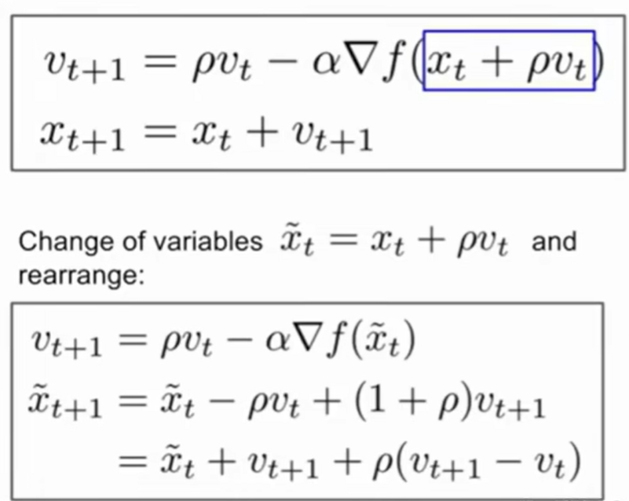

# 🛣Stanford CS231n:Deep Learning for Computer Vision  
---

<script src="https://polyfill.io/v3/polyfill.min.js?features=es6"></script>
<script src="https://cdn.jsdelivr.net/npm/mathjax@3/es5/tex-chtml.js"></script>

!!! info "想说的话🎇"
    
    <font size = 3.5>
    
    🔝课程网站：[https://cs231n.stanford.edu/](https://cs231n.stanford.edu/)
    
    2024版PPT: [https://cs231n.stanford.edu/slides/2024/](https://cs231n.stanford.edu/slides/2024/)
    
    </font>

## Optimization

!!! advice "SGD的问题"
    <font size = 3.5>

    

    - 如果损失函数在一个参数方向下降的快另一个方向下降的慢，这样会导致「之字形」下降到最低点，这个现象在高维中很普遍。

    - 如果损失函数有局部极小值和鞍点时，此时的梯度为公式，参数更新会卡住，或在极小值附近震荡。

    - SGD具有随机性，我们的梯度来自小批量数据，可能会有噪声，这样梯度下降的路线会很曲折，收敛的慢。

    
    </font>


- Momentum

    在SGD中，当前位置的梯度直接影响更新方向（在梯度为0的地方，位置更新可能卡住），而Momentum将梯度看作作用力,影响的是速度，即引入了动量项，使得更新方向更加平滑（当梯度为0时，速度仍然存在）。
    
    具体来说，Momentum将当前位置的梯度与之前位置的梯度进行加权平均，保持了质点的一定运动趋势，从而使得更新方向更加稳定，使得质点能够冲出鞍点/局部最优点,继续更新参数。

    
    
    ```python
    while True:
        dx = compute_gradient(x)
        v = mu * v - learning_rate * dx
        x += v
    ```
    - ```mu```：表示衰减系数，是对过去趋势的保留/积累

    

- Nesterov Accelerated Gradient (NAG)

    ```NAG```是```Momentum```的改进版，<B>既然我们知道动量将会将质点带到一个新的位置（即向前看），我们就不要在原来的位置计算梯度了，在这个「向前看」的地方计算梯度，更新参数。</B>

    ```NAG```不仅可以像动量法一样考虑历史迭代步骤的梯度信息，也可以超前参考未来的梯度信息

    
    
    ```python
    while True:
        pre_v = v
        dW =  compute_gradient(W, X_train, y_train)
        v = rho * v - learning_rate * dW
        W += -rho * pre_v + (1 + rho) * v
    ```

    
    
- AdaGrad

    AdaGrad是梯度下降的另一种改进，它通过<B>累积梯度的平方来调整学习率，使得学习率在梯度较大的地方减小，在梯度较小的地方增大</B>。具体来说，AdaGrad将梯度平方的累积和作为学习率的分母，使得学习率随着训练的进行而减小。

    ```python
    while True:
        dW = compute_gradient(W)
        grad_squared += dW * dW
        W -= learning_rate * dW / (np.sqrt(grad_squared) + eps)
    ```

    但是，如果梯度累加的很大，学习率就会变得非常小，就会陷在局部极小值点或提前停

- RMSProp: “Leaky AdaGrad”

    RMSProp算法在AdaGrad基础上引入了衰减因子，RMSProp在梯度累积的时候，会对「过去」与「现在」做一个平衡，通过超参数 ```decay_rate``` 调节衰减量


    ```python
    while True:
        dW = compute_gradient(W)
        grad_squared = decay_rate * grad_squared + (1 - decay_rate) * dW * dW
        W -= learning_rate * dW / (np.sqrt(grad_squared) + eps)
    ```

    

- Adam

    动量更新在SGD基础上增加了一阶动量，AdaGrad和RMSProp在SGD基础上增加了二阶动量。把一阶动量和二阶动量结合起来，就得到了Adam优化算法：Adaptive + Momentum。

    存在的问题：第一步中```second_monent```可能会比较小，这样就可能导致学习率非常大，所以```Adam```中需要加入偏置。

    
    
    ```python
    eps = 1e-8
    first_moment = 0  # 第一动量，用于累积梯度，加速训练
    second_moment = 0  # 第二动量，用于累积梯度平方，自动调整学习率
    for t in range(1, num_iterations+1):
        dW = compute_gradient(W)
        first_moment = beta1 * first_moment + (1 - beta1) * dW  # Momentum
        second_moment = beta2 * second_moment + (1 - beta2) * dW * dW  # AdaGrad / RMSProp
        
        first_unbias = first_moment / (1 - beta1 ** t)  
        # 加入偏置，随次数减小，防止初始值过小
        second_unbias = second_moment / (1 - beta2 ** t)
       
        W -= learning_rate * first_unbias / (np.sqrt(second_unbias) + eps)
    ```

    > 论文中推荐的参数值 ```eps=1e-8, beta1=0.9, beta2=0.999, learning_rate = 1e-3或5e-4```，对大多数模型效果都不错。

- AdamW: Adam Variant with Weight Decay

    ```AdamW```是```Adam```的变体，它将权重衰减（```weight decay```）添加到```Adam```的更新规则中。权重衰减是一种正则化技术，用于防止模型过拟合。

    简单来说，AdamW就是Adam优化器加上L2正则，来限制参数值不可太大。原先Adam的实现中如果采用了L2权重衰减，则相应的权重衰减项会被直接加在loss里，从而导致动量的一阶与二阶滑动平均均考虑了该权重衰减项,<B>而这影响了Adam的优化效果，而将权重衰减与梯度的计算进行解耦能够显著提升Adam的效果</B>


## Regularization
---

