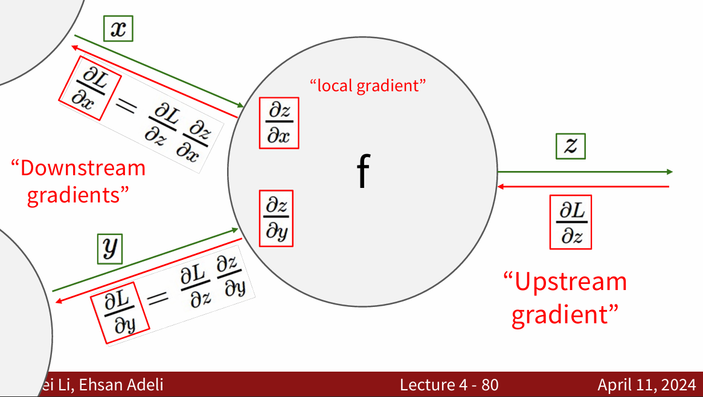
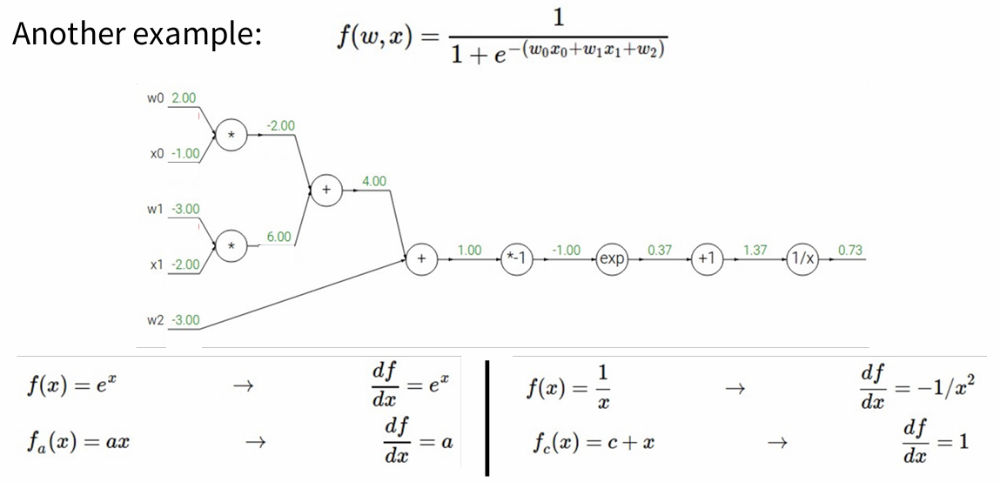
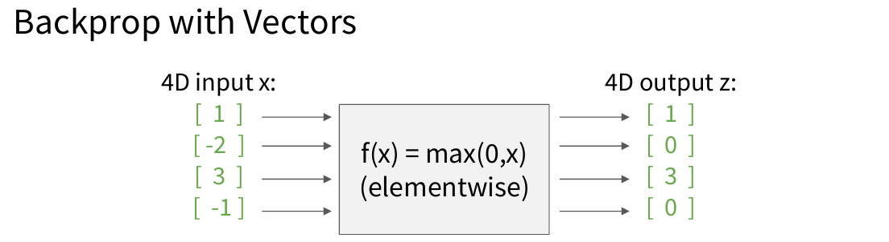
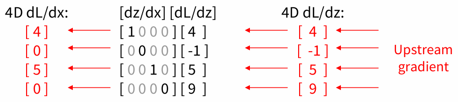
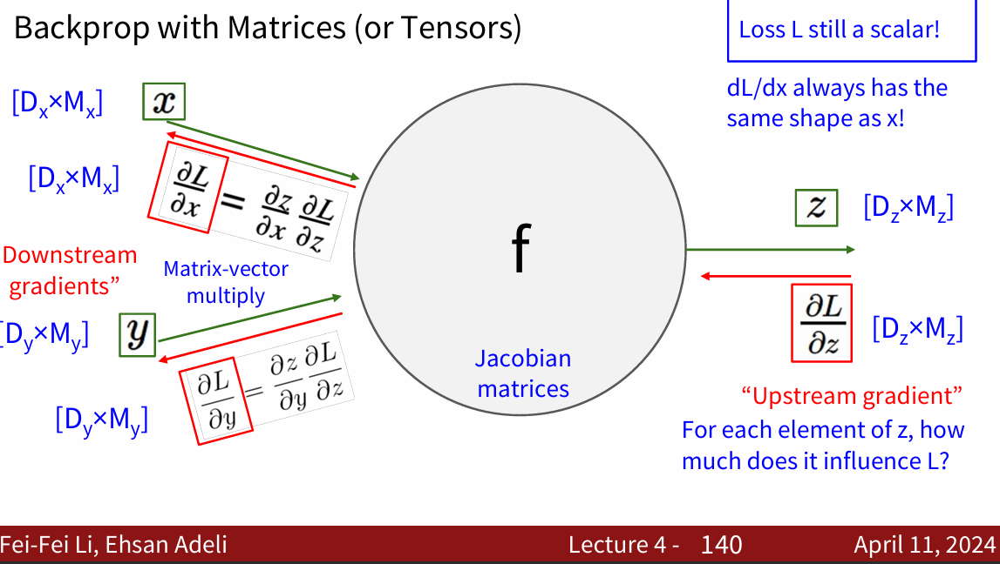

# 🛣Stanford CS231n:Deep Learning for Computer Vision  
---

!!! info "想说的话🎇"
    
    
    
    🔝课程网站：[https://cs231n.stanford.edu/](https://cs231n.stanford.edu/)
    
    2024版PPT: [https://cs231n.stanford.edu/slides/2024/](https://cs231n.stanford.edu/slides/2024/)
    
    

## 前向传播与反向传播
---

## 向量形式的反向传播
---

这个$max$函数对输入向量$x$的每个元素都和0比较输出最大值，因此输出向量的维度不变。此时的梯度是<B>雅可比矩阵</B>，即输出的每个元素对输入的每个元素求偏导组成的矩阵。

假如输入$x$是n维的向量，输出$y$是m维的向量，则$y_1,y_2,...,y_n$都是 $x_1 ~ x_n$的函数，得到的雅克比矩阵如下所示：

\[
    \begin{equation*}
	\begin{bmatrix}
		\dfrac{\partial y_1}{\partial x_1} & \dfrac{\partial y_1}{\partial x_2}  & \cdots & \dfrac{\partial y_1}{\partial x_n}\\ 
		\dfrac{\partial y_2}{\partial x_1} & \dfrac{\partial y_2}{\partial x_2}  & \cdots & \dfrac{\partial y_2}{\partial x_n}\\
		\vdots                             & \vdots                              & \vdots & \vdots                            \\
		\dfrac{\partial y_m}{\partial x_1} & \dfrac{\partial y_m}{\partial x_2}  & \cdots & \dfrac{\partial y_m}{\partial x_n}
	\end{bmatrix}
    \end{equation*}
\]

根据上图：

## 理解神经网络
---

全连接层的神经网络的一种理解是：

- 它们定义了一个由一系列函数组成的函数族，网络的权重就是每个函数的参数。

拥有至少一个隐层的神经网络是一个通用的近似器，神经网络可以近似任何连续函数。

> 虽然一个2层网络在数学理论上能完美地近似所有连续函数，但在实际操作中效果相对较差。虽然在理论上深层网络（使用了多个隐层）和单层网络的表达能力是一样的，但是就实践经验而言，深度网络效果比单层网络好。

对于全连接神经网络而言，在实践中3层的神经网络会比2层的表现好，然而继续加深（做到4，5，6层）很少有太大帮助。卷积神经网络的情况却不同，在卷积神经网络中，对于一个良好的识别系统来说，深度是一个非常重要的因素（比如当今效果好的CNN都有几十上百层）。对于该现象的一种解释观点是：因为图像拥有层次化结构（比如脸是由眼睛等组成，眼睛又是由边缘组成），所以多层处理对于这种数据就有直观意义。