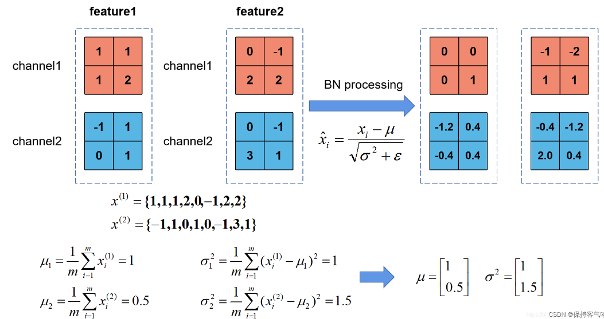
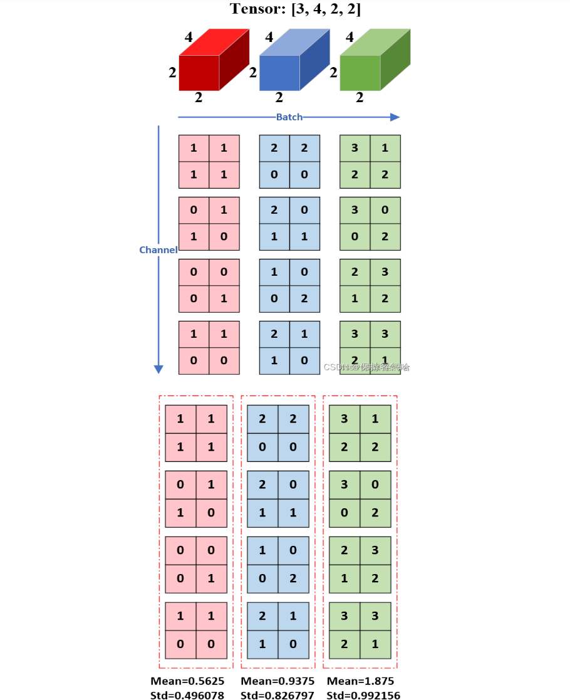

# 🛣Stanford CS231n:Deep Learning for Computer Vision  
---

<script src="https://polyfill.io/v3/polyfill.min.js?features=es6"></script>
<script src="https://cdn.jsdelivr.net/npm/mathjax@3/es5/tex-chtml.js"></script>

!!! info "想说的话🎇"
    
    <font size = 3.5>
    
    🔝课程网站：[https://cs231n.stanford.edu/](https://cs231n.stanford.edu/)
    
    2024版PPT: [https://cs231n.stanford.edu/slides/2024/](https://cs231n.stanford.edu/slides/2024/)
    
    </font>


### Data Preprocessing
---


归一化（Normalization）与减均值（Mean Subtraction）是最常用的两种数据预处理方法，

### Weight Initialization
---

- 全零初始化
    
    这种做法是错误的。 因为如果网络中的每个神经元都计算出同样的输出，然后它们就会在反向传播中计算出同样的梯度，从而进行同样的参数更新。换句话说，<B>如果权重被初始化为同样的值，神经元之间就失去了不对称性的源头。</B>
    
    (要打破参数对称的问题)

- 小随机数初始化

    ``` w = 0.01 * np.random.rangn(D, H)```(基于零均值和标准差的一个高斯分布来生成随机数的)，下图展示小随机数初始化在不同层中参数的概率分布：

    

    上图可以看到只有第一层的输出均值方差比较好，输出接近高斯分布，后几层均值方差基本为0，这样导致的后果是正向传播的激活值基本为0，反向传播时就会计算出非常小的梯度（因权重的梯度就是层的输入，输入接近0，梯度接近0 ），参数基本不会更新。（梯度消失）

- 大随机数初始化

    ``` w = 1 * np.random.rangn(D, H)```，倘若使用的是tanh函数

    

    如上图，所有神经元都会饱和，输出为±1，梯度为0

- Xavier/He初始化（针对sigmoid & tanh）

    ```W = np.random.randn(fan_in, fan_out) / np.sqrt(fan_in + fan_out)```

    

    保证了网络中所有神经元起始时有近似同样的输出分布，图上可以看出后面几层的输入输出参数分布保持接近高斯分布。

- Kaiming / MSRA 初始化（针对relu）

    当使用ReLU激活函数时，神经网络的每层会消除一半的神经元（置0），结果会使方差每次减半，会有越来越多的神经元失活，输出为0的神经元越来越多。

    

    ```W = np.random.randn(fan_in, fan_out) / np.sqrt(fan_in/2)```，因为每次有一半的神经元失活，校准时除2即可，这样得到的结果会比较好。

    


### Batch Normalization 
---

\[
    \hat{x}^{(k)} = \frac{x^{(k)} - E(x^{(k)})}{\sqrt{Var(x^{(k)})}}    
\]

当一张经过标准化处理的图片经过卷积操作之后，得到的分布就不再像一开始那样的标准分布，一旦每批训练数据的分布各不相同(batch 梯度下降)，那么网络就要在每次迭代都去学习适应不同的分布，这样将会大大降低网络的训练速度

```Batch Normalization```方法一定程度解决了如何合理初始化神经网络这个棘手问题，其做法是让激活数据在训练开始前通过一个网络，网络处理数据使其服从标准高斯分布，即让每个隐层节点的激活输入分布固定下来

在实现层面，应用这个技巧通常意味着全连接层或卷积层与激活函数之间添加一个```BatchNorm```层。在神经网络中使用批量归一化已经变得非常常见，在实践中使用了批量归一化的网络对于不好的初始值有更强的鲁棒性。

假设有N个样本数据的小批量输入，每个输入$x$有$D$维，即$x = (x^{(1)}...x^{(d)})$,对数据的每个维度进行归一化：


引入缩放与平移参数，这两个参数可以在网络中学习，并且能实现我们想要的效果：

\[
    y^{(k)} = \gamma^{(k)} \hat{x}^{(k)} + \beta^{(k)}      
\]

BatchNorm的工作流：




```BatchNorm```的优势:


- 改善通过网络的梯度流(gradient flow)

- 具有更高的鲁棒性：允许更大的学习速率范围、减少对初始化的依赖

- 加快学习速率衰减，更容易训练

- 可以看作是一种正则方式，在原始输入$X$上抖动

- 可以不使用Dropout，加快训练

- <B>测试时不使用小批量中计算的均值和方差，相反，使用训练期间激活数据的一个固定的经验均值，例如可以使用在训练期间的平均值作为估计。</B>


```BatchNorm```需要注意的问题:

- 训练时将traning参数设置为True，在验证时将trainning参数设置为False。在pytorch中可通过创建模型的model.train()和model.eval()方法控制.

- batch_size尽可能设置大点，设置小后表现可能很糟糕，设置的越大求的均值和方差越接近整个训练集的均值和方差。

    研究表明对于ResNet类模型在ImageNet数据集上，batch从16降低到8时开始有非常明显的性能下降。<B>所以BN不适应于当训练资源有限而无法应用较大的batch的场景</B>。

- 建议将bn层放在卷积层（Conv）和激活层（例如Relu）之间，<B>且卷积层不要使用偏置bias</B>，因为没有用


- Layer Normalization
---

事实证明，批量归一化能使网络更容易训练，但是<B>对批量的大小有依赖性，批量太小效果不好，批量太大又受到硬件的限制</B>。所以在对输入批量大小具有上限的复杂网络中不太有用。对于RNN这类时序网络，时序的长度并不是一个定值，很难去使用BN

层归一化(ayer Normalization)不再对这个小批量进行归一化，而是对特征向量进行归一化。换句话说，当使用层归一化时，基于该特征向量内的所有项的总和来归一化对应于单个数据点。（无需批训练，其在单个样本内部就能归一化）




> 对于LN与BN而言，BN 取的是不同样本的同一个特征，而 LN 取的是同一个样本的不同特征


- Instance Normalization(实例归一化)
---

```Instance normalization```是一种归一化方法，它将每个样本的均值和标准差归一化到特定的值(即```batch_size = 1```)。这种方法保持每个实例的独立性，适用于风格迁移、GAN等需要保持实例独立性的任务

- Group Normalization (分组归一化)
---

```Group Normalization（GN）```是针对```Batch Normalization```在```batch_size```较小时错误率较高而提出的改进算法(批次较小时，计算的统计均值和方差不够稳定)，因为BN层的计算结果依赖当前```batch```的数据，当```batch_size```较小时（比如2、4这样），该```batch```数据的均值和方差的代表性较差，因此对最后的结果影响也较大。

```GN```现将所有的输入通道分为G个小组，然后对每个小组分别做归一化（当```G=1```是，即为```LN```）


