# 🛣Stanford CS231n:Deep Learning for Computer Vision  
---

<script src="https://polyfill.io/v3/polyfill.min.js?features=es6"></script>
<script src="https://cdn.jsdelivr.net/npm/mathjax@3/es5/tex-chtml.js"></script>

!!! info "想说的话🎇"
    
    <font size = 3.5>
    
    🔝课程网站：[https://cs231n.stanford.edu/](https://cs231n.stanford.edu/)
    
    2024版PPT: [https://cs231n.stanford.edu/slides/2024/](https://cs231n.stanford.edu/slides/2024/)
    
    </font>


### 3x3小卷积核
---

在VGG中第一次使用，有许多优势：

- 多个3x3卷积核可以比一个大卷积核有更多的非线性，更好地捕捉局部模式。

- 3x3卷积核可以减少参数数量。

    假设卷积层的输入和输出的特征图大小相同为$C$，则三个3x3卷积层参数个数为：3*(3*3*$C$*$C$)=27$C^2$，一个感受野相同的7x7卷积层的参数为7*7*$C$*$C$=49$C^2$。

    显然多个3x3卷积核的参数更少，并且中间层具备更多的非线性。

### Inception块：
---

「Inception」模块是一种设计的比较好的局域网拓扑结构，然后将这些模块堆叠在一起。这种拓扑结构对来自前一层的输入，并行应用多种不同的滤波操作，然后将所有滤波器的输出在深度上串联在一起。

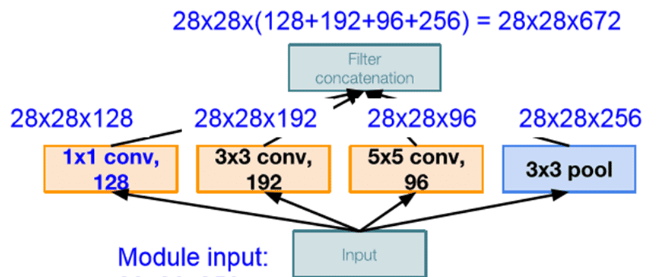

上述的inception块会导致输出的网络深度
增加，因此作者又引入了「降维」操作，即对1x1卷积核的输出进行降维，在保留原输入空间尺寸的同时，减少参数数量。

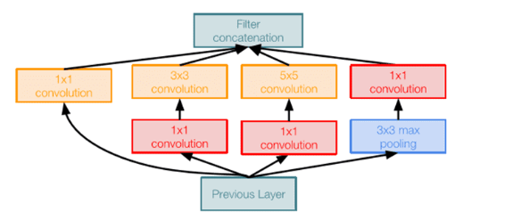

### Residual Learning
---

ResNet通过使用多个有参层来<B>学习输入与输入输出之间的残差映射（ residual mapping ）</B> ，而非像一般CNN网络（如AlexNet/VGG等）那样使用有参层来直接学习输入输出之间的底层映射（underlying mapping）。

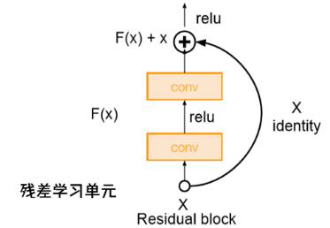

ResNet的实际训练的一些细节如下：

- 每个 CONV 层后使用```BatchNorm```

- 权重使用```Kaiming```初始化

- 更新方式使用```SGD + Momentum (0.9)```

- 学习率为 0.1, 验证错误率不变时除 10

- ```Mini-batch size``` 为 256

- 权重衰减是 ```1e-5```
- 未使用```dropout```

### ResNet的变体
---

- Identity Mappings in Deep Residual Networks

    改进了残差块设计，创建更直接的路径（将激活函数移动到残差的映射路径），以便在整个网络中传播信息

    [BatchNorm - ReLU - Conv - BatchNorm - ReLU -Conv]

    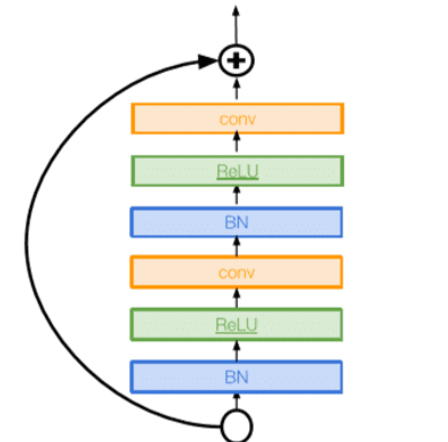

- ResNeXt

    ResNeXt在ResNet的基础上，将残差块中的1x1卷积核替换为1x1卷积核+3x3卷积核+1x1卷积核的模块，并且引入了分组卷积（与 Inception 模块相似），通过多个平行路径增加残差块的宽度（cardinality）。

    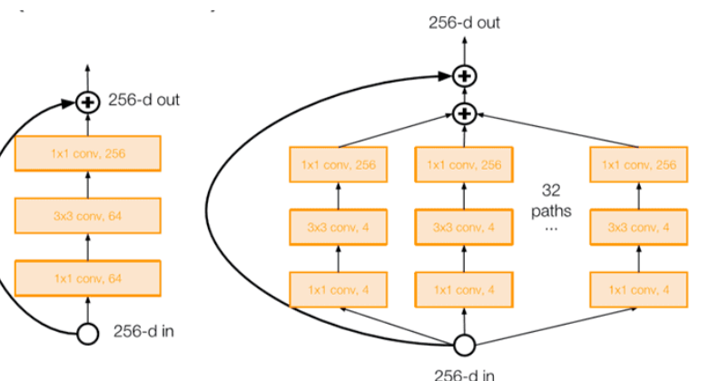

### SqueezeNet
---

作为一个轻量化网络，SqueezeNet拥有与 AlexNet 相同的精度，但只用了 AlexNet 1/50 的参数量。

- Fire Module
    SqueezeNet采用了不同于传统的卷积方式，提出```fire module```；```fire module``` 包含两部分：```squeeze``` +```expand``` 。在保证同等级别准确率的同时，实现用更少参数的 CNN结构

    压缩策略：

    - 使用 1 x 1 卷积滤波器代替 3 x 3 卷积 （参数量少9倍）；

    - 使用3x3个滤波器减少输入通道的数量，利用```squeeze layers```实现；

    - 在网络后期进行下采样操作，可以使卷积层有更大的激活特征图。

    ```squeeze```：只有 1 x 1 卷积滤波器，对 feature map的维数进行压缩，从而达到减少权值参数的目的；
    
    ```expand```：混合有 1 x 1 和 3 x 3 卷积滤波器；

    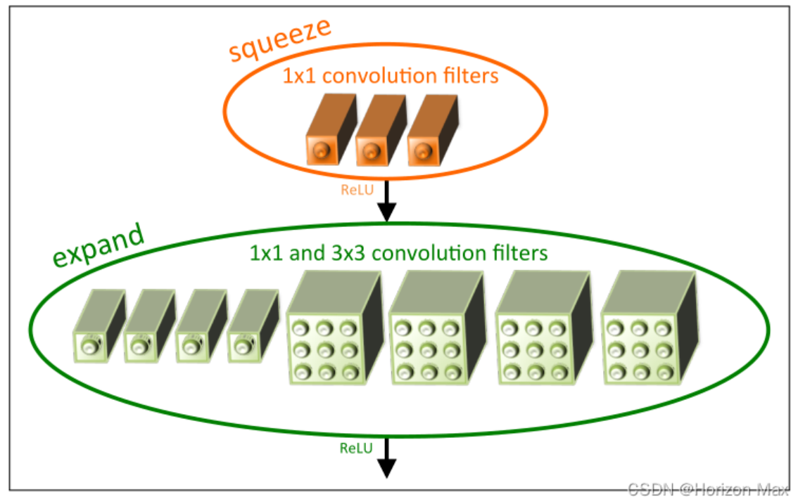

    具体操作情况如下图所示：

    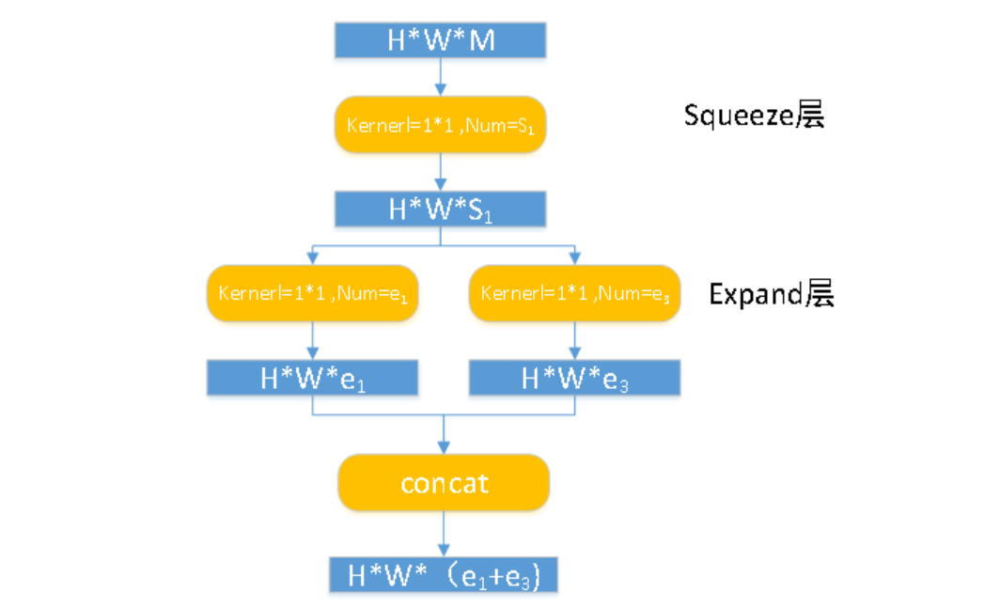


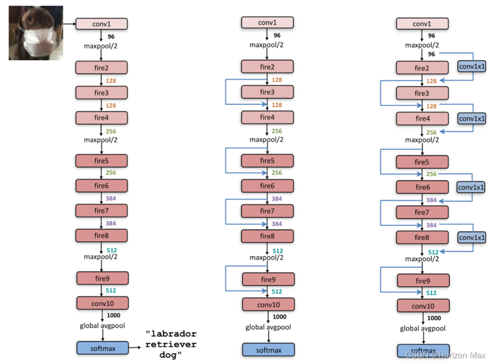
（ SqueezeNet - 带简单旁路的 SqueezeNet - 带复杂旁路的 SqueezeNet ）

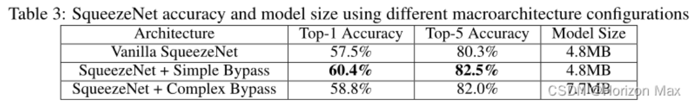

### Xception
---

Xception是Inception V3的改进版，主要改进点如下：

- 使用<B>深度可分离卷积（depthwise separable convolution）</B>代Inception模块。

- 深度可分离卷积将标准的卷积操作分解为两个独立的操作：<B>深度卷积（depthwise convolution）和逐点卷积（pointwise convolution）。</B>

    <B>深度卷积</B>对每个输入通道单独进行卷积操作
    
    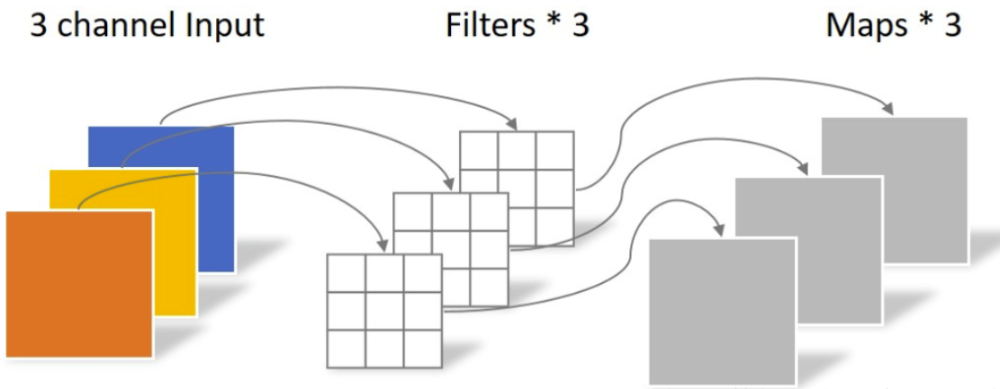
    
    而<B>逐点卷积则将所有输入通道的卷积结果进行线性组合</B>。这种分解可以显著减少计算量和参数数量。

    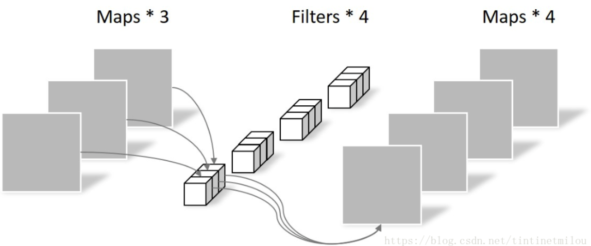

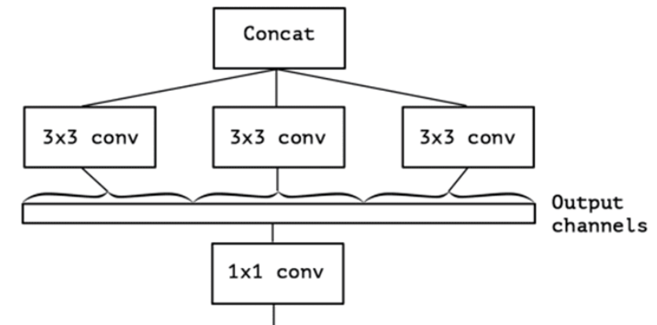

在传统的卷积网络中，卷积层会同时寻找跨空间和跨深度的相关性(如下图):

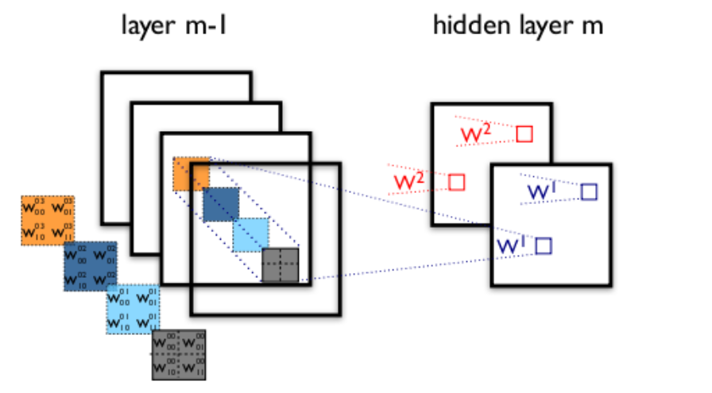

过滤器同时考虑了一个空间维度（每个 2×2 的彩色方块）和一个跨通道或「深度」维度（4 个方块的堆叠）。在输入图像的输入层，这就相当于一个在所有 3 个 RGB 通道上查看一个2×2像素块的卷积过滤器。

在 Inception 中，我们开始将两者稍微分开。我们使用 1×1 的卷积将原始输入投射到多个分开的更小的输入空间，而且对于其中的每个输入空间，我们都使用一种不同类型的过滤器来对这些数据的更小的 3D 模块执行变换。

Xception 更进一步。不再只是将输入数据分割成几个压缩的数据块，而是<B>为每个输出通道单独映射空间相关性，然后再执行 1×1 的深度方面的卷积来获取跨通道的相关性。</B>

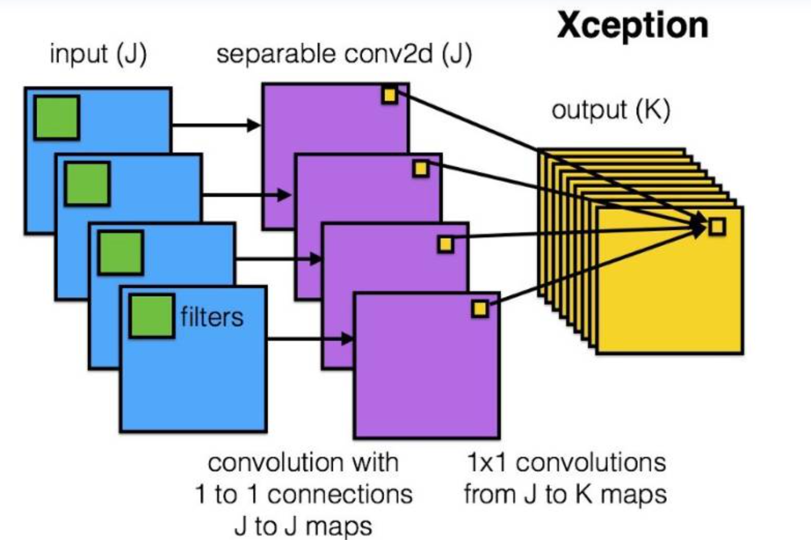

> [https://cloud.tencent.com/developer/article/1119273](https://cloud.tencent.com/developer/article/1119273)

### ShuffleNet
---

ShuffleNet的动机在于大量的 公式 卷积会耗费很多计算资源，而```Group Conv```难以实现不同分组之间的信息交流。


- 分组卷积（group conv）

    对输入层的不同特征图进行分组，再使用不同的卷积核对不同组的特征图进行卷积，通过分组降低卷积的计算量

    假设输入通道为$C_i$，输出通道为$C_o$，分组数目为$g$，Group Conv的操作如下：

    - 将输入特征图沿着通道分为$g$组，每一组的通道数目为$C_i / g$。

    - 使用$g$个不同的卷积核，每一个卷积核的滤波器数量为$C_o / g$。

    - 使用这$g$个不同的卷积核，对$g$组特征图分别进行卷积，得到$g$组输出特征图，每一组的通道数为$C_o / g$。

    - 将这$g$组的输出特征图结合，得到最终的$C_o$通道的输出特征图。

- 通道洗牌(channel Shuffle)

    ```Group Conv```的一个缺点在于不同组之间难以实现通信,而对```Group Conv```之后的特征图沿着通道维度进行重组，这样信息就可以在不同组之间流转。

    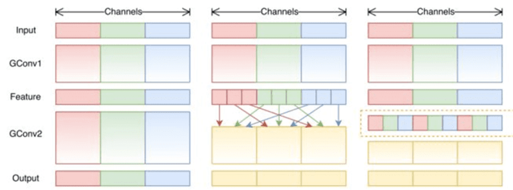

!!! note "ShuffleNet Unit"
    <font size = 3.5>
    基于残差块（residual block）和 通道洗牌（channel shuffle）设计的```ShuffleNet Unit```:

    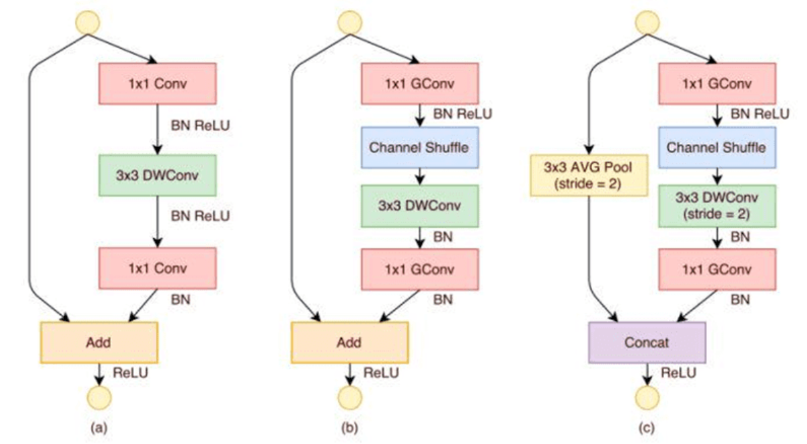
    </font>

### ShuffleNet V2
---

事实上ShuffleNet存在较大的缺点：Channel Shuffle 操作较为耗时，导致 ShuffleNet 的实际运行速度没有那么理想

> [轻量级CNN网络高效设计准则-ShuffleNet v2](https://blog.csdn.net/panghuzhenbang/article/details/124565931)


### MobileNet
---

```MobileNet```是专用于移动和嵌入式视觉应用的卷积神经网络，是基于一个流线型的架构，使用深度可分离的卷积来构建轻量级的深层神经网络。

```MobileNet V1```的核心是将卷积拆分成 ```Depthwise Conv``` 和 ```Pointwise Conv``` 两部分

- 普通网络（以VGG为例） ：```3x3 Conv BN ReLU```


- ```Mobilenet```基础模块：```3x3 Depthwise Conv BN ReLU``` 和 ```3x3 Pointwise Conv BN ReLU```

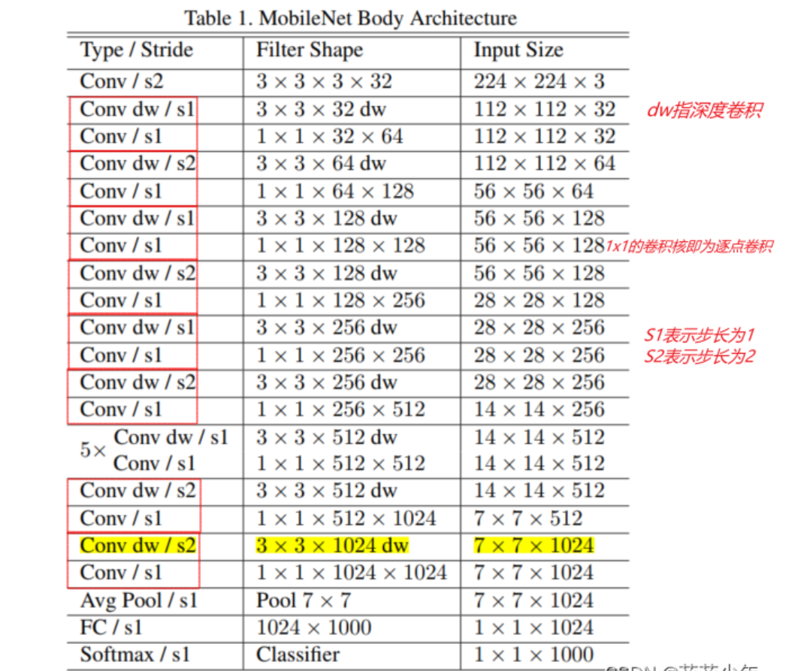

V1缺点:

-  ReLU激活函数用在低维特征图上，会破坏特征。

- ReLU输出为0时导致特征退化。用残差连接可以缓解这一问题。

- 结构过于简单，没有复用图像特征，即没有Concat或Add等操作进行特征融合

# MobileNet V2
---

```MobileNet V2```针对```MobileNet```的上述2个问题，引入了```Inverted Residual```和```Linear Bottleneck```对其进行改造，网络为全卷积，使用```ReLU6```（最高输出为6）激活函数。

\[
    y = ReLU6(x) = min(max(x,0),6)    
\]

- Manifold of interest

    ```Manifold of interest```是指在特征空间(特征图)中，与特定任务或概念相关的数据样本的聚集区域。

    因此有一种直觉，可以通过减小卷积层的维数来减小特征空间的维数，因为```Manifold of interest```只占特征空间的一部分，希望尽可能的减少其余无关的特征空间。
    
    当特征空间经过非线性变换```ReLU```激活会导致为负的输入全部变为零，导致失去保存的信息，当ReLU使得某一个输入通道崩塌时(这个通道中有很多特征像素值都变成了负值)，就会使当前通道丢失很多信息

    但是如果有很多卷积核，也就是生成了很多通道，那么在当前通道丢失的信息就会有可能在其他通道找回来，下图展示了嵌入在高维空间中的低维兴趣流形经过```ReLU```激活的情况。

    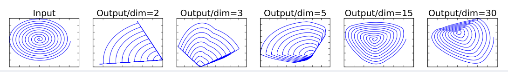

> MobileNet作者给出了证明：如果输入流形嵌入的特征空间维度足够高，那么ReLU就可以在保留信息的同时完成non-linearity的本职工作——提高模型的表达能力（<B>在必要的ReLU之前，提高卷积层输出tensor的维度</B>。）


- ```Inverted Residual```(倒残差结构)

    > 深度卷积层提取特征限制于输入特征维度，若采用普通残差块会将输入特征图压缩，深度卷积提取的特征会更少，MobileNets_V2将输入特征图扩张，丰富特征数量，进而提高精度。
    
    
    
    先使用1x1卷积提升通道数量，然后使用3x3卷积提取特征，之后使用1x1卷积降低通道数量，最后加上残差连接。整个过程是「扩张-卷积-压缩」。(与传统残差相反)

    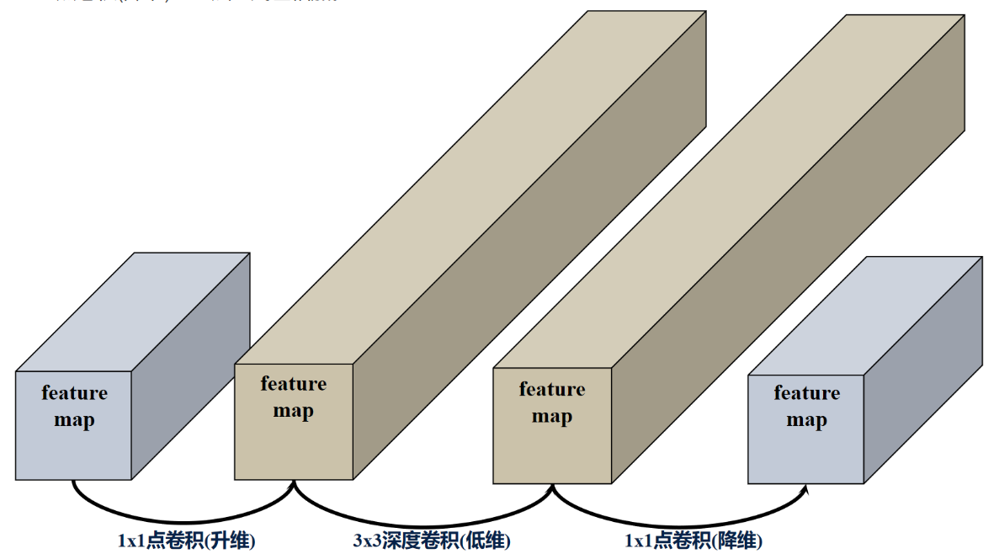
    
    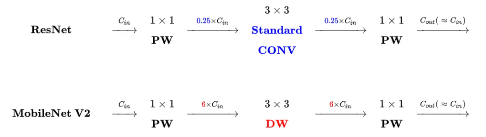


- ```Linear Bottleneck```(线性瓶颈层)

    线性瓶颈层的主要作用是通过降低维度来提取数据的主要特征，从而减少计算量和模型复杂度，同时保持输入数据的重要信息，通常由一个线性变换操作组成，例如全连接层或卷积层，其输出维度远小于输入维度，并且不引入非线性变换。    

    ```MobileNet V2``` 在 ```Depthwise Conv``` 的前面加了一个 1x1卷积，使用 ```ReLU6``` 代替 ```ReLU```，且<B>去掉了第二个1x1卷积的激活函数（即使用线性的激活函数），防止 ```ReLU``` 对特征的破坏。</B>

    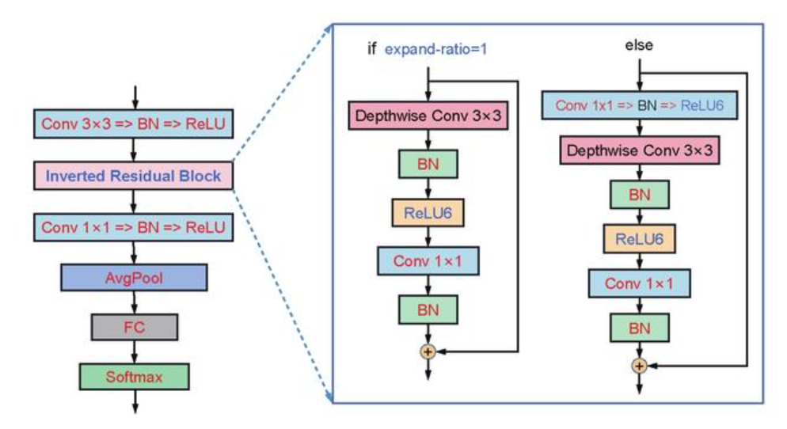

    
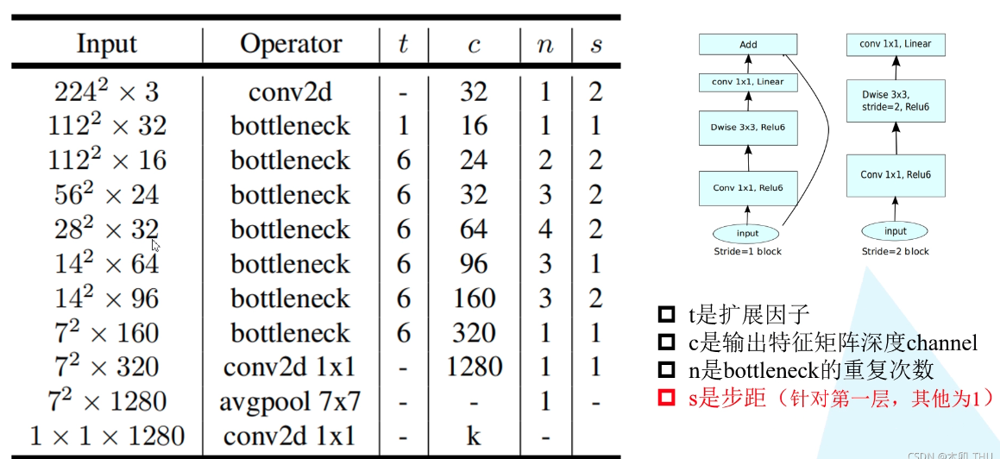

- MobileNet V3
---

在 ```MobileNet V2``` 的基础上，又提出了```MobileNet V3```，它的优化之处包括：引入了 SE、尾部结构改进、通道数目调整、h-swish 激活函数应用，NAS 网络结构搜索等

```MobileNetV3``` 有两个版本，```MobileNetV3-Small``` 与 ```MobileNetV3-Large``` 分别对应对计算和存储要求低和高的版本。

- SE(squeeze and excitation)结构


    SE 结构是一种轻量级的通道注意力模块，用于在卷积神经网络中引入通道间的依赖关系，从而提高模型的表达能力和性能。
    
    其核心思想是<B>不同通道的权重应该自适应分配，由网络自己学习出来的，而不是像Inception net一样留下过多人工干预的痕迹。</B>

    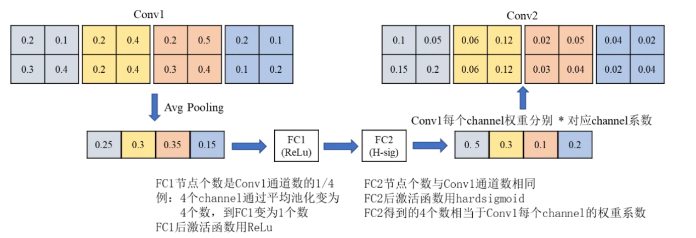
    
    ```MobileNet V3 ```在 ```bottleneck ```中引入了 SE 结构，放在 ```Depthwise Conv``` 之后，并且将``` Expansion Layer ```的通道数目变为原来的 1/4，在提升精度的同时基本不增加时间消耗。  
    
    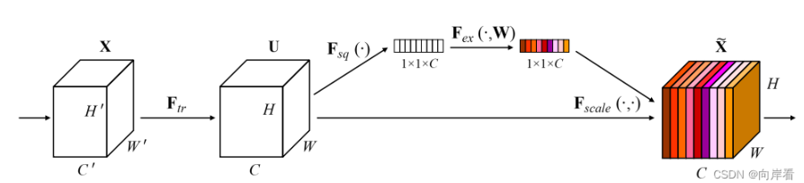

    Excitation（自适应重新校正）用来全面捕获通道依赖性，作者采用了两层全连接构成的门机制，第一个全连接层把$C$个通道压缩成了$C/r$个通道来降低计算量，再通过一个```ReLU```非线性激活层，第二个全连接层将通道数恢复回为$C$个通道，再通过h-swish激活得到权重s，最后得到的这个s的维度是1×1×C，它是用来刻画特征图U中$C$个```feature map```的权重。


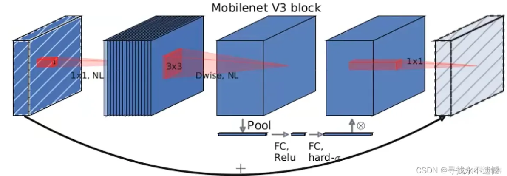

- hardswish激活函数

\[
    Swish(x) = x * sigmoid(x)
\]

```swish```激活函数其具备无上界有下界、平滑以及非单调的特性，并且在深层模型上的效果优于ReLU。虽然提高了精度，但也带来了计算成本的增加

若把```swish```中的```sigmoid```替换成```ReLU6```，便是```MobileNet V3```中使用的```h-swish```。


\[
    h-Swish(x) = x \frac{ReLU6(x+3)}{6}    
\]

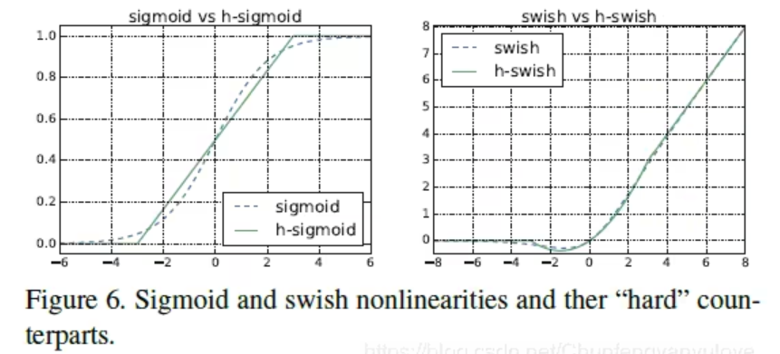

计算不仅方便，图像上逼近```swish```，且```h-swish```能在特定模式下消除由于近似sigmoid的不同实现而带来的潜在数值精度损失。


- 尾部结构改进

    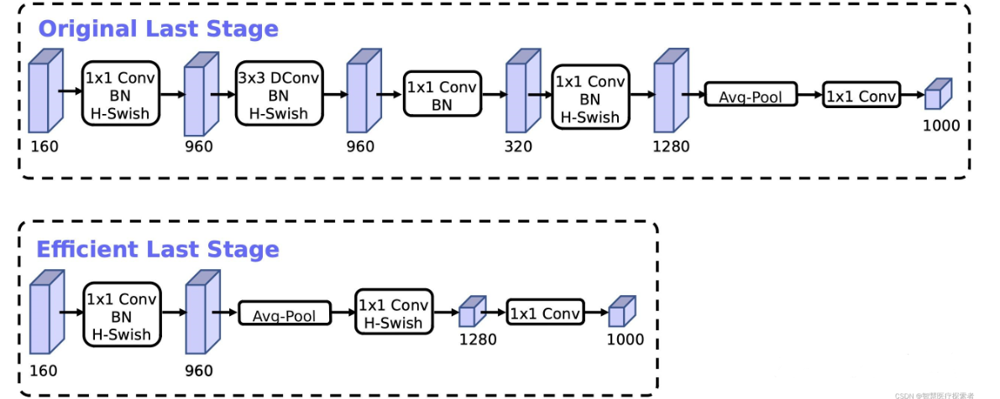

    - 将1x1卷积移动到 avg pooling 后面，降低计算量。

    - 去掉了尾部结构中「扩张-卷积-压缩」中的3x3 卷积以及其后面的 1x1 卷积，进一步减少计算量，精度没有损失。