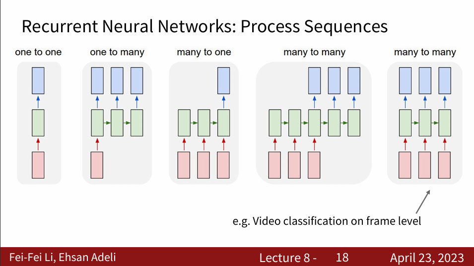
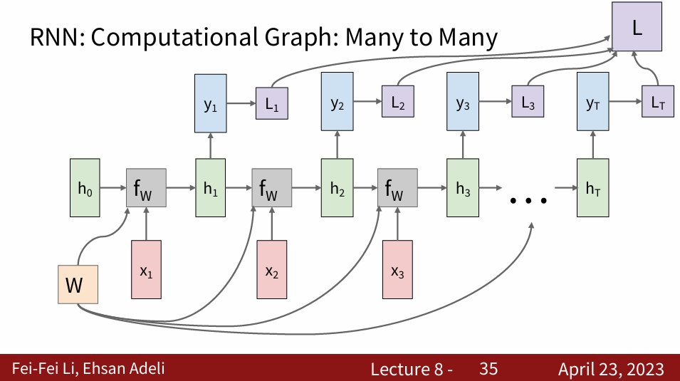
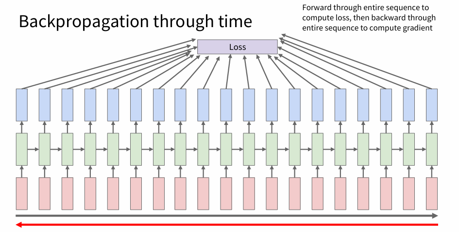
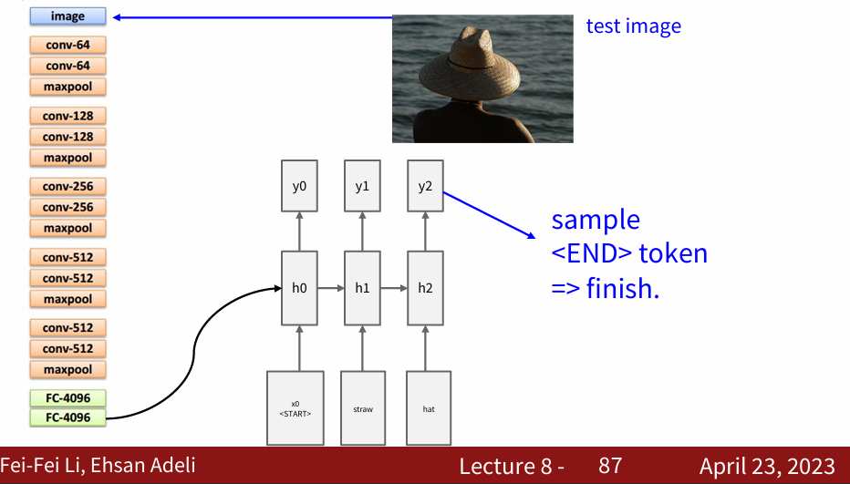
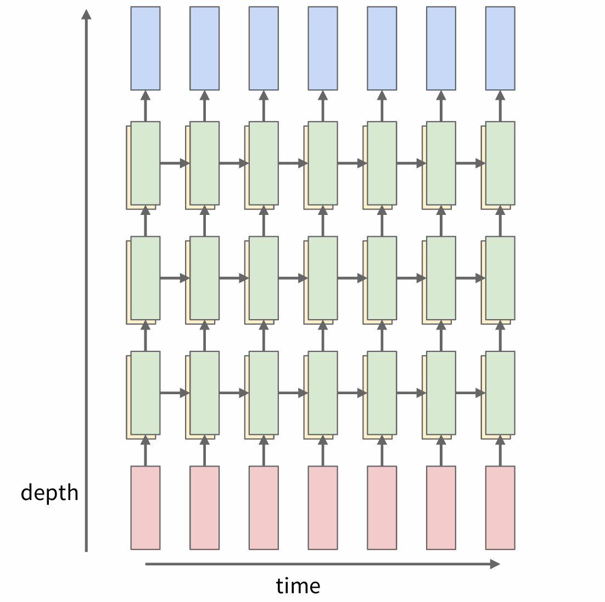
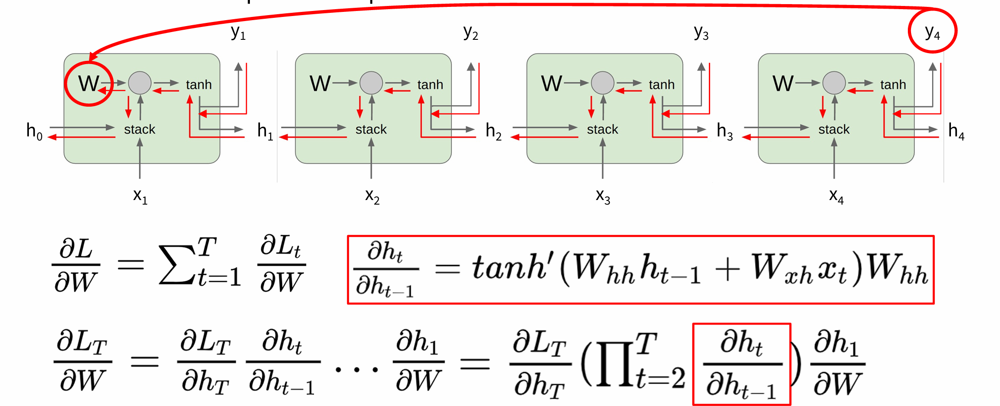
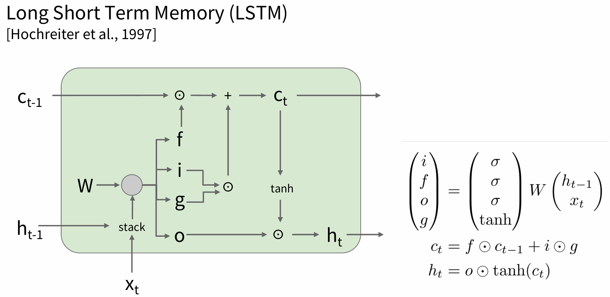
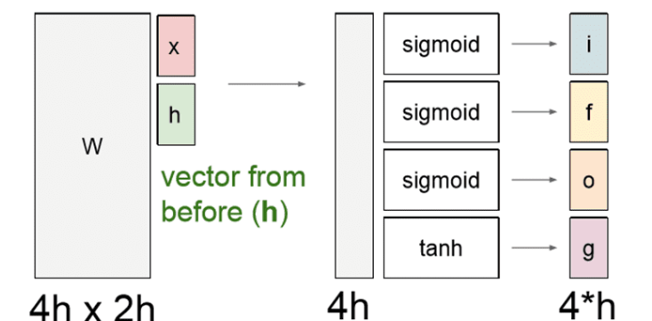
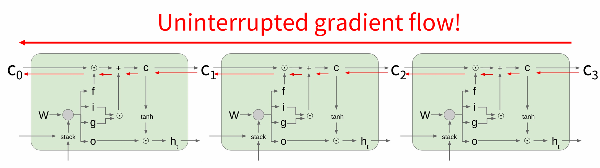

# 🛣Stanford CS231n:Deep Learning for Computer Vision  
---

<script src="https://polyfill.io/v3/polyfill.min.js?features=es6"></script>
<script src="https://cdn.jsdelivr.net/npm/mathjax@3/es5/tex-chtml.js"></script>

!!! info "想说的话🎇"
    
    <font size = 3.5>
    
    🔝课程网站：[https://cs231n.stanford.edu/](https://cs231n.stanford.edu/)
    
    2024版PPT: [https://cs231n.stanford.edu/slides/2024/](https://cs231n.stanford.edu/slides/2024/)
    
    </font>

### Recurrent Neural Networks
---

循环神经网络（Recurrent Neural Networks）是一种特殊的神经网络，可以对序列数据做很好的建模，RNN很灵活，可以实现输入和输出的不同类型:





注意：计算$h_t$的每一步都使用的相同的参数$W$，参数函数$f$也是完全相同的。这样在反向传播计算梯度时，需要将每一个时刻的梯度累加起来得到最终$W$的梯度。

### 截断反向传播（Truncated Backpropagation）
---

在前向传播中需要遍历整个序列累加计算损失，在反向传播中也需要遍历整个序列来计算梯度。我们可以想象一下，如果我们的语料库非常大（例如维基百科中所有文本），那么时间花费以及内存占用都是巨大的



因此我们使用```Truncated Backpropagation```， 不再使用整个序列计算损失，而是使用序列的一个块（如100个时间步）的损失值，然后反向传播计算梯度。

### 图片描述（Image Captioning）
---



我们把测试图像输入到卷积神经网络，通过 CNN 得到模型最后1个全连接层之前的1个图像向量，<B>作为整张图像的内容表征。</B>

然后把这个图像向量作为 RNN 的一个隐藏状态，输出是单词的向量，通过 softmax 得到每个单词的概率分布。


事实上，当输入图像与训练集差距较大时，该模型效果较差

### 多层RNN（Multilayer RNNs）
---

Multilayer RNNs可以看作是多个RNN的堆叠，每一层RNN的输出作为下一层RNN的输入。



### RNN梯度流(Gradient Flow in RNNs)
---

\[
    \begin{aligned}
    h_t &= tanh(W_{hh} h_{t-1} + W_{xh}x_t + b_h)  \\
    &= tanh(
        \begin{pmatrix}
	    W_{hh} \quad  W_{xh}
        \end{pmatrix}
        \begin{pmatrix}
	    h_{t-1}   \\
	    x_t 
        \end{pmatrix}
    )  
    \end{aligned}   
\]



在反向传播中，从$h_t$到$h_{t-1}$需要乘以$W_{hh}^T$,<B>即从最后一个隐状态传到第一个隐状态，中间要乘很多次同一个权重</B>，所以梯度可能会消失或者爆炸。

常使用梯度截断（Gradient clipping）来给梯度设置一个阈值，如果梯度的$L_2$范式超过这个阈值就要减小梯度。


### LSTM（Long Short Term Memory ）
---

LSTM（长短期记忆）网络就是<B>用来解决「梯度爆炸」和「梯度消失」问题的</B>，与其在输出上限制梯度，LSTM 的网络结构更加复杂。




- $i$是输入门（Input gate） ，表示有多少内容被写到单元状态；
     \[
    \mathbf{I}_t = sigmoid(\mathbf{X}_t \mathbf{W}_{xi} + \mathbf{H}_{t-1} \mathbf{W}_{hi} + \mathbf{b}_i)
    \]

- $f$是遗忘门（Forget gate），表示对之前的单元状态的遗忘程度；

    \[
    \mathbf{F}_t = \sigma(\mathbf{X}_t \mathbf{W}_{xf} + \mathbf{H}_{t-1} \mathbf{W}_{hf} + \mathbf{b}_f)    
    \]

- $o$是输出门（Output gate） ，表示单元状态输出多少给隐状态；

    \[
    \mathbf{O}_t = \sigma(\mathbf{X}_t \mathbf{W}_{xo} + \mathbf{H}_{t-1} \mathbf{W}_{ho} + \mathbf{b}_o)
    \]

- $g$是Gate gate ? ，控制写入到单元状态的信息。

    \[
    \tilde{\mathbf{G}}_t = \text{tanh}(\mathbf{X}_t \mathbf{W}_{xc} + \mathbf{H}_{t-1} \mathbf{W}_{hc} + \mathbf{b}_c)
    \]

- 单元状态$\mathbf{C}_t$：

    \[
    \mathbf{C}_t = \mathbf{F}_t \odot \mathbf{C}_{t-1} + \mathbf{I}_t \odot \tilde{\mathbf{G}}_t
    \]

- 隐状态$\mathbf{H}_t$：

    \[
    \mathbf{H}_t = \mathbf{O}_t \odot \text{tanh}(\mathbf{C}_t)    
    \]




### LSTM梯度流
---



从$c_t$到$c_{t-1}$的反向传播过程，只会与$f$进行逐元素相乘，与乘$W$相比要简单很多。

LSTM不同的时间步的遗忘门$f$的值都不同，不像普通 RNN 每次都乘相同的权重矩阵$W$，这样就一定程度避免梯度爆炸或锐减。

训练初始时，一般将$f$设置为1，即$c_t$与$c_{t-1}$相同（记住全部），随着训练的进行，$f$逐渐减小，$c_t$与$c_{t-1}$逐渐不同。


