# 🛣Stanford CS231n:Deep Learning for Computer Vision  
---

<script src="https://polyfill.io/v3/polyfill.min.js?features=es6"></script>
<script src="https://cdn.jsdelivr.net/npm/mathjax@3/es5/tex-chtml.js"></script>

!!! info "想说的话🎇"
    
    <font size = 3.5>
    
    🔝课程网站：[https://cs231n.stanford.edu/](https://cs231n.stanford.edu/)
    
    2024版PPT: [https://cs231n.stanford.edu/slides/2024/](https://cs231n.stanford.edu/slides/2024/)
    
    </font>

###  Sequence to Sequence with RNNs 
---

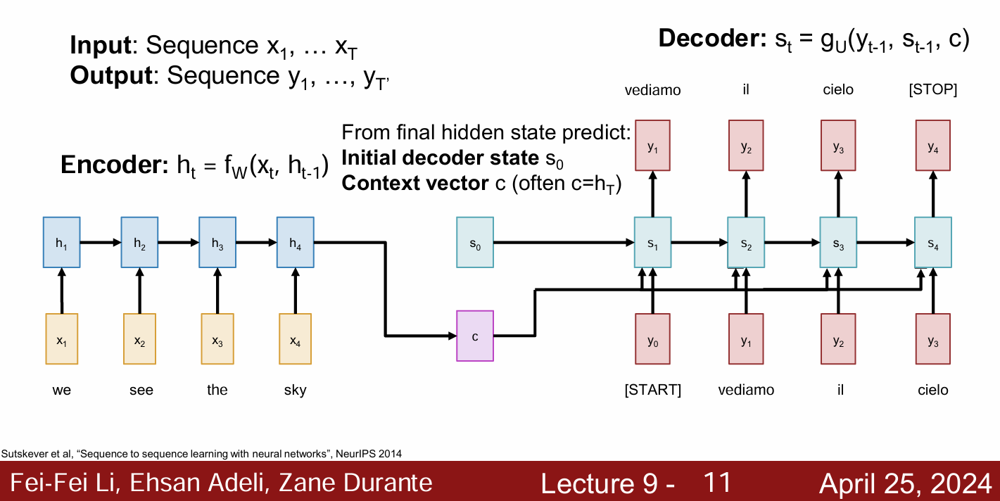

左侧的RNN（Encoder：$h_t=f_w(x_t,h_{t-1})$）将输入序列编码总结成2个向量（$s_0$，$c$），$s_0$作为解码器的初始状态(initial decoder state,或者设置为0)，$c$作为解码器的上下文向量（Context vector，tansfer encoded sequence information to the decoder）。

右侧的RNN(decoder)将这个向量解码成输出序列。

- During Training:
    在训练网络过程中，每次不使用上一个state的输出作为下一个state的输入，而是直接使用训练数据的标准答案(ground truth)的对应上一项作为下一个state的输入,不管输出是否正确（teacher-forcing）

    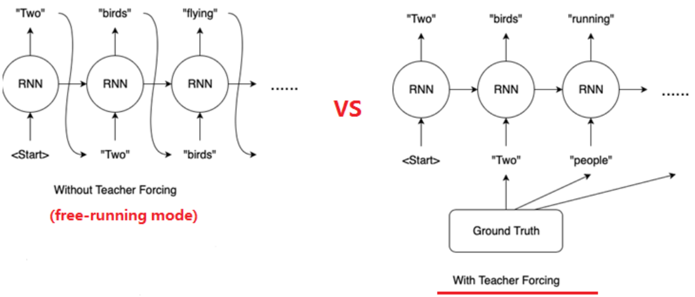

- During Test-time:

    我们从输出中进行抽样，直到抽中```[STOP]```

显然，这个Seq2seq模型并不适用于长文本任务
，因为如果输入序列过长，基于RNN的编码器没有能力去捕捉足够的信息，导致解码器无法生成准确的输出。并且，希望用单一的上下文向量$c$去总结整个长序列信息，显然是不现实的。

我们可以想象一种算法，不是使用单个的上下文向量$c$，
而是在decoder的每个时间步中计算一个上下文向量，即给予decoder专注于输入序列的不同部分，选择或者重建一个新的上下文向量的能力。

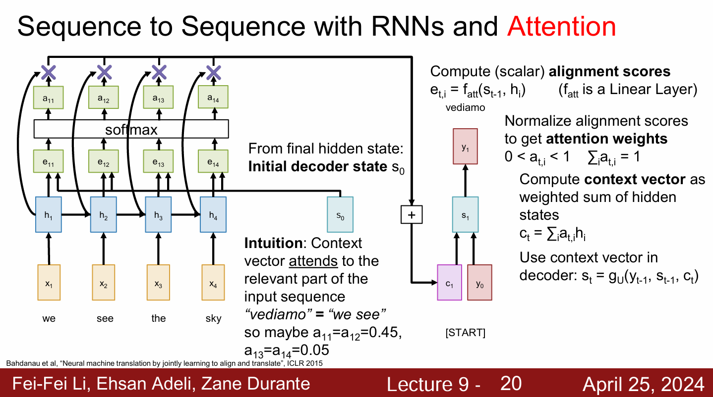

如上，我们编写一个对齐函数$f_{att}$（alignment function，通常为MLPs），将Encoder的隐藏状态与$s_0$输入得到alignment scores（how much should we attend to each hidden state of encoder），然后使用softmax函数归一化得到权重$a_{t,i}$（attention weights）。

得到权重后，我们使用加权求和得到上下文向量$c_t$，即：
$$
c_t=\sum_{i=1}^{T_x}a_{t,i}h_i
$$
> 其中，$a_{t,i}$表示第$t$个decoder的隐藏状态对第$i$个encoder的隐藏状态$h_i$的注意力权重。

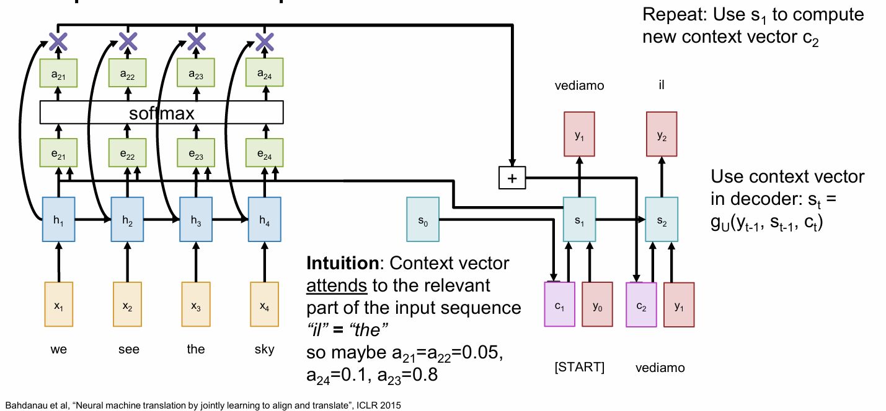

接下来重复这个过程，将下一个时间步的状态$s_1$与Encoder的各个$h_t$输入$f_{att}$,得到$c_2$，以此类推。

因此：

-  输入序列的信息传递不会受单一上下文向量的阻碍

- Decoder的每个时间步都能够“查看”输入序列的不同部分，从而能够生成更高质量的输出序列。

对于计算得到的概率分布$a_{t,i}$进行矩阵可视化，可以看到decoder输出的每个单词关注了输入序列的不同部分：

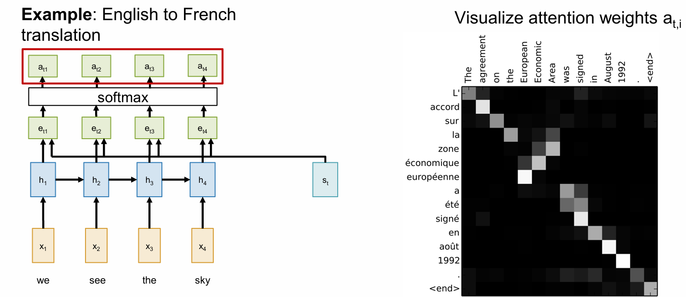

我们将两种语言的单词进行对应，可以发现attention机制很好地捕捉到了两种语言中同义单词之间的对应关系：

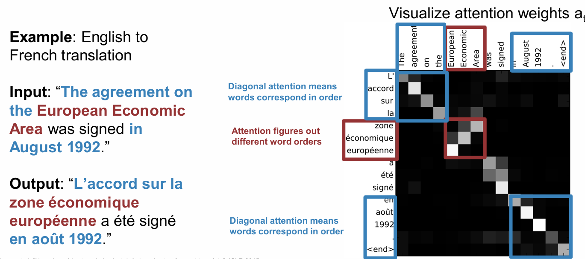

事实上，attention机制并不关心输入是否是一个顺序序列（ordered sequence ），而是对整个输入序列进行“注意”。

### Image Captioning with RNNs and Attention
---

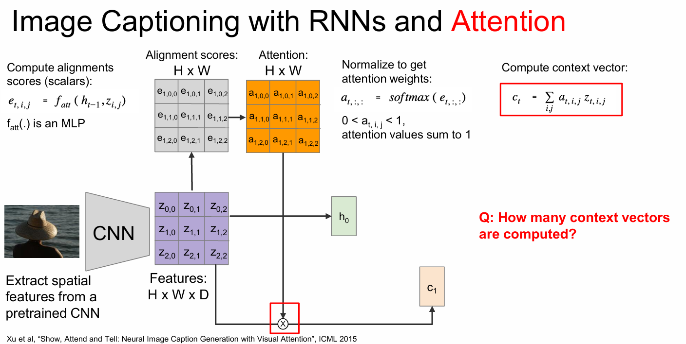

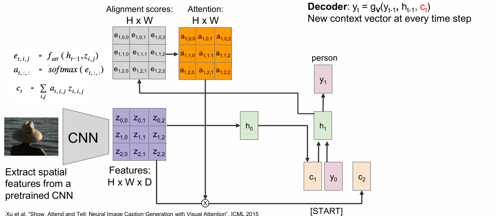

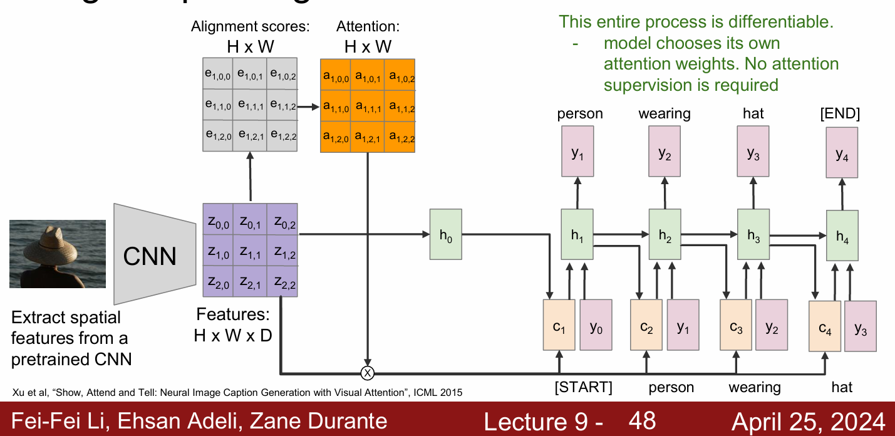

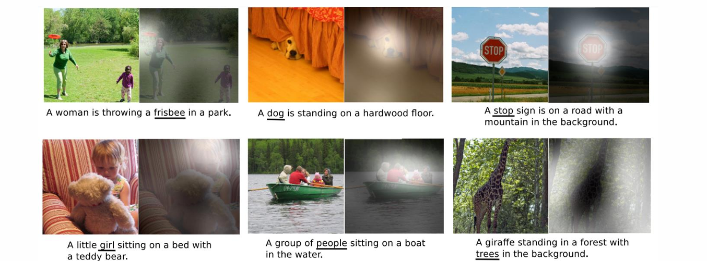

### General Attention Layer
---

我们先对image captioning中的attention机制进行总结：

<B>Input</B>:

- Features: $\mathbf{z}$ (shape：H x W x D)

- Query：$\mathbf{h}$ (shape：D)

$D$表示特征图数

<B>Operations</B>:

- Alignment func: $e_{i,j} = f_{att}(\mathbf{z}_{i,j}, \mathbf{h})$ (shape: H x W)

- Attention weights: $\mathbf{a} = softmax(\mathbf{e})$ (shape: H x W)

<B>Outputs:</B>

- Context vector: $c = \sum_{i=1}^{H}\sum_{j=1}^{W}a_{i,j}\mathbf{z}_{i,j}$ (shape: D)

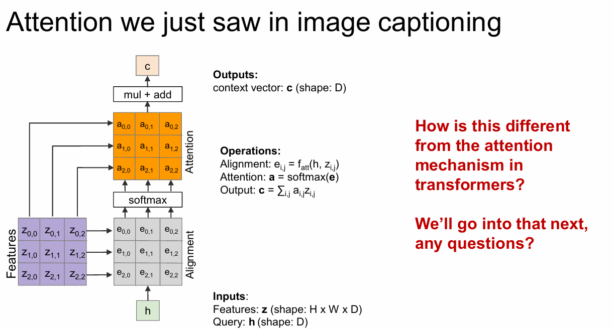

前面我们提及到，attention机制不关注输入数据的顺序，因此我们将input vectors拉伸成$\mathbf{x}$（shape: N x D），其中$N = H \times W$。

> 理解：将$H \times W$展开成$N$，即输入的信息共有$N$个向量，每个向量的维度为$D$。如果是图像的话，$N$个向量的其中一个对应原图片的某一块（感受野）；如果是文本序列的话，$N$个向量的其中一个对应文本序列中的某个输入语句/单词。如下图，输入的是200个序列，每个序列长度为800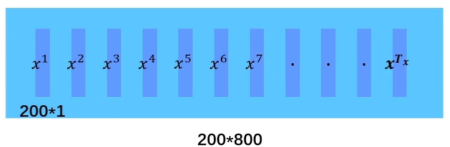


对于$f_{att}$函数，我们将其定义为点积操作(dot product)，即：
$$
e_i = h \cdot x_i
$$

也可以使用缩放点积(scaled dot product)：

$$
e_i = \frac{h \cdot x_i}{\sqrt{D}}
$$

改用scaled dot product的理由：

> We suspect that for large values of $d_k$, the dot products grow large in magnitude, pushing the softmax function into regions where it has extremely samll gradients.

当输入信息的维数$d$很大时，点积所得（dot product）的值由很多项相加而成，通常会有比较大的方差。

假设上述的$h$与$x$(上文的$x_i$向量)相互独立且均值为0，方差为1

$$
\mathbf{E} [h_i] = \mathbf{E} [x_i] = 0 
$$

$$
\mathbf{Var} [h_i] = \mathbf{E} [h_i^2] - (\mathbf{E} (h_i))^2 = \mathbf{E} [h_i^2] = 1\\
$$

$$
\mathbf{Var} [x_i] = \mathbf{E} [x_i^2] - (\mathbf{E} (x_i))^2 = \mathbf{E} [x_i^2] = 1
$$

因为$h_i$与$x_i$相互独立，所以：

$$
\mathbf{Cov}(h_i,x_i) = \mathbf{E} [ (h_i-\mathbf{E} [h_i]) (x_i-\mathbf{E} [x_i]) ] 
$$

$$
= \mathbf{E}[h_i x_i] - \mathbf{E}[h_i] \mathbf{E}[x_i]= 0
$$

因此：$\mathbf{E}[h_i x_i] = \mathbf{E}[h_i] \mathbf{E}[x_i]= 0$


可得：

$$
\mathbf{Var} (h_i \cdot x_i) = \mathbf{E} [(h_i \cdot x_i)^2] - (\mathbf{E} [h_i \cdot x_i])^2 
$$

$$
= \mathbf{E} [(h_i \cdot x_i)^2] = \mathbf{E} [h_i^2] \mathbf{E} [x_i^2]\\
$$

$$
= \mathbf{Var}(h_i) \mathbf{Var}(x_i) = 1
$$

综上：

$$
\mathbf{Var}(h \cdot x) = \sum_{i=1}^D  \mathbf{Var} (h_i \cdot x_i) = D
$$

因此，当$d$很大时，$h \cdot x$方差的值也会变大

而对于softmax函数，有：

$$
Softmax(x_i) = \frac{e^{x_i}}{\sum_{j=1}^N e^{x_j}} \\
$$

$$
\frac{\partial S(x_i)}{\partial x_i} = Softmax(x_i) (1 - Softmax(x_i))
$$

因此，当$d$很大时，得到的$x_i$可能出现极大/极小的情况，导致计算的梯度值会趋近于0，引起梯度消失。

若使用缩放点积(scaled dot product)，则可以使得方差缩小为1：

$$
\mathbf{Var} (\frac{h \cdot x}{\sqrt{D}}) = \frac{1}{D} \mathbf{Var}(h \cdot x) = \frac{1}{D} \times D = 1
$$

这时，softmax 函数的梯度就不容易趋近于零了，因此使用缩放点积(scaled dot product)可以避免梯度消失的问题。

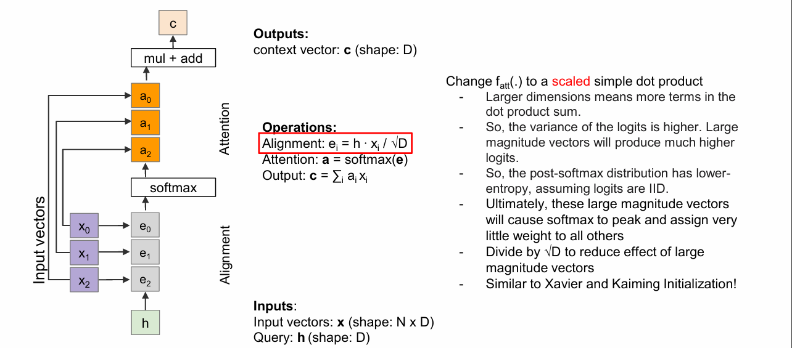

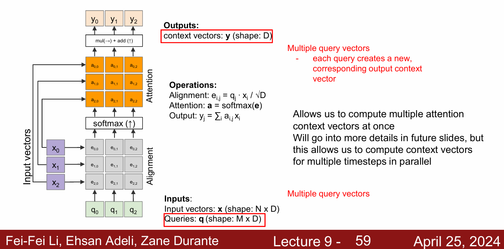

实际上，Decoder的每个时间步都对应一个query vectort（注意力不同），因此我们需要将拓展为$\mathbf{q}$（shape：M x D）

$\mathbf{e} = \mathbf{q} \mathbf{Z^T}$（shape：M x N）


对应的，$\mathbf{a} = Softmax(\mathbf{e},dim=1)$ （shape：M x N）

> shape：M x N，即一共M个query vector产生的权重向量$\mathbf{a_j}，j=1,2,..,M$，每个权重向量中有N个权重（对输入的N个信息的不同注意力）$a_{i,j}，i = 1,2,...,N$

Output context vectors ：$Y = \mathbf{a} \mathbf{X}$ （shape：M x D），$y_i = \sum_j a_{i,j} x_j$（输入向量的加权组合）

回顾上述计算过程，我们使用query vector与input vector计算注意力权重，然后使用注意力权重对input vector进行加权求和，得到Output context vectors。这个过程中在两个不同功能上使用了input vector。

我们可以通过添加不同的FC层来从input vector中得到key vector与value vector，从而实现更复杂（add more expressivity）的注意力机制。

- key vector: $k = xW_k$，（shape of $W_k：D \times D_k$）（shape of $k：N \times D_k$）

- value vector: $v = xW_v$，（shape of $W_v：D \times D_v$）（shape of $v：N \times D_v$）

相应的，query vectors：$\mathbf{q}$的shape为：$M \times D_k$


$\mathbf{e} = \mathbf{q} k^T$，（shape of $e：M \times N$）, 

$e_{i,j} = \mathbf{q_i} k_j^T / \sqrt{D_k}$ (k的特征数为$D_k$)

$Y = \mathbf{a} v$，（shape of $e：M \times D_v$）

$y_j = \sum_i a_{i,j} v_i， j=1,2,...,M$

引入了key vector与value vector后，我们就可以改变输出的维度了，这使得模型更加灵活。

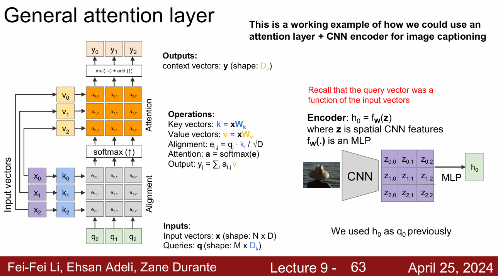


### Self-attention Layer
---

事实上，我们可以从input vectors计算出query vectors，从而定义一个“自注意力”层。(Self-attention)

通过FC层，我们从input vectors计算出query vectors:

- Query vectors: $\mathbf{q} = xW_q$，（shape of $W_q：D \times D_k$）（shape of $q：N \times D_k$）

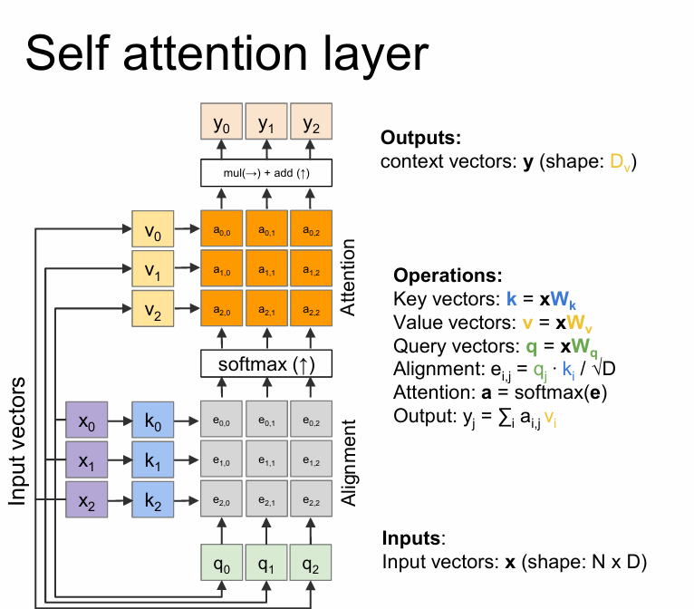

由于attention机制并不关心输入的顺序，即拥有“置换等变”（ Permutation equivariant）的特性，倘若更换输入向量的次序，只是会改变输出的顺序，而不会改变输出的内容。但显然，输入信息的前后顺序对语义影响极大。

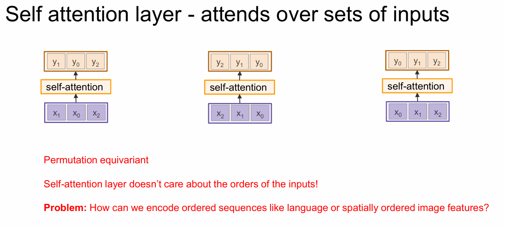

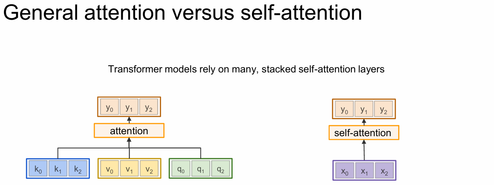


### Positional encoding
---

为了具有位置感知能力，我们可以将输入与位置编码连接起来

而Positional Encoding（位置编码）技术通过为每个单词添加一个额外的编码来表示它在序列中的位置，这样模型就能够理解单词在序列中的相对位置。


### Masked self-attention layer(掩码自注意力)
---

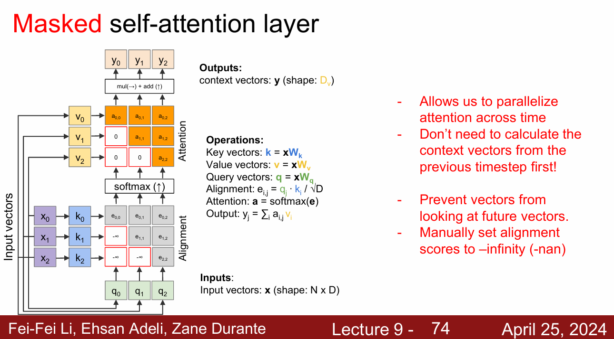


### Multi-head self-attention layer
---
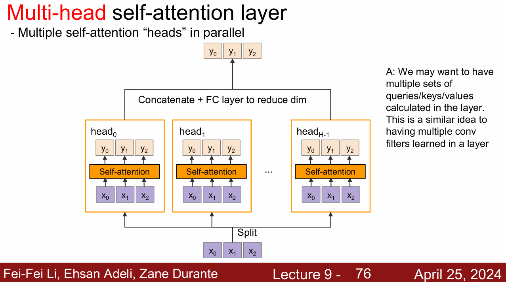

### Image Captioning using Transformers
---
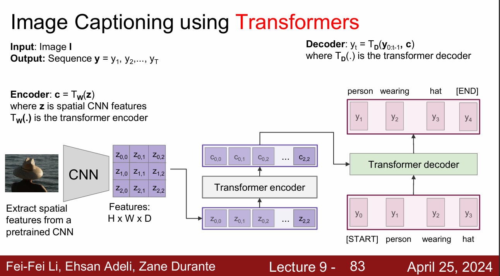

### The Transformer encoder block
---

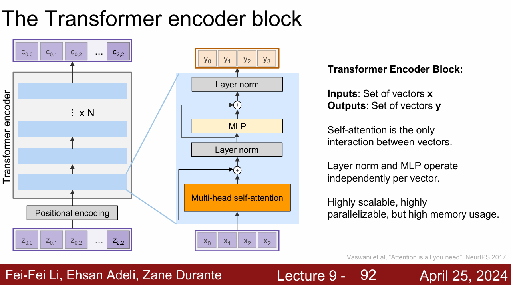
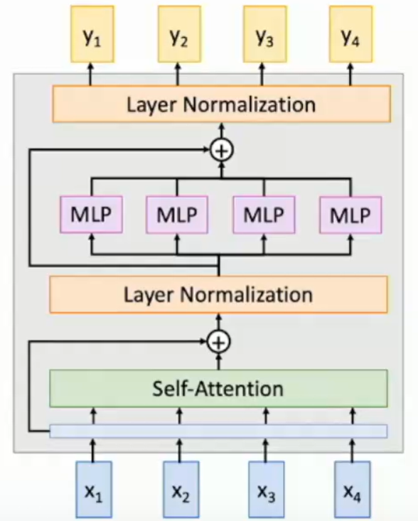

### The Transformer decoder block
---

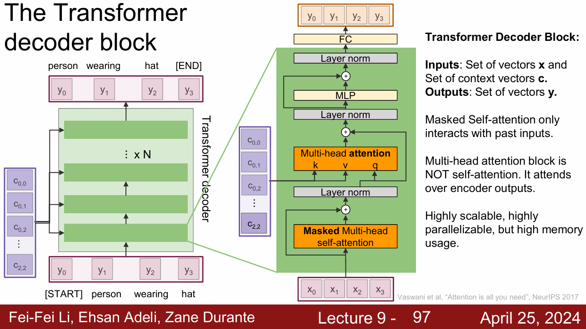
