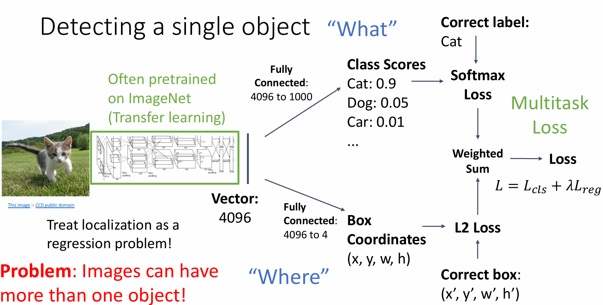
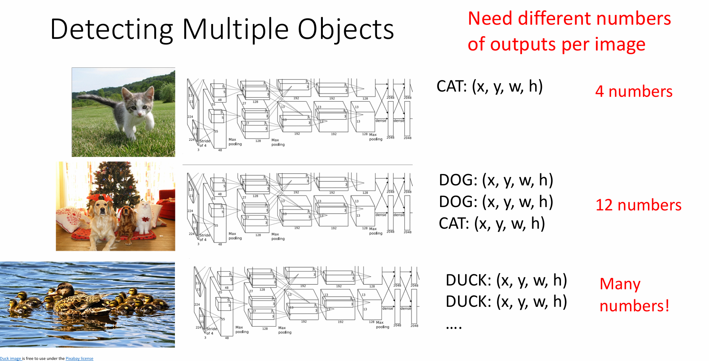
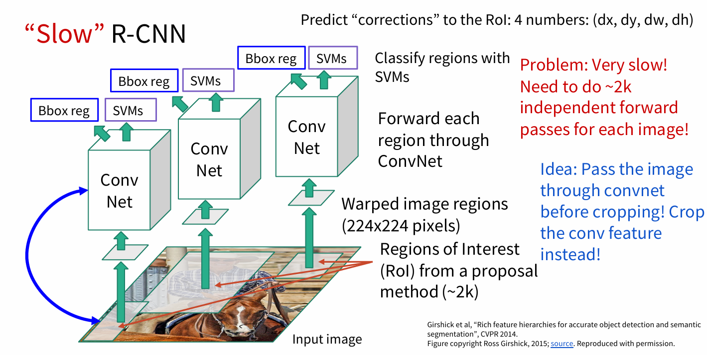

# 🛣Stanford CS231n:Deep Learning for Computer Vision  
---

!!! info "想说的话🎇"
    
    
    
    🔝课程网站：[https://cs231n.stanford.edu/](https://cs231n.stanford.edu/)
    
    2024版PPT: [https://cs231n.stanford.edu/slides/2024/](https://cs231n.stanford.edu/slides/2024/)
    
    

### Object Detection
---

目标检测的基本思路是：解决定位（localization） + 识别（Recognition） 

### R-CNN：Region-based Convolutional Neural Networks
---

R-CNN核心思想： 对每张图片选取多个区域(Region Proposal)，然后每个区域作为一个样本进入一个卷积神经网络来抽取特征。

- 利用选择性搜索 Selective Search 算法在图像中从下到上提取2000个左右的可能包含物体的候选区域 (Region Proposal)

- 因为获取到的候选区域大小各不相同，所以需要将每个 Region Proposal 缩放(warp)成统一的227x227的大小并输入到CNN，将CNN的 fc7 层的输出作为特征

- 将每个 Region Proposal 提取到的CNN特征输入到SVM进行分类

- 使用这些区域特征来训练线性回归器对区域位置进行调整

显然，RCNN训练计算量很大，并且Selective search提取的区域质量不够好，特征提取与后续SVM分类器是独立训练的，没有联合优化，且训练耗时长。

