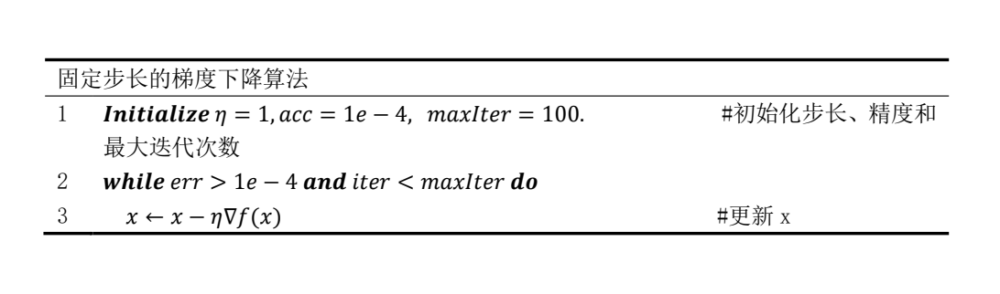

# 🔗<B>Chapter 1：linear regression and multilayer perceptron</B>
<script src="https://polyfill.io/v3/polyfill.min.js?features=es6"></script>
<script src="https://cdn.jsdelivr.net/npm/mathjax@3/es5/tex-chtml.js"></script>

## 线性回归
---

### 线性回归的表示

线性回归(linear regression)基于几个简单假设：

- 自变量$\mathbf{x}$与因变量$y$之间的关系是线性的，即$y$可以表示为$\mathbf{x}$中元素的加权和:

    \[
        \hat{y} = \mathbf{w}^\intercal \mathbf{x} + b         
    \]

    对于多维数据$\mathbf{X} \in \mathbb{R}^{n \times d}$，即n个样本，d种特征：

    \[
        {\hat{\mathbf{y}}} = \mathbf{X} \mathbf{w} + b
    \]


- 允许观测值中存在噪声，假设任何噪声都比较正常，如噪声遵循正态分布。

### 损失函数

对于真实样本数据集，其中的$\mathbf{x}$与$y$之间不可能具有标准的线性关系，因此需要一个<B>确定一个拟合程度的度量</B>,即损失函数（loss function），来<B>量化目标的实际值与预测值之间的差距</B>。对于回归问题通常使用平方误差函数（MSE）作为损失函数：

\[
    L(\mathbf{w}, b) =\frac{1}{n} \sum_{i=1}^n \left(\hat{y}^{(i)} - y^{(i)}\right)^2 =\frac{1}{n} \sum_{i=1}^n \left(\mathbf{w}^\intercal \mathbf{x}^{(i)} + b - y^{(i)}\right)^2
\]

即我们希望寻找到最优的权重与偏置$(\mathbf{w}^*, b^*) = \operatorname*{argmin}_{\mathbf{w}, b}\  L(\mathbf{w}, b)$，来使得总损失最小(与真实值的差距小)。

### 随机梯度下降法

梯度下降法（gradient descent）在损失函数减小的方向上更新参数来降低误差：



\[
    (\mathbf{w},b) \leftarrow (\mathbf{w},b) - \eta \sum_{i =1}^n \partial_{(\mathbf{w},b)} l^{(i)}(\mathbf{w},b).   
\]

因为传统的梯度下降法需要遍历整个数据集，在实际的执行中可能会较慢，因此可以在每一次更新权重时随机抽取一小批样本来计算更新，这种变体为小批量随机梯度下降法(minibatch stochastic gradient descent),假设从数据集中随机抽取一个小批量$\mathcal{B}$：

\[
\begin{split}
\begin{aligned} 
\mathbf{w} &\leftarrow \mathbf{w} -   \frac{\eta}{|\mathcal{B}|} \sum_{i \in \mathcal{B}} \partial_{\mathbf{w}} l^{(i)}(\mathbf{w}, b) = \mathbf{w} - \frac{\eta}{|\mathcal{B}|} \sum_{i \in \mathcal{B}} \mathbf{x}^{(i)} \left(\mathbf{w}^\top \mathbf{x}^{(i)} + b - y^{(i)}\right),    \\ 
b &\leftarrow b -  \frac{\eta}{|\mathcal{B}|} \sum_{i \in \mathcal{B}} \partial_b l^{(i)}(\mathbf{w}, b)  = b - \frac{\eta}{|\mathcal{B}|} \sum_{i \in \mathcal{B}} \left(\mathbf{w}^\top \mathbf{x}^{(i)} + b - y^{(i)}\right).  \\
\end{aligned}
\end{split}
\]

其中$|\mathcal{B}|$为表示每个小批量中的样本数，即批量大小（batch size）

> 即使数据集是完美符合线性且无噪声，通过梯度下降法得到的估计值也不会使损失函数真正地达到最小值：因为算法会使得损失向最小值缓慢收敛，但却不能在有限的步数内非常精确地达到最小值。

### 线性回归的解析解

对于线性回归任务，我们的目标是最小化$\|\mathbf{y} - \mathbf{X}\mathbf{w}\|^2$，对于${\hat{\mathbf{y}}} = \mathbf{X} \mathbf{w} + b$：

\[
    \begin{aligned}
    \|\mathbf{y} - \mathbf{X}\mathbf{w}\|^2 =& (\mathbf{y} - \mathbf{X}\mathbf{w})^\intercal (\mathbf{y} - \mathbf{X}\mathbf{w}) =  (\mathbf{y}^\intercal - \mathbf{w}^\intercal \mathbf{X}^\intercal) (\mathbf{y} - \mathbf{X}\mathbf{w}) \\
    =& \mathbf{y}^\intercal \mathbf{y} + \mathbf{w}^\intercal \mathbf{X}^\intercal \mathbf{X}\mathbf{w} - \mathbf{y}^\intercal \mathbf{X}\mathbf{w} - \mathbf{w}^\intercal \mathbf{X}^\intercal \mathbf{y} \\
    =& \mathbf{y}^\intercal \mathbf{y} + \mathbf{w}^\intercal \mathbf{X}^\intercal \mathbf{X}\mathbf{w} - 2 \mathbf{y}^\intercal \mathbf{X}\mathbf{w} \\
    \end{aligned}      
\]

为求极值，使$\nabla_{\mathbf{w}} \|\mathbf{y} - \mathbf{X}\mathbf{w}\|^2 = 0$,有：

\[
    \nabla_{\mathbf{w}} \|\mathbf{y} - \mathbf{X}\mathbf{w}\|^2 = 2 \mathbf{X}^\intercal \mathbf{X}\mathbf{w} - 2 \mathbf{X}^\intercal \mathbf{y}    
\]

可得：

\[
    \mathbf{w}^* = (\mathbf X^\intercal \mathbf X)^{-1}\mathbf X^\intercal \mathbf{y}    
\]

### 线性回归的基础实现

为了实现一个完整的线性回归模型，我们需要生成数据、构建模型、损失函数和小批量随机梯度下降优化器，本节来实现一个最基础的线性回归模型：

- 生成一个带噪声的数据集

```python

def CreatData(features, num_examples, w, b):
    X = torch.normal(0, 1, size = (num_examples, features))
    y = torch.matmul(w, X.T) + b + torch.normal(0, 0.1, size=(1, num_examples))
    return X, y.reshape((-1,1))

```

- 构建线性回归模型以及损失函数

```python

def LinearRegression(X, w, b):
    y_hat = torch.matmul(w, X.T) + b 
    return y_hat.reshape(-1, 1) 

def MSELossfunction(y_hat, y):
    return (y - y_hat) ** 2

```

- 小批量随机梯度下降

```python

def Dataiter_RandomBatch(batch_size, features, labels):   # 迭代器
    num = len(features)
    numlist = [i for i in range(0, num)]
    random.shuffle(numlist)
    for k in range(0, num, batch_size):
        RandomBatch = numlist[k:min(k + batch_size, num)]
        yield features[RandomBatch], labels[RandomBatch]

def SGD(params, alpha, batch_size):
    with torch.no_grad():
        for param in params:
            param -= alpha * param.grad / batch_size
            param.grad.zero_()

```

- 程序主体

```python

w_0 = torch.tensor([1, 3, 2, 4, 5, 6], dtype=torch.float)
b_0 = 5.5

num_examples = 100 
features = len(w_0)

X,y = CreatData(features, num_examples, w_0, b_0)

w = torch.normal(mean = 0, std = 1, size = w_0.shape, requires_grad=True)
b = torch.zeros(1, requires_grad=True)

num_epochs = 50
alpha = 0.01
batch_size = 10

for epoch in range(num_epochs):    
    for X_batch, y_batch in Dataiter_RandomBatch(batch_size, X, y):
        loss = MSELossfunction(y_batch, LinearRegression(X_batch, w, b))
        loss.sum().backward()
        SGD([w, b], alpha, batch_size)  
    with torch.no_grad():
        train_loss = MSELossfunction(LinearRegression(X, w, b), y)
        print(f'epoch {epoch + 1}, loss {float(train_loss.mean()):f}')


print(f'w的估计误差: {w_0 - w}')
print(f'b的估计误差: {b_0 - b}')

```

!!! advice "对于loss.sum().backward()的理解"
    
    <font size = 3>
    出处： [https://zhuanlan.zhihu.com/p/427853673](https://zhuanlan.zhihu.com/p/427853673)

    ```python

    for epoch in range(num_epochs):
        for X, y in data_iter(batch_size, features, labels):
            l = loss(net(X, w, b), y)  # `X`和`y`的小批量损失
            # 因为`l`形状是(`batch_size`, 1)，而不是一个标量。`l`中的所有元素被加到一起，
            # 并以此计算关于[`w`, `b`]的梯度
    --------------------------------------------------------------
            l.sum().backward()
    --------------------------------------------------------------
            sgd([w, b], lr, batch_size)  # 使用参数的梯度更新参数
        with torch.no_grad():
            train_l = loss(net(features, w, b), labels)
            print(f'epoch {epoch + 1}, loss {float(train_l.mean()):f}')

    ```
    如果Tensor 是一个标量(即它包含一个元素的数据)，则不需要为 backward() 指定任何参数，但是如果它有更多的元素，则需要指定一个 gradient 参数，该参数是形状匹配的张量。本代码中l为矩阵，需要l.sum()转化为标量后再.backward()。
    
    </font>

!!! info "pytorch中自加（+=）与普通加的区别" 
    
    <font size = 3>
    出处： [https://blog.csdn.net/senbinyu/article/details/102634505](https://blog.csdn.net/senbinyu/article/details/102634505)
    
    讨论pytorch中x= x + a 与 x += a（自加）的区别，在于内存地址

    ```python

    a = torch.tensor([1.0])
    id_a = id(a)
    a += 1

    id(a) == id_a  #---> True

    a = a + 1

    id(a) == id_a  #---> False

    ```

    为了方便进行原位操作，Pytorch中的函数可以在调用之后加下划线 ，强调这是进行原位操作
    </font>

### 线性回归的简洁实现

- 定义模型以及数据集迭代器，初始化模型参数

```python

dataset = data.TensorDataset(features, labels)
dataLoader = data.DataLoader(dataset, batch_size, shuffle=True)

net = nn.Sequential(nn.Linear(2, 1))
net[0].weight.data.normal_(0, 0.01)
net[0].bias.data.fill_(0)

loss = nn.MSELoss()
trainer = torch.optim.SGD(net.parameters(), lr=0.03)

```

- 训练过程

```python

num_epochs = 3
for epoch in range(num_epochs):
    for X, y in dataLoader:
        l = loss(net(X) ,y)
        trainer.zero_grad()
        l.backward()
        trainer.step()
    l = loss(net(features), labels)
    print(f'epoch {epoch + 1}, loss {l:f}')

w = net[0].weight.data
print('w的估计误差：', true_w - w.reshape(true_w.shape))
b = net[0].bias.data
print('b的估计误差：', true_b - b)

```