# 🔗<B>Chapter 2：convolutional neural network</B>
<script src="https://polyfill.io/v3/polyfill.min.js?features=es6"></script>
<script src="https://cdn.jsdelivr.net/npm/mathjax@3/es5/tex-chtml.js"></script>

## 自定义块
---

### 块的基本功能

- 将输入数据作为其前向传播函数的参数;

- 通过前向传播函数来生成输出;

- 计算其输出关于输入的梯度，可通过其反向传播函数进行访问(自动发生)。

- 存储和访问前向传播计算所需的参数

```python
import torch
from torch import nn
from torch.nn import functional as F

class MLP(nn.Module):
    def __init__(self):
        super().__init__()
        self.hidden = nn.Linear(20,256)
        self.out = nn.Linear(256, 10)
    def forward(self, X_input):
        return self.out(F.relu(self.hidden(X_input)))

if __name__ == '__main__':
    X = torch.randn(20)
    net = MLP()
    y = net(X)
```

!!! advice "实现一个块，它以两个块为参数，并返回前向传播中两个网络的串联输出。这也被称为平行块"

    <font size = 3>
    ```python
    class Net(nn.Module):
        def __init__(self, net1, net2):
            super().__init__()
            self.Net_1 = net1
            self.Net_2 = net2
        def forward(self, X):
            X = torch.cat((self.Net_1(X), self.Net_2(X)), 1)
            return X

    net0 = Net(nn.Linear(20,3), nn.Linear(20,6))
    ```
    </font>

### 参数管理
---

```python
import torch
from torch import nn

net = nn.Sequential(nn.Linear(4, 8), nn.ReLU(), nn.Linear(8, 1))
X = torch.rand(size=(2, 4))
net(X)

print(net[2].state_dict()) 
# .state_dict()获取模型参数状态的方法。‌返回一个字典对象，‌其中包含了模型中所有的参数和对应的值
>>> OrderedDict([('weight', tensor([[-0.0427, -0.2939, -0.1894,  0.0220, -0.1709, -0.1522, -0.0334, -0.2263]])), ('bias', tensor([0.0887]))])

print(type(net[2].bias))  # <class 'torch.nn.parameter.Parameter'>
print(net[2].bias)
# Parameter containing:
# tensor([0.0345], requires_grad=True)
print(net[2].bias.data)
# tensor([0.0345])
print(net.state_dict()['2.bias'].data)
# tensor([0.0345])
```

### 一次性访问所有参数

```python
print(*[(name, param.shape) for name, param in net[0].named_parameters()])
print(*[(name, param.shape) for name, param in net.named_parameters()])

>>> ('weight', torch.Size([8, 4])) ('bias', torch.Size([8]))
>>> ('0.weight', torch.Size([8, 4])) ('0.bias', torch.Size([8])) ('2.weight', torch.Size([1, 8])) ('2.bias', torch.Size([1]))
```

### 从嵌套块收集参数

```python
def block1():
    return nn.Sequential(nn.Linear(4, 8), nn.ReLU(),
                         nn.Linear(8, 4), nn.ReLU())
def block2():
    net = nn.Sequential()
    for i in range(4):
        net.add_module(f'block {i}', block1())
    return net

rgnet = nn.Sequential(block2(), nn.Linear(4, 1))
rgnet(X)

print(rgnet)

>>> Output:
Sequential(
  (0): Sequential(
    (block 0): Sequential(
      (0): Linear(in_features=4, out_features=8, bias=True)
      (1): ReLU()
      (2): Linear(in_features=8, out_features=4, bias=True)
      (3): ReLU()
    )
    (block 1): Sequential(
      (0): Linear(in_features=4, out_features=8, bias=True)
      (1): ReLU()
      (2): Linear(in_features=8, out_features=4, bias=True)
      (3): ReLU()
    )
    (block 2): Sequential(
      (0): Linear(in_features=4, out_features=8, bias=True)
      (1): ReLU()
      (2): Linear(in_features=8, out_features=4, bias=True)
      (3): ReLU()
    )
    (block 3): Sequential(
      (0): Linear(in_features=4, out_features=8, bias=True)
      (1): ReLU()
      (2): Linear(in_features=8, out_features=4, bias=True)
      (3): ReLU()
    )
  )
  (1): Linear(in_features=4, out_features=1, bias=True)
)

rgnet[0][1][0].bias.data # 第一个主要的块中、第二个子块的第一层的偏置项
>>> tensor([ 0.1999, -0.4073, -0.1200, -0.2033, -0.1573,  0.3546, -0.2141, -0.2483])
```

可以像通过嵌套列表索引一样访问它们

### 自定义初始化

如我们可以自定义设置权重初始化参数的分布为：

\[
    \begin{split}
    \begin{aligned}
    w \sim \begin{cases}
        U(5, 10) & \text{ 可能性 } \frac{1}{4} \\
            0    & \text{ 可能性 } \frac{1}{2} \\
        U(-10, -5) & \text{ 可能性 } \frac{1}{4}
    \end{cases}
    \end{aligned}
    \end{split}    
\]

```python
def my_init(m):
    if type(m) == nn.Linear:
        print("Init", *[(name, param.shape)
                        for name, param in m.named_parameters()][0])
        nn.init.uniform_(m.weight, -10, 10)
        m.weight.data *= m.weight.data.abs() >= 5
        # 将权重数据中绝对值大于等于5的部分保留下来，而小于5的部分置为0

net.apply(my_init)
```

### 参数绑定/共享参数

```python
# 给共享层一个名称shared，以便可以引用它的参数
sharedNet = nn.Linear(8, 8)
net = nn.Sequential(nn.Linear(4, 8), nn.ReLU(),
                    sharedNet, nn.ReLU(),
                    sharedNet, nn.ReLU(),
                    nn.Linear(8, 1))
```

!!! advice "当参数绑定时，梯度会发生什么情况？"
    
    由于模型参数包含梯度，因此在反向传播时共享的参数梯度会叠加

### 自定义层
---

```python
class MyLinear(nn.Module):  # 自定义全连接层
    def __init__(self, in_units, units): # 输入参数：in_units和units（输入数和输出数）
        super().__init__()
        self.weight = nn.Parameter(torch.randn(in_units, units))
        self.bias = nn.Parameter(torch.randn(units,))
        # 需要两个参数，一个用于表示权重，另一个用于表示偏置项

    def forward(self, X):
        linear = torch.matmul(X, self.weight.data) + self.bias.data
        return F.relu(linear)
```

## 卷积神经网络
---

```nn.Conv2d(in_channels=, out_channels=, kernel_size=, stride=, padding=)```

- in_channels, out_channels指定输入输出通道数

- kernel_size 卷积核形状

- stride 步幅设置为2

- padding 填充操作

### 多输入通道

当输入包含多个通道时(输出通道为1)，需要构造一个与输入数据具有相同输入通道数的卷积核，以便与输入数据进行互相关运算。假设输入的通道数为$c_i$，那么卷积核的输入通道数也需要为$c_i$。如果卷积核的窗口形状是$k_h\times k_w$，则该卷积核的总体形状为$c_i\times k_h\times k_w$。

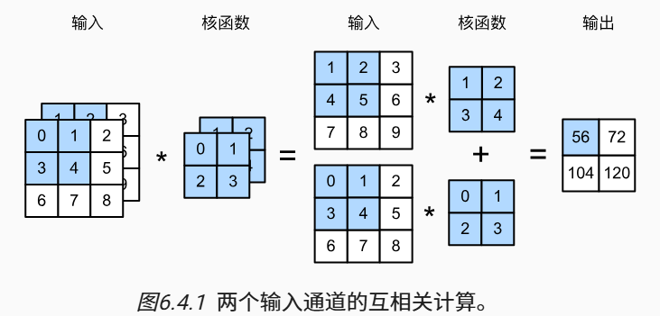

### 多输出通道

当输出通道的数目为$c_0$时，我们可以为每个输出通道创建一个形状为$c_i\times k_h\times k_w$的卷积核张量,则卷积核的形状为$c_o\times c_i\times k_h\times k_w$。

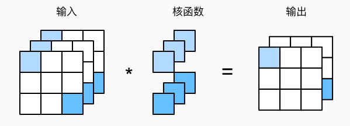


## 汇聚层

```python
X = torch.arange(16, dtype=torch.float32).reshape((1, 1, 4, 4)) # 四个维度: [batch_size, channel, height, width]
>>>tensor([[[[ 0.,  1.,  2.,  3.],
              [ 4.,  5.,  6.,  7.],
              [ 8.,  9., 10., 11.],
              [12., 13., 14., 15.]]]])

pool2d = nn.MaxPool2d((2, 3), stride=(2, 3), padding=(0, 1))
# 设定一个任意大小的矩形汇聚窗口，并分别设定填充和步幅的高度和宽度
```

## 经典卷积神经网络
---

### AlexNet

!!! info "AlexNet" 
    <font size = 3>
    相关论文：[ImageNet Classification with Deep Convolutional Neural Networks](https://proceedings.neurips.cc/paper_files/paper/2012/file/c399862d3b9d6b76c8436e924a68c45b-Paper.pdf)

    AlexNet是深度学习浪潮的奠基之作，发布于2012年，他首次把深度卷积神经网络应用在大规模图像分类上，可以说为后续整个计算机视觉和深度卷积网络的发展奠定了基础。

    参考学习：[https://zhuanlan.zhihu.com/p/683888262](https://zhuanlan.zhihu.com/p/683888262)
    
    </font>

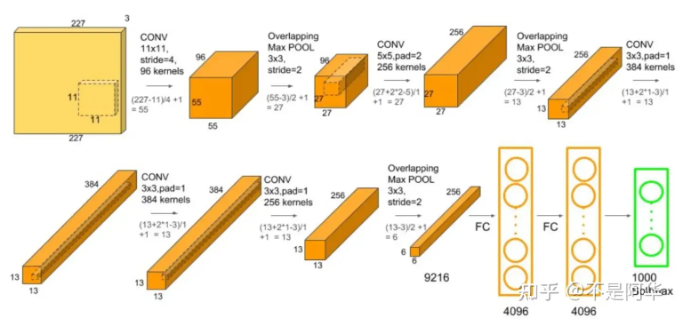

AlexNet网络特点

- 提出了非饱和神经元 ReLU 减小 梯度下降 的训练时间

    > 饱和即很大或很小的x经过激活函数之后差别会变小。饱和的激活函数会导致梯度消失，导致训练收敛时间变长。
    
    相比使用tanh(x)和sigmoid(x)这种饱和激活函数，使用非饱和的激活函数可以使训练速度快几倍，比如使用ReLU（Rectified Linear Unit，修正线性单元）
  

- 提出了重叠池化（Overlapping Pooling） 使用 stride=2，kernal_size=3 

    > 后续其他论文的工作认为这一步对防止过拟合意义不大:现在有的网络中仍采用了池化层，但<B>一般窗口都是不重叠的</B>，保留主要特征的同时降低数据的维度并减少参数和计算量，有助于防止过拟合，提高模型的泛化能力

- 引入了 dropout 正则化方法减少 全连接层中的 过拟合 

- 此外，还采用‘数据增强’的方法扩充数据集用以减小过拟合线性

- 权重在进行初始化时，使用均值为0、 方差为0.01的高斯随机变量进行初始化

- 在原来的多分类交叉熵损失函数中加入了L2正则化（权重衰减weight decay）

```python
import torchvision

device = torch.device('cuda' if torch.cuda.is_available() else 'cpu')
model = torchvision.models.alexnet(pretrained=False)
model.to(device)
from torchinfo import summary
summary(model, [1,3,227,227])

==========================================================================================
Layer (type:depth-idx)                   Output Shape              Param #
==========================================================================================
AlexNet                                  --                        --
├─Sequential: 1-1                        [1, 128, 6, 6]            --
│    └─Conv2d: 2-1                       [1, 48, 55, 55]           17,472
│    └─ReLU: 2-2                         [1, 48, 55, 55]           --
│    └─MaxPool2d: 2-3                    [1, 48, 27, 27]           --
│    └─Conv2d: 2-4                       [1, 128, 27, 27]          153,728
│    └─ReLU: 2-5                         [1, 128, 27, 27]          --
│    └─MaxPool2d: 2-6                    [1, 128, 13, 13]          --
│    └─Conv2d: 2-7                       [1, 192, 13, 13]          221,376
│    └─ReLU: 2-8                         [1, 192, 13, 13]          --
│    └─Conv2d: 2-9                       [1, 192, 13, 13]          331,968
│    └─ReLU: 2-10                        [1, 192, 13, 13]          --
│    └─Conv2d: 2-11                      [1, 128, 13, 13]          221,312
│    └─ReLU: 2-12                        [1, 128, 13, 13]          --
│    └─MaxPool2d: 2-13                   [1, 128, 6, 6]            --
├─Sequential: 1-2                        [1, 1000]                 --
│    └─Linear: 2-14                      [1, 2048]                 9,439,232
│    └─ReLU: 2-15                        [1, 2048]                 --
│    └─Dropout: 2-16                     [1, 2048]                 --
│    └─Linear: 2-17                      [1, 2048]                 4,196,352
│    └─ReLU: 2-18                        [1, 2048]                 --
│    └─Linear: 2-19                      [1, 1000]                 2,049,000
==========================================================================================
Total params: 16,630,440
Trainable params: 16,630,440
Non-trainable params: 0
Total mult-adds (M): 311.52
==========================================================================================
Input size (MB): 0.60
Forward/backward pass size (MB): 2.64
Params size (MB): 66.52
Estimated Total Size (MB): 69.77
==========================================================================================


```

- AlexNet具体实现 

```python
class AlexNet(nn.Module):
    def __init__(self, num_classes=1000):
        super(AlexNet, self).__init__()
        self.features = nn.Sequential(
            nn.Conv2d(3, 48, kernel_size=11, stride=4, padding=2), # input[3.227.227] output[48,55,55]
            nn.ReLU(inplace=True),
            nn.MaxPool2d(kernel_size=3, stride=2),          # output[48, 27, 27]
            nn.Conv2d(48, 128, kernel_size=5, padding=2),   # output[128, 27,27]
            nn.ReLU(inplace=True),
            nn.MaxPool2d(kernel_size=3, stride=2),          # output[128, 13, 13]、
            nn.Conv2d(128, 192, kernel_size=3, padding=1),  # output[192, 13, 13]
            nn.ReLU(inplace=True),
            nn.Conv2d(192, 192, kernel_size=3, padding=1),  # output[192, 13, 13]
            nn.ReLU(inplace=True),
            nn.Conv2d(192, 128, kernel_size=3, padding=1),  # output[128, 13, 13]
            nn.ReLU(inplace=True),
            nn.MaxPool2d(kernel_size=3, stride=2)           # output[128, 6, 6]
        )
        self.classifier = nn.Sequential(
            nn.Dropout(p=0.5),
            nn.Linear(128*6*6, 2048),
            nn.ReLU(inplace=True),
# 当`inplace=True`时，ReLU函数会在原位（in-place）修改原始张量，即直接在原始张量上执行计算
            nn.Dropout(p=0.5),
            nn.Linear(2048, 2048),
            nn.ReLU(inplace=True),
            nn.Linear(2048, num_classes),
        )
        if init_weights:
            self._initialize_weights()

        def forward(self, x):
            x = self.features(x)
            x = torch.flatten(x, start_dim=1)
            x = self.classifier(x)
            return x
        
        def _initialize_weights(self):  # 权重初始化化
            for m in self.modules():
                if isinstance(m, nn.Conv2d):
                    nn.init.kaiming_normal_(m.weight, mode='fan_out', nonlinearity='relu') 
                    if m.bias is not None:
                        nn.init.constant_(m.bias, 0)
                elif isinstance(m, nn.Linear):
                    nn.init.normal_(m.weight, 0, 0.01)  #正态分布赋值
                    nn.init.constant_(m.bias, 0)

```

AlexNet完整项目写作[模型详解](https://blog.csdn.net/weixin_71719718/article/details/137926562)

### VGGnet

!!! info "VGG" 
    <font size = 3>
    相关论文：[Very Deep Convolutional Networks for Large-Scale Image Recognition](https://arxiv.org/pdf/1409.1556)

    VGGNet由牛津大学计算机视觉组合和Google DeepMind公司研究员一起研发的深度卷积神经网络。它探索了卷积神经网络的深度和其性能之间的关系，通过反复的堆叠33的小型卷积核和22的最大池化层，成功的构建了16~19层深的卷积神经网络。VGGNet获得了ILSVRC 2014年比赛的亚军和定位项目的冠军，在top5上的错误率为7.5%。目前为止，VGGNet依然被用来提取图像的特征。
    
    </font>

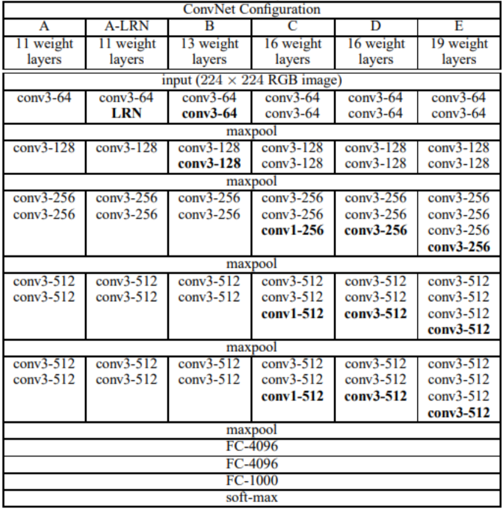

VGG网络特点：

- 验证了通过不断加深网络结构可以提升性能
    
- 几个小滤波器（3x3）卷积层的组合比一个大滤波器（5x5或7x7）卷积层好

    > 多层小的卷积核获得的感受野与单层较大的卷积核一致    

    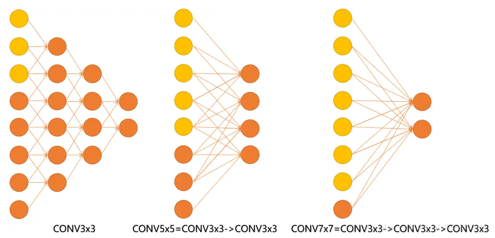

    并且，相较于大卷积核，小卷积核的使用在增加网络层数的同时，减少参数数量，多层叠加也增强了非线性表达能力
    
- VGGNet的结构非常简洁(卷积层+ReLU、最大池化层、全连接层、Softmax输出层),代码实现精巧，整个网络都使用了同样大小的卷积核尺寸（3x3）和最大池化尺寸（2x2）

- 结论提出alexnet中的LRN层没有性能增益

### NiN (Network In NetWork)

!!! info "NiN" 
    <font size = 3>
    相关论文：[Network In Network](https://arxiv.org/abs/1312.4400)

    Network In NetWork(NIN) 是由新加坡国立大学的MinLin等人提出的，在CIFAR-10和CIFAR-100分类任务中达到了SOTA结果。提出mlpconv，引入了1x1卷积和```global average pooling```，提出Network In Network(NIN)，
    
    LeNet、AlexNet和VGG都有一个共同的设计模式：通过一系列的卷积层与汇聚层来提取空间结构特征；然后通过全连接层对特征的表征进行处理。AlexNet和VGG对LeNet的改进主要在于如何扩大和加深这两个模块。
    
    AlexNet和VGG都是先由卷积层构成的模块充分抽取空间特征，再由全连接层构成的模块来输出分类结果。然而，如果使用了全连接层，可能会完全放弃表征的空间结构，且参数量巨大。 因此NiN提出用1*1卷积代替全连接层，串联多个由卷积层和“全连接”层构成的小网络来构建⼀个深层网络。
    
    </font>

<B>MLPConv Layer</B>由若干个局部的全连接层和非线性激活函数组成，代替了传统卷积层中采用的线性卷积核（实际上是使用了1x1卷积）

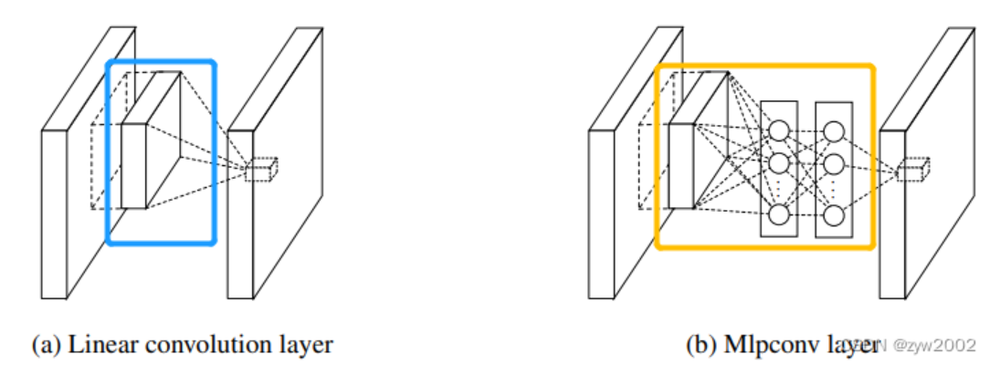

- 各通道特征融合：
    
    1×1卷积核在执行过程中，实际上对不同通道上同一位置处的特征值进行了一次线性组合。因此，这就可以根据最终训练得到的这个[1×1]的卷积核权重参数来确定每个特征通道的重要性占比（有点注意力机制的味道），并进行融合形成一个通道

在NIN中，卷积层后不接全连接层(FC)，而是将最后一个的mlpconv的输出每个特征图全局平均池化(global average pooling，GAP) ，而后softmax。

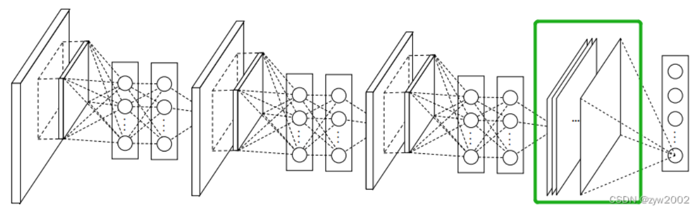

!!! advice "<B>1×1卷积核</B>"

    <fonr size = 3>
    参考[一文读懂卷积神经网络中的1x1卷积核](https://zhuanlan.zhihu.com/p/40050371)_

    - 增加非线性

        每使用 1 * 1的卷积核，及增加一层卷积层，所以网络深度得以增加。 而使用 1 * 1的卷积核后，可以保持特征图大小与输入尺寸相同，卷积层卷积过程会包含一个激活函数，从而增加了非线性。在输入尺寸不发生改变的情况下而增加了非线性，所以会增加整个网络的表达能力。

    - 参数量减少，降低计算量

    - 跨通道信息交互（通道的变换）

        1 * 1的卷积核一般只改变输出通道数（C），而不改变输出的宽度（W）和高度（H）。实现降维和升维的操作其实就是 Channel 间信息的线性组合变化。比如：在尺寸 3 * 3，64通道个数的卷积核后面添加一个尺寸1 * 1，28通道个数的卷积核，就变成了尺寸3 * 3，28尺寸的卷积核。 
        
        <B>原来的64个通道就可以理解为跨通道线性组合变成了28通道，这就是通道间的信息交互。</B>
 
    </font>

<B>Global Average Pooling(GAP)</B>

在最后一个mlpconv层中为分类任务的每个对应类别生成一个特征图，通过GAP层取每个特征图的空间平均值，将结果向量直接传入到softmax层。（但是传统的做法都是在最后一层卷积层得到的特征图后面跟上FC层）

GAP较FC的优点：
- 强制特征图和类别之间的对应关系，更适合卷积结构。

- GAP中没有要优化的参数，减少了参数量，避免了过拟合

- GAP汇总了空间信息，对输入的空间转化更加稳定。

- FC输入的大小必须固定，而GAP对网络输入的图像尺寸没有固定要求。

在使用 GAP 时 feature map 数要等于要分类的类别数，然后再对每一个 feature map 求均值，送到softmax中。

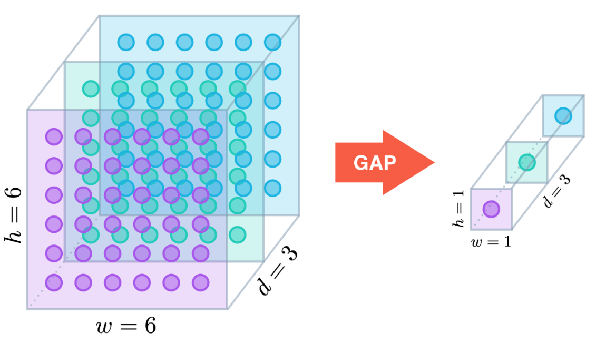

### GoogLeNet

!!! info "GoogLeNet" 
    <font size = 3>
    相关论文：[Going Deeper with Convolutions](https://www.cv-foundation.org/openaccess/content_cvpr_2015/papers/Szegedy_Going_Deeper_With_2015_CVPR_paper.pdf)

    GoogLeNet吸收了NiN中串联网络的思想，并在此基础上做了改进。 这篇论文的一个重点是解决了什么样大小的卷积核最合适的问题。 毕竟，以前流行的网络使用小到1×1，大到11×11的卷积核。 
    
    本文的一个观点是，有时<B>使用不同大小的卷积核组合是有利的</B>。
    
    大量的文献表明可以将稀疏矩阵聚类为较为密集的子矩阵来提高计算性能，据此论文提出了名为Inception的结构来实现此目的，既能保持网络结构的稀疏性，又能利用密集矩阵的高计算性能。

    </font>

<B>Inception结构</B>

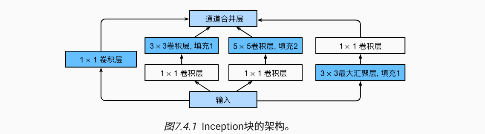

Inception块由四条并行路径组成:

- 前三条路径使用窗口大小为1×1、3×3和5×5的卷积层，从不同空间大小中提取信息。

- 中间的两条路径在输入上执行1×1卷积，<B>以减少通道数，从而降低模型的复杂性</B>。 

- 第四条路径使用3×3最大汇聚层，然后使用1×1卷积层来改变通道数。 

这四条路径都使用合适的填充来使输入与输出的高和宽一致，最后我们将每条线路的输出在通道维度上连结，并构成```Inception```块的输出。在```Inception```块中，通常调整的超参数是每层输出通道数。

```python 
class Inception(nn.Module):
    # c1--c4是每条路径的输出通道数
    def __init__(self, in_channels, c1, c2, c3, c4, **kwargs):
        super(Inception, self).__init__(**kwargs)
        # 线路1，单1x1卷积层
        self.p1_1 = nn.Conv2d(in_channels, c1, kernel_size=1)
        # 线路2，1x1卷积层后接3x3卷积层
        self.p2_1 = nn.Conv2d(in_channels, c2[0], kernel_size=1)
        self.p2_2 = nn.Conv2d(c2[0], c2[1], kernel_size=3, padding=1)
        # 线路3，1x1卷积层后接5x5卷积层
        self.p3_1 = nn.Conv2d(in_channels, c3[0], kernel_size=1)
        self.p3_2 = nn.Conv2d(c3[0], c3[1], kernel_size=5, padding=2)
        # 线路4，3x3最大汇聚层后接1x1卷积层
        self.p4_1 = nn.MaxPool2d(kernel_size=3, stride=1, padding=1)
        self.p4_2 = nn.Conv2d(in_channels, c4, kernel_size=1)

    def forward(self, x):
        p1 = F.relu(self.p1_1(x))
        p2 = F.relu(self.p2_2(F.relu(self.p2_1(x))))
        p3 = F.relu(self.p3_2(F.relu(self.p3_1(x))))
        p4 = F.relu(self.p4_2(self.p4_1(x)))
        # 在通道维度上连结输出
        return torch.cat((p1, p2, p3, p4), dim=1)
```

GoogLeNet一共使用9个```Inception```块和全局平均汇聚层的堆叠来生成其估计值。```Inception```块之间的最大汇聚层可降低维度。 第一个模块类似于AlexNet和LeNet，```Inception```块的组合从VGG继承，全局平均汇聚层避免了在最后使用全连接层

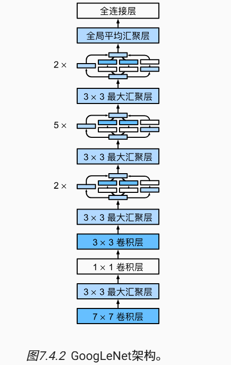

## 批量规范化（Batch Normalization）

用$\mathbf{x} \in \mathcal{B}$表示一个来自小批量$\mathcal{B}$的输入，批量规范化根据以下表达式转换

\[
    \mathrm{BatchNorm}(\mathbf{x}) = \boldsymbol{\gamma} \odot \frac{\mathbf{x} - \hat{\boldsymbol{\mu}}_\mathcal{B}}{\hat{\boldsymbol{\sigma}}_\mathcal{B}} + \boldsymbol{\beta}    
\]

$\hat{\boldsymbol{\mu}}_\mathcal{B}$是小批量的样本均值，$\hat{\boldsymbol{\sigma}}_\mathcal{B}$是小批量的样本标准差,通常还包含拉伸参数（scale）$\boldsymbol{\gamma}$和偏移参数（shift）$\boldsymbol{\beta},这两个参数将在训练过程中更新$。

\[
    \begin{split}
    \begin{aligned} 
    \hat{\boldsymbol{\mu}}_\mathcal{B} &= \frac{1}{|\mathcal{B}|} \sum_{\mathbf{x} \in \mathcal{B}} \mathbf{x},\\
    \hat{\boldsymbol{\sigma}}_\mathcal{B}^2 &= \frac{1}{|\mathcal{B}|} \sum_{\mathbf{x} \in \mathcal{B}} (\mathbf{x} - \hat{\boldsymbol{\mu}}_{\mathcal{B}})^2 + \epsilon.
    \end{aligned}
    \end{split}    
\]

由于在训练过程中，中间层的变化幅度不能过于剧烈，而批量规范化将每一层主动居中，并将它们重新调整为给定的平均值和大小。在方差估计值中添加一个小的常量$\epsilon > 0$,以确保我们永远不会尝试除以零.

> 只有使用足够大的小批量，批量规范化这种方法才是有效且稳定的，在应用批量规范化时，批量大小的选择可能比没有批量规范化时更重要

!!! info "nn.BatchNorm2d()"
    
    <font size = 3 >
    ```nn.BatchNorm2d(num_features= , num_dims= ,eps=0.00001 ,momentum=0.1)```

    - num_features：完全连接层的输出数量或卷积层的输出通道数。

    - num_dims：2表示完全连接层，4表示卷积层
    </fon>


总结：

- 在模型训练过程中，批量规范化利用小批量的均值和标准差，不断调整神经网络的中间输出，使整个神经网络各层的中间输出值更加稳定。

- 批量规范化在全连接层和卷积层的使用略有不同。

- 批量规范化层和暂退层一样，在训练模式和预测模式下计算不同。

- 批量规范化有许多有益的副作用，主要是正则化。


## ResNet 残差网络
---

!!! info "ResNet" 
    <font size = 3>
    相关论文：[Deep Residual Learning for Image Recognition](https://arxiv.org/abs/1512.03385v1)
    
    何恺明等人提出了残差网络（ResNet）。残差网络的核心思想是：每个附加层都应该更容易地包含原始函数作为其元素之一。 于是，残差块（residual blocks）便诞生了，这个设计对如何建立深层神经网络产生了深远的影响。 
    
    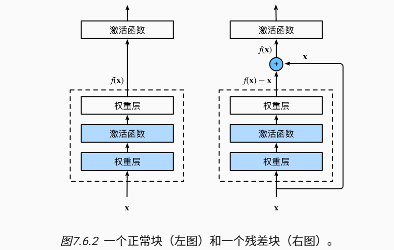

    </font>

### 残差块 residual block
---

residual结构使用了一种shortcut的连接方式，也可理解为捷径。让特征矩阵隔层相加，注意F(X)和X形状要相同，所谓相加是特征矩阵相同位置上的数字进行相加。

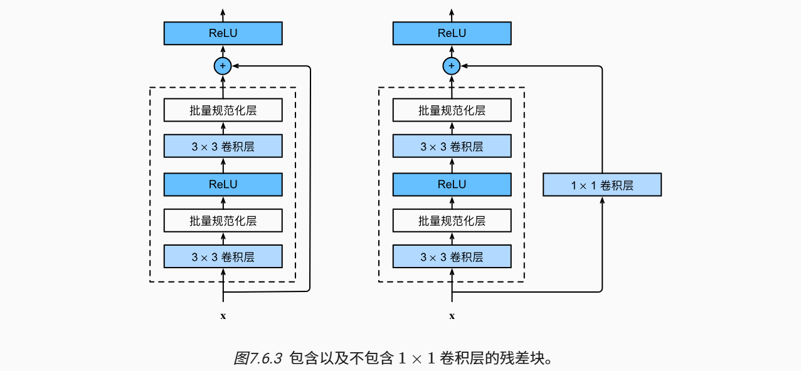

```python
class Residual(nn.Module):  
    def __init__(self, input_channels, num_channels, use_1x1conv=False, strides=1):
        super().__init__()
        self.conv1 = nn.Conv2d(input_channels, num_channels,
                               kernel_size=3, padding=1, stride=strides)
        self.conv2 = nn.Conv2d(num_channels, num_channels,
                               kernel_size=3, padding=1)
        if use_1x1conv:
            self.conv3 = nn.Conv2d(input_channels, num_channels,
                                   kernel_size=1, stride=strides)
        else:
            self.conv3 = None
        self.bn1 = nn.BatchNorm2d(num_channels)
        self.bn2 = nn.BatchNorm2d(num_channels)

    def forward(self, X):
        Y = F.relu(self.bn1(self.conv1(X)))
        Y = self.bn2(self.conv2(Y))
        if self.conv3:
            X = self.conv3(X)
        Y += X
        return F.relu(Y)
```

两个Residual结构：

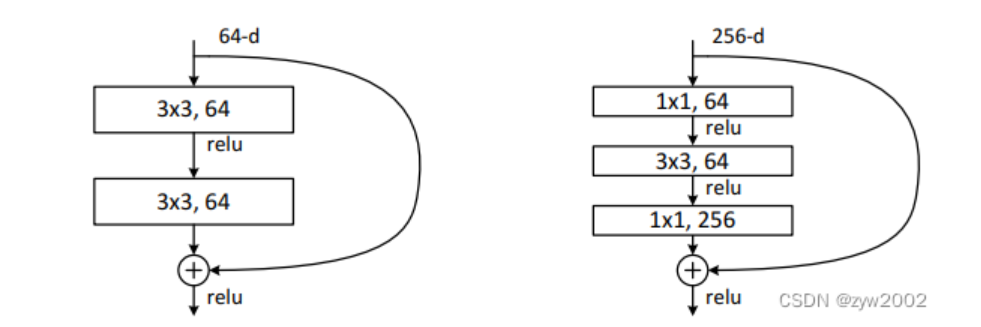

左侧残差结构称为 BasicBlock,右侧残差结构为Bottleneck

对于更深层次的网络，ResNet引入了“BottleNeck”架构来降低模型复杂性，其中第一层的1×1的卷积核的作用是对特征矩阵进行降维操作，将特征矩阵的深度由256降为64;第三层的1×1的卷积核是对特征矩阵进行升维操作，将特征矩阵的深度由64升成256。<B>降低特征矩阵的深度主要是为了减少参数的个数。</B>

### DenseNet 稠密连接网络
---

ResNet提出了恒等映射（ identity mapping）,使用了元素加法(Element-wise addition)。有助于训练过程中的梯度的反向传播，从而能够训练出更深的网络。

而在DenseNet中： 采用了密集连接的机制，即相互连接所有的层，每个层都会与前面所有的层在通道的维度上连接在一起（Channel-wise concatenation）, 实现特征重用，作为下一层的输入。这样不但减缓了梯度消失的现象，也使其可以在参数和计算量更少的情况下实现比ResNet更优的性能。

如ResNet将函数展开为一个简单的线性项和一个复杂的非线性项：

\[
    f(\mathbf{x}) = \mathbf{x} + g(\mathbf{x})   
\]

DenseNet的连接不是Resnet的简单相加，而是一种稠密的连接：

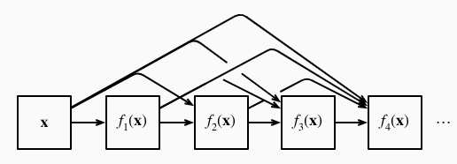

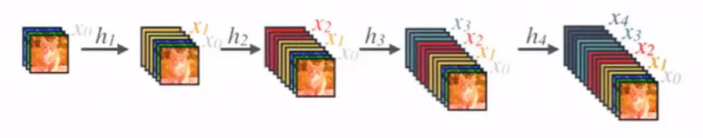

DenseNet使用了ResNet改良版的“批量规范化、激活和卷积”架构（BN-ReLU-Conv），这种方式也被称为pre-activation。网络主要由2部分构成：稠密块（dense block）和过渡层（transition layer）。 前者定义如何连接输入和输出，而后者则控制通道数量

```python
class DenseBlock(nn.Module):
    def __init__(self, num_convs, input_channels, num_channels):
        super(DenseBlock, self).__init__()
        layer = []
        for i in range(num_convs):
            layer.append(conv_block(num_channels * i + input_channels, num_channels))
        self.net = nn.Sequential(*layer)

    def forward(self, X):
        for blk in self.net:
            Y = blk(X)
            # 连接通道维度上每个块的输入和输出
            X = torch.cat((X, Y), dim=1)
        return X 
    
    def conv_block(input_channels, num_channels):
        return nn.Sequential(
            nn.BatchNorm2d(input_channels), 
            nn.ReLU(),
            nn.Conv2d(input_channels, num_channels, kernel_size=3, padding=1)
            )
```

> 在每个dense block中，特征映射的大小是相同的，因此它们可以很容易地concat在一起。层（dense layer）与层之间采用的是密集连接的方式。

假定输入层的通道数是$k_0$，```DenseBlock```中各个层卷积之后均输出$k$个特征图，即得到的特征图的通道数为$k$，那么$l$层输入的通道数为$k_0​+(l−1)k$ ,我们将k称为网络的增长率（growth rate）。提取出的k个通道即为从新层中提取出的特征。


Transition Layer是两个相邻dense block之间的过渡层（BN+ReLU+1x1Conv+2x2AvgPooling），并且降低特征图的大小，在最后一个dense block的末尾，执行全局平均池化，然后附加一个softmax分类器。

```python
def transition_block(input_channels, num_channels):
    return nn.Sequential(
        nn.BatchNorm2d(input_channels), 
        nn.ReLU(),
        nn.Conv2d(input_channels, num_channels, kernel_size=1),
        nn.AvgPool2d(kernel_size=2, stride=2)
        )
```

Denseblock 优点：

- 更强的梯度流动

    ①由于密集连接方式，DenseNet促进了梯度的反向传播，使得网络更容易训练。由于每层可以直达最后的误差信号，实现了隐式的“deep supervision”。误差信号可以很容易地传播到较早的层，所以较早的层可以从最终分类层获得直接监督。

    ②减轻了vanishing-gradient（梯度消失） 过梯度消失问题在网络深度越深的时候越容易出现，原因就是输入信息和梯度信息在很多层之间传递导致的，而现在这种dense connection相当于每一层都直接连接input和loss，因此就可以减轻梯度消失现象，这样更深网络不是问题。

- 减少参数与提升计算效率

- 更多样化的特征（保存了低纬度的特征）  

    DenseNet中的每一层都接收前面所有的层作为输入，因此特征更加多样化，倾向于给出更平滑的决策边界。