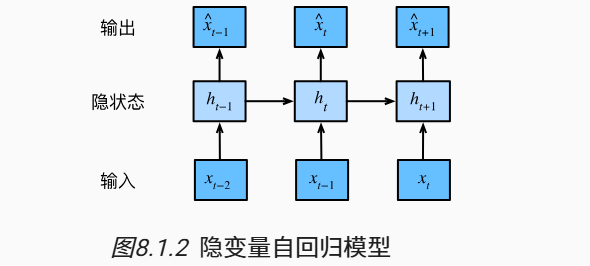
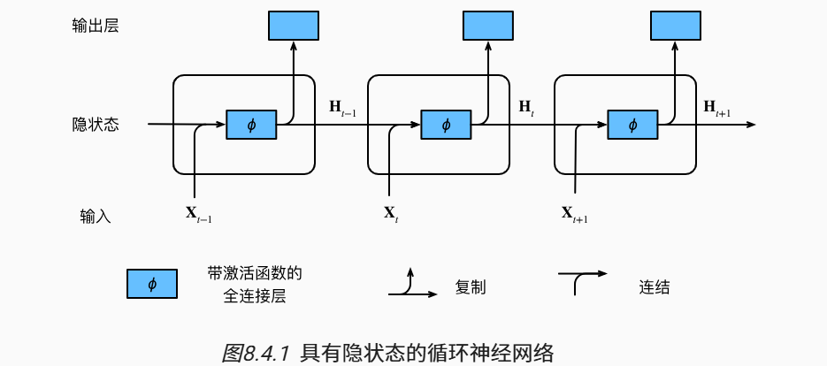

# 🔗<B>Chapter 3：Recurrent neural network</B>
<script src="https://polyfill.io/v3/polyfill.min.js?features=es6"></script>
<script src="https://cdn.jsdelivr.net/npm/mathjax@3/es5/tex-chtml.js"></script>

## 自回归模型 autoregressive models
---

自回归模型是统计上一种处理时间序列的方法，用同一变数例如$x$的之前各期，亦即$x_1$至$x_{t-1}$来预测本期$x_t$的表现，并假设它们为线性关系。因为这是从回归分析中的线性回归发展而来，只是不用$x$预测$y$，而是用$x$预测$x$（自己）；所以叫做自回归。

\[
    X_t = \sum_{i=1}^p \phi_i X_{t-i} + c + \epsilon_t        
\]

第二种如下图，是保留一些对过去观测的总结$h_t$, 并且同时更新预测$\hat{x}_t$和总结$h_t$。即为基于\hat{x}_t = P(x_t \mid h_{t})$来估计$x_t$，以及通过$h_t = g(h_{t-1}, x_{t-1})$更新总结$h_t$的模型，称为隐变量自回归模型（latent autoregressive models）。




## 词元化
---

词元（token）是文本的基本单位，

```python
    def tokenize(text, token='word'):
        if token == 'word':
            return text.split()
        elif token == 'char':
            return list(text)
        else:
            raise ValueError('Unknown token type: ' + token)
```

## 词表(vocabulary)
---

词表是词元的集合，词表中的每个词元都有一个唯一的索引。

我们先将训练集中的所有文档合并在一起，对它们的唯一词元进行统计，得到的统计结果称之为语料（corpus）。 然后根据每个唯一词元的出现频率，为其分配一个数字索引。另外，语料库中不存在或已删除的任何词元都将映射到一个特定的未知词元“<unk>”。 我们可以选择增加一个列表，用于保存那些被保留的词元， 例如：填充词元（“<pad>”）； 序列开始词元（“<bos>”）； 序列结束词元（“<eos>”）。

```python
class Vocab(object):
    def __init__(self, tokens=None, min_freq=0, reserved_tokens=None):
        if tokens is None:
            tokens = []
        if reserved_tokens is None:
            reserved_tokens = []
        # 按出现频率排序
        counter = count_corpus(tokens)
        self._token_freqs = sorted(counter.items(), key=lambda x: x[1],reverse=True)
        # 未知词元的索引为0
        self.idx_to_token = ['<unk>'] + reserved_tokens
        self.token_to_idx = {token: idx
                             for idx, token in enumerate(self.idx_to_token)}
        for token, freq in self._token_freqs:
            if freq < min_freq:
                break
            if token not in self.token_to_idx:
                self.idx_to_token.append(token)
                self.token_to_idx[token] = len(self.idx_to_token) - 1

    def __len__(self):
        return len(self.idx_to_token)

    def __getitem__(self, tokens):
        if not isinstance(tokens, (list, tuple)):
            return self.token_to_idx.get(tokens, self.unk)
        return [self.__getitem__(token) for token in tokens]

    def to_tokens(self, indices):
        if not isinstance(indices, (list, tuple)):
            return self.idx_to_token[indices]
        return [self.idx_to_token[index] for index in indices]

    @property
    def unk(self):  # 未知词元的索引为0
        return 0

    @property
    def token_freqs(self):
        return self._token_freqs

def count_corpus(tokens):  #@save
    """统计词元的频率"""
    # 这里的tokens是1D列表或2D列表
    if len(tokens) == 0 or isinstance(tokens[0], list):
        # 将词元列表展平成一个列表
        tokens = [token for line in tokens for token in line]
    return collections.Counter(tokens)
                                      
```

## 循环神经网络
---



假设在时间步$t$有小批量输入$\mathbf{X}_t \in \mathbb{R}^{n \times d}$，用$\mathbf{H}_t \in \mathbb{R}^{n \times h}$表示时间步$t$的隐藏变量。对于RNN网络，我们保存上一步的隐藏变量$\mathbf{H}_{t-1}$，引入一个新的权重$\mathbf{W}_{hh} \in \mathbb{R}^{h \times h}$，则有：

\[
    \mathbf{H}_t = \phi(\mathbf{X}_t \mathbf{W}_{xh} + \mathbf{H}_{t-1} \mathbf{W}_{hh}  + \mathbf{b}_h)    
\]

在RNN之前的网络有一个主要特征：没有记忆能力，即无法保存之前时间步的信息。都是对每个输入单独处理，在输入之前没有保存任何状态。


!!! advice "```nn.RNN()```"

    <font size=3>
    ```nn.RNN(input_size=, hidden_size=, num_layers=, )``` 

    - ```input_size (int)```：输入数据的特征大小(特征维度)。即每个时间步的输入向量$x_t$的维度。

    - ```hidden_size (int)```：隐藏层的特征大小，即每个时间步的隐藏状态向量ht的维度。它决定了模型的表示能力和记忆能力。较大的`hidden_size`通常允许模型学习更复杂的模式，但也需要更多的计算资源。

    - ```num_layers (int)```:RNN的层数，用于堆叠多个RNN层，默认值为1。当层数大于1时，RNN会变为多层RNN。多层RNN可以捕捉更复杂的时间依赖关系，但也会增加模型的复杂性。

    - ```nonlinearity (str)```:指定激活函数，默认值为'tanh'。可选值有'tanh'和'relu'。
    
    - ```bias (bool)```:如果设置为True，则在RNN中添加偏置项。默认值为True。偏差项通常有助于模型更好地拟合数据。

    - ```dropout (float)```:如果非零，则在除最后一层之外的每个RNN层之间添加dropout层，其丢弃概率为dropout。默认值为0。这有助于防止过拟合。
    
    - ```bidirectional (bool)```:一个布尔值，确定是否使用双向RNN。如果设置为True，RNN将同时在时间步的正向和反向方向上运行（则使用双向RNN），以捕捉前后的上下文信息。默认值为False。


    </font>