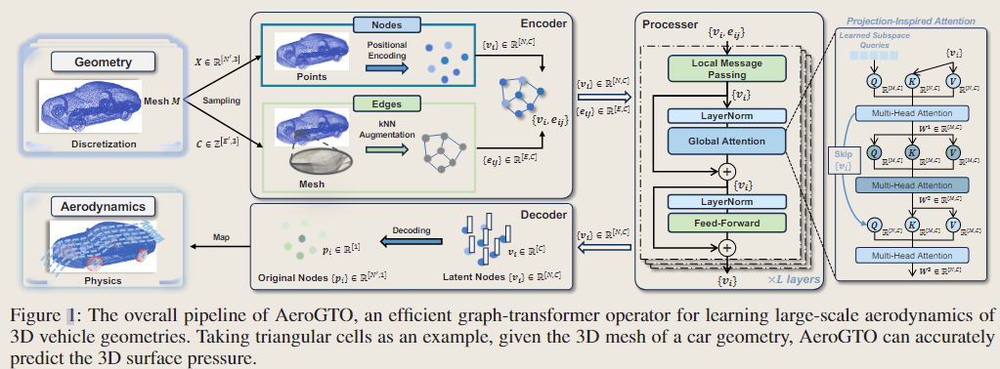
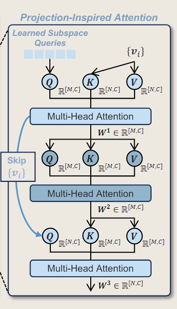

# AeroGTO:An Efficient Graph-Transformer Operator for Learning Large-Scale Aerodynamics of 3D Vehicle Geometries

<script src="https://polyfill.io/v3/polyfill.min.js?features=es6"></script>
<script src="https://cdn.jsdelivr.net/npm/mathjax@3/es5/tex-chtml.js"></script>

<script src="https://polyfill.io/v3/polyfill.min.js?features=es6"></script>
<script src="https://cdn.jsdelivr.net/npm/mathjax@3/es5/tex-chtml.js"></script>

!!! info "相关信息"
    <font size = 3.5>

    代码:[AeroGTO](https://github.com/pengwei07/AeroGTO)

    </font>

### Abstract
---

从广泛和不同的几何形状中捕捉复杂的物理相关性，同时平衡大规模离散化和计算成本，仍然是一个重大挑战。AeroGTO结合了通过信息传递进行局部特征提取和通过```projection-inspired attention```进行全局相关性捕获，采用频率增强的图神经网络(```frequency-enhanced graph neural network```)，并辅以k近邻(```k-nearest neighbors```)来处理三维（3D）不规则几何体。

与五种先进型号相比，AeroGTO在两个标准基准```Ahmed Body```和```DrivAerNet```上进行了广泛测试，在表面压力预测方面(surface pressure prediction)提高了7.36%，阻力系数估计(drag coefficient estimation)提高了10.71%，FLOPs更少，仅使用了先前领先方法使用的参数的1%。

### Introduction
---

对于传统的GNNs，增加图大小会引入两个主要问题：

（1）Complexity：随着nodes和消息传递迭代都线性增加，计算图的时间和内存复杂度不可避免地变为二次方;

（2）Oversmoothing:图卷积充当低通滤波器，抑制高频信号。因此，堆叠的 MPs 迭代地将信息投影到图的特征空间上，平滑高频信号，这使训练过程复杂化。

对于传统的```Transformer```模型，数据点被投影到潜空间中，然后由注意块处理。然而，仅使用```MLP```来学习汽车几何形状中大规模点云（point clouds）之间的复杂关系可能会导致重要拓扑信息的损失（losses of important topological information），这降低了它捕获复杂物理相关性的能力。

AeroGTO通过使用kNN来增强```frequency-enhanced GNN```进行精确的局部特征提取，有效地隔离和捕获点和边的物理信息，并将该空间数据投影到拓扑结构化的隐藏空间中，从而增强可解释性。

此外，该模型集成了具有全局线性复杂度注意力的Transformer，它捕获网格点之间的长期依赖关系，并促进局部和全局复杂物理相关性之间的多级交互。这种设计有效地降低了复杂数据集的成本，实现了快速准确的推理。

### Methodology
---

#### Problem Setting and Notations

> Neural operators of PDEs 是从输入函数(如初始/边界条件、几何、系数和源场)到解的映射

设$\mathcal{A}$表示输入函数的空间，解空间为$\mathcal{S}$，而神经算子是学习一个算子$\mathcal{G}:\mathcal{A} \rightarrow \mathcal{S}$。在该模型任务下，$\mathcal{G}$是将汽车的任意形状和给定条件映射到其表面压力。

对给定的k个汽车形状，输入$\mathcal{a}^k$由汽车的形状组成，并用一组网格$\mathbf{M}^k = (\mathbf{X}^k, \mathbf{C}^k)$离散化，$\mathbf{X}^k= \{ x_i^k, y_i^k, z_i^k, \}^{N'}_{i=1}$是单个形状的节点坐标集，$\mathbf{C}^k= \{ i_l^k,..., j_l^k \}^{E'}_{i=1}$表示单个形状内的网格，表示每个网格中节点的连接（$1 ≤ i_l^k,..., j_l^k ≤ N'$表示节点的index，$N'$是节点数，$E'$是网格的数量）。$\mathbf{A}^k \in \mathbb{R}^m$包含一些全局设计参数，如汽车的长度、宽度和高度、雷诺数、入口速度等。期望的输出是离散的压力分布$\mathbf{s}^k=\{ \mathbf{p}^k_i \}^{N'}_{i=1}$。

对参数化的算子$\hat{\mathcal{G}}_{\theta}$，有$\hat{\mathcal{G}}_{\theta}(\mathcal{a}^k)=\hat{\mathbf{s}}^k$，其中$\theta$是模型参数。我们的目标是最小化训练数据集中预测 $\hat{s}^k$ 和真实数据$s^k$之间的L2相对误差损失:

$$
\min_{\theta \in \Theta} \frac{1}{D} \sum_{k=1}^{D} \mathcal{L}_k (\theta) = \min_{\theta \in \Theta} \frac{1}{D} \sum_{k=1}^{D} \frac{\|\hat{\mathbf{s}}^k-\mathbf{s}^k\|_{2}}{\|\mathbf{s}^k\|_{2}}
$$

训练数据集的大小，$\theta$ 是网络参数，$\Theta$是参数空间。

#### Model Architecture



#### Encoder

Encoder分为节点编码与边编码两部分，输入包含离散化网格$\mathbf{M}^k = (\mathbf{X}^k, \mathbf{C}^k)$和条件$\mathbf{A}^k \in \mathbb{R}^m$。

#### Edge-Focused Sampling

考虑由无方向的边$E^M$组成的无向网格$C$，为了在保持计算效率的同时近似双向边，我们首先通过交换边的索引i和j来随机打乱连接方向。然后，我们以$a_E \in (0,1]$的比例统一采样这些边。在采样后，应用<B>kNN增强</B>来捕获原始网格结构可能不表示的附加连接。

该方法特别合适当我们已知原始网格中的单元信息，可以很容易地提取边缘关系的情景。

#### Node-Focused Sampling

随机采样节点，选择总节点的比例$a_E \in (0,1]$。采样后，仅使用 kNN方法构建边缘，重点关注所选节点之间的关系。

这种方法更适合原始网格非常复杂，使得从单元格信息中提取边缘关系变得棘手的情况。

### Nodes

节点信息包含坐标$X_i=(x_i,y_i,z_i)$和汽车信息$A$，我们使用MLP将节点信息从物理空间编码到潜空间中，$v_i = \Phi_1^V(X_i, A)$。

为了有效地捕捉坐标的空间和频率相关特征，我们采用了正弦位置编码(SPE)：

$$
F(X)=[ cos(2^i \pi X), sin(2^i \pi X) ]_{i=-\delta,...,\delta}，\delta \in \mathbb{Z}^+
$$

最后再使用MLP $v_i = \Phi^V_2(v_i, F(X_i))$

### Edges

为了更好地表达几何拓扑结构，我们同样要对边进行编码。我们得到网格边$E^M$以及通过kNN获取的边$E^k$，接下来，我们将相对位移向量$x_{ij}=x_i-x_j$及其范数$|x_{ij}|$编码到边的组合集$e_{ij} \in E^M ∪ E_k$。

然后使用MLP$\Phi^E$将来自网格边和kNN边的连接特征编码为每条边的大小为C的潜在向量，$e_{ij}= \Phi^E(e_{ij})$。

最后，我们可以得到汽车几何的潜在表示$V=\{v_i \} \in \mathbb{R}^{[N,C]} , E = \{ e_{ij} \} \in \mathbb{R}^{[E,C]}$，其中$N$，$E$分别是采样后节点和边的数量。

> $Φ^V_1$、$Φ^V_2$ 和 $Φ^E$使用两个线性层实现，并且具有相同的宽度$C$和<B>SiLU</B>激活函数。

### Processor

AeroGTO基于projection-inspired attention，通过信息传递和全局相关性捕获来组合局部特征提取。

每个网格边$e_{ij}$和节点$v_i$通过频率增强进行更新:

$$
\begin{cases}
  \mathbf{e}_{ij} = \mathbf{e}_{ij} + \Phi_{P}^{E}(\mathbf{e}_{ij}, \mathbf{v}_{i}, \mathbf{v}_{j}) \\
  \mathbf{v}_{i} = \mathbf{v}_{i} + \Phi_{P}^{V}\left(\mathbf{v}_{i}, \sum_{j} \mathbf{e}_{ij}, F(\boldsymbol{X}_{i})\right)
\end{cases}
$$

其中的MLP是使用GELU为激活函数的残差连接线性层

#### Global Attention via Projection-Inspired Attention

$$
\begin{cases}
  W_1 = softmax(\frac{Q_{ls} W_0^T}{\sqrt{C}}) W_0 \\
  W_2 = softmax(\frac{W_1 W_1^T}{\sqrt{C}}) W_1      \\
  W_3 = softmax(\frac{W_0 W_2^T}{\sqrt{C}}) W_2
\end{cases}
$$



其中，$W_0:=\{ v_i \} \in \mathbb{R}^{[N,C]}$从MP块获得，我们使用一组可学习的子空间查询向量$Q_{ls}$∼$\mathcal{N}(0,1) \in \mathbb{R}^{[M,C]}，M ≪ N$，$M$代表每个token的数量。

$Q_{ls}$中的每一个token可以解释为子空间的基向量（basis vector of the learned subspace），表示数据中的特定模式或特征。随后的实验结果证实token确实形成了一个basis，M个向量是线性独立的。

### Pre-Norm Structure

我们采用pre-norm结构来促进整个处理器的更有效的计算:

$$
\begin{cases}
  V_G^1 = W_0 + W_3 \\
  V_G^2 = V_G^1 + FFN(LN(V_G^1)) 
\end{cases}
$$

在实践中，我们通过引入多头注意力来增强模型捕获不同头部的各种交互和依赖关系的能力，从而提高其表示数据中复杂关系的能力。此外，通过堆叠多个过程块，该模型利用了层的集体效应，从而在复杂的局部和全局物理相关性之间实现更有效的多级交互。

### Decoder
---

Decoder将局部特征和全局特征表示投影回物理空间，$p_i=\Phi_D^V (v_i, F(X_i)$。其中，$F(X_i)$是正弦位置编码SPE，$v_i \in \mathbb{R}^{[C]}$是处理器的输出。$p_i \in \mathbb{R}^{[1]}$是采样节点i处的输出压力。

### Inference 

在推理过程中，需要考虑不同的采样方法。对于```Edge-Focused```采样方法，节点的数量在pipeline中保持不变（即 $N = N′$），而边根据设置策略进行采样。对于 ```Node-Focused```，基于采样率$a_N \in (0, 1]$将全尺寸网格随机划分为$[\frac{1}{a_N}]$ batches。
、
AeroGTO利用GPU的并行计算能力将这些批次一起处理。推断与采样几何对应的物理，然后将结果聚合以产生全网格输出。

