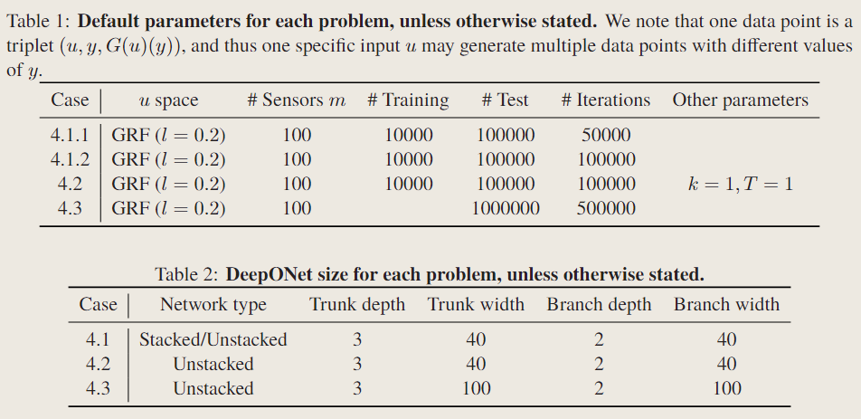

# DeepONet: Learning nonlinear operators via DeepONet based on the universal approximation theorem of operators

!!! info "相关信息"
    
    
    论文地址：[Learning nonlinear operators via DeepONet based on the universal
    approximation theorem of operators](https://doi.org/10.1038/s42256-021-00302-5)

    代码:[DeepXDE](https://github.com/lululxvi/deepxde/blob/master/deepxde/nn/pytorch/deeponet.py)

    

### Abstract

a neural network with a single hidden layer can approximate accurately any nonlinear continuousfunctional (a mapping from a space of functions into the real numbers) or (nonlinear) operator (a mapping from a space of functions into another space of functions).

But the theorem only guarantees a small approximation error for a sufficient large network, and does not consider the important optimization and <B>generalization errors.</B>

DeepONet consists of two sub-networks:branch net(encoding the input func) and trunk net(encoding the location s for output func).

### Methodology

Let ${G}$ be an operator taking input function $u$, and then $G(u)$ is the output function.Thus the output $G(u)(y)$ is <B>real number</B>. To represent the input function discretely, we sample enough the function value at locations ${x_1,x_2,...,x_m}$(we call them as 'sensors'(传感器)).The only condition required is that the sensor loactions ${x_1,x_2,...,x_m}$ are the same, while we don't enforce any limitation on the output locations $y$.

In the general setting, the network inputs consist of two separate components:$[u(x_1), u(x_2),..., u(x_m)]$ and $y$.The trunk network takes $y$ as the input and the outputs are $[t_1,t_2,...,t_p]$, and each of $p$ branch networks takes $[u(x_1), u(x_2),..., u(x_m)]^{T}$ as input and the outputs a scalar $b_k \in \mathcal{R}$ for $k=1,2,...,p$.

$$
G(u)(y) ≈ \sum_{k=1}^p b_k t_k(y) + b_0
$$

> trunk network applies activation func in the last layer($t_k = \sigma (·)$), and thus this trunk-branch network can also be seen as a trunk network with each weight in the last layer parameterized by another branch network instead of the classical single variable.

In practice, $p$ is at least of the order of 10, and using many branch networks is computationally and memory expensive. Hence, we merge all the branch networks("stacked DeepONet") into one single branch network("unstacked DeepONet").

> $G(u)(y)$ can be viewed as a function of yconditioning on $u$.

### Data generation

In this study, we mainly consider two function spaces: <B>Gaussian random field (GRF,高斯随机场) and orthogonal (Chebyshev) polynomials.</B>

$$
u \sim \mathcal{G}(0,k_l(x_1,x_2))
$$

$$
k_l(x_1,x_2) = exp(-|| x_1 - x_2 ||^2 / 2l^2)
$$

where the covariance function $k_l(x_1,x_2)$ is the radial-bias function(RBF,径向基函数) kernel with the length scale, which determines the smoothness of the sampled function $l$ and larger $l$ leads to smoother $u$.

Let $M>0$ and $T_i$ are Chebyshev polynomials of the first kind(第一类切比雪夫多项式).We define the orthogonal polynomials of degree $N$ (N阶的正交多项式)as:

$$
V_{poly} = \Big \{ \sum_{i=0}^{N-1} a_i T_i(x): |a_i| ≤ M \Big \}
$$

We generate the dataset from $V_{poly}$ by randomly sampling $a_i$ from $[−M, M]$ to get a sample of $u$.

Accroding to reference solution, one data point is a triple $(u,y,G(u)(y))$, and thus one specific input $u$ may appear in multiple data points with different values of $y$. For example, a dataset of size 10000 may only be generated from 100 $u$ trajectories, and each evaluates $G(u)(y)$ for 100 $y$ locations.

> 数据集的规模就是取样$u$的个数和取点$y$的个数的乘积

### Exmaple

A 1D dynamic system is described by

$$
\frac{ds(x)}{dx} = g(s(x),u(x),x), x \in [0,1]
$$

$$
s(0) = 0
$$

The goal is to predict $s(x)$ over the whole domain $[0,1]$ for any $u(x)$.

<B>(1)Linear case:</B> $g(s(x),u(x),x) = u(x)$

$$
G : u(x) → s(x) = \int_0^x u(\tau) d \tau
$$

This task is equivalent to learning the antiderivative operator(不定积分算子)

Compared to FNNs, DeepONets have much smaller generalization error and thus smaller test error.Compared to stacked DeepONets, although unstacked DeepONets have larger training error, the test error is smaller, due to the smaller generalization error. Therefore, unstacked DeepONets with bias achieve the best performance. In addition, unstacked DeepONets have fewer number of parameters than stacked DeepONets, and thus can be trained faster using much less memory.

<B>(2)Nonlinear case:</B> $g(s(x),u(x),x) = -s^2(x)+ u(x)$

During the network training, the training MSE and test MSE of both stacked and unstacked DeepONets decrease, but the correlation between training MSE and test MSE of unstacked DeepONets is tighter(smaller generalization error).

DeepONets work even for out-of-distribution(OOD) predictions

<B>(3)Gravity pendulum with an external force(重力摆方程):</B> 

$$
\frac{ds_1}{dt} = s_2
$$

$$
\frac{ds_2}{dt} = -ksin s_1 + u(t)
$$

$$
s(0) = 0
$$

$k = \frac{g}{l}$ is determined by the acceleration due to gravity and the length of the pendulum.

This problem is characterized by three factors:

(1) $k$

(2) maximum prediction time $T$, 

(3) input function space(corresponding to $l$)

we investigate the error tendency under different conditions, including prediction time, network size, and training dataset size.We first observe that both the training and test errors grow exponentially(以指数方式) with the maximum prediction time $T$:

$$
MSE ∝ 8^T
$$

Next we investigate the effect of different function spaces, including GRF with different length scale $l$ and the space of Chebyshev polynomials with different number of $Bases$. 

### Diffusion-reaction system with a source term(具有源项的扩散反应系统)

$$
 \frac{\partial s}{\partial t} = D \frac{\partial^2 s}{\partial x^2} + ks^2 + u(x),\space x \in (0, 1),  t \in (0, 1] 
$$

with zero initial/boundary conditions, where $D = 0.01$ is the diffusion coefficient, and $k = 0.01$ is the reaction rate.We use DeepONets to learn the operator mapping from $u(x)$ to the PDE solution $s(x, t)$.

To generate the training dataset, we solve the diffusion-reaction system using a second-order implicit finite difference method on a 100 by 100 grid, and then for each $s$ we randomly select $P$ points out of these $10000 = 100 × 100$ grid points. Hence, the dataset size is equal to the product of $P$ by the number of $u$ samples. We confirm that the training and test datasets do not include the data from the same $s$.

When we use 100 random $u$ samples, the test error decreases first as $P$ increases, and then saturates due to other factors, such as the finite number of $u$ samples and fixed neural network size. We observe a similar error tendency but with less saturation as the number of $u$ samples increases with $P$ fixed.

<B>In addition, in this PDE problem the DeepONet is able to learn from a small dataset</B>.DeepONet can reach the test error of ∼ $10^{−5}$ when it is only trained with 100 $u$ samples ($P = 1000$).

