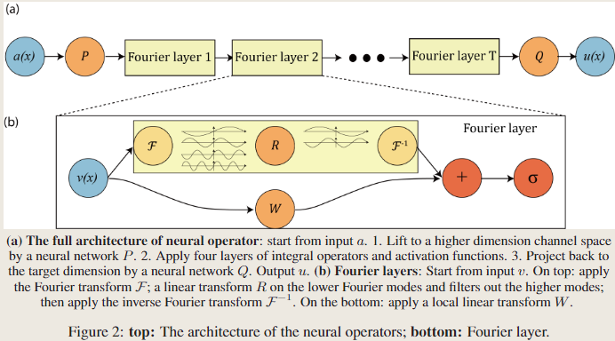

# FNO: Fourier Neural Operator for Parametric Partial Differential Equations

!!! info "相关信息"
    
    
    论文地址：[Fourier Neural Operator for Parametric Partial Differential Equations](https://arxiv.org/abs/2010.08895)

    代码:[https://github.com/li-Pingan/fourier-neural-operator](https://github.com/li-Pingan/fourier-neural-operator)

    

### 介绍

神经网络(neural networks)的经典发展主要集中在学习有限维欧几里得空间之间的映射。最近，这已经推广到神经算子(neural operators)，它们学习函数空间之间的映射。对于偏微分方程（PDEs），神经算子直接学习从任何函数参数依赖性到解的映射。因此，它们学习了一整个PDEs族，与经典方法解决方程的一个实例形成对比。

本文中，我们通过直接在傅里叶空间(Fourier space)中参数化(parameterize)积分核(integral kernel)来制定一个新的神经算子，从而实现了富有表现力和高效的架构。我们对Burgers方程、Darcy流和Navier-Stokes方程进行了实验。

### 方法

首先概述两种主流基于神经网络的PDE方法：有限维算子(finite-dimensional operators)和神经有限元方法(Neural-FEM)。

<B>有限维算子(finite-dimensional operators)</B>

将解算子参数化为有限维欧几里得空间之间的深度卷积神经网络。本质上是与网格相关的，需要对不同的分辨率和离散化进行修改和调整。（换一种分辨率或者换一个初边界条件，往往误差表现不稳定，擅长特定场景的特定优化）

<B>神经有限元方法(Neural-FEM)</B>

直接将解函数参数化为神经网络（PINNs类模型），与网格无关且精确，但对于任何给定的新的函数参数/系数实例，都需要训练一个新的神经网络（对于PINNs来说，训练过程就是求解过程）。

本文的方法旨在通过有限的观测数据对学习一个映射关系，这个映射是定义在无限维空间之间的。在很多应用中，尤其是与偏微分方程（PDE）相关的问题，输入和输出通常是无限维的函数空间而不是有限维的向量空间。FNO的目标是从这些输入输出数据对中学习到这种映射。

设$D ⊂ \mathbb{R}^d$ 为一个有界开集，$\mathcal{A} = \mathcal{A}(D; \mathbb{R}^{d_a})$ 和 $\mathcal{U} = \mathcal{U}(D; \mathbb{R}^{d_u})$ 分别是从$D$到$\mathbb{R}^{d_a}$、从$D$到$\mathbb{R}^{d_u}$的无限维函数空间。

另外，设$G^† : \mathcal{A} → \mathcal{U}$是一个非线性的映射。通常在实际问题中，$G^†$代表的是某种物理或数学过程，比如本文中$G^†$为带参数的偏微分方程的解算子（the solution operators of parametric PDEs）。

假设我们有观察$\{ a_j , u_j \}^N_{j=1}$，其中$a_j ∈ \mathcal{A}$从$\mathcal{A}$中根据某个概率分布$\mu$抽取，而$u_j = G^†(a_j)$可能被噪声损坏。我们通过构建参数映射:

$$
 G : \mathcal{A} \times \Theta \rightarrow \mathcal{U} 
$$

来构建$G^†$的近似，其中$\Theta$是有限维的参数空间

<B>Notation</B>:

- $x \in D ⊂ \mathbb{R}^d$: 偏微分方程的空间域，方程所定义的空间区域，即自变量（通常是空间坐标）取值的范围。

- $a \in \mathcal{A} = (D; \mathbb{R}^{d_a})，u \in \mathcal{U} = (D; \mathbb{R}^{d_u})$，输入函数与输出解函数。

- $v(x) \in \mathbb{R}^{d_v}$：神经网络中间层的输出。

- $\mathcal{k}:\mathbb{R}^{2(d+1)} \rightarrow \mathbb{R}^{d_v \times d_v}$，算子核将$(x, y, a(x)， a(y))$映射到$dv \times dv$矩阵

- $\phi$:算子核网络$\mathcal{k}$的参数

- $k$:傅里叶模式/波数(Fourier modes / wave numbers)。$k_{max}$:傅立叶层中使用的最大傅立叶模式。

<B>离散化(Discretization)</B>

由于$a_j$与$u_j$通常是函数，为了用数值方法处理它们，我们使用逐点评估（point-wise evaluations）的方法，设$D_j=\{x_1,...,x_n\} \subset D$为$D$的n点离散化，并且我们观察到$a_j|_{D_j} \in \mathbb{R}^{n\times d_a}$和$u_j|_{D_j} \in \mathbb{R}^{n\times d_u}$，组成了由j索引的有限个input-output数据对。

傅里叶神经算子的完整架构：

(1)从输入a开始; 

(2)通过神经网络P提升到更高维度的通道空间;

(3)应用四层积分算子和激活函数;

(4)通过神经网络Q传回目标维度;

(5)输出u。

对于傅里叶层（Fourier layer）：从输入$v$开始。

在顶部：应用傅里叶变换$\mathcal{F}$，再对低频率的信号进行线性变换 
 ，滤除较高频率的信号；然后应用傅里叶逆变换$\mathcal{F}^{-1}$。
 
在底部：应用一个局部线性变换$W$。

<B>迭代更新(Iterative updates)</B>

我们将通过一个Fourier layer的过程表示为$v_t → v_{t+1}$:

$$
v_{t+1}(x) := \sigma \Big( W v_t(x) + ( \mathcal{K}(a;\phi) v_t(x))    \Big)
$$

其中$\mathcal{K} : \mathcal{A} \times \Theta_{\mathcal{K}} \rightarrow \mathcal{L} (\mathcal{U}(D;\mathbb{R}^{d_v}),\mathcal{U}(D;\mathbb{R}^{d_v}))$是映射到$\mathcal{U}(D;\mathbb{R}^{d_v})$上的有界线性算子，由$\phi \in \Theta_K$参数化，$W : \mathbb{R}^{d_v} \rightarrow \mathbb{R}^{d_v}$是一个线性变换。

我们选用$\mathcal{K}(a;\phi)$作为积分算子核变换（kernel integral transformation），并用一个神经网络来参数化。

<B>积分算子核$\mathcal{K}$(Kernel integral operator)</B>

$$
(\mathcal{K}(v,a) v_t)(x) := \int_D κ_\phi \Bigl(x,y,a(x),a(y)\Bigr)v_t(y)dy，\forall x \in D
$$

其中$\kappa_\phi : \mathbb{R}^{2(d+d_a)} \rightarrow \mathbb{R}^{d_v \times d_v}$是由$\phi \in \Theta_K$参数化的神经网络，扮演了核函数的角色，我们从数据中学习它。注意，<B>即使积分算子是线性的，神经算子也可以通过组合线性积分算子和非线性激活函数来学习高度非线性算子，类似于标准神经网络</B>。

<B>傅里叶神经算子(Fourier Neural Operator)</B>

我们提出用一个定义在傅里叶空间上的卷积算子，替代上述的积分算子核。设$\mathcal{F}$为$f:D\rightarrow \mathbb{R}^{d_v}$的傅里叶变换，则：

$$
 (\mathcal{F} f)_j(k)=\int_D f_j(x) e^{-2 i \pi\langle x, k\rangle} \mathrm{d} x, \quad\left(\mathcal{F}^{-1} f\right)_j(x)=\int_D f_j(k) e^{2 i \pi\langle x, k\rangle} \mathrm{d} k 
$$

对$j=1,...,d_v$成立

令$\kappa_\phi(x, y, a(x), a(y))=\kappa_\phi(x-y)$，应用卷积定理得到：$\left(\mathcal{K}(a ; \phi) v_t\right)(x)=\mathcal{F}^{-1}\left(\mathcal{F}\left(\kappa_\phi\right) \cdot \mathcal{F}\left(v_t\right)\right)(x), \quad \forall x \in D$，因此，我们提出直接在傅里叶空间中参数化$\kappa_\phi$。

<B>傅里叶积分算子</B>

$$
\left(\mathcal{K}(\phi) v_t\right)(x)=\mathcal{F}^{-1}\left(R_\phi \cdot\left(\mathcal{F} v_t\right)\right)(x) \quad \forall x \in D \tag{4} 
$$

其中$R_\phi$是周期函数$\kappa: \bar{D} \rightarrow \mathbb{R}^{d_v \times d_v}$的傅里叶变换，由$\phi \in \Theta_{\mathcal{K}}$参数化，即为上图中的$R$

设频率模式$k \in D$，有$(\mathcal{F} v_t)(k) \in \mathbb{C}^{d_v}$和$R_\phi(k) \in \mathbb{C}^{d_v \times d_v}$。我们假设$\mathcal{k}$为周期性的，允许傅里叶级数展开，所以我们使用离散形式的$k \in \mathbb{Z}^d$，我们通过在最大模数处截断傅里叶级数$k_{\max }=\left|Z_{k_{\max }}\right|= \{ k \in \mathbb{Z}^d: | k_j| \leq  k_{\max , j} ,j=1,...,d \}$来选择有限维参数化。因此$R_\phi$可以参数化为$\mathbb{C}^{k_{max} \times d_v \times d_v}$的张量。

<B>离散情况和快速傅里叶变换(FFT)</B>

设域D$离散化为$n \in \mathcal{N}$个离散点，则有$v_t \in \mathbb{R}^{n \times d_v}$和$\mathcal{F} (v_t) \in \mathbb{C}^{n \times d_v}$。由于采用了截断，所以实际上$\mathcal{F} (v_t) \in \mathbb{C}^{k_{max} \times d_v}$，权重张量$R_\phi \in \mathbb{C}^{k_{max} \times d_v \times d_v}$。

$$
(R \cdot (\mathcal{F} v_t))_{k,l} = \sum_{j=1}^{d_v} R_{k,l,j}(\mathcal{F} v_t)_{k,j}，\quad k =1,...,k_{max}, j = 1,...,d_v 
$$

当离散化是均匀的，分辨率为$s_1 \times s_2 \times...\times s_d = n$，$\mathcal{F}$可以替换为快速傅里叶变换。当$f \in \mathbb{R}^{n\times d_v}, k=\left(k_1, \ldots, k_d\right) \in \mathbb{Z}_{s_1} \times \cdots \times \mathbb{Z}_{s_d}$，快速傅里叶变换定义为：

$$
 \begin{aligned} & (\hat{\mathcal{F}} f)_l(k)=\sum_{x_1=0}^{s_1-1} \cdots \sum_{x_d=0}^{s_d-1} f_l\left(x_1, \ldots, x_d\right) e^{-2 i \pi \sum_{j=1}^d \frac{x_j k_j}{s_j}} \\ & \left(\hat{\mathcal{F}}^{-1} f\right)_l(x)=\sum_{k_1=0}^{s_1-1} \cdots \sum_{k_d=0}^{s_d-1} f_l\left(k_1, \ldots, k_d\right) e^{2 i \pi \sum_{j=1}^d \frac{x_j k_j}{s_j}} \end{aligned} 
$$

在这种情况下，截断模式的集合变为：

$$
Z_{k_{max}} = \{(k_1, \cdots, k_d) \in \mathbb{Z}_{s_1} \times \cdots \times \mathbb{Z}_{s_d} | k_j \leq k_{max,j} \space or \space s_j - k_j \leq k_{max,j} , 对于 j = 1, \cdots , d\} 
$$

即$Z_{k_{max}}$是截断后的傅里叶模式集合，在离散化的多维空间中，每个维度上只保留前$k_{max}$个低频以及对应的高频(由于傅里叶变换的周期性)

$R$权重张量一个$s_1 \times  · · · \times s_d \times d_v \times d_v$的张量。在实践中，选择每个通道产生$k_{max,j} = 12$足以满足我们考虑的所有任务。

<B>对离散化的不变性</B>:

傅里叶层是离散化不变的，因为它们可以学习和评估以任意方式离散化的函数。该架构在输入和输出的任何分辨率下都具有一致的误差。

