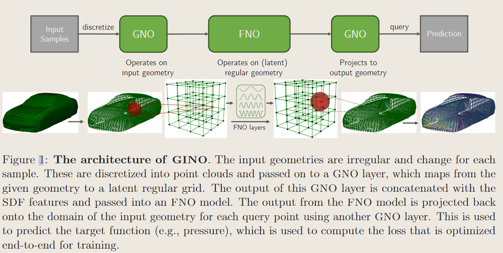

# GINO: Geometry-Informed Neural Operator for Large-Scale 3D PDEs

!!! info "相关信息"
    
    
    几何信息神经算子，论文地址：[Geometry-Informed Neural Operator for Large-Scale 3D PDEs](https://openreview.net/pdf?id=86dXbqT5Ua)

    

### 几何信息神经算子介绍

- 神经算子的输入函数可以以任意的离散化、网格、分辨率呈现，输出函数可以在任何任意点进行评估。

