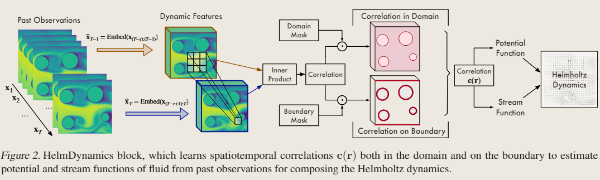
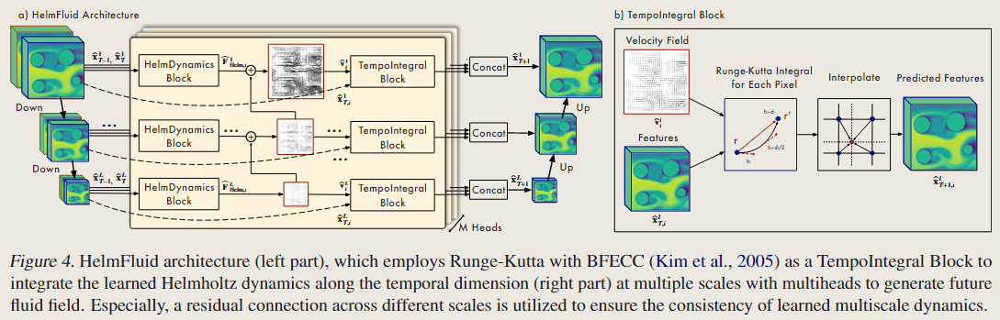

# HelmFluid: Learning Helmholtz Dynamics for Interpretable Fluid Prediction

<script src="https://polyfill.io/v3/polyfill.min.js?features=es6"></script>
<script src="https://cdn.jsdelivr.net/npm/mathjax@3/es5/tex-chtml.js"></script>

!!! info "相关信息"
    <font size = 3.5>
    
    相关阅读资料:[HelmFluid: Learning Helmholtz Dynamics for Interpretable Fluid Prediction](https://arxiv.org/pdf/2310.10565)

    [Code](https://github.com/thuml/HelmFluid/?tab=readme-ov-file)

    </font>

### Abstract

神经算子方法侧重于利用深度模型的非线性建模能力来近似过去和未来流体之间的复杂映射，可能无法为预测结果提供可解释性的依据。本文通过physical insights，来捕获复杂的动力学，以实现准确和可解释的流体预测，提出了亥姆霍兹动力学（Helmholtz dynamics）作为表示流体动力学的新范式。

受到Helmholtz theorem的启发，并将复杂的动力学归因于流体的势函数(potential function)和流函数(stream function)，它们是流体的内在物理量，可以直接推导出流体的无旋和无散度部分(derive the curl-free and divergence-free parts of fluid respectively)。与表面速度场相比，我们提出的亥姆霍兹动力学将复杂的动力学分解为更可解的分量，从而简化了深度模型的动力学学习过程，并且使预测具有内在的物理可解释性。

```HelmDynamics```作为一种灵活的模块，可以方便地将边界条件编码到相关计算过程中，并在多种现实应用中适应复杂的边界设置。

### Helmholtz Theorem

> <B>亥姆霍兹定理</B>：对于一个在有界域$V$上的矢量场$\mathbf{F(r)}$，其在满足二阶连续可微的情况下可以描述为<B>一个无旋场和一个无散场的叠加</B>，公式表述为：

$$
\mathbf{F} = \nabla \Phi + \nabla \times \mathbf{A}, \ \mathbf{r} \in \mathbb{V}.
$$

Given a 3D dynamic field $\mathbf{F}: \mathbb{V} \rightarrow \mathbb{R}^3$ with a bounded domain $\mathbb{V} \subseteq \mathbb{R}^3$, we can obtain the decomposition based on the Helmholtz Theorem:

$$
\mathbf{F} (\mathbf{r}) = \nabla \Phi(\mathbf{r}) + \nabla \times \mathbf{A}(\mathbf{r}), \ \mathbf{r} \in \mathbb{V}.
$$

其中$\Phi: \mathbb{V} \rightarrow \mathbb{R}$代表势函数，是一个标量场，其梯度场$\nabla \Phi$代表$\mathbf{F}$的无旋部分（$\nabla \times (\nabla \Phi)=\mathbf{0}$）；$\mathbf{A}: \mathbb{V} \rightarrow \mathbb{R}^3$是流函数，其向量场$\nabla \times \mathbf{A}$代表$\mathbf{F}$的无散部分（$\nabla  (\nabla \times \Phi)=\mathbf{0}$），从而也表明流场的不可压缩性。。

<B>Helmholtz dynamics for 2D fluid</B>

限制$\mathbf{F}$的z轴分量为0，讲Helmholtz Theorem应用到2D平面，$\mathbf{F}(\mathbf{r}) = (\mathbf{F}_x(\mathbf{r}), \mathbf{F}_y(\mathbf{r}),0)^T$。这也使得流函数$\mathbf{A}(\mathbf{r}) = (0,0,\mathbf{A}_z(\mathbf{r}))^T$，表明流函数退化为标量场。对于在$\mathbb{V} \subseteq \mathbb{R}^2$的2D流体场，有

> $\nabla \times \mathbf{A(r)} = (\frac{\partial A}{\partial y}-\frac{\partial A}{\partial z}, \frac{\partial A}{\partial z}-\frac{\partial A}{\partial x}, \frac{\partial A}{\partial x}-\frac{\partial A}{\partial y})$，因为假设物理场为二维场，所以设$\mathbf{A} = (0, 0, A_z)$

$$
\mathbf{F}_{Helm} (\Phi, \mathbf{A}) = \nabla \Phi + \nabla \times \mathbf{A} = \underbrace{(\frac{\partial \Phi}{\partial x}, \frac{\partial \Phi}{\partial y})}_{\text{Curl-free Velocity}} + \underbrace{(\frac{\partial A_z}{\partial y}, -\frac{\partial A_z}{\partial x})}_{\text{Divergence-free Velocity}}.
$$

通过$\Phi$和$\mathbf{A}$，Helmholtz dynamics自然地将复杂的流体分解为更可解的组件，并将复杂的动力学拆解为内在物理量中，从而有利于更可解释的动力学建模。

### HelmDynamics Block



本文提出了```HelmDynamics Block```来从过去观测中估计势函数和流函数。首先将将输入观测嵌入到两个连续的深度表示中，以显式地保持时间动态信息。给定一个连续观察到的$T$帧序列$x=[x_1,...,x_T], \ x_i \in \mathbb{R}^{H \times W}$（$x_i$表示一张物理场图）:

$$
\begin{aligned}
\hat{x}_{T-1} = Embed(x_{T-\tau:T-1}) \\
\hat{x}_T = Embed(x_{T-\tau+1:T}) \\
\end{aligned}
$$

其中$\hat{x}_{T-1}, \ \hat{x}_T \in \mathbb{R}^{d_{model} \times H \times W}$是$T-1$和$T$时刻的特征张量（feature tensors），我们从$\tau$开始回溯窗口嵌入以捕获时空信息（通过两个激活函数中间的卷积层），投影到通道维度$d_{model}$中。

而后采用前一个时刻与当前时刻的时空相关性来表示动态信息，并且将边界条件$S$包含进去：

$$
\mathbf{c} (\mathbf{r}) = \text{Concat} \Big( [\hat{x}_T (\mathbf{r}) \cdot \hat{x}_{T-1} (\mathbf{r'})]_{\mathbf{r'} \in \mathbf{N_r}} \ , [\mathbb{1}_S (\mathbf{r'}) (\hat{x}_T (\mathbf{r}) \cdot \hat{x}_{T-1}(\mathbf{r'})) ]_{\mathbf{r'} \in \mathbf{N_r}} \Big), \ \mathbf{r} \in \mathbb{V}.
$$

其中$N_r$表示位置$r$周围的邻居节点，$\mathbb{1}_S$表示边界条件。$c(r) \in \mathbb{R}^{2|N_r|}$表示当前流体在$r$位置与$|Nr|$邻居的相关图，并额外考虑边界条件$S$。因此$\mathbf{c} \in \mathbb{R}^{2|N_r| \times H \times W}$。

$$
\begin{aligned}
\hat{\Phi} = Decoder_{\Phi} (\mathbf{c})&, \ \hat{\mathbf{A}} = Decoder_{\mathbf{A}} (\mathbf{c}) \\
\hat{F}_{Helm} =& \nabla \hat{\Phi} + \nabla \times \hat{\mathbf{A}}
\end{aligned}
$$

其中$\hat{\Phi}, \ \hat{\mathbf{A}} \in \mathbb{R}^{H \times W}$和$\hat{F}_{Helm} \in \mathbb{R}^{2 \times H \times W}$表示学习到的二维场。本文中$Decoder_{\Phi}, \ Decoder_{\mathbf{A}}$是两个卷积层。总结：

$$
\hat{F}_{Helm} = \text{HelmDynamics} (\hat{x}_{(T-1)}, \hat{x}_T)
$$

### Multi-scale Multi-head Integral Architecture(多尺度多头积分架构)



为了提高模型流体动力学以及非线性捕捉的能力，本文采用了常见的多头设计。给定上述的$\hat{x}_{T-1}, \ \hat{x}_T \in \mathbb{d_{model} \times H \times W}$，我们将它们沿着通道维度分为多个Heads，即$\hat{x}_{(T-1),i}, \ \hat{x}_{T,i} \in \mathbb{R}^{d_{model} \times H \times W}, \ i \in \{ 1,...,M \}$（$M$为头数）：

$$
\hat{\mathbf{F}}_{Helm,i} = \text{HelmDynamics} (\hat{x}_{{T-1},i}, \hat{x}_{T,i})
$$

where $\hat{\mathbf{F}}_{Helm,i} \in \mathbb{R}^{2 \times H \times W}$。

<B>Multi-scale modeling</B>
---

在物理学中，流体在不同尺度上表现出不同的性质。这些多尺度动力学相互纠缠，使得流体极其棘手。因此，我们采用多尺度建模框架来增强动态建模。

给定上述的$\hat{x}_{T-1}, \ \hat{x}_T \in \mathbb{d_{model} \times H \times W}$，我们采用多尺度编码器（multi-scale encoder），在$L scales$上获得深度表示：$\hat{x}_{T-1}^l, \ \hat{x}_T^l \in \mathbb{d_{model}^l \times [\frac{H}{2^{(l-1)}}] \times [\frac{W}{2^{(l-1)}}]}, \ l \in \{1,...,L \}$。显然较大尺度的物理场受噪声影响较小，并且能够为较小的尺度提供可靠的背景速度场，我们将学习到的动力学从粗到细集成，以简化多尺度动力学建模过程：

$$
\hat{v}_i^l = \begin{cases}
\hat{F}^l_{Helm,i}, \ l=L \\
\hat{F}^l_{Helm,i} + \text{Upsample} (\hat{v}_{i}^{l+1}) \, \ 1 \leq l<L \\
\end{cases} 
$$

where $\hat{v}_i^l \in \mathbb{R}^{2 \times H \times W}$。$\text{Upsample}(\cdot)$是保持分辨率兼容的双线性插值(bilinear interpolation)。

<B>TempoIntegral block</B>
---

为了预测未来的流体场，我们沿时间维度整合特征空间。对于尺度$l \in 1,2,...,L$，head $i \in 1,2,...,M$。我们通过其对应的速度场$\hat{v}_i^l$来与深度表示$\hat{x}^l_{T,i}$相整合。