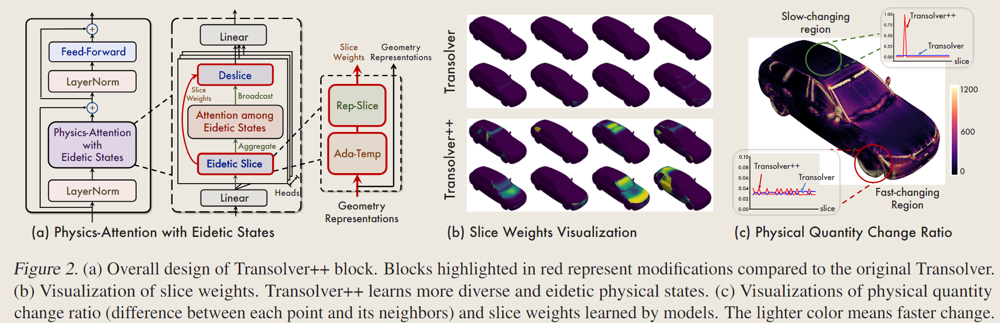

# Transolver++: An Accurate Neural Solver for PDEs on Million-Scale Geometries

<script src="https://polyfill.io/v3/polyfill.min.js?features=es6"></script>
<script src="https://cdn.jsdelivr.net/npm/mathjax@3/es5/tex-chtml.js"></script>

!!! info "相关信息"
    <font size = 3.5>
    
    论文地址：[]()

    </font>

### Abstract
---

对于深度学习模型在求解PDEs方面的应用，过去的工作主要局限于仅有数万个mesh points的数据，而工业模拟上对复杂几何形状一般需要百万级的网格尺度。

<B>基于之前通过```Transolver```学习物理状态来解决偏微分方程的进展，```Transolver++```进一步配备了一个并行框架(parallelism framework)和一个局部自适应机制(local adaptive mechanism)，以有效地从海量网格点中捕获物理状态，成功地解决了在扩大输入网格大小时计算和物理学习中的棘手挑战。</B>

现有模型无法扩展到超过400k个点，而实际应用通常涉及百万尺度的网格点甚至更多。而有限的网格尺寸会严重牺牲几何的精度，使得网格表面变得粗糙和不均匀，这将严重限制模型的模拟精度。```Transolver```的最大输入局限于700k个点，且实验数据比实际应用场景简单许多。而强行将模型拓展至百万规模的高保真PDE解决任务时，<B>我们观察到它在物理学习和计算效率方面的瓶颈，大量的网格点可能会压倒(overwhelm)学习过程，导致物理状态和模型退化。</B>

因此，```Transolver++```使用高度优化的并行框架和局部自适应机制对```Transolver```进行升级，解锁多GPU并行性的力量，以有效地从大量网格点中捕获物理状态。<B>基于模型架构的协同设计，我们的并行框架显着减少了通信开销，并在不牺牲性能的情况下实现了资源的线性可扩展性。</B>

<B>Highlight</B>

- ```Transolver++```展现了高效且高度并行的架构设计，在GPU之间具有线性可扩展性和最小的开销

- 从六个标准基准平均实现了13%的相对增益，在高保真百万规模的工业数据集上提高了20%以上

### Method 
---



<B>Physics-Attention with Eidetic States</B>

在大尺度的网格中，原本的```Physics-Attention```中的切片权重w容易趋于均匀，退化为平均池化，导致同质化的物理状态（homogeneous physical states），因此失去物理建模能力。```Transolver```使用softmax函数计算切片权重在一定程度上缓解无法区分的状态，但仍无法避免在模型深度增加时的退化现象。

> 在工业应用中，模型学习细微物理信息的能力是必不可少的

在```Transolver++```中，通过使用局部自适应机制（Local adaptive mechanism）和切片重新参数化（Slice reparameterization）来增强```Transolver```的状态学习来捕捉细致的物理状态，以仔细控制学习到的切片权重分布。

局部自适应机制（Local adaptive mechanism）将局部信息作为对物理学习过程的逐点调整。我们通过引入一个Softmax函数中可学习的<B>温度系数$τ_0$</B>来改变状态分布的锐度：

$$
\text{Ada-Temp:} \ \tau_0 = { \{ \tau_i \} }_{i=1}^N = { \{ \tau_0 + Linear(\mathbf{x_i}) \} }_{i=1}^N
$$

其中$\tau \in \mathbb{R}^{N \times 1}$，基于每个点的局部属性我们通过线性层来调节状态分布。

> 较高的温度系数能形成更均匀的分布，而较低的温度使分布更集中在关键状态上。

但是仅仅学习温度系数并不能完全解决问题。我们采用 ```Gumbel-Softmax```:

$$
\text{Rep-Slice}( \mathbf{x}, \tau ) =  \text{Softmax} \Big( \frac{\text{Linear}(\mathbf{x}) - \log{(-\log{\epsilon})} }{\tau} \Big)
$$

其中$\tau \in \mathbb{R}^{N \times 1}$是局部自适应温度，且$epsilon=\{ {\epsilon_i}^N_{i=1} \}, \ \epsilon_i \sim \mathcal{U}(0,1)$。所谓$\log{(-\log{\epsilon})} \sim \text{Gumbel}(0,1)$。如上图(c)，```Transolver++```中的切片权重可以很好地适应复杂几何图形上复杂的物理场。<B>具体来说，具有缓慢变化物理量的区域被分配到一个特定的状态，因为这些区域由一个纯物理状态控制。相比之下，具有快速变化的物理量的区域在物理状态下表现出多模分布，这反映了这些区域受到多种状态的混合的影响</B>。

<B>Parallel Transolver++</B>

> 不太了解并行计算，先跳过


