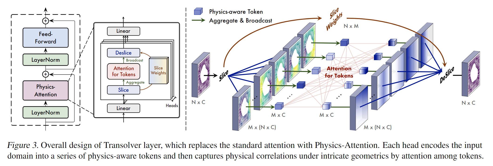
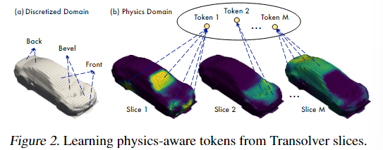
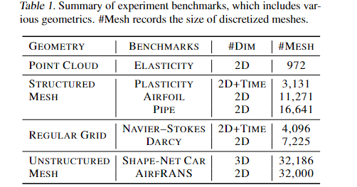
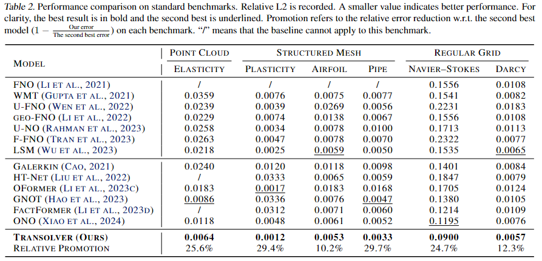
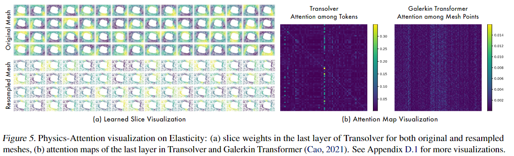
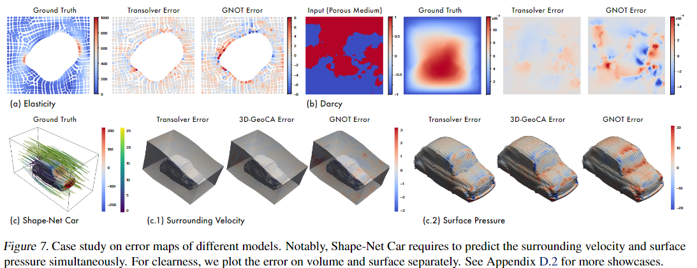

# Transolver: A Fast Transformer Solver for PDEs on General Geometries

<script src="https://polyfill.io/v3/polyfill.min.js?features=es6"></script>
<script src="https://cdn.jsdelivr.net/npm/mathjax@3/es5/tex-chtml.js"></script>

!!! info "相关信息"
    <font size = 3.5>
    
    论文地址：[Transolver: A Fast Transformer Solver for PDEs on General Geometries](https://arxiv.org/pdf/2402.02366v2)

    代码（Pytorch版）:[https://github.com/thuml/transolver](https://github.com/thuml/transolver)

    </font>

### Abstract

Since PDEs are typically discretized into large-scale meshes with complex geometries, it's hard for traditional Transformers to capture intricate physical corrlations directly form massive individual points.

So the team present ```Transolver(Physics Attention)``` learning intrinsic physical states hidden behind discretized geometries.```Physics Attention``` adaptively split the discretized domain into a set of slides with flexible shapes.by calculatiing attention to physics-aware tokens encoded from slices, ```Transolver``` can effectivly capture the physical correlations under complex geometries and compute in linear complexity.

### Method 

<B>Problem Defination</B>:

Input domain $\Omega \subset \mathbb{R}^{C_g}$, where $C_g$ denotes the dim of input space.$\Omega$ is discretized into a set of meshes points $\mathbb{g} \subset \mathbb{R}^{C_g \times N}$.The task is to estimate target physical quantities based on input geometrics $\mathbb{g}$ and quantities $\mathbb{u} \in \mathbb{R}^{N \times C_u}$.

> Here $\mathbb{u}$ is optional in some PDE-governed problems.

<B>The key to solving PDEs is to capture intricate physical correlations.</B>But it's hard for ```Attention ``` to learn from such massive discretized mesh points.

These mesh points are a finite discrete sampling(有限离散采样) of the underlying continuous physics space,which inspires us to capture the intrinsic physical states hidden behind discretized geometries.

We find that the surface mesh set can be ascribed to several physically internal-consistent subsets(物理上内部一致的子集),such as front, bevel, back areas. 

Given a mesh set $\mathbb{g}=\{\mathbb{g}_i\}^N_{i=1}$ with the coordinates information(坐标信息) of $N$ mesh points and observed quantities $\mathbb{u}$, we embed them into deep features $\mathbb{x}=\{\mathbb{x}_i \in \mathbb{R}^{1 \times C} \}^N_{i=1}$ by a linear layer, where $x_i$ involves both geometry and physics information.

We ascribes each mesh point $g_i$ to $M$ potential slices based on its learned feature $X_i$:

$$
\{w_i \in \mathbb{R}^{1\times M}\}_{i=1}^N = \{Softmax(Projection(x_i))\}^N_{i=1}
$$

$$
s_j \in \mathbb{R}^{N \times C} = \{ w_{i,j} x_i \}^N_{i=1}
$$



$\sum^M_{j=1} w_{i,j}=1$.Specifically, $w_{i,j}$ represents the degree that the i-th point belongs to the j-th slices.

$s_j$ represents the j-th slice feature, which is a weighted sum of all mesh points' features $x$.

> mesh points with close features will derive similar slice weights, which means they are more likely to be assigned to the same slice.

$$
z_j \in \mathbb{R}^{1 \times C} = \frac{\sum_{i=1}^N s_{j,i}}{\sum_{i=1}^N w_{i,j}} = \frac{\sum_{i=1}^N w_{i,j} x_i}{\sum_{i=1}^N w_{i,j}}
$$

Since each slice contains mesh points with similar geometry and physics features, we <B>encode them into physical-aware tokens $z_j$.</B>

<B>Why does this silce method work? </B>:

In the method, slice weights are projected from mesh features, which means that mesh points with similar features will get similar slice weights(will be assigned to the same slice). it is useful to capture points under similar physical states but spatially distant.



<B>Physics-Attention</B>

We employ attention mechanism to capture intricate correlations among diffenert physical states:

$$
\mathbf{q,k,v} \in \mathbb{R}^{M \times C} = Linear(\mathbf{z}), \mathbf{z}' = Softmax(\frac{\mathbf{q} \mathbf{k}^T}{\sqrt{C}}) \mathbf{v}
$$

Then $z'={z'_j}^M_{j=1}$ are transformed back to mesh points:

$$
\mathbf{x}'_i = \sum_{j=1}^M \mathbf{w}_{i,j} \mathbf{z}'_{j}
$$

where $1 ≤ i ≤ N$ and each token is broadcasted to all mesh points.

The whole process can be summarized as:

$$
\mathbf{\hat{x}}^l = Physics-Atten(LayerNorm(\mathbb{\mathbf{x}^{l-1}})) + \mathbf{x}^{l-1}
$$

$$
\mathbf{x}_l = FeedForward(\mathbf{\hat{x}}^l) + \mathbf{\hat{x}}^l
$$

where $l \in \{ 1,...,L \}$, $\mathbf{x}^l \in \mathbb{R}^{N \times C}$ is the l-th layer output.$\mathbf{x}^0 \in \mathbb{R}^{N \times C}$ represents the input deep feature, which is embedde from input geometries $g \in \mathbb{g}^{N \times C_g}$ and observed quantities $\mathbb{u} \in \mathbb{R}^{N \times C_u}$. by linear layer.





Toward an intuitive understanding of Transolver, we visualize Physics-Attention.In the inner-stress estimation task of Elasticity,we can observe that slices learn to cover diverse subareas that are under similar extrusion degress, such as the left and right of the hollow area, corners of the material.



Which suprising us is that for 50% randomly sampled input mesh of Elasticity, Transolver can still capture physical states precisely even for broken meshes.



<B>Out-of-distribution(OOD) generalization:</B>

In the previous research, neural solvers are mainly trained and tested with <B>samples under the same or in-distribution PDE coefficients and varied initial or boundary conditions</B>. 

For example, in the car design task, different samples of diverse shapes are all generated under the headwind(逆风) with the same speed. As for the airfoil design, although training samples contain various Reynolds and angles of attacks, the test set is still under the same range of Reynolds and angles as the training set. 

To further examine <B>the generalizability(泛化性) of Transolver in real-world applications</B>, we experiment with OOD airfoil design tasks, where the test set has completely different Reynolds and angles of attacks.

### Benchmark

(1)Elasticity

(2)Plasticity

(3)Airfoil

(4)Pipe

(5)NS

(6)Darcy

(7)Shape-Net Car

(8)AirfRANS

### Code

<details> 
<summary>models</summary>

```python
import torch
import numpy as np
import torch.nn as nn
from timm.models.layers import trunc_normal_
from einops import rearrange, repeat

ACTIVATION = {'gelu': nn.GELU, 'tanh': nn.Tanh, 'sigmoid': nn.Sigmoid, 'relu': nn.ReLU, 'leaky_relu': nn.LeakyReLU(0.1),
              'softplus': nn.Softplus, 'ELU': nn.ELU, 'silu': nn.SiLU}


class Physics_Attention_Irregular_Mesh(nn.Module):
    def __init__(self, dim, heads=8, dim_head=64, dropout=0., slice_num=64):
        super().__init__()
        inner_dim = dim_head * heads
        self.dim_head = dim_head
        self.heads = heads
        self.scale = dim_head ** -0.5
        self.softmax = nn.Softmax(dim=-1)
        self.dropout = nn.Dropout(dropout)
        self.temperature = nn.Parameter(torch.ones([1, heads, 1, 1]) * 0.5)

        self.in_project_x = nn.Linear(dim, inner_dim)
        self.in_project_fx = nn.Linear(dim, inner_dim)
        self.in_project_slice = nn.Linear(dim_head, slice_num)
        for l in [self.in_project_slice]:
            torch.nn.init.orthogonal_(l.weight)  # use a principled initialization
            # 正交初始化
        self.to_q = nn.Linear(dim_head, dim_head, bias=False)
        self.to_k = nn.Linear(dim_head, dim_head, bias=False)
        self.to_v = nn.Linear(dim_head, dim_head, bias=False)
        self.to_out = nn.Sequential(
            nn.Linear(inner_dim, dim),
            nn.Dropout(dropout)
        )

    def forward(self, x):
        # Batch Num Channel
        B, N, C = x.shape

        ### (1) Slice
        fx_mid = self.in_project_fx(x).reshape(B, N, self.heads, self.dim_head) \
            .permute(0, 2, 1, 3).contiguous()  # B H N C
        x_mid = self.in_project_x(x).reshape(B, N, self.heads, self.dim_head) \
            .permute(0, 2, 1, 3).contiguous()  # B H N C
        slice_weights = self.softmax(self.in_project_slice(x_mid) / self.temperature)  # B H N G
        # Temperature Parameter
        slice_norm = slice_weights.sum(2)  # B H G
        slice_token = torch.einsum("bhnc,bhng->bhgc", fx_mid, slice_weights)
        slice_token = slice_token / ((slice_norm + 1e-5)[:, :, :, None].repeat(1, 1, 1, self.dim_head))

        ### (2) Attention among slice tokens
        q_slice_token = self.to_q(slice_token)
        k_slice_token = self.to_k(slice_token)
        v_slice_token = self.to_v(slice_token)
        dots = torch.matmul(q_slice_token, k_slice_token.transpose(-1, -2)) * self.scale
        attn = self.softmax(dots)
        attn = self.dropout(attn)
        out_slice_token = torch.matmul(attn, v_slice_token)  # B H G D

        ### (3) Deslice
        out_x = torch.einsum("bhgc,bhng->bhnc", out_slice_token, slice_weights)
        out_x = rearrange(out_x, 'b h n d -> b n (h d)')
        return self.to_out(out_x)


class MLP(nn.Module):
    def __init__(self, n_input, n_hidden, n_output, n_layers=1, act='gelu', res=True):
        super(MLP, self).__init__()

        if act in ACTIVATION.keys():
            act = ACTIVATION[act]
        else:
            raise NotImplementedError
        self.n_input = n_input
        self.n_hidden = n_hidden
        self.n_output = n_output
        self.n_layers = n_layers
        self.res = res
        self.linear_pre = nn.Sequential(nn.Linear(n_input, n_hidden), act())
        self.linear_post = nn.Linear(n_hidden, n_output)
        self.linears = nn.ModuleList([nn.Sequential(nn.Linear(n_hidden, n_hidden), act()) for _ in range(n_layers)])

    def forward(self, x):
        x = self.linear_pre(x)
        for i in range(self.n_layers):
            if self.res:
                x = self.linears[i](x) + x
            else:
                x = self.linears[i](x)
        x = self.linear_post(x)
        return x


class Transolver_block(nn.Module):
    """Transformer encoder block."""

    def __init__(
            self,
            num_heads: int,
            hidden_dim: int,
            dropout: float,
            act='gelu',
            mlp_ratio=4,
            last_layer=False,
            out_dim=1,
            slice_num=32,
    ):
        super().__init__()
        self.last_layer = last_layer
        self.ln_1 = nn.LayerNorm(hidden_dim)
        self.Attn = Physics_Attention_Irregular_Mesh(hidden_dim, heads=num_heads, dim_head=hidden_dim // num_heads,
                                                     dropout=dropout, slice_num=slice_num)
        self.ln_2 = nn.LayerNorm(hidden_dim)
        self.mlp = MLP(hidden_dim, hidden_dim * mlp_ratio, hidden_dim, n_layers=0, res=False, act=act)
        if self.last_layer:
            self.ln_3 = nn.LayerNorm(hidden_dim)
            self.mlp2 = nn.Linear(hidden_dim, out_dim)

    def forward(self, fx):
        fx = self.Attn(self.ln_1(fx)) + fx
        fx = self.mlp(self.ln_2(fx)) + fx
        if self.last_layer:
            return self.mlp2(self.ln_3(fx))
        else:
            return fx


class Model(nn.Module):
    def __init__(self,
                 space_dim=1,
                 n_layers=5,
                 n_hidden=256,
                 dropout=0,
                 n_head=8,
                 act='gelu',
                 mlp_ratio=1,
                 fun_dim=1,
                 out_dim=1,
                 slice_num=32,
                 ref=8,
                 unified_pos=False
                 ):
        super(Model, self).__init__()
        self.__name__ = 'UniPDE_3D'
        self.ref = ref
        self.unified_pos = unified_pos
        if self.unified_pos:
            self.preprocess = MLP(fun_dim + self.ref * self.ref * self.ref, n_hidden * 2, n_hidden, n_layers=0,
                                  res=False, act=act)
        else:
            self.preprocess = MLP(fun_dim + space_dim, n_hidden * 2, n_hidden, n_layers=0, res=False, act=act)

        self.n_hidden = n_hidden
        self.space_dim = space_dim

        self.blocks = nn.ModuleList([Transolver_block(num_heads=n_head, hidden_dim=n_hidden,
                                                      dropout=dropout,
                                                      act=act,
                                                      mlp_ratio=mlp_ratio,
                                                      out_dim=out_dim,
                                                      slice_num=slice_num,
                                                      last_layer=(_ == n_layers - 1))
                                     for _ in range(n_layers)])
        self.initialize_weights()
        self.placeholder = nn.Parameter((1 / (n_hidden)) * torch.rand(n_hidden, dtype=torch.float))

    def initialize_weights(self):
        self.apply(self._init_weights)

    def _init_weights(self, m):
        if isinstance(m, nn.Linear):
            trunc_normal_(m.weight, std=0.02)
            if isinstance(m, nn.Linear) and m.bias is not None:
                nn.init.constant_(m.bias, 0)
        elif isinstance(m, (nn.LayerNorm, nn.BatchNorm1d)):
            nn.init.constant_(m.bias, 0)
            nn.init.constant_(m.weight, 1.0)

    def get_grid(self, my_pos):
        # my_pos 1 N 3
        batchsize = my_pos.shape[0]

        gridx = torch.tensor(np.linspace(-1.5, 1.5, self.ref), dtype=torch.float)
        gridx = gridx.reshape(1, self.ref, 1, 1, 1).repeat([batchsize, 1, self.ref, self.ref, 1])
        gridy = torch.tensor(np.linspace(0, 2, self.ref), dtype=torch.float)
        gridy = gridy.reshape(1, 1, self.ref, 1, 1).repeat([batchsize, self.ref, 1, self.ref, 1])
        gridz = torch.tensor(np.linspace(-4, 4, self.ref), dtype=torch.float)
        gridz = gridz.reshape(1, 1, 1, self.ref, 1).repeat([batchsize, self.ref, self.ref, 1, 1])
        grid_ref = torch.cat((gridx, gridy, gridz), dim=-1).cuda().reshape(batchsize, self.ref ** 3, 3)  # B 4 4 4 3

        pos = torch.sqrt(
            torch.sum((my_pos[:, :, None, :] - grid_ref[:, None, :, :]) ** 2,
                      dim=-1)). \
            reshape(batchsize, my_pos.shape[1], self.ref * self.ref * self.ref).contiguous()
        return pos

    def forward(self, data):
        cfd_data, geom_data = data
        x, fx, T = cfd_data.x, None, None
        x = x[None, :, :]
        if self.unified_pos:
            new_pos = self.get_grid(cfd_data.pos[None, :, :])
            x = torch.cat((x, new_pos), dim=-1)

        if fx is not None:
            fx = torch.cat((x, fx), -1)
            fx = self.preprocess(fx)
        else:
            fx = self.preprocess(x)
            fx = fx + self.placeholder[None, None, :]

        for block in self.blocks:
            fx = block(fx)

        return fx[0]
```
</details> 