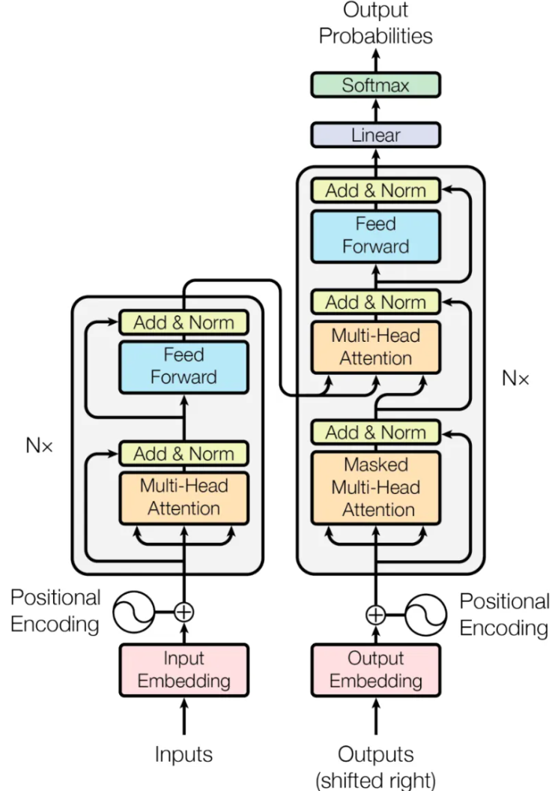
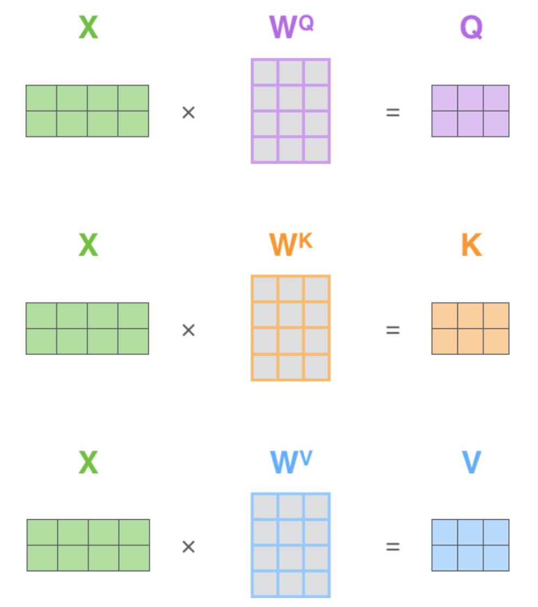

# Attention is all you need

!!! info "相关信息"
    <font size = 3.5>
    
    论文地址：[Attention is all you need](https://arxiv.org/abs/1706.03762)

    代码（Pytorch版）:[https://github.com/jadore801120/attention-is-all-you-need-pytorch/tree/master?tab=readme-ov-file](https://github.com/jadore801120/attention-is-all-you-need-pytorch/tree/master?tab=readme-ov-file)

    本页内容是对```Transformers```的文章总结/代码阅读(侧重代码学习)

    必读论文，懂的都懂，不懂的快去看。

    </font>

!!! abstract "文章摘要"
    <font size = 3.5>

    在序列建模和转换问题中，由于RNN、LSTM和门控循环神经存在各种问题，如<B>RNN难以建立长距离依赖关系，LSTM无法并行化学习</B>等，故论文提出了一种基于attention机制并完全避免循环和卷积的简单的网络架构Transformer。

    </font>




### ```Module.py```
---

- 缩放点积注意力```ScaledDotProductAttention```

    $$
    Attention(Q, K, V) = Softmax(\frac{QK^T}{\sqrt{d_k}})V
    $$

    
    
    假设$Q,K$的维度为$(N,d_k)$，$V$的维度为$(N,d_v)$，其中$Q,K,V$代表Query， Key， Value， $d_k$代表Key的维度，除以$\sqrt{d_k}$是为了防止点积过大，导致梯度消失。其中$Softmax(QK^T)$得到的维度为$(N,N)$。

    $Q$代表query，是当前要处理的词对应的向量，$K$代表key，通过计算$Q$与$K$的关系可以得到当前需要对其他词的关注度。

    

    点积注意力即是通过$Q$与$K$的点积相乘计算了相似度，其```Softmax```分数决定了在该位置的注意力权重，即对其他词的注意力程度，后与$V$相乘得到结果。

    > 在普通的```Attention```中，$K,V$对应编码器输出，$Q$对应解码器当前的输入。```Self-Attention```中，$Q,K,V$都对应于当前的输入$X$。

    


    <details> 
    <summary>Code</summary>

    ```python
    class ScaledDotProductAttention(nn.Module):
    ''' Scaled Dot-Product Attention '''

    def __init__(self, temperature, attn_dropout=0.1):
        super().__init__()
        self.temperature = temperature
        self.dropout = nn.Dropout(attn_dropout)

    def forward(self, q, k, v, mask=None):

        attn = torch.matmul(q / self.temperature, k.transpose(2, 3))

        if mask is not None:
            attn = attn.masked_fill(mask == 0, -1e9)

        attn = self.dropout(F.softmax(attn, dim=-1))
        output = torch.matmul(attn, v)

        return output, attn
    ```

    </details> 

### ```SubLayers.py```
---     

- 多头注意力机制```MultiHeadAttention```

    ```Multi-Head Attention```是一种将```Scaled Dot-Product Attention```扩展到多头的方法，它将Query, Key, Value 分别经过多个线性变换（称为“头”）后再输入到 ```Scaled Dot-Product Attention``` 中计算，最后将多个```Attention```输出按照通道维度拼接起来。
    
    $$
    MultiHeadAttention(Q,K,V) = Concat(head_1, head_2,...,head_n)W^O
    $$

    其中$head_i$表示第$i$个```Attention```头，$W^O$表示最终输出的线性变换矩阵，$n$表示头的数量。

    <details> 
    <summary>Code</summary>

    ```python
    class MultiHeadAttention(nn.Module):
    ''' Multi-Head Attention module '''

    def __init__(self, n_head, d_model, d_k, d_v, dropout=0.1):
        super().__init__()

        self.n_head = n_head
        self.d_k = d_k
        self.d_v = d_v

        self.w_qs = nn.Linear(d_model, n_head * d_k, bias=False)
        self.w_ks = nn.Linear(d_model, n_head * d_k, bias=False)
        self.w_vs = nn.Linear(d_model, n_head * d_v, bias=False)
        self.fc = nn.Linear(n_head * d_v, d_model, bias=False)

        self.attention = ScaledDotProductAttention(temperature=d_k ** 0.5)

        self.dropout = nn.Dropout(dropout)
        self.layer_norm = nn.LayerNorm(d_model, eps=1e-6)


    def forward(self, q, k, v, mask=None):

        d_k, d_v, n_head = self.d_k, self.d_v, self.n_head
        sz_b, len_q, len_k, len_v = q.size(0), q.size(1), k.size(1), v.size(1)

        residual = q

        # Pass through the pre-attention projection: b x lq x (n*dv)
        # Separate different heads: b x lq x n x dv
        q = self.w_qs(q).view(sz_b, len_q, n_head, d_k)
        k = self.w_ks(k).view(sz_b, len_k, n_head, d_k)
        v = self.w_vs(v).view(sz_b, len_v, n_head, d_v)

        # Transpose for attention dot product: b x n x lq x dv
        q, k, v = q.transpose(1, 2), k.transpose(1, 2), v.transpose(1, 2)

        if mask is not None:
            mask = mask.unsqueeze(1)   # For head axis broadcasting.

        q, attn = self.attention(q, k, v, mask=mask)

        # Transpose to move the head dimension back: b x lq x n x dv
        # Combine the last two dimensions to concatenate all the heads together: b x lq x (n*dv)
        q = q.transpose(1, 2).contiguous().view(sz_b, len_q, -1)
        q = self.dropout(self.fc(q))
        q += residual

        q = self.layer_norm(q)

        return q, attn
    ```

    </details> 