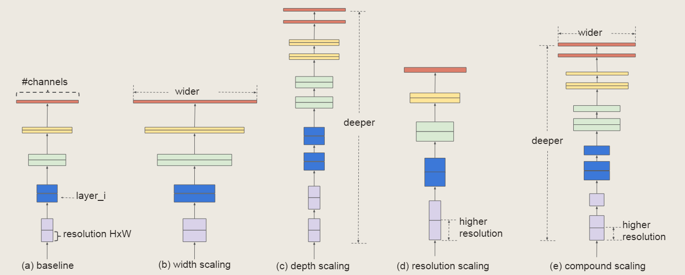
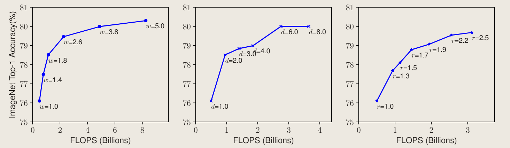
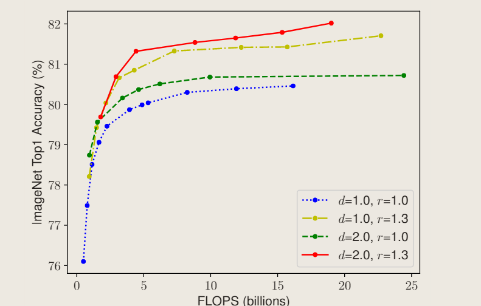
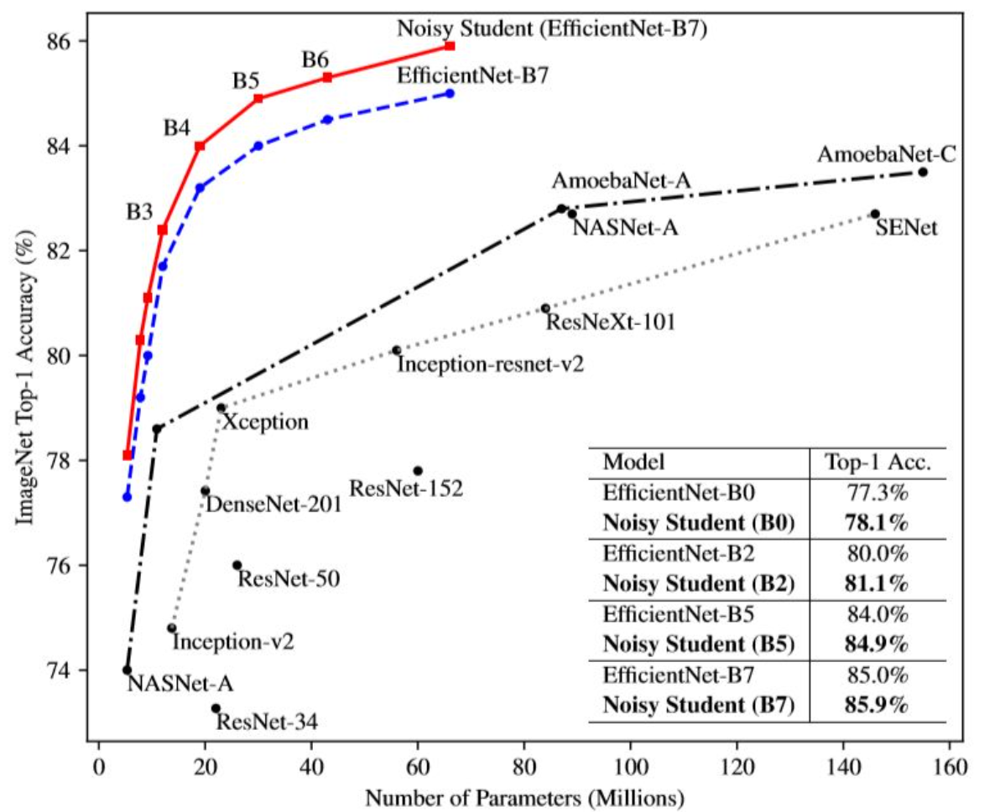
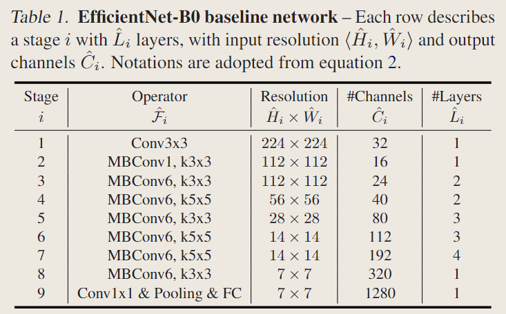
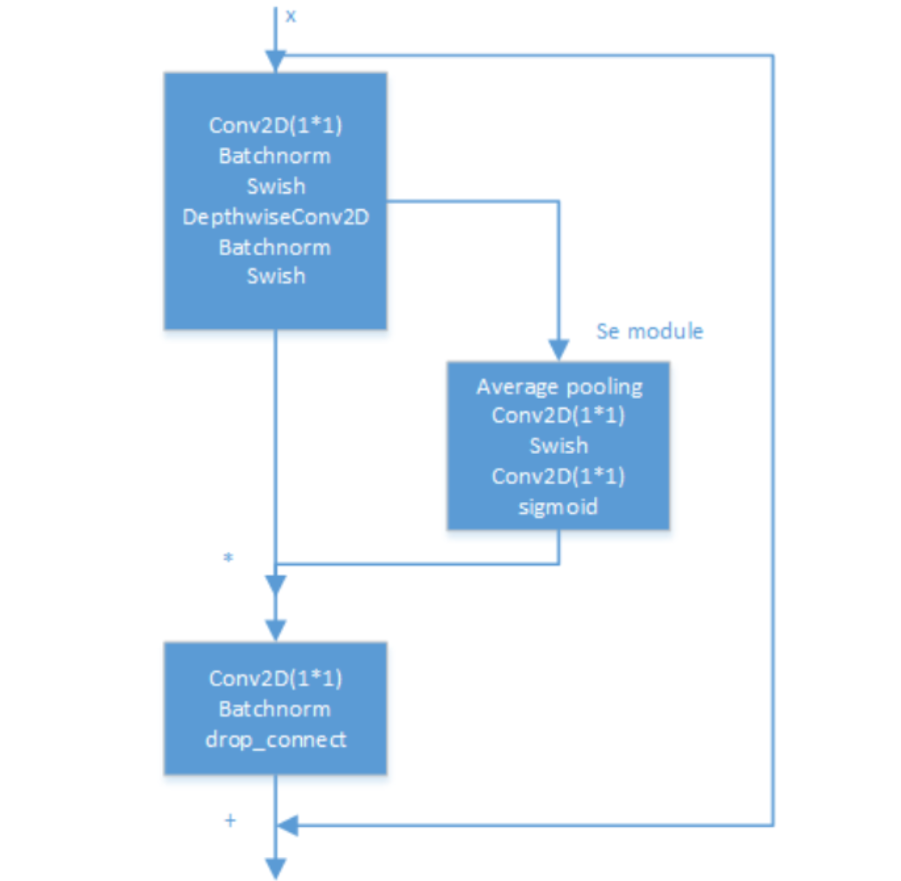
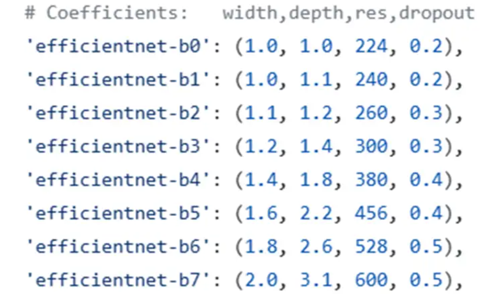

# EfficientNet

<script src="https://polyfill.io/v3/polyfill.min.js?features=es6"></script>
<script src="https://cdn.jsdelivr.net/npm/mathjax@3/es5/tex-chtml.js"></script>

!!! info "相关信息"
    <font size = 3.5>
    
    论文地址：[EfficientNet:Rethinking Model Scaling for Convolutional Neural Networks](https://arxiv.org/pdf/1905.11946)

    代码（Pytorch版）:[https://github.com/lukemelas/EfficientNet-PyTorch/](https://github.com/lukemelas/EfficientNet-PyTorch/)

    本页内容是对```EfficientNet```的文章总结/代码阅读(侧重代码学习)

    这是我阅读的第一篇DL论文与源码

    </font>

!!! abstract "文章摘要"
    <font size = 3.5>

    EfficientNet这篇论文提出了一种新的模型缩放方法，通过仔细平衡网络深度（```depth```）、宽度(```width```)和分辨率(```resolutinon```)，在保持模型复杂度不变的情况下，显著提高了模型的性能。

    </font>



传统的方法大多将卷积神经网络的规模分为以下几个维度之一:

- ```Depth (d)```：更深层次的```ConvNet```能够捕获更丰富、更复杂的特性，并能很好地概括新任务。然而，由于梯度消失问题，更深的网络也更难以训练。虽然```skip connections```和```BatchNorm```等技术缓解了训练问题，但是非常深的网络的准确率提高降低

- ```Width (w)```：更广泛的网络往往能够捕获更多的细粒度特征，更容易训练。然而，极宽但较浅的网络往往难以捕获更高层次的特征。当网络变得更宽时，随着w的增大，准确率很快饱和

- ```Resolution (r)```：增加输入网络的图像分辨率能够潜在得获得更高细粒度(fine-grained)的特征模板，但对于非常高的输入分辨率，准确率的增益也会减小。并且大分辨率图像会增加计算量。



由上图可知，扩大网络宽度、深度或分辨率的任何维度可以提高准确性，但对于较大的模型，精度增益会降低。

因此，为了追求更好的准确性和效率，在```ConvNet```缩放过程中，<B>平衡网络宽度、深度和分辨率的所有维度是至关重要的。</B>



文章提出了一种新的缩放方法，称为复合缩放方法
（```Compound Scaling```），它通过同时缩放深度、宽度和分辨率，以保持模型复杂度恒定，从而在保持模型复杂度不变的情况下，显著提高了模型的性能。

该方法使用复合系数$\phi$以特定的方式均匀缩放网络宽度、深度和分辨率：

\[
    \begin{aligned}
    \text{depth：} &d = \alpha^\phi    \\
    \text{width：} &w = \beta^\phi     \\
    \text{resolution：} &r = \gamma^\phi  \\
    s.t. \; &\alpha \cdot \beta^2 \cdot \gamma^2 \approx 2 \\
    &\alpha ≥ 1，\beta ≥ 1，\gamma ≥ 1  \\
    \end{aligned}
\]

其中，$\phi$是一个user-specified缩放系数，受限于可用的资源数量，而$\alpha,\beta,\gamma$是可以通过small grid search确定的常数。

!!! note "```卷积层的FLOPs```"
    <font size = 3.5>

    ```FLOPs（floating point operations）```用来计算整个网络模型中乘法/加法的运行次数，可以用来衡量一个算法/模型等的复杂度。

    对于常规的卷积操作的```FLOPs```与$d,w^2.r^2$成正比，即网络深度加倍会使```FLOPs```加倍，而网络宽度、分辨率加倍会使```FLOPs```增加4倍。

    对于一个卷积层:

    $$
    params = C_o \times (k_w \times k_h \times C_i + 1)
    $$

    若为正方形卷积核则：

    $$
    params = C_o \times (k^2 \times C_i + 1)
    $$

    > 使用```Batch Norm```时不需要```bias```，此时计算式中的```+1```项去除。

    $$
    FLOPs = C_o \times H \times W \times [(C_i \times k_w \times k_h) + (C_i \times k_w \times k_h - 1) + 1]
    $$

    其中，$C_i \times k_w \times k_h$表示一次卷积操作中的乘法运算量，$C_i \times k_w \times k_h - 1$表示一次卷积操作中的加法运算量。

    对于正方形卷积核：

    $$
    FLOPs = 2 \times C_i \times C_o \times H \times W \times k^2
    $$

    在论文中，常常将一个’乘-加’组合视为一次浮点运算（```Multi-Add```）即：

    $$
    FLOPs = C_i \times C_o \times H \times W \times k^2
    $$
    </font>

本文中提出$FOLPs \propto (\alpha \times \beta^2 \times \gamma^2)^\phi$，并且约束$\alpha \times \beta^2 \times \gamma^2 \approx 2$使得$FOLPs \propto 2^\phi$

假设卷积核大小（$k^2$）和输入通道数($c_i$)都是常数，则：

$$
FLOPs \propto H \times W \times C_o
$$

由于$d$表示网络深度（卷积层的数量），$w$表示网络宽度（输出通道数的倍数），$r$表示分辨率（$h$和$w$的倍数）：

$$
FLOPs \propto d \times w^2 \times r^2
$$

> 网络深度d没有平方是因为它只影响卷积层的数量，而不影响每个卷积层的计算量





当图像分辨率增大时，```EfficientNet```的所有卷积层和池化层的输入和输出尺寸也会相应地增大。但是，```EfficientNet```的卷积层和池化层的```kernel_size```和```stride```不会发生变化。这意味着，当图像分辨率增大时，```EfficientNet```的卷积层和池化层的感受野也会相应地增大。这有助于网络捕捉更多的细节和上下文信息。

```EfficientNet```的全连接层的输入尺寸也会随着图像分辨率的增大而增大，但是输出尺寸不会变化。这意味着，当图像分辨率增大时，```EfficientNet```的全连接层需要更多的参数来处理更多的特征。

另外，模型可以在训练时使用```AdvProp```（对抗样本），（```Noisy Student```），```AutoAugment```，```label smoothing```等技术来增强训练效果。

### ```utils.py```
---

- 使用```collections.namedtuple()```自定义需要输入的参数结构，非常方便：

    <details> 
    <summary>Code</summary>
    
    ```python
    import collections 
    # Parameters for the entire model (stem, all blocks, and head)
    GlobalParams = collections.namedtuple('GlobalParams', [
        'width_coefficient', 'depth_coefficient', 'image_size', 'dropout_rate',
        'num_classes', 'batch_norm_momentum', 'batch_norm_epsilon',
        'drop_connect_rate', 'depth_divisor', 'min_depth'])

    # Parameters for an individual model block
    BlockArgs = collections.namedtuple('BlockArgs', [
        'num_repeat', 'kernel_size', 'stride', 'expand_ratio',
        'input_filters', 'output_filters', 'se_ratio', 'id_skip'])

    # Set GlobalParams and BlockArgs's defaults (参数初始化)
    GlobalParams.__new__.__defaults__ = (None,) * len(GlobalParams._fields)
    BlockArgs.__new__.__defaults__ = (None,) * len(BlockArgs._fields)
    ```
    </details> 

- 自定义```Swish```激活函数（注意```torch.autograd.Funciton```的使用）：

    <details> 
    <summary>Code：Swish</summary>
    ```python
    # A memory-efficient implementation of Swish function
    class SwishImplementation(torch.autograd.Function):
        @staticmethod
        def forward(ctx, i):
            result = i * torch.sigmoid(i)
            ctx.save_for_backward(i)
            return result

        @staticmethod
        def backward(ctx, grad_output):
            i = ctx.saved_tensors[0]
            sigmoid_i = torch.sigmoid(i)
            return grad_output * (sigmoid_i * (1 + i * (1 - sigmoid_i)))

    class MemoryEfficientSwish(nn.Module):
        def forward(self, x):
            return SwishImplementation.apply(x)
    ```
    </details> 

- 自定义的```Dropconnect```层:
    
    <details> 
    <summary>Code：drop_connect</summary>
    
    ```python
    def drop_connect(inputs, p, training):
        """Drop connect.
        
        Args:
            input (tensor: BCWH): Input of this structure.
            p (float: 0.0~1.0): Probability of drop connection.
            training (bool): The running mode.

        Returns:
            output: Output after drop connection.
        """
        assert p >= 0 and p <= 1, 'p must be in range of [0,1]'
        # assert 先判断参数条件，很常见的操作

        if not training:
            return inputs
            # 判断若处在训练过程，则启用dropout

        batch_size = inputs.shape[0]
        keep_prob = 1 - p

        # generate binary_tensor mask according to probability (p for 0, 1-p for 1)
        random_tensor = keep_prob
        random_tensor += torch.rand([batch_size, 1, 1, 1], dtype=inputs.dtype, device=inputs.device) # .rand() [0,1)的均匀分布
        binary_tensor = torch.floor(random_tensor) # 掩码矩阵

        output = inputs / keep_prob * binary_tensor
        return output
    ```

    </details> 

- 由于```EfficientNet```源码是使用```tensorflow```实现的，在卷积方式上存在不同之处，即```'SAME'```与```'VALID'```。

    若卷积方式设为```'SAME'```，则卷积后输出的特征图与```kernel_size```无关，只跟```stride```有关。若```stride=1```，前后特征图大小保持不变，即自动```padding```补全。

    <details> 
    <summary>Code1：get_shape</summary>
    
    ```python
    def calculate_output_image_size(input_image_size, stride):
        """实现'SAME'方法下输出卷积特征图大小（根据stride）

        Args:
            input_image_size (int, tuple or list): Size of input image.
            stride (int, tuple or list): Conv2d operation's stride.

        Returns:
            output_image_size: A list [H,W].
        """
        if input_image_size is None:
            return None
        image_height, image_width = get_width_and_height_from_size(input_image_size)
        stride = stride if isinstance(stride, int) else stride[0]
        # 检查输入，在项目中很常见

        image_height = int(math.ceil(image_height / stride))
        image_width = int(math.ceil(image_width / stride))
        # 根据给定的stride计算特征图大小
        
        return [image_height, image_width]

    ```

    </details> 

    <details> 
    <summary>Code2：Conv2d_Dynamic_Same_Padding</summary>
    
    ```python
    class Conv2dDynamicSamePadding(nn.Conv2d):
        """2D Convolutions like TensorFlow, for a dynamic image size.
        The padding is operated in forward function by calculating dynamically.
        """
        # Tips for 'SAME' mode padding.
        #     Given the following:
        #         i: width or height
        #         s: stride
        #         k: kernel size
        #         d: dilation
        #         p: padding
        #     Output after Conv2d:
        #         o = floor((i+p-((k-1)*d+1))/s+1)
        # If o equals i, i = floor((i+p-((k-1)*d+1))/s+1),
        # => p = (i-1)*s+((k-1)*d+1)-i

        # 动态填充操作，每次前向传播时都需要重新计算填充量，适用于输入图像大小不固定的情况。

        def __init__(self, in_channels, out_channels, kernel_size, stride=1, dilation=1, groups=1, bias=True):
            super().__init__(in_channels, out_channels, kernel_size, stride, 0, dilation, groups, bias)
            self.stride = self.stride if len(self.stride) == 2 else [self.stride[0]] * 2

            # stride -> list 分为水平/垂直方向

        def forward(self, x):
            ih, iw = x.size()[-2:]  # input's height,width
            kh, kw = self.weight.size()[-2:] # self.weight从nn.Conv2d继承，代表卷积核
            sh, sw = self.stride # 水平/垂直方向stride
            oh, ow = math.ceil(ih / sh), math.ceil(iw / sw) # change the output size according to stride ! ! !
            
            pad_h = max((oh - 1) * self.stride[0] + (kh - 1) * self.dilation[0] + 1 - ih, 0)
            pad_w = max((ow - 1) * self.stride[1] + (kw - 1) * self.dilation[1] + 1 - iw, 0)
            
            if pad_h > 0 or pad_w > 0:
                x = F.pad(x, [pad_w // 2, pad_w - pad_w // 2, pad_h // 2, pad_h - pad_h // 2])
                # [左填充数， 右填充数， 上填充数， 下填充数]
            
            return F.conv2d(x, self.weight, self.bias, self.stride, self.padding, self.dilation, self.groups)

    class Conv2dStaticSamePadding(nn.Conv2d):
        """2D Convolutions like TensorFlow's 'SAME' mode, with the given input image size.
        The padding module is calculated in construction function, then used in forward.
        """

        # With the same calculation as Conv2dDynamicSamePadding

        # 静态填充，已知输入图像大小，在初始化时就计算填充量并且固定，适用于输入图像大小固定的情况。

        def __init__(self, in_channels, out_channels, kernel_size, stride=1, image_size=None, **kwargs):
            super().__init__(in_channels, out_channels, kernel_size, stride, **kwargs)
            self.stride = self.stride if len(self.stride) == 2 else [self.stride[0]] * 2

            # Calculate padding based on image size and save it
            assert image_size is not None # 固定输入图像大小
            
            ih, iw = (image_size, image_size) if isinstance(image_size, int) else image_size # 常见操作

            kh, kw = self.weight.size()[-2:]
            sh, sw = self.stride
            oh, ow = math.ceil(ih / sh), math.ceil(iw / sw)

            pad_h = max((oh - 1) * self.stride[0] + (kh - 1) * self.dilation[0] + 1 - ih, 0)
            pad_w = max((ow - 1) * self.stride[1] + (kw - 1) * self.dilation[1] + 1 - iw, 0)
            
            if pad_h > 0 or pad_w > 0:
                self.static_padding = nn.ZeroPad2d((pad_w // 2, pad_w - pad_w // 2, pad_h // 2, pad_h - pad_h // 2))
            else:
                self.static_padding = Identity()

        def forward(self, x):
            x = self.static_padding(x)
            x = F.conv2d(x, self.weight, self.bias, self.stride, self.padding, self.dilation, self.groups)
            return x

    def get_same_padding_conv2d(image_size=None):
        """Chooses static padding if you have specified an image size, and dynamic padding otherwise.
        Static padding is necessary for ONNX exporting of models.

        Args:
            image_size (int or tuple): Size of the image.

        Returns:
            Conv2dDynamicSamePadding or Conv2dStaticSamePadding.
        """
        if image_size is None:
            return Conv2dDynamicSamePadding
        else:
            return partial(Conv2dStaticSamePadding, image_size=image_size)

    class Identity(nn.Module):
        """Identity mapping.
        Send input to output directly.
        """

        # 一个简单的映射层，其功能是将输入直接传递到输出，而不做任何修改
        def __init__(self):
            super(Identity, self).__init__()

        def forward(self, input):
            return input
    ```

    </details>


    <details> 
    <summary>Code3：MaxPool2d_Same_Padding</summary>
    
    ```python
    class MaxPool2dDynamicSamePadding(nn.MaxPool2d):
        """2D MaxPooling like TensorFlow's 'SAME' mode, with a dynamic image size.
        The padding is operated in forward function by calculating dynamically.
        """

        def __init__(self, kernel_size, stride, padding=0, dilation=1, return_indices=False, ceil_mode=False):
            super().__init__(kernel_size, stride, padding, dilation, return_indices, ceil_mode)
            self.stride = [self.stride] * 2 if isinstance(self.stride, int) else self.stride
            self.kernel_size = [self.kernel_size] * 2 if isinstance(self.kernel_size, int) else self.kernel_size
            self.dilation = [self.dilation] * 2 if isinstance(self.dilation, int) else self.dilation

        def forward(self, x):
            ih, iw = x.size()[-2:]
            kh, kw = self.kernel_size
            sh, sw = self.stride
            oh, ow = math.ceil(ih / sh), math.ceil(iw / sw)
            pad_h = max((oh - 1) * self.stride[0] + (kh - 1) * self.dilation[0] + 1 - ih, 0)
            pad_w = max((ow - 1) * self.stride[1] + (kw - 1) * self.dilation[1] + 1 - iw, 0)
            if pad_h > 0 or pad_w > 0:
                x = F.pad(x, [pad_w // 2, pad_w - pad_w // 2, pad_h // 2, pad_h - pad_h // 2])
            return F.max_pool2d(x, self.kernel_size, self.stride, self.padding,
                                self.dilation, self.ceil_mode, self.return_indices)

    class MaxPool2dStaticSamePadding(nn.MaxPool2d):
        """2D MaxPooling like TensorFlow's 'SAME' mode, with the given input image size.
        The padding mudule is calculated in construction function, then used in forward.
        """

        def __init__(self, kernel_size, stride, image_size=None, **kwargs):
            super().__init__(kernel_size, stride, **kwargs)
            self.stride = [self.stride] * 2 if isinstance(self.stride, int) else self.stride
            self.kernel_size = [self.kernel_size] * 2 if isinstance(self.kernel_size, int) else self.kernel_size
            self.dilation = [self.dilation] * 2 if isinstance(self.dilation, int) else self.dilation

            # Calculate padding based on image size and save it
            assert image_size is not None
            ih, iw = (image_size, image_size) if isinstance(image_size, int) else image_size
            kh, kw = self.kernel_size
            sh, sw = self.stride
            oh, ow = math.ceil(ih / sh), math.ceil(iw / sw)
            pad_h = max((oh - 1) * self.stride[0] + (kh - 1) * self.dilation[0] + 1 - ih, 0)
            pad_w = max((ow - 1) * self.stride[1] + (kw - 1) * self.dilation[1] + 1 - iw, 0)
            if pad_h > 0 or pad_w > 0:
                self.static_padding = nn.ZeroPad2d((pad_w // 2, pad_w - pad_w // 2, pad_h // 2, pad_h - pad_h // 2))
            else:
                self.static_padding = Identity()

        def forward(self, x):
            x = self.static_padding(x)
            x = F.max_pool2d(x, self.kernel_size, self.stride, self.padding,
                            self.dilation, self.ceil_mode, self.return_indices)
            return x

    def get_same_padding_maxPool2d(image_size=None):
        """Chooses static padding if you have specified an image size, and dynamic padding otherwise.
        Static padding is necessary for ONNX exporting of models.

        Args:
            image_size (int or tuple): Size of the image.

        Returns:
            MaxPool2dDynamicSamePadding or MaxPool2dStaticSamePadding.
        """
        if image_size is None:
            return MaxPool2dDynamicSamePadding
        else:
            return partial(MaxPool2dStaticSamePadding, image_size=image_size)

    # 主要细节与上面的conv2d一致
    ```
    </details>

- Helper functions for loading model params
    
    通过这些方式，可以在代码中灵活地使用字符串表示卷积块的参数，同时又能方便地进行解析和处理
    
    <details> 
    <summary>Code4：查询各个模型的复合系数</summary>
    
    ```python
    def efficientnet_params(model_name):
        """Map EfficientNet model name to parameter coefficients.

        Args:
            model_name (str): Model name to be queried.

        Returns:
            params_dict[model_name]: A (width,depth,res,dropout) tuple.
        """

        # 查询作者计算的一系列模型复合系数

        params_dict = {
            # Coefficients:   width,depth,res,dropout
            'efficientnet-b0': (1.0, 1.0, 224, 0.2),
            'efficientnet-b1': (1.0, 1.1, 240, 0.2),
            'efficientnet-b2': (1.1, 1.2, 260, 0.3),
            'efficientnet-b3': (1.2, 1.4, 300, 0.3),
            'efficientnet-b4': (1.4, 1.8, 380, 0.4),
            'efficientnet-b5': (1.6, 2.2, 456, 0.4),
            'efficientnet-b6': (1.8, 2.6, 528, 0.5),
            'efficientnet-b7': (2.0, 3.1, 600, 0.5),
            'efficientnet-b8': (2.2, 3.6, 672, 0.5),
            'efficientnet-l2': (4.3, 5.3, 800, 0.5),
        }
        return params_dict[model_name]
    ```
    </details>
    
    
    <details> 
    <summary>Code5：读取模块参数字符串,例如'r1_k3_s11_e1_i32_o16_se0.25_noskip'</summary>
    
    ```python
    class BlockDecoder(object):
        """Block Decoder for readability,
        straight from the official TensorFlow repository.
        """

        @staticmethod
        def _decode_block_string(block_string):
            """Get a block through a string notation of arguments.

            Args:
                block_string (str): A string notation of arguments.
                                    Examples: 'r1_k3_s11_e1_i32_o16_se0.25_noskip'.

            Returns:
                BlockArgs: The namedtuple defined at the top of this file.
            """

            # 通过参数的字符串表示法获取一个模块

            assert isinstance(block_string, str)

            ops = block_string.split('_')
            options = {}
            for op in ops:
                splits = re.split(r'(\d.*)', op)
                # 通过正则表达式将每个参数分割成键值对，例如 'r1' 分割成 ('r', '1')。
                if len(splits) >= 2:
                    key, value = splits[:2]
                    options[key] = value

            #检查 stride 参数是否有效。
            assert (('s' in options and len(options['s']) == 1) or
                    (len(options['s']) == 2 and options['s'][0] == options['s'][1]))

            return BlockArgs(
                num_repeat=int(options['r']),
                kernel_size=int(options['k']),
                stride=[int(options['s'][0])],
                expand_ratio=int(options['e']),
                input_filters=int(options['i']),
                output_filters=int(options['o']),
                se_ratio=float(options['se']) if 'se' in options else None,
                id_skip=('noskip' not in block_string)
                )
           # 将解析后的参数转换成BlockArgs(namedtuple)，并返回
        
        @staticmethod
        def _encode_block_string(block):
            """Encode a block to a string.

            Args:
                block (namedtuple): A BlockArgs type argument.

            Returns:
                block_string: A String form of BlockArgs.
            """

            # 将一个 BlockArgs(namedtuple)编码为字符串。
            args = [
                'r%d' % block.num_repeat,
                'k%d' % block.kernel_size,
                's%d%d' % (block.strides[0], block.strides[1]),
                'e%s' % block.expand_ratio,
                'i%d' % block.input_filters,
                'o%d' % block.output_filters
            ]

            if 0 < block.se_ratio <= 1:
                args.append('se%s' % block.se_ratio)
            if block.id_skip is False:
                args.append('noskip')
            return '_'.join(args)

        
        @staticmethod
        def decode(string_list):
            """Decode a list of string notations to specify blocks inside the network.

            Args:
                string_list (list[str]): A list of strings, each string is a notation of block.

            Returns:
                blocks_args: A list of BlockArgs namedtuples of block args.
            """
            # 解码含有字符串符号的列表，来指定网络内的块。列表中的每个字符串代表一个不同的块

            assert isinstance(string_list, list)
            blocks_args = []
            for block_string in string_list:
                blocks_args.append(BlockDecoder._decode_block_string(block_string))
            return blocks_args

        
        @staticmethod
        def encode(blocks_args):
            """Encode a list of BlockArgs to a list of strings.

            Args:
                blocks_args (list[namedtuples]): A list of BlockArgs namedtuples of block args.

            Returns:
                block_strings: A list of strings, each string is a notation of block.
            """

            # 与decode(string_list)功能相反

            block_strings = []
            for block in blocks_args:
                block_strings.append(BlockDecoder._encode_block_string(block))
            return block_strings
    ```
    </details>


    <details> 
    <summary>Code7：为模型创建BlockArgs和GlobalParams</summary>
    
    ```python
    def efficientnet(width_coefficient=None, depth_coefficient=None, image_size=None,dropout_rate=0.2, drop_connect_rate=0.2,num_classes=1000):
        """Create BlockArgs and GlobalParams for efficientnet model.

        Args:
            width_coefficient (float)
            depth_coefficient (float)
            image_size (int)
            dropout_rate (float)
            drop_connect_rate (float)
            num_classes (int)

            Meaning as the name suggests.

        Returns:
            blocks_args, global_params.
        """

        # Blocks args for the whole model(efficientnet-b0 by default)
        # It will be modified in the construction of EfficientNet Class according to model

        # 为整个模型设置 Blocks args

        blocks_args = [
            'r1_k3_s11_e1_i32_o16_se0.25',
            'r2_k3_s22_e6_i16_o24_se0.25',
            'r2_k5_s22_e6_i24_o40_se0.25',
            'r3_k3_s22_e6_i40_o80_se0.25',
            'r3_k5_s11_e6_i80_o112_se0.25',
            'r4_k5_s22_e6_i112_o192_se0.25',
            'r1_k3_s11_e6_i192_o320_se0.25',
        ]
        blocks_args = BlockDecoder.decode(blocks_args)
        # blocks_args为列表，列表每个元素为BlockArgs对象，包含r、k、s、e、i、o、se等属性

        global_params = GlobalParams(
            width_coefficient=width_coefficient,
            depth_coefficient=depth_coefficient,
            image_size=image_size,
            dropout_rate=dropout_rate,

            num_classes=num_classes,
            batch_norm_momentum=0.99,
            batch_norm_epsilon=1e-3,
            drop_connect_rate=drop_connect_rate,
            depth_divisor=8, # 常见的深度除数8,16,64...
            min_depth=None,
        )

        return blocks_args, global_params


    def get_model_params(model_name, override_params):
        """Get the block args and global params for a given model name.

        Args:
            model_name (str): 模型名称，如"efficientnet-b0", "efficientnet-b1"等.
            override_params (dict): 一个用于修改全局参数global_params的字典.

        Returns:
            blocks_args, global_params
        """

        # 获取给定模型名称的块参数和全局参数。

        if model_name.startswith('efficientnet'):
            w, d, s, p = efficientnet_params(model_name)
            # 读取作者已准备的模型参数，如efficientnet-b7等

            # note: all models have drop connect rate = 0.2
            blocks_args, global_params = efficientnet(
                width_coefficient=w, depth_coefficient=d, dropout_rate=p, image_size=s)
        else:
            raise NotImplementedError('model name is not pre-defined: %s' % model_name)

        if override_params:
            # ValueError will be raised here if override_params has fields not included in global_params.
            global_params = global_params._replace(**override_params)
            # 将override_params解包读入，替换原本global_params中的参数
            
            # _replace() 是 Python 中 namedtuple 类型的一种方法，用于创建一个新的 namedtuple 实例，该实例是对原有实例进行指定字段的替换后生成的。它不会修改原来的 namedtuple，而是返回一个新的实例。
        
        return blocks_args, global_params
    ```
    </details>


- 卷积核缩放```round_filters```/```round_repeat```

    <details> 
    <summary>Code：round_filters/round_repeat</summary>
    ```python
    def round_filters(filters, global_params):
        """Calculate and round number of filters based on width multiplier.
        Use width_coefficient, depth_divisor and min_depth of global_params.

        Args:
            filters (int): Filters number to be calculated.
            global_params (namedtuple): Global params of the model.

        Returns:
            new_filters: New filters number after calculating.
        """
        multiplier = global_params.width_coefficient
        if not multiplier:
            return filters
        # TODO: modify the params names.
        #       maybe the names (width_divisor,min_width)
        #       are more suitable than (depth_divisor,min_depth).
        divisor = global_params.depth_divisor
        min_depth = global_params.min_depth
        filters *= multiplier
        min_depth = min_depth or divisor # pay attention to this line when using min_depth
        # follow the formula transferred from official TensorFlow implementation
        new_filters = max(min_depth, int(filters + divisor / 2) // divisor * divisor)
        if new_filters < 0.9 * filters: # prevent rounding by more than 10%
            new_filters += divisor
        return int(new_filters)


    def round_repeats(repeats, global_params):
        """Calculate module's repeat number of a block based on depth multiplier.
        Use depth_coefficient of global_params.

        Args:
            repeats (int): num_repeat to be calculated.
            global_params (namedtuple): Global params of the model.

        Returns:
            new repeat: New repeat number after calculating.
        """
        multiplier = global_params.depth_coefficient
        if not multiplier:
            return repeats
        # follow the formula transferred from official TensorFlow implementation
        return int(math.ceil(multiplier * repeats))

    ```

    </details>


### ```model.py```
---

原始模型```Efficient Net-B0```:



主要的构建模块为```Mobile inverted bottleneck MBConv```(出自MobileNet v2论文)



其中，该模型将```ReLU```换成了```Swish```，使用了```drop_connect```方法来代替传统的```dropout```方法

$\alpha，\beta，\gamma$缩放步骤：

- 首先固定$\phi = 1$，对$\alpha，\beta，\gamma$进行```small grid search```,在$\alpha \times \beta^2 \times \gamma^2 ≈ 2$约束下，找到最优的$\alpha，\beta，\gamma$，我们发现```EfficientNet-B0```的最佳值为 ```\alpha=1.2，\beta=1.1，\gamma=1.15```

- 其次，我们将$\alpha，\beta，\gamma$固定为常数，并缩放具有不同$\phi$的基线网络，以获得```EfficientNet-B1 到 B7```




- 主要模块：MBConvBlock,包含各种构建技巧
    
    <details> 
    <summary>Code1：MBConvBlock</summary>

    ```python
    class MBConvBlock(nn.Module):
        """Mobile Inverted Residual Bottleneck Block.

        Args:
            block_args (namedtuple): BlockArgs, defined in utils.py.
            global_params (namedtuple): GlobalParam, defined in utils.py.
            image_size (tuple or list): [image_height, image_width].

        References:
            [1] https://arxiv.org/abs/1704.04861 (MobileNet v1)
            [2] https://arxiv.org/abs/1801.04381 (MobileNet v2)
            [3] https://arxiv.org/abs/1905.02244 (MobileNet v3)
        """

        def __init__(self, block_args, global_params, image_size=None):
            super().__init__()
            self._block_args = block_args 
            # 块参数
            self._bn_mom = 1 - global_params.batch_norm_momentum # pytorch's difference from tensorflow
            self._bn_eps = global_params.batch_norm_epsilon
            self.has_se = (self._block_args.se_ratio is not None) and (0 < self._block_args.se_ratio <= 1)
            self.id_skip = block_args.id_skip  # whether to use skip connection and drop connect
            
            # Expansion phase (Inverted Bottleneck) 扩张
            inp = self._block_args.input_filters  # number of input channels
            oup = self._block_args.input_filters * self._block_args.expand_ratio  # number of output channels

            if self._block_args.expand_ratio != 1:
                Conv2d = get_same_padding_conv2d(image_size=image_size) # 静态 or 动态
                self._expand_conv = Conv2d(in_channels=inp, out_channels=oup, kernel_size=1, bias=False)
                self._bn0 = nn.BatchNorm2d(num_features=oup, momentum=self._bn_mom, eps=self._bn_eps)
                # image_size = calculate_output_image_size(image_size, 1) <-- kernel_size=1 wouldn't modify image_size

            # Depthwise convolution phase 深度可分离卷积
            k = self._block_args.kernel_size
            s = self._block_args.stride
            Conv2d = get_same_padding_conv2d(image_size=image_size)
            self._depthwise_conv = Conv2d(
                in_channels=oup, out_channels=oup, groups=oup,  # groups makes it depthwise
                kernel_size=k, stride=s, bias=False)
            self._bn1 = nn.BatchNorm2d(num_features=oup, momentum=self._bn_mom, eps=self._bn_eps)
            image_size = calculate_output_image_size(image_size, s)

            # Squeeze and Excitation layer, if desired
            if self.has_se:
                # 先AveragePooling()
                Conv2d = get_same_padding_conv2d(image_size=(1,1))
                num_squeezed_channels = max(1, int(self._block_args.input_filters * self._block_args.se_ratio))
                self._se_reduce = Conv2d(in_channels=oup, out_channels=num_squeezed_channels, kernel_size=1)
                self._se_expand = Conv2d(in_channels=num_squeezed_channels, out_channels=oup, kernel_size=1)

            # Pointwise convolution phase 逐点卷积
            final_oup = self._block_args.output_filters
            Conv2d = get_same_padding_conv2d(image_size=image_size)
            self._project_conv = Conv2d(in_channels=oup, out_channels=final_oup, kernel_size=1, bias=False)
            self._bn2 = nn.BatchNorm2d(num_features=final_oup, momentum=self._bn_mom, eps=self._bn_eps)
            self._swish = MemoryEfficientSwish()

        def forward(self, inputs, drop_connect_rate=None):
            """MBConvBlock's forward function.

            Args:
                inputs (tensor): Input tensor.
                drop_connect_rate (bool): Drop connect rate (float, between 0 and 1).

            Returns:
                Output of this block after processing.
            """

            # Expansion and Depthwise Convolution
            x = inputs
            if self._block_args.expand_ratio != 1:
                x = self._expand_conv(inputs)
                x = self._bn0(x)
                x = self._swish(x)

            x = self._depthwise_conv(x)
            x = self._bn1(x)
            x = self._swish(x)

            # Squeeze and Excitation
            if self.has_se:
                x_squeezed = F.adaptive_avg_pool2d(x, 1)
                x_squeezed = self._se_reduce(x_squeezed)
                x_squeezed = self._swish(x_squeezed)
                x_squeezed = self._se_expand(x_squeezed)
                x = torch.sigmoid(x_squeezed) * x

            # Pointwise Convolution
            x = self._project_conv(x)
            x = self._bn2(x)

            # Skip connection and drop connect
            input_filters, output_filters = self._block_args.input_filters, self._block_args.output_filters
            if self.id_skip and self._block_args.stride == 1 and input_filters == output_filters:
                # The combination of skip connection and drop connect brings about stochastic depth.
                if drop_connect_rate:
                    x = drop_connect(x, p=drop_connect_rate, training=self.training)
                x = x + inputs  # skip connection
            return x

        def set_swish(self, memory_efficient=True):
            """Sets swish function as memory efficient (for training) or standard (for export).

            Args:
                memory_efficient (bool): Whether to use memory-efficient version of swish.
            """
            self._swish = MemoryEfficientSwish() if memory_efficient else Swish()

    ```
    </details>

- 主模型：

    <details> 
    <summary>Code：EfficientNet</summary>

    ```python
    class EfficientNet(nn.Module):
        """EfficientNet model.
        Most easily loaded with the .from_name or .from_pretrained methods.

        Args:
            blocks_args (list[namedtuple]): A list of BlockArgs to construct blocks.
            global_params (namedtuple): A set of GlobalParams shared between blocks.
        
        References:
            [1] https://arxiv.org/abs/1905.11946 (EfficientNet)

        Example:
            >>> import torch
            >>> from efficientnet.model import EfficientNet
            >>> inputs = torch.rand(1, 3, 224, 224)
            >>> model = EfficientNet.from_pretrained('efficientnet-b0')
            >>> model.eval()
            >>> outputs = model(inputs)
        """

        def __init__(self, blocks_args=None, global_params=None):
            super().__init__()
            assert isinstance(blocks_args, list), 'blocks_args should be a list'
            assert len(blocks_args) > 0, 'block args must be greater than 0'
            self._global_params = global_params
            self._blocks_args = blocks_args

            # Batch norm parameters
            bn_mom = 1 - self._global_params.batch_norm_momentum
            bn_eps = self._global_params.batch_norm_epsilon

            # Get stem static or dynamic convolution depending on image size
            image_size = global_params.image_size
            Conv2d = get_same_padding_conv2d(image_size=image_size)

            # Stem
            in_channels = 3  # rgb
            out_channels = round_filters(32, self._global_params)  # number of output channels
            self._conv_stem = Conv2d(in_channels, out_channels, kernel_size=3, stride=2, bias=False)
            self._bn0 = nn.BatchNorm2d(num_features=out_channels, momentum=bn_mom, eps=bn_eps)
            image_size = calculate_output_image_size(image_size, 2)

            # Build blocks
            self._blocks = nn.ModuleList([])
            for block_args in self._blocks_args:

                # Update block input and output filters based on depth multiplier.
                block_args = block_args._replace(
                    input_filters=round_filters(block_args.input_filters, self._global_params),
                    output_filters=round_filters(block_args.output_filters, self._global_params),
                    num_repeat=round_repeats(block_args.num_repeat, self._global_params)
                )

                # The first block needs to take care of stride and filter size increase.
                self._blocks.append(MBConvBlock(block_args, self._global_params, image_size=image_size))
                image_size = calculate_output_image_size(image_size, block_args.stride)
                if block_args.num_repeat > 1: # modify block_args to keep same output size
                    block_args = block_args._replace(input_filters=block_args.output_filters, stride=1)
                for _ in range(block_args.num_repeat - 1):
                    self._blocks.append(MBConvBlock(block_args, self._global_params, image_size=image_size))
                    # image_size = calculate_output_image_size(image_size, block_args.stride)  # stride = 1

            # Head
            in_channels = block_args.output_filters  # output of final block
            out_channels = round_filters(1280, self._global_params)
            # 全连接层也缩放
            Conv2d = get_same_padding_conv2d(image_size=image_size)
            self._conv_head = Conv2d(in_channels, out_channels, kernel_size=1, bias=False)
            self._bn1 = nn.BatchNorm2d(num_features=out_channels, momentum=bn_mom, eps=bn_eps)

            # Final linear layer
            self._avg_pooling = nn.AdaptiveAvgPool2d(1)
            self._dropout = nn.Dropout(self._global_params.dropout_rate)
            self._fc = nn.Linear(out_channels, self._global_params.num_classes)
            self._swish = MemoryEfficientSwish()

        def set_swish(self, memory_efficient=True):
            """Sets swish function as memory efficient (for training) or standard (for export).

            Args:
                memory_efficient (bool): Whether to use memory-efficient version of swish.

            """
            self._swish = MemoryEfficientSwish() if memory_efficient else Swish()
            for block in self._blocks:
                block.set_swish(memory_efficient)

        def extract_endpoints(self, inputs):
            """Use convolution layer to extract features
            from reduction levels i in [1, 2, 3, 4, 5].

            Args:
                inputs (tensor): Input tensor.

            Returns:
                Dictionary of last intermediate features
                with reduction levels i in [1, 2, 3, 4, 5].
                Example:
                    >>> import torch
                    >>> from efficientnet.model import EfficientNet
                    >>> inputs = torch.rand(1, 3, 224, 224)
                    >>> model = EfficientNet.from_pretrained('efficientnet-b0')
                    >>> endpoints = model.extract_endpoints(inputs)
                    >>> print(endpoints['reduction_1'].shape)  # torch.Size([1, 16, 112, 112])
                    >>> print(endpoints['reduction_2'].shape)  # torch.Size([1, 24, 56, 56])
                    >>> print(endpoints['reduction_3'].shape)  # torch.Size([1, 40, 28, 28])
                    >>> print(endpoints['reduction_4'].shape)  # torch.Size([1, 112, 14, 14])
                    >>> print(endpoints['reduction_5'].shape)  # torch.Size([1, 1280, 7, 7])
            """
            endpoints = dict()

            # Stem
            x = self._swish(self._bn0(self._conv_stem(inputs)))
            prev_x = x

            # Blocks
            for idx, block in enumerate(self._blocks):
                drop_connect_rate = self._global_params.drop_connect_rate
                if drop_connect_rate:
                    drop_connect_rate *= float(idx) / len(self._blocks) # scale drop connect_rate
                x = block(x, drop_connect_rate=drop_connect_rate)
                if prev_x.size(2) > x.size(2):
                    endpoints[f'reduction_{len(endpoints)+1}'] = prev_x
                prev_x = x

            # Head
            x = self._swish(self._bn1(self._conv_head(x)))
            endpoints[f'reduction_{len(endpoints)+1}'] = x

            return endpoints

        def extract_features(self, inputs):
            """use convolution layer to extract feature .

            Args:
                inputs (tensor): Input tensor.

            Returns:
                Output of the final convolution 
                layer in the efficientnet model.
            """
            # Stem
            x = self._swish(self._bn0(self._conv_stem(inputs)))

            # Blocks
            for idx, block in enumerate(self._blocks):
                drop_connect_rate = self._global_params.drop_connect_rate
                if drop_connect_rate:
                    drop_connect_rate *= float(idx) / len(self._blocks) # scale drop connect_rate
                    # 根据网络深度的增加来增大 drop_connect_rate，开始时drop_connect_rate较小（drop概率小）,后续依次增大
                x = block(x, drop_connect_rate=drop_connect_rate)
            
            # Head
            x = self._swish(self._bn1(self._conv_head(x)))

            return x

        def forward(self, inputs):
            """EfficientNet's forward function.
            Calls extract_features to extract features, applies final linear layer, and returns logits.

            Args:
                inputs (tensor): Input tensor.

            Returns:
                Output of this model after processing.
            """
            # Convolution layers
            x = self.extract_features(inputs)

            # Pooling and final linear layer
            x = self._avg_pooling(x)
            x = x.flatten(start_dim=1)
            x = self._dropout(x)
            x = self._fc(x)

            return x

        @classmethod
        def from_name(cls, model_name, in_channels=3, **override_params):
            # 加载模型
            
            """create an efficientnet model according to name.

            Args:
                model_name (str): Name for efficientnet.
                in_channels (int): Input data's channel number.
                override_params (other key word params): 
                    Params to override model's global_params.
                    Optional key:
                        'width_coefficient', 'depth_coefficient',
                        'image_size', 'dropout_rate',
                        'num_classes', 'batch_norm_momentum',
                        'batch_norm_epsilon', 'drop_connect_rate',
                        'depth_divisor', 'min_depth'

            Returns:
                An efficientnet model.
            """
            cls._check_model_name_is_valid(model_name)
            blocks_args, global_params = get_model_params(model_name, override_params)
            model = cls(blocks_args, global_params)
            model._change_in_channels(in_channels)
            return model

        @classmethod
        def from_pretrained(cls, model_name, weights_path=None, advprop=False, 
                            in_channels=3, num_classes=1000, **override_params):
            # 加载预训练（pretrained）的模型
            
            """create an efficientnet model according to name.

            Args:
                model_name (str): Name for efficientnet.
                weights_path (None or str): 
                    str: path to pretrained weights file on the local disk.
                    None: use pretrained weights downloaded from the Internet.
                advprop (bool): 
                    Whether to load pretrained weights
                    trained with advprop (valid when weights_path is None).
                in_channels (int): Input data's channel number.
                num_classes (int): 
                    Number of categories for classification.
                    It controls the output size for final linear layer.
                override_params (other key word params): 
                    Params to override model's global_params.
                    Optional key:
                        'width_coefficient', 'depth_coefficient',
                        'image_size', 'dropout_rate',
                        'num_classes', 'batch_norm_momentum',
                        'batch_norm_epsilon', 'drop_connect_rate',
                        'depth_divisor', 'min_depth'

            Returns:
                A pretrained efficientnet model.
            """
            model = cls.from_name(model_name, num_classes = num_classes, **override_params)
            load_pretrained_weights(model, model_name, weights_path=weights_path, load_fc=(num_classes == 1000), advprop=advprop)
            model._change_in_channels(in_channels)
            return model

        @classmethod
        def get_image_size(cls, model_name):
            """Get the input image size for a given efficientnet model.

            Args:
                model_name (str): Name for efficientnet.

            Returns:
                Input image size (resolution).
            """
            cls._check_model_name_is_valid(model_name)
            _, _, res, _ = efficientnet_params(model_name) 
            # 返回parameter coefficients的resolution(图片分辨率)
            return res

        @classmethod
        def _check_model_name_is_valid(cls, model_name):
            """Validates model name. 

            Args:
                model_name (str): Name for efficientnet.

            Returns:
                bool: Is a valid name or not.
            """
            if model_name not in VALID_MODELS:
                raise ValueError('model_name should be one of: ' + ', '.join(VALID_MODELS))

        def _change_in_channels(self, in_channels):
            """Adjust model's first convolution layer to in_channels, if in_channels not equals 3.

            Args:
                in_channels (int): Input data's channel number.
            """
            if in_channels != 3:
                Conv2d = get_same_padding_conv2d(image_size = self._global_params.image_size)
                out_channels = round_filters(32, self._global_params)
                self._conv_stem = Conv2d(in_channels, out_channels, kernel_size=3, stride=2, bias=False)
    ```

    </details>


### ```test_model.py```

- test_model

    <details> 
    <summary>Code4：查询各个模型的复合系数</summary>
    
    ```python
    
    from collections import OrderedDict

    import pytest
    import torch
    import torch.nn as nn

    from efficientnet_pytorch import EfficientNet


    # -- fixtures -------------------------------------------------------------------------------------

    @pytest.fixture(scope='module', params=[x for x in range(4)])
    def model(request):
        return 'efficientnet-b{}'.format(request.param)


    @pytest.fixture(scope='module', params=[True, False])
    def pretrained(request):
        return request.param


    @pytest.fixture(scope='function')
    def net(model, pretrained):
        return EfficientNet.from_pretrained(model) if pretrained else EfficientNet.from_name(model)


    # -- tests ----------------------------------------------------------------------------------------

    @pytest.mark.parametrize('img_size', [224, 256, 512])
    def test_forward(net, img_size):
        """Test `.forward()` doesn't throw an error"""
        data = torch.zeros((1, 3, img_size, img_size))
        output = net(data)
        assert not torch.isnan(output).any()


    def test_dropout_training(net):
        """Test dropout `.training` is set by `.train()` on parent `nn.module`"""
        net.train()
        assert net._dropout.training == True


    def test_dropout_eval(net):
        """Test dropout `.training` is set by `.eval()` on parent `nn.module`"""
        net.eval()
        assert net._dropout.training == False


    def test_dropout_update(net):
        """Test dropout `.training` is updated by `.train()` and `.eval()` on parent `nn.module`"""
        net.train()
        assert net._dropout.training == True
        net.eval()
        assert net._dropout.training == False
        net.train()
        assert net._dropout.training == True
        net.eval()
        assert net._dropout.training == False


    @pytest.mark.parametrize('img_size', [224, 256, 512])
    def test_modify_dropout(net, img_size):
        """Test ability to modify dropout and fc modules of network"""
        dropout = nn.Sequential(OrderedDict([
            ('_bn2', nn.BatchNorm1d(net._bn1.num_features)),
            ('_drop1', nn.Dropout(p=net._global_params.dropout_rate)),
            ('_linear1', nn.Linear(net._bn1.num_features, 512)),
            ('_relu', nn.ReLU()),
            ('_bn3', nn.BatchNorm1d(512)),
            ('_drop2', nn.Dropout(p=net._global_params.dropout_rate / 2))
        ]))
        fc = nn.Linear(512, net._global_params.num_classes)

        net._dropout = dropout
        net._fc = fc

        data = torch.zeros((2, 3, img_size, img_size))
        output = net(data)
        assert not torch.isnan(output).any()


    @pytest.mark.parametrize('img_size', [224, 256, 512])
    def test_modify_pool(net, img_size):
        """Test ability to modify pooling module of network"""

        class AdaptiveMaxAvgPool(nn.Module):

            def __init__(self):
                super().__init__()
                self.ada_avgpool = nn.AdaptiveAvgPool2d(1)
                self.ada_maxpool = nn.AdaptiveMaxPool2d(1)

            def forward(self, x):
                avg_x = self.ada_avgpool(x)
                max_x = self.ada_maxpool(x)
                x = torch.cat((avg_x, max_x), dim=1)
                return x

        avg_pooling = AdaptiveMaxAvgPool()
        fc = nn.Linear(net._fc.in_features * 2, net._global_params.num_classes)

        net._avg_pooling = avg_pooling
        net._fc = fc

        data = torch.zeros((2, 3, img_size, img_size))
        output = net(data)
        assert not torch.isnan(output).any()


    @pytest.mark.parametrize('img_size', [224, 256, 512])
    def test_extract_endpoints(net, img_size):
        """Test `.extract_endpoints()` doesn't throw an error"""
        data = torch.zeros((1, 3, img_size, img_size))
        endpoints = net.extract_endpoints(data)
        assert not torch.isnan(endpoints['reduction_1']).any()
        assert not torch.isnan(endpoints['reduction_2']).any()
        assert not torch.isnan(endpoints['reduction_3']).any()
        assert not torch.isnan(endpoints['reduction_4']).any()
        assert not torch.isnan(endpoints['reduction_5']).any()
        assert endpoints['reduction_1'].size(2) == img_size // 2
        assert endpoints['reduction_2'].size(2) == img_size // 4
        assert endpoints['reduction_3'].size(2) == img_size // 8
        assert endpoints['reduction_4'].size(2) == img_size // 16
        assert endpoints['reduction_5'].size(2) == img_size // 32
    ```
    <\details> 

### ```main.py```
---

- argparse解析命令行参数

    <details> 
    <summary>Code1：MBConvBlock</summary>
    
    ```python
    import argparse
    from efficientnet_pytorch import EfficientNet

    parser = argparse.ArgumentParser(description='PyTorch ImageNet Training')
    
    parser.add_argument('data', metavar='DIR',
                        help='path to dataset')
    # 指定数据集的路径
    parser.add_argument('-a', '--arch', metavar='ARCH', default='resnet18',
                        help='model architecture (default: resnet18)')
    # 指定模型的架构
    parser.add_argument('-j', '--workers', default=4, type=int, metavar='N',
                        help='number of data loading workers (default: 4)')
    # 指定数据加载的工作线程数量，默认值是4
    parser.add_argument('--epochs', default=90, type=int, metavar='N',
                        help='number of total epochs to run')
    # 指定要运行的总训练轮数，默认值是90
    parser.add_argument('--start-epoch', default=0, type=int, metavar='N',
                        help='manual epoch number (useful on restarts)')
    # 指定手动设置的初始训练周期，默认值是0，用于训练重启时
    parser.add_argument('-b', '--batch-size', default=256, type=int,
                        metavar='N',
                        help='mini-batch size (default: 256), this is the total '
                            'batch size of all GPUs on the current node when '
                            'using Data Parallel or Distributed Data Parallel')
    # 指定每个小批量数据的大小，默认值是256
    parser.add_argument('--lr', '--learning-rate', default=0.1, type=float,
                        metavar='LR', help='initial learning rate', dest='lr')
    # 指定初始学习率，默认值是0.1
    parser.add_argument('--momentum', default=0.9, type=float, metavar='M',
                        help='momentum')
    # 指定动量，默认值是0.9
    parser.add_argument('--wd', '--weight-decay', default=1e-4, type=float,
                        metavar='W', help='weight decay (default: 1e-4)',
                        dest='weight_decay')
    # 指定权重衰减（正则化），默认值是1e-4
    parser.add_argument('-p', '--print-freq', default=10, type=int,
                        metavar='N', help='print frequency (default: 10)')
    # 指定打印频率（多少批次打印一次），默认值是10
    parser.add_argument('--resume', default='', type=str, metavar='PATH',
                        help='path to latest checkpoint (default: none)')
    # 指定最新检查点的路径，默认值是空字符串
    parser.add_argument('-e', '--evaluate', dest='evaluate', action='store_true',
                        help='evaluate model on validation set')
    # 指定是否在验证集上评估模型
    parser.add_argument('--pretrained', dest='pretrained', action='store_true',
                        help='use pre-trained model')
    # 指定是否使用预训练模型
    parser.add_argument('--world-size', default=-1, type=int,
                        help='number of nodes for distributed training')
    # 指定用于分布式训练的节点数，默认值是-1
    parser.add_argument('--rank', default=-1, type=int,
                        help='node rank for distributed training')
    # 指定用于分布式训练的节点排名，默认值是-1
    parser.add_argument('--dist-url', default='tcp://224.66.41.62:23456', type=str,
                        help='url used to set up distributed training')
    # 指定用于设置分布式训练的URL，默认值是tcp://224.66.41.62:23456
    parser.add_argument('--dist-backend', default='nccl', type=str,
                        help='distributed backend')
    # 指定分布式训练的后端，默认值是nccl
    parser.add_argument('--seed', default=None, type=int,
                        help='seed for initializing training. ')
    #指定初始化训练的种子值
    parser.add_argument('--gpu', default=None, type=int,
                        help='GPU id to use.')
    # 指定使用的GPU ID
    parser.add_argument('--image_size', default=224, type=int,
                        help='image size')
    # 指定图像大小，默认值是224
    parser.add_argument('--advprop', default=False, action='store_true',
                        help='use advprop or not')
    # 指定是否使用advprop
    parser.add_argument('--multiprocessing-distributed', action='store_true',
                        help='Use multi-processing distributed training to launch '
                            'N processes per node, which has N GPUs. This is the '
                            'fastest way to use PyTorch for either single node or '
                            'multi node data parallel training')
    # 指定是否使用多进程分布式训练，以在每个节点上启动N个进程，每个节点有N个GPU。这是使用PyTorch进行单节点或多节点数据并行训练的最快方式。

    best_acc1 = 0
    ```
    </details>

- 学习率衰减```learning_rate```

    <details> 
    <summary>Code：adjust_learning_rate</summary>
    
    ```python
    """optimizer.param_groups->list，其中的元素是字典，每个字典代表一个参数组，每个参数组包含优化器特有的元数据，例如学习率和权重衰减，以及组中参数的参数 ID 列表
    
     每个参数组包含以下字段：
        'params'：一个参数列表或元组，包含了需要优化的参数。
        'lr'：学习率，用于更新参数。
        'weight_decay'：权重衰减（正则化），用于防止过拟合。
        'momentum'：动量，用于加速梯度下降。
        ...
    """
    
    def adjust_learning_rate(optimizer, epoch, args):
        """Sets the learning rate to the initial LR decayed by 10 every 30 epochs"""
        lr = args.lr * (0.1 ** (epoch // 30))
        for param_group in optimizer.param_groups:
            param_group['lr'] = lr # 更新学习率
    ```
    </details>
    
- ```Top-K```精度计算
    
    <details> 
    <summary>Code：Top-K</summary>
    
    ```python
    def accuracy(output, target, topk=(1,)):
        """Computes the accuracy over the k top predictions for the specified values of k
        
            topk (tuple): 一个包含多个 k 值的元组，用于计算前 k 个预测的准确率。默认值是 (1,)，即只计算 top-1 准确率。
        
        """
        with torch.no_grad():  # 必要
            maxk = max(topk)
            batch_size = target.size(0)

            _, pred = output.topk(maxk, 1, True, True) # 返回前 maxk 个预测结果及其对应的索引
            # torch.topk(input, k, dim=None, largest=True, sorted=True, *, out=None)
            # .topk()'s output: (values, indices)
            pred = pred.t()
            correct = pred.eq(target.view(1, -1).expand_as(pred))

            res = []
            for k in topk:
                correct_k = correct[:k].view(-1).float().sum(0, keepdim=True)
                res.append(correct_k.mul_(100.0 / batch_size))
            return res
    ```
    </details>
    
    
- ```main```函数

    ```main```主程序，其中涉及参数解析、随机种子设置、设备设置、分布式训练设置、模型创建、优化器设置、数据加载、训练和验证等步骤
    
    <details> 
    <summary>Code：accuracy</summary>

    ```python
    def main():
        args = parser.parse_args()

        if args.seed is not None:
            random.seed(args.seed)
            torch.manual_seed(args.seed)
            cudnn.deterministic = True # 强制cuDNN使用确定性的算法,从而保证结果的一致性
            warnings.warn('You have chosen to seed training. '
                        'This will turn on the CUDNN deterministic setting, '
                        'which can slow down your training considerably! '
                        'You may see unexpected behavior when restarting '
                        'from checkpoints.')

        if args.gpu is not None:
            warnings.warn('You have chosen a specific GPU. This will completely '
                        'disable data parallelism.')

        if args.dist_url == "env://" and args.world_size == -1:
            args.world_size = int(os.environ["WORLD_SIZE"])

        args.distributed = args.world_size > 1 or args.multiprocessing_distributed

        ngpus_per_node = torch.cuda.device_count()
        if args.multiprocessing_distributed:
            # Since we have ngpus_per_node processes per node, the total world_size
            # needs to be adjusted accordingly
            args.world_size = ngpus_per_node * args.world_size
            # Use torch.multiprocessing.spawn to launch distributed processes: the
            # main_worker process function
            mp.spawn(main_worker, nprocs=ngpus_per_node, args=(ngpus_per_node, args))
        else:
            # Simply call main_worker function
            main_worker(args.gpu, ngpus_per_node, args)
 
    def main_worker(gpu, ngpus_per_node, args):
        global best_acc1
        args.gpu = gpu

        if args.gpu is not None:
            print("Use GPU: {} for training".format(args.gpu))

        if args.distributed:
            if args.dist_url == "env://" and args.rank == -1:
                args.rank = int(os.environ["RANK"])
            if args.multiprocessing_distributed:
                # For multiprocessing distributed training, rank needs to be the
                # global rank among all the processes
                args.rank = args.rank * ngpus_per_node + gpu
            dist.init_process_group(backend=args.dist_backend, init_method=args.dist_url,
                                    world_size=args.world_size, rank=args.rank)
        # create model
        if 'efficientnet' in args.arch:  # NEW
            if args.pretrained:
                model = EfficientNet.from_pretrained(args.arch, advprop=args.advprop)
                print("=> using pre-trained model '{}'".format(args.arch))
            else:
                print("=> creating model '{}'".format(args.arch))
                model = EfficientNet.from_name(args.arch)

        else:
            if args.pretrained:
                print("=> using pre-trained model '{}'".format(args.arch))
                model = models.__dict__[args.arch](pretrained=True)
            else:
                print("=> creating model '{}'".format(args.arch))
                model = models.__dict__[args.arch]()

        if args.distributed:
            # For multiprocessing distributed, DistributedDataParallel constructor
            # should always set the single device scope, otherwise,
            # DistributedDataParallel will use all available devices.
            if args.gpu is not None:
                torch.cuda.set_device(args.gpu)
                model.cuda(args.gpu)
                # When using a single GPU per process and per
                # DistributedDataParallel, we need to divide the batch size
                # ourselves based on the total number of GPUs we have
                args.batch_size = int(args.batch_size / ngpus_per_node)
                args.workers = int(args.workers / ngpus_per_node)
                model = torch.nn.parallel.DistributedDataParallel(model, device_ids=[args.gpu])
            else:
                model.cuda()
                # DistributedDataParallel will divide and allocate batch_size to all
                # available GPUs if device_ids are not set
                model = torch.nn.parallel.DistributedDataParallel(model)
        elif args.gpu is not None:
            torch.cuda.set_device(args.gpu)
            model = model.cuda(args.gpu)
        else:
            # DataParallel will divide and allocate batch_size to all available GPUs
            if args.arch.startswith('alexnet') or args.arch.startswith('vgg'):
                model.features = torch.nn.DataParallel(model.features)
                model.cuda()
            else:
                model = torch.nn.DataParallel(model).cuda()

        # define loss function (criterion) and optimizer
        criterion = nn.CrossEntropyLoss().cuda(args.gpu)

        optimizer = torch.optim.RMSprop(model.parameters(), args.lr,
                                    momentum=args.momentum,
                                    weight_decay=args.weight_decay)

        # optionally resume from a checkpoint
        if args.resume:
            if os.path.isfile(args.resume):
                print("=> loading checkpoint '{}'".format(args.resume))
                checkpoint = torch.load(args.resume)
                args.start_epoch = checkpoint['epoch']
                best_acc1 = checkpoint['best_acc1']
                if args.gpu is not None:
                    # best_acc1 may be from a checkpoint from a different GPU
                    best_acc1 = best_acc1.to(args.gpu)
                model.load_state_dict(checkpoint['state_dict'])
                optimizer.load_state_dict(checkpoint['optimizer'])
                print("=> loaded checkpoint '{}' (epoch {})"
                    .format(args.resume, checkpoint['epoch']))
            else:
                print("=> no checkpoint found at '{}'".format(args.resume))

        cudnn.benchmark = True

        # Data loading code
        traindir = os.path.join(args.data, 'train')
        valdir = os.path.join(args.data, 'val')
        if args.advprop:
            normalize = transforms.Lambda(lambda img: img * 2.0 - 1.0)
        else:
            normalize = transforms.Normalize(mean=[0.485, 0.456, 0.406],
                                            std=[0.229, 0.224, 0.225])
            # 常用的 ImageNet 归一化参数

        if 'efficientnet' in args.arch:
            image_size = EfficientNet.get_image_size(args.arch)
        else:
            image_size = args.image_size

        # 的图像预处理和数据增强操作
        train_dataset = datasets.ImageFolder(
            traindir,
            transforms.Compose([
                transforms.RandomResizedCrop(image_size), # 随机裁剪
                transforms.RandomHorizontalFlip(), # 随机水平翻转
                transforms.ToTensor(),
                normalize,
            ]))

        if args.distributed:
            train_sampler = torch.utils.data.distributed.DistributedSampler(train_dataset)
        else:
            train_sampler = None

        train_loader = torch.utils.data.DataLoader(
            train_dataset, batch_size=args.batch_size, shuffle=(train_sampler is None),
            num_workers=args.workers, pin_memory=True, sampler=train_sampler)

        val_transforms = transforms.Compose([
            transforms.Resize(image_size, interpolation=PIL.Image.BICUBIC), # 双立方插值法
            transforms.CenterCrop(image_size),
            transforms.ToTensor(),
            normalize,
        ])
        print('Using image size', image_size)

        val_loader = torch.utils.data.DataLoader(
            datasets.ImageFolder(valdir, val_transforms),
            batch_size=args.batch_size, shuffle=False,
            num_workers=args.workers, pin_memory=True)
        
        # 'pin_memory' 参数决定是否将数据加载到固定内存（页锁定内存）中。
        # 设置为 True 时，数据将加载到固定内存中，然后再传输到 GPU，这样可以加快数据传输速度，特别是在使用 GPU 训练时。

        if args.evaluate:
            res = validate(val_loader, model, criterion, args)
            with open('res.txt', 'w') as f:
                print(res, file=f)
            return

        for epoch in range(args.start_epoch, args.epochs):
            if args.distributed:
                train_sampler.set_epoch(epoch)
            adjust_learning_rate(optimizer, epoch, args) # 调整学习率

            # train for one epoch
            train(train_loader, model, criterion, optimizer, epoch, args)

            # evaluate on validation set
            acc1 = validate(val_loader, model, criterion, args)

            # remember best acc@1 and save checkpoint
            is_best = acc1 > best_acc1
            best_acc1 = max(acc1, best_acc1)

            if not args.multiprocessing_distributed or (args.multiprocessing_distributed
                    and args.rank % ngpus_per_node == 0):
                
                save_checkpoint({
                    'epoch': epoch + 1,
                    'arch': args.arch,
                    'state_dict': model.state_dict(),
                    'best_acc1': best_acc1,
                    'optimizer' : optimizer.state_dict(),
                }, is_best)

                # 'save_checkpoint'函数会根据'is_best'参数决定是否更新最佳模型文件。
    ```
    </details>

- 训练与测试

    <details> 
    <summary>Code：train/validate</summary>

    ```python
    def train(train_loader, model, criterion, optimizer, epoch, args):
        batch_time = AverageMeter('Time', ':6.3f')
        data_time = AverageMeter('Data', ':6.3f')
        losses = AverageMeter('Loss', ':.4e')
        top1 = AverageMeter('Acc@1', ':6.2f')
        top5 = AverageMeter('Acc@5', ':6.2f')
        progress = ProgressMeter(len(train_loader), batch_time, data_time, losses, top1,
                                top5, prefix="Epoch: [{}]".format(epoch))

        # switch to train mode
        model.train()

        end = time.time()
        for i, (images, target) in enumerate(train_loader):
            # measure data loading time
            data_time.update(time.time() - end)

            if args.gpu is not None:
                images = images.cuda(args.gpu, non_blocking=True)
            target = target.cuda(args.gpu, non_blocking=True)

            # compute output 前向传播和损失计算：
            output = model(images)
            loss = criterion(output, target)

            # measure accuracy and record loss 计算准确率并记录损失：
            acc1, acc5 = accuracy(output, target, topk=(1, 5))
            losses.update(loss.item(), images.size(0))
            top1.update(acc1[0], images.size(0))
            top5.update(acc5[0], images.size(0))

            # compute gradient and do SGD step 反向传播
            optimizer.zero_grad()
            loss.backward()
            optimizer.step()

            # measure elapsed time 测量批次耗时
            batch_time.update(time.time() - end)
            end = time.time()

            if i % args.print_freq == 0:
                progress.print(i)


    def validate(val_loader, model, criterion, args):
        batch_time = AverageMeter('Time', ':6.3f')
        losses = AverageMeter('Loss', ':.4e')
        top1 = AverageMeter('Acc@1', ':6.2f')
        top5 = AverageMeter('Acc@5', ':6.2f')
        progress = ProgressMeter(len(val_loader), batch_time, losses, top1, top5,
                                prefix='Test: ')

        # switch to evaluate mode
        model.eval()

        with torch.no_grad():
            end = time.time()
            for i, (images, target) in enumerate(val_loader):
                if args.gpu is not None:
                    images = images.cuda(args.gpu, non_blocking=True)
                target = target.cuda(args.gpu, non_blocking=True)

                # compute output
                output = model(images)
                loss = criterion(output, target)

                # measure accuracy and record loss
                acc1, acc5 = accuracy(output, target, topk=(1, 5))
                losses.update(loss.item(), images.size(0))
                top1.update(acc1[0], images.size(0))
                top5.update(acc5[0], images.size(0))

                # measure elapsed time
                batch_time.update(time.time() - end)
                end = time.time()

                if i % args.print_freq == 0:
                    progress.print(i)

            # TODO: this should also be done with the ProgressMeter
            print(' * Acc@1 {top1.avg:.3f} Acc@5 {top5.avg:.3f}'
                .format(top1=top1, top5=top5))

        return top1.avg
    ```

    </details>

- 训练跟踪进度
    
    <details> 
    <summary>Code</summary>

    ```python
    class AverageMeter(object):
        """Computes and stores the average and current value"""
        
        #用于统计和存储平均值和当前值的类`AverageMeter`,在训练和评估过程中常用于记录损失、准确率等指标
        def __init__(self, name, fmt=':f'):
            self.name = name
            self.fmt = fmt
            self.reset() # 重置所有统计变量

        def reset(self):
            self.val = 0
            self.avg = 0
            self.sum = 0
            self.count = 0

        def update(self, val, n=1):
            self.val = val
            self.sum += val * n
            self.count += n
            self.avg = self.sum / self.count

        def __str__(self):
            fmtstr = '{name} {val' + self.fmt + '} ({avg' + self.fmt + '})'
            return fmtstr.format(**self.__dict__)


    class ProgressMeter(object):
        
        # 用于显示训练进度的类`ProgressMeter`，可以帮助在训练过程中以格式化的方式输出每个批次的信息，包括批次编号和各种指标（如损失、准确率等）
        def __init__(self, num_batches, *meters, prefix=""):
            self.batch_fmtstr = self._get_batch_fmtstr(num_batches)
            self.meters = meters
            self.prefix = prefix

        def print(self, batch):
            entries = [self.prefix + self.batch_fmtstr.format(batch)]
            entries += [str(meter) for meter in self.meters]
            print('\t'.join(entries))

        def _get_batch_fmtstr(self, num_batches):
            num_digits = len(str(num_batches // 1))
            fmt = '{:' + str(num_digits) + 'd}'
            return '[' + fmt + '/' + fmt.format(num_batches) + ']'
    ```
    </details>


事实上，```EfficientNet```模型虽然有着很低的```FLOPs```，却伴随着较高的推理时间，比如B3版本的FLOPs不到ResNet50的一半，推理速度却是ResNet50的两倍

可知，```EfficientNet```模型是一种低FLOPs、高数据读写量的模型，由于```Depthwise Conv```操作，使得模型把大量的时间浪费在了从显存中读写数据上，从而导致GPU的算力没有得到“充分利用”

参考：[为什么shuffleNetv2、EfficientNet等轻量化模型推理速度反而比较慢呢？](https://www.zhihu.com/question/454616219)
