# Attention is all you need

<script src="https://polyfill.io/v3/polyfill.min.js?features=es6"></script>
<script src="https://cdn.jsdelivr.net/npm/mathjax@3/es5/tex-chtml.js"></script>

!!! info "相关信息"
    <font size = 3.5>
    
    论文地址：[Attention is all you need](https://arxiv.org/abs/1706.03762)

    代码（Pytorch版）:[https://github.com/jadore801120/attention-is-all-you-need-pytorch/tree/master?tab=readme-ov-file](https://github.com/jadore801120/attention-is-all-you-need-pytorch/tree/master?tab=readme-ov-file)

    资源：[【3Blue1Brown】Visualizing Attention, a Transformer's Heart](https://www.bilibili.com/video/BV1Nx421S7qY)
    
    
    本页内容是对```Transformers```的文章总结/代码阅读(侧重代码学习)

    必读论文，懂的都懂，不懂的快去看。

    </font>

!!! abstract "文章摘要"
    <font size = 3.5>

    在序列建模和转换问题中，由于RNN、LSTM和门控循环神经存在各种问题，如<B>RNN难以建立长距离依赖关系，LSTM无法并行化学习</B>等，故论文提出了一种基于attention机制并完全避免循环和卷积的简单的网络架构Transformer。

    </font>


### ```Module.py```
---

- 缩放点积注意力```ScaledDotProductAttention```

    $$
    Attention(Q, K, V) = Softmax(\frac{QK^T}{\sqrt{d_k}})V
    $$

    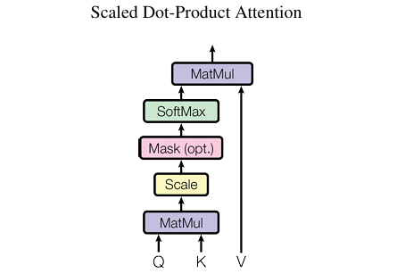
    
    假设$Q,K$的维度为$(N,d_k)$，$V$的维度为$(N,d_v)$，其中$Q,K,V$代表Query， Key， Value， $d_k$代表Key的维度，除以$\sqrt{d_k}$是为了防止点积过大，导致梯度消失。其中$Softmax(QK^T)$得到的维度为$(N,N)$。

    $Q$代表query，是当前要处理的词对应的向量，$K$代表key，通过计算$Q$与$K$的关系可以得到当前需要对其他词的关注度。

    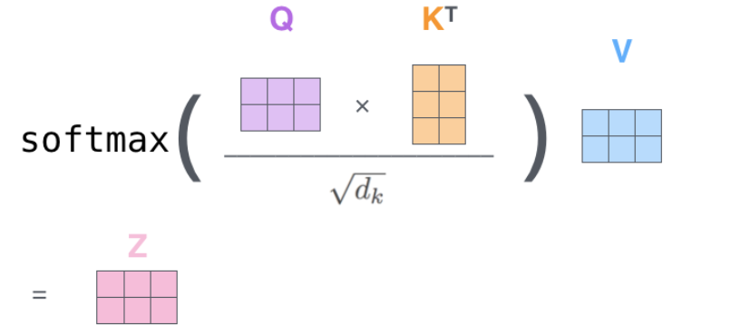

    点积注意力即是通过$Q$与$K$的点积相乘计算了相似度，其```Softmax```分数决定了在该位置的注意力权重，即对其他词的注意力程度，后与$V$相乘得到结果。

    > 在普通的```Attention```中，$K,V$对应编码器输出，$Q$对应解码器当前的输入。```Self-Attention```中，$Q,K,V$都对应于当前的输入$X$。

    


    <details> 
    <summary>Code</summary>

    ```python
    class ScaledDotProductAttention(nn.Module):
    ''' Scaled Dot-Product Attention '''

        def __init__(self, temperature, attn_dropout=0.1):
            super().__init__()
            self.temperature = temperature
            self.dropout = nn.Dropout(attn_dropout)

        def forward(self, q, k, v, mask=None):

            attn = torch.matmul(q / self.temperature, k.transpose(2, 3))

            if mask is not None:
                attn = attn.masked_fill(mask == 0, -1e9)
                '''
                使用.masked_fill方法是将这些位置的分数设置为一个非常大的负数
                因为softmax的很大负数输入会近似于0，从而确保这些位置对应的权重接近于0。
                如果mask中的某个位置为0，则该位置的score值将被替换为-1e9
                '''

            attn = self.dropout(F.softmax(attn, dim=-1))
            # dim=-1 表示应用Softmax到输入数据的最后一个维度
            output = torch.matmul(attn, v)

            return output, attn
    ```

    </details> 

### ```SubLayers.py```
---     

- 多头注意力机制```MultiHeadAttention```

    ```Multi-Head Attention```是一种将```Scaled Dot-Product Attention```扩展到多头的方法，它将Query, Key, Value 分别经过多个线性变换（称为“头”）后再输入到 ```Scaled Dot-Product Attention``` 中计算，最后将多个```Attention```输出按照通道维度拼接起来。
    
    $$
    MultiHeadAttention(Q,K,V) = Concat(head_1, head_2,...,head_n)W^O
    $$

    其中$head_i$表示第$i$个```Attention```头，$W^O$表示最终输出的线性变换矩阵，$n$表示头的数量。

    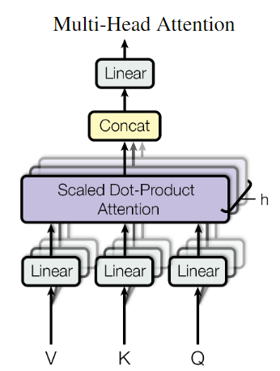


    > ```MultiHead```为```Attention```层提供了多个“表示子空间”，对于```Transformer```使用8头。这些集合中每一个都是<B>随机初始化</B>的，在训练之后，每组用于将输入embedding投影到不同的表示子空间中。
    
    <details> 
    <summary>Code</summary>

    ```python
    class MultiHeadAttention(nn.Module):
    ''' Multi-Head Attention module '''

        def __init__(self, n_head, d_model, d_k, d_v, dropout=0.1):
            super().__init__()

            self.n_head = n_head
            self.d_k = d_k
            self.d_v = d_v

            self.w_qs = nn.Linear(d_model, n_head * d_k, bias=False)
            self.w_ks = nn.Linear(d_model, n_head * d_k, bias=False)
            self.w_vs = nn.Linear(d_model, n_head * d_v, bias=False)
            self.fc = nn.Linear(n_head * d_v, d_model, bias=False)

            self.attention = ScaledDotProductAttention(temperature=d_k ** 0.5)

            self.dropout = nn.Dropout(dropout)
            self.layer_norm = nn.LayerNorm(d_model, eps=1e-6)


        def forward(self, q, k, v, mask=None):
            '''
            d_k->int: key, query's dimension
            d_v->int: value's dimension
            n_head->int: number of atten head
            sz_b->int: number of batch 
            len_q: length of query
            len_k: length of key
            len_v: length of value
            '''
            d_k, d_v, n_head = self.d_k, self.d_v, self.n_head
            sz_b, len_q, len_k, len_v = q.size(0), q.size(1), k.size(1), v.size(1)

            residual = q

            # Pass through the pre-attention projection: b x lq x (n*dv)
            # Separate different heads: b x lq x n x dv
            q = self.w_qs(q).view(sz_b, len_q, n_head, d_k)
            k = self.w_ks(k).view(sz_b, len_k, n_head, d_k)
            v = self.w_vs(v).view(sz_b, len_v, n_head, d_v)

            # Transpose for attention dot product: b x n x lq x dv
            q, k, v = q.transpose(1, 2), k.transpose(1, 2), v.transpose(1, 2)

            if mask is not None:
                mask = mask.unsqueeze(1)   # For head axis broadcasting.
            # 将 `mask` 的形状从 `(batch_size, seq_len)` 扩展为 `(batch_size, 1, seq_len)`。对掩码进行广播以匹配注意力权重张量的维度，确保在注意力计算中正确地应用掩码


            q, attn = self.attention(q, k, v, mask=mask)

            # Transpose to move the head dimension back: b x lq x n x dv
            # Combine the last two dimensions to concatenate all the heads together: b x lq x (n*dv)
            q = q.transpose(1, 2).contiguous().view(sz_b, len_q, -1)
            # 使用.transpose()，尽管张量的形状发生了变化，但其内存布局并没有相应地重新排列，导致这些张量在内存中是非连续的。.contiguous()确保张量在内存中是连续存储的
            q = self.dropout(self.fc(q))
            q += residual

            q = self.layer_norm(q)

            return q, attn
    ```

    </details> 

- ```Position-wise```前馈网络

    $$
    FFN(x) = max(0, xW_1 + b_1)W_2 + b_2
    $$

    即使用<B>两个线性变换，并在其中插入一次ReLU激活函数</B>作为前馈网络
    
    <details> 
    <summary>Code</summary>

    ```python
    class PositionwiseFeedForward(nn.Module):
        ''' A two-feed-forward-layer module '''

        def __init__(self, d_in, d_hid, dropout=0.1):
            super().__init__()
            self.w_1 = nn.Linear(d_in, d_hid) # position-wise
            self.w_2 = nn.Linear(d_hid, d_in) # position-wise
            self.layer_norm = nn.LayerNorm(d_in, eps=1e-6)
            self.dropout = nn.Dropout(dropout)

        def forward(self, x):

            residual = x

            x = self.w_2(F.relu(self.w_1(x)))
            x = self.dropout(x)
            x += residual

            x = self.layer_norm(x)

            return x
    ```
    
    </details> 
    
### ```Models.py```
---

- 位置编码```PositionalEncoding```

    对一种位置编码方法的要求：

    - 需要体现同一单词在不同位置的区别。
    
    - 需要体现一定的先后次序，并且在一定范围内的编码差异不应该依赖于文本的长度，具有一定的不变性。
    
    - 需要有值域的范围限制。
    
    $$
    PE_{(pos, 2i)} = sin(\frac{pos} {10000^{2i/d_{\text{model}}}})
    $$
    
    $$
    PE_{(pos, 2i+1)} = cos(\frac{pos} {10000^{2i/d_{\text{model}}}})
    $$
    
    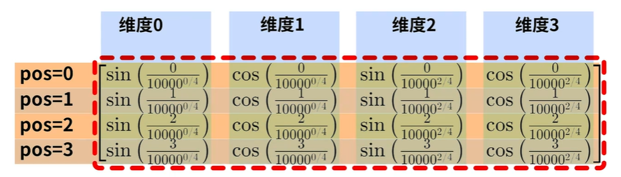

    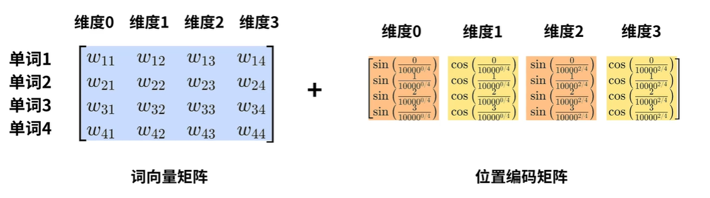

    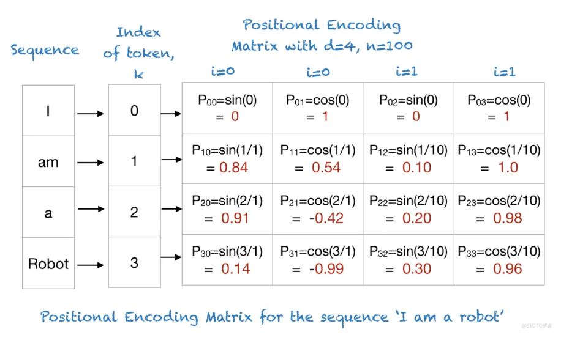
    
    即偶数位用正弦函数，奇数位用余弦函数来处理编码，其中$pos$代表一句话中token的位置，每个token的位置编码是一个向量，$i$表示这个向量中每个元素的index，$d_{model}$代表位置编码向量的维度。

    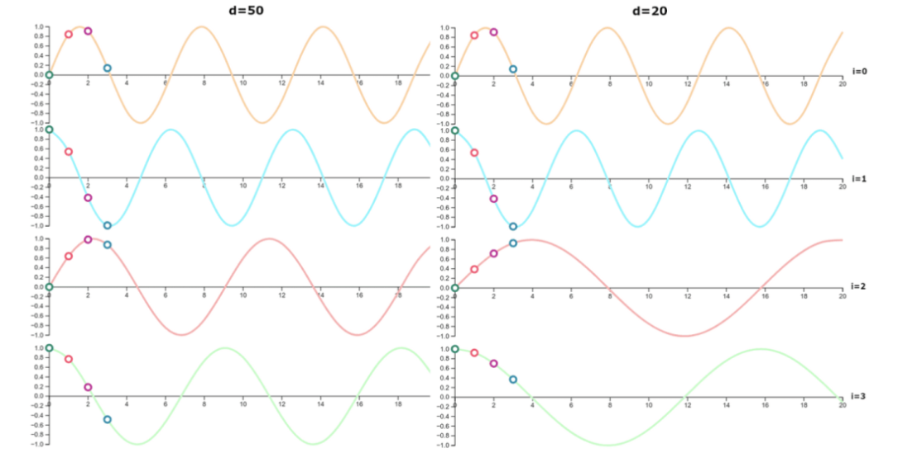
    
    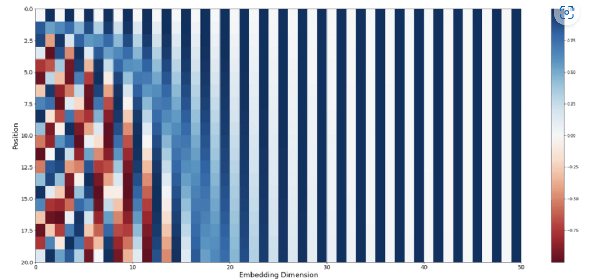

    
    某个pos位置的位置编码可表示为：
    
    $$
    PE_{pos}=\begin{bmatrix}sin(\omega_1\cdot pos) \\ cos(\omega_1\cdot pos) \\ sin(\omega_2\cdot pos) \\ cos(\omega_2\cdot pos) \\ \vdots \\ sin(\omega_{d/2}\cdot pos) \\ cos(\omega_{d/2}\cdot pos) \end{bmatrix}
    $$

    其中编码因子$\omega_i = \frac{1}{10000^{\frac{2i}{d_{model}}}}$

    假设某一个```token```的位置为```pos```，另一个```token```表示为```pos+k``` ，那就表明这个位置距上一个```token```为```k```，根据```Transformer```中给出的位置编码公式，则:

    $$
    \begin{aligned}
    PE_{(pos+k,2i)}&=sin(\omega _i\cdot (pos+k)) \\
    &=sin(\omega _i\cdot pos)cos(\omega _i\cdot k)+cos(\omega _i\cdot pos)sin(\omega _i\cdot k)
    \end{aligned}
    $$

    $$
    \begin{aligned}
    PE_{(pos+k,2i+1)}&=cos(\omega _i\cdot (pos+k)) \\
    &=cos(\omega _i\cdot pos)cos(\omega _i\cdot k)-sin(\omega _i\cdot pos)sin(\omega _i\cdot k)
    \end{aligned}
    $$

    使用$w_i$代替$\frac{1}{10000^{\frac{2i}{d_{model}}}}$；

    $$
    PE_{(pos+k,2i)}=cos(\omega _i\cdot k)PE_{(pos,2i)}+sin(\omega _i\cdot k)PE_{(pos,2i+1)}
    $$

    $$
    PE_{(pos+k,2i+1)}=cos(\omega _i\cdot k)PE_{(pos,2i+1)}-sin(\omega _i\cdot k)PE_{(pos,2i)}
    $$

    因为$k$为常数，则设$u=cos(\omega _i\cdot k), v=sin(\omega _i\cdot k)$：

    $$
    \begin{bmatrix}
    PE_{(pos+k,2i)} \\ PE_{(pos+k,2i+1)}) 
    \end{bmatrix} 
    
    = 
    
    \begin{bmatrix} 
    u & v\\ -v & u 
    \end{bmatrix} 
    
    \times 
    
    \begin{bmatrix} 
    PE_{(pos,2i)}\\ PE_{(pos,2i+1)} 
    \end{bmatrix}

    $$

    由此可知，位置```pos```的编码与位置```pos+k```的位置编码是线性关系。

    $$
    \begin{aligned}
    PE_{pos}\cdot PE_{pos+k}&=\sum_{i=0}^{\frac{d}{2}-1}sin(\omega _i\cdot pos)\cdot sin(\omega _i(pos+k)) \\
    &= \sum_{i=0}^{\frac{d}{2}-1}cos(\omega _i(pos-(pos+k)))  \\
    &= \sum_{i=0}^{\frac{d}{2}-1}cos(\omega _i\cdot k) \\
    \end{aligned}
    $$

    对于$PE_{pos}$与$PE_{pos+k}$的点积，可得一个余弦的和值，并且这个和值随着$k$的增大而减小，即两个```token```的距离越大，也就是```K```越大，两个位置的```PE```相乘结果越小（位置编码可以表示相对位置关系）

    但显然这样的位置关系并不是显式的，需要大量的训练数据来让模型充分学习到位置信息，特别是在处理长序列和复杂依赖关系时。

    > 为什么位置编码不直接拼接到编码矩阵中呢？

    > 直接拼接会扩大参数空间，占用内存增加，而且不易拟合，而且其实没有证据表明拼接就比加来的好

    <details> 
    <summary>Code</summary>
    
    
    ```python
    from transformer.Layers import EncoderLayer, DecoderLayer
    
    def get_pad_mask(seq, pad_idx):  # 掩码矩阵，用于将填充位置（即pad_idx）在注意力计算过程中置为0。
    return (seq != pad_idx).unsqueeze(-2)

    def get_subsequent_mask(seq):    # 掩码矩阵，用于将序列中每个位置的注意力权重限制在当前位置及其之前的所有位置。
        ''' For masking out the subsequent info. '''
        sz_b, len_s = seq.size()
        subsequent_mask = (1 - torch.triu(torch.ones((1, len_s, len_s), 
                                            device=seq.device), 
                                            diagonal=1)).bool()
        return subsequent_mask
    
    class PositionalEncoding(nn.Module):

        def __init__(self, d_hid, n_position=200):
            super(PositionalEncoding, self).__init__()

            # Not a parameter
            self.register_buffer('pos_table', self._get_sinusoid_encoding_table(n_position, d_hid))
            
            '''self.register_buffer(‘name’,Tensor)方法用于定义一组参数
            该组参数在模型训练时不会更新（即optimizer.step()后该组参数不会变化，只可人为地改变它们的值）
            '''

        def _get_sinusoid_encoding_table(self, n_position, d_hid):
            ''' Sinusoid position encoding table '''
            # TODO: make it with torch instead of numpy

            def get_position_angle_vec(position):
                return [position / np.power(10000, 2 * (hid_j // 2) / d_hid) for hid_j in range(d_hid)]

            sinusoid_table = np.array([get_position_angle_vec(pos_i) for pos_i in range(n_position)])
            sinusoid_table[:, 0::2] = np.sin(sinusoid_table[:, 0::2])  # dim 2i
            sinusoid_table[:, 1::2] = np.cos(sinusoid_table[:, 1::2])  # dim 2i+1

            return torch.FloatTensor(sinusoid_table).unsqueeze(0)

        def forward(self, x):
            return x + self.pos_table[:, :x.size(1)].clone().detach() 
            # .detach() 方法将其从计算图中分离，确保在后续的计算中不会影响梯度传播

    ```

    </details> 


- 编码器```Encoder```

    <details> 
    <summary>Code</summary>
    
    ```python
    class Encoder(nn.Module):
    ''' A encoder model with self attention mechanism. '''
        def __init__(
                self, n_src_vocab, d_word_vec, n_layers, n_head, d_k, d_v,
                d_model, d_inner, pad_idx, dropout=0.1, n_position=200, scale_emb=False):

            super().__init__()
            '''
            n_src_vocab: 词汇表大小
            d_word_vec：词向量维度
            n_layers：编码器层数
            n_head：注意力头数
            d_k：key维度
            d_v：value维度
            d_model：模型维度
            d_inner：内部维度
            pad_idx：填充索引('<pad>')
            dropout：dropout概率
            n_position：位置编码的最大位置
            scale_emb：一个布尔值，表示是否对词嵌入进行缩放
            '''
            self.src_word_emb = nn.Embedding(n_src_vocab, d_word_vec, padding_idx=pad_idx)                      
            # 词向量转化, padding_idx就是把Embeddings转化矩阵某一行置为0
            self.position_enc = PositionalEncoding(d_word_vec, n_position=n_position)
            self.dropout = nn.Dropout(p=dropout)
            self.layer_stack = nn.ModuleList([
                EncoderLayer(d_model, d_inner, n_head, d_k, d_v, dropout=dropout)
                for _ in range(n_layers)])
            self.layer_norm = nn.LayerNorm(d_model, eps=1e-6)
            self.scale_emb = scale_emb
            # 缩放的目的是为了使得位置编码的数值大小与词嵌入的数值大小应该处于同一数量级
            self.d_model = d_model

        def forward(self, src_seq, src_mask, return_attns=False):

            enc_slf_attn_list = []

            # -- Forward
            enc_output = self.src_word_emb(src_seq)
            if self.scale_emb:
                enc_output *= self.d_model ** 0.5
                # 缩放的目的是为了确保词向量具有适当的尺度
            enc_output = self.dropout(self.position_enc(enc_output))
            enc_output = self.layer_norm(enc_output)

            for enc_layer in self.layer_stack:
                enc_output, enc_slf_attn = enc_layer(enc_output, slf_attn_mask=src_mask)
                enc_slf_attn_list += [enc_slf_attn] if return_attns else []

            if return_attns:
                return enc_output, enc_slf_attn_list
            return enc_output,
    ```

    </details> 

- 解码器```Decoder```

    <details> 
    <summary>Code</summary>
    
    ```python
    class Decoder(nn.Module):
    ''' A decoder model with self attention mechanism. '''
        def __init__(
                self, n_trg_vocab, d_word_vec, n_layers, n_head, d_k, d_v,
                d_model, d_inner, pad_idx, n_position=200, dropout=0.1, scale_emb=False):

            super().__init__()

            self.trg_word_emb = nn.Embedding(n_trg_vocab, d_word_vec, padding_idx=pad_idx)
            self.position_enc = PositionalEncoding(d_word_vec, n_position=n_position)
            self.dropout = nn.Dropout(p=dropout)
            self.layer_stack = nn.ModuleList([
                DecoderLayer(d_model, d_inner, n_head, d_k, d_v, dropout=dropout)
                for _ in range(n_layers)])
            self.layer_norm = nn.LayerNorm(d_model, eps=1e-6)
            self.scale_emb = scale_emb
            self.d_model = d_model

        def forward(self, trg_seq, trg_mask, enc_output, src_mask, return_attns=False):

            dec_slf_attn_list, dec_enc_attn_list = [], []

            # -- Forward
            dec_output = self.trg_word_emb(trg_seq)
            if self.scale_emb:
                dec_output *= self.d_model ** 0.5
            dec_output = self.dropout(self.position_enc(dec_output))
            dec_output = self.layer_norm(dec_output)

            for dec_layer in self.layer_stack:
                dec_output, dec_slf_attn, dec_enc_attn = dec_layer(
                    dec_output, enc_output, slf_attn_mask=trg_mask, dec_enc_attn_mask=src_mask)
                dec_slf_attn_list += [dec_slf_attn] if return_attns else []
                dec_enc_attn_list += [dec_enc_attn] if return_attns else []

            if return_attns:
                return dec_output, dec_slf_attn_list, dec_enc_attn_list
            return dec_output,
    ```

    </details> 

- ```Transformer```

    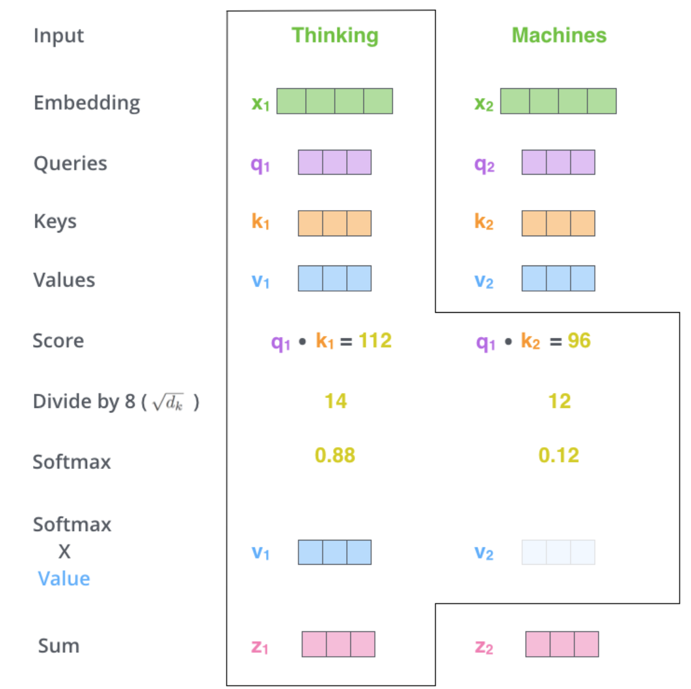

    

    <details> 
    <summary>Code</summary>
    
    ```python
    class Transformer(nn.Module):
    ''' A sequence to sequence model with attention mechanism. '''
        def __init__(
                self, n_src_vocab, n_trg_vocab, src_pad_idx, trg_pad_idx,
                d_word_vec=512, d_model=512, d_inner=2048,
                n_layers=6, n_head=8, d_k=64, d_v=64, dropout=0.1, n_position=200,
                trg_emb_prj_weight_sharing=True, emb_src_trg_weight_sharing=True,
                scale_emb_or_prj='prj'):

            super().__init__()

            self.src_pad_idx, self.trg_pad_idx = src_pad_idx, trg_pad_idx

            # In section 3.4 of paper "Attention Is All You Need", there is such detail:
            # "In our model, we share the same weight matrix between the two
            # embedding layers and the pre-softmax linear transformation...
            # In the embedding layers, we multiply those weights by \sqrt{d_model}".
            #
            # Options here:
            #   'emb': multiply \sqrt{d_model} to embedding output
            #   'prj': multiply (\sqrt{d_model} ^ -1) to linear projection output
            #   'none': no multiplication

            assert scale_emb_or_prj in ['emb', 'prj', 'none']
            scale_emb = (scale_emb_or_prj == 'emb') if trg_emb_prj_weight_sharing else False
            self.scale_prj = (scale_emb_or_prj == 'prj') if trg_emb_prj_weight_sharing else False

            '''
            显示判断是否缩放嵌入层、投影层，或者都不缩放如果启用了目标词嵌入与投影层权重的共享，并且 scale_emb_or_prj 的值为 ‘emb’，则 scale_emb 被设置为 True，表示在嵌入层输出后进行权重缩放。
            否则，scale_emb 被设置为 False，对于prj同理。
            在模型中同时使用两种缩放方式可能导致不一致或混乱，因此一般来说，选择其中一种缩放方式更为常见和合理。
            '''
            self.d_model = d_model

            self.encoder = Encoder(
                n_src_vocab=n_src_vocab, n_position=n_position,
                d_word_vec=d_word_vec, d_model=d_model, d_inner=d_inner,
                n_layers=n_layers, n_head=n_head, d_k=d_k, d_v=d_v,
                pad_idx=src_pad_idx, dropout=dropout, scale_emb=scale_emb)

            self.decoder = Decoder(
                n_trg_vocab=n_trg_vocab, n_position=n_position,
                d_word_vec=d_word_vec, d_model=d_model, d_inner=d_inner,
                n_layers=n_layers, n_head=n_head, d_k=d_k, d_v=d_v,
                pad_idx=trg_pad_idx, dropout=dropout, scale_emb=scale_emb)

            self.trg_word_prj = nn.Linear(d_model, n_trg_vocab, bias=False)
            # 将解码器最后一层的输出映射为目标语言词汇表的概率分布，从而用于生成目标语言的下一个词。

            for p in self.parameters(): # 各层参数的迭代
                if p.dim() > 1:
                    nn.init.xavier_uniform_(p) # 参数初始化

            assert d_model == d_word_vec, \
            'To facilitate the residual connections, \
            the dimensions of all module outputs shall be the same.'

            if trg_emb_prj_weight_sharing:
                # Share the weight between target word embedding & last dense layer
                self.trg_word_prj.weight = self.decoder.trg_word_emb.weight
            # 共享这两个层的权重，模型在训练中会学习一组参数，这些参数同时用于嵌入目标词和将解码器的输出映射到目标词汇表。
           
            if emb_src_trg_weight_sharing:
                self.encoder.src_word_emb.weight = self.decoder.trg_word_emb.weight
    
        def forward(self, src_seq, trg_seq):

            src_mask = get_pad_mask(src_seq, self.src_pad_idx)
            trg_mask = get_pad_mask(trg_seq, self.trg_pad_idx) & get_subsequent_mask(trg_seq)

            enc_output, *_ = self.encoder(src_seq, src_mask)
            dec_output, *_ = self.decoder(trg_seq, trg_mask, enc_output, src_mask)
            seq_logit = self.trg_word_prj(dec_output)
            if self.scale_prj:
                seq_logit *= self.d_model ** -0.5

            return seq_logit.view(-1, seq_logit.size(2))
    ```

    </details> 

### ```Layers.py```
---

    
- ```Encoder```与```Decoder```组成部分
    
    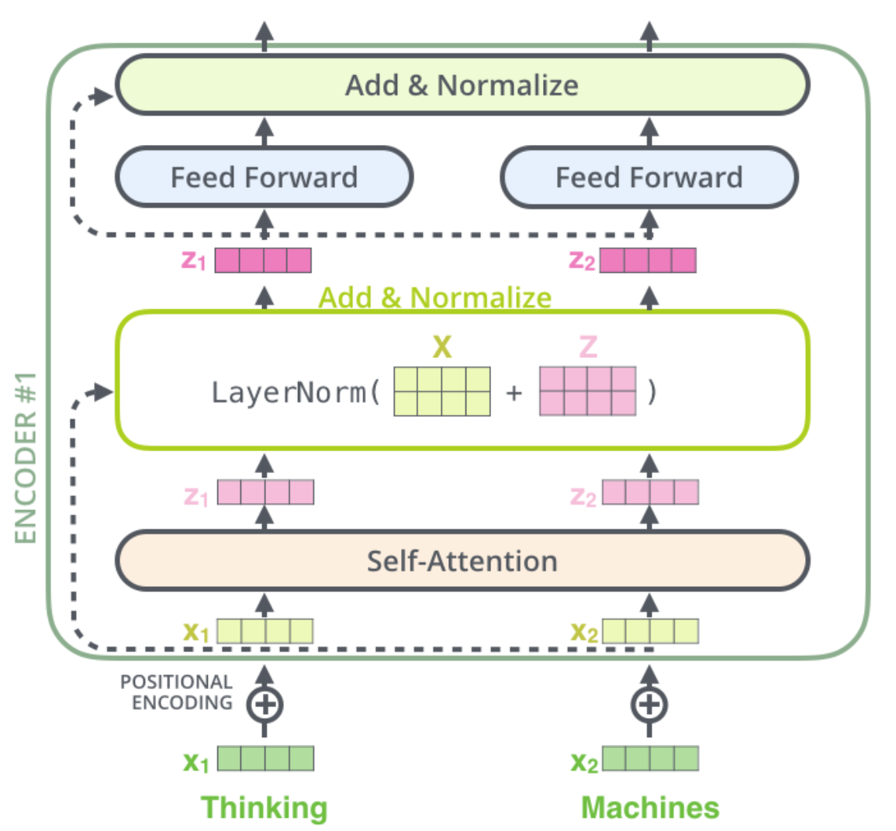

    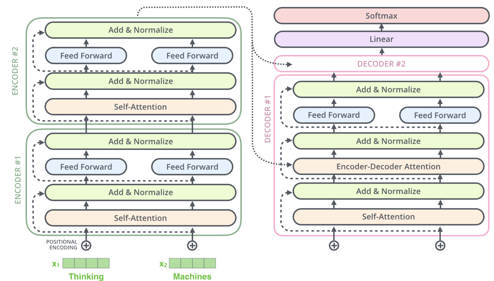

    <details> 
    <summary>Code</summary>
    
    ```python
    class EncoderLayer(nn.Module):
        ''' Compose with two layers '''
        def __init__(self, d_model, d_inner, n_head, d_k, d_v, dropout=0.1):
            super(EncoderLayer, self).__init__()
            self.slf_attn = MultiHeadAttention(n_head, d_model, d_k, d_v, dropout=dropout)
            self.pos_ffn = PositionwiseFeedForward(d_model, d_inner, dropout=dropout)

        def forward(self, enc_input, slf_attn_mask=None):
            enc_output, enc_slf_attn = self.slf_attn(
                enc_input, enc_input, enc_input, mask=slf_attn_mask)
            enc_output = self.pos_ffn(enc_output)
            return enc_output, enc_slf_attn

    class DecoderLayer(nn.Module):
        ''' Compose with three layers '''
        def __init__(self, d_model, d_inner, n_head, d_k, d_v, dropout=0.1):
            super(DecoderLayer, self).__init__()
            self.slf_attn = MultiHeadAttention(n_head, d_model, d_k, d_v, dropout=dropout)
            self.enc_attn = MultiHeadAttention(n_head, d_model, d_k, d_v, dropout=dropout)
            self.pos_ffn = PositionwiseFeedForward(d_model, d_inner, dropout=dropout)

        def forward(
                self, dec_input, enc_output,
                slf_attn_mask=None, dec_enc_attn_mask=None):
            dec_output, dec_slf_attn = self.slf_attn(
                dec_input, dec_input, dec_input, mask=slf_attn_mask)
            dec_output, dec_enc_attn = self.enc_attn(
                dec_output, enc_output, enc_output, mask=dec_enc_attn_mask)
            dec_output = self.pos_ffn(dec_output)
            return dec_output, dec_slf_attn, dec_enc_attn
    ```

    </details>

### ```Optim.py```
---

- 优化函数

    根据以下公式在训练过程中改变学习率：

    $$
    lrate = d_{model}^{-0.5} \cdot min(step\_num^{-0.5}, step\_num \cdot warmup\_steps^{-1.5})
    $$
    
    <details> 
    <summary>Code</summary>
    
    ```python
    class ScheduledOptim():
        '''A simple wrapper class for learning rate scheduling'''

        def __init__(self, optimizer, lr_mul, d_model, n_warmup_steps):
            '''
            optimizer：优化器，如 Adam 或 SGD。
            lr_mul：调整学习率的乘数因子。
            d_model: 隐藏层的大小。
            n_warmup_steps：预热阶段的步数。在预热阶段，学习率会逐渐增加。
            n_steps：当前训练步数，初始化为0。
            '''
            self._optimizer = optimizer
            self.lr_mul = lr_mul
            self.d_model = d_model
            self.n_warmup_steps = n_warmup_steps
            self.n_steps = 0


        def step_and_update_lr(self):
            "Step with the inner optimizer"
            self._update_learning_rate()
            self._optimizer.step()


        def zero_grad(self):
            "Zero out the gradients with the inner optimizer"
            self._optimizer.zero_grad()


        def _get_lr_scale(self):
            d_model = self.d_model
            n_steps, n_warmup_steps = self.n_steps, self.n_warmup_steps
            return (d_model ** -0.5) * min(n_steps ** (-0.5), n_steps * n_warmup_steps ** (-1.5))


        def _update_learning_rate(self):
            ''' Learning rate scheduling per step '''

            self.n_steps += 1
            lr = self.lr_mul * self._get_lr_scale()

            for param_group in self._optimizer.param_groups:
                param_group['lr'] = lr #更新学习率
    ```

    </details>

