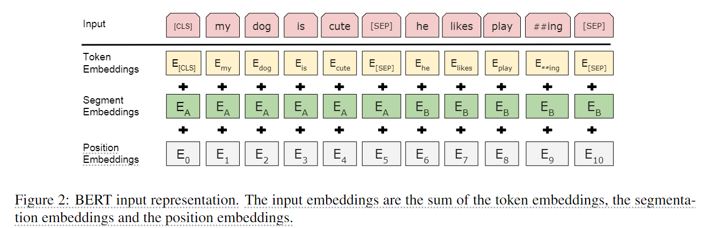
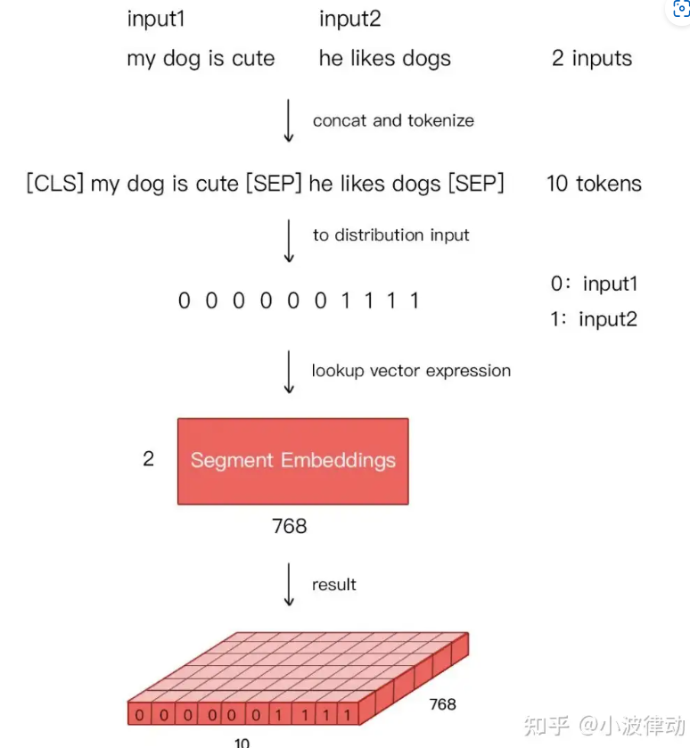
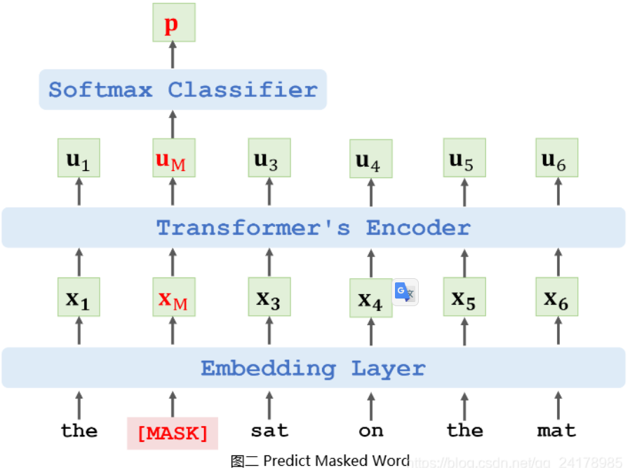
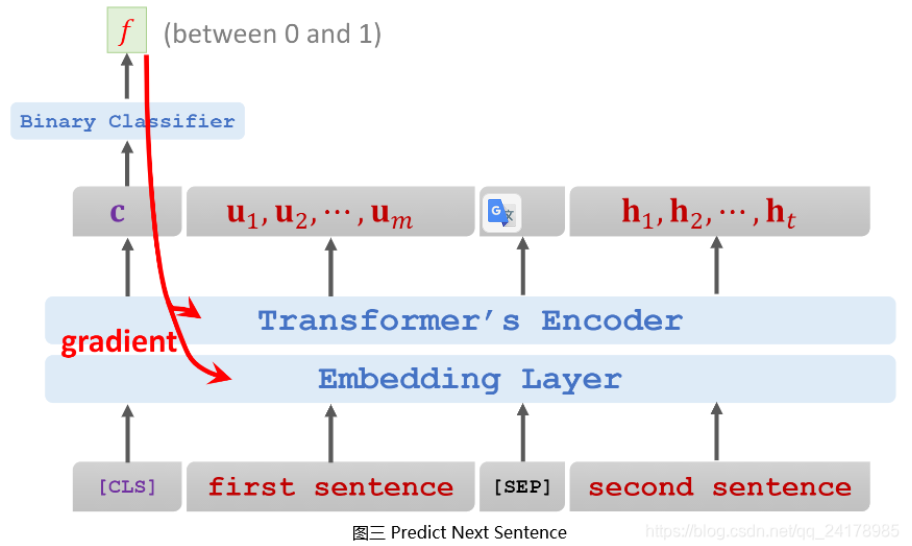
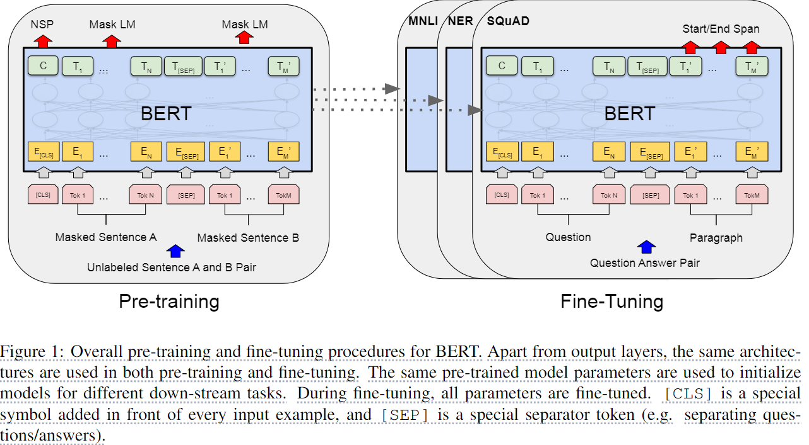
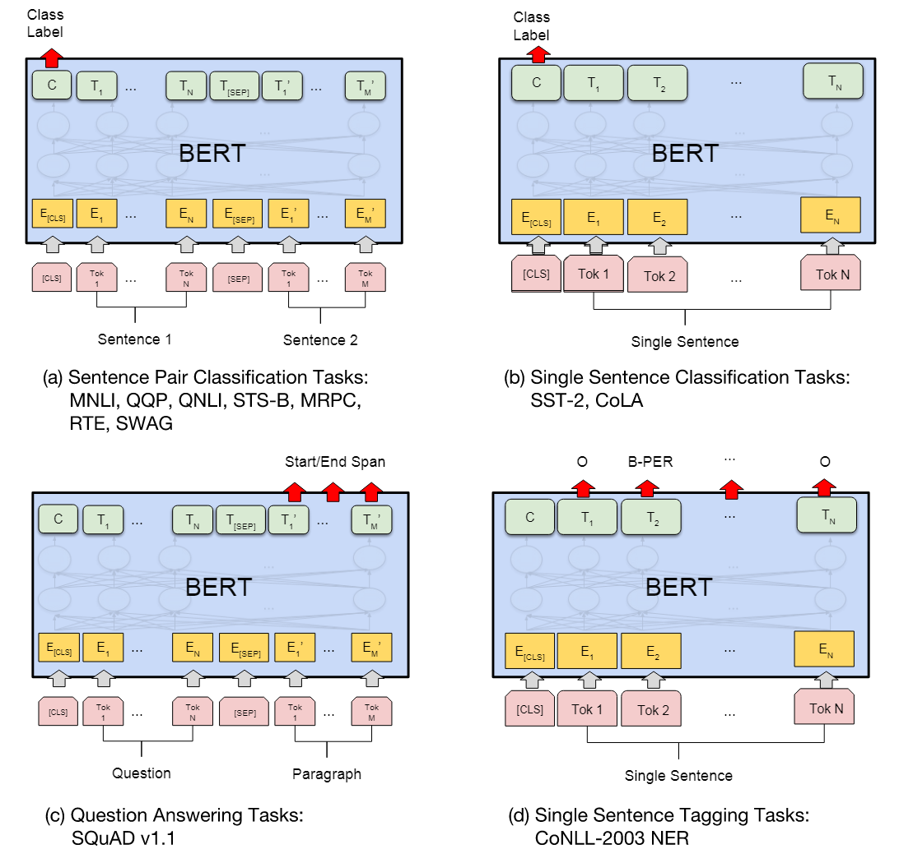
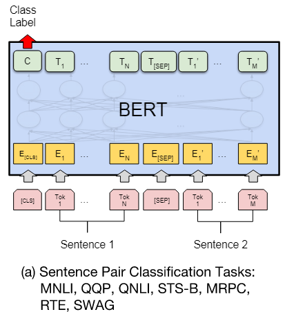
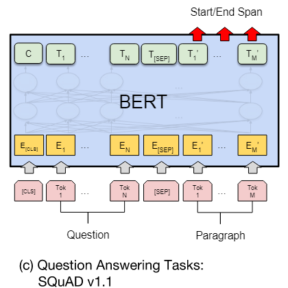

# BERT: Pre-training of Deep Bidirectional Transformers for Language Understanding

<script src="https://polyfill.io/v3/polyfill.min.js?features=es6"></script>
<script src="https://cdn.jsdelivr.net/npm/mathjax@3/es5/tex-chtml.js"></script>

!!! info "相关信息"
    <font size = 3.5>
    
    论文地址：[BERT: Pre-training of Deep Bidirectional Transformers for Language Understanding](https://arxiv.org/abs/1810.04805)

    代码（Pytorch版）:[https://github.com/jadore801120/attention-is-all-you-need-pytorch/tree/master?tab=readme-ov-file](https://github.com/jadore801120/attention-is-all-you-need-pytorch/tree/master?tab=readme-ov-file)

    资源：

    </font>

### 概述

BERT（Bidirectional Encoder Representations from Transformers）是一种Transformer的双向编码器，旨在通过在左右上下文中共有的条件计算来预先训练来自无标号文本的深度双向表示。因此，经过预先训练的BERT模型只需一个额外的输出层就可以进行微调，从而为各种自然语言处理任务生成最新模型。

> 也是我们常说的 【预训练】+【微调】


BERT的核心思想如下：

- 随机遮挡句子中一个或多个单词，让Encoder根据句子上下文预测被遮挡的单词（Predict Masked Word）

- 将两个句子拼接，让Encoder判断两个句子是否为原文中相邻的句子(Predict Next Sentence)

BERT通过上述两个任务，预训练Transformer模型Encoder网络。

作者给出了两种不同大小的```bert```模型：

- ```BERT-Base```：12 Layers ```Transformer Encoder```，768 Hidden(隐藏单元)，12 Head，110M Parameters.

- ```BERT-Large```：24 Layers ```Transformer Encoder```，1024Hidden(隐藏单元)，16 Head，340M Parameters.

<B>Bert直接引用了Transformer架构中的Encoder模块，舍弃了Decoder模块, 由多个Encoder block模块堆叠而成，这样便自动拥有了双向编码能力和强大的特征提取能力。</B>

### ```Embedding```



```BERT```的输入```Embedding```模块由三部分组成：

- ```Token Embeddings```：输入文本中的每个单词或字符转换为一个固定维度的向量。```Base```版为768维，```Large```版为1024维。

- ```Position Embeddings```：单词或字符在句子中的位置信息。```BERT```中的位置嵌入是可学习的，它会随着模型的训练而更新，非固定的三角函数。

- ```Segment Embeddings```：用于区分同一输入序列中不同句子的来源。对于多句输入，```BERT```会为每个句子分配一个不同的段编号，来区分它们。```Segment Embeddings```的取值通常是0和1，如果输入包含两个句子，通常第一个句子的```token```会被赋予全0的向量，第二个句子的token会被赋予全1的向量。下图是一个示例。



### Pre-training

```BERT```的预训练过程主要包括两个阶段：```Masked Language Model（MLM）```和```Next Sentence Prediction（NSP）```。

- ```Masked Language Model（MLM）```目标：填空，教导```BERT```上下文

为了训练深度双向表示（deep bidirectional representation），在训练过程中，会对每个序类中的15%```token```随机进行掩码（替换为```[MASK]```），并且让模型只预测掩码词，而BERT学会从上下文中预测这些单词。这有助于BERT理解单词彼此之间的关系，无论是在前面还是在后面。

事实上，```[MASK] token```在fine-tuning期间不会出现，因此对于每个被选中的```token```，有80%的概率直接用```[MASK]```标记替换，10%的概率用随机的一个单词替换（这有助于模型学习理解上下文的重要性，而不仅仅是依赖于```[MASK]```标记），剩下的10%则保持不变（这有助于模型在微调阶段更好地处理未遮蔽的单词）。

如图，假设输入句子为```[the cat sat on the mat]```，被随机遮挡的单词为```[cat]```，那么```BERT```的输出为:

- 80%的时候是```[MASK]```：```[the [[MASK]] sat on the mat]```

- 10%的时候是随机单词：```[the [bike] sat on the mat]```

- 10%的时候是原词：```[the [cat] sat on the mat]```



这样做使得编码器不知道此次需要预测哪些```token```或已被随机```token```替换，因此模型被迫保留每个```token```的分布上下文表示。（is forced to keep a distributional contextual representation of every input token）


- ```Next Sentence Prediction（NSP）```目标：教导```BERT```理解句子之间的关系

从文本数据中生成训练数据集，抽取两个句子，并将两个句子拼接，两个句子中间用```[SEP]```符号分隔，在拼接形成的句子前添加一个```[CLS]```符号(```[CLS]```是用于分类的标记；```[SEP]```用于分隔句子。)。其中训练集的50%为文本中相邻的两个句子，另外50%为随机抽取的不相邻两个句子。训练集中相邻句子的标签设置为1，不相邻句子的标签设置为0。

> 在```BERT```的后续版本中，```Next Sentence Prediction（NSP）```任务被废弃了。因为研究人员发现这个任务对下游任务的性能提升有限，因此在```BERT```的一些后续变体中被弃用了。



```Input = [CLS] the man went to [MASK] store [SEP] he bought a gallon [MASK] milk [SEP]```

```Label = IsNext```

```Input = [CLS] the man [MASK] to the store [SEP] penguin [MASK] are flight ##less birds [SEP]```

```Label = NotNext```



> 在训练```BERT```时，为了不使模型认为```[MASK]```符号原本就归属于训练句子，在随机遮挡单词时采用了将一定数量的```[MASK]```替换成句子中原本的单词，将一定数量的```[MASK]```符号替换成随机单词等等小技巧。


### Fine-tuning

```self-attention``` 机制允许 ```BERT``` 对任何下游任务建模 —— 无论是 single text 还是 text pairs —— 只需要适当替换输入和输出，因此对 ```BERT``` 进行微调是非常方便的。

根据自然语言处理（NLP）下游任务输入和输出形式的不同，微调任务可以分为四类，分别是句对分类、单句分类、文本问答和单句标注



- ```The General Language Understanding Evaluation (GLUE) benchmark```

GLUE是各种自然语言理解任务的集合，为了对 GLUE 进行微调，我们使用对应于第一个输入标记```[CLS]```的输出向量$C \in \mathbb{R}^H$，引入一个新的分类层进行分类操作。



- ```The Stanford Question Answering Dataset (SQuAD v1.1)```

SQuAD v1.1 是100k个公开来源的question/answer对的集合，通常给定一个问题和一个维基百科段落（包含答案），任务是预测文章中的答案文本跨度。



我们将问题和段落表示为单个打包序列输入（输入格式为```[CLS]+问题+[SEP]+段落信息```），在fine-tuning，我们引入一个起始向量$S \in \mathbb{R}^H$和一个结束向量$E \in \mathbb{R}^H$，来计算答案的开始和结束。

开始位置的计算公式：

$$
P_i = \frac{e^{S \cdot T_i}}{\sum_{j=1}^{L} e^{S \cdot T_j}}
$$

结束位置的计算公式：

$$
P_i = \frac{e^{E \cdot T_i}}{\sum_{j=1}^{L} e^{E \cdot T_j}}
$$

从位置 i 到位置 j (i <= j>)的候选跨度的分数定义为:

$$
Score = S \cdot T_i + E \cdot T_j
$$

最大分值的范围用作预测


- ```SQuAD 2.0 task```

SQuAD 2.0 任务通过允许提供的段落中不存在答案的可能性来扩展 SQuAD 1.1 问题定义，从而使问题更加现实。

若不存在答案，则计算一个没有答案的得分：

$$
Score = S \cdot C + E \cdot C
$$

其中$C$就是```[CLS]```的对应输出，此时如果没有答案的分数要比找到的答案的分数要好，那么就预测为没有答案。

- ```The Situations With Adversarial Generations (SWAG) dataset``` 


<details> 
<summary>BERT简洁实现</summary>

```python
# sample IsNext and NotNext to be same in small batch size
def make_batch():
    '''
    word_dict
    number_dict
    positive = negative->int : 正样本/负样本数量
    input_ids->list: 模型输入的token id
    segment_ids: 区分句子的segment id
    n_pred: 通过MASK后模型要预测的token数量
    n_pad: padding数量，使batch中的句子长度一致
    max_pred: 预测的最大掩码数量
    masked_tokens: MASK的token
    masked_pos: MASK的token的位置
    '''
    batch = []
    positive = negative = 0 # 正样本IsNext和负样本NotNext的数量
    while positive != batch_size/2 or negative != batch_size/2:
        tokens_a_index, tokens_b_index = randrange(len(sentences)), randrange(len(sentences)) # sample random index in sentences
        tokens_a, tokens_b= token_list[tokens_a_index], token_list[tokens_b_index]
        input_ids = [word_dict['[CLS]']] + tokens_a + [word_dict['[SEP]']] + tokens_b + [word_dict['[SEP]']]
        segment_ids = [0] * (1 + len(tokens_a) + 1) + [1] * (len(tokens_b) + 1)

        # MASK LM
        n_pred =  min(max_pred, max(1, int(round(len(input_ids) * 0.15)))) # 15 % of tokens in one sentence
        cand_maked_pos = [i for i, token in enumerate(input_ids)
                          if token != word_dict['[CLS]'] and token != word_dict['[SEP]']]
        shuffle(cand_maked_pos)
        masked_tokens, masked_pos = [], []
        for pos in cand_maked_pos[:n_pred]:
            masked_pos.append(pos)
            masked_tokens.append(input_ids[pos])
            if random() < 0.8:  # 80%
                input_ids[pos] = word_dict['[MASK]'] # make mask
            elif random() < 0.5:  # 10%
                index = randint(0, vocab_size - 1) # random index in vocabulary
                input_ids[pos] = word_dict[number_dict[index]] # replace

        # Zero Paddings
        n_pad = maxlen - len(input_ids)
        input_ids.extend([0] * n_pad)
        segment_ids.extend([0] * n_pad)

        # Zero Padding (100% - 15%) tokens
        if max_pred > n_pred:
            n_pad = max_pred - n_pred
            masked_tokens.extend([0] * n_pad)
            masked_pos.extend([0] * n_pad)

        if tokens_a_index + 1 == tokens_b_index and positive < batch_size/2:
            batch.append([input_ids, segment_ids, masked_tokens, masked_pos, True]) # IsNext
            positive += 1
        elif tokens_a_index + 1 != tokens_b_index and negative < batch_size/2:
            batch.append([input_ids, segment_ids, masked_tokens, masked_pos, False]) # NotNext
            negative += 1
    return batch
# Proprecessing Finished

def get_attn_pad_mask(seq_q, seq_k): # 对<PAD>的掩码
    batch_size, len_q = seq_q.size()
    batch_size, len_k = seq_k.size()
    # eq(zero) is PAD token
    pad_attn_mask = seq_k.data.eq(0).unsqueeze(1)  # batch_size x 1 x len_k(=len_q), one is masking
    return pad_attn_mask.expand(batch_size, len_q, len_k)  # batch_size x len_q x len_k

def gelu(x):
    "Implementation of the gelu activation function by Hugging Face"
    return x * 0.5 * (1.0 + torch.erf(x / math.sqrt(2.0)))

class Embedding(nn.Module):
    def __init__(self):
        super(Embedding, self).__init__()
        self.tok_embed = nn.Embedding(vocab_size, d_model)  # token embedding
        self.pos_embed = nn.Embedding(maxlen, d_model)  # position embedding
        self.seg_embed = nn.Embedding(n_segments, d_model)  # segment(token type) embedding
        self.norm = nn.LayerNorm(d_model)

    def forward(self, x, seg):
        seq_len = x.size(1)
        pos = torch.arange(seq_len, dtype=torch.long)
        pos = pos.unsqueeze(0).expand_as(x)  # (seq_len,) -> (batch_size, seq_len)
        embedding = self.tok_embed(x) + self.pos_embed(pos) + self.seg_embed(seg)
        return self.norm(embedding)

class ScaledDotProductAttention(nn.Module):
    def __init__(self):
        super(ScaledDotProductAttention, self).__init__()

    def forward(self, Q, K, V, attn_mask):
        scores = torch.matmul(Q, K.transpose(-1, -2)) / np.sqrt(d_k) # scores : [batch_size x n_heads x len_q(=len_k) x len_k(=len_q)]
        scores.masked_fill_(attn_mask, -1e9) # Fills elements of self tensor with value where mask is one.
        attn = nn.Softmax(dim=-1)(scores)
        context = torch.matmul(attn, V)
        return context, attn

class MultiHeadAttention(nn.Module):
    def __init__(self):
        super(MultiHeadAttention, self).__init__()
        self.W_Q = nn.Linear(d_model, d_k * n_heads)
        self.W_K = nn.Linear(d_model, d_k * n_heads)
        self.W_V = nn.Linear(d_model, d_v * n_heads)
    def forward(self, Q, K, V, attn_mask):
        # q: [batch_size x len_q x d_model] 
        # k: [batch_size x len_k x d_model] 
        # v: [batch_size x len_k x d_model]
        residual, batch_size = Q, Q.size(0)
        
        # (B, S, D) -proj-> (B, S, D) -split-> (B, S, H, W) -trans-> (B, H, S, W)
        q_s = self.W_Q(Q).view(batch_size, -1, n_heads, d_k).transpose(1,2)  # q_s: [batch_size x n_heads x len_q x d_k]
        k_s = self.W_K(K).view(batch_size, -1, n_heads, d_k).transpose(1,2)  # k_s: [batch_size x n_heads x len_k x d_k]
        v_s = self.W_V(V).view(batch_size, -1, n_heads, d_v).transpose(1,2)  # v_s: [batch_size x n_heads x len_k x d_v]

        attn_mask = attn_mask.unsqueeze(1).repeat(1, n_heads, 1, 1) # attn_mask : [batch_size x n_heads x len_q x len_k]

        # context: [batch_size x n_heads x len_q x d_v], attn: [batch_size x n_heads x len_q(=len_k) x len_k(=len_q)]
        context, attn = ScaledDotProductAttention()(q_s, k_s, v_s, attn_mask)
        context = context.transpose(1, 2).contiguous().view(batch_size, -1, n_heads * d_v) # context: [batch_size x len_q x n_heads * d_v]
        output = nn.Linear(n_heads * d_v, d_model)(context)
        return nn.LayerNorm(d_model)(output + residual), attn # output: [batch_size x len_q x d_model]

class PoswiseFeedForwardNet(nn.Module):
    def __init__(self):
        super(PoswiseFeedForwardNet, self).__init__()
        self.fc1 = nn.Linear(d_model, d_ff)
        self.fc2 = nn.Linear(d_ff, d_model)

    def forward(self, x):
        # (batch_size, len_seq, d_model) -> (batch_size, len_seq, d_ff) -> (batch_size, len_seq, d_model)
        return self.fc2(gelu(self.fc1(x)))

class EncoderLayer(nn.Module):
    def __init__(self):
        super(EncoderLayer, self).__init__()
        self.enc_self_attn = MultiHeadAttention()
        self.pos_ffn = PoswiseFeedForwardNet()

    def forward(self, enc_inputs, enc_self_attn_mask):
        enc_outputs, attn = self.enc_self_attn(enc_inputs, enc_inputs, enc_inputs, enc_self_attn_mask) # enc_inputs to same Q,K,V
        enc_outputs = self.pos_ffn(enc_outputs) # enc_outputs: [batch_size x len_q x d_model]
        return enc_outputs, attn

class BERT(nn.Module):
    def __init__(self):
        super(BERT, self).__init__()
        self.embedding = Embedding()
        self.layers = nn.ModuleList([EncoderLayer() for _ in range(n_layers)])
        self.fc = nn.Linear(d_model, d_model)
        self.activ1 = nn.Tanh()
        self.linear = nn.Linear(d_model, d_model)
        self.activ2 = gelu
        self.norm = nn.LayerNorm(d_model)
        self.classifier = nn.Linear(d_model, 2)
        # decoder is shared with embedding layer
        embed_weight = self.embedding.tok_embed.weight
        n_vocab, n_dim = embed_weight.size()
        self.decoder = nn.Linear(n_dim, n_vocab, bias=False)
        self.decoder.weight = embed_weight
        self.decoder_bias = nn.Parameter(torch.zeros(n_vocab))

    def forward(self, input_ids, segment_ids, masked_pos):
        output = self.embedding(input_ids, segment_ids)
        enc_self_attn_mask = get_attn_pad_mask(input_ids, input_ids)
        for layer in self.layers:
            output, enc_self_attn = layer(output, enc_self_attn_mask)
        # output : [batch_size, len, d_model], attn : [batch_size, n_heads, d_mode, d_model]
        # it will be decided by first token(CLS)
        h_pooled = self.activ1(self.fc(output[:, 0])) # [batch_size, d_model]
        logits_clsf = self.classifier(h_pooled) # [batch_size, 2]

        masked_pos = masked_pos[:, :, None].expand(-1, -1, output.size(-1)) # [batch_size, max_pred, d_model]
        # 用None来增加一个维度，将 masked_pos 从[batch_size, max_pred] —> [batch_size, max_pred, 1]
        # get masked position from final output of transformer.
        h_masked = torch.gather(output, 1, masked_pos) 
        # torch.gather(input, dim=0, index) 取值
        # masking position [batch_size, max_pred, d_model]
        h_masked = self.norm(self.activ2(self.linear(h_masked)))
        logits_lm = self.decoder(h_masked) + self.decoder_bias # [batch_size, max_pred, n_vocab]

        return logits_lm, logits_clsf

if __name__ == '__main__':
    # BERT Parameters
    maxlen = 30 # maximum of length
    batch_size = 6
    max_pred = 5  # max tokens of prediction
    n_layers = 6 # number of Encoder of Encoder Layer
    n_heads = 12 # number of heads in Multi-Head Attention
    d_model = 768 # Embedding Size
    d_ff = 768 * 4  # 4*d_model, FeedForward dimension
    d_k = d_v = 64  # dimension of K(=Q), V
    n_segments = 2

    text = (
        'Hello, how are you? I am Romeo.\n'
        'Hello, Romeo My name is Juliet. Nice to meet you.\n'
        'Nice meet you too. How are you today?\n'
        'Great. My baseball team won the competition.\n'
        'Oh Congratulations, Juliet\n'
        'Thanks you Romeo'
    )
    sentences = re.sub("[.,!?\\-]", '', text.lower()).split('\n')  # filter '.', ',', '?', '!'
    word_list = list(set(" ".join(sentences).split()))
    word_dict = {'[PAD]': 0, '[CLS]': 1, '[SEP]': 2, '[MASK]': 3}
    for i, w in enumerate(word_list):
        word_dict[w] = i + 4
    number_dict = {i: w for i, w in enumerate(word_dict)}
    vocab_size = len(word_dict)

    token_list = list()
    for sentence in sentences:
        arr = [word_dict[s] for s in sentence.split()]
        token_list.append(arr)

    model = BERT()
    criterion = nn.CrossEntropyLoss()
    optimizer = optim.Adam(model.parameters(), lr=0.001)

    batch = make_batch()
    input_ids, segment_ids, masked_tokens, masked_pos, isNext = map(torch.LongTensor, zip(*batch))

    for epoch in range(100):
        optimizer.zero_grad()
        logits_lm, logits_clsf = model(input_ids, segment_ids, masked_pos)
        loss_lm = criterion(logits_lm.transpose(1, 2), masked_tokens) # for masked LM
        loss_lm = (loss_lm.float()).mean()
        loss_clsf = criterion(logits_clsf, isNext) # for sentence classification
        loss = loss_lm + loss_clsf
        if (epoch + 1) % 10 == 0:
            print('Epoch:', '%04d' % (epoch + 1), 'cost =', '{:.6f}'.format(loss))
        loss.backward()
        optimizer.step()

    # Predict mask tokens ans isNext
    input_ids, segment_ids, masked_tokens, masked_pos, isNext = map(torch.LongTensor, zip(batch[0]))
    print(text)
    print([number_dict[w.item()] for w in input_ids[0] if number_dict[w.item()] != '[PAD]'])

    logits_lm, logits_clsf = model(input_ids, segment_ids, masked_pos)
    logits_lm = logits_lm.data.max(2)[1][0].data.numpy()
    print('masked tokens list : ',[pos.item() for pos in masked_tokens[0] if pos.item() != 0])
    print('predict masked tokens list : ',[pos for pos in logits_lm if pos != 0])

    logits_clsf = logits_clsf.data.max(1)[1].data.numpy()[0]
    print('isNext : ', True if isNext else False)
    print('predict isNext : ',True if logits_clsf else False)
```

</details> 

### 总结

- 深度双向预训练表示：

    与以往的语言表示模型不同，BERT旨在通过联合考虑所有层中的左侧和右侧上下文来预训练深度双向表示。这使得BERT能够在预训练阶段捕获更丰富的语言特征。

- 简化的任务特定架构修改：

    预训练的BERT模型可以通过添加少量额外的输出层来微调（fine-tune），从而适应广泛的任务，如问答和语言推断，而无需对模型架构进行大量特定任务的修改。

- 多项自然语言处理任务的新最佳结果：

    BERT在十一个自然语言处理任务上取得了新的最先进结果，包括将GLUE基准的分数推高到80.5%（绝对提高了7.7个百分点），MultiNLI准确率提高到86.7%（提高了4.6个百分点），SQuAD v1.1问答测试的F1分数提高到93.2（提高了1.5个百分点），以及SQuAD v2.0测试的F1分数提高到83.1（提高了5.1个百分点）。

- 预训练任务的重要性(<B>预训练词嵌入，

    性能优于从头开始学习的嵌入</B>)：BERT通过使用“掩码语言模型”（Masked Language Model, MLM）和“下一句预测”%（Next Sentence Prediction, NSP）任务来展示深度双向预训练的重要性。MLM任务通过随机掩盖输入中的一些标记，然后预测这些掩盖标记的原始词汇ID，从而使得模型能够融合左右上下文。NSP任务则通过预测两个文本片段之间的关系来训练模型理解句子间的关系。