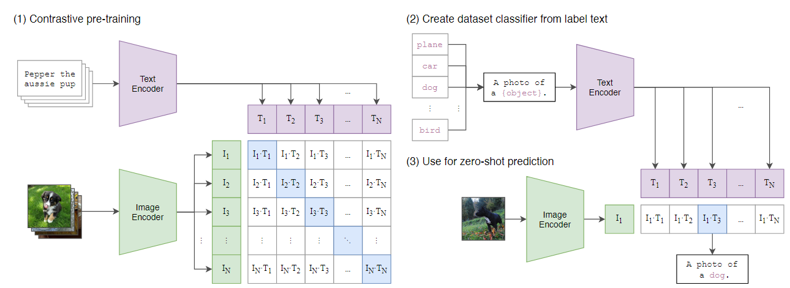
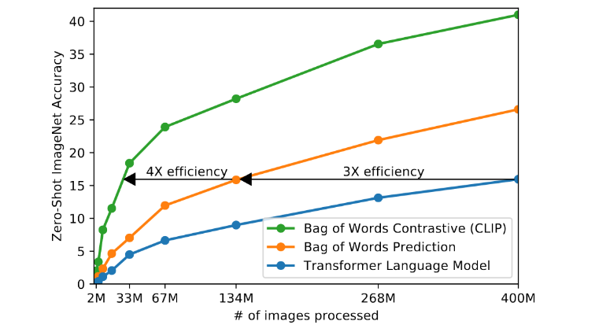
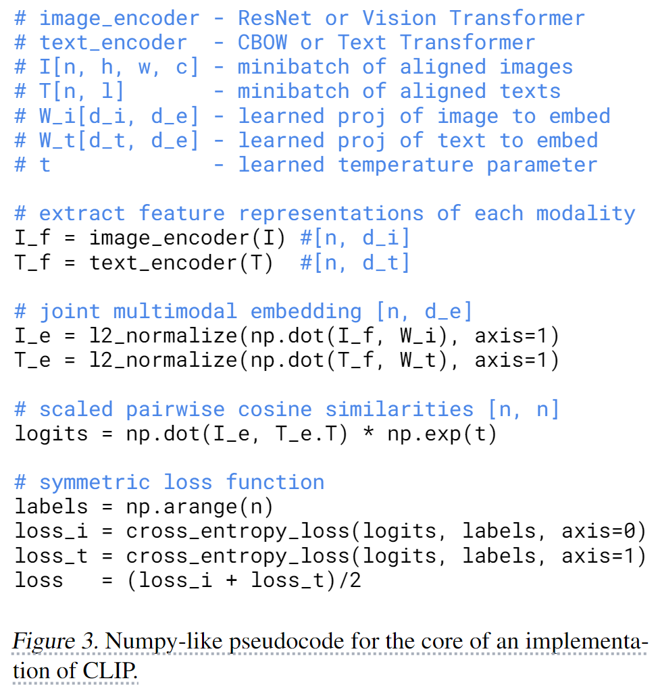
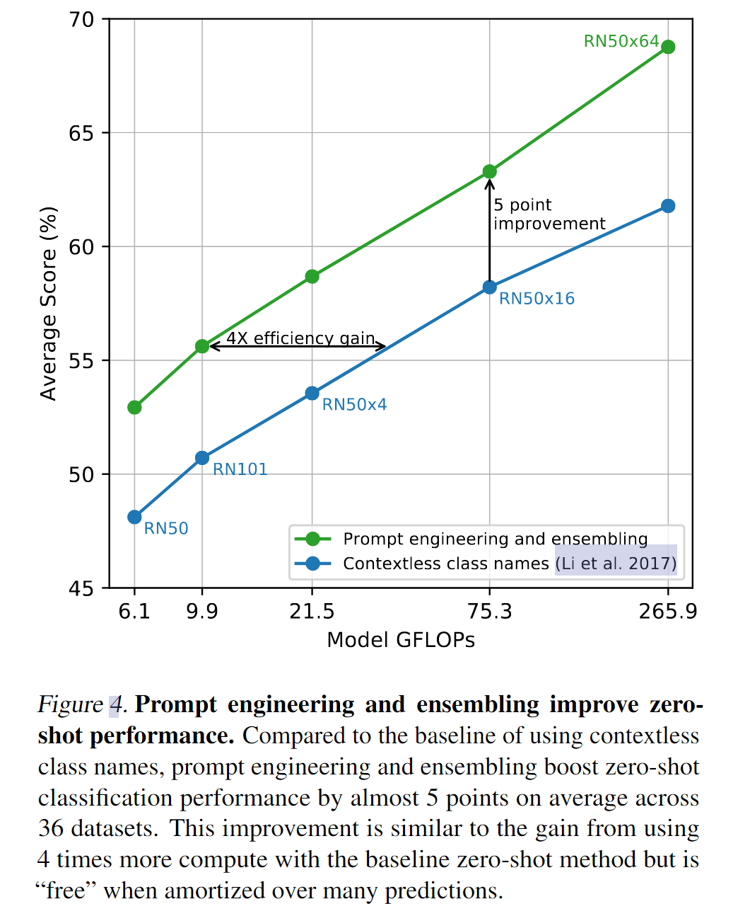
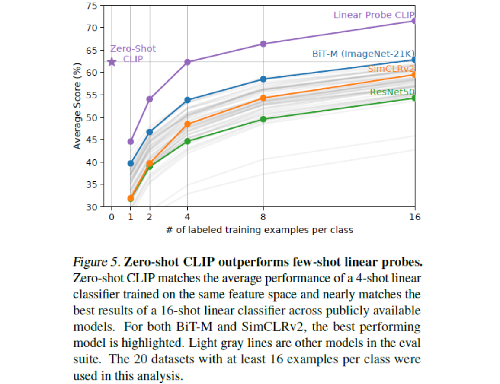
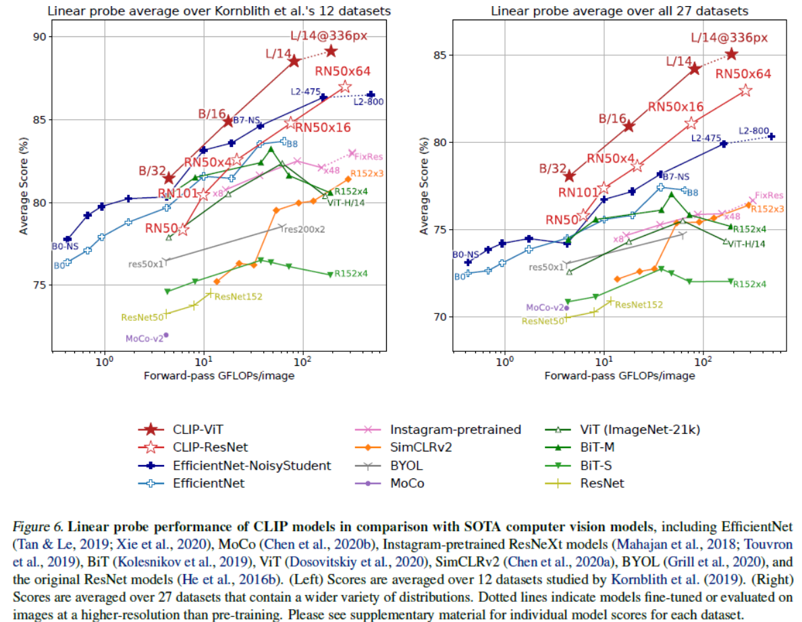
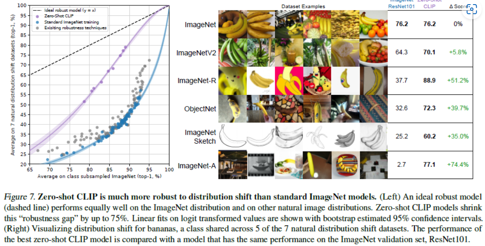

# CLIP：Learning Transferable Visual Models From Natural Language Supervision

<script src="https://polyfill.io/v3/polyfill.min.js?features=es6"></script>
<script src="https://cdn.jsdelivr.net/npm/mathjax@3/es5/tex-chtml.js"></script>

!!! info "相关信息"
    <font size = 3.5>
    
    论文地址：[Learning Transferable Visual Models From Natural Language Supervision](https://arxiv.org/pdf/2103.00020v1)

    代码（Pytorch版）:[https://github.com/openai/CLIP](https://github.com/openai/CLIP)

    </font>

### 概述

```CLIP（Contrastive Language-Image Pre-training）```是由OpenAI开发的一种多模态（文本和图像）预训练模型。```CLIP```模型通过学习如何对文本和图像进行对比，从而实现跨模态的理解。这种对比学习的方法使得CLIP能够在没有任何监督标签的情况下学习到文本和图像之间的语义关系。

```CLIP```模型的核心思想是将文本和图像嵌入到一个共同的语义空间中，使得相关的文本描述和图像内容在这个空间中的表示彼此靠近，而不相关的则远离。这种设计使得CLIP模型能够在各种任务上表现出色，如图像分类、图像检索、文本分类等。

### 方法



CLIP方法的核心是从自然语言监督信号中学习感知的想法（learning perception from supervision contained in natural language），工作在自然语言上的方法可以被动地从互联网上海量文本中蕴含的监督中学习。与大多数无监督或自监督学习方法相比，从自然语言中学习也有一个重要的优势，因为它不仅"只是"学习一种表示，而且还将这种表示与语言联系起来，从而实现灵活的零样本迁移（zero-shot transfer）。

使用自然语言监督的一个主要动机是<B>互联网上公开提供的大量数据</B>。由于现有的数据集没有充分反映这种可能性，只考虑这些数据集的结果会低估这一研究领域的潜力。为了解决这个问题，本文构建了一个新的数据集，从互联网上的各种公开来源收集了4亿（图像, 文本）对(WebImageText)。为了尽可能广泛地涵盖一组视觉概念，本文搜索（图像, 文字）对作为构造过程的一部分，其中文本包括一组50万个查询结果中的一个。为大致保持类别均衡，每个查询最多包含2万个（图像, 文本）对。

由于训练的计算量过于庞大，且<B>训练效率是成功扩展自然语言监督的关键</B>，因此本文采用了对比学习的方法，探索训练一个系统来解决可能的更容易的代理任务，即<B>预测图像与哪段文本最匹配，而不是预测文本的确切单词</B>。



### 伪代码



给定一个```batch```的$N$个（图像, 文本）对，```CLIP```被训练用来预测在一个```batch```中实际发生的$N×N$个可能的（图像, 文本）对的相似度。为此，```CLIP```通过联合训练图像编码器和文本编码器来学习多模态嵌入空间，以最大化```batch```内$N$个真实对的图像和文本嵌入的余弦相似度，同时最小化$N^2−N$个错误对的嵌入的余弦相似度。在这些相似度得分上优化一个对称的交叉熵损失。

本文从头开始训练```CLIP```，不需要初始化带有ImageNet权重的图像编码器或带有预训练权重的文本编码器。在图像和文本编码器后使用一个线性投影，将每个编码器的表示映射到多模态嵌入空间。

由于我们的预训练数据集规模庞大，过拟合并不是主要的担忧。我们从零开始训练```CLIP```，既不使用ImageNet权重初始化图像编码器，也不使用预训练权重初始化文本编码器。我们<B>仅使用线性投影将每个编码器的表示映射到多模态嵌入空间</B>。

### 选择和扩展模型

架构一：

使用 ```ResNet50``` 作为图像编码器的基础架构，因为其广泛使用和经过验证的性能

- 我们使用```ResNet```和```blur pooling```，对原始版本进行了一些修改。

- 我们还用注意力池化（```attention pooling```）机制替换了全局平均池化层（```global average pooling layer```）。

- ```Attention pooling``` 被实现为单层的 “```transformer``` 式”多头 ```QKV attention```，其中 ```query``` 以图像的 ```global average-pooled representation``` 为条件。

架构二：

使用了 ```Vision Transformer (ViT)```，只对 ```transformer``` 之前的组合 ```patch``` 和 ```position embeddings``` 添加了额外的 ```layer normalization```，并使用了稍微不同的初始化方案。

- 作为基础，我们使用具有 8 个注意力头的 12 层 512 宽的模型。```Transformer``` 对文本小写的字节对编码 (```byte pair encoding，BPE```) ```representation``` 进行操作。

- 文本序列用 ```[SOS]``` 和 ```[EOS]``` 标记括起来，```transformer``` 最高层在 ```[EOS]``` 标记处的激活被用作文本的 ```feature representation```，该文本被层归一化，然后线性投影到多模态 ```embedding space```。

- ```Masked self-attention``` 在文本编码器中使用，以保留添加语言建模作为辅助目标的能力，尽管对此的探索留给未来的工作。

### PROMPT ENGINEERING AND ENSEMBLING

绝大多数数据集仅使用标签的数字id对图像进行注释，并包含一个将这些 id 映射回其英文名称的文件。因此会产生一个常见的问题：词语的多义性。当类的名称是提供给```CLIP```文本编码器的唯一信息时，由于缺乏上下文，无法区分哪个词义的含义。譬如construction cranes与cranes。

另一个问题是预训练数据集中，部分提供的与图像配对的文本很少（仅一个单词），而通常文本是以某种方式描述图像的完整句子。因此，为了弥补文本长度的差距，我们使用一个简单的提示模板（prompt template）： ```"A photo of a {label}."```，有助于指定文本是关于图像内容的。这通常会比仅使用标签文本的基线提高性能。我们还发现针对不同的任务定制提示词模板可以显著提高zero-shot的性能，如对于```Oxford-IIIT Pets```数据集，使用```"A photo of a {label}, a type of pet."```，对于satellite image classification datasets，我们采用```"a satellite photo of a {label}."```。



同样的，我们创造了80个不同的上下文提示模板```"A photo of a big {label}"``` ```"A photo of a small {label}"``` ```"A photo hard to see {label}"```等等。在 ImageNet 上，这比上面讨论的单个默认提示提高了3.5%的性能。

.png)

查看```zero-shot CLIP```明显表现不佳的地方，我们发现 ```zero-shot CLIP``` 在卫星图像分类（```EuroSAT``` 和 ```RESISC45```）、淋巴结肿瘤检测（```PatchCamelyon```）、在合成场景（```CLEVRCounts```）中计数、自动驾驶相关任务 [如德国交通标志识别（```GTSRB```）、识别到最近汽车的距离（```KITTI Distance```）]等几个专门的、复杂的或抽象的任务上相当薄弱。这些结果凸显了 ```zero-shot CLIP``` 在更复杂任务上的较差能力。



> 反直觉的是，当```CLIP```从 ```zero-shot``` 过渡到 ```few-shot``` 时，反而会导致性能出现下降



上图总结了我们的发现。使用 CLIP 训练的模型可以很好地扩展计算，我们最大的模型在总体得分和计算效率方面略优于最佳模型（```Noisy Student EfficientNet-L2```）。 我们还发现 ```CLIP-ViT``` 的计算效率比 ```CLIP- ResNets```高出约 3 倍，这在我们的计算预算内实现了更高的整体性能，这个结果重复了 Dosovitskiy 等人的发现：<B>在足够大的数据集上训练时，```ViT```比```CNN```的计算效率更高。</B>



```zero-shot CLIP``` 模型都大大提高了有效鲁棒性，并将 ```ImageNet``` 精度与分布迁移下的精度之间的差距降低了高达 75%。直觉上来说，```zero-shot```模型不能利用仅适用于测试集特定分布的虚假相关性或模式，因为它没有针对该分布进行训练，因此```zero-shot```模型可能表现出更高的有效鲁棒性。

### 限制


- 在有训练分割的数据集上，```zero-shot CLIP```的表现平均而言与在```ResNet-50```特征上的简单监督基线（线性分类器）相当。在大多数这些数据集上，这一基线的表现现在<B>已远低于整体的最新技术水平</B>，需要进一步研究如何提高```CLIP```在计算和数据效率上的表现。

- ```CLIP```的```zero-shot```表现在几种<B>特定任务</B>上还是比特定任务的模型的效果差，例如区分汽车型号、花的品种和飞机的变型。```CLIP```还在<B>更抽象和系统性的任务上遇到困难</B>，如计算图像中物体的数量。最后，对于那些不太可能包含在CLIP预训练数据集中的<B>新颖任务</B>，例如分类照片中最近的汽车距离，```CLIP```的表现可能接近随机。

-  ```zero-shot CLIP```对于超出分布范围的数据泛化性仍然很差：```zero-shot CLIP```在手写数字```MNIST```数据集上仅仅获得88%的准确率。对原始像素进行Logistic回归，表现比```zero-shot CLIP```更好。这主要是由于庞大的预训练数据集中几乎没有类似```MNIST```数字的图像，这表明```CLIP```对解决深度学习模型的脆弱泛化问题几乎没有帮助。相反，CLIP试图规避问题，并希望通过在如此庞大和多样的数据集上训练，所有数据将有效地处于分布内。正如MNIST所证明的，这是一个天真的假设，很容易被违反。

### 结论

```CLIP```模型学习在预训练期间执行各种各样的任务，然后通过自然语言提示来利用这些任务学习，从而实现向许多现有数据集的 ```zero-shot``` 迁移。在足够大的规模下，这种方法的性能可与监督模型相媲美，但仍有很大的改进空间。

<details> 
<summary>CLIP</summary>

```python
from collections import OrderedDict
from typing import Tuple, Union

import numpy as np
import torch
import torch.nn.functional as F
from torch import nn


class Bottleneck(nn.Module):
    expansion = 4

    def __init__(self, inplanes, planes, stride=1):
        super().__init__()

        # all conv layers have stride 1. an avgpool is performed after the second convolution when stride > 1
        self.conv1 = nn.Conv2d(inplanes, planes, 1, bias=False)
        self.bn1 = nn.BatchNorm2d(planes)
        self.relu1 = nn.ReLU(inplace=True)

        self.conv2 = nn.Conv2d(planes, planes, 3, padding=1, bias=False)
        self.bn2 = nn.BatchNorm2d(planes)
        self.relu2 = nn.ReLU(inplace=True)

        self.avgpool = nn.AvgPool2d(stride) if stride > 1 else nn.Identity()

        self.conv3 = nn.Conv2d(planes, planes * self.expansion, 1, bias=False)
        self.bn3 = nn.BatchNorm2d(planes * self.expansion)
        self.relu3 = nn.ReLU(inplace=True)

        self.downsample = None
        self.stride = stride

        if stride > 1 or inplanes != planes * Bottleneck.expansion:
            # downsampling layer is prepended with an avgpool, and the subsequent convolution has stride 1
            self.downsample = nn.Sequential(OrderedDict([
                ("-1", nn.AvgPool2d(stride)),
                ("0", nn.Conv2d(inplanes, planes * self.expansion, 1, stride=1, bias=False)),
                ("1", nn.BatchNorm2d(planes * self.expansion))
            ]))

    def forward(self, x: torch.Tensor):
        identity = x

        out = self.relu1(self.bn1(self.conv1(x)))
        out = self.relu2(self.bn2(self.conv2(out)))
        out = self.avgpool(out)
        out = self.bn3(self.conv3(out))

        if self.downsample is not None:
            identity = self.downsample(x)

        out += identity
        out = self.relu3(out)
        return out


class AttentionPool2d(nn.Module):
    def __init__(self, spacial_dim: int, embed_dim: int, num_heads: int, output_dim: int = None):
        super().__init__()
        self.positional_embedding = nn.Parameter(torch.randn(spacial_dim ** 2 + 1, embed_dim) / embed_dim ** 0.5)
        self.k_proj = nn.Linear(embed_dim, embed_dim)
        self.q_proj = nn.Linear(embed_dim, embed_dim)
        self.v_proj = nn.Linear(embed_dim, embed_dim)
        self.c_proj = nn.Linear(embed_dim, output_dim or embed_dim)
        self.num_heads = num_heads

    def forward(self, x):
        x = x.flatten(start_dim=2).permute(2, 0, 1)  # NCHW -> (HW)NC
        x = torch.cat([x.mean(dim=0, keepdim=True), x], dim=0)  # (HW+1)NC
        x = x + self.positional_embedding[:, None, :].to(x.dtype)  # (HW+1)NC
        x, _ = F.multi_head_attention_forward(
            query=x[:1], key=x, value=x,
            embed_dim_to_check=x.shape[-1],
            num_heads=self.num_heads,
            q_proj_weight=self.q_proj.weight,
            k_proj_weight=self.k_proj.weight,
            v_proj_weight=self.v_proj.weight,
            in_proj_weight=None,
            in_proj_bias=torch.cat([self.q_proj.bias, self.k_proj.bias, self.v_proj.bias]),
            bias_k=None,
            bias_v=None,
            add_zero_attn=False,
            dropout_p=0,
            out_proj_weight=self.c_proj.weight,
            out_proj_bias=self.c_proj.bias,
            use_separate_proj_weight=True,
            training=self.training,
            need_weights=False
        )
        return x.squeeze(0)


class ModifiedResNet(nn.Module):
    """
    A ResNet class that is similar to torchvision's but contains the following changes:
    - There are now 3 "stem" convolutions as opposed to 1, with an average pool instead of a max pool.
    - Performs anti-aliasing strided convolutions, where an avgpool is prepended to convolutions with stride > 1
    - The final pooling layer is a QKV attention instead of an average pool
    """

    def __init__(self, layers, output_dim, heads, input_resolution=224, width=64):
        super().__init__()
        self.output_dim = output_dim
        self.input_resolution = input_resolution

        # the 3-layer stem
        self.conv1 = nn.Conv2d(3, width // 2, kernel_size=3, stride=2, padding=1, bias=False)
        self.bn1 = nn.BatchNorm2d(width // 2)
        self.relu1 = nn.ReLU(inplace=True)
        self.conv2 = nn.Conv2d(width // 2, width // 2, kernel_size=3, padding=1, bias=False)
        self.bn2 = nn.BatchNorm2d(width // 2)
        self.relu2 = nn.ReLU(inplace=True)
        self.conv3 = nn.Conv2d(width // 2, width, kernel_size=3, padding=1, bias=False)
        self.bn3 = nn.BatchNorm2d(width)
        self.relu3 = nn.ReLU(inplace=True)
        self.avgpool = nn.AvgPool2d(2)

        # residual layers
        self._inplanes = width  # this is a *mutable* variable used during construction
        self.layer1 = self._make_layer(width, layers[0])
        self.layer2 = self._make_layer(width * 2, layers[1], stride=2)
        self.layer3 = self._make_layer(width * 4, layers[2], stride=2)
        self.layer4 = self._make_layer(width * 8, layers[3], stride=2)

        embed_dim = width * 32  # the ResNet feature dimension
        self.attnpool = AttentionPool2d(input_resolution // 32, embed_dim, heads, output_dim)

    def _make_layer(self, planes, blocks, stride=1):
        layers = [Bottleneck(self._inplanes, planes, stride)]

        self._inplanes = planes * Bottleneck.expansion
        for _ in range(1, blocks):
            layers.append(Bottleneck(self._inplanes, planes))

        return nn.Sequential(*layers)

    def forward(self, x):
        def stem(x):
            x = self.relu1(self.bn1(self.conv1(x)))
            x = self.relu2(self.bn2(self.conv2(x)))
            x = self.relu3(self.bn3(self.conv3(x)))
            x = self.avgpool(x)
            return x

        x = x.type(self.conv1.weight.dtype)
        x = stem(x)
        x = self.layer1(x)
        x = self.layer2(x)
        x = self.layer3(x)
        x = self.layer4(x)
        x = self.attnpool(x)

        return x


class LayerNorm(nn.LayerNorm):
    """Subclass torch's LayerNorm to handle fp16."""

    def forward(self, x: torch.Tensor):
        orig_type = x.dtype
        ret = super().forward(x.type(torch.float32))
        return ret.type(orig_type)


class QuickGELU(nn.Module):
    def forward(self, x: torch.Tensor):
        return x * torch.sigmoid(1.702 * x)


class ResidualAttentionBlock(nn.Module):
    def __init__(self, d_model: int, n_head: int, attn_mask: torch.Tensor = None):
        super().__init__()

        self.attn = nn.MultiheadAttention(d_model, n_head)
        self.ln_1 = LayerNorm(d_model)
        self.mlp = nn.Sequential(OrderedDict([
            ("c_fc", nn.Linear(d_model, d_model * 4)),
            ("gelu", QuickGELU()),
            ("c_proj", nn.Linear(d_model * 4, d_model))
        ]))
        self.ln_2 = LayerNorm(d_model)
        self.attn_mask = attn_mask

    def attention(self, x: torch.Tensor):
        self.attn_mask = self.attn_mask.to(dtype=x.dtype, device=x.device) if self.attn_mask is not None else None
        return self.attn(x, x, x, need_weights=False, attn_mask=self.attn_mask)[0]

    def forward(self, x: torch.Tensor):
        x = x + self.attention(self.ln_1(x))
        x = x + self.mlp(self.ln_2(x))
        return x


class Transformer(nn.Module):
    def __init__(self, width: int, layers: int, heads: int, attn_mask: torch.Tensor = None):
        super().__init__()
        self.width = width
        self.layers = layers
        self.resblocks = nn.Sequential(*[ResidualAttentionBlock(width, heads, attn_mask) for _ in range(layers)])

    def forward(self, x: torch.Tensor):
        return self.resblocks(x)


class VisionTransformer(nn.Module):
    def __init__(self, input_resolution: int, patch_size: int, width: int, layers: int, heads: int, output_dim: int):
        super().__init__()
        self.input_resolution = input_resolution
        self.output_dim = output_dim
        self.conv1 = nn.Conv2d(in_channels=3, out_channels=width, kernel_size=patch_size, stride=patch_size, bias=False)

        scale = width ** -0.5
        self.class_embedding = nn.Parameter(scale * torch.randn(width))
        self.positional_embedding = nn.Parameter(scale * torch.randn((input_resolution // patch_size) ** 2 + 1, width))
        self.ln_pre = LayerNorm(width)

        self.transformer = Transformer(width, layers, heads)

        self.ln_post = LayerNorm(width)
        self.proj = nn.Parameter(scale * torch.randn(width, output_dim))

    def forward(self, x: torch.Tensor):
        x = self.conv1(x)  # shape = [*, width, grid, grid]
        x = x.reshape(x.shape[0], x.shape[1], -1)  # shape = [*, width, grid ** 2]
        x = x.permute(0, 2, 1)  # shape = [*, grid ** 2, width]
        x = torch.cat([self.class_embedding.to(x.dtype) + torch.zeros(x.shape[0], 1, x.shape[-1], dtype=x.dtype, device=x.device), x], dim=1)  # shape = [*, grid ** 2 + 1, width]
        x = x + self.positional_embedding.to(x.dtype)
        x = self.ln_pre(x)

        x = x.permute(1, 0, 2)  # NLD -> LND
        x = self.transformer(x)
        x = x.permute(1, 0, 2)  # LND -> NLD

        x = self.ln_post(x[:, 0, :])

        if self.proj is not None:
            x = x @ self.proj

        return x


class CLIP(nn.Module):
    def __init__(self,
                 embed_dim: int,
                 # vision
                 image_resolution: int,
                 vision_layers: Union[Tuple[int, int, int, int], int],
                 vision_width: int,
                 vision_patch_size: int,
                 # text
                 context_length: int,
                 vocab_size: int,
                 transformer_width: int,
                 transformer_heads: int,
                 transformer_layers: int
                 ):
        super().__init__()

        self.context_length = context_length

        if isinstance(vision_layers, (tuple, list)):
            vision_heads = vision_width * 32 // 64
            self.visual = ModifiedResNet(
                layers=vision_layers,
                output_dim=embed_dim,
                heads=vision_heads,
                input_resolution=image_resolution,
                width=vision_width
            )
        else:
            vision_heads = vision_width // 64
            self.visual = VisionTransformer(
                input_resolution=image_resolution,
                patch_size=vision_patch_size,
                width=vision_width,
                layers=vision_layers,
                heads=vision_heads,
                output_dim=embed_dim
            )

        self.transformer = Transformer(
            width=transformer_width,
            layers=transformer_layers,
            heads=transformer_heads,
            attn_mask=self.build_attention_mask()
        )

        self.vocab_size = vocab_size
        self.token_embedding = nn.Embedding(vocab_size, transformer_width)
        self.positional_embedding = nn.Parameter(torch.empty(self.context_length, transformer_width))
        self.ln_final = LayerNorm(transformer_width)

        self.text_projection = nn.Parameter(torch.empty(transformer_width, embed_dim))
        self.logit_scale = nn.Parameter(torch.ones([]) * np.log(1 / 0.07))

        self.initialize_parameters()

    def initialize_parameters(self):
        nn.init.normal_(self.token_embedding.weight, std=0.02)
        nn.init.normal_(self.positional_embedding, std=0.01)

        if isinstance(self.visual, ModifiedResNet):
            if self.visual.attnpool is not None:
                std = self.visual.attnpool.c_proj.in_features ** -0.5
                nn.init.normal_(self.visual.attnpool.q_proj.weight, std=std)
                nn.init.normal_(self.visual.attnpool.k_proj.weight, std=std)
                nn.init.normal_(self.visual.attnpool.v_proj.weight, std=std)
                nn.init.normal_(self.visual.attnpool.c_proj.weight, std=std)

            for resnet_block in [self.visual.layer1, self.visual.layer2, self.visual.layer3, self.visual.layer4]:
                for name, param in resnet_block.named_parameters():
                    if name.endswith("bn3.weight"):
                        nn.init.zeros_(param)

        proj_std = (self.transformer.width ** -0.5) * ((2 * self.transformer.layers) ** -0.5)
        attn_std = self.transformer.width ** -0.5
        fc_std = (2 * self.transformer.width) ** -0.5
        for block in self.transformer.resblocks:
            nn.init.normal_(block.attn.in_proj_weight, std=attn_std)
            nn.init.normal_(block.attn.out_proj.weight, std=proj_std)
            nn.init.normal_(block.mlp.c_fc.weight, std=fc_std)
            nn.init.normal_(block.mlp.c_proj.weight, std=proj_std)

        if self.text_projection is not None:
            nn.init.normal_(self.text_projection, std=self.transformer.width ** -0.5)

    def build_attention_mask(self):
        # lazily create causal attention mask, with full attention between the vision tokens
        # pytorch uses additive attention mask; fill with -inf
        mask = torch.empty(self.context_length, self.context_length)
        mask.fill_(float("-inf"))
        mask.triu_(1)  # zero out the lower diagonal
        return mask

    @property
    def dtype(self):
        return self.visual.conv1.weight.dtype

    def encode_image(self, image):
        return self.visual(image.type(self.dtype))

    def encode_text(self, text):
        x = self.token_embedding(text).type(self.dtype)  # [batch_size, n_ctx, d_model]

        x = x + self.positional_embedding.type(self.dtype)
        x = x.permute(1, 0, 2)  # NLD -> LND
        x = self.transformer(x)
        x = x.permute(1, 0, 2)  # LND -> NLD
        x = self.ln_final(x).type(self.dtype)

        # x.shape = [batch_size, n_ctx, transformer.width]
        # take features from the eot embedding (eot_token is the highest number in each sequence)
        x = x[torch.arange(x.shape[0]), text.argmax(dim=-1)] @ self.text_projection

        return x

    def forward(self, image, text):
        image_features = self.encode_image(image)
        text_features = self.encode_text(text)

        # normalized features
        image_features = image_features / image_features.norm(dim=1, keepdim=True)
        text_features = text_features / text_features.norm(dim=1, keepdim=True)

        # cosine similarity as logits
        logit_scale = self.logit_scale.exp()
        logits_per_image = logit_scale * image_features @ text_features.t()
        logits_per_text = logits_per_image.t()

        # shape = [global_batch_size, global_batch_size]
        return logits_per_image, logits_per_text


def convert_weights(model: nn.Module):
    """Convert applicable model parameters to fp16"""

    def _convert_weights_to_fp16(l):
        if isinstance(l, (nn.Conv1d, nn.Conv2d, nn.Linear)):
            l.weight.data = l.weight.data.half()
            if l.bias is not None:
                l.bias.data = l.bias.data.half()

        if isinstance(l, nn.MultiheadAttention):
            for attr in [*[f"{s}_proj_weight" for s in ["in", "q", "k", "v"]], "in_proj_bias", "bias_k", "bias_v"]:
                tensor = getattr(l, attr)
                if tensor is not None:
                    tensor.data = tensor.data.half()

        for name in ["text_projection", "proj"]:
            if hasattr(l, name):
                attr = getattr(l, name)
                if attr is not None:
                    attr.data = attr.data.half()

    model.apply(_convert_weights_to_fp16)


def build_model(state_dict: dict):
    vit = "visual.proj" in state_dict

    if vit:
        vision_width = state_dict["visual.conv1.weight"].shape[0]
        vision_layers = len([k for k in state_dict.keys() if k.startswith("visual.") and k.endswith(".attn.in_proj_weight")])
        vision_patch_size = state_dict["visual.conv1.weight"].shape[-1]
        grid_size = round((state_dict["visual.positional_embedding"].shape[0] - 1) ** 0.5)
        image_resolution = vision_patch_size * grid_size
    else:
        counts: list = [len(set(k.split(".")[2] for k in state_dict if k.startswith(f"visual.layer{b}"))) for b in [1, 2, 3, 4]]
        vision_layers = tuple(counts)
        vision_width = state_dict["visual.layer1.0.conv1.weight"].shape[0]
        output_width = round((state_dict["visual.attnpool.positional_embedding"].shape[0] - 1) ** 0.5)
        vision_patch_size = None
        assert output_width ** 2 + 1 == state_dict["visual.attnpool.positional_embedding"].shape[0]
        image_resolution = output_width * 32

    embed_dim = state_dict["text_projection"].shape[1]
    context_length = state_dict["positional_embedding"].shape[0]
    vocab_size = state_dict["token_embedding.weight"].shape[0]
    transformer_width = state_dict["ln_final.weight"].shape[0]
    transformer_heads = transformer_width // 64
    transformer_layers = len(set(k.split(".")[2] for k in state_dict if k.startswith("transformer.resblocks")))

    model = CLIP(
        embed_dim,
        image_resolution, vision_layers, vision_width, vision_patch_size,
        context_length, vocab_size, transformer_width, transformer_heads, transformer_layers
    )

    for key in ["input_resolution", "context_length", "vocab_size"]:
        if key in state_dict:
            del state_dict[key]

    convert_weights(model)
    model.load_state_dict(state_dict)
    return model.eval()
```

</details> 