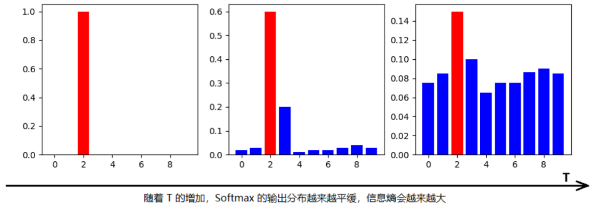
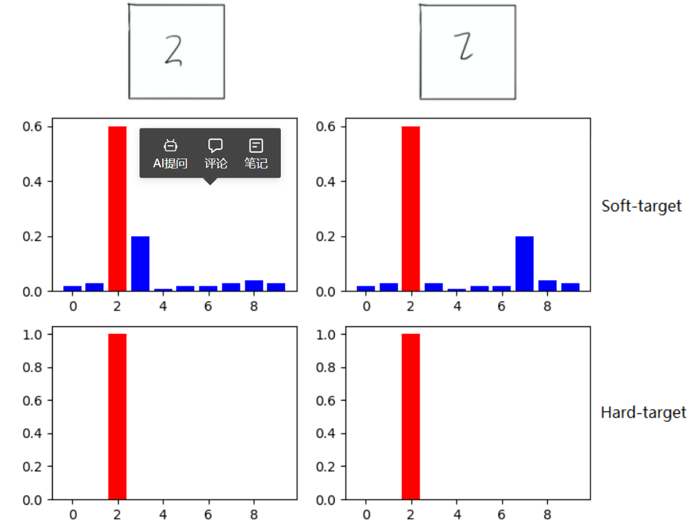
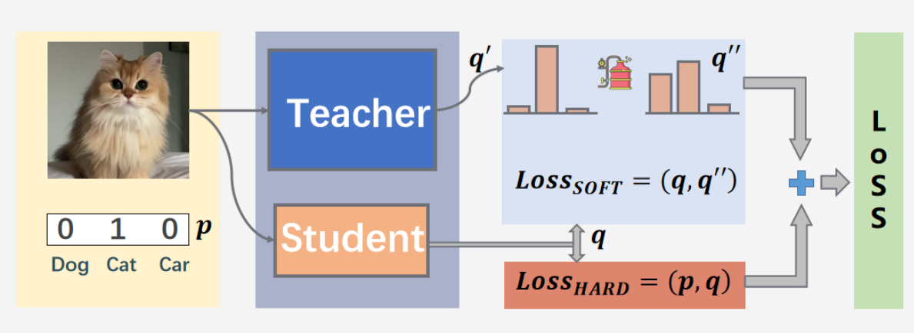
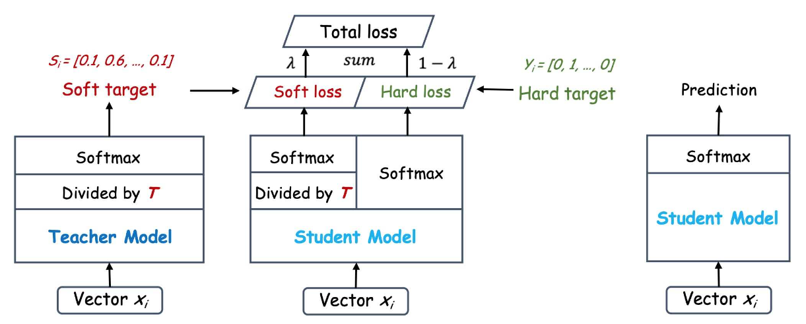

# Distilling the Knowledge in a Neural Network

<script src="https://polyfill.io/v3/polyfill.min.js?features=es6"></script>
<script src="https://cdn.jsdelivr.net/npm/mathjax@3/es5/tex-chtml.js"></script>

!!! info "相关信息"
    <font size = 3.5>
    
    论文地址：[Distilling the Knowledge in a Neural Network](https://arxiv.org/pdf/1503.02531v1)

    代码（Pytorch版）:[https://github.com/HobbitLong/RepDistiller](https://github.com/HobbitLong/RepDistiller/blob/master/distiller_zoo/KD.py)


    </font>

### 概述

```Knowledge Distillaion```是一种使用经过训练的大型网络中的知识来训练小型网络的方法；即从大型网络中提炼知识。

直接在数据和标签上训练时，具有正则化或模型集合（使用 dropout）的大型模型比小型模型的概化效果更好。但是，在大型模型的帮助下，可以训练小模型以更好地进行概括。较小的模型在生产中更好：速度更快、计算更少、内存更少。

经过训练的模型的输出概率比标签提供的信息更多，因为它也会为错误的类分配非零概率。这些概率告诉我们，样本有可能属于某些类别。例如，在对数字进行分类时，当给定数字 7 的图像时，广义模型会给出7的高概率，给2的概率很小但不是零，而给其他数字分配几乎为零的概率。蒸馏利用这些信息来更好地训练小型模型。

### 主要内容

神经网络通常使用```softmax```来生成类概率，我们引入<B>蒸馏温度$T$</B>使得在分类上产生更柔和（softer）的概率分布:

$$
q_i = \frac{exp(z_i/T)}{\sum_j exp(z_j/T)}
$$

- $T=1$，表示网络输出```Softmax```的类概率，当$T<1$时，概率分布比原始更 “陡峭”， 当$T→0$ 时, ```Softmax```的输出值会接近于```hard-target```，$T>1$时, 概率分布比原始更“平缓"

- $T=+\infty$，此时表示网络输出的逻辑单元，此时```softmax```的值是平均分布的



如图可知，使用大于1的蒸馏温度$T$，```softmax```的输出分布越来越平滑，信息熵也会越来越大，那么在```student```模型的训练过程中<B>对于负标签的关注也会增加</B>，特别是那些概率值显著高于平均概率值的负标签，即：

- 当```student```模型较小的时候，可以把温度调低，这样负标签的干扰就会减少

- 当想从负标签中学到一些信息量的时候，可以把温度$T$调高

​如在```MNIST```数据集中做手写体数字识别任务，假设某个输入的“2”更加形似"3"，```softmax```的输出值中"3"对应的概率会比其他负标签类别高；而另一个"2"更加形似"7"，则这个样本分配给"7"对应的概率会比其他负标签类别高。这两个"2"对应的```Hard-target```的值是相同的，但是它们的```Soft-target```却是不同的，由此我们可见```Soft-target```蕴含着比```Hard-target```更多的信息。



```teacher```模型就是一个大的复杂模型，效果好，```student```模型是一个轻量型的模型，我们的目的是将```student```模型经过训练后达到```teacher```模型的效果，或者比```teacher```模型更好。对于训练```student```模型中损失函数主要由两部分组成，一部分使```teacher```模型经过蒸馏温度$T$后得到```soft-loss```，还有自己模型与真实标签的普通训练后得到的```hard-loss```。总的```loss = soft-loss + hard-loss```。

$$
Loss = (1-\alpha) T^2 L_{soft} + \alpha L_{hard}
$$



我们发现最好的结果是在第二个目标函数上使用较低的权值（$\alpha$较小）。<B>由于软目标产生的梯度缩放（$1/T^{2}$） ，因而在同时使用软目标和硬目标时，将软目标的梯度乘以$T^{2}$是非常重要的</B>。这确保了在实验过程中，如果用于蒸馏的温度发生改变，那么硬目标和软目标的相对贡献大致保持不变。 



假设P为教师模型的软标签，Q为学生模型的预测，则两者的KL散度作为loss：

$$
D_{KL}(P||Q) = \sum_{i} P_{i} \log (\frac{P_{i}}{Q_{i}}) = \sum_{i} P_{i} (\log(P_i) - \log(Q_i)) 
$$

```python
class DistillKL(nn.Module):
    """Distilling the Knowledge in a Neural Network"""
    def __init__(self, T):
        super(DistillKL, self).__init__()
        self.T = T # 蒸馏温度

    def forward(self, y_s, y_t):
        '''
        y_s: student model output
        y_t: teacher model output
        '''
        p_s = F.log_softmax(y_s/self.T, dim=1)
        p_t = F.softmax(y_t/self.T, dim=1)
        loss = F.kl_div(p_s, p_t, size_average=False) * (self.T**2) / y_s.shape[0]
        return loss
```

### 简洁实现（nn.labml.ai）

```python
import torch
import torch.nn.functional
from torch import nn

class Configs(CIFAR10Configs):
    """
    ## Configurations

    This extends from [`CIFAR10Configs`](../experiments/cifar10.html) which defines all the
    dataset related configurations, optimizer, and a training loop.
    """
    # The small model
    model: SmallModel
    # The large model
    large: LargeModel
    # KL Divergence loss for soft targets
    kl_div_loss = nn.KLDivLoss(log_target=True) # KL散度损失
    # Cross entropy loss for true label loss
    loss_func = nn.CrossEntropyLoss()
    # Temperature, $T$
    temperature: float = 5.
    # Weight for soft targets loss.
    #
    # The gradients produced by soft targets get scaled by $\frac{1}{T^2}$.
    # To compensate for this the paper suggests scaling the soft targets loss
    # by a factor of $T^2$
    soft_targets_weight: float = 100.
    # Weight for true label cross entropy loss
    label_loss_weight: float = 0.5

    def step(self, batch: any, batch_idx: BatchIndex):
        """
        ### Training/validation step

        We define a custom training/validation step to include the distillation
        """

        # Training/Evaluation mode for the small model
        self.model.train(self.mode.is_train)
        # Large model in evaluation mode
        self.large.eval()

        # Move data to the device
        data, target = batch[0].to(self.device), batch[1].to(self.device)

        # Update global step (number of samples processed) when in training mode
        if self.mode.is_train:
            tracker.add_global_step(len(data))

        # Get the output logits, $v_i$, from the large model
        with torch.no_grad():
            large_logits = self.large(data)

        # Get the output logits, $z_i$, from the small model
        output = self.model(data)

        # Soft targets
        # $$p_i = \frac{\exp (\frac{v_i}{T})}{\sum_j \exp (\frac{v_j}{T})}$$
        soft_targets = nn.functional.log_softmax(large_logits / self.temperature, dim=-1)
        # Temperature adjusted probabilities of the small model
        # $$q_i = \frac{\exp (\frac{z_i}{T})}{\sum_j \exp (\frac{z_j}{T})}$$
        soft_prob = nn.functional.log_softmax(output / self.temperature, dim=-1)

        # Calculate the soft targets loss
        soft_targets_loss = self.kl_div_loss(soft_prob, soft_targets)
        # Calculate the true label loss
        label_loss = self.loss_func(output, target)
        # Weighted sum of the two losses
        loss = self.soft_targets_weight * soft_targets_loss + self.label_loss_weight * label_loss
        # Log the losses
        tracker.add({"loss.kl_div.": soft_targets_loss,
                     "loss.nll": label_loss,
                     "loss.": loss})

        # Calculate and log accuracy
        self.accuracy(output, target)
        self.accuracy.track()

        # Train the model
        if self.mode.is_train:
            # Calculate gradients
            loss.backward() 
            # Take optimizer step
            self.optimizer.step()
            # Log the model parameters and gradients on last batch of every epoch
            if batch_idx.is_last:
                tracker.add('model', self.model)
            # Clear the gradients
            self.optimizer.zero_grad()

        # Save the tracked metrics
        tracker.save()


@option(Configs.large)
def _large_model(c: Configs):
    """
    ### Create large model
    """
    return LargeModel().to(c.device)


@option(Configs.model)
def _small_student_model(c: Configs):
    """
    ### Create small model
    """
    return SmallModel().to(c.device)


def get_saved_model(run_uuid: str, checkpoint: int):
    """
    ### Load [trained large model](large.html)
    """

    from labml_nn.distillation.large import Configs as LargeConfigs

    # In evaluation mode (no recording)
    experiment.evaluate()
    # Initialize configs of the large model training experiment
    conf = LargeConfigs()
    # Load saved configs
    experiment.configs(conf, experiment.load_configs(run_uuid))
    # Set models for saving/loading
    experiment.add_pytorch_models({'model': conf.model})
    # Set which run and checkpoint to load
    experiment.load(run_uuid, checkpoint)
    # Start the experiment - this will load the model, and prepare everything
    experiment.start()

    # Return the model
    return conf.model


def main(run_uuid: str, checkpoint: int):
    """
    Train a small model with distillation
    """
    # Load saved model
    large_model = get_saved_model(run_uuid, checkpoint)
    # Create experiment
    experiment.create(name='distillation', comment='cifar10')
    # Create configurations
    conf = Configs()
    # Set the loaded large model
    conf.large = large_model
    # Load configurations
    experiment.configs(conf, {
        'optimizer.optimizer': 'Adam',
        'optimizer.learning_rate': 2.5e-4,
        'model': '_small_student_model',
    })
    # Set model for saving/loading
    experiment.add_pytorch_models({'model': conf.model})
    # Start experiment from scratch
    experiment.load(None, None)
    # Start the experiment and run the training loop
    with experiment.start():
        conf.run()


#
if __name__ == '__main__':
    main('d46cd53edaec11eb93c38d6538aee7d6', 1_000_000)
```